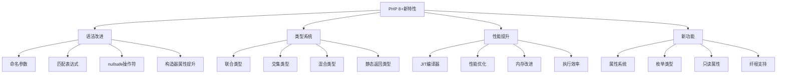

# PHP 8+新特性

## 🎯 学习目标
- 掌握PHP 8.0+的核心新特性
- 理解命名参数、联合类型、匹配表达式等语法改进
- 学会使用属性、枚举、只读属性等新功能
- 了解性能提升和JIT编译器的影响

## 📚 核心概念

### PHP 8+特性架构



### PHP版本特性对比

| 特性 | PHP 7.4 | PHP 8.0 | PHP 8.1 | PHP 8.2 | PHP 8.3 |
|------|---------|---------|---------|---------|---------|
| 命名参数 | ❌ | ✅ | ✅ | ✅ | ✅ |
| 联合类型 | ❌ | ✅ | ✅ | ✅ | ✅ |
| 匹配表达式 | ❌ | ✅ | ✅ | ✅ | ✅ |
| 属性系统 | ❌ | ✅ | ✅ | ✅ | ✅ |
| 枚举类型 | ❌ | ❌ | ✅ | ✅ | ✅ |
| 只读属性 | ❌ | ❌ | ✅ | ✅ | ✅ |
| 纤程 | ❌ | ❌ | ✅ | ✅ | ✅ |
| 交集类型 | ❌ | ❌ | ❌ | ✅ | ✅ |
| 只读类 | ❌ | ❌ | ❌ | ✅ | ✅ |

## 🔧 PHP 8+新特性实现

### 命名参数和联合类型
```php
<?php
// 1. 命名参数示例
class UserService {
    // 传统方式 - 位置参数
    public function createUser($name, $email, $age = null, $city = null, $country = 'China') {
        return [
            'name' => $name,
            'email' => $email,
            'age' => $age,
            'city' => $city,
            'country' => $country
        ];
    }
    
    // 使用命名参数 - 更清晰
    public function createUserWithNamedParams($name, $email, $age = null, $city = null, $country = 'China') {
        // 可以跳过可选参数，只指定需要的参数
        return $this->createUser(
            name: $name,
            email: $email,
            country: $country  // 跳过 age 和 city
        );
    }
}

// 2. 联合类型示例
class TypeSystem {
    // 联合类型 - 可以是 string 或 int
    public function processId(string|int $id): string {
        return "Processing ID: " . (string)$id;
    }
    
    // 联合类型 - 可以是 User 或 null
    public function findUser(int $id): User|null {
        // 模拟查找用户
        if ($id > 0) {
            return new User($id, "User{$id}");
        }
        return null;
    }
    
    // 联合类型 - 多种类型
    public function formatValue(string|int|float|bool $value): string {
        return match (gettype($value)) {
            'string' => "String: {$value}",
            'integer' => "Integer: {$value}",
            'double' => "Float: {$value}",
            'boolean' => "Boolean: " . ($value ? 'true' : 'false'),
            default => "Unknown type"
        };
    }
    
    // 联合类型 - 数组或对象
    public function processData(array|object $data): string {
        if (is_array($data)) {
            return "Array with " . count($data) . " elements";
        }
        return "Object of class " . get_class($data);
    }
}

// 3. 交集类型示例 (PHP 8.2+)
interface Serializable {
    public function serialize(): string;
}

interface Jsonable {
    public function toJson(): string;
}

class DataProcessor {
    // 交集类型 - 必须同时实现两个接口
    public function process(Serializable&Jsonable $data): string {
        $serialized = $data->serialize();
        $json = $data->toJson();
        return "Serialized: {$serialized}, JSON: {$json}";
    }
}

// 4. 混合类型示例
class MixedTypeExample {
    // mixed 类型 - 可以是任何类型
    public function handleMixed(mixed $data): string {
        return match (true) {
            is_string($data) => "String: {$data}",
            is_int($data) => "Integer: {$data}",
            is_float($data) => "Float: {$data}",
            is_bool($data) => "Boolean: " . ($data ? 'true' : 'false'),
            is_array($data) => "Array with " . count($data) . " elements",
            is_object($data) => "Object: " . get_class($data),
            is_null($data) => "Null value",
            default => "Unknown type"
        };
    }
    
    // 静态返回类型
    public static function create(): static {
        return new static();
    }
}

// 5. 用户类示例
class User {
    public function __construct(
        public int $id,
        public string $name,
        public string $email
    ) {}
    
    public function getId(): int {
        return $this->id;
    }
    
    public function getName(): string {
        return $this->name;
    }
    
    public function getEmail(): string {
        return $this->email;
    }
}

// 使用示例
echo "=== PHP 8+新特性示例 ===\n";

try {
    // 命名参数测试
    $userService = new UserService();
    $user = $userService->createUserWithNamedParams(
        name: "John Doe",
        email: "john@example.com",
        country: "USA"
    );
    echo "命名参数结果: " . json_encode($user) . "\n";
    
    // 联合类型测试
    $typeSystem = new TypeSystem();
    echo "处理ID: " . $typeSystem->processId("123") . "\n";
    echo "处理ID: " . $typeSystem->processId(456) . "\n";
    
    $foundUser = $typeSystem->findUser(1);
    echo "找到用户: " . ($foundUser ? $foundUser->getName() : "未找到") . "\n";
    
    echo "格式化值: " . $typeSystem->formatValue("Hello") . "\n";
    echo "格式化值: " . $typeSystem->formatValue(42) . "\n";
    echo "格式化值: " . $typeSystem->formatValue(3.14) . "\n";
    echo "格式化值: " . $typeSystem->formatValue(true) . "\n";
    
    // 混合类型测试
    $mixedExample = new MixedTypeExample();
    echo "混合类型: " . $mixedExample->handleMixed("test") . "\n";
    echo "混合类型: " . $mixedExample->handleMixed(123) . "\n";
    echo "混合类型: " . $mixedExample->handleMixed(['a', 'b', 'c']) . "\n";
    echo "混合类型: " . $mixedExample->handleMixed(null) . "\n";
    
} catch (Exception $e) {
    echo "错误: " . $e->getMessage() . "\n";
}
?>
```

### 匹配表达式和属性系统
```php
<?php
// 1. 匹配表达式示例
class MatchExpressionExample {
    // 传统 switch 语句
    public function getStatusMessageOld($status): string {
        switch ($status) {
            case 'pending':
                return '等待处理';
            case 'processing':
                return '处理中';
            case 'completed':
                return '已完成';
            case 'failed':
                return '处理失败';
            default:
                return '未知状态';
        }
    }
    
    // 新的 match 表达式
    public function getStatusMessage($status): string {
        return match ($status) {
            'pending' => '等待处理',
            'processing' => '处理中',
            'completed' => '已完成',
            'failed' => '处理失败',
            default => '未知状态'
        };
    }
    
    // 复杂匹配表达式
    public function calculateDiscount($userType, $orderAmount): float {
        return match (true) {
            $userType === 'vip' && $orderAmount >= 1000 => 0.2,
            $userType === 'vip' && $orderAmount >= 500 => 0.15,
            $userType === 'premium' && $orderAmount >= 500 => 0.1,
            $userType === 'regular' && $orderAmount >= 1000 => 0.05,
            default => 0.0
        };
    }
    
    // 多值匹配
    public function getDayType($day): string {
        return match ($day) {
            'Monday', 'Tuesday', 'Wednesday', 'Thursday', 'Friday' => '工作日',
            'Saturday', 'Sunday' => '周末',
            default => '无效日期'
        };
    }
}

// 2. 属性系统示例
// 定义属性类
#[Attribute]
class Route {
    public function __construct(
        public string $path,
        public string $method = 'GET',
        public array $middleware = []
    ) {}
}

#[Attribute]
class Middleware {
    public function __construct(public string $name) {}
}

#[Attribute]
class Cache {
    public function __construct(
        public int $ttl = 3600,
        public string $key = ''
    ) {}
}

// 使用属性的控制器
class UserController {
    #[Route('/users', 'GET')]
    #[Cache(ttl: 1800, key: 'users_list')]
    public function getUsers(): array {
        return [
            ['id' => 1, 'name' => 'John Doe'],
            ['id' => 2, 'name' => 'Jane Smith']
        ];
    }
    
    #[Route('/users/{id}', 'GET')]
    #[Middleware('auth')]
    public function getUser(int $id): array {
        return ['id' => $id, 'name' => "User {$id}"];
    }
    
    #[Route('/users', 'POST')]
    #[Middleware('auth')]
    #[Middleware('admin')]
    public function createUser(array $data): array {
        return ['id' => 123, 'name' => $data['name']];
    }
}

// 3. 属性反射器
class AttributeReflector {
    public function getRouteAttributes(string $className, string $methodName): array {
        $reflection = new ReflectionMethod($className, $methodName);
        $attributes = $reflection->getAttributes(Route::class);
        
        $routes = [];
        foreach ($attributes as $attribute) {
            $route = $attribute->newInstance();
            $routes[] = [
                'path' => $route->path,
                'method' => $route->method,
                'middleware' => $route->middleware
            ];
        }
        
        return $routes;
    }
    
    public function getMiddlewareAttributes(string $className, string $methodName): array {
        $reflection = new ReflectionMethod($className, $methodName);
        $attributes = $reflection->getAttributes(Middleware::class);
        
        $middlewares = [];
        foreach ($attributes as $attribute) {
            $middleware = $attribute->newInstance();
            $middlewares[] = $middleware->name;
        }
        
        return $middlewares;
    }
    
    public function getCacheAttributes(string $className, string $methodName): array {
        $reflection = new ReflectionMethod($className, $methodName);
        $attributes = $reflection->getAttributes(Cache::class);
        
        $caches = [];
        foreach ($attributes as $attribute) {
            $cache = $attribute->newInstance();
            $caches[] = [
                'ttl' => $cache->ttl,
                'key' => $cache->key
            ];
        }
        
        return $caches;
    }
}

// 4. 构造器属性提升示例
class ModernUser {
    // 构造器属性提升 - 自动创建属性
    public function __construct(
        public int $id,
        public string $name,
        public string $email,
        public ?string $phone = null,
        public array $roles = []
    ) {
        // 构造器体可以为空，属性已自动创建
    }
    
    // 传统方式对比
    private int $id;
    private string $name;
    private string $email;
    private ?string $phone;
    private array $roles;
    
    public function __constructOld(
        int $id,
        string $name,
        string $email,
        ?string $phone = null,
        array $roles = []
    ) {
        $this->id = $id;
        $this->name = $name;
        $this->email = $email;
        $this->phone = $phone;
        $this->roles = $roles;
    }
}

// 使用示例
echo "=== 匹配表达式和属性系统示例 ===\n";

try {
    // 匹配表达式测试
    $matchExample = new MatchExpressionExample();
    
    echo "状态消息: " . $matchExample->getStatusMessage('pending') . "\n";
    echo "状态消息: " . $matchExample->getStatusMessage('completed') . "\n";
    
    echo "折扣计算: " . $matchExample->calculateDiscount('vip', 1200) . "\n";
    echo "折扣计算: " . $matchExample->calculateDiscount('regular', 800) . "\n";
    
    echo "日期类型: " . $matchExample->getDayType('Monday') . "\n";
    echo "日期类型: " . $matchExample->getDayType('Saturday') . "\n";
    
    // 属性系统测试
    $reflector = new AttributeReflector();
    
    $routes = $reflector->getRouteAttributes('UserController', 'getUsers');
    echo "路由属性: " . json_encode($routes) . "\n";
    
    $middlewares = $reflector->getMiddlewareAttributes('UserController', 'createUser');
    echo "中间件属性: " . json_encode($middlewares) . "\n";
    
    $caches = $reflector->getCacheAttributes('UserController', 'getUsers');
    echo "缓存属性: " . json_encode($caches) . "\n";
    
    // 构造器属性提升测试
    $user = new ModernUser(
        id: 1,
        name: "John Doe",
        email: "john@example.com",
        phone: "+1234567890",
        roles: ['user', 'admin']
    );
    
    echo "用户ID: " . $user->id . "\n";
    echo "用户姓名: " . $user->name . "\n";
    echo "用户邮箱: " . $user->email . "\n";
    echo "用户电话: " . $user->phone . "\n";
    echo "用户角色: " . implode(', ', $user->roles) . "\n";
    
} catch (Exception $e) {
    echo "错误: " . $e->getMessage() . "\n";
}
?>
```

### 枚举类型和只读属性
```php
<?php
// 1. 枚举类型示例
enum UserStatus: string {
    case PENDING = 'pending';
    case ACTIVE = 'active';
    case SUSPENDED = 'suspended';
    case DELETED = 'deleted';
    
    // 枚举方法
    public function getDisplayName(): string {
        return match ($this) {
            self::PENDING => '等待激活',
            self::ACTIVE => '已激活',
            self::SUSPENDED => '已暂停',
            self::DELETED => '已删除'
        };
    }
    
    public function isActive(): bool {
        return $this === self::ACTIVE;
    }
    
    public function canLogin(): bool {
        return match ($this) {
            self::ACTIVE => true,
            default => false
        };
    }
}

// 2. 整数枚举
enum Priority: int {
    case LOW = 1;
    case MEDIUM = 2;
    case HIGH = 3;
    case URGENT = 4;
    
    public function getColor(): string {
        return match ($this) {
            self::LOW => 'green',
            self::MEDIUM => 'yellow',
            self::HIGH => 'orange',
            self::URGENT => 'red'
        };
    }
}

// 3. 枚举接口实现
interface Describable {
    public function getDescription(): string;
}

enum TaskType: string implements Describable {
    case BUG_FIX = 'bug_fix';
    case FEATURE = 'feature';
    case REFACTOR = 'refactor';
    case DOCUMENTATION = 'documentation';
    
    public function getDescription(): string {
        return match ($this) {
            self::BUG_FIX => '修复软件缺陷',
            self::FEATURE => '开发新功能',
            self::REFACTOR => '代码重构',
            self::DOCUMENTATION => '编写文档'
        };
    }
    
    public function getEstimatedHours(): int {
        return match ($this) {
            self::BUG_FIX => 2,
            self::FEATURE => 8,
            self::REFACTOR => 4,
            self::DOCUMENTATION => 1
        };
    }
}

// 4. 只读属性示例
class ReadOnlyExample {
    // 只读属性 - 只能在构造器中设置
    public readonly string $id;
    public readonly string $name;
    public readonly DateTime $createdAt;
    
    public function __construct(string $id, string $name) {
        $this->id = $id;
        $this->name = $name;
        $this->createdAt = new DateTime();
    }
    
    // 只读属性不能修改
    public function updateName(string $newName): void {
        // $this->name = $newName; // 这会导致错误
        echo "只读属性不能修改\n";
    }
}

// 5. 只读类示例 (PHP 8.2+)
readonly class ReadOnlyUser {
    public function __construct(
        public int $id,
        public string $name,
        public string $email,
        public array $roles = []
    ) {}
    
    public function getId(): int {
        return $this->id;
    }
    
    public function getName(): string {
        return $this->name;
    }
    
    public function getEmail(): string {
        return $this->email;
    }
    
    public function getRoles(): array {
        return $this->roles;
    }
}

// 6. 使用枚举的类
class UserManager {
    private array $users = [];
    
    public function createUser(string $name, string $email): array {
        $id = uniqid();
        $user = [
            'id' => $id,
            'name' => $name,
            'email' => $email,
            'status' => UserStatus::PENDING,
            'created_at' => new DateTime()
        ];
        
        $this->users[$id] = $user;
        return $user;
    }
    
    public function activateUser(string $userId): bool {
        if (!isset($this->users[$userId])) {
            return false;
        }
        
        $this->users[$userId]['status'] = UserStatus::ACTIVE;
        return true;
    }
    
    public function getUserStatus(string $userId): ?UserStatus {
        return $this->users[$userId]['status'] ?? null;
    }
    
    public function canUserLogin(string $userId): bool {
        $status = $this->getUserStatus($userId);
        return $status ? $status->canLogin() : false;
    }
}

// 7. 任务管理系统
class TaskManager {
    private array $tasks = [];
    
    public function createTask(
        string $title,
        TaskType $type,
        Priority $priority
    ): array {
        $id = uniqid();
        $task = [
            'id' => $id,
            'title' => $title,
            'type' => $type,
            'priority' => $priority,
            'status' => 'pending',
            'created_at' => new DateTime()
        ];
        
        $this->tasks[$id] = $task;
        return $task;
    }
    
    public function getTaskInfo(string $taskId): ?array {
        if (!isset($this->tasks[$taskId])) {
            return null;
        }
        
        $task = $this->tasks[$taskId];
        return [
            'id' => $task['id'],
            'title' => $task['title'],
            'type' => $task['type']->value,
            'type_description' => $task['type']->getDescription(),
            'priority' => $task['priority']->value,
            'priority_color' => $task['priority']->getColor(),
            'estimated_hours' => $task['type']->getEstimatedHours(),
            'status' => $task['status']
        ];
    }
}

// 使用示例
echo "=== 枚举类型和只读属性示例 ===\n";

try {
    // 枚举类型测试
    $status = UserStatus::ACTIVE;
    echo "用户状态: " . $status->value . "\n";
    echo "显示名称: " . $status->getDisplayName() . "\n";
    echo "是否激活: " . ($status->isActive() ? '是' : '否') . "\n";
    echo "可以登录: " . ($status->canLogin() ? '是' : '否') . "\n";
    
    // 优先级枚举测试
    $priority = Priority::HIGH;
    echo "优先级: " . $priority->value . "\n";
    echo "颜色: " . $priority->getColor() . "\n";
    
    // 任务类型枚举测试
    $taskType = TaskType::FEATURE;
    echo "任务类型: " . $taskType->value . "\n";
    echo "描述: " . $taskType->getDescription() . "\n";
    echo "预估时间: " . $taskType->getEstimatedHours() . " 小时\n";
    
    // 用户管理器测试
    $userManager = new UserManager();
    $user = $userManager->createUser("John Doe", "john@example.com");
    echo "创建用户: " . json_encode($user) . "\n";
    
    $activated = $userManager->activateUser($user['id']);
    echo "激活用户: " . ($activated ? '成功' : '失败') . "\n";
    
    $canLogin = $userManager->canUserLogin($user['id']);
    echo "可以登录: " . ($canLogin ? '是' : '否') . "\n";
    
    // 任务管理器测试
    $taskManager = new TaskManager();
    $task = $taskManager->createTask(
        "实现用户认证功能",
        TaskType::FEATURE,
        Priority::HIGH
    );
    echo "创建任务: " . json_encode($task) . "\n";
    
    $taskInfo = $taskManager->getTaskInfo($task['id']);
    echo "任务信息: " . json_encode($taskInfo) . "\n";
    
    // 只读属性测试
    $readOnlyExample = new ReadOnlyExample("123", "Test User");
    echo "只读用户ID: " . $readOnlyExample->id . "\n";
    echo "只读用户姓名: " . $readOnlyExample->name . "\n";
    echo "创建时间: " . $readOnlyExample->createdAt->format('Y-m-d H:i:s') . "\n";
    
    // 只读类测试
    $readOnlyUser = new ReadOnlyUser(
        id: 1,
        name: "Jane Doe",
        email: "jane@example.com",
        roles: ['user', 'editor']
    );
    
    echo "只读类用户: " . $readOnlyUser->getName() . "\n";
    echo "用户角色: " . implode(', ', $readOnlyUser->getRoles()) . "\n";
    
} catch (Exception $e) {
    echo "错误: " . $e->getMessage() . "\n";
}
?>
```

### 纤程和异步编程
```php
<?php
// 1. 纤程基础示例
class FiberExample {
    public function basicFiber(): void {
        $fiber = new Fiber(function (): void {
            echo "纤程开始执行\n";
            
            // 暂停纤程，返回值给调用者
            $value = Fiber::suspend('第一次暂停');
            echo "纤程恢复，收到值: {$value}\n";
            
            // 再次暂停
            $value = Fiber::suspend('第二次暂停');
            echo "纤程恢复，收到值: {$value}\n";
            
            echo "纤程执行完成\n";
        });
        
        echo "启动纤程\n";
        $value = $fiber->start();
        echo "纤程暂停，返回值: {$value}\n";
        
        echo "恢复纤程\n";
        $value = $fiber->resume('恢复数据1');
        echo "纤程暂停，返回值: {$value}\n";
        
        echo "再次恢复纤程\n";
        $fiber->resume('恢复数据2');
        
        echo "纤程状态: " . $this->getFiberStatus($fiber) . "\n";
    }
    
    private function getFiberStatus(Fiber $fiber): string {
        return match ($fiber->getStatus()) {
            Fiber::STATUS_CREATED => '已创建',
            Fiber::STATUS_RUNNING => '运行中',
            Fiber::STATUS_SUSPENDED => '已暂停',
            Fiber::STATUS_TERMINATED => '已终止',
            default => '未知状态'
        };
    }
}

// 2. 异步任务处理器
class AsyncTaskProcessor {
    private array $fibers = [];
    private array $results = [];
    
    public function addTask(string $name, callable $task): void {
        $this->fibers[$name] = new Fiber($task);
    }
    
    public function executeTasks(): array {
        // 启动所有纤程
        foreach ($this->fibers as $name => $fiber) {
            if ($fiber->getStatus() === Fiber::STATUS_CREATED) {
                $this->results[$name] = $fiber->start();
            }
        }
        
        // 处理暂停的纤程
        while ($this->hasSuspendedFibers()) {
            foreach ($this->fibers as $name => $fiber) {
                if ($fiber->getStatus() === Fiber::STATUS_SUSPENDED) {
                    $this->results[$name] = $fiber->resume();
                }
            }
        }
        
        return $this->results;
    }
    
    private function hasSuspendedFibers(): bool {
        foreach ($this->fibers as $fiber) {
            if ($fiber->getStatus() === Fiber::STATUS_SUSPENDED) {
                return true;
            }
        }
        return false;
    }
    
    public function getTaskStatus(): array {
        $status = [];
        foreach ($this->fibers as $name => $fiber) {
            $status[$name] = $this->getFiberStatus($fiber);
        }
        return $status;
    }
    
    private function getFiberStatus(Fiber $fiber): string {
        return match ($fiber->getStatus()) {
            Fiber::STATUS_CREATED => '已创建',
            Fiber::STATUS_RUNNING => '运行中',
            Fiber::STATUS_SUSPENDED => '已暂停',
            Fiber::STATUS_TERMINATED => '已终止',
            default => '未知状态'
        };
    }
}

// 3. 模拟异步I/O操作
class AsyncIO {
    public function simulateNetworkRequest(string $url, int $delay = 1000000): string {
        // 模拟网络延迟
        usleep($delay);
        return "Response from {$url}";
    }
    
    public function simulateDatabaseQuery(string $query, int $delay = 500000): array {
        // 模拟数据库查询延迟
        usleep($delay);
        return [
            'query' => $query,
            'result' => 'Query executed successfully',
            'rows' => rand(1, 100)
        ];
    }
    
    public function simulateFileOperation(string $filename, int $delay = 200000): string {
        // 模拟文件操作延迟
        usleep($delay);
        return "File {$filename} processed";
    }
}

// 4. 纤程任务示例
class FiberTasks {
    private AsyncIO $io;
    
    public function __construct() {
        $this->io = new AsyncIO();
    }
    
    public function createNetworkTask(string $url): callable {
        return function () use ($url): string {
            echo "开始网络请求: {$url}\n";
            $result = $this->io->simulateNetworkRequest($url, 100000);
            echo "网络请求完成: {$url}\n";
            return $result;
        };
    }
    
    public function createDatabaseTask(string $query): callable {
        return function () use ($query): array {
            echo "开始数据库查询: {$query}\n";
            $result = $this->io->simulateDatabaseQuery($query, 500000);
            echo "数据库查询完成: {$query}\n";
            return $result;
        };
    }
    
    public function createFileTask(string $filename): callable {
        return function () use ($filename): string {
            echo "开始文件操作: {$filename}\n";
            $result = $this->io->simulateFileOperation($filename, 200000);
            echo "文件操作完成: {$filename}\n";
            return $result;
        };
    }
}

// 5. 纤程调度器
class FiberScheduler {
    private array $fibers = [];
    private array $results = [];
    
    public function schedule(string $name, callable $task): void {
        $this->fibers[$name] = new Fiber($task);
    }
    
    public function run(): array {
        $startTime = microtime(true);
        
        // 启动所有纤程
        foreach ($this->fibers as $name => $fiber) {
            if ($fiber->getStatus() === Fiber::STATUS_CREATED) {
                $this->results[$name] = $fiber->start();
            }
        }
        
        // 轮询执行纤程
        while ($this->hasActiveFibers()) {
            foreach ($this->fibers as $name => $fiber) {
                if ($fiber->getStatus() === Fiber::STATUS_SUSPENDED) {
                    $this->results[$name] = $fiber->resume();
                }
            }
            
            // 避免忙等待
            usleep(1000);
        }
        
        $endTime = microtime(true);
        $this->results['_execution_time'] = $endTime - $startTime;
        
        return $this->results;
    }
    
    private function hasActiveFibers(): bool {
        foreach ($this->fibers as $fiber) {
            if (in_array($fiber->getStatus(), [Fiber::STATUS_RUNNING, Fiber::STATUS_SUSPENDED])) {
                return true;
            }
        }
        return false;
    }
    
    public function getExecutionTime(): float {
        return $this->results['_execution_time'] ?? 0;
    }
}

// 使用示例
echo "=== 纤程和异步编程示例 ===\n";

try {
    // 基础纤程测试
    $fiberExample = new FiberExample();
    $fiberExample->basicFiber();
    
    echo "\n=== 异步任务处理 ===\n";
    
    // 创建任务处理器
    $taskProcessor = new AsyncTaskProcessor();
    $fiberTasks = new FiberTasks();
    
    // 添加任务
    $taskProcessor->addTask('network', $fiberTasks->createNetworkTask('https://api.example.com/users'));
    $taskProcessor->addTask('database', $fiberTasks->createDatabaseTask('SELECT * FROM users'));
    $taskProcessor->addTask('file', $fiberTasks->createFileTask('data.json'));
    
    // 执行任务
    $startTime = microtime(true);
    $results = $taskProcessor->executeTasks();
    $endTime = microtime(true);
    
    echo "任务执行结果:\n";
    foreach ($results as $name => $result) {
        echo "  {$name}: " . (is_array($result) ? json_encode($result) : $result) . "\n";
    }
    
    echo "总执行时间: " . ($endTime - $startTime) . " 秒\n";
    
    echo "\n=== 纤程调度器 ===\n";
    
    // 创建调度器
    $scheduler = new FiberScheduler();
    
    // 调度任务
    $scheduler->schedule('task1', $fiberTasks->createNetworkTask('https://api1.example.com'));
    $scheduler->schedule('task2', $fiberTasks->createDatabaseTask('SELECT * FROM orders'));
    $scheduler->schedule('task3', $fiberTasks->createFileTask('config.json'));
    
    // 运行调度器
    $schedulerResults = $scheduler->run();
    
    echo "调度器执行结果:\n";
    foreach ($schedulerResults as $name => $result) {
        if ($name !== '_execution_time') {
            echo "  {$name}: " . (is_array($result) ? json_encode($result) : $result) . "\n";
        }
    }
    
    echo "调度器执行时间: " . $scheduler->getExecutionTime() . " 秒\n";
    
} catch (Exception $e) {
    echo "错误: " . $e->getMessage() . "\n";
}
?>
```

## 📊 最佳实践

### PHP 8+新特性最佳实践
```php
<?php
// PHP 8+新特性最佳实践

class PHP8PlusBestPractices {
    // 1. 类型系统最佳实践
    public static function getTypeSystemBestPractices() {
        return [
            '联合类型使用' => [
                '明确类型' => '使用联合类型明确函数参数和返回值类型',
                '类型检查' => '在函数内部进行类型检查和处理',
                '文档注释' => '在文档注释中说明联合类型的含义',
                '避免过度使用' => '避免创建过于复杂的联合类型'
            ],
            '枚举类型设计' => [
                '语义化命名' => '使用语义化的枚举值名称',
                '方法封装' => '为枚举添加有用的方法',
                '接口实现' => '让枚举实现相关接口',
                '值类型选择' => '根据使用场景选择合适的值类型'
            ],
            '属性系统应用' => [
                '元数据管理' => '使用属性管理元数据',
                '框架集成' => '在框架中集成属性系统',
                '文档生成' => '使用属性生成API文档',
                '验证规则' => '使用属性定义验证规则'
            ]
        ];
    }
    
    // 2. 性能优化最佳实践
    public static function getPerformanceBestPractices() {
        return [
            'JIT编译器优化' => [
                '热点代码' => '优化热点代码以充分利用JIT',
                '类型声明' => '使用类型声明帮助JIT优化',
                '避免动态特性' => '减少动态特性的使用',
                '内存管理' => '优化内存使用模式'
            ],
            '纤程使用' => [
                'I/O密集型任务' => '在I/O密集型任务中使用纤程',
                '避免CPU密集型' => '避免在CPU密集型任务中使用纤程',
                '资源管理' => '正确管理纤程资源',
                '错误处理' => '实现完善的错误处理机制'
            ],
            '内存优化' => [
                '只读属性' => '使用只读属性减少内存占用',
                '对象池' => '使用对象池重用对象',
                '垃圾回收' => '优化垃圾回收性能',
                '内存泄漏' => '防止内存泄漏'
            ]
        ];
    }
    
    // 3. 代码质量最佳实践
    public static function getCodeQualityBestPractices() {
        return [
            '代码可读性' => [
                '命名参数' => '使用命名参数提高代码可读性',
                '匹配表达式' => '使用匹配表达式替代复杂的switch',
                '类型提示' => '使用类型提示提高代码安全性',
                '文档注释' => '编写清晰的文档注释'
            ],
            '错误处理' => [
                '异常处理' => '使用异常处理机制',
                '错误恢复' => '实现错误恢复策略',
                '日志记录' => '记录详细的错误日志',
                '用户友好' => '提供用户友好的错误信息'
            ],
            '测试策略' => [
                '单元测试' => '编写全面的单元测试',
                '集成测试' => '进行集成测试',
                '性能测试' => '进行性能测试',
                '类型测试' => '测试类型系统的正确性'
            ]
        ];
    }
    
    // 4. 迁移策略最佳实践
    public static function getMigrationBestPractices() {
        return [
            '版本升级' => [
                '渐进式升级' => '采用渐进式升级策略',
                '兼容性检查' => '检查代码兼容性',
                '测试覆盖' => '确保充分的测试覆盖',
                '回滚计划' => '制定回滚计划'
            ],
            '新特性采用' => [
                '逐步采用' => '逐步采用新特性',
                '团队培训' => '培训团队使用新特性',
                '代码审查' => '在代码审查中检查新特性使用',
                '最佳实践' => '建立新特性使用最佳实践'
            ],
            '性能监控' => [
                '基准测试' => '建立性能基准',
                '监控指标' => '监控关键性能指标',
                '性能分析' => '定期进行性能分析',
                '优化迭代' => '持续优化性能'
            ]
        ];
    }
}

// 使用示例
echo "=== PHP 8+新特性最佳实践示例 ===\n";

try {
    // 类型系统最佳实践
    $typeSystemPractices = PHP8PlusBestPractices::getTypeSystemBestPractices();
    echo "类型系统最佳实践:\n";
    foreach ($typeSystemPractices as $category => $practices) {
        echo "  $category:\n";
        foreach ($practices as $practice => $description) {
            echo "    - $practice: $description\n";
        }
        echo "\n";
    }
    
    // 性能优化最佳实践
    $performancePractices = PHP8PlusBestPractices::getPerformanceBestPractices();
    echo "性能优化最佳实践:\n";
    foreach ($performancePractices as $category => $practices) {
        echo "  $category:\n";
        foreach ($practices as $practice => $description) {
            echo "    - $practice: $description\n";
        }
        echo "\n";
    }
    
    // 代码质量最佳实践
    $codeQualityPractices = PHP8PlusBestPractices::getCodeQualityBestPractices();
    echo "代码质量最佳实践:\n";
    foreach ($codeQualityPractices as $category => $practices) {
        echo "  $category:\n";
        foreach ($practices as $practice => $description) {
            echo "    - $practice: $description\n";
        }
        echo "\n";
    }
    
    // 迁移策略最佳实践
    $migrationPractices = PHP8PlusBestPractices::getMigrationBestPractices();
    echo "迁移策略最佳实践:\n";
    foreach ($migrationPractices as $category => $practices) {
        echo "  $category:\n";
        foreach ($practices as $practice => $description) {
            echo "    - $practice: $description\n";
        }
        echo "\n";
    }
    
} catch (Exception $e) {
    echo "错误: " . $e->getMessage() . "\n";
}
?>
```

## 🎓 学习建议

### 费曼学习法应用
1. **选择概念**: 选择PHP 8+新特性中的核心概念
2. **简化解释**: 用简单语言解释新特性的重要性
3. **识别盲点**: 发现理解不深入的地方
4. **重新学习**: 针对盲点进行深入学习

### 刻意练习重点
1. **类型系统**: 掌握联合类型、交集类型的使用
2. **枚举类型**: 学会设计和使用枚举类型
3. **属性系统**: 理解属性系统的应用场景
4. **纤程编程**: 掌握纤程的使用方法和最佳实践

## 🔗 相关链接
- [[02-JIT编译器|JIT编译器]]
- [[03-现代PHP特性|现代PHP特性]]
- [[04-云原生开发|云原生开发]]
- [[05-人工智能集成|人工智能集成]]
- [[06-未来发展趋势|未来发展趋势]]
- [[07-技术趋势分析|技术趋势分析]]
