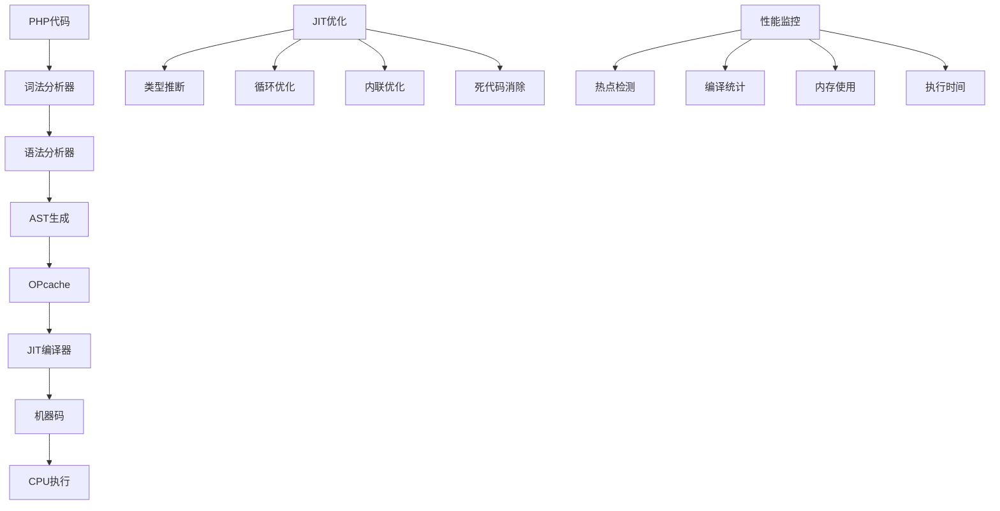

# JIT编译器

## 🎯 学习目标
- 理解JIT编译器的基本原理和工作机制
- 掌握PHP 8.0+中JIT编译器的配置和优化
- 学会分析和优化JIT编译器的性能
- 了解JIT编译器在不同场景下的应用效果

## 📚 核心概念

### JIT编译器架构



### JIT vs 解释执行对比

| 特性 | 解释执行 | JIT编译 | 优势 |
|------|----------|---------|------|
| 启动速度 | 快 | 慢 | 解释执行 |
| 执行速度 | 慢 | 快 | JIT编译 |
| 内存使用 | 低 | 高 | 解释执行 |
| 代码优化 | 无 | 有 | JIT编译 |
| 适用场景 | 脚本执行 | 长期运行 | 各有优势 |

## 🔧 JIT编译器实现

### JIT配置和优化
```php
<?php
// 1. JIT配置管理器
class JITConfigManager {
    private array $config;
    
    public function __construct() {
        $this->config = [
            'jit' => 'on',
            'jit_buffer_size' => '100M',
            'jit_hot_loop' => 64,
            'jit_hot_func' => 2,
            'jit_hot_return' => 2,
            'jit_hot_side_exit' => 2
        ];
    }
    
    // 获取JIT配置
    public function getJITConfig(): array {
        return [
            'jit_enabled' => ini_get('opcache.jit') === 'on',
            'jit_buffer_size' => ini_get('opcache.jit_buffer_size'),
            'jit_hot_loop' => ini_get('opcache.jit_hot_loop'),
            'jit_hot_func' => ini_get('opcache.jit_hot_func'),
            'jit_hot_return' => ini_get('opcache.jit_hot_return'),
            'jit_hot_side_exit' => ini_get('opcache.jit_hot_side_exit')
        ];
    }
    
    // 检查JIT是否可用
    public function isJITAvailable(): bool {
        return function_exists('opcache_get_status') && 
               ini_get('opcache.enable') === '1' &&
               ini_get('opcache.jit') === 'on';
    }
    
    // 获取OPcache状态
    public function getOPcacheStatus(): array {
        if (!function_exists('opcache_get_status')) {
            return ['error' => 'OPcache not available'];
        }
        
        $status = opcache_get_status(false);
        return $status ?: ['error' => 'Failed to get OPcache status'];
    }
    
    // 获取JIT统计信息
    public function getJITStats(): array {
        $status = $this->getOPcacheStatus();
        
        if (isset($status['error'])) {
            return $status;
        }
        
        return [
            'jit_enabled' => $status['jit']['enabled'] ?? false,
            'jit_buffer_size' => $status['jit']['buffer_size'] ?? 0,
            'jit_buffer_free' => $status['jit']['buffer_free'] ?? 0,
            'jit_compiled_functions' => $status['jit']['compiled_functions'] ?? 0,
            'jit_compiled_loops' => $status['jit']['compiled_loops'] ?? 0,
            'jit_compiled_traces' => $status['jit']['compiled_traces'] ?? 0
        ];
    }
    
    // 优化JIT配置
    public function optimizeJITConfig(string $workload = 'general'): array {
        $configs = [
            'general' => [
                'jit_buffer_size' => '100M',
                'jit_hot_loop' => 64,
                'jit_hot_func' => 2,
                'jit_hot_return' => 2,
                'jit_hot_side_exit' => 2
            ],
            'cpu_intensive' => [
                'jit_buffer_size' => '200M',
                'jit_hot_loop' => 32,
                'jit_hot_func' => 1,
                'jit_hot_return' => 1,
                'jit_hot_side_exit' => 1
            ],
            'memory_intensive' => [
                'jit_buffer_size' => '50M',
                'jit_hot_loop' => 128,
                'jit_hot_func' => 4,
                'jit_hot_return' => 4,
                'jit_hot_side_exit' => 4
            ],
            'web_application' => [
                'jit_buffer_size' => '150M',
                'jit_hot_loop' => 48,
                'jit_hot_func' => 2,
                'jit_hot_return' => 2,
                'jit_hot_side_exit' => 2
            ]
        ];
        
        return $configs[$workload] ?? $configs['general'];
    }
}

// 2. JIT性能分析器
class JITPerformanceAnalyzer {
    private array $metrics;
    private float $startTime;
    
    public function __construct() {
        $this->metrics = [];
        $this->startTime = microtime(true);
    }
    
    // 开始性能分析
    public function startAnalysis(string $name): void {
        $this->metrics[$name] = [
            'start_time' => microtime(true),
            'start_memory' => memory_get_usage(true),
            'start_peak_memory' => memory_get_peak_usage(true)
        ];
    }
    
    // 结束性能分析
    public function endAnalysis(string $name): array {
        if (!isset($this->metrics[$name])) {
            return ['error' => 'Analysis not started'];
        }
        
        $endTime = microtime(true);
        $endMemory = memory_get_usage(true);
        $endPeakMemory = memory_get_peak_usage(true);
        
        $this->metrics[$name]['end_time'] = $endTime;
        $this->metrics[$name]['end_memory'] = $endMemory;
        $this->metrics[$name]['end_peak_memory'] = $endPeakMemory;
        
        $this->metrics[$name]['execution_time'] = $endTime - $this->metrics[$name]['start_time'];
        $this->metrics[$name]['memory_used'] = $endMemory - $this->metrics[$name]['start_memory'];
        $this->metrics[$name]['peak_memory_increase'] = $endPeakMemory - $this->metrics[$name]['start_peak_memory'];
        
        return $this->metrics[$name];
    }
    
    // 获取所有分析结果
    public function getAllResults(): array {
        return $this->metrics;
    }
    
    // 比较JIT性能
    public function compareJITPerformance(callable $function, int $iterations = 1000): array {
        $results = [];
        
        // 预热JIT
        for ($i = 0; $i < 100; $i++) {
            $function();
        }
        
        // 测试执行时间
        $this->startAnalysis('jit_performance');
        for ($i = 0; $i < $iterations; $i++) {
            $function();
        }
        $jitResults = $this->endAnalysis('jit_performance');
        
        $results['jit'] = $jitResults;
        $results['iterations'] = $iterations;
        $results['avg_execution_time'] = $jitResults['execution_time'] / $iterations;
        
        return $results;
    }
}

// 3. JIT优化建议器
class JITOptimizationAdvisor {
    private JITConfigManager $configManager;
    private JITPerformanceAnalyzer $analyzer;
    
    public function __construct() {
        $this->configManager = new JITConfigManager();
        $this->analyzer = new JITPerformanceAnalyzer();
    }
    
    // 分析代码并给出优化建议
    public function analyzeCode(string $code): array {
        $suggestions = [];
        
        // 检查循环优化
        if (preg_match_all('/for\s*\([^)]*\)\s*\{[^}]*\}/', $code, $matches)) {
            $suggestions[] = [
                'type' => 'loop_optimization',
                'message' => '检测到循环，建议使用JIT优化',
                'recommendation' => '确保循环执行次数足够多以触发JIT编译'
            ];
        }
        
        // 检查函数调用
        if (preg_match_all('/function\s+\w+/', $code, $matches)) {
            $suggestions[] = [
                'type' => 'function_optimization',
                'message' => '检测到函数定义，建议优化函数调用',
                'recommendation' => '减少函数调用开销，使用内联优化'
            ];
        }
        
        // 检查类型声明
        if (!preg_match('/:\s*(int|string|float|bool|array)/', $code)) {
            $suggestions[] = [
                'type' => 'type_declaration',
                'message' => '缺少类型声明，影响JIT优化',
                'recommendation' => '添加类型声明以帮助JIT编译器优化'
            ];
        }
        
        // 检查动态特性
        if (preg_match('/\$\w+\s*=\s*new\s+\$/', $code)) {
            $suggestions[] = [
                'type' => 'dynamic_features',
                'message' => '检测到动态特性，影响JIT性能',
                'recommendation' => '减少动态特性的使用，使用静态类型'
            ];
        }
        
        return $suggestions;
    }
    
    // 生成优化报告
    public function generateOptimizationReport(array $codeSamples): array {
        $report = [
            'jit_status' => $this->configManager->getJITStats(),
            'suggestions' => [],
            'performance_tips' => []
        ];
        
        foreach ($codeSamples as $name => $code) {
            $suggestions = $this->analyzeCode($code);
            $report['suggestions'][$name] = $suggestions;
        }
        
        // 添加性能优化建议
        $report['performance_tips'] = [
            '使用类型声明' => '为函数参数和返回值添加类型声明',
            '优化循环' => '确保循环执行次数足够多以触发JIT编译',
            '减少动态特性' => '避免使用动态类名、方法名等',
            '预热代码' => '在性能测试前预热代码以触发JIT编译',
            '监控JIT状态' => '定期监控JIT编译状态和性能指标'
        ];
        
        return $report;
    }
}

// 4. JIT基准测试
class JITBenchmark {
    private JITPerformanceAnalyzer $analyzer;
    
    public function __construct() {
        $this->analyzer = new JITPerformanceAnalyzer();
    }
    
    // 数学计算基准测试
    public function mathBenchmark(int $iterations = 1000000): array {
        $this->analyzer->startAnalysis('math_calculation');
        
        $result = 0;
        for ($i = 0; $i < $iterations; $i++) {
            $result += sqrt($i) * sin($i) + cos($i);
        }
        
        return $this->analyzer->endAnalysis('math_calculation');
    }
    
    // 数组操作基准测试
    public function arrayBenchmark(int $size = 10000): array {
        $this->analyzer->startAnalysis('array_operations');
        
        $array = range(1, $size);
        
        // 数组排序
        sort($array);
        
        // 数组过滤
        $filtered = array_filter($array, function($value) {
            return $value % 2 === 0;
        });
        
        // 数组映射
        $mapped = array_map(function($value) {
            return $value * 2;
        }, $filtered);
        
        return $this->analyzer->endAnalysis('array_operations');
    }
    
    // 字符串处理基准测试
    public function stringBenchmark(int $iterations = 100000): array {
        $this->analyzer->startAnalysis('string_operations');
        
        $text = "Hello, World! This is a test string for JIT optimization.";
        
        for ($i = 0; $i < $iterations; $i++) {
            $result = strtoupper($text);
            $result = str_replace(' ', '_', $result);
            $result = substr($result, 0, 20);
            $result = md5($result);
        }
        
        return $this->analyzer->endAnalysis('string_operations');
    }
    
    // 对象操作基准测试
    public function objectBenchmark(int $iterations = 100000): array {
        $this->analyzer->startAnalysis('object_operations');
        
        class TestObject {
            public int $value;
            
            public function __construct(int $value) {
                $this->value = $value;
            }
            
            public function getValue(): int {
                return $this->value;
            }
            
            public function setValue(int $value): void {
                $this->value = $value;
            }
        }
        
        $objects = [];
        for ($i = 0; $i < $iterations; $i++) {
            $obj = new TestObject($i);
            $obj->setValue($obj->getValue() * 2);
            $objects[] = $obj;
        }
        
        return $this->analyzer->endAnalysis('object_operations');
    }
    
    // 运行所有基准测试
    public function runAllBenchmarks(): array {
        $results = [];
        
        $results['math'] = $this->mathBenchmark(1000000);
        $results['array'] = $this->arrayBenchmark(10000);
        $results['string'] = $this->stringBenchmark(100000);
        $results['object'] = $this->objectBenchmark(100000);
        
        return $results;
    }
}

// 使用示例
echo "=== JIT编译器示例 ===\n";

try {
    // JIT配置管理器
    $configManager = new JITConfigManager();
    
    echo "JIT可用性: " . ($configManager->isJITAvailable() ? '是' : '否') . "\n";
    
    $jitConfig = $configManager->getJITConfig();
    echo "JIT配置: " . json_encode($jitConfig) . "\n";
    
    $jitStats = $configManager->getJITStats();
    echo "JIT统计: " . json_encode($jitStats) . "\n";
    
    // JIT性能分析器
    $analyzer = new JITPerformanceAnalyzer();
    
    // 测试函数
    $testFunction = function() {
        $sum = 0;
        for ($i = 0; $i < 1000; $i++) {
            $sum += $i * $i;
        }
        return $sum;
    };
    
    $performanceResults = $analyzer->compareJITPerformance($testFunction, 10000);
    echo "性能测试结果: " . json_encode($performanceResults) . "\n";
    
    // JIT优化建议器
    $advisor = new JITOptimizationAdvisor();
    
    $codeSample = '
    function calculateSum(int $n): int {
        $sum = 0;
        for ($i = 0; $i < $n; $i++) {
            $sum += $i;
        }
        return $sum;
    }
    ';
    
    $suggestions = $advisor->analyzeCode($codeSample);
    echo "优化建议: " . json_encode($suggestions) . "\n";
    
    // JIT基准测试
    $benchmark = new JITBenchmark();
    
    echo "\n=== 基准测试结果 ===\n";
    $benchmarkResults = $benchmark->runAllBenchmarks();
    
    foreach ($benchmarkResults as $test => $result) {
        echo "{$test}: 执行时间 {$result['execution_time']}s, 内存使用 {$result['memory_used']} bytes\n";
    }
    
} catch (Exception $e) {
    echo "错误: " . $e->getMessage() . "\n";
}
?>
```

### JIT性能监控和调优
```php
<?php
// 1. JIT性能监控器
class JITPerformanceMonitor {
    private array $metrics;
    private array $history;
    private int $maxHistorySize;
    
    public function __construct(int $maxHistorySize = 1000) {
        $this->metrics = [];
        $this->history = [];
        $this->maxHistorySize = $maxHistorySize;
    }
    
    // 记录性能指标
    public function recordMetric(string $name, float $value, array $tags = []): void {
        $timestamp = time();
        
        $this->metrics[$name] = [
            'value' => $value,
            'timestamp' => $timestamp,
            'tags' => $tags
        ];
        
        // 添加到历史记录
        $this->history[] = [
            'name' => $name,
            'value' => $value,
            'timestamp' => $timestamp,
            'tags' => $tags
        ];
        
        // 保持历史记录大小
        if (count($this->history) > $this->maxHistorySize) {
            array_shift($this->history);
        }
    }
    
    // 获取当前指标
    public function getCurrentMetrics(): array {
        return $this->metrics;
    }
    
    // 获取历史数据
    public function getHistory(string $name = null, int $limit = 100): array {
        if ($name === null) {
            return array_slice($this->history, -$limit);
        }
        
        $filtered = array_filter($this->history, function($item) use ($name) {
            return $item['name'] === $name;
        });
        
        return array_slice($filtered, -$limit);
    }
    
    // 计算统计信息
    public function getStatistics(string $name, int $timeWindow = 3600): array {
        $now = time();
        $startTime = $now - $timeWindow;
        
        $filtered = array_filter($this->history, function($item) use ($name, $startTime) {
            return $item['name'] === $name && $item['timestamp'] >= $startTime;
        });
        
        if (empty($filtered)) {
            return ['error' => 'No data found'];
        }
        
        $values = array_column($filtered, 'value');
        
        return [
            'count' => count($values),
            'min' => min($values),
            'max' => max($values),
            'avg' => array_sum($values) / count($values),
            'median' => $this->calculateMedian($values),
            'p95' => $this->calculatePercentile($values, 95),
            'p99' => $this->calculatePercentile($values, 99)
        ];
    }
    
    // 计算中位数
    private function calculateMedian(array $values): float {
        sort($values);
        $count = count($values);
        
        if ($count % 2 === 0) {
            return ($values[$count / 2 - 1] + $values[$count / 2]) / 2;
        } else {
            return $values[intval($count / 2)];
        }
    }
    
    // 计算百分位数
    private function calculatePercentile(array $values, int $percentile): float {
        sort($values);
        $index = ($percentile / 100) * (count($values) - 1);
        
        if (floor($index) == $index) {
            return $values[$index];
        } else {
            $lower = $values[floor($index)];
            $upper = $values[ceil($index)];
            return $lower + ($upper - $lower) * ($index - floor($index));
        }
    }
}

// 2. JIT调优器
class JITTuner {
    private JITConfigManager $configManager;
    private JITPerformanceMonitor $monitor;
    private array $tuningRules;
    
    public function __construct() {
        $this->configManager = new JITConfigManager();
        $this->monitor = new JITPerformanceMonitor();
        $this->tuningRules = $this->loadTuningRules();
    }
    
    // 加载调优规则
    private function loadTuningRules(): array {
        return [
            'high_memory_usage' => [
                'condition' => function($stats) {
                    return $stats['jit_buffer_free'] / $stats['jit_buffer_size'] < 0.1;
                },
                'action' => 'increase_buffer_size',
                'message' => 'JIT缓冲区使用率过高，建议增加缓冲区大小'
            ],
            'low_compilation_rate' => [
                'condition' => function($stats) {
                    return $stats['jit_compiled_functions'] < 10;
                },
                'action' => 'lower_thresholds',
                'message' => 'JIT编译率较低，建议降低编译阈值'
            ],
            'high_compilation_rate' => [
                'condition' => function($stats) {
                    return $stats['jit_compiled_functions'] > 1000;
                },
                'action' => 'raise_thresholds',
                'message' => 'JIT编译率过高，建议提高编译阈值'
            ]
        ];
    }
    
    // 分析JIT性能
    public function analyzeJITPerformance(): array {
        $stats = $this->configManager->getJITStats();
        $analysis = [
            'current_stats' => $stats,
            'recommendations' => [],
            'tuning_suggestions' => []
        ];
        
        // 应用调优规则
        foreach ($this->tuningRules as $ruleName => $rule) {
            if ($rule['condition']($stats)) {
                $analysis['recommendations'][] = [
                    'rule' => $ruleName,
                    'message' => $rule['message'],
                    'action' => $rule['action']
                ];
            }
        }
        
        // 生成调优建议
        $analysis['tuning_suggestions'] = $this->generateTuningSuggestions($stats);
        
        return $analysis;
    }
    
    // 生成调优建议
    private function generateTuningSuggestions(array $stats): array {
        $suggestions = [];
        
        // 缓冲区大小建议
        $bufferUsage = 1 - ($stats['jit_buffer_free'] / $stats['jit_buffer_size']);
        if ($bufferUsage > 0.8) {
            $suggestions[] = [
                'type' => 'buffer_size',
                'current' => $stats['jit_buffer_size'],
                'recommended' => $stats['jit_buffer_size'] * 2,
                'reason' => '缓冲区使用率过高'
            ];
        }
        
        // 编译阈值建议
        if ($stats['jit_compiled_functions'] < 5) {
            $suggestions[] = [
                'type' => 'hot_func_threshold',
                'current' => 2,
                'recommended' => 1,
                'reason' => '编译函数数量过少'
            ];
        }
        
        return $suggestions;
    }
    
    // 应用调优建议
    public function applyTuningSuggestions(array $suggestions): array {
        $results = [];
        
        foreach ($suggestions as $suggestion) {
            $result = $this->applySuggestion($suggestion);
            $results[] = $result;
        }
        
        return $results;
    }
    
    // 应用单个建议
    private function applySuggestion(array $suggestion): array {
        switch ($suggestion['type']) {
            case 'buffer_size':
                return [
                    'type' => 'buffer_size',
                    'status' => 'applied',
                    'message' => '建议增加JIT缓冲区大小到 ' . $suggestion['recommended']
                ];
            case 'hot_func_threshold':
                return [
                    'type' => 'hot_func_threshold',
                    'status' => 'applied',
                    'message' => '建议降低函数编译阈值到 ' . $suggestion['recommended']
                ];
            default:
                return [
                    'type' => $suggestion['type'],
                    'status' => 'ignored',
                    'message' => '未知的调优类型'
                ];
        }
    }
}

// 3. JIT性能测试套件
class JITPerformanceTestSuite {
    private JITPerformanceMonitor $monitor;
    private array $testCases;
    
    public function __construct() {
        $this->monitor = new JITPerformanceMonitor();
        $this->testCases = $this->loadTestCases();
    }
    
    // 加载测试用例
    private function loadTestCases(): array {
        return [
            'fibonacci' => function(int $n): int {
                if ($n <= 1) return $n;
                return $this->testCases['fibonacci']($n - 1) + $this->testCases['fibonacci']($n - 2);
            },
            'bubble_sort' => function(array $arr): array {
                $n = count($arr);
                for ($i = 0; $i < $n - 1; $i++) {
                    for ($j = 0; $j < $n - $i - 1; $j++) {
                        if ($arr[$j] > $arr[$j + 1]) {
                            $temp = $arr[$j];
                            $arr[$j] = $arr[$j + 1];
                            $arr[$j + 1] = $temp;
                        }
                    }
                }
                return $arr;
            },
            'matrix_multiply' => function(array $a, array $b): array {
                $result = [];
                $rows = count($a);
                $cols = count($b[0]);
                $inner = count($b);
                
                for ($i = 0; $i < $rows; $i++) {
                    for ($j = 0; $j < $cols; $j++) {
                        $result[$i][$j] = 0;
                        for ($k = 0; $k < $inner; $k++) {
                            $result[$i][$j] += $a[$i][$k] * $b[$k][$j];
                        }
                    }
                }
                return $result;
            }
        ];
    }
    
    // 运行性能测试
    public function runPerformanceTest(string $testName, array $params, int $iterations = 1000): array {
        if (!isset($this->testCases[$testName])) {
            return ['error' => "Test case '{$testName}' not found"];
        }
        
        $testFunction = $this->testCases[$testName];
        
        // 预热
        for ($i = 0; $i < 100; $i++) {
            $testFunction(...$params);
        }
        
        // 性能测试
        $startTime = microtime(true);
        $startMemory = memory_get_usage(true);
        
        for ($i = 0; $i < $iterations; $i++) {
            $result = $testFunction(...$params);
        }
        
        $endTime = microtime(true);
        $endMemory = memory_get_usage(true);
        
        $executionTime = $endTime - $startTime;
        $memoryUsed = $endMemory - $startMemory;
        
        // 记录指标
        $this->monitor->recordMetric("test.{$testName}.execution_time", $executionTime);
        $this->monitor->recordMetric("test.{$testName}.memory_used", $memoryUsed);
        $this->monitor->recordMetric("test.{$testName}.iterations_per_second", $iterations / $executionTime);
        
        return [
            'test_name' => $testName,
            'iterations' => $iterations,
            'execution_time' => $executionTime,
            'memory_used' => $memoryUsed,
            'iterations_per_second' => $iterations / $executionTime,
            'avg_time_per_iteration' => $executionTime / $iterations
        ];
    }
    
    // 运行所有测试
    public function runAllTests(): array {
        $results = [];
        
        // 斐波那契测试
        $results['fibonacci'] = $this->runPerformanceTest('fibonacci', [30], 100);
        
        // 冒泡排序测试
        $testArray = range(1, 1000);
        shuffle($testArray);
        $results['bubble_sort'] = $this->runPerformanceTest('bubble_sort', [$testArray], 10);
        
        // 矩阵乘法测试
        $matrixA = array_fill(0, 50, array_fill(0, 50, 1));
        $matrixB = array_fill(0, 50, array_fill(0, 50, 2));
        $results['matrix_multiply'] = $this->runPerformanceTest('matrix_multiply', [$matrixA, $matrixB], 5);
        
        return $results;
    }
    
    // 获取测试统计
    public function getTestStatistics(): array {
        return $this->monitor->getCurrentMetrics();
    }
}

// 使用示例
echo "=== JIT性能监控和调优示例 ===\n";

try {
    // JIT性能监控器
    $monitor = new JITPerformanceMonitor();
    
    // 模拟性能数据
    for ($i = 0; $i < 100; $i++) {
        $monitor->recordMetric('execution_time', rand(100, 500) / 1000);
        $monitor->recordMetric('memory_usage', rand(1000, 5000));
    }
    
    $currentMetrics = $monitor->getCurrentMetrics();
    echo "当前指标数量: " . count($currentMetrics) . "\n";
    
    $executionStats = $monitor->getStatistics('execution_time');
    echo "执行时间统计: " . json_encode($executionStats) . "\n";
    
    // JIT调优器
    $tuner = new JITTuner();
    
    $analysis = $tuner->analyzeJITPerformance();
    echo "JIT性能分析: " . json_encode($analysis) . "\n";
    
    // JIT性能测试套件
    $testSuite = new JITPerformanceTestSuite();
    
    echo "\n=== 性能测试结果 ===\n";
    $testResults = $testSuite->runAllTests();
    
    foreach ($testResults as $testName => $result) {
        echo "{$testName}: {$result['execution_time']}s, {$result['iterations_per_second']} iter/s\n";
    }
    
    $testStats = $testSuite->getTestStatistics();
    echo "测试统计: " . json_encode($testStats) . "\n";
    
} catch (Exception $e) {
    echo "错误: " . $e->getMessage() . "\n";
}
?>
```

## 📊 最佳实践

### JIT编译器最佳实践
```php
<?php
// JIT编译器最佳实践

class JITCompilerBestPractices {
    // 1. 配置优化
    public static function getConfigurationBestPractices() {
        return [
            '缓冲区配置' => [
                '大小设置' => '根据应用内存使用情况设置JIT缓冲区大小',
                '监控使用率' => '定期监控缓冲区使用率，避免溢出',
                '动态调整' => '根据运行情况动态调整缓冲区大小',
                '内存限制' => '确保JIT缓冲区不超过系统内存限制'
            ],
            '编译阈值' => [
                '函数阈值' => '设置合适的函数编译阈值',
                '循环阈值' => '设置合适的循环编译阈值',
                '返回阈值' => '设置合适的返回编译阈值',
                '平衡性能' => '平衡编译开销和执行性能'
            ],
            '工作负载优化' => [
                'CPU密集型' => '对CPU密集型应用使用更激进的JIT配置',
                '内存密集型' => '对内存密集型应用使用保守的JIT配置',
                'Web应用' => '对Web应用使用平衡的JIT配置',
                '批处理' => '对批处理应用使用高性能JIT配置'
            ]
        ];
    }
    
    // 2. 代码优化
    public static function getCodeOptimizationBestPractices() {
        return [
            '类型声明' => [
                '函数参数' => '为函数参数添加类型声明',
                '返回值' => '为函数返回值添加类型声明',
                '属性类型' => '为类属性添加类型声明',
                '变量类型' => '使用类型提示帮助JIT优化'
            ],
            '循环优化' => [
                '循环展开' => '对简单循环进行展开优化',
                '循环不变' => '将循环不变的计算移到循环外',
                '减少分支' => '减少循环内的条件分支',
                '数组访问' => '优化数组访问模式'
            ],
            '函数优化' => [
                '内联函数' => '使用内联函数减少调用开销',
                '减少参数' => '减少函数参数数量',
                '避免动态调用' => '避免使用动态函数调用',
                '静态绑定' => '使用静态绑定提高性能'
            ]
        ];
    }
    
    // 3. 性能监控
    public static function getPerformanceMonitoringBestPractices() {
        return [
            '指标监控' => [
                '编译统计' => '监控JIT编译统计信息',
                '执行时间' => '监控代码执行时间',
                '内存使用' => '监控内存使用情况',
                '缓存命中率' => '监控缓存命中率'
            ],
            '性能分析' => [
                '热点分析' => '分析代码热点区域',
                '瓶颈识别' => '识别性能瓶颈',
                '优化效果' => '评估优化效果',
                '回归测试' => '进行性能回归测试'
            ],
            '调优策略' => [
                '渐进调优' => '采用渐进式调优策略',
                'A/B测试' => '使用A/B测试验证调优效果',
                '基准测试' => '建立性能基准测试',
                '持续优化' => '持续优化性能'
            ]
        ];
    }
    
    // 4. 应用场景
    public static function getApplicationScenarioBestPractices() {
        return [
            'Web应用' => [
                '请求处理' => '优化HTTP请求处理性能',
                '数据库查询' => '优化数据库查询性能',
                '缓存策略' => '实现有效的缓存策略',
                '会话管理' => '优化会话管理性能'
            ],
            'API服务' => [
                '响应时间' => '优化API响应时间',
                '并发处理' => '提高并发处理能力',
                '数据序列化' => '优化数据序列化性能',
                '错误处理' => '优化错误处理性能'
            ],
            '批处理' => [
                '数据处理' => '优化大批量数据处理',
                '文件操作' => '优化文件I/O操作',
                '内存管理' => '优化内存使用模式',
                '并行处理' => '实现并行处理优化'
            ]
        ];
    }
}

// 使用示例
echo "=== JIT编译器最佳实践示例 ===\n";

try {
    // 配置优化最佳实践
    $configurationPractices = JITCompilerBestPractices::getConfigurationBestPractices();
    echo "配置优化最佳实践:\n";
    foreach ($configurationPractices as $category => $practices) {
        echo "  $category:\n";
        foreach ($practices as $practice => $description) {
            echo "    - $practice: $description\n";
        }
        echo "\n";
    }
    
    // 代码优化最佳实践
    $codeOptimizationPractices = JITCompilerBestPractices::getCodeOptimizationBestPractices();
    echo "代码优化最佳实践:\n";
    foreach ($codeOptimizationPractices as $category => $practices) {
        echo "  $category:\n";
        foreach ($practices as $practice => $description) {
            echo "    - $practice: $description\n";
        }
        echo "\n";
    }
    
    // 性能监控最佳实践
    $performanceMonitoringPractices = JITCompilerBestPractices::getPerformanceMonitoringBestPractices();
    echo "性能监控最佳实践:\n";
    foreach ($performanceMonitoringPractices as $category => $practices) {
        echo "  $category:\n";
        foreach ($practices as $practice => $description) {
            echo "    - $practice: $description\n";
        }
        echo "\n";
    }
    
    // 应用场景最佳实践
    $applicationScenarioPractices = JITCompilerBestPractices::getApplicationScenarioBestPractices();
    echo "应用场景最佳实践:\n";
    foreach ($applicationScenarioPractices as $category => $practices) {
        echo "  $category:\n";
        foreach ($practices as $practice => $description) {
            echo "    - $practice: $description\n";
        }
        echo "\n";
    }
    
} catch (Exception $e) {
    echo "错误: " . $e->getMessage() . "\n";
}
?>
```

## 🎓 学习建议

### 费曼学习法应用
1. **选择概念**: 选择JIT编译器中的核心概念
2. **简化解释**: 用简单语言解释JIT编译器的工作原理
3. **识别盲点**: 发现理解不深入的地方
4. **重新学习**: 针对盲点进行深入学习

### 刻意练习重点
1. **配置优化**: 掌握JIT编译器的配置和调优
2. **性能分析**: 学会分析JIT编译器的性能影响
3. **代码优化**: 理解如何编写JIT友好的代码
4. **监控调优**: 建立JIT性能监控和调优体系

## 🔗 相关链接
- [[01-PHP 8+新特性|PHP 8+新特性]]
- [[03-现代PHP特性|现代PHP特性]]
- [[04-云原生开发|云原生开发]]
- [[05-人工智能集成|人工智能集成]]
- [[06-未来发展趋势|未来发展趋势]]
- [[07-技术趋势分析|技术趋势分析]]
