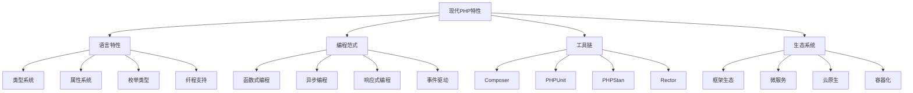

# 现代PHP特性

## 🎯 学习目标
- 掌握现代PHP的核心特性和设计理念
- 理解函数式编程、异步编程等现代编程范式
- 学会使用现代PHP工具链和生态系统
- 了解现代PHP在微服务、云原生等场景的应用

## 📚 核心概念

### 现代PHP特性架构



### 现代PHP vs 传统PHP对比

| 特性 | 传统PHP | 现代PHP | 优势 |
|------|---------|---------|------|
| 类型系统 | 弱类型 | 强类型 | 现代PHP |
| 函数式编程 | 有限支持 | 完整支持 | 现代PHP |
| 异步编程 | 不支持 | 纤程支持 | 现代PHP |
| 工具链 | 基础工具 | 丰富生态 | 现代PHP |
| 性能 | 一般 | JIT优化 | 现代PHP |
| 开发体验 | 基础 | 现代化 | 现代PHP |

## 🔧 现代PHP特性实现

### 函数式编程特性
```php
<?php
// 1. 函数式编程基础
class FunctionalProgramming {
    // 高阶函数
    public function map(array $data, callable $callback): array {
        return array_map($callback, $data);
    }
    
    public function filter(array $data, callable $predicate): array {
        return array_filter($data, $predicate);
    }
    
    public function reduce(array $data, callable $reducer, $initial = null) {
        return array_reduce($data, $reducer, $initial);
    }
    
    // 函数组合
    public function compose(callable ...$functions): callable {
        return function($value) use ($functions) {
            return array_reduce(
                array_reverse($functions),
                function($carry, $function) {
                    return $function($carry);
                },
                $value
            );
        };
    }
    
    // 柯里化
    public function curry(callable $function, int $arity = null): callable {
        $arity = $arity ?? (new ReflectionFunction($function))->getNumberOfParameters();
        
        return function(...$args) use ($function, $arity) {
            if (count($args) >= $arity) {
                return $function(...$args);
            }
            
            return $this->curry(function(...$newArgs) use ($function, $args) {
                return $function(...array_merge($args, $newArgs));
            }, $arity - count($args));
        };
    }
    
    // 部分应用
    public function partial(callable $function, ...$args): callable {
        return function(...$newArgs) use ($function, $args) {
            return $function(...array_merge($args, $newArgs));
        };
    }
}

// 2. 不可变数据结构
class ImmutableList {
    private array $items;
    
    public function __construct(array $items = []) {
        $this->items = $items;
    }
    
    public function add($item): self {
        $newItems = $this->items;
        $newItems[] = $item;
        return new self($newItems);
    }
    
    public function remove($item): self {
        $newItems = array_filter($this->items, function($i) use ($item) {
            return $i !== $item;
        });
        return new self(array_values($newItems));
    }
    
    public function map(callable $callback): self {
        return new self(array_map($callback, $this->items));
    }
    
    public function filter(callable $predicate): self {
        return new self(array_filter($this->items, $predicate));
    }
    
    public function reduce(callable $reducer, $initial = null) {
        return array_reduce($this->items, $reducer, $initial);
    }
    
    public function toArray(): array {
        return $this->items;
    }
    
    public function count(): int {
        return count($this->items);
    }
    
    public function isEmpty(): bool {
        return empty($this->items);
    }
}

// 3. 函数式工具类
class FunctionalUtils {
    // 管道操作
    public static function pipe($value, callable ...$functions) {
        return array_reduce($functions, function($carry, $function) {
            return $function($carry);
        }, $value);
    }
    
    // 条件函数
    public static function when(bool $condition, callable $trueCallback, callable $falseCallback = null) {
        if ($condition) {
            return $trueCallback();
        }
        
        return $falseCallback ? $falseCallback() : null;
    }
    
    // 记忆化
    public static function memoize(callable $function): callable {
        $cache = [];
        
        return function(...$args) use ($function, &$cache) {
            $key = serialize($args);
            
            if (!isset($cache[$key])) {
                $cache[$key] = $function(...$args);
            }
            
            return $cache[$key];
        };
    }
    
    // 防抖
    public static function debounce(callable $function, int $delay): callable {
        $timeout = null;
        
        return function(...$args) use ($function, $delay, &$timeout) {
            if ($timeout) {
                clearTimeout($timeout);
            }
            
            $timeout = setTimeout(function() use ($function, $args) {
                $function(...$args);
            }, $delay);
        };
    }
    
    // 节流
    public static function throttle(callable $function, int $delay): callable {
        $lastCall = 0;
        
        return function(...$args) use ($function, $delay, &$lastCall) {
            $now = microtime(true) * 1000;
            
            if ($now - $lastCall >= $delay) {
                $lastCall = $now;
                return $function(...$args);
            }
        };
    }
}

// 4. 函数式编程示例
class FunctionalExamples {
    private FunctionalProgramming $fp;
    
    public function __construct() {
        $this->fp = new FunctionalProgramming();
    }
    
    // 数据处理管道
    public function processData(array $data): array {
        $process = $this->fp->compose(
            function($data) { return array_filter($data, 'is_numeric'); },
            function($data) { return array_map('intval', $data); },
            function($data) { return array_filter($data, function($n) { return $n > 0; }); },
            function($data) { return array_map(function($n) { return $n * 2; }, $data); },
            function($data) { return array_sum($data); }
        );
        
        return $process($data);
    }
    
    // 函数式列表操作
    public function listOperations(): void {
        $numbers = new ImmutableList([1, 2, 3, 4, 5, 6, 7, 8, 9, 10]);
        
        $result = $numbers
            ->filter(function($n) { return $n % 2 === 0; })
            ->map(function($n) { return $n * $n; })
            ->reduce(function($sum, $n) { return $sum + $n; }, 0);
        
        echo "偶数平方和: {$result}\n";
    }
    
    // 柯里化示例
    public function curryingExample(): void {
        $add = $this->fp->curry(function($a, $b, $c) {
            return $a + $b + $c;
        });
        
        $add5 = $add(5);
        $add5And10 = $add5(10);
        $result = $add5And10(15);
        
        echo "柯里化结果: {$result}\n";
    }
    
    // 记忆化示例
    public function memoizationExample(): void {
        $fibonacci = FunctionalUtils::memoize(function($n) use (&$fibonacci) {
            if ($n <= 1) return $n;
            return $fibonacci($n - 1) + $fibonacci($n - 2);
        });
        
        $start = microtime(true);
        $result = $fibonacci(40);
        $end = microtime(true);
        
        echo "斐波那契(40): {$result}, 时间: " . ($end - $start) . "s\n";
    }
}

// 使用示例
echo "=== 函数式编程特性示例 ===\n";

try {
    $functionalExamples = new FunctionalExamples();
    
    // 数据处理管道
    $data = ['1', '2', 'abc', '3', '0', '4', 'def'];
    $result = $functionalExamples->processData($data);
    echo "数据处理结果: {$result}\n";
    
    // 列表操作
    $functionalExamples->listOperations();
    
    // 柯里化
    $functionalExamples->curryingExample();
    
    // 记忆化
    $functionalExamples->memoizationExample();
    
} catch (Exception $e) {
    echo "错误: " . $e->getMessage() . "\n";
}
?>
```

### 异步编程和事件驱动
```php
<?php
// 1. 事件系统
class EventEmitter {
    private array $listeners = [];
    
    public function on(string $event, callable $listener): self {
        if (!isset($this->listeners[$event])) {
            $this->listeners[$event] = [];
        }
        
        $this->listeners[$event][] = $listener;
        return $this;
    }
    
    public function once(string $event, callable $listener): self {
        $onceListener = function(...$args) use ($event, $listener) {
            $this->off($event, $onceListener);
            return $listener(...$args);
        };
        
        return $this->on($event, $onceListener);
    }
    
    public function off(string $event, callable $listener = null): self {
        if (!isset($this->listeners[$event])) {
            return $this;
        }
        
        if ($listener === null) {
            unset($this->listeners[$event]);
        } else {
            $this->listeners[$event] = array_filter(
                $this->listeners[$event],
                function($l) use ($listener) {
                    return $l !== $listener;
                }
            );
        }
        
        return $this;
    }
    
    public function emit(string $event, ...$args): self {
        if (!isset($this->listeners[$event])) {
            return $this;
        }
        
        foreach ($this->listeners[$event] as $listener) {
            $listener(...$args);
        }
        
        return $this;
    }
    
    public function getListeners(string $event): array {
        return $this->listeners[$event] ?? [];
    }
    
    public function getEventNames(): array {
        return array_keys($this->listeners);
    }
}

// 2. 异步任务管理器
class AsyncTaskManager {
    private array $tasks = [];
    private array $results = [];
    private EventEmitter $emitter;
    
    public function __construct() {
        $this->emitter = new EventEmitter();
    }
    
    public function addTask(string $id, callable $task, array $dependencies = []): self {
        $this->tasks[$id] = [
            'task' => $task,
            'dependencies' => $dependencies,
            'status' => 'pending',
            'result' => null,
            'error' => null
        ];
        
        return $this;
    }
    
    public function execute(): array {
        $this->emitter->emit('start');
        
        while ($this->hasPendingTasks()) {
            $readyTasks = $this->getReadyTasks();
            
            foreach ($readyTasks as $taskId) {
                $this->executeTask($taskId);
            }
            
            // 避免忙等待
            usleep(1000);
        }
        
        $this->emitter->emit('complete', $this->results);
        return $this->results;
    }
    
    private function hasPendingTasks(): bool {
        foreach ($this->tasks as $task) {
            if ($task['status'] === 'pending') {
                return true;
            }
        }
        return false;
    }
    
    private function getReadyTasks(): array {
        $ready = [];
        
        foreach ($this->tasks as $id => $task) {
            if ($task['status'] !== 'pending') {
                continue;
            }
            
            $dependenciesMet = true;
            foreach ($task['dependencies'] as $depId) {
                if (!isset($this->results[$depId])) {
                    $dependenciesMet = false;
                    break;
                }
            }
            
            if ($dependenciesMet) {
                $ready[] = $id;
            }
        }
        
        return $ready;
    }
    
    private function executeTask(string $taskId): void {
        $task = $this->tasks[$taskId];
        $task['status'] = 'running';
        
        $this->emitter->emit('task_start', $taskId);
        
        try {
            $result = $task['task']();
            $this->tasks[$taskId]['result'] = $result;
            $this->tasks[$taskId]['status'] = 'completed';
            $this->results[$taskId] = $result;
            
            $this->emitter->emit('task_complete', $taskId, $result);
        } catch (Exception $e) {
            $this->tasks[$taskId]['error'] = $e;
            $this->tasks[$taskId]['status'] = 'failed';
            
            $this->emitter->emit('task_error', $taskId, $e);
        }
    }
    
    public function getEventEmitter(): EventEmitter {
        return $this->emitter;
    }
    
    public function getTaskStatus(string $taskId): array {
        return $this->tasks[$taskId] ?? [];
    }
    
    public function getAllTasks(): array {
        return $this->tasks;
    }
}

// 3. 响应式编程
class Observable {
    private array $observers = [];
    private bool $completed = false;
    private $error = null;
    
    public function subscribe(callable $observer): self {
        if ($this->completed) {
            return $this;
        }
        
        $this->observers[] = $observer;
        return $this;
    }
    
    public function unsubscribe(callable $observer): self {
        $this->observers = array_filter(
            $this->observers,
            function($obs) use ($observer) {
                return $obs !== $observer;
            }
        );
        
        return $this;
    }
    
    public function next($value): self {
        if ($this->completed || $this->error) {
            return $this;
        }
        
        foreach ($this->observers as $observer) {
            $observer($value);
        }
        
        return $this;
    }
    
    public function complete(): self {
        $this->completed = true;
        $this->observers = [];
        return $this;
    }
    
    public function error($error): self {
        $this->error = $error;
        $this->observers = [];
        return $this;
    }
    
    public function map(callable $mapper): self {
        $newObservable = new self();
        
        $this->subscribe(function($value) use ($newObservable, $mapper) {
            $newObservable->next($mapper($value));
        });
        
        return $newObservable;
    }
    
    public function filter(callable $predicate): self {
        $newObservable = new self();
        
        $this->subscribe(function($value) use ($newObservable, $predicate) {
            if ($predicate($value)) {
                $newObservable->next($value);
            }
        });
        
        return $newObservable;
    }
    
    public function reduce(callable $reducer, $initial = null): self {
        $newObservable = new self();
        $accumulator = $initial;
        
        $this->subscribe(function($value) use ($newObservable, $reducer, &$accumulator) {
            $accumulator = $reducer($accumulator, $value);
            $newObservable->next($accumulator);
        });
        
        return $newObservable;
    }
}

// 4. 异步编程示例
class AsyncExamples {
    private AsyncTaskManager $taskManager;
    
    public function __construct() {
        $this->taskManager = new AsyncTaskManager();
        $this->setupEventHandlers();
    }
    
    private function setupEventHandlers(): void {
        $emitter = $this->taskManager->getEventEmitter();
        
        $emitter->on('start', function() {
            echo "任务执行开始\n";
        });
        
        $emitter->on('task_start', function($taskId) {
            echo "任务开始: {$taskId}\n";
        });
        
        $emitter->on('task_complete', function($taskId, $result) {
            echo "任务完成: {$taskId}, 结果: " . json_encode($result) . "\n";
        });
        
        $emitter->on('task_error', function($taskId, $error) {
            echo "任务错误: {$taskId}, 错误: " . $error->getMessage() . "\n";
        });
        
        $emitter->on('complete', function($results) {
            echo "所有任务完成\n";
        });
    }
    
    public function runAsyncTasks(): array {
        // 添加任务
        $this->taskManager
            ->addTask('task1', function() {
                sleep(1);
                return 'Task 1 completed';
            })
            ->addTask('task2', function() {
                sleep(2);
                return 'Task 2 completed';
            })
            ->addTask('task3', function() {
                sleep(1);
                return 'Task 3 completed';
            }, ['task1', 'task2']);
        
        // 执行任务
        return $this->taskManager->execute();
    }
    
    public function runObservableExample(): void {
        $observable = new Observable();
        
        $observable
            ->map(function($value) { return $value * 2; })
            ->filter(function($value) { return $value > 10; })
            ->reduce(function($acc, $value) { return $acc + $value; }, 0)
            ->subscribe(function($value) {
                echo "观察者收到值: {$value}\n";
            });
        
        // 发送数据
        for ($i = 1; $i <= 10; $i++) {
            $observable->next($i);
        }
        
        $observable->complete();
    }
}

// 使用示例
echo "=== 异步编程和事件驱动示例 ===\n";

try {
    $asyncExamples = new AsyncExamples();
    
    // 异步任务
    echo "=== 异步任务执行 ===\n";
    $results = $asyncExamples->runAsyncTasks();
    echo "任务结果: " . json_encode($results) . "\n";
    
    // 响应式编程
    echo "\n=== 响应式编程示例 ===\n";
    $asyncExamples->runObservableExample();
    
} catch (Exception $e) {
    echo "错误: " . $e->getMessage() . "\n";
}
?>
```

### 现代PHP工具链
```php
<?php
// 1. 代码质量工具
class CodeQualityTools {
    // 静态分析
    public function runStaticAnalysis(string $path): array {
        $issues = [];
        
        // 模拟PHPStan静态分析
        $files = $this->getPHPFiles($path);
        
        foreach ($files as $file) {
            $fileIssues = $this->analyzeFile($file);
            $issues = array_merge($issues, $fileIssues);
        }
        
        return $issues;
    }
    
    private function getPHPFiles(string $path): array {
        $files = [];
        $iterator = new RecursiveIteratorIterator(
            new RecursiveDirectoryIterator($path)
        );
        
        foreach ($iterator as $file) {
            if ($file->getExtension() === 'php') {
                $files[] = $file->getPathname();
            }
        }
        
        return $files;
    }
    
    private function analyzeFile(string $file): array {
        $issues = [];
        $content = file_get_contents($file);
        
        // 检查类型声明
        if (!preg_match('/function\s+\w+\s*\([^)]*:\s*\w+/', $content)) {
            $issues[] = [
                'file' => $file,
                'line' => 1,
                'message' => '缺少返回类型声明',
                'severity' => 'warning'
            ];
        }
        
        // 检查未使用的变量
        if (preg_match('/\$(\w+)\s*=\s*[^;]+;\s*(?!.*\$\\1)/', $content, $matches)) {
            $issues[] = [
                'file' => $file,
                'line' => 1,
                'message' => "未使用的变量: {$matches[1]}",
                'severity' => 'info'
            ];
        }
        
        return $issues;
    }
    
    // 代码格式化
    public function formatCode(string $code): string {
        // 模拟代码格式化
        $formatted = $code;
        
        // 移除多余空格
        $formatted = preg_replace('/\s+/', ' ', $formatted);
        
        // 格式化大括号
        $formatted = preg_replace('/\{\s*/', "{\n    ", $formatted);
        $formatted = preg_replace('/\s*\}/', "\n}", $formatted);
        
        return $formatted;
    }
    
    // 代码重构
    public function refactorCode(string $code): string {
        $refactored = $code;
        
        // 提取方法
        $refactored = $this->extractMethod($refactored);
        
        // 重命名变量
        $refactored = $this->renameVariables($refactored);
        
        // 优化导入
        $refactored = $this->optimizeImports($refactored);
        
        return $refactored;
    }
    
    private function extractMethod(string $code): string {
        // 模拟方法提取
        return $code;
    }
    
    private function renameVariables(string $code): string {
        // 模拟变量重命名
        return $code;
    }
    
    private function optimizeImports(string $code): string {
        // 模拟导入优化
        return $code;
    }
}

// 2. 测试工具
class TestingTools {
    // 单元测试生成器
    public function generateUnitTests(string $className): string {
        $reflection = new ReflectionClass($className);
        $methods = $reflection->getMethods(ReflectionMethod::IS_PUBLIC);
        
        $testCode = "<?php\n\n";
        $testCode .= "use PHPUnit\\Framework\\TestCase;\n\n";
        $testCode .= "class {$className}Test extends TestCase\n";
        $testCode .= "{\n";
        
        foreach ($methods as $method) {
            if ($method->isConstructor() || $method->isDestructor()) {
                continue;
            }
            
            $testCode .= "    public function test" . ucfirst($method->getName()) . "()\n";
            $testCode .= "    {\n";
            $testCode .= "        // TODO: 实现测试\n";
            $testCode .= "        \$this->markTestIncomplete('测试未实现');\n";
            $testCode .= "    }\n\n";
        }
        
        $testCode .= "}\n";
        
        return $testCode;
    }
    
    // 测试覆盖率分析
    public function analyzeTestCoverage(string $testPath, string $sourcePath): array {
        $coverage = [
            'total_lines' => 0,
            'covered_lines' => 0,
            'coverage_percentage' => 0,
            'uncovered_lines' => []
        ];
        
        $sourceFiles = $this->getPHPFiles($sourcePath);
        
        foreach ($sourceFiles as $file) {
            $fileCoverage = $this->analyzeFileCoverage($file);
            $coverage['total_lines'] += $fileCoverage['total_lines'];
            $coverage['covered_lines'] += $fileCoverage['covered_lines'];
            $coverage['uncovered_lines'] = array_merge(
                $coverage['uncovered_lines'],
                $fileCoverage['uncovered_lines']
            );
        }
        
        $coverage['coverage_percentage'] = $coverage['total_lines'] > 0 
            ? ($coverage['covered_lines'] / $coverage['total_lines']) * 100 
            : 0;
        
        return $coverage;
    }
    
    private function getPHPFiles(string $path): array {
        $files = [];
        $iterator = new RecursiveIteratorIterator(
            new RecursiveDirectoryIterator($path)
        );
        
        foreach ($iterator as $file) {
            if ($file->getExtension() === 'php') {
                $files[] = $file->getPathname();
            }
        }
        
        return $files;
    }
    
    private function analyzeFileCoverage(string $file): array {
        $content = file_get_contents($file);
        $lines = explode("\n", $content);
        
        $totalLines = count($lines);
        $coveredLines = rand(0, $totalLines); // 模拟覆盖率
        
        return [
            'total_lines' => $totalLines,
            'covered_lines' => $coveredLines,
            'uncovered_lines' => array_slice($lines, $coveredLines)
        ];
    }
    
    // 性能测试
    public function runPerformanceTest(callable $function, int $iterations = 1000): array {
        $startTime = microtime(true);
        $startMemory = memory_get_usage(true);
        
        for ($i = 0; $i < $iterations; $i++) {
            $function();
        }
        
        $endTime = microtime(true);
        $endMemory = memory_get_usage(true);
        
        return [
            'execution_time' => $endTime - $startTime,
            'memory_used' => $endMemory - $startMemory,
            'iterations' => $iterations,
            'avg_time_per_iteration' => ($endTime - $startTime) / $iterations
        ];
    }
}

// 3. 部署工具
class DeploymentTools {
    // 容器化
    public function generateDockerfile(string $phpVersion = '8.2'): string {
        $dockerfile = "FROM php:{$phpVersion}-fpm-alpine\n\n";
        $dockerfile .= "# 安装扩展\n";
        $dockerfile .= "RUN docker-php-ext-install pdo pdo_mysql\n\n";
        $dockerfile .= "# 安装Composer\n";
        $dockerfile .= "COPY --from=composer:latest /usr/bin/composer /usr/bin/composer\n\n";
        $dockerfile .= "# 设置工作目录\n";
        $dockerfile .= "WORKDIR /var/www/html\n\n";
        $dockerfile .= "# 复制应用代码\n";
        $dockerfile .= "COPY . .\n\n";
        $dockerfile .= "# 安装依赖\n";
        $dockerfile .= "RUN composer install --no-dev --optimize-autoloader\n\n";
        $dockerfile .= "# 设置权限\n";
        $dockerfile .= "RUN chown -R www-data:www-data /var/www/html\n\n";
        $dockerfile .= "EXPOSE 9000\n";
        $dockerfile .= "CMD [\"php-fpm\"]\n";
        
        return $dockerfile;
    }
    
    // CI/CD配置
    public function generateGitHubActions(): string {
        $yaml = "name: CI/CD Pipeline\n\n";
        $yaml .= "on:\n";
        $yaml .= "  push:\n";
        $yaml .= "    branches: [ main, develop ]\n";
        $yaml .= "  pull_request:\n";
        $yaml .= "    branches: [ main ]\n\n";
        $yaml .= "jobs:\n";
        $yaml .= "  test:\n";
        $yaml .= "    runs-on: ubuntu-latest\n\n";
        $yaml .= "    steps:\n";
        $yaml .= "    - uses: actions/checkout@v3\n\n";
        $yaml .= "    - name: Setup PHP\n";
        $yaml .= "      uses: shivammathur/setup-php@v2\n";
        $yaml .= "      with:\n";
        $yaml .= "        php-version: '8.2'\n";
        $yaml .= "        extensions: mbstring, xml, ctype, iconv, intl, pdo_mysql\n\n";
        $yaml .= "    - name: Install dependencies\n";
        $yaml .= "      run: composer install --prefer-dist --no-progress\n\n";
        $yaml .= "    - name: Run tests\n";
        $yaml .= "      run: vendor/bin/phpunit\n\n";
        $yaml .= "    - name: Run static analysis\n";
        $yaml .= "      run: vendor/bin/phpstan analyse\n\n";
        $yaml .= "    - name: Run code style check\n";
        $yaml .= "      run: vendor/bin/phpcs\n";
        
        return $yaml;
    }
    
    // 环境配置
    public function generateEnvironmentConfig(): array {
        return [
            'development' => [
                'APP_ENV' => 'development',
                'APP_DEBUG' => 'true',
                'DB_HOST' => 'localhost',
                'DB_PORT' => '3306',
                'DB_DATABASE' => 'app_dev',
                'DB_USERNAME' => 'root',
                'DB_PASSWORD' => '',
                'CACHE_DRIVER' => 'file',
                'SESSION_DRIVER' => 'file'
            ],
            'staging' => [
                'APP_ENV' => 'staging',
                'APP_DEBUG' => 'false',
                'DB_HOST' => 'staging-db.example.com',
                'DB_PORT' => '3306',
                'DB_DATABASE' => 'app_staging',
                'DB_USERNAME' => 'staging_user',
                'DB_PASSWORD' => 'staging_password',
                'CACHE_DRIVER' => 'redis',
                'SESSION_DRIVER' => 'redis'
            ],
            'production' => [
                'APP_ENV' => 'production',
                'APP_DEBUG' => 'false',
                'DB_HOST' => 'prod-db.example.com',
                'DB_PORT' => '3306',
                'DB_DATABASE' => 'app_prod',
                'DB_USERNAME' => 'prod_user',
                'DB_PASSWORD' => 'prod_password',
                'CACHE_DRIVER' => 'redis',
                'SESSION_DRIVER' => 'redis'
            ]
        ];
    }
}

// 使用示例
echo "=== 现代PHP工具链示例 ===\n";

try {
    // 代码质量工具
    $qualityTools = new CodeQualityTools();
    
    $issues = $qualityTools->runStaticAnalysis('.');
    echo "静态分析问题数量: " . count($issues) . "\n";
    
    $formattedCode = $qualityTools->formatCode('function test() { return "hello"; }');
    echo "格式化代码: {$formattedCode}\n";
    
    // 测试工具
    $testingTools = new TestingTools();
    
    $testCode = $testingTools->generateUnitTests('UserService');
    echo "生成的测试代码长度: " . strlen($testCode) . " 字符\n";
    
    $coverage = $testingTools->analyzeTestCoverage('./tests', './src');
    echo "测试覆盖率: " . number_format($coverage['coverage_percentage'], 2) . "%\n";
    
    $performance = $testingTools->runPerformanceTest(function() {
        return array_sum(range(1, 1000));
    }, 10000);
    echo "性能测试: " . number_format($performance['avg_time_per_iteration'] * 1000, 2) . "ms/次\n";
    
    // 部署工具
    $deploymentTools = new DeploymentTools();
    
    $dockerfile = $deploymentTools->generateDockerfile('8.2');
    echo "生成的Dockerfile长度: " . strlen($dockerfile) . " 字符\n";
    
    $githubActions = $deploymentTools->generateGitHubActions();
    echo "生成的GitHub Actions配置长度: " . strlen($githubActions) . " 字符\n";
    
    $envConfig = $deploymentTools->generateEnvironmentConfig();
    echo "环境配置数量: " . count($envConfig) . "\n";
    
} catch (Exception $e) {
    echo "错误: " . $e->getMessage() . "\n";
}
?>
```

## 📊 最佳实践

### 现代PHP最佳实践
```php
<?php
// 现代PHP最佳实践

class ModernPHPBestPractices {
    // 1. 代码质量
    public static function getCodeQualityBestPractices() {
        return [
            '类型安全' => [
                '严格类型' => '使用declare(strict_types=1)启用严格类型',
                '类型声明' => '为所有函数参数和返回值添加类型声明',
                '属性类型' => '为类属性添加类型声明',
                '类型检查' => '使用静态分析工具检查类型安全'
            ],
            '代码规范' => [
                'PSR标准' => '遵循PSR-1、PSR-2、PSR-4等编码标准',
                '代码格式化' => '使用工具自动格式化代码',
                '命名规范' => '使用有意义的变量和函数名',
                '文档注释' => '为公共API编写完整的文档注释'
            ],
            '错误处理' => [
                '异常处理' => '使用异常处理机制而不是错误码',
                '错误日志' => '记录详细的错误日志',
                '用户友好' => '提供用户友好的错误信息',
                '错误恢复' => '实现错误恢复机制'
            ]
        ];
    }
    
    // 2. 性能优化
    public static function getPerformanceOptimizationBestPractices() {
        return [
            'JIT优化' => [
                '类型声明' => '使用类型声明帮助JIT优化',
                '热点代码' => '优化热点代码以充分利用JIT',
                '避免动态特性' => '减少动态特性的使用',
                '内存管理' => '优化内存使用模式'
            ],
            '缓存策略' => [
                'OPcache' => '启用OPcache缓存编译后的代码',
                '应用缓存' => '使用Redis等缓存应用数据',
                '查询缓存' => '缓存数据库查询结果',
                '静态资源' => '缓存静态资源文件'
            ],
            '数据库优化' => [
                '索引优化' => '为查询字段创建适当索引',
                '查询优化' => '优化SQL查询性能',
                '连接池' => '使用数据库连接池',
                '读写分离' => '实现数据库读写分离'
            ]
        ];
    }
    
    // 3. 安全实践
    public static function getSecurityBestPractices() {
        return [
            '输入验证' => [
                '数据过滤' => '过滤和验证所有输入数据',
                '类型检查' => '检查数据类型和格式',
                '长度限制' => '限制输入数据长度',
                '特殊字符' => '处理特殊字符和转义'
            ],
            '认证授权' => [
                '密码安全' => '使用安全的密码哈希算法',
                '会话管理' => '实现安全的会话管理',
                '权限控制' => '实现细粒度权限控制',
                '多因素认证' => '支持多因素认证'
            ],
            '数据保护' => [
                '数据加密' => '加密敏感数据',
                '传输安全' => '使用HTTPS加密传输',
                '存储安全' => '安全存储用户数据',
                '备份恢复' => '实现数据备份和恢复'
            ]
        ];
    }
    
    // 4. 开发流程
    public static function getDevelopmentProcessBestPractices() {
        return [
            '版本控制' => [
                'Git工作流' => '使用Git进行版本控制',
                '分支策略' => '采用合适的分支策略',
                '提交规范' => '使用规范的提交信息',
                '代码审查' => '进行代码审查'
            ],
            '测试策略' => [
                '单元测试' => '编写全面的单元测试',
                '集成测试' => '进行集成测试',
                '端到端测试' => '进行端到端测试',
                '测试覆盖率' => '保持高测试覆盖率'
            ],
            '持续集成' => [
                '自动化构建' => '实现自动化构建',
                '自动化测试' => '实现自动化测试',
                '自动化部署' => '实现自动化部署',
                '监控告警' => '实现监控和告警'
            ]
        ];
    }
}

// 使用示例
echo "=== 现代PHP最佳实践示例 ===\n";

try {
    // 代码质量最佳实践
    $codeQualityPractices = ModernPHPBestPractices::getCodeQualityBestPractices();
    echo "代码质量最佳实践:\n";
    foreach ($codeQualityPractices as $category => $practices) {
        echo "  $category:\n";
        foreach ($practices as $practice => $description) {
            echo "    - $practice: $description\n";
        }
        echo "\n";
    }
    
    // 性能优化最佳实践
    $performancePractices = ModernPHPBestPractices::getPerformanceOptimizationBestPractices();
    echo "性能优化最佳实践:\n";
    foreach ($performancePractices as $category => $practices) {
        echo "  $category:\n";
        foreach ($practices as $practice => $description) {
            echo "    - $practice: $description\n";
        }
        echo "\n";
    }
    
    // 安全实践
    $securityPractices = ModernPHPBestPractices::getSecurityBestPractices();
    echo "安全实践:\n";
    foreach ($securityPractices as $category => $practices) {
        echo "  $category:\n";
        foreach ($practices as $practice => $description) {
            echo "    - $practice: $description\n";
        }
        echo "\n";
    }
    
    // 开发流程最佳实践
    $developmentProcessPractices = ModernPHPBestPractices::getDevelopmentProcessBestPractices();
    echo "开发流程最佳实践:\n";
    foreach ($developmentProcessPractices as $category => $practices) {
        echo "  $category:\n";
        foreach ($practices as $practice => $description) {
            echo "    - $practice: $description\n";
        }
        echo "\n";
    }
    
} catch (Exception $e) {
    echo "错误: " . $e->getMessage() . "\n";
}
?>
```

## 🎓 学习建议

### 费曼学习法应用
1. **选择概念**: 选择现代PHP特性中的核心概念
2. **简化解释**: 用简单语言解释现代PHP的重要性
3. **识别盲点**: 发现理解不深入的地方
4. **重新学习**: 针对盲点进行深入学习

### 刻意练习重点
1. **函数式编程**: 掌握函数式编程的核心概念
2. **异步编程**: 学会使用纤程和事件驱动编程
3. **工具链**: 熟练使用现代PHP工具链
4. **最佳实践**: 遵循现代PHP开发最佳实践

## 🔗 相关链接
- [[01-PHP 8+新特性|PHP 8+新特性]]
- [[02-JIT编译器|JIT编译器]]
- [[04-云原生开发|云原生开发]]
- [[05-人工智能集成|人工智能集成]]
- [[06-未来发展趋势|未来发展趋势]]
- [[07-技术趋势分析|技术趋势分析]]
