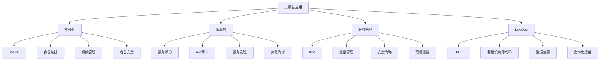

# 云原生开发

## 🎯 学习目标
- 理解云原生开发的核心概念和原则
- 掌握容器化、微服务、服务网格等云原生技术
- 学会使用Kubernetes、Docker等云原生工具
- 了解云原生在PHP应用中的实践和最佳实践

## 📚 核心概念

### 云原生架构



### 云原生 vs 传统架构对比

| 特性 | 传统架构 | 云原生架构 | 优势 |
|------|----------|------------|------|
| 部署方式 | 物理机/虚拟机 | 容器化 | 云原生 |
| 扩展性 | 垂直扩展 | 水平扩展 | 云原生 |
| 可用性 | 单点故障 | 高可用 | 云原生 |
| 开发效率 | 较慢 | 快速迭代 | 云原生 |
| 资源利用 | 低效 | 高效 | 云原生 |
| 运维复杂度 | 高 | 自动化 | 云原生 |

## 🔧 云原生开发实现

### 容器化和编排
```php
<?php
// 1. Docker配置生成器
class DockerConfigGenerator {
    // 生成PHP应用的Dockerfile
    public function generatePHP Dockerfile(string $phpVersion = '8.2', array $extensions = []): string {
        $dockerfile = "FROM php:{$phpVersion}-fpm-alpine\n\n";
        
        // 安装系统依赖
        $dockerfile .= "# 安装系统依赖\n";
        $dockerfile .= "RUN apk add --no-cache \\\n";
        $dockerfile .= "    git \\\n";
        $dockerfile .= "    unzip \\\n";
        $dockerfile .= "    libzip-dev \\\n";
        $dockerfile .= "    libpng-dev \\\n";
        $dockerfile .= "    libjpeg-turbo-dev \\\n";
        $dockerfile .= "    freetype-dev\n\n";
        
        // 安装PHP扩展
        if (!empty($extensions)) {
            $dockerfile .= "# 安装PHP扩展\n";
            $dockerfile .= "RUN docker-php-ext-configure gd --with-freetype --with-jpeg\n";
            $dockerfile .= "RUN docker-php-ext-install " . implode(' ', $extensions) . "\n\n";
        }
        
        // 安装Composer
        $dockerfile .= "# 安装Composer\n";
        $dockerfile .= "COPY --from=composer:latest /usr/bin/composer /usr/bin/composer\n\n";
        
        // 设置工作目录
        $dockerfile .= "# 设置工作目录\n";
        $dockerfile .= "WORKDIR /var/www/html\n\n";
        
        // 复制应用代码
        $dockerfile .= "# 复制应用代码\n";
        $dockerfile .= "COPY . .\n\n";
        
        // 安装依赖
        $dockerfile .= "# 安装依赖\n";
        $dockerfile .= "RUN composer install --no-dev --optimize-autoloader\n\n";
        
        // 设置权限
        $dockerfile .= "# 设置权限\n";
        $dockerfile .= "RUN chown -R www-data:www-data /var/www/html\n\n";
        
        $dockerfile .= "EXPOSE 9000\n";
        $dockerfile .= "CMD [\"php-fpm\"]\n";
        
        return $dockerfile;
    }
    
    // 生成docker-compose.yml
    public function generateDockerCompose(array $services = []): string {
        $defaultServices = [
            'app' => [
                'build' => '.',
                'ports' => ['9000:9000'],
                'volumes' => ['./:/var/www/html'],
                'depends_on' => ['mysql', 'redis']
            ],
            'nginx' => [
                'image' => 'nginx:alpine',
                'ports' => ['80:80'],
                'volumes' => ['./nginx.conf:/etc/nginx/nginx.conf'],
                'depends_on' => ['app']
            ],
            'mysql' => [
                'image' => 'mysql:8.0',
                'environment' => [
                    'MYSQL_ROOT_PASSWORD' => 'root',
                    'MYSQL_DATABASE' => 'app',
                    'MYSQL_USER' => 'app',
                    'MYSQL_PASSWORD' => 'app'
                ],
                'ports' => ['3306:3306'],
                'volumes' => ['mysql_data:/var/lib/mysql']
            ],
            'redis' => [
                'image' => 'redis:alpine',
                'ports' => ['6379:6379'],
                'volumes' => ['redis_data:/data']
            ]
        ];
        
        $services = array_merge($defaultServices, $services);
        
        $yaml = "version: '3.8'\n\n";
        $yaml .= "services:\n";
        
        foreach ($services as $name => $config) {
            $yaml .= "  {$name}:\n";
            foreach ($config as $key => $value) {
                if (is_array($value)) {
                    $yaml .= "    {$key}:\n";
                    foreach ($value as $item) {
                        $yaml .= "      - {$item}\n";
                    }
                } else {
                    $yaml .= "    {$key}: {$value}\n";
                }
            }
        }
        
        $yaml .= "\nvolumes:\n";
        $yaml .= "  mysql_data:\n";
        $yaml .= "  redis_data:\n";
        
        return $yaml;
    }
    
    // 生成Kubernetes部署配置
    public function generateKubernetesDeployment(string $appName, array $config = []): string {
        $defaultConfig = [
            'replicas' => 3,
            'image' => "{$appName}:latest",
            'port' => 9000,
            'resources' => [
                'requests' => ['memory' => '128Mi', 'cpu' => '100m'],
                'limits' => ['memory' => '256Mi', 'cpu' => '200m']
            ]
        ];
        
        $config = array_merge($defaultConfig, $config);
        
        $yaml = "apiVersion: apps/v1\n";
        $yaml .= "kind: Deployment\n";
        $yaml .= "metadata:\n";
        $yaml .= "  name: {$appName}\n";
        $yaml .= "  labels:\n";
        $yaml .= "    app: {$appName}\n";
        $yaml .= "spec:\n";
        $yaml .= "  replicas: {$config['replicas']}\n";
        $yaml .= "  selector:\n";
        $yaml .= "    matchLabels:\n";
        $yaml .= "      app: {$appName}\n";
        $yaml .= "  template:\n";
        $yaml .= "    metadata:\n";
        $yaml .= "      labels:\n";
        $yaml .= "        app: {$appName}\n";
        $yaml .= "    spec:\n";
        $yaml .= "      containers:\n";
        $yaml .= "      - name: {$appName}\n";
        $yaml .= "        image: {$config['image']}\n";
        $yaml .= "        ports:\n";
        $yaml .= "        - containerPort: {$config['port']}\n";
        $yaml .= "        resources:\n";
        $yaml .= "          requests:\n";
        $yaml .= "            memory: \"{$config['resources']['requests']['memory']}\"\n";
        $yaml .= "            cpu: \"{$config['resources']['requests']['cpu']}\"\n";
        $yaml .= "          limits:\n";
        $yaml .= "            memory: \"{$config['resources']['limits']['memory']}\"\n";
        $yaml .= "            cpu: \"{$config['resources']['limits']['cpu']}\"\n";
        
        return $yaml;
    }
    
    // 生成Kubernetes服务配置
    public function generateKubernetesService(string $appName, array $config = []): string {
        $defaultConfig = [
            'port' => 80,
            'targetPort' => 9000,
            'type' => 'ClusterIP'
        ];
        
        $config = array_merge($defaultConfig, $config);
        
        $yaml = "apiVersion: v1\n";
        $yaml .= "kind: Service\n";
        $yaml .= "metadata:\n";
        $yaml .= "  name: {$appName}-service\n";
        $yaml .= "spec:\n";
        $yaml .= "  selector:\n";
        $yaml .= "    app: {$appName}\n";
        $yaml .= "  ports:\n";
        $yaml .= "  - protocol: TCP\n";
        $yaml .= "    port: {$config['port']}\n";
        $yaml .= "    targetPort: {$config['targetPort']}\n";
        $yaml .= "  type: {$config['type']}\n";
        
        return $yaml;
    }
}

// 2. 云原生配置管理器
class CloudNativeConfigManager {
    private array $environments;
    private array $services;
    
    public function __construct() {
        $this->environments = [];
        $this->services = [];
    }
    
    // 添加环境配置
    public function addEnvironment(string $name, array $config): self {
        $this->environments[$name] = $config;
        return $this;
    }
    
    // 添加服务配置
    public function addService(string $name, array $config): self {
        $this->services[$name] = $config;
        return $this;
    }
    
    // 生成环境配置
    public function generateEnvironmentConfig(string $environment): array {
        if (!isset($this->environments[$environment])) {
            throw new Exception("Environment '{$environment}' not found");
        }
        
        $envConfig = $this->environments[$environment];
        $config = [];
        
        foreach ($envConfig as $key => $value) {
            $config[strtoupper($key)] = $value;
        }
        
        return $config;
    }
    
    // 生成ConfigMap
    public function generateConfigMap(string $name, string $environment): string {
        $config = $this->generateEnvironmentConfig($environment);
        
        $yaml = "apiVersion: v1\n";
        $yaml .= "kind: ConfigMap\n";
        $yaml .= "metadata:\n";
        $yaml .= "  name: {$name}-config\n";
        $yaml .= "data:\n";
        
        foreach ($config as $key => $value) {
            $yaml .= "  {$key}: \"{$value}\"\n";
        }
        
        return $yaml;
    }
    
    // 生成Secret
    public function generateSecret(string $name, array $secrets): string {
        $yaml = "apiVersion: v1\n";
        $yaml .= "kind: Secret\n";
        $yaml .= "metadata:\n";
        $yaml .= "  name: {$name}-secret\n";
        $yaml .= "type: Opaque\n";
        $yaml .= "data:\n";
        
        foreach ($secrets as $key => $value) {
            $encoded = base64_encode($value);
            $yaml .= "  {$key}: {$encoded}\n";
        }
        
        return $yaml;
    }
    
    // 生成Ingress配置
    public function generateIngress(string $name, array $rules): string {
        $yaml = "apiVersion: networking.k8s.io/v1\n";
        $yaml .= "kind: Ingress\n";
        $yaml .= "metadata:\n";
        $yaml .= "  name: {$name}-ingress\n";
        $yaml .= "  annotations:\n";
        $yaml .= "    nginx.ingress.kubernetes.io/rewrite-target: /\n";
        $yaml .= "spec:\n";
        $yaml .= "  rules:\n";
        
        foreach ($rules as $rule) {
            $yaml .= "  - host: {$rule['host']}\n";
            $yaml .= "    http:\n";
            $yaml .= "      paths:\n";
            $yaml .= "      - path: {$rule['path']}\n";
            $yaml .= "        pathType: Prefix\n";
            $yaml .= "        backend:\n";
            $yaml .= "          service:\n";
            $yaml .= "            name: {$rule['service']}\n";
            $yaml .= "            port:\n";
            $yaml .= "              number: {$rule['port']}\n";
        }
        
        return $yaml;
    }
}

// 3. 云原生监控配置
class CloudNativeMonitoring {
    // 生成Prometheus配置
    public function generatePrometheusConfig(array $targets = []): string {
        $defaultTargets = [
            'app-service:9000',
            'nginx-service:80',
            'mysql-service:3306',
            'redis-service:6379'
        ];
        
        $targets = array_merge($defaultTargets, $targets);
        
        $config = [
            'global' => [
                'scrape_interval' => '15s',
                'evaluation_interval' => '15s'
            ],
            'scrape_configs' => [
                [
                    'job_name' => 'kubernetes-pods',
                    'kubernetes_sd_configs' => [
                        ['role' => 'pod']
                    ],
                    'relabel_configs' => [
                        [
                            'source_labels' => ['__meta_kubernetes_pod_annotation_prometheus_io_scrape'],
                            'action' => 'keep',
                            'regex' => true
                        ]
                    ]
                ]
            ]
        ];
        
        return yaml_emit($config);
    }
    
    // 生成Grafana仪表板配置
    public function generateGrafanaDashboard(string $appName): array {
        return [
            'dashboard' => [
                'title' => "{$appName} Dashboard",
                'panels' => [
                    [
                        'title' => 'Request Rate',
                        'type' => 'graph',
                        'targets' => [
                            [
                                'expr' => "rate(http_requests_total{job=\"{$appName}\"}[5m])",
                                'legendFormat' => '{{method}} {{endpoint}}'
                            ]
                        ]
                    ],
                    [
                        'title' => 'Response Time',
                        'type' => 'graph',
                        'targets' => [
                            [
                                'expr' => "histogram_quantile(0.95, rate(http_request_duration_seconds_bucket{job=\"{$appName}\"}[5m]))",
                                'legendFormat' => '95th percentile'
                            ]
                        ]
                    ],
                    [
                        'title' => 'Error Rate',
                        'type' => 'graph',
                        'targets' => [
                            [
                                'expr' => "rate(http_requests_total{job=\"{$appName}\",status=~\"5..\"}[5m])",
                                'legendFormat' => '5xx errors'
                            ]
                        ]
                    ]
                ]
            ]
        ];
    }
    
    // 生成告警规则
    public function generateAlertRules(string $appName): string {
        $rules = [
            'groups' => [
                [
                    'name' => "{$appName}_alerts",
                    'rules' => [
                        [
                            'alert' => 'HighErrorRate',
                            'expr' => "rate(http_requests_total{job=\"{$appName}\",status=~\"5..\"}[5m]) > 0.1",
                            'for' => '5m',
                            'labels' => [
                                'severity' => 'warning'
                            ],
                            'annotations' => [
                                'summary' => "High error rate for {$appName}",
                                'description' => "Error rate is above 10% for 5 minutes"
                            ]
                        ],
                        [
                            'alert' => 'HighResponseTime',
                            'expr' => "histogram_quantile(0.95, rate(http_request_duration_seconds_bucket{job=\"{$appName}\"}[5m])) > 1",
                            'for' => '5m',
                            'labels' => [
                                'severity' => 'warning'
                            ],
                            'annotations' => [
                                'summary' => "High response time for {$appName}",
                                'description' => "95th percentile response time is above 1 second"
                            ]
                        ]
                    ]
                ]
            ]
        ];
        
        return yaml_emit($rules);
    }
}

// 使用示例
echo "=== 云原生开发示例 ===\n";

try {
    // Docker配置生成器
    $dockerGenerator = new DockerConfigGenerator();
    
    $dockerfile = $dockerGenerator->generatePHPDockerfile('8.2', ['pdo', 'pdo_mysql', 'gd', 'zip']);
    echo "生成的Dockerfile长度: " . strlen($dockerfile) . " 字符\n";
    
    $dockerCompose = $dockerGenerator->generateDockerCompose();
    echo "生成的docker-compose.yml长度: " . strlen($dockerCompose) . " 字符\n";
    
    $k8sDeployment = $dockerGenerator->generateKubernetesDeployment('myapp', [
        'replicas' => 5,
        'resources' => [
            'requests' => ['memory' => '256Mi', 'cpu' => '200m'],
            'limits' => ['memory' => '512Mi', 'cpu' => '500m']
        ]
    ]);
    echo "生成的Kubernetes部署配置长度: " . strlen($k8sDeployment) . " 字符\n";
    
    $k8sService = $dockerGenerator->generateKubernetesService('myapp');
    echo "生成的Kubernetes服务配置长度: " . strlen($k8sService) . " 字符\n";
    
    // 云原生配置管理器
    $configManager = new CloudNativeConfigManager();
    
    $configManager
        ->addEnvironment('production', [
            'app_env' => 'production',
            'app_debug' => 'false',
            'db_host' => 'mysql-service',
            'db_port' => '3306',
            'cache_driver' => 'redis'
        ])
        ->addEnvironment('staging', [
            'app_env' => 'staging',
            'app_debug' => 'true',
            'db_host' => 'staging-mysql',
            'db_port' => '3306',
            'cache_driver' => 'redis'
        ]);
    
    $configMap = $configManager->generateConfigMap('myapp', 'production');
    echo "生成的ConfigMap长度: " . strlen($configMap) . " 字符\n";
    
    $secret = $configManager->generateSecret('myapp', [
        'db_password' => 'secret123',
        'api_key' => 'api-key-123'
    ]);
    echo "生成的Secret长度: " . strlen($secret) . " 字符\n";
    
    $ingress = $configManager->generateIngress('myapp', [
        [
            'host' => 'myapp.example.com',
            'path' => '/',
            'service' => 'myapp-service',
            'port' => 80
        ]
    ]);
    echo "生成的Ingress长度: " . strlen($ingress) . " 字符\n";
    
    // 云原生监控
    $monitoring = new CloudNativeMonitoring();
    
    $prometheusConfig = $monitoring->generatePrometheusConfig();
    echo "生成的Prometheus配置长度: " . strlen($prometheusConfig) . " 字符\n";
    
    $grafanaDashboard = $monitoring->generateGrafanaDashboard('myapp');
    echo "生成的Grafana仪表板配置: " . json_encode($grafanaDashboard) . "\n";
    
    $alertRules = $monitoring->generateAlertRules('myapp');
    echo "生成的告警规则长度: " . strlen($alertRules) . " 字符\n";
    
} catch (Exception $e) {
    echo "错误: " . $e->getMessage() . "\n";
}
?>
```

### 微服务和服务网格
```php
<?php
// 1. 微服务架构管理器
class MicroserviceArchitectureManager {
    private array $services;
    private array $dependencies;
    
    public function __construct() {
        $this->services = [];
        $this->dependencies = [];
    }
    
    // 添加微服务
    public function addService(string $name, array $config): self {
        $this->services[$name] = $config;
        return $this;
    }
    
    // 添加服务依赖
    public function addDependency(string $service, string $dependency): self {
        if (!isset($this->dependencies[$service])) {
            $this->dependencies[$service] = [];
        }
        
        $this->dependencies[$service][] = $dependency;
        return $this;
    }
    
    // 生成服务网格配置
    public function generateServiceMeshConfig(): array {
        $config = [
            'apiVersion' => 'networking.istio.io/v1alpha3',
            'kind' => 'VirtualService',
            'metadata' => [
                'name' => 'microservices-routing'
            ],
            'spec' => [
                'http' => []
            ]
        ];
        
        foreach ($this->services as $serviceName => $serviceConfig) {
            $route = [
                'match' => [
                    ['uri' => ['prefix' => "/{$serviceName}"]]
                ],
                'route' => [
                    ['destination' => ['host' => "{$serviceName}-service"]]
                ]
            ];
            
            $config['spec']['http'][] = $route;
        }
        
        return $config;
    }
    
    // 生成服务发现配置
    public function generateServiceDiscoveryConfig(): array {
        $config = [
            'apiVersion' => 'v1',
            'kind' => 'Service',
            'metadata' => [
                'name' => 'service-registry'
            ],
            'spec' => [
                'selector' => ['app' => 'service-registry'],
                'ports' => [
                    ['port' => 8761, 'targetPort' => 8761]
                ]
            ]
        ];
        
        return $config;
    }
    
    // 生成API网关配置
    public function generateAPIGatewayConfig(): array {
        $config = [
            'apiVersion' => 'networking.istio.io/v1alpha3',
            'kind' => 'Gateway',
            'metadata' => [
                'name' => 'api-gateway'
            ],
            'spec' => [
                'selector' => ['istio' => 'ingressgateway'],
                'servers' => [
                    [
                        'port' => ['number' => 80, 'name' => 'http', 'protocol' => 'HTTP'],
                        'hosts' => ['*']
                    ]
                ]
            ]
        ];
        
        return $config;
    }
    
    // 生成负载均衡配置
    public function generateLoadBalancerConfig(string $serviceName): array {
        $config = [
            'apiVersion' => 'networking.istio.io/v1alpha3',
            'kind' => 'DestinationRule',
            'metadata' => [
                'name' => "{$serviceName}-lb"
            ],
            'spec' => [
                'host' => "{$serviceName}-service",
                'trafficPolicy' => [
                    'loadBalancer' => [
                        'simple' => 'ROUND_ROBIN'
                    ]
                ]
            ]
        ];
        
        return $config;
    }
}

// 2. 服务网格配置管理器
class ServiceMeshConfigManager {
    // 生成Istio配置
    public function generateIstioConfig(array $services = []): array {
        $config = [
            'apiVersion' => 'networking.istio.io/v1alpha3',
            'kind' => 'VirtualService',
            'metadata' => [
                'name' => 'istio-routing'
            ],
            'spec' => [
                'http' => []
            ]
        ];
        
        foreach ($services as $service) {
            $route = [
                'match' => [
                    ['uri' => ['prefix' => "/{$service['name']}"]]
                ],
                'route' => [
                    ['destination' => ['host' => "{$service['name']}-service"]]
                ]
            ];
            
            if (isset($service['timeout'])) {
                $route['timeout'] = $service['timeout'];
            }
            
            if (isset($service['retries'])) {
                $route['retries'] = $service['retries'];
            }
            
            $config['spec']['http'][] = $route;
        }
        
        return $config;
    }
    
    // 生成流量管理配置
    public function generateTrafficManagementConfig(string $serviceName, array $versions = []): array {
        $config = [
            'apiVersion' => 'networking.istio.io/v1alpha3',
            'kind' => 'VirtualService',
            'metadata' => [
                'name' => "{$serviceName}-traffic"
            ],
            'spec' => [
                'http' => [
                    [
                        'route' => []
                    ]
                ]
            ]
        ];
        
        foreach ($versions as $version => $weight) {
            $config['spec']['http'][0]['route'][] = [
                'destination' => [
                    'host' => "{$serviceName}-service",
                    'subset' => $version
                ],
                'weight' => $weight
            ];
        }
        
        return $config;
    }
    
    // 生成安全策略配置
    public function generateSecurityPolicyConfig(string $serviceName): array {
        $config = [
            'apiVersion' => 'security.istio.io/v1beta1',
            'kind' => 'AuthorizationPolicy',
            'metadata' => [
                'name' => "{$serviceName}-auth"
            ],
            'spec' => [
                'selector' => [
                    'matchLabels' => ['app' => $serviceName]
                ],
                'rules' => [
                    [
                        'from' => [
                            ['source' => ['principals' => ['cluster.local/ns/default/sa/service-account']]]
                        ],
                        'to' => [
                            ['operation' => ['methods' => ['GET', 'POST']]]
                        ]
                    ]
                ]
            ]
        ];
        
        return $config;
    }
    
    // 生成可观测性配置
    public function generateObservabilityConfig(): array {
        $config = [
            'apiVersion' => 'telemetry.istio.io/v1alpha1',
            'kind' => 'Telemetry',
            'metadata' => [
                'name' => 'observability'
            ],
            'spec' => [
                'metrics' => [
                    [
                        'providers' => [
                            ['name' => 'prometheus']
                        ]
                    ]
                ],
                'tracing' => [
                    [
                        'providers' => [
                            ['name' => 'jaeger']
                        ]
                    ]
                ]
            ]
        ];
        
        return $config;
    }
}

// 3. 云原生部署管理器
class CloudNativeDeploymentManager {
    // 生成Helm Chart
    public function generateHelmChart(string $appName, array $config = []): array {
        $defaultConfig = [
            'replicaCount' => 3,
            'image' => [
                'repository' => $appName,
                'tag' => 'latest',
                'pullPolicy' => 'IfNotPresent'
            ],
            'service' => [
                'type' => 'ClusterIP',
                'port' => 80
            ],
            'ingress' => [
                'enabled' => true,
                'hosts' => [
                    ['host' => "{$appName}.example.com", 'paths' => ['/']]
                ]
            ],
            'resources' => [
                'limits' => ['cpu' => '500m', 'memory' => '512Mi'],
                'requests' => ['cpu' => '250m', 'memory' => '256Mi']
            ]
        ];
        
        $config = array_merge($defaultConfig, $config);
        
        return [
            'apiVersion' => 'v2',
            'name' => $appName,
            'description' => "Helm chart for {$appName}",
            'type' => 'application',
            'version' => '0.1.0',
            'appVersion' => '1.0.0',
            'values' => $config
        ];
    }
    
    // 生成ArgoCD配置
    public function generateArgoCDConfig(string $appName, string $repoUrl): array {
        $config = [
            'apiVersion' => 'argoproj.io/v1alpha1',
            'kind' => 'Application',
            'metadata' => [
                'name' => $appName,
                'namespace' => 'argocd'
            ],
            'spec' => [
                'project' => 'default',
                'source' => [
                    'repoURL' => $repoUrl,
                    'targetRevision' => 'HEAD',
                    'path' => 'k8s'
                ],
                'destination' => [
                    'server' => 'https://kubernetes.default.svc',
                    'namespace' => 'default'
                ],
                'syncPolicy' => [
                    'automated' => [
                        'prune' => true,
                        'selfHeal' => true
                    ]
                ]
            ]
        ];
        
        return $config;
    }
    
    // 生成GitOps配置
    public function generateGitOpsConfig(string $appName, array $environments = []): array {
        $config = [
            'apiVersion' => 'v1',
            'kind' => 'ConfigMap',
            'metadata' => [
                'name' => "{$appName}-gitops",
                'namespace' => 'flux-system'
            ],
            'data' => [
                'app_name' => $appName,
                'environments' => json_encode($environments)
            ]
        ];
        
        return $config;
    }
}

// 使用示例
echo "=== 微服务和服务网格示例 ===\n";

try {
    // 微服务架构管理器
    $microserviceManager = new MicroserviceArchitectureManager();
    
    $microserviceManager
        ->addService('user-service', [
            'port' => 8080,
            'replicas' => 3,
            'resources' => ['cpu' => '200m', 'memory' => '256Mi']
        ])
        ->addService('order-service', [
            'port' => 8081,
            'replicas' => 2,
            'resources' => ['cpu' => '300m', 'memory' => '512Mi']
        ])
        ->addService('payment-service', [
            'port' => 8082,
            'replicas' => 2,
            'resources' => ['cpu' => '250m', 'memory' => '384Mi']
        ])
        ->addDependency('order-service', 'user-service')
        ->addDependency('payment-service', 'order-service');
    
    $serviceMeshConfig = $microserviceManager->generateServiceMeshConfig();
    echo "生成的服务网格配置: " . json_encode($serviceMeshConfig) . "\n";
    
    $serviceDiscoveryConfig = $microserviceManager->generateServiceDiscoveryConfig();
    echo "生成的服务发现配置: " . json_encode($serviceDiscoveryConfig) . "\n";
    
    $apiGatewayConfig = $microserviceManager->generateAPIGatewayConfig();
    echo "生成的API网关配置: " . json_encode($apiGatewayConfig) . "\n";
    
    $loadBalancerConfig = $microserviceManager->generateLoadBalancerConfig('user-service');
    echo "生成的负载均衡配置: " . json_encode($loadBalancerConfig) . "\n";
    
    // 服务网格配置管理器
    $serviceMeshConfigManager = new ServiceMeshConfigManager();
    
    $istioConfig = $serviceMeshConfigManager->generateIstioConfig([
        ['name' => 'user-service', 'timeout' => '30s', 'retries' => 3],
        ['name' => 'order-service', 'timeout' => '60s', 'retries' => 2],
        ['name' => 'payment-service', 'timeout' => '45s', 'retries' => 3]
    ]);
    echo "生成的Istio配置: " . json_encode($istioConfig) . "\n";
    
    $trafficManagementConfig = $serviceMeshConfigManager->generateTrafficManagementConfig('user-service', [
        'v1' => 80,
        'v2' => 20
    ]);
    echo "生成的流量管理配置: " . json_encode($trafficManagementConfig) . "\n";
    
    $securityPolicyConfig = $serviceMeshConfigManager->generateSecurityPolicyConfig('user-service');
    echo "生成的安全策略配置: " . json_encode($securityPolicyConfig) . "\n";
    
    $observabilityConfig = $serviceMeshConfigManager->generateObservabilityConfig();
    echo "生成的可观测性配置: " . json_encode($observabilityConfig) . "\n";
    
    // 云原生部署管理器
    $deploymentManager = new CloudNativeDeploymentManager();
    
    $helmChart = $deploymentManager->generateHelmChart('myapp', [
        'replicaCount' => 5,
        'image' => ['repository' => 'myapp', 'tag' => 'v1.0.0'],
        'resources' => [
            'limits' => ['cpu' => '1000m', 'memory' => '1Gi'],
            'requests' => ['cpu' => '500m', 'memory' => '512Mi']
        ]
    ]);
    echo "生成的Helm Chart: " . json_encode($helmChart) . "\n";
    
    $argoCDConfig = $deploymentManager->generateArgoCDConfig('myapp', 'https://github.com/user/myapp.git');
    echo "生成的ArgoCD配置: " . json_encode($argoCDConfig) . "\n";
    
    $gitOpsConfig = $deploymentManager->generateGitOpsConfig('myapp', [
        'development' => ['replicas' => 1, 'resources' => ['cpu' => '100m', 'memory' => '128Mi']],
        'staging' => ['replicas' => 2, 'resources' => ['cpu' => '200m', 'memory' => '256Mi']],
        'production' => ['replicas' => 5, 'resources' => ['cpu' => '500m', 'memory' => '512Mi']]
    ]);
    echo "生成的GitOps配置: " . json_encode($gitOpsConfig) . "\n";
    
} catch (Exception $e) {
    echo "错误: " . $e->getMessage() . "\n";
}
?>
```

## 📊 最佳实践

### 云原生开发最佳实践
```php
<?php
// 云原生开发最佳实践

class CloudNativeBestPractices {
    // 1. 容器化最佳实践
    public static function getContainerizationBestPractices() {
        return [
            '镜像优化' => [
                '多阶段构建' => '使用多阶段构建减少镜像大小',
                '基础镜像' => '选择合适的基础镜像',
                '层缓存' => '优化Dockerfile层缓存',
                '安全扫描' => '定期扫描镜像安全漏洞'
            ],
            '容器安全' => [
                '非root用户' => '使用非root用户运行容器',
                '最小权限' => '遵循最小权限原则',
                '资源限制' => '设置容器资源限制',
                '网络隔离' => '实现容器网络隔离'
            ],
            '容器编排' => [
                '健康检查' => '配置容器健康检查',
                '滚动更新' => '使用滚动更新策略',
                '自动扩缩容' => '配置自动扩缩容',
                '故障恢复' => '实现故障自动恢复'
            ]
        ];
    }
    
    // 2. 微服务最佳实践
    public static function getMicroservicesBestPractices() {
        return [
            '服务设计' => [
                '单一职责' => '每个服务应该有单一职责',
                '数据隔离' => '每个服务拥有独立数据库',
                'API设计' => '设计清晰的API接口',
                '版本控制' => '实现API版本控制'
            ],
            '服务通信' => [
                '同步通信' => '使用HTTP/REST进行同步通信',
                '异步通信' => '使用消息队列进行异步通信',
                '服务发现' => '实现服务发现机制',
                '负载均衡' => '配置负载均衡策略'
            ],
            '服务治理' => [
                '熔断器' => '实现熔断器模式',
                '重试机制' => '配置智能重试机制',
                '限流策略' => '实现服务限流',
                '监控告警' => '建立监控告警体系'
            ]
        ];
    }
    
    // 3. 服务网格最佳实践
    public static function getServiceMeshBestPractices() {
        return [
            '流量管理' => [
                '路由规则' => '配置灵活的路由规则',
                '流量分割' => '实现流量分割和A/B测试',
                '超时设置' => '设置合理的超时时间',
                '重试策略' => '配置重试策略'
            ],
            '安全策略' => [
                'mTLS' => '启用双向TLS认证',
                '访问控制' => '实现细粒度访问控制',
                '策略管理' => '集中管理安全策略',
                '证书管理' => '自动化证书管理'
            ],
            '可观测性' => [
                '指标监控' => '收集服务指标数据',
                '分布式追踪' => '实现分布式请求追踪',
                '日志聚合' => '聚合和分析日志',
                '告警机制' => '建立告警机制'
            ]
        ];
    }
    
    // 4. DevOps最佳实践
    public static function getDevOpsBestPractices() {
        return [
            'CI/CD流水线' => [
                '自动化构建' => '实现自动化构建',
                '自动化测试' => '集成自动化测试',
                '自动化部署' => '实现自动化部署',
                '回滚机制' => '建立快速回滚机制'
            ],
            '基础设施即代码' => [
                '版本控制' => '将基础设施代码纳入版本控制',
                '模板化' => '使用模板化部署',
                '环境一致性' => '确保环境一致性',
                '自动化管理' => '自动化基础设施管理'
            ],
            '监控运维' => [
                '全链路监控' => '实现全链路监控',
                '性能分析' => '进行性能分析',
                '容量规划' => '制定容量规划',
                '故障处理' => '建立故障处理流程'
            ]
        ];
    }
}

// 使用示例
echo "=== 云原生开发最佳实践示例 ===\n";

try {
    // 容器化最佳实践
    $containerizationPractices = CloudNativeBestPractices::getContainerizationBestPractices();
    echo "容器化最佳实践:\n";
    foreach ($containerizationPractices as $category => $practices) {
        echo "  $category:\n";
        foreach ($practices as $practice => $description) {
            echo "    - $practice: $description\n";
        }
        echo "\n";
    }
    
    // 微服务最佳实践
    $microservicesPractices = CloudNativeBestPractices::getMicroservicesBestPractices();
    echo "微服务最佳实践:\n";
    foreach ($microservicesPractices as $category => $practices) {
        echo "  $category:\n";
        foreach ($practices as $practice => $description) {
            echo "    - $practice: $description\n";
        }
        echo "\n";
    }
    
    // 服务网格最佳实践
    $serviceMeshPractices = CloudNativeBestPractices::getServiceMeshBestPractices();
    echo "服务网格最佳实践:\n";
    foreach ($serviceMeshPractices as $category => $practices) {
        echo "  $category:\n";
        foreach ($practices as $practice => $description) {
            echo "    - $practice: $description\n";
        }
        echo "\n";
    }
    
    // DevOps最佳实践
    $devOpsPractices = CloudNativeBestPractices::getDevOpsBestPractices();
    echo "DevOps最佳实践:\n";
    foreach ($devOpsPractices as $category => $practices) {
        echo "  $category:\n";
        foreach ($practices as $practice => $description) {
            echo "    - $practice: $description\n";
        }
        echo "\n";
    }
    
} catch (Exception $e) {
    echo "错误: " . $e->getMessage() . "\n";
}
?>
```

## 🎓 学习建议

### 费曼学习法应用
1. **选择概念**: 选择云原生开发中的核心概念
2. **简化解释**: 用简单语言解释云原生的重要性
3. **识别盲点**: 发现理解不深入的地方
4. **重新学习**: 针对盲点进行深入学习

### 刻意练习重点
1. **容器化**: 掌握Docker和Kubernetes的使用
2. **微服务**: 理解微服务架构的设计和实现
3. **服务网格**: 学会使用Istio等服务网格技术
4. **DevOps**: 建立完整的CI/CD流水线

## 🔗 相关链接
- [[01-PHP 8+新特性|PHP 8+新特性]]
- [[02-JIT编译器|JIT编译器]]
- [[03-现代PHP特性|现代PHP特性]]
- [[05-人工智能集成|人工智能集成]]
- [[06-未来发展趋势|未来发展趋势]]
- [[07-技术趋势分析|技术趋势分析]]
