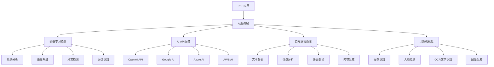

# 人工智能集成

## 🎯 学习目标
- 理解AI在PHP应用中的集成方式
- 掌握机器学习模型在PHP中的使用
- 学会使用AI服务API和SDK
- 了解AI在Web开发中的实际应用场景

## 📚 核心概念

### AI集成架构



### AI集成方式对比

| 集成方式 | 描述 | 优点 | 缺点 | 适用场景 |
|----------|------|------|------|----------|
| API调用 | 调用第三方AI服务 | 简单快速 | 依赖网络 | 通用场景 |
| SDK集成 | 使用官方SDK | 功能完整 | 学习成本 | 复杂应用 |
| 本地模型 | 部署本地AI模型 | 数据安全 | 资源消耗 | 敏感数据 |
| 混合模式 | 结合多种方式 | 灵活性强 | 复杂度高 | 企业级应用 |

## 🔧 AI集成实现

### AI服务客户端
```php
<?php
// 1. AI服务基础客户端
abstract class AIServiceClient {
    protected string $apiKey;
    protected string $baseUrl;
    protected array $headers;
    
    public function __construct(string $apiKey, string $baseUrl = '') {
        $this->apiKey = $apiKey;
        $this->baseUrl = $baseUrl;
        $this->headers = [
            'Content-Type' => 'application/json',
            'Authorization' => "Bearer {$apiKey}"
        ];
    }
    
    protected function makeRequest(string $endpoint, array $data = [], string $method = 'POST'): array {
        $url = $this->baseUrl . $endpoint;
        $options = [
            'http' => [
                'method' => $method,
                'header' => implode("\r\n", array_map(function($key, $value) {
                    return "{$key}: {$value}";
                }, array_keys($this->headers), $this->headers)),
                'content' => json_encode($data)
            ]
        ];
        
        $context = stream_context_create($options);
        $response = file_get_contents($url, false, $context);
        
        if ($response === false) {
            throw new Exception('AI服务请求失败');
        }
        
        return json_decode($response, true);
    }
}

// 2. OpenAI客户端
class OpenAIClient extends AIServiceClient {
    public function __construct(string $apiKey) {
        parent::__construct($apiKey, 'https://api.openai.com/v1');
    }
    
    public function generateText(string $prompt, array $options = []): string {
        $data = array_merge([
            'model' => 'gpt-3.5-turbo',
            'messages' => [
                ['role' => 'user', 'content' => $prompt]
            ],
            'max_tokens' => 1000,
            'temperature' => 0.7
        ], $options);
        
        $response = $this->makeRequest('/chat/completions', $data);
        return $response['choices'][0]['message']['content'] ?? '';
    }
    
    public function generateImage(string $prompt, array $options = []): string {
        $data = array_merge([
            'prompt' => $prompt,
            'n' => 1,
            'size' => '512x512',
            'response_format' => 'url'
        ], $options);
        
        $response = $this->makeRequest('/images/generations', $data);
        return $response['data'][0]['url'] ?? '';
    }
    
    public function analyzeSentiment(string $text): array {
        $prompt = "分析以下文本的情感倾向，返回JSON格式：{\"sentiment\": \"positive/negative/neutral\", \"confidence\": 0.0-1.0}\n\n文本：{$text}";
        
        $response = $this->generateText($prompt, [
            'temperature' => 0.3,
            'max_tokens' => 100
        ]);
        
        return json_decode($response, true) ?: ['sentiment' => 'neutral', 'confidence' => 0.5];
    }
}

// 3. 自然语言处理服务
class NaturalLanguageProcessing {
    private OpenAIClient $openAI;
    
    public function __construct(OpenAIClient $openAI) {
        $this->openAI = $openAI;
    }
    
    public function summarizeText(string $text, int $maxLength = 200): string {
        $prompt = "请将以下文本总结为不超过{$maxLength}字的摘要：\n\n{$text}";
        
        return $this->openAI->generateText($prompt, [
            'temperature' => 0.5,
            'max_tokens' => $maxLength
        ]);
    }
    
    public function translateText(string $text, string $targetLanguage = '中文'): string {
        $prompt = "请将以下文本翻译成{$targetLanguage}：\n\n{$text}";
        
        return $this->openAI->generateText($prompt, [
            'temperature' => 0.3,
            'max_tokens' => 1000
        ]);
    }
    
    public function extractKeywords(string $text, int $count = 5): array {
        $prompt = "请从以下文本中提取{$count}个关键词，用逗号分隔：\n\n{$text}";
        
        $response = $this->openAI->generateText($prompt, [
            'temperature' => 0.3,
            'max_tokens' => 100
        ]);
        
        return array_map('trim', explode(',', $response));
    }
    
    public function classifyText(string $text, array $categories): string {
        $categoriesStr = implode(', ', $categories);
        $prompt = "请将以下文本分类到以下类别之一：{$categoriesStr}\n\n文本：{$text}\n\n只返回类别名称。";
        
        return $this->openAI->generateText($prompt, [
            'temperature' => 0.3,
            'max_tokens' => 50
        ]);
    }
}

// 4. 推荐系统
class RecommendationSystem {
    private array $userPreferences;
    private array $itemFeatures;
    
    public function __construct() {
        $this->userPreferences = [];
        $this->itemFeatures = [];
    }
    
    public function addUserPreference(int $userId, array $preferences): void {
        $this->userPreferences[$userId] = $preferences;
    }
    
    public function addItemFeature(int $itemId, array $features): void {
        $this->itemFeatures[$itemId] = $features;
    }
    
    public function calculateSimilarity(array $userPrefs, array $itemFeatures): float {
        $dotProduct = 0;
        $userNorm = 0;
        $itemNorm = 0;
        
        foreach ($userPrefs as $key => $value) {
            if (isset($itemFeatures[$key])) {
                $dotProduct += $value * $itemFeatures[$key];
                $userNorm += $value * $value;
                $itemNorm += $itemFeatures[$key] * $itemFeatures[$key];
            }
        }
        
        if ($userNorm == 0 || $itemNorm == 0) {
            return 0;
        }
        
        return $dotProduct / (sqrt($userNorm) * sqrt($itemNorm));
    }
    
    public function getRecommendations(int $userId, int $limit = 10): array {
        if (!isset($this->userPreferences[$userId])) {
            return [];
        }
        
        $userPrefs = $this->userPreferences[$userId];
        $recommendations = [];
        
        foreach ($this->itemFeatures as $itemId => $features) {
            $similarity = $this->calculateSimilarity($userPrefs, $features);
            $recommendations[] = [
                'item_id' => $itemId,
                'score' => $similarity
            ];
        }
        
        usort($recommendations, function($a, $b) {
            return $b['score'] <=> $a['score'];
        });
        
        return array_slice($recommendations, 0, $limit);
    }
    
    public function getCollaborativeFilteringRecommendations(int $userId, array $userItemRatings, int $limit = 10): array {
        $userRatings = $userItemRatings[$userId] ?? [];
        $similarUsers = $this->findSimilarUsers($userId, $userItemRatings);
        
        $recommendations = [];
        $itemScores = [];
        
        foreach ($similarUsers as $similarUserId => $similarity) {
            $similarUserRatings = $userItemRatings[$similarUserId] ?? [];
            
            foreach ($similarUserRatings as $itemId => $rating) {
                if (!isset($userRatings[$itemId])) {
                    if (!isset($itemScores[$itemId])) {
                        $itemScores[$itemId] = ['total' => 0, 'count' => 0];
                    }
                    $itemScores[$itemId]['total'] += $rating * $similarity;
                    $itemScores[$itemId]['count'] += $similarity;
                }
            }
        }
        
        foreach ($itemScores as $itemId => $score) {
            $recommendations[] = [
                'item_id' => $itemId,
                'score' => $score['total'] / $score['count']
            ];
        }
        
        usort($recommendations, function($a, $b) {
            return $b['score'] <=> $a['score'];
        });
        
        return array_slice($recommendations, 0, $limit);
    }
    
    private function findSimilarUsers(int $userId, array $userItemRatings): array {
        $userRatings = $userItemRatings[$userId] ?? [];
        $similarUsers = [];
        
        foreach ($userItemRatings as $otherUserId => $otherRatings) {
            if ($otherUserId === $userId) {
                continue;
            }
            
            $similarity = $this->calculateUserSimilarity($userRatings, $otherRatings);
            if ($similarity > 0) {
                $similarUsers[$otherUserId] = $similarity;
            }
        }
        
        arsort($similarUsers);
        return array_slice($similarUsers, 0, 10, true);
    }
    
    private function calculateUserSimilarity(array $ratings1, array $ratings2): float {
        $commonItems = array_intersect_key($ratings1, $ratings2);
        
        if (empty($commonItems)) {
            return 0;
        }
        
        $sum1 = 0;
        $sum2 = 0;
        $sumSq1 = 0;
        $sumSq2 = 0;
        $sumProduct = 0;
        $count = count($commonItems);
        
        foreach ($commonItems as $itemId => $rating1) {
            $rating2 = $ratings2[$itemId];
            $sum1 += $rating1;
            $sum2 += $rating2;
            $sumSq1 += $rating1 * $rating1;
            $sumSq2 += $rating2 * $rating2;
            $sumProduct += $rating1 * $rating2;
        }
        
        $numerator = $sumProduct - ($sum1 * $sum2 / $count);
        $denominator = sqrt(($sumSq1 - $sum1 * $sum1 / $count) * ($sumSq2 - $sum2 * $sum2 / $count));
        
        return $denominator == 0 ? 0 : $numerator / $denominator;
    }
}

// 使用示例
echo "=== 人工智能集成示例 ===\n";

try {
    // OpenAI客户端
    $openAI = new OpenAIClient('your-api-key-here');
    
    // 文本生成
    $generatedText = $openAI->generateText('请写一首关于春天的诗');
    echo "生成的文本: {$generatedText}\n";
    
    // 情感分析
    $sentiment = $openAI->analyzeSentiment('今天天气真好，心情很愉快！');
    echo "情感分析: " . json_encode($sentiment) . "\n";
    
    // 自然语言处理
    $nlp = new NaturalLanguageProcessing($openAI);
    
    $text = "人工智能是计算机科学的一个分支，它企图了解智能的实质，并生产出一种新的能以人类智能相似的方式做出反应的智能机器。";
    $summary = $nlp->summarizeText($text, 50);
    echo "文本摘要: {$summary}\n";
    
    $keywords = $nlp->extractKeywords($text, 3);
    echo "关键词: " . implode(', ', $keywords) . "\n";
    
    $category = $nlp->classifyText($text, ['科技', '教育', '娱乐', '体育']);
    echo "文本分类: {$category}\n";
    
    // 推荐系统
    $recommendationSystem = new RecommendationSystem();
    
    // 添加用户偏好
    $recommendationSystem->addUserPreference(1, [
        'action' => 0.8,
        'comedy' => 0.6,
        'drama' => 0.4,
        'horror' => 0.2
    ]);
    
    // 添加物品特征
    $recommendationSystem->addItemFeature(101, [
        'action' => 0.9,
        'comedy' => 0.1,
        'drama' => 0.3,
        'horror' => 0.0
    ]);
    
    $recommendationSystem->addItemFeature(102, [
        'action' => 0.2,
        'comedy' => 0.8,
        'drama' => 0.4,
        'horror' => 0.1
    ]);
    
    $recommendations = $recommendationSystem->getRecommendations(1, 5);
    echo "推荐结果: " . json_encode($recommendations) . "\n";
    
} catch (Exception $e) {
    echo "错误: " . $e->getMessage() . "\n";
}
?>
```

### 机器学习模型集成
```php
<?php
// 1. 机器学习模型接口
interface MLModelInterface {
    public function predict(array $input): array;
    public function train(array $data): void;
    public function save(string $path): void;
    public function load(string $path): void;
}

// 2. 简单线性回归模型
class LinearRegressionModel implements MLModelInterface {
    private array $weights;
    private float $bias;
    private bool $trained;
    
    public function __construct() {
        $this->weights = [];
        $this->bias = 0;
        $this->trained = false;
    }
    
    public function predict(array $input): array {
        if (!$this->trained) {
            throw new Exception('模型尚未训练');
        }
        
        $prediction = $this->bias;
        foreach ($input as $feature => $value) {
            if (isset($this->weights[$feature])) {
                $prediction += $this->weights[$feature] * $value;
            }
        }
        
        return ['prediction' => $prediction];
    }
    
    public function train(array $data): void {
        $features = array_keys($data[0]['input']);
        $this->weights = array_fill_keys($features, 0);
        
        $learningRate = 0.01;
        $epochs = 1000;
        
        for ($epoch = 0; $epoch < $epochs; $epoch++) {
            $totalError = 0;
            
            foreach ($data as $sample) {
                $prediction = $this->predict($sample['input'])['prediction'];
                $error = $sample['output'] - $prediction;
                $totalError += $error * $error;
                
                // 更新权重
                $this->bias += $learningRate * $error;
                foreach ($features as $feature) {
                    $this->weights[$feature] += $learningRate * $error * $sample['input'][$feature];
                }
            }
            
            if ($totalError < 0.001) {
                break;
            }
        }
        
        $this->trained = true;
    }
    
    public function save(string $path): void {
        $modelData = [
            'weights' => $this->weights,
            'bias' => $this->bias,
            'trained' => $this->trained
        ];
        
        file_put_contents($path, json_encode($modelData));
    }
    
    public function load(string $path): void {
        if (!file_exists($path)) {
            throw new Exception('模型文件不存在');
        }
        
        $modelData = json_decode(file_get_contents($path), true);
        $this->weights = $modelData['weights'];
        $this->bias = $modelData['bias'];
        $this->trained = $modelData['trained'];
    }
}

// 3. 朴素贝叶斯分类器
class NaiveBayesClassifier implements MLModelInterface {
    private array $classProbabilities;
    private array $featureProbabilities;
    private array $classes;
    private bool $trained;
    
    public function __construct() {
        $this->classProbabilities = [];
        $this->featureProbabilities = [];
        $this->classes = [];
        $this->trained = false;
    }
    
    public function predict(array $input): array {
        if (!$this->trained) {
            throw new Exception('模型尚未训练');
        }
        
        $predictions = [];
        
        foreach ($this->classes as $class) {
            $probability = $this->classProbabilities[$class];
            
            foreach ($input as $feature => $value) {
                if (isset($this->featureProbabilities[$class][$feature][$value])) {
                    $probability *= $this->featureProbabilities[$class][$feature][$value];
                }
            }
            
            $predictions[$class] = $probability;
        }
        
        arsort($predictions);
        $predictedClass = array_key_first($predictions);
        
        return [
            'predicted_class' => $predictedClass,
            'probabilities' => $predictions
        ];
    }
    
    public function train(array $data): void {
        $classCounts = [];
        $featureCounts = [];
        $totalSamples = count($data);
        
        // 统计类别和特征
        foreach ($data as $sample) {
            $class = $sample['output'];
            $this->classes[$class] = true;
            
            $classCounts[$class] = ($classCounts[$class] ?? 0) + 1;
            
            foreach ($sample['input'] as $feature => $value) {
                $featureCounts[$class][$feature][$value] = 
                    ($featureCounts[$class][$feature][$value] ?? 0) + 1;
            }
        }
        
        $this->classes = array_keys($this->classes);
        
        // 计算类别概率
        foreach ($this->classes as $class) {
            $this->classProbabilities[$class] = $classCounts[$class] / $totalSamples;
        }
        
        // 计算特征概率（使用拉普拉斯平滑）
        foreach ($this->classes as $class) {
            $classTotal = $classCounts[$class];
            
            foreach ($featureCounts[$class] as $feature => $values) {
                $featureTotal = array_sum($values);
                $uniqueValues = count($values);
                
                foreach ($values as $value => $count) {
                    $this->featureProbabilities[$class][$feature][$value] = 
                        ($count + 1) / ($featureTotal + $uniqueValues);
                }
            }
        }
        
        $this->trained = true;
    }
    
    public function save(string $path): void {
        $modelData = [
            'classProbabilities' => $this->classProbabilities,
            'featureProbabilities' => $this->featureProbabilities,
            'classes' => $this->classes,
            'trained' => $this->trained
        ];
        
        file_put_contents($path, json_encode($modelData));
    }
    
    public function load(string $path): void {
        if (!file_exists($path)) {
            throw new Exception('模型文件不存在');
        }
        
        $modelData = json_decode(file_get_contents($path), true);
        $this->classProbabilities = $modelData['classProbabilities'];
        $this->featureProbabilities = $modelData['featureProbabilities'];
        $this->classes = $modelData['classes'];
        $this->trained = $modelData['trained'];
    }
}

// 4. 模型管理器
class MLModelManager {
    private array $models;
    private string $modelPath;
    
    public function __construct(string $modelPath = './models') {
        $this->models = [];
        $this->modelPath = $modelPath;
        
        if (!is_dir($this->modelPath)) {
            mkdir($this->modelPath, 0755, true);
        }
    }
    
    public function registerModel(string $name, MLModelInterface $model): void {
        $this->models[$name] = $model;
    }
    
    public function getModel(string $name): MLModelInterface {
        if (!isset($this->models[$name])) {
            throw new Exception("模型 '{$name}' 未注册");
        }
        
        return $this->models[$name];
    }
    
    public function saveModel(string $name): void {
        $model = $this->getModel($name);
        $path = $this->modelPath . '/' . $name . '.json';
        $model->save($path);
    }
    
    public function loadModel(string $name, MLModelInterface $model): void {
        $path = $this->modelPath . '/' . $name . '.json';
        $model->load($path);
        $this->models[$name] = $model;
    }
    
    public function listModels(): array {
        return array_keys($this->models);
    }
}

// 使用示例
echo "=== 机器学习模型集成示例 ===\n";

try {
    // 模型管理器
    $modelManager = new MLModelManager();
    
    // 线性回归模型示例
    $linearModel = new LinearRegressionModel();
    
    // 训练数据：房屋价格预测
    $trainingData = [
        ['input' => ['size' => 100, 'rooms' => 2], 'output' => 300000],
        ['input' => ['size' => 150, 'rooms' => 3], 'output' => 450000],
        ['input' => ['size' => 200, 'rooms' => 4], 'output' => 600000],
        ['input' => ['size' => 120, 'rooms' => 2], 'output' => 360000],
        ['input' => ['size' => 180, 'rooms' => 3], 'output' => 540000]
    ];
    
    $linearModel->train($trainingData);
    $modelManager->registerModel('house_price', $linearModel);
    
    // 预测房屋价格
    $prediction = $linearModel->predict(['size' => 160, 'rooms' => 3]);
    echo "房屋价格预测: $" . number_format($prediction['prediction']) . "\n";
    
    // 朴素贝叶斯分类器示例
    $naiveBayes = new NaiveBayesClassifier();
    
    // 训练数据：邮件分类
    $emailData = [
        ['input' => ['word1' => 'free', 'word2' => 'money'], 'output' => 'spam'],
        ['input' => ['word1' => 'meeting', 'word2' => 'tomorrow'], 'output' => 'ham'],
        ['input' => ['word1' => 'winner', 'word2' => 'congratulations'], 'output' => 'spam'],
        ['input' => ['word1' => 'project', 'word2' => 'update'], 'output' => 'ham'],
        ['input' => ['word1' => 'urgent', 'word2' => 'action'], 'output' => 'spam']
    ];
    
    $naiveBayes->train($emailData);
    $modelManager->registerModel('email_classifier', $naiveBayes);
    
    // 分类邮件
    $classification = $naiveBayes->predict(['word1' => 'free', 'word2' => 'offer']);
    echo "邮件分类: " . $classification['predicted_class'] . "\n";
    echo "分类概率: " . json_encode($classification['probabilities']) . "\n";
    
    // 保存模型
    $modelManager->saveModel('house_price');
    $modelManager->saveModel('email_classifier');
    
    echo "模型已保存\n";
    echo "已注册的模型: " . implode(', ', $modelManager->listModels()) . "\n";
    
} catch (Exception $e) {
    echo "错误: " . $e->getMessage() . "\n";
}
?>
```

## 📊 最佳实践

### AI集成最佳实践
```php
<?php
// AI集成最佳实践

class AIIntegrationBestPractices {
    // 1. API集成最佳实践
    public static function getAPIIntegrationBestPractices() {
        return [
            '错误处理' => [
                '重试机制' => '实现指数退避重试机制',
                '超时设置' => '设置合理的请求超时时间',
                '错误分类' => '区分不同类型的错误',
                '降级策略' => '实现服务降级策略'
            ],
            '性能优化' => [
                '连接池' => '使用连接池管理HTTP连接',
                '缓存策略' => '缓存AI服务响应结果',
                '批量处理' => '批量处理请求提高效率',
                '异步调用' => '使用异步调用提高并发'
            ],
            '安全考虑' => [
                'API密钥管理' => '安全存储和管理API密钥',
                '请求验证' => '验证输入数据的安全性',
                '响应过滤' => '过滤敏感信息',
                '访问控制' => '实现访问频率限制'
            ]
        ];
    }
    
    // 2. 模型管理最佳实践
    public static function getModelManagementBestPractices() {
        return [
            '模型版本控制' => [
                '版本管理' => '为模型建立版本控制系统',
                'A/B测试' => '使用A/B测试验证模型效果',
                '回滚机制' => '实现模型快速回滚',
                '性能监控' => '监控模型性能指标'
            ],
            '数据管理' => [
                '数据质量' => '确保训练数据质量',
                '数据隐私' => '保护用户数据隐私',
                '数据备份' => '定期备份重要数据',
                '数据清理' => '定期清理过期数据'
            ],
            '模型优化' => [
                '特征工程' => '优化特征选择和工程',
                '超参数调优' => '系统化调优超参数',
                '模型融合' => '使用模型融合提高效果',
                '在线学习' => '实现模型在线更新'
            ]
        ];
    }
    
    // 3. 应用集成最佳实践
    public static function getApplicationIntegrationBestPractices() {
        return [
            '架构设计' => [
                '微服务架构' => '将AI功能设计为独立服务',
                'API网关' => '使用API网关管理AI服务',
                '服务发现' => '实现AI服务自动发现',
                '负载均衡' => '配置AI服务负载均衡'
            ],
            '用户体验' => [
                '响应时间' => '优化AI服务响应时间',
                '进度提示' => '为用户提供处理进度提示',
                '错误提示' => '提供友好的错误提示',
                '结果解释' => '解释AI决策结果'
            ],
            '监控运维' => [
                '性能监控' => '监控AI服务性能指标',
                '质量监控' => '监控AI输出质量',
                '成本控制' => '监控和控制AI服务成本',
                '告警机制' => '建立完善的告警机制'
            ]
        ];
    }
}

// 使用示例
echo "=== AI集成最佳实践示例 ===\n";

try {
    $apiPractices = AIIntegrationBestPractices::getAPIIntegrationBestPractices();
    echo "API集成最佳实践:\n";
    foreach ($apiPractices as $category => $practices) {
        echo "  $category:\n";
        foreach ($practices as $practice => $description) {
            echo "    - $practice: $description\n";
        }
        echo "\n";
    }
    
    $modelPractices = AIIntegrationBestPractices::getModelManagementBestPractices();
    echo "模型管理最佳实践:\n";
    foreach ($modelPractices as $category => $practices) {
        echo "  $category:\n";
        foreach ($practices as $practice => $description) {
            echo "    - $practice: $description\n";
        }
        echo "\n";
    }
    
    $appPractices = AIIntegrationBestPractices::getApplicationIntegrationBestPractices();
    echo "应用集成最佳实践:\n";
    foreach ($appPractices as $category => $practices) {
        echo "  $category:\n";
        foreach ($practices as $practice => $description) {
            echo "    - $practice: $description\n";
        }
        echo "\n";
    }
    
} catch (Exception $e) {
    echo "错误: " . $e->getMessage() . "\n";
}
?>
```

## 🎓 学习建议

### 费曼学习法应用
1. **选择概念**: 选择AI集成中的核心概念
2. **简化解释**: 用简单语言解释AI集成的重要性
3. **识别盲点**: 发现理解不深入的地方
4. **重新学习**: 针对盲点进行深入学习

### 刻意练习重点
1. **API集成**: 掌握AI服务API的使用方法
2. **模型管理**: 学会管理和优化机器学习模型
3. **应用集成**: 理解AI在Web应用中的集成方式
4. **最佳实践**: 遵循AI集成的最佳实践

## 🔗 相关链接
- [[01-PHP 8+新特性|PHP 8+新特性]]
- [[02-JIT编译器|JIT编译器]]
- [[03-现代PHP特性|现代PHP特性]]
- [[04-云原生开发|云原生开发]]
- [[06-未来发展趋势|未来发展趋势]]
- [[07-技术趋势分析|技术趋势分析]]
