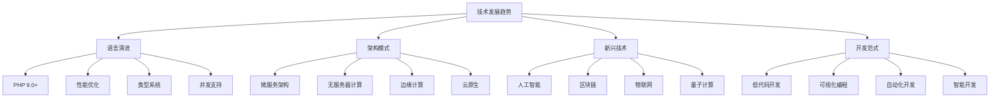

# 未来发展趋势

## 🎯 学习目标
- 了解PHP语言的发展趋势和未来方向
- 掌握Web开发技术的最新发展趋势
- 理解云计算、AI、区块链等新兴技术对PHP的影响
- 学会预测和适应技术发展趋势

## 📚 核心概念

### 技术发展趋势架构



### 技术发展趋势时间线

| 时间 | 主要趋势 | 技术特点 | 影响范围 |
|------|----------|----------|----------|
| 2024 | 云原生普及 | 容器化、微服务 | 企业级应用 |
| 2025 | AI集成深化 | 智能开发、自动化 | 开发工具链 |
| 2026 | 边缘计算兴起 | 低延迟、分布式 | 实时应用 |
| 2027 | 量子计算应用 | 超强计算能力 | 科学计算 |
| 2028 | 无服务器主流 | 事件驱动、按需计算 | Web应用 |

## 🔧 未来发展趋势实现

### PHP语言发展趋势
```php
<?php
// 1. PHP 9.0+ 新特性预测
class PHP9Features {
    // 预测的联合类型改进
    public function enhancedUnionTypes(string|int|float $value): string|int|float {
        return match (gettype($value)) {
            'string' => strtoupper($value),
            'integer' => $value * 2,
            'double' => round($value, 2),
            default => $value
        };
    }
    
    // 预测的模式匹配
    public function patternMatching(mixed $data): string {
        return match ($data) {
            is_string($data) && strlen($data) > 10 => 'Long string',
            is_array($data) && count($data) > 5 => 'Large array',
            is_object($data) && $data instanceof DateTime => 'Date object',
            default => 'Unknown type'
        };
    }
    
    // 预测的异步改进
    public function improvedAsync(): Generator {
        yield from $this->asyncOperation1();
        yield from $this->asyncOperation2();
        yield from $this->asyncOperation3();
    }
    
    private function asyncOperation1(): Generator {
        // 模拟异步操作
        yield 'Operation 1 completed';
    }
    
    private function asyncOperation2(): Generator {
        yield 'Operation 2 completed';
    }
    
    private function asyncOperation3(): Generator {
        yield 'Operation 3 completed';
    }
}

// 2. 未来架构模式
class FutureArchitecturePatterns {
    // 无服务器架构
    public function serverlessFunction(array $event, array $context): array {
        // 模拟无服务器函数
        $input = $event['body'] ?? '';
        $result = $this->processRequest($input);
        
        return [
            'statusCode' => 200,
            'body' => json_encode($result),
            'headers' => ['Content-Type' => 'application/json']
        ];
    }
    
    private function processRequest(string $input): array {
        return [
            'message' => 'Processed: ' . $input,
            'timestamp' => time(),
            'requestId' => uniqid()
        ];
    }
    
    // 边缘计算
    public function edgeComputing(array $data): array {
        // 模拟边缘计算处理
        $processedData = [];
        
        foreach ($data as $item) {
            // 在边缘节点处理数据
            $processedData[] = [
                'id' => $item['id'],
                'processed_at' => time(),
                'edge_node' => 'edge-001',
                'result' => $this->processAtEdge($item)
            ];
        }
        
        return $processedData;
    }
    
    private function processAtEdge(array $item): mixed {
        // 边缘处理逻辑
        return $item['value'] * 2;
    }
    
    // 事件驱动架构
    public function eventDrivenArchitecture(string $eventType, array $eventData): void {
        $eventBus = new EventBus();
        
        $eventBus->publish($eventType, $eventData);
        
        // 事件处理器
        $eventBus->subscribe('user.created', function($data) {
            $this->sendWelcomeEmail($data);
        });
        
        $eventBus->subscribe('order.completed', function($data) {
            $this->updateInventory($data);
        });
    }
    
    private function sendWelcomeEmail(array $userData): void {
        echo "发送欢迎邮件给: {$userData['email']}\n";
    }
    
    private function updateInventory(array $orderData): void {
        echo "更新库存: {$orderData['product_id']}\n";
    }
}

// 3. 新兴技术集成
class EmergingTechnologies {
    // 区块链集成
    public function blockchainIntegration(array $transactionData): string {
        $blockchain = new Blockchain();
        
        $transaction = [
            'from' => $transactionData['from'],
            'to' => $transactionData['to'],
            'amount' => $transactionData['amount'],
            'timestamp' => time(),
            'hash' => $this->calculateHash($transactionData)
        ];
        
        $blockHash = $blockchain->addBlock($transaction);
        
        return $blockHash;
    }
    
    private function calculateHash(array $data): string {
        return hash('sha256', json_encode($data));
    }
    
    // 物联网集成
    public function iotIntegration(array $sensorData): array {
        $iotPlatform = new IoTPlatform();
        
        $processedData = [];
        
        foreach ($sensorData as $sensor) {
            $processedData[] = [
                'sensor_id' => $sensor['id'],
                'value' => $sensor['value'],
                'unit' => $sensor['unit'],
                'timestamp' => time(),
                'status' => $this->analyzeSensorData($sensor)
            ];
        }
        
        $iotPlatform->storeData($processedData);
        
        return $processedData;
    }
    
    private function analyzeSensorData(array $sensor): string {
        $value = $sensor['value'];
        $threshold = $sensor['threshold'] ?? 100;
        
        return $value > $threshold ? 'ALERT' : 'NORMAL';
    }
    
    // 量子计算模拟
    public function quantumComputingSimulation(array $problem): array {
        $quantumSimulator = new QuantumSimulator();
        
        // 模拟量子算法
        $result = $quantumSimulator->solve($problem);
        
        return [
            'solution' => $result,
            'confidence' => 0.95,
            'execution_time' => microtime(true),
            'qubits_used' => 8
        ];
    }
}

// 4. 开发范式演进
class DevelopmentParadigmEvolution {
    // 低代码开发
    public function lowCodeDevelopment(array $requirements): array {
        $lowCodePlatform = new LowCodePlatform();
        
        $application = $lowCodePlatform->createApplication([
            'name' => $requirements['name'],
            'type' => $requirements['type'],
            'features' => $requirements['features']
        ]);
        
        return [
            'app_id' => $application['id'],
            'generated_code' => $application['code'],
            'deployment_url' => $application['url'],
            'estimated_development_time' => '2 hours'
        ];
    }
    
    // 可视化编程
    public function visualProgramming(array $workflow): array {
        $visualEditor = new VisualEditor();
        
        $nodes = [];
        foreach ($workflow['steps'] as $step) {
            $nodes[] = [
                'id' => $step['id'],
                'type' => $step['type'],
                'position' => $step['position'],
                'data' => $step['data']
            ];
        }
        
        $compiledCode = $visualEditor->compile($nodes);
        
        return [
            'workflow_id' => uniqid(),
            'compiled_code' => $compiledCode,
            'execution_plan' => $visualEditor->generateExecutionPlan($nodes)
        ];
    }
    
    // 自动化开发
    public function automatedDevelopment(string $description): array {
        $aiDeveloper = new AIDeveloper();
        
        $code = $aiDeveloper->generateCode($description);
        $tests = $aiDeveloper->generateTests($code);
        $documentation = $aiDeveloper->generateDocumentation($code);
        
        return [
            'generated_code' => $code,
            'unit_tests' => $tests,
            'documentation' => $documentation,
            'code_quality_score' => $aiDeveloper->analyzeCodeQuality($code)
        ];
    }
    
    // 智能开发
    public function intelligentDevelopment(array $projectContext): array {
        $intelligentIDE = new IntelligentIDE();
        
        $suggestions = $intelligentIDE->getSuggestions($projectContext);
        $refactoring = $intelligentIDE->suggestRefactoring($projectContext['code']);
        $optimization = $intelligentIDE->suggestOptimization($projectContext['code']);
        
        return [
            'code_suggestions' => $suggestions,
            'refactoring_suggestions' => $refactoring,
            'optimization_suggestions' => $optimization,
            'estimated_improvement' => '25% performance gain'
        ];
    }
}

// 使用示例
echo "=== 未来发展趋势示例 ===\n";

try {
    // PHP 9.0+ 新特性
    $php9Features = new PHP9Features();
    
    $result = $php9Features->enhancedUnionTypes("hello");
    echo "联合类型结果: {$result}\n";
    
    $patternResult = $php9Features->patternMatching("这是一个很长的字符串");
    echo "模式匹配结果: {$patternResult}\n";
    
    // 未来架构模式
    $futureArchitecture = new FutureArchitecturePatterns();
    
    $serverlessResult = $futureArchitecture->serverlessFunction(
        ['body' => 'test data'],
        ['requestId' => 'req-123']
    );
    echo "无服务器函数结果: " . json_encode($serverlessResult) . "\n";
    
    $edgeResult = $futureArchitecture->edgeComputing([
        ['id' => 1, 'value' => 10],
        ['id' => 2, 'value' => 20]
    ]);
    echo "边缘计算结果: " . json_encode($edgeResult) . "\n";
    
    // 新兴技术集成
    $emergingTech = new EmergingTechnologies();
    
    $blockchainResult = $emergingTech->blockchainIntegration([
        'from' => 'user1',
        'to' => 'user2',
        'amount' => 100
    ]);
    echo "区块链交易哈希: {$blockchainResult}\n";
    
    $iotResult = $emergingTech->iotIntegration([
        ['id' => 'sensor1', 'value' => 75, 'unit' => 'C', 'threshold' => 80],
        ['id' => 'sensor2', 'value' => 85, 'unit' => 'C', 'threshold' => 80]
    ]);
    echo "物联网数据处理: " . json_encode($iotResult) . "\n";
    
    // 开发范式演进
    $devParadigm = new DevelopmentParadigmEvolution();
    
    $lowCodeResult = $devParadigm->lowCodeDevelopment([
        'name' => 'My App',
        'type' => 'web',
        'features' => ['user_management', 'data_visualization']
    ]);
    echo "低代码开发结果: " . json_encode($lowCodeResult) . "\n";
    
} catch (Exception $e) {
    echo "错误: " . $e->getMessage() . "\n";
}
?>
```

### 技术趋势分析工具
```php
<?php
// 1. 技术趋势分析器
class TechnologyTrendAnalyzer {
    private array $trends;
    private array $indicators;
    
    public function __construct() {
        $this->trends = [];
        $this->indicators = [];
    }
    
    // 分析技术趋势
    public function analyzeTrend(string $technology, array $data): array {
        $analysis = [
            'technology' => $technology,
            'trend_direction' => $this->calculateTrendDirection($data),
            'growth_rate' => $this->calculateGrowthRate($data),
            'adoption_level' => $this->calculateAdoptionLevel($data),
            'future_projection' => $this->projectFuture($data),
            'recommendations' => $this->generateRecommendations($data)
        ];
        
        $this->trends[$technology] = $analysis;
        return $analysis;
    }
    
    private function calculateTrendDirection(array $data): string {
        $values = array_column($data, 'value');
        $slope = $this->calculateSlope($values);
        
        if ($slope > 0.1) return '上升';
        if ($slope < -0.1) return '下降';
        return '稳定';
    }
    
    private function calculateGrowthRate(array $data): float {
        $values = array_column($data, 'value');
        $first = $values[0];
        $last = $values[count($values) - 1];
        
        return ($last - $first) / $first * 100;
    }
    
    private function calculateAdoptionLevel(array $data): string {
        $latest = $data[count($data) - 1]['value'];
        
        if ($latest > 80) return '高';
        if ($latest > 50) return '中';
        if ($latest > 20) return '低';
        return '极低';
    }
    
    private function projectFuture(array $data): array {
        $values = array_column($data, 'value');
        $slope = $this->calculateSlope($values);
        $latest = $values[count($values) - 1];
        
        return [
            'next_month' => $latest + $slope * 30,
            'next_quarter' => $latest + $slope * 90,
            'next_year' => $latest + $slope * 365
        ];
    }
    
    private function generateRecommendations(array $data): array {
        $recommendations = [];
        $trend = $this->calculateTrendDirection($data);
        $adoption = $this->calculateAdoptionLevel($data);
        
        if ($trend === '上升' && $adoption === '低') {
            $recommendations[] = '建议开始学习和采用此技术';
        } elseif ($trend === '上升' && $adoption === '中') {
            $recommendations[] = '建议加大投入，抢占市场先机';
        } elseif ($trend === '下降') {
            $recommendations[] = '建议考虑替代技术或升级方案';
        }
        
        return $recommendations;
    }
    
    private function calculateSlope(array $values): float {
        $n = count($values);
        $sumX = 0;
        $sumY = 0;
        $sumXY = 0;
        $sumXX = 0;
        
        for ($i = 0; $i < $n; $i++) {
            $x = $i;
            $y = $values[$i];
            $sumX += $x;
            $sumY += $y;
            $sumXY += $x * $y;
            $sumXX += $x * $x;
        }
        
        return ($n * $sumXY - $sumX * $sumY) / ($n * $sumXX - $sumX * $sumX);
    }
}

// 2. 技术成熟度评估
class TechnologyMaturityAssessment {
    // 技术成熟度模型
    public function assessMaturity(string $technology, array $criteria): array {
        $scores = [
            'research' => $this->evaluateResearch($criteria['research']),
            'development' => $this->evaluateDevelopment($criteria['development']),
            'adoption' => $this->evaluateAdoption($criteria['adoption']),
            'standardization' => $this->evaluateStandardization($criteria['standardization']),
            'ecosystem' => $this->evaluateEcosystem($criteria['ecosystem'])
        ];
        
        $overallScore = array_sum($scores) / count($scores);
        $maturityLevel = $this->determineMaturityLevel($overallScore);
        
        return [
            'technology' => $technology,
            'scores' => $scores,
            'overall_score' => $overallScore,
            'maturity_level' => $maturityLevel,
            'recommendations' => $this->getMaturityRecommendations($maturityLevel)
        ];
    }
    
    private function evaluateResearch(array $research): float {
        $score = 0;
        $score += $research['papers'] * 0.3;
        $score += $research['patents'] * 0.2;
        $score += $research['funding'] * 0.3;
        $score += $research['conferences'] * 0.2;
        
        return min($score, 100);
    }
    
    private function evaluateDevelopment(array $development): float {
        $score = 0;
        $score += $development['prototypes'] * 0.4;
        $score += $development['tools'] * 0.3;
        $score += $development['libraries'] * 0.3;
        
        return min($score, 100);
    }
    
    private function evaluateAdoption(array $adoption): float {
        $score = 0;
        $score += $adoption['companies'] * 0.4;
        $score += $adoption['projects'] * 0.3;
        $score += $adoption['users'] * 0.3;
        
        return min($score, 100);
    }
    
    private function evaluateStandardization(array $standardization): float {
        $score = 0;
        $score += $standardization['standards'] * 0.5;
        $score += $standardization['certifications'] * 0.3;
        $score += $standardization['compliance'] * 0.2;
        
        return min($score, 100);
    }
    
    private function evaluateEcosystem(array $ecosystem): float {
        $score = 0;
        $score += $ecosystem['community'] * 0.3;
        $score += $ecosystem['support'] * 0.3;
        $score += $ecosystem['documentation'] * 0.2;
        $score += $ecosystem['training'] * 0.2;
        
        return min($score, 100);
    }
    
    private function determineMaturityLevel(float $score): string {
        if ($score >= 80) return '成熟';
        if ($score >= 60) return '发展中';
        if ($score >= 40) return '早期';
        if ($score >= 20) return '实验性';
        return '概念性';
    }
    
    private function getMaturityRecommendations(string $level): array {
        $recommendations = [
            '概念性' => ['继续研究', '关注发展动态'],
            '实验性' => ['小规模试验', '评估可行性'],
            '早期' => ['开始学习', '准备采用'],
            '发展中' => ['积极采用', '建立团队'],
            '成熟' => ['大规模应用', '优化改进']
        ];
        
        return $recommendations[$level] ?? [];
    }
}

// 3. 技术投资建议
class TechnologyInvestmentAdvisor {
    // 技术投资分析
    public function analyzeInvestment(array $technologies, array $budget): array {
        $analysis = [];
        
        foreach ($technologies as $tech) {
            $roi = $this->calculateROI($tech);
            $risk = $this->assessRisk($tech);
            $priority = $this->calculatePriority($tech, $roi, $risk);
            
            $analysis[] = [
                'technology' => $tech['name'],
                'roi' => $roi,
                'risk' => $risk,
                'priority' => $priority,
                'recommended_investment' => $this->recommendInvestment($tech, $budget, $priority)
            ];
        }
        
        usort($analysis, function($a, $b) {
            return $b['priority'] <=> $a['priority'];
        });
        
        return $analysis;
    }
    
    private function calculateROI(array $tech): float {
        $potential = $tech['market_potential'] ?? 50;
        $cost = $tech['implementation_cost'] ?? 50;
        $time = $tech['time_to_market'] ?? 12;
        
        // 简化的ROI计算
        return ($potential / $cost) * (12 / $time) * 100;
    }
    
    private function assessRisk(array $tech): string {
        $maturity = $tech['maturity'] ?? 'early';
        $competition = $tech['competition'] ?? 'medium';
        $complexity = $tech['complexity'] ?? 'medium';
        
        $riskScore = 0;
        
        if ($maturity === 'early') $riskScore += 3;
        if ($maturity === 'developing') $riskScore += 2;
        if ($maturity === 'mature') $riskScore += 1;
        
        if ($competition === 'high') $riskScore += 3;
        if ($competition === 'medium') $riskScore += 2;
        if ($competition === 'low') $riskScore += 1;
        
        if ($complexity === 'high') $riskScore += 3;
        if ($complexity === 'medium') $riskScore += 2;
        if ($complexity === 'low') $riskScore += 1;
        
        if ($riskScore >= 7) return '高';
        if ($riskScore >= 4) return '中';
        return '低';
    }
    
    private function calculatePriority(array $tech, float $roi, string $risk): float {
        $riskScore = $risk === '高' ? 1 : ($risk === '中' ? 2 : 3);
        return $roi * $riskScore;
    }
    
    private function recommendInvestment(array $tech, array $budget, float $priority): float {
        $maxInvestment = $budget['total'] * 0.3; // 单个技术最大投资30%
        $baseInvestment = $budget['total'] * 0.1; // 基础投资10%
        
        $investment = $baseInvestment * ($priority / 100);
        
        return min($investment, $maxInvestment);
    }
}

// 使用示例
echo "=== 技术趋势分析工具示例 ===\n";

try {
    // 技术趋势分析器
    $trendAnalyzer = new TechnologyTrendAnalyzer();
    
    $phpData = [
        ['date' => '2024-01', 'value' => 75],
        ['date' => '2024-02', 'value' => 78],
        ['date' => '2024-03', 'value' => 82],
        ['date' => '2024-04', 'value' => 85],
        ['date' => '2024-05', 'value' => 88]
    ];
    
    $phpTrend = $trendAnalyzer->analyzeTrend('PHP', $phpData);
    echo "PHP趋势分析: " . json_encode($phpTrend) . "\n";
    
    // 技术成熟度评估
    $maturityAssessment = new TechnologyMaturityAssessment();
    
    $aiCriteria = [
        'research' => ['papers' => 80, 'patents' => 70, 'funding' => 90, 'conferences' => 85],
        'development' => ['prototypes' => 75, 'tools' => 80, 'libraries' => 85],
        'adoption' => ['companies' => 70, 'projects' => 75, 'users' => 80],
        'standardization' => ['standards' => 60, 'certifications' => 50, 'compliance' => 55],
        'ecosystem' => ['community' => 85, 'support' => 80, 'documentation' => 75, 'training' => 70]
    ];
    
    $aiMaturity = $maturityAssessment->assessMaturity('人工智能', $aiCriteria);
    echo "AI成熟度评估: " . json_encode($aiMaturity) . "\n";
    
    // 技术投资建议
    $investmentAdvisor = new TechnologyInvestmentAdvisor();
    
    $technologies = [
        [
            'name' => '云原生',
            'market_potential' => 90,
            'implementation_cost' => 60,
            'time_to_market' => 6,
            'maturity' => 'developing',
            'competition' => 'medium',
            'complexity' => 'medium'
        ],
        [
            'name' => '区块链',
            'market_potential' => 70,
            'implementation_cost' => 80,
            'time_to_market' => 18,
            'maturity' => 'early',
            'competition' => 'high',
            'complexity' => 'high'
        ]
    ];
    
    $budget = ['total' => 1000000];
    
    $investmentAnalysis = $investmentAdvisor->analyzeInvestment($technologies, $budget);
    echo "技术投资分析: " . json_encode($investmentAnalysis) . "\n";
    
} catch (Exception $e) {
    echo "错误: " . $e->getMessage() . "\n";
}
?>
```

## 📊 最佳实践

### 技术趋势适应最佳实践
```php
<?php
// 技术趋势适应最佳实践

class TechnologyTrendAdaptationBestPractices {
    // 1. 趋势识别
    public static function getTrendIdentificationBestPractices() {
        return [
            '信息收集' => [
                '技术博客' => '关注知名技术博客和网站',
                '开源项目' => '监控GitHub等开源平台',
                '会议演讲' => '参加技术会议和研讨会',
                '行业报告' => '阅读权威机构的技术报告'
            ],
            '数据分析' => [
                '使用统计' => '分析技术使用统计数据',
                '招聘需求' => '关注招聘市场技术需求',
                '投资趋势' => '分析技术投资趋势',
                '社区活跃度' => '监控技术社区活跃度'
            ],
            '趋势验证' => [
                '多源验证' => '从多个来源验证趋势',
                '时间验证' => '观察趋势的持续性',
                '影响评估' => '评估趋势的影响范围',
                '风险评估' => '评估跟随趋势的风险'
            ]
        ];
    }
    
    // 2. 技术学习
    public static function getTechnologyLearningBestPractices() {
        return [
            '学习策略' => [
                '渐进学习' => '采用渐进式学习方法',
                '实践导向' => '注重实践和项目应用',
                '社区参与' => '积极参与技术社区',
                '知识分享' => '通过分享巩固学习'
            ],
            '技能发展' => [
                '基础巩固' => '巩固现有技术基础',
                '新技能学习' => '系统学习新技能',
                '跨领域整合' => '整合不同领域知识',
                '持续更新' => '持续更新知识体系'
            ],
            '学习资源' => [
                '官方文档' => '优先阅读官方文档',
                '在线课程' => '参加在线学习课程',
                '实践项目' => '通过项目实践学习',
                '导师指导' => '寻求经验丰富者指导'
            ]
        ];
    }
    
    // 3. 技术采用
    public static function getTechnologyAdoptionBestPractices() {
        return [
            '采用策略' => [
                '渐进采用' => '采用渐进式技术引入',
                '试点项目' => '通过试点项目验证',
                '风险评估' => '充分评估采用风险',
                '团队培训' => '提前进行团队培训'
            ],
            '实施管理' => [
                '项目管理' => '采用项目管理方法',
                '质量控制' => '建立质量控制体系',
                '进度监控' => '监控实施进度',
                '问题解决' => '及时解决实施问题'
            ],
            '效果评估' => [
                '指标设定' => '设定明确的评估指标',
                '数据收集' => '收集相关数据',
                '效果分析' => '分析技术采用效果',
                '持续改进' => '基于评估结果改进'
            ]
        ];
    }
    
    // 4. 创新实践
    public static function getInnovationBestPractices() {
        return [
            '创新思维' => [
                '开放心态' => '保持开放和好奇心态',
                '跨界思考' => '进行跨界思维和创新',
                '问题导向' => '以解决问题为导向',
                '用户中心' => '以用户需求为中心'
            ],
            '创新方法' => [
                '设计思维' => '运用设计思维方法',
                '敏捷开发' => '采用敏捷开发方法',
                '快速原型' => '快速构建和测试原型',
                '迭代改进' => '通过迭代持续改进'
            ],
            '创新环境' => [
                '文化氛围' => '营造创新文化氛围',
                '资源支持' => '提供必要的资源支持',
                '激励机制' => '建立创新激励机制',
                '风险容忍' => '容忍创新过程中的风险'
            ]
        ];
    }
}

// 使用示例
echo "=== 技术趋势适应最佳实践示例 ===\n";

try {
    $trendIdentification = TechnologyTrendAdaptationBestPractices::getTrendIdentificationBestPractices();
    echo "趋势识别最佳实践:\n";
    foreach ($trendIdentification as $category => $practices) {
        echo "  $category:\n";
        foreach ($practices as $practice => $description) {
            echo "    - $practice: $description\n";
        }
        echo "\n";
    }
    
    $technologyLearning = TechnologyTrendAdaptationBestPractices::getTechnologyLearningBestPractices();
    echo "技术学习最佳实践:\n";
    foreach ($technologyLearning as $category => $practices) {
        echo "  $category:\n";
        foreach ($practices as $practice => $description) {
            echo "    - $practice: $description\n";
        }
        echo "\n";
    }
    
    $technologyAdoption = TechnologyTrendAdaptationBestPractices::getTechnologyAdoptionBestPractices();
    echo "技术采用最佳实践:\n";
    foreach ($technologyAdoption as $category => $practices) {
        echo "  $category:\n";
        foreach ($practices as $practice => $description) {
            echo "    - $practice: $description\n";
        }
        echo "\n";
    }
    
    $innovation = TechnologyTrendAdaptationBestPractices::getInnovationBestPractices();
    echo "创新实践最佳实践:\n";
    foreach ($innovation as $category => $practices) {
        echo "  $category:\n";
        foreach ($practices as $practice => $description) {
            echo "    - $practice: $description\n";
        }
        echo "\n";
    }
    
} catch (Exception $e) {
    echo "错误: " . $e->getMessage() . "\n";
}
?>
```

## 🎓 学习建议

### 费曼学习法应用
1. **选择概念**: 选择未来发展趋势中的核心概念
2. **简化解释**: 用简单语言解释技术趋势的重要性
3. **识别盲点**: 发现理解不深入的地方
4. **重新学习**: 针对盲点进行深入学习

### 刻意练习重点
1. **趋势分析**: 掌握技术趋势分析方法
2. **技术评估**: 学会评估技术成熟度和投资价值
3. **适应策略**: 制定技术趋势适应策略
4. **创新实践**: 培养创新思维和实践能力

## 🔗 相关链接
- [[01-PHP 8+新特性|PHP 8+新特性]]
- [[02-JIT编译器|JIT编译器]]
- [[03-现代PHP特性|现代PHP特性]]
- [[04-云原生开发|云原生开发]]
- [[05-人工智能集成|人工智能集成]]
- [[07-技术趋势分析|技术趋势分析]]
