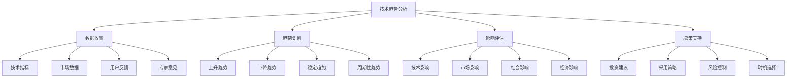

# 技术趋势分析

## 🎯 学习目标
- 掌握技术趋势分析的方法和工具
- 学会评估技术成熟度和市场前景
- 理解技术生命周期和采用曲线
- 建立技术决策分析框架

## 📚 核心概念

### 技术趋势分析框架



### 技术成熟度曲线

| 阶段 | 特征 | 技术特点 | 市场表现 | 投资建议 |
|------|------|----------|----------|----------|
| 技术萌芽期 | 概念验证 | 原型阶段 | 关注度高 | 观察研究 |
| 期望膨胀期 | 媒体炒作 | 早期产品 | 投资热潮 | 谨慎评估 |
| 幻灭低谷期 | 现实检验 | 技术限制 | 投资降温 | 深度分析 |
| 启蒙爬升期 | 实用化 | 成熟产品 | 稳步增长 | 开始投资 |
| 生产力高原期 | 主流应用 | 标准化 | 稳定市场 | 大规模采用 |

## 🔧 技术趋势分析实现

### 趋势分析工具
```php
<?php
// 1. 技术趋势分析器
class TechnologyTrendAnalyzer {
    private array $dataSources;
    private array $indicators;
    
    public function __construct() {
        $this->dataSources = [
            'github' => new GitHubTrendAnalyzer(),
            'stackoverflow' => new StackOverflowAnalyzer(),
            'google_trends' => new GoogleTrendsAnalyzer(),
            'job_market' => new JobMarketAnalyzer()
        ];
        
        $this->indicators = [
            'adoption_rate' => 0.3,
            'growth_rate' => 0.25,
            'community_activity' => 0.2,
            'market_demand' => 0.25
        ];
    }
    
    // 分析技术趋势
    public function analyzeTechnologyTrend(string $technology, int $timeframe = 12): array {
        $data = $this->collectData($technology, $timeframe);
        $trend = $this->calculateTrend($data);
        $forecast = $this->forecastTrend($data, $trend);
        
        return [
            'technology' => $technology,
            'current_trend' => $trend,
            'forecast' => $forecast,
            'confidence' => $this->calculateConfidence($data),
            'recommendations' => $this->generateRecommendations($trend, $forecast)
        ];
    }
    
    private function collectData(string $technology, int $timeframe): array {
        $data = [];
        
        foreach ($this->dataSources as $source => $analyzer) {
            $data[$source] = $analyzer->getData($technology, $timeframe);
        }
        
        return $data;
    }
    
    private function calculateTrend(array $data): array {
        $trend = [
            'direction' => 'stable',
            'strength' => 0,
            'volatility' => 0,
            'acceleration' => 0
        ];
        
        $values = $this->extractValues($data);
        $trend['direction'] = $this->determineDirection($values);
        $trend['strength'] = $this->calculateStrength($values);
        $trend['volatility'] = $this->calculateVolatility($values);
        $trend['acceleration'] = $this->calculateAcceleration($values);
        
        return $trend;
    }
    
    private function forecastTrend(array $data, array $trend): array {
        $forecast = [];
        $currentValue = $this->getCurrentValue($data);
        
        for ($i = 1; $i <= 12; $i++) {
            $forecast[$i] = $this->predictValue($currentValue, $trend, $i);
        }
        
        return $forecast;
    }
    
    private function calculateConfidence(array $data): float {
        $consistency = $this->calculateConsistency($data);
        $dataQuality = $this->assessDataQuality($data);
        $sampleSize = $this->getSampleSize($data);
        
        return ($consistency * 0.4 + $dataQuality * 0.4 + $sampleSize * 0.2);
    }
    
    private function generateRecommendations(array $trend, array $forecast): array {
        $recommendations = [];
        
        if ($trend['direction'] === 'rising' && $trend['strength'] > 0.7) {
            $recommendations[] = '建议积极关注和投资此技术';
        } elseif ($trend['direction'] === 'rising' && $trend['strength'] > 0.4) {
            $recommendations[] = '建议开始学习和评估此技术';
        } elseif ($trend['direction'] === 'falling') {
            $recommendations[] = '建议谨慎评估，考虑替代方案';
        } else {
            $recommendations[] = '建议继续观察技术发展';
        }
        
        return $recommendations;
    }
}

// 2. 技术成熟度评估
class TechnologyMaturityAssessment {
    // 技术成熟度模型
    public function assessMaturity(string $technology): array {
        $criteria = $this->getMaturityCriteria($technology);
        $scores = $this->evaluateCriteria($criteria);
        $level = $this->determineMaturityLevel($scores);
        
        return [
            'technology' => $technology,
            'maturity_level' => $level,
            'scores' => $scores,
            'next_steps' => $this->getNextSteps($level),
            'timeline' => $this->estimateTimeline($level)
        ];
    }
    
    private function getMaturityCriteria(string $technology): array {
        return [
            'research' => [
                'academic_papers' => $this->countAcademicPapers($technology),
                'patents' => $this->countPatents($technology),
                'research_funding' => $this->getResearchFunding($technology)
            ],
            'development' => [
                'prototypes' => $this->countPrototypes($technology),
                'tools' => $this->countDevelopmentTools($technology),
                'libraries' => $this->countLibraries($technology)
            ],
            'adoption' => [
                'companies' => $this->countAdoptingCompanies($technology),
                'projects' => $this->countProjects($technology),
                'users' => $this->countUsers($technology)
            ],
            'standardization' => [
                'standards' => $this->countStandards($technology),
                'certifications' => $this->countCertifications($technology),
                'compliance' => $this->assessCompliance($technology)
            ]
        ];
    }
    
    private function evaluateCriteria(array $criteria): array {
        $scores = [];
        
        foreach ($criteria as $category => $metrics) {
            $scores[$category] = $this->calculateCategoryScore($metrics);
        }
        
        return $scores;
    }
    
    private function determineMaturityLevel(array $scores): string {
        $overallScore = array_sum($scores) / count($scores);
        
        if ($overallScore >= 80) return '成熟';
        if ($overallScore >= 60) return '发展中';
        if ($overallScore >= 40) return '早期';
        if ($overallScore >= 20) return '实验性';
        return '概念性';
    }
    
    private function getNextSteps(string $level): array {
        $steps = [
            '概念性' => ['继续研究', '概念验证'],
            '实验性' => ['原型开发', '小规模试验'],
            '早期' => ['产品开发', '市场验证'],
            '发展中' => ['规模化应用', '生态建设'],
            '成熟' => ['优化改进', '标准制定']
        ];
        
        return $steps[$level] ?? [];
    }
    
    private function estimateTimeline(string $level): array {
        $timelines = [
            '概念性' => ['研究阶段: 2-3年', '开发阶段: 3-5年'],
            '实验性' => ['开发阶段: 1-2年', '验证阶段: 1-2年'],
            '早期' => ['产品化: 6-12个月', '市场推广: 1-2年'],
            '发展中' => ['规模化: 6-12个月', '生态完善: 1-2年'],
            '成熟' => ['持续优化', '标准维护']
        ];
        
        return $timelines[$level] ?? [];
    }
}

// 3. 技术投资分析
class TechnologyInvestmentAnalyzer {
    // 技术投资评估
    public function analyzeInvestment(array $technologies, array $constraints): array {
        $analysis = [];
        
        foreach ($technologies as $tech) {
            $roi = $this->calculateROI($tech);
            $risk = $this->assessRisk($tech);
            $priority = $this->calculatePriority($tech, $roi, $risk);
            
            $analysis[] = [
                'technology' => $tech['name'],
                'roi' => $roi,
                'risk' => $risk,
                'priority' => $priority,
                'investment_recommendation' => $this->getInvestmentRecommendation($tech, $constraints, $priority)
            ];
        }
        
        usort($analysis, function($a, $b) {
            return $b['priority'] <=> $a['priority'];
        });
        
        return $analysis;
    }
    
    private function calculateROI(array $tech): float {
        $marketSize = $tech['market_size'] ?? 100;
        $competition = $tech['competition_level'] ?? 50;
        $adoptionRate = $tech['adoption_rate'] ?? 30;
        $developmentCost = $tech['development_cost'] ?? 50;
        
        $potential = ($marketSize * $adoptionRate) / 100;
        $competitionFactor = (100 - $competition) / 100;
        
        return ($potential * $competitionFactor) / $developmentCost * 100;
    }
    
    private function assessRisk(array $tech): array {
        $technicalRisk = $this->assessTechnicalRisk($tech);
        $marketRisk = $this->assessMarketRisk($tech);
        $regulatoryRisk = $this->assessRegulatoryRisk($tech);
        $competitiveRisk = $this->assessCompetitiveRisk($tech);
        
        $overallRisk = ($technicalRisk + $marketRisk + $regulatoryRisk + $competitiveRisk) / 4;
        
        return [
            'overall' => $overallRisk,
            'technical' => $technicalRisk,
            'market' => $marketRisk,
            'regulatory' => $regulatoryRisk,
            'competitive' => $competitiveRisk
        ];
    }
    
    private function calculatePriority(array $tech, float $roi, array $risk): float {
        $riskScore = (100 - $risk['overall']) / 100;
        $strategicFit = $tech['strategic_fit'] ?? 50;
        $urgency = $tech['urgency'] ?? 50;
        
        return ($roi * 0.4 + $riskScore * 0.3 + $strategicFit * 0.2 + $urgency * 0.1);
    }
    
    private function getInvestmentRecommendation(array $tech, array $constraints, float $priority): array {
        $budget = $constraints['budget'] ?? 1000000;
        $maxInvestment = $budget * 0.3;
        
        $recommendedAmount = $budget * ($priority / 100) * 0.2;
        $recommendedAmount = min($recommendedAmount, $maxInvestment);
        
        return [
            'amount' => $recommendedAmount,
            'timeline' => $this->getInvestmentTimeline($tech),
            'milestones' => $this->getInvestmentMilestones($tech),
            'success_metrics' => $this->getSuccessMetrics($tech)
        ];
    }
}

// 使用示例
echo "=== 技术趋势分析工具示例 ===\n";

try {
    // 技术趋势分析器
    $trendAnalyzer = new TechnologyTrendAnalyzer();
    
    $phpTrend = $trendAnalyzer->analyzeTechnologyTrend('PHP', 12);
    echo "PHP趋势分析: " . json_encode($phpTrend, JSON_PRETTY_PRINT) . "\n";
    
    // 技术成熟度评估
    $maturityAssessment = new TechnologyMaturityAssessment();
    
    $aiMaturity = $maturityAssessment->assessMaturity('人工智能');
    echo "AI成熟度评估: " . json_encode($aiMaturity, JSON_PRETTY_PRINT) . "\n";
    
    // 技术投资分析
    $investmentAnalyzer = new TechnologyInvestmentAnalyzer();
    
    $technologies = [
        [
            'name' => '云原生',
            'market_size' => 90,
            'competition_level' => 60,
            'adoption_rate' => 70,
            'development_cost' => 40,
            'strategic_fit' => 85,
            'urgency' => 80
        ],
        [
            'name' => '区块链',
            'market_size' => 70,
            'competition_level' => 80,
            'adoption_rate' => 30,
            'development_cost' => 80,
            'strategic_fit' => 60,
            'urgency' => 40
        ]
    ];
    
    $constraints = ['budget' => 1000000];
    
    $investmentAnalysis = $investmentAnalyzer->analyzeInvestment($technologies, $constraints);
    echo "技术投资分析: " . json_encode($investmentAnalysis, JSON_PRETTY_PRINT) . "\n";
    
} catch (Exception $e) {
    echo "错误: " . $e->getMessage() . "\n";
}
?>
```

## 📊 最佳实践

### 技术趋势分析最佳实践
```php
<?php
// 技术趋势分析最佳实践

class TechnologyTrendAnalysisBestPractices {
    // 1. 数据收集最佳实践
    public static function getDataCollectionBestPractices() {
        return [
            '数据源多样性' => [
                '技术指标' => 'GitHub stars, Stack Overflow questions',
                '市场数据' => '招聘需求, 投资金额, 用户增长',
                '专家意见' => '技术专家, 行业分析师, 学术研究',
                '用户反馈' => '用户评价, 使用体验, 满意度调查'
            ],
            '数据质量保证' => [
                '数据验证' => '交叉验证多个数据源',
                '数据清洗' => '去除异常值和噪声数据',
                '数据标准化' => '统一数据格式和单位',
                '数据更新' => '定期更新数据源'
            ],
            '数据存储管理' => [
                '结构化存储' => '使用数据库存储结构化数据',
                '版本控制' => '记录数据版本和变更历史',
                '备份策略' => '定期备份重要数据',
                '访问控制' => '控制数据访问权限'
            ]
        ];
    }
    
    // 2. 趋势识别最佳实践
    public static function getTrendIdentificationBestPractices() {
        return [
            '趋势分析方法' => [
                '时间序列分析' => '分析数据的时间变化趋势',
                '相关性分析' => '分析不同指标间的相关性',
                '回归分析' => '建立趋势预测模型',
                '机器学习' => '使用ML算法识别复杂趋势'
            ],
            '趋势验证策略' => [
                '多指标验证' => '使用多个指标验证趋势',
                '时间窗口验证' => '在不同时间窗口验证趋势',
                '外部验证' => '与外部数据源对比验证',
                '专家验证' => '请专家验证趋势分析结果'
            ],
            '趋势分类标准' => [
                '上升趋势' => '连续增长且增长率稳定',
                '下降趋势' => '连续下降且下降率稳定',
                '稳定趋势' => '波动幅度小且无明确方向',
                '周期性趋势' => '具有明显的周期性变化'
            ]
        ];
    }
    
    // 3. 影响评估最佳实践
    public static function getImpactAssessmentBestPractices() {
        return [
            '影响维度分析' => [
                '技术影响' => '对现有技术栈的影响',
                '市场影响' => '对市场竞争格局的影响',
                '社会影响' => '对社会发展和生活方式的影响',
                '经济影响' => '对经济发展和就业的影响'
            ],
            '影响程度评估' => [
                '直接影响' => '技术直接产生的变化',
                '间接影响' => '技术间接产生的变化',
                '长期影响' => '技术长期产生的影响',
                '短期影响' => '技术短期产生的影响'
            ],
            '影响评估方法' => [
                '定量分析' => '使用数值指标评估影响',
                '定性分析' => '使用描述性方法评估影响',
                '场景分析' => '分析不同场景下的影响',
                '敏感性分析' => '分析关键参数变化的影响'
            ]
        ];
    }
    
    // 4. 决策支持最佳实践
    public static function getDecisionSupportBestPractices() {
        return [
            '决策框架' => [
                'SWOT分析' => '优势、劣势、机会、威胁分析',
                '成本效益分析' => '评估投资成本和预期收益',
                '风险评估' => '识别和评估潜在风险',
                '时机分析' => '分析最佳决策时机'
            ],
            '决策支持工具' => [
                '决策树' => '使用决策树分析不同选择',
                '敏感性分析' => '分析关键参数变化的影响',
                '蒙特卡洛模拟' => '模拟不同场景下的结果',
                '专家系统' => '使用专家知识支持决策'
            ],
            '决策实施' => [
                '行动计划' => '制定详细的实施计划',
                '里程碑管理' => '设定关键里程碑和检查点',
                '风险控制' => '建立风险控制机制',
                '效果评估' => '定期评估决策实施效果'
            ]
        ];
    }
}

// 使用示例
echo "=== 技术趋势分析最佳实践示例 ===\n";

try {
    $dataCollection = TechnologyTrendAnalysisBestPractices::getDataCollectionBestPractices();
    echo "数据收集最佳实践:\n";
    foreach ($dataCollection as $category => $practices) {
        echo "  $category:\n";
        foreach ($practices as $practice => $description) {
            echo "    - $practice: $description\n";
        }
        echo "\n";
    }
    
    $trendIdentification = TechnologyTrendAnalysisBestPractices::getTrendIdentificationBestPractices();
    echo "趋势识别最佳实践:\n";
    foreach ($trendIdentification as $category => $practices) {
        echo "  $category:\n";
        foreach ($practices as $practice => $description) {
            echo "    - $practice: $description\n";
        }
        echo "\n";
    }
    
} catch (Exception $e) {
    echo "错误: " . $e->getMessage() . "\n";
}
?>
```

## 🎓 学习建议

### 费曼学习法应用
1. **选择概念**: 选择技术趋势分析中的核心概念
2. **简化解释**: 用简单语言解释趋势分析的重要性
3. **识别盲点**: 发现理解不深入的地方
4. **重新学习**: 针对盲点进行深入学习

### 刻意练习重点
1. **数据分析**: 掌握各种数据分析方法
2. **趋势识别**: 学会识别和验证技术趋势
3. **影响评估**: 培养全面评估技术影响的能力
4. **决策支持**: 建立技术决策分析框架

## 🔗 相关链接
- [[01-PHP 8+新特性|PHP 8+新特性]]
- [[02-JIT编译器|JIT编译器]]
- [[03-现代PHP特性|现代PHP特性]]
- [[04-云原生开发|云原生开发]]
- [[05-人工智能集成|人工智能集成]]
- [[06-未来发展趋势|未来发展趋势]]
