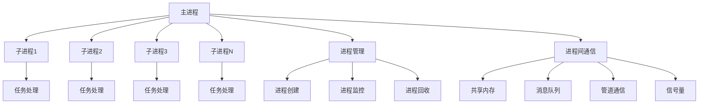

# 多进程编程

## 🎯 学习目标
- 理解多进程编程的基本概念和原理
- 掌握PHP多进程编程的实现方法
- 学会进程间通信和同步机制
- 了解多进程编程的性能优化和最佳实践

## 📚 核心概念

### 多进程编程架构



### 多进程编程模型

| 模型类型 | 特点 | 适用场景 | 优缺点 |
|----------|------|----------|--------|
| 主从模型 | 主进程管理，子进程工作 | 任务分发 | 简单易用，但主进程可能成为瓶颈 |
| 对等模型 | 进程地位平等 | 分布式计算 | 负载均衡好，但管理复杂 |
| 流水线模型 | 进程按顺序处理 | 数据处理流水线 | 高效处理，但依赖性强 |
| 混合模型 | 结合多种模型 | 复杂应用 | 灵活性强，但实现复杂 |

## 🔧 多进程编程实现

### 基础多进程编程
```php
<?php
// 1. 基础多进程实现
class BasicMultiProcess {
    private array $processes = [];
    private int $maxProcesses = 4;
    
    // 创建子进程
    public function createChildProcess(callable $task, array $data = []): int {
        $pid = pcntl_fork();
        
        if ($pid == -1) {
            throw new Exception('无法创建子进程');
        } elseif ($pid == 0) {
            // 子进程
            $this->childProcess($task, $data);
            exit(0);
        } else {
            // 父进程
            $this->processes[$pid] = [
                'pid' => $pid,
                'status' => 'running',
                'start_time' => time()
            ];
            return $pid;
        }
    }
    
    private function childProcess(callable $task, array $data): void {
        try {
            $result = $task($data);
            echo "子进程 " . getmypid() . " 完成任务: " . json_encode($result) . "\n";
        } catch (Exception $e) {
            echo "子进程 " . getmypid() . " 执行错误: " . $e->getMessage() . "\n";
        }
    }
    
    // 等待子进程完成
    public function waitForChildren(): array {
        $results = [];
        
        while (count($this->processes) > 0) {
            $pid = pcntl_wait($status, WNOHANG);
            
            if ($pid > 0) {
                $results[$pid] = [
                    'pid' => $pid,
                    'status' => $status,
                    'exit_code' => pcntl_wexitstatus($status)
                ];
                unset($this->processes[$pid]);
            }
            
            usleep(100000); // 100ms
        }
        
        return $results;
    }
    
    // 批量创建进程
    public function createBatchProcesses(array $tasks): array {
        $pids = [];
        
        foreach ($tasks as $index => $task) {
            if (count($this->processes) >= $this->maxProcesses) {
                $this->waitForOneProcess();
            }
            
            $pid = $this->createChildProcess($task['callback'], $task['data']);
            $pids[] = $pid;
        }
        
        return $pids;
    }
    
    private function waitForOneProcess(): void {
        $pid = pcntl_wait($status);
        if ($pid > 0) {
            unset($this->processes[$pid]);
        }
    }
}

// 2. 进程池管理
class ProcessPool {
    private array $pool = [];
    private int $poolSize;
    private array $taskQueue = [];
    private bool $running = false;
    
    public function __construct(int $poolSize = 4) {
        $this->poolSize = $poolSize;
    }
    
    // 启动进程池
    public function start(): void {
        $this->running = true;
        
        for ($i = 0; $i < $this->poolSize; $i++) {
            $this->createWorker();
        }
        
        $this->startTaskDispatcher();
    }
    
    private function createWorker(): void {
        $pid = pcntl_fork();
        
        if ($pid == -1) {
            throw new Exception('无法创建工作进程');
        } elseif ($pid == 0) {
            // 工作进程
            $this->workerProcess();
            exit(0);
        } else {
            // 主进程
            $this->pool[] = [
                'pid' => $pid,
                'status' => 'idle',
                'start_time' => time()
            ];
        }
    }
    
    private function workerProcess(): void {
        while ($this->running) {
            $task = $this->getTask();
            
            if ($task) {
                $this->updateWorkerStatus(getmypid(), 'busy');
                $this->executeTask($task);
                $this->updateWorkerStatus(getmypid(), 'idle');
            }
            
            usleep(100000); // 100ms
        }
    }
    
    private function getTask(): ?array {
        // 从任务队列获取任务
        if (!empty($this->taskQueue)) {
            return array_shift($this->taskQueue);
        }
        return null;
    }
    
    private function executeTask(array $task): void {
        try {
            $result = $task['callback']($task['data']);
            echo "工作进程 " . getmypid() . " 完成任务: " . json_encode($result) . "\n";
        } catch (Exception $e) {
            echo "工作进程 " . getmypid() . " 执行错误: " . $e->getMessage() . "\n";
        }
    }
    
    private function updateWorkerStatus(int $pid, string $status): void {
        foreach ($this->pool as &$worker) {
            if ($worker['pid'] == $pid) {
                $worker['status'] = $status;
                break;
            }
        }
    }
    
    private function startTaskDispatcher(): void {
        $pid = pcntl_fork();
        
        if ($pid == -1) {
            throw new Exception('无法创建任务分发器');
        } elseif ($pid == 0) {
            // 任务分发器进程
            $this->taskDispatcher();
            exit(0);
        }
    }
    
    private function taskDispatcher(): void {
        while ($this->running) {
            // 检查空闲工作进程
            $idleWorkers = array_filter($this->pool, function($worker) {
                return $worker['status'] === 'idle';
            });
            
            // 分发任务给空闲进程
            foreach ($idleWorkers as $worker) {
                if (!empty($this->taskQueue)) {
                    $task = array_shift($this->taskQueue);
                    $this->sendTaskToWorker($worker['pid'], $task);
                }
            }
            
            usleep(100000); // 100ms
        }
    }
    
    private function sendTaskToWorker(int $pid, array $task): void {
        // 通过IPC发送任务给工作进程
        // 这里简化实现，实际应用中需要使用消息队列或共享内存
    }
    
    // 添加任务
    public function addTask(callable $callback, array $data = []): void {
        $this->taskQueue[] = [
            'callback' => $callback,
            'data' => $data,
            'id' => uniqid()
        ];
    }
    
    // 停止进程池
    public function stop(): void {
        $this->running = false;
        
        // 等待所有子进程结束
        foreach ($this->pool as $worker) {
            pcntl_waitpid($worker['pid'], $status);
        }
    }
}

// 3. 进程间通信
class InterProcessCommunication {
    private array $sharedMemory = [];
    private array $messageQueues = [];
    
    // 共享内存通信
    public function createSharedMemory(string $key, int $size): int {
        $shmId = shmop_open(ftok(__FILE__, $key), "c", 0644, $size);
        
        if (!$shmId) {
            throw new Exception('无法创建共享内存');
        }
        
        $this->sharedMemory[$key] = $shmId;
        return $shmId;
    }
    
    public function writeToSharedMemory(string $key, string $data): bool {
        if (!isset($this->sharedMemory[$key])) {
            return false;
        }
        
        $shmId = $this->sharedMemory[$key];
        $dataSize = strlen($data);
        
        return shmop_write($shmId, $data, 0) === $dataSize;
    }
    
    public function readFromSharedMemory(string $key, int $size): string {
        if (!isset($this->sharedMemory[$key])) {
            return '';
        }
        
        $shmId = $this->sharedMemory[$key];
        return shmop_read($shmId, 0, $size);
    }
    
    // 消息队列通信
    public function createMessageQueue(string $key): int {
        $msgId = msg_get_queue(ftok(__FILE__, $key));
        
        if (!$msgId) {
            throw new Exception('无法创建消息队列');
        }
        
        $this->messageQueues[$key] = $msgId;
        return $msgId;
    }
    
    public function sendMessage(string $key, string $message, int $type = 1): bool {
        if (!isset($this->messageQueues[$key])) {
            return false;
        }
        
        $msgId = $this->messageQueues[$key];
        return msg_send($msgId, $type, $message);
    }
    
    public function receiveMessage(string $key, int $type = 0): ?string {
        if (!isset($this->messageQueues[$key])) {
            return null;
        }
        
        $msgId = $this->messageQueues[$key];
        $message = '';
        $messageType = 0;
        
        if (msg_receive($msgId, $type, $messageType, 1024, $message, true, MSG_IPC_NOWAIT)) {
            return $message;
        }
        
        return null;
    }
    
    // 信号量同步
    public function createSemaphore(string $key, int $initialValue = 1): int {
        $semId = sem_get(ftok(__FILE__, $key), $initialValue);
        
        if (!$semId) {
            throw new Exception('无法创建信号量');
        }
        
        return $semId;
    }
    
    public function acquireSemaphore(int $semId): bool {
        return sem_acquire($semId);
    }
    
    public function releaseSemaphore(int $semId): bool {
        return sem_release($semId);
    }
}

// 使用示例
echo "=== 多进程编程示例 ===\n";

try {
    // 基础多进程
    $multiProcess = new BasicMultiProcess();
    
    $tasks = [
        ['callback' => function($data) { return "任务1: " . $data['id']; }, 'data' => ['id' => 1]],
        ['callback' => function($data) { return "任务2: " . $data['id']; }, 'data' => ['id' => 2]],
        ['callback' => function($data) { return "任务3: " . $data['id']; }, 'data' => ['id' => 3]]
    ];
    
    $pids = $multiProcess->createBatchProcesses($tasks);
    echo "创建了 " . count($pids) . " 个子进程\n";
    
    $results = $multiProcess->waitForChildren();
    echo "子进程执行结果: " . json_encode($results) . "\n";
    
    // 进程池
    $processPool = new ProcessPool(2);
    
    // 添加任务
    for ($i = 1; $i <= 5; $i++) {
        $processPool->addTask(function($data) {
            sleep(1); // 模拟任务执行
            return "池任务: " . $data['id'];
        }, ['id' => $i]);
    }
    
    $processPool->start();
    sleep(3); // 等待任务完成
    $processPool->stop();
    
    // 进程间通信
    $ipc = new InterProcessCommunication();
    
    // 共享内存
    $shmKey = 'test_shm';
    $ipc->createSharedMemory($shmKey, 1024);
    $ipc->writeToSharedMemory($shmKey, 'Hello from shared memory');
    $data = $ipc->readFromSharedMemory($shmKey, 1024);
    echo "共享内存数据: $data\n";
    
    // 消息队列
    $msgKey = 'test_msg';
    $ipc->createMessageQueue($msgKey);
    $ipc->sendMessage($msgKey, 'Hello from message queue');
    $message = $ipc->receiveMessage($msgKey);
    echo "消息队列数据: $message\n";
    
} catch (Exception $e) {
    echo "错误: " . $e->getMessage() . "\n";
}
?>
```

### 高级多进程编程
```php
<?php
// 1. 高级进程管理
class AdvancedProcessManager {
    private array $processes = [];
    private array $processGroups = [];
    private int $maxProcesses = 10;
    private bool $gracefulShutdown = false;
    
    // 创建进程组
    public function createProcessGroup(string $groupName, int $processCount): array {
        $pids = [];
        
        for ($i = 0; $i < $processCount; $i++) {
            $pid = $this->createProcess(function($data) {
                return $this->groupWorker($data);
            }, [
                'group' => $groupName,
                'worker_id' => $i
            ]);
            
            $pids[] = $pid;
        }
        
        $this->processGroups[$groupName] = [
            'pids' => $pids,
            'status' => 'running',
            'created_at' => time()
        ];
        
        return $pids;
    }
    
    private function groupWorker(array $data): string {
        $group = $data['group'];
        $workerId = $data['worker_id'];
        
        echo "进程组 $group 的工作进程 $workerId 开始工作\n";
        
        while (!$this->gracefulShutdown) {
            $task = $this->getTaskForGroup($group);
            
            if ($task) {
                $result = $this->executeTask($task);
                echo "工作进程 $workerId 完成任务: $result\n";
            }
            
            usleep(100000); // 100ms
        }
        
        echo "工作进程 $workerId 优雅关闭\n";
        return "Worker $workerId completed";
    }
    
    private function getTaskForGroup(string $group): ?array {
        // 从任务队列获取任务
        return null; // 简化实现
    }
    
    private function executeTask(array $task): string {
        // 执行任务
        return "Task completed";
    }
    
    // 进程监控
    public function monitorProcesses(): array {
        $status = [];
        
        foreach ($this->processes as $pid => $process) {
            $status[$pid] = [
                'pid' => $pid,
                'status' => $this->getProcessStatus($pid),
                'memory_usage' => $this->getProcessMemoryUsage($pid),
                'cpu_usage' => $this->getProcessCpuUsage($pid),
                'uptime' => time() - $process['start_time']
            ];
        }
        
        return $status;
    }
    
    private function getProcessStatus(int $pid): string {
        $status = posix_kill($pid, 0);
        return $status ? 'running' : 'stopped';
    }
    
    private function getProcessMemoryUsage(int $pid): int {
        $status = file_get_contents("/proc/$pid/status");
        preg_match('/VmRSS:\s+(\d+)/', $status, $matches);
        return isset($matches[1]) ? (int)$matches[1] : 0;
    }
    
    private function getProcessCpuUsage(int $pid): float {
        $stat = file_get_contents("/proc/$pid/stat");
        $parts = explode(' ', $stat);
        return isset($parts[13]) ? (float)$parts[13] : 0.0;
    }
    
    // 优雅关闭
    public function gracefulShutdown(): void {
        $this->gracefulShutdown = true;
        
        // 发送SIGTERM信号给所有进程
        foreach ($this->processes as $pid => $process) {
            posix_kill($pid, SIGTERM);
        }
        
        // 等待进程结束
        $this->waitForAllProcesses();
    }
    
    private function waitForAllProcesses(): void {
        while (count($this->processes) > 0) {
            $pid = pcntl_wait($status, WNOHANG);
            
            if ($pid > 0) {
                unset($this->processes[$pid]);
            }
            
            usleep(100000); // 100ms
        }
    }
}

// 2. 进程同步机制
class ProcessSynchronization {
    private array $mutexes = [];
    private array $semaphores = [];
    private array $barriers = [];
    
    // 互斥锁
    public function createMutex(string $name): int {
        $mutex = sem_get(ftok(__FILE__, $name), 1);
        $this->mutexes[$name] = $mutex;
        return $mutex;
    }
    
    public function lockMutex(string $name): bool {
        if (!isset($this->mutexes[$name])) {
            return false;
        }
        
        return sem_acquire($this->mutexes[$name]);
    }
    
    public function unlockMutex(string $name): bool {
        if (!isset($this->mutexes[$name])) {
            return false;
        }
        
        return sem_release($this->mutexes[$name]);
    }
    
    // 信号量
    public function createSemaphore(string $name, int $initialValue): int {
        $semaphore = sem_get(ftok(__FILE__, $name), $initialValue);
        $this->semaphores[$name] = $semaphore;
        return $semaphore;
    }
    
    public function waitSemaphore(string $name): bool {
        if (!isset($this->semaphores[$name])) {
            return false;
        }
        
        return sem_acquire($this->semaphores[$name]);
    }
    
    public function signalSemaphore(string $name): bool {
        if (!isset($this->semaphores[$name])) {
            return false;
        }
        
        return sem_release($this->semaphores[$name]);
    }
    
    // 屏障同步
    public function createBarrier(string $name, int $count): array {
        $barrier = [
            'name' => $name,
            'count' => $count,
            'current' => 0,
            'semaphore' => sem_get(ftok(__FILE__, $name), 0)
        ];
        
        $this->barriers[$name] = $barrier;
        return $barrier;
    }
    
    public function waitBarrier(string $name): bool {
        if (!isset($this->barriers[$name])) {
            return false;
        }
        
        $barrier = &$this->barriers[$name];
        $barrier['current']++;
        
        if ($barrier['current'] >= $barrier['count']) {
            // 最后一个进程到达，释放所有等待的进程
            for ($i = 0; $i < $barrier['count']; $i++) {
                sem_release($barrier['semaphore']);
            }
            $barrier['current'] = 0;
        } else {
            // 等待其他进程
            sem_acquire($barrier['semaphore']);
        }
        
        return true;
    }
}

// 3. 进程间数据共享
class ProcessDataSharing {
    private array $sharedData = [];
    private array $locks = [];
    
    // 创建共享数据
    public function createSharedData(string $key, mixed $initialValue = null): void {
        $this->sharedData[$key] = $initialValue;
        $this->locks[$key] = sem_get(ftok(__FILE__, $key), 1);
    }
    
    // 读取共享数据
    public function readSharedData(string $key): mixed {
        if (!isset($this->sharedData[$key])) {
            return null;
        }
        
        sem_acquire($this->locks[$key]);
        $value = $this->sharedData[$key];
        sem_release($this->locks[$key]);
        
        return $value;
    }
    
    // 写入共享数据
    public function writeSharedData(string $key, mixed $value): bool {
        if (!isset($this->sharedData[$key])) {
            return false;
        }
        
        sem_acquire($this->locks[$key]);
        $this->sharedData[$key] = $value;
        sem_release($this->locks[$key]);
        
        return true;
    }
    
    // 原子操作
    public function atomicIncrement(string $key): int {
        if (!isset($this->sharedData[$key])) {
            return 0;
        }
        
        sem_acquire($this->locks[$key]);
        $this->sharedData[$key]++;
        $value = $this->sharedData[$key];
        sem_release($this->locks[$key]);
        
        return $value;
    }
    
    public function atomicDecrement(string $key): int {
        if (!isset($this->sharedData[$key])) {
            return 0;
        }
        
        sem_acquire($this->locks[$key]);
        $this->sharedData[$key]--;
        $value = $this->sharedData[$key];
        sem_release($this->locks[$key]);
        
        return $value;
    }
}

// 使用示例
echo "=== 高级多进程编程示例 ===\n";

try {
    // 高级进程管理
    $processManager = new AdvancedProcessManager();
    
    $group1 = $processManager->createProcessGroup('group1', 2);
    $group2 = $processManager->createProcessGroup('group2', 3);
    
    echo "创建进程组1: " . json_encode($group1) . "\n";
    echo "创建进程组2: " . json_encode($group2) . "\n";
    
    // 进程监控
    $status = $processManager->monitorProcesses();
    echo "进程状态: " . json_encode($status) . "\n";
    
    // 进程同步
    $sync = new ProcessSynchronization();
    
    $mutex = $sync->createMutex('test_mutex');
    $semaphore = $sync->createSemaphore('test_semaphore', 3);
    $barrier = $sync->createBarrier('test_barrier', 3);
    
    echo "创建同步机制成功\n";
    
    // 数据共享
    $dataSharing = new ProcessDataSharing();
    $dataSharing->createSharedData('counter', 0);
    
    $value = $dataSharing->atomicIncrement('counter');
    echo "原子递增结果: $value\n";
    
    $value = $dataSharing->atomicDecrement('counter');
    echo "原子递减结果: $value\n";
    
} catch (Exception $e) {
    echo "错误: " . $e->getMessage() . "\n";
}
?>
```

## 📊 最佳实践

### 多进程编程最佳实践
```php
<?php
// 多进程编程最佳实践

class MultiProcessBestPractices {
    // 1. 进程创建最佳实践
    public static function getProcessCreationBestPractices() {
        return [
            '进程数量控制' => [
                'CPU核心数' => '进程数不应超过CPU核心数的2倍',
                '内存限制' => '考虑每个进程的内存消耗',
                '系统负载' => '监控系统负载，避免过载',
                '任务特性' => '根据任务特性调整进程数'
            ],
            '进程生命周期管理' => [
                '进程创建' => '使用进程池避免频繁创建销毁',
                '进程监控' => '定期检查进程状态',
                '进程回收' => '及时回收僵尸进程',
                '优雅关闭' => '实现优雅关闭机制'
            ],
            '错误处理' => [
                '创建失败' => '处理进程创建失败的情况',
                '执行异常' => '捕获子进程执行异常',
                '资源泄漏' => '防止资源泄漏',
                '死锁检测' => '检测和避免死锁'
            ]
        ];
    }
    
    // 2. 进程间通信最佳实践
    public static function getIPCBestPractices() {
        return [
            '通信方式选择' => [
                '共享内存' => '适合大数据量、高频率通信',
                '消息队列' => '适合异步通信、解耦',
                '管道' => '适合父子进程通信',
                '信号量' => '适合同步控制'
            ],
            '数据安全' => [
                '数据验证' => '验证进程间传递的数据',
                '访问控制' => '控制数据访问权限',
                '数据加密' => '敏感数据加密传输',
                '完整性检查' => '检查数据完整性'
            ],
            '性能优化' => [
                '减少拷贝' => '减少数据拷贝次数',
                '批量传输' => '批量传输数据',
                '异步通信' => '使用异步通信提高效率',
                '缓存机制' => '使用缓存减少通信次数'
            ]
        ];
    }
    
    // 3. 同步机制最佳实践
    public static function getSynchronizationBestPractices() {
        return [
            '锁机制' => [
                '锁粒度' => '控制锁的粒度，避免死锁',
                '锁超时' => '设置锁超时时间',
                '锁顺序' => '统一锁的获取顺序',
                '锁释放' => '确保锁的正确释放'
            ],
            '信号量使用' => [
                '初始值' => '合理设置信号量初始值',
                '等待策略' => '实现合理的等待策略',
                '超时处理' => '处理信号量等待超时',
                '资源管理' => '管理信号量资源'
            ],
            '屏障同步' => [
                '参与者数量' => '正确设置参与者数量',
                '异常处理' => '处理参与者异常退出',
                '超时机制' => '实现屏障等待超时',
                '重置机制' => '实现屏障重置机制'
            ]
        ];
    }
    
    // 4. 性能优化最佳实践
    public static function getPerformanceOptimizationBestPractices() {
        return [
            '进程调度' => [
                '优先级设置' => '合理设置进程优先级',
                'CPU亲和性' => '设置CPU亲和性',
                '负载均衡' => '实现负载均衡',
                '任务分配' => '优化任务分配策略'
            ],
            '内存管理' => [
                '内存池' => '使用内存池减少分配开销',
                '内存映射' => '使用内存映射文件',
                '垃圾回收' => '优化垃圾回收策略',
                '内存监控' => '监控内存使用情况'
            ],
            'I/O优化' => [
                '异步I/O' => '使用异步I/O提高效率',
                '批量操作' => '批量执行I/O操作',
                '缓存策略' => '实现合理的缓存策略',
                '连接池' => '使用连接池管理连接'
            ]
        ];
    }
}

// 使用示例
echo "=== 多进程编程最佳实践示例 ===\n";

try {
    $processCreation = MultiProcessBestPractices::getProcessCreationBestPractices();
    echo "进程创建最佳实践:\n";
    foreach ($processCreation as $category => $practices) {
        echo "  $category:\n";
        foreach ($practices as $practice => $description) {
            echo "    - $practice: $description\n";
        }
        echo "\n";
    }
    
    $ipc = MultiProcessBestPractices::getIPCBestPractices();
    echo "进程间通信最佳实践:\n";
    foreach ($ipc as $category => $practices) {
        echo "  $category:\n";
        foreach ($practices as $practice => $description) {
            echo "    - $practice: $description\n";
        }
        echo "\n";
    }
    
} catch (Exception $e) {
    echo "错误: " . $e->getMessage() . "\n";
}
?>
```

## 🎓 学习建议

### 费曼学习法应用
1. **选择概念**: 选择多进程编程中的核心概念
2. **简化解释**: 用简单语言解释多进程编程的重要性
3. **识别盲点**: 发现理解不深入的地方
4. **重新学习**: 针对盲点进行深入学习

### 刻意练习重点
1. **进程管理**: 掌握进程创建、监控和回收
2. **进程间通信**: 学会各种IPC机制的使用
3. **同步机制**: 理解锁、信号量、屏障等同步机制
4. **性能优化**: 培养多进程编程的性能优化能力

## 🔗 相关链接
- [[02-异步编程|异步编程]]
- [[03-消息队列|消息队列]]
- [[04-协程编程|协程编程]]
- [[05-锁机制|锁机制]]
- [[06-并发安全|并发安全]]
- [[07-并发性能优化|并发性能优化]]
