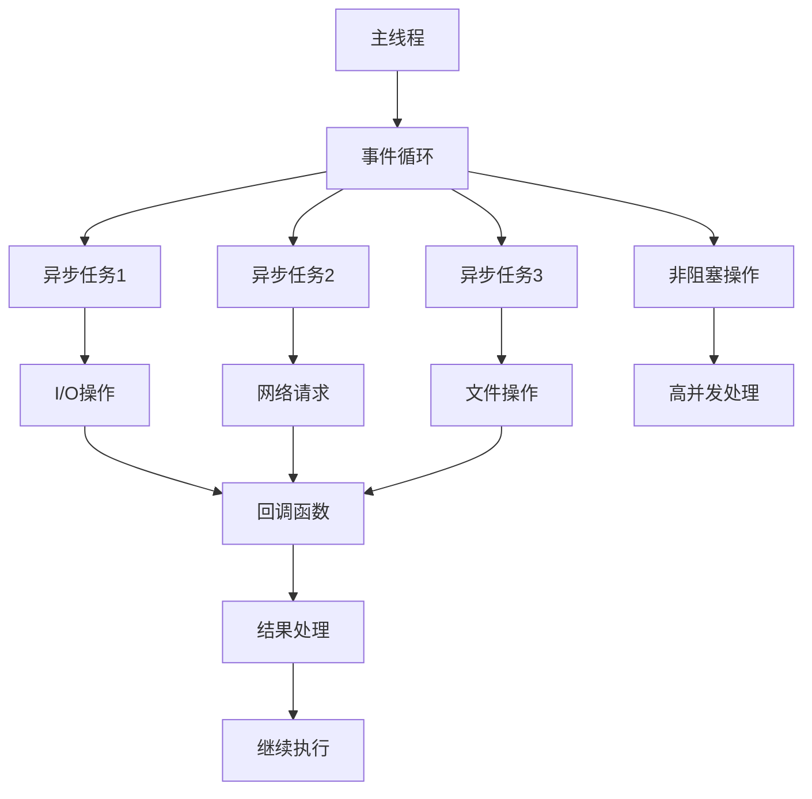

# 异步编程

## 🎯 学习目标
- 理解异步编程的基本概念和原理
- 掌握PHP异步编程的实现方法
- 学会异步I/O操作和事件循环
- 了解异步编程的性能优化和最佳实践

## 📚 核心概念

### 异步编程架构



### 异步编程模型对比

| 模型类型 | 特点 | 适用场景 | 优缺点 |
|----------|------|----------|--------|
| 回调模式 | 函数作为参数传递 | 简单异步操作 | 简单易用，但容易产生回调地狱 |
| Promise模式 | 链式调用，状态管理 | 复杂异步流程 | 结构清晰，但学习成本高 |
| 协程模式 | 同步语法，异步执行 | 高并发应用 | 语法简洁，但实现复杂 |
| 事件驱动 | 基于事件和监听器 | 实时应用 | 解耦性好，但调试困难 |

## 🔧 异步编程实现

### 基础异步编程
```php
<?php
// 1. 回调模式异步编程
class CallbackAsyncProgramming {
    private array $callbacks = [];
    private array $timers = [];
    
    // 异步执行函数
    public function asyncExecute(callable $callback, array $args = []): void {
        $this->callbacks[] = [
            'callback' => $callback,
            'args' => $args,
            'timestamp' => microtime(true)
        ];
    }
    
    // 执行所有回调
    public function executeCallbacks(): void {
        while (!empty($this->callbacks)) {
            $callback = array_shift($this->callbacks);
            call_user_func_array($callback['callback'], $callback['args']);
        }
    }
    
    // 延迟执行
    public function setTimeout(callable $callback, int $delay): int {
        $timerId = uniqid();
        $this->timers[$timerId] = [
            'callback' => $callback,
            'execute_time' => microtime(true) + ($delay / 1000),
            'delay' => $delay
        ];
        return $timerId;
    }
    
    // 检查定时器
    public function checkTimers(): void {
        $currentTime = microtime(true);
        
        foreach ($this->timers as $timerId => $timer) {
            if ($currentTime >= $timer['execute_time']) {
                $timer['callback']();
                unset($this->timers[$timerId]);
            }
        }
    }
    
    // 异步文件读取
    public function asyncFileRead(string $filename, callable $callback): void {
        $this->asyncExecute(function() use ($filename, $callback) {
            if (file_exists($filename)) {
                $content = file_get_contents($filename);
                $callback($content, null);
            } else {
                $callback(null, new Exception("文件不存在: $filename"));
            }
        });
    }
    
    // 异步HTTP请求
    public function asyncHttpRequest(string $url, callable $callback): void {
        $this->asyncExecute(function() use ($url, $callback) {
            $context = stream_context_create([
                'http' => [
                    'method' => 'GET',
                    'timeout' => 30
                ]
            ]);
            
            $result = file_get_contents($url, false, $context);
            
            if ($result !== false) {
                $callback($result, null);
            } else {
                $callback(null, new Exception("HTTP请求失败: $url"));
            }
        });
    }
}

// 2. Promise模式异步编程
class PromiseAsyncProgramming {
    private array $promises = [];
    
    // Promise类
    class Promise {
        private string $state = 'pending'; // pending, fulfilled, rejected
        private mixed $value = null;
        private mixed $reason = null;
        private array $onFulfilled = [];
        private array $onRejected = [];
        
        public function __construct(callable $executor) {
            try {
                $executor(
                    [$this, 'resolve'],
                    [$this, 'reject']
                );
            } catch (Exception $e) {
                $this->reject($e);
            }
        }
        
        public function resolve(mixed $value): void {
            if ($this->state === 'pending') {
                $this->state = 'fulfilled';
                $this->value = $value;
                $this->executeCallbacks($this->onFulfilled, $value);
            }
        }
        
        public function reject(mixed $reason): void {
            if ($this->state === 'pending') {
                $this->state = 'rejected';
                $this->reason = $reason;
                $this->executeCallbacks($this->onRejected, $reason);
            }
        }
        
        public function then(callable $onFulfilled = null, callable $onRejected = null): self {
            return new self(function($resolve, $reject) use ($onFulfilled, $onRejected) {
                if ($this->state === 'fulfilled') {
                    $this->executeCallback($onFulfilled, $this->value, $resolve, $reject);
                } elseif ($this->state === 'rejected') {
                    $this->executeCallback($onRejected, $this->reason, $resolve, $reject);
                } else {
                    $this->onFulfilled[] = function($value) use ($onFulfilled, $resolve, $reject) {
                        $this->executeCallback($onFulfilled, $value, $resolve, $reject);
                    };
                    $this->onRejected[] = function($reason) use ($onRejected, $resolve, $reject) {
                        $this->executeCallback($onRejected, $reason, $resolve, $reject);
                    };
                }
            });
        }
        
        public function catch(callable $onRejected): self {
            return $this->then(null, $onRejected);
        }
        
        private function executeCallbacks(array $callbacks, mixed $value): void {
            foreach ($callbacks as $callback) {
                $callback($value);
            }
        }
        
        private function executeCallback(?callable $callback, mixed $value, callable $resolve, callable $reject): void {
            if ($callback) {
                try {
                    $result = $callback($value);
                    $resolve($result);
                } catch (Exception $e) {
                    $reject($e);
                }
            } else {
                $resolve($value);
            }
        }
        
        public function getState(): string {
            return $this->state;
        }
        
        public function getValue(): mixed {
            return $this->value;
        }
        
        public function getReason(): mixed {
            return $this->reason;
        }
    }
    
    // 创建Promise
    public function createPromise(callable $executor): Promise {
        return new Promise($executor);
    }
    
    // Promise.all
    public function all(array $promises): Promise {
        return new Promise(function($resolve, $reject) use ($promises) {
            $results = [];
            $completed = 0;
            $total = count($promises);
            
            if ($total === 0) {
                $resolve($results);
                return;
            }
            
            foreach ($promises as $index => $promise) {
                $promise->then(
                    function($value) use (&$results, &$completed, $total, $index, $resolve) {
                        $results[$index] = $value;
                        $completed++;
                        
                        if ($completed === $total) {
                            $resolve($results);
                        }
                    },
                    function($reason) use ($reject) {
                        $reject($reason);
                    }
                );
            }
        });
    }
    
    // Promise.race
    public function race(array $promises): Promise {
        return new Promise(function($resolve, $reject) use ($promises) {
            foreach ($promises as $promise) {
                $promise->then($resolve, $reject);
            }
        });
    }
}

// 3. 事件驱动异步编程
class EventDrivenAsyncProgramming {
    private array $events = [];
    private array $listeners = [];
    private bool $running = false;
    
    // 注册事件监听器
    public function on(string $event, callable $listener): void {
        if (!isset($this->listeners[$event])) {
            $this->listeners[$event] = [];
        }
        $this->listeners[$event][] = $listener;
    }
    
    // 移除事件监听器
    public function off(string $event, callable $listener = null): void {
        if (!isset($this->listeners[$event])) {
            return;
        }
        
        if ($listener === null) {
            unset($this->listeners[$event]);
        } else {
            $index = array_search($listener, $this->listeners[$event], true);
            if ($index !== false) {
                array_splice($this->listeners[$event], $index, 1);
            }
        }
    }
    
    // 触发事件
    public function emit(string $event, ...$args): void {
        if (isset($this->listeners[$event])) {
            foreach ($this->listeners[$event] as $listener) {
                call_user_func_array($listener, $args);
            }
        }
    }
    
    // 异步触发事件
    public function emitAsync(string $event, ...$args): void {
        $this->events[] = [
            'event' => $event,
            'args' => $args,
            'timestamp' => microtime(true)
        ];
    }
    
    // 启动事件循环
    public function start(): void {
        $this->running = true;
        
        while ($this->running) {
            $this->processEvents();
            usleep(1000); // 1ms
        }
    }
    
    // 停止事件循环
    public function stop(): void {
        $this->running = false;
    }
    
    // 处理事件
    private function processEvents(): void {
        while (!empty($this->events)) {
            $event = array_shift($this->events);
            $this->emit($event['event'], ...$event['args']);
        }
    }
    
    // 一次性事件监听器
    public function once(string $event, callable $listener): void {
        $onceListener = function(...$args) use ($event, $listener) {
            $this->off($event, $onceListener);
            call_user_func_array($listener, $args);
        };
        
        $this->on($event, $onceListener);
    }
}

// 使用示例
echo "=== 异步编程示例 ===\n";

try {
    // 回调模式
    $callbackAsync = new CallbackAsyncProgramming();
    
    $callbackAsync->asyncFileRead('test.txt', function($content, $error) {
        if ($error) {
            echo "文件读取错误: " . $error->getMessage() . "\n";
        } else {
            echo "文件内容: $content\n";
        }
    });
    
    $callbackAsync->asyncHttpRequest('https://api.github.com/users/octocat', function($response, $error) {
        if ($error) {
            echo "HTTP请求错误: " . $error->getMessage() . "\n";
        } else {
            echo "HTTP响应: " . substr($response, 0, 100) . "...\n";
        }
    });
    
    $callbackAsync->executeCallbacks();
    
    // Promise模式
    $promiseAsync = new PromiseAsyncProgramming();
    
    $promise1 = $promiseAsync->createPromise(function($resolve, $reject) {
        // 模拟异步操作
        usleep(100000); // 100ms
        $resolve("Promise 1 完成");
    });
    
    $promise2 = $promiseAsync->createPromise(function($resolve, $reject) {
        // 模拟异步操作
        usleep(200000); // 200ms
        $resolve("Promise 2 完成");
    });
    
    $promise1->then(function($value) {
        echo "$value\n";
    });
    
    $promise2->then(function($value) {
        echo "$value\n";
    });
    
    // Promise.all
    $allPromise = $promiseAsync->all([$promise1, $promise2]);
    $allPromise->then(function($results) {
        echo "所有Promise完成: " . json_encode($results) . "\n";
    });
    
    // 事件驱动
    $eventAsync = new EventDrivenAsyncProgramming();
    
    $eventAsync->on('user.login', function($userId) {
        echo "用户 $userId 登录\n";
    });
    
    $eventAsync->on('user.logout', function($userId) {
        echo "用户 $userId 登出\n";
    });
    
    $eventAsync->emitAsync('user.login', 123);
    $eventAsync->emitAsync('user.logout', 123);
    
    $eventAsync->processEvents();
    
} catch (Exception $e) {
    echo "错误: " . $e->getMessage() . "\n";
}
?>
```

### 高级异步编程
```php
<?php
// 1. 协程异步编程
class CoroutineAsyncProgramming {
    private array $coroutines = [];
    private array $scheduler = [];
    private int $currentId = 0;
    
    // 协程类
    class Coroutine {
        private int $id;
        private Generator $generator;
        private mixed $value = null;
        private bool $valid = true;
        
        public function __construct(int $id, Generator $generator) {
            $this->id = $id;
            $this->generator = $generator;
        }
        
        public function getId(): int {
            return $this->id;
        }
        
        public function run(): mixed {
            if ($this->valid) {
                $this->value = $this->generator->current();
                $this->valid = $this->generator->valid();
                return $this->value;
            }
            return null;
        }
        
        public function send(mixed $value): mixed {
            if ($this->valid) {
                $this->value = $this->generator->send($value);
                $this->valid = $this->generator->valid();
                return $this->value;
            }
            return null;
        }
        
        public function isValid(): bool {
            return $this->valid;
        }
        
        public function getValue(): mixed {
            return $this->value;
        }
    }
    
    // 创建协程
    public function createCoroutine(callable $function, ...$args): int {
        $id = ++$this->currentId;
        $generator = $function(...$args);
        $coroutine = new Coroutine($id, $generator);
        $this->coroutines[$id] = $coroutine;
        return $id;
    }
    
    // 运行协程
    public function runCoroutine(int $id): mixed {
        if (!isset($this->coroutines[$id])) {
            return null;
        }
        
        $coroutine = $this->coroutines[$id];
        return $coroutine->run();
    }
    
    // 发送值给协程
    public function sendToCoroutine(int $id, mixed $value): mixed {
        if (!isset($this->coroutines[$id])) {
            return null;
        }
        
        $coroutine = $this->coroutines[$id];
        return $coroutine->send($value);
    }
    
    // 协程调度器
    public function schedule(): void {
        while (!empty($this->coroutines)) {
            foreach ($this->coroutines as $id => $coroutine) {
                if ($coroutine->isValid()) {
                    $coroutine->run();
                } else {
                    unset($this->coroutines[$id]);
                }
            }
        }
    }
    
    // 异步等待
    public function asyncWait(int $milliseconds): Generator {
        $startTime = microtime(true);
        $endTime = $startTime + ($milliseconds / 1000);
        
        while (microtime(true) < $endTime) {
            yield;
        }
    }
    
    // 异步文件读取
    public function asyncFileRead(string $filename): Generator {
        $handle = fopen($filename, 'r');
        if (!$handle) {
            throw new Exception("无法打开文件: $filename");
        }
        
        $content = '';
        while (!feof($handle)) {
            $chunk = fread($handle, 8192);
            $content .= $chunk;
            yield; // 让出控制权
        }
        
        fclose($handle);
        return $content;
    }
    
    // 异步HTTP请求
    public function asyncHttpRequest(string $url): Generator {
        $context = stream_context_create([
            'http' => [
                'method' => 'GET',
                'timeout' => 30
            ]
        ]);
        
        $handle = fopen($url, 'r', false, $context);
        if (!$handle) {
            throw new Exception("HTTP请求失败: $url");
        }
        
        $response = '';
        while (!feof($handle)) {
            $chunk = fread($handle, 8192);
            $response .= $chunk;
            yield; // 让出控制权
        }
        
        fclose($handle);
        return $response;
    }
}

// 2. 异步I/O操作
class AsyncIOOperations {
    private array $sockets = [];
    private array $callbacks = [];
    
    // 异步Socket连接
    public function asyncConnect(string $host, int $port, callable $callback): void {
        $socket = socket_create(AF_INET, SOCK_STREAM, SOL_TCP);
        socket_set_nonblock($socket);
        
        $this->sockets[] = $socket;
        $this->callbacks[$socket] = $callback;
        
        $result = socket_connect($socket, $host, $port);
        
        if ($result === false) {
            $error = socket_last_error($socket);
            if ($error === SOCKET_EINPROGRESS || $error === SOCKET_EWOULDBLOCK) {
                // 连接正在进行中
                $this->waitForConnection($socket);
            } else {
                $callback(null, new Exception("连接失败: " . socket_strerror($error)));
            }
        } else {
            $callback($socket, null);
        }
    }
    
    // 等待连接完成
    private function waitForConnection($socket): void {
        $read = [$socket];
        $write = [$socket];
        $except = [$socket];
        
        $result = socket_select($read, $write, $except, 0, 100000); // 100ms
        
        if ($result > 0) {
            if (in_array($socket, $write)) {
                $this->callbacks[$socket]($socket, null);
            } elseif (in_array($socket, $except)) {
                $this->callbacks[$socket](null, new Exception("连接异常"));
            }
        } else {
            // 继续等待
            $this->waitForConnection($socket);
        }
    }
    
    // 异步数据读取
    public function asyncRead($socket, int $length, callable $callback): void {
        $this->callbacks[$socket] = $callback;
        $this->waitForData($socket, $length);
    }
    
    // 等待数据
    private function waitForData($socket, int $length): void {
        $read = [$socket];
        $write = [];
        $except = [$socket];
        
        $result = socket_select($read, $write, $except, 0, 100000); // 100ms
        
        if ($result > 0) {
            if (in_array($socket, $read)) {
                $data = socket_read($socket, $length);
                $this->callbacks[$socket]($data, null);
            } elseif (in_array($socket, $except)) {
                $this->callbacks[$socket](null, new Exception("读取异常"));
            }
        } else {
            // 继续等待
            $this->waitForData($socket, $length);
        }
    }
    
    // 异步数据写入
    public function asyncWrite($socket, string $data, callable $callback): void {
        $this->callbacks[$socket] = $callback;
        $this->waitForWrite($socket, $data);
    }
    
    // 等待写入
    private function waitForWrite($socket, string $data): void {
        $read = [];
        $write = [$socket];
        $except = [$socket];
        
        $result = socket_select($read, $write, $except, 0, 100000); // 100ms
        
        if ($result > 0) {
            if (in_array($socket, $write)) {
                $bytesWritten = socket_write($socket, $data);
                $this->callbacks[$socket]($bytesWritten, null);
            } elseif (in_array($socket, $except)) {
                $this->callbacks[$socket](null, new Exception("写入异常"));
            }
        } else {
            // 继续等待
            $this->waitForWrite($socket, $data);
        }
    }
    
    // 关闭Socket
    public function closeSocket($socket): void {
        socket_close($socket);
        unset($this->callbacks[$socket]);
    }
}

// 3. 异步任务队列
class AsyncTaskQueue {
    private array $tasks = [];
    private array $workers = [];
    private int $maxWorkers = 4;
    private bool $running = false;
    
    // 添加任务
    public function addTask(callable $task, array $args = [], int $priority = 0): string {
        $taskId = uniqid();
        $this->tasks[] = [
            'id' => $taskId,
            'task' => $task,
            'args' => $args,
            'priority' => $priority,
            'status' => 'pending',
            'created_at' => microtime(true)
        ];
        
        // 按优先级排序
        usort($this->tasks, function($a, $b) {
            return $b['priority'] <=> $a['priority'];
        });
        
        return $taskId;
    }
    
    // 启动任务队列
    public function start(): void {
        $this->running = true;
        
        for ($i = 0; $i < $this->maxWorkers; $i++) {
            $this->createWorker($i);
        }
        
        $this->startScheduler();
    }
    
    // 创建工作进程
    private function createWorker(int $workerId): void {
        $pid = pcntl_fork();
        
        if ($pid == -1) {
            throw new Exception('无法创建工作进程');
        } elseif ($pid == 0) {
            // 工作进程
            $this->workerProcess($workerId);
            exit(0);
        } else {
            // 主进程
            $this->workers[$workerId] = [
                'pid' => $pid,
                'status' => 'idle',
                'current_task' => null
            ];
        }
    }
    
    // 工作进程
    private function workerProcess(int $workerId): void {
        while ($this->running) {
            $task = $this->getNextTask();
            
            if ($task) {
                $this->updateWorkerStatus($workerId, 'busy', $task['id']);
                
                try {
                    $result = call_user_func_array($task['task'], $task['args']);
                    $this->updateTaskStatus($task['id'], 'completed', $result);
                } catch (Exception $e) {
                    $this->updateTaskStatus($task['id'], 'failed', $e->getMessage());
                }
                
                $this->updateWorkerStatus($workerId, 'idle', null);
            }
            
            usleep(100000); // 100ms
        }
    }
    
    // 获取下一个任务
    private function getNextTask(): ?array {
        foreach ($this->tasks as &$task) {
            if ($task['status'] === 'pending') {
                $task['status'] = 'running';
                return $task;
            }
        }
        return null;
    }
    
    // 更新工作进程状态
    private function updateWorkerStatus(int $workerId, string $status, ?string $taskId): void {
        $this->workers[$workerId]['status'] = $status;
        $this->workers[$workerId]['current_task'] = $taskId;
    }
    
    // 更新任务状态
    private function updateTaskStatus(string $taskId, string $status, mixed $result): void {
        foreach ($this->tasks as &$task) {
            if ($task['id'] === $taskId) {
                $task['status'] = $status;
                $task['result'] = $result;
                $task['completed_at'] = microtime(true);
                break;
            }
        }
    }
    
    // 启动调度器
    private function startScheduler(): void {
        $pid = pcntl_fork();
        
        if ($pid == -1) {
            throw new Exception('无法创建调度器');
        } elseif ($pid == 0) {
            // 调度器进程
            $this->schedulerProcess();
            exit(0);
        }
    }
    
    // 调度器进程
    private function schedulerProcess(): void {
        while ($this->running) {
            $this->monitorWorkers();
            $this->cleanupCompletedTasks();
            usleep(100000); // 100ms
        }
    }
    
    // 监控工作进程
    private function monitorWorkers(): void {
        foreach ($this->workers as $workerId => $worker) {
            if ($worker['status'] === 'busy') {
                // 检查任务是否超时
                $task = $this->getTaskById($worker['current_task']);
                if ($task && $this->isTaskTimeout($task)) {
                    $this->updateTaskStatus($task['id'], 'timeout', 'Task timeout');
                    $this->updateWorkerStatus($workerId, 'idle', null);
                }
            }
        }
    }
    
    // 清理已完成的任务
    private function cleanupCompletedTasks(): void {
        $this->tasks = array_filter($this->tasks, function($task) {
            return $task['status'] === 'pending' || $task['status'] === 'running';
        });
    }
    
    // 获取任务状态
    public function getTaskStatus(string $taskId): ?array {
        foreach ($this->tasks as $task) {
            if ($task['id'] === $taskId) {
                return $task;
            }
        }
        return null;
    }
    
    // 停止任务队列
    public function stop(): void {
        $this->running = false;
        
        foreach ($this->workers as $worker) {
            pcntl_waitpid($worker['pid'], $status);
        }
    }
}

// 使用示例
echo "=== 高级异步编程示例 ===\n";

try {
    // 协程异步编程
    $coroutineAsync = new CoroutineAsyncProgramming();
    
    function asyncTask1(): Generator {
        echo "任务1开始\n";
        yield from $coroutineAsync->asyncWait(1000); // 等待1秒
        echo "任务1完成\n";
        return "任务1结果";
    }
    
    function asyncTask2(): Generator {
        echo "任务2开始\n";
        yield from $coroutineAsync->asyncWait(2000); // 等待2秒
        echo "任务2完成\n";
        return "任务2结果";
    }
    
    $coroutine1 = $coroutineAsync->createCoroutine('asyncTask1');
    $coroutine2 = $coroutineAsync->createCoroutine('asyncTask2');
    
    $coroutineAsync->schedule();
    
    // 异步I/O操作
    $asyncIO = new AsyncIOOperations();
    
    $asyncIO->asyncConnect('127.0.0.1', 8080, function($socket, $error) {
        if ($error) {
            echo "连接错误: " . $error->getMessage() . "\n";
        } else {
            echo "连接成功\n";
            $asyncIO->asyncWrite($socket, "Hello Server", function($bytes, $error) {
                if ($error) {
                    echo "写入错误: " . $error->getMessage() . "\n";
                } else {
                    echo "写入 $bytes 字节\n";
                }
            });
        }
    });
    
    // 异步任务队列
    $taskQueue = new AsyncTaskQueue();
    
    $task1 = $taskQueue->addTask(function($data) {
        sleep(1);
        return "任务1: " . $data['message'];
    }, ['message' => 'Hello'], 1);
    
    $task2 = $taskQueue->addTask(function($data) {
        sleep(2);
        return "任务2: " . $data['message'];
    }, ['message' => 'World'], 2);
    
    $taskQueue->start();
    sleep(3);
    $taskQueue->stop();
    
    $status1 = $taskQueue->getTaskStatus($task1);
    $status2 = $taskQueue->getTaskStatus($task2);
    
    echo "任务1状态: " . json_encode($status1) . "\n";
    echo "任务2状态: " . json_encode($status2) . "\n";
    
} catch (Exception $e) {
    echo "错误: " . $e->getMessage() . "\n";
}
?>
```

## 📊 最佳实践

### 异步编程最佳实践
```php
<?php
// 异步编程最佳实践

class AsyncProgrammingBestPractices {
    // 1. 异步编程设计原则
    public static function getAsyncDesignPrinciples() {
        return [
            '非阻塞设计' => [
                '避免阻塞操作' => '避免在异步环境中使用阻塞操作',
                '使用异步I/O' => '使用异步I/O操作替代同步I/O',
                '事件驱动' => '采用事件驱动架构',
                '回调机制' => '使用回调机制处理异步结果'
            ],
            '错误处理' => [
                '异常捕获' => '在异步操作中正确捕获异常',
                '错误传播' => '正确传播异步操作中的错误',
                '超时处理' => '实现异步操作的超时处理',
                '重试机制' => '实现失败重试机制'
            ],
            '资源管理' => [
                '连接池' => '使用连接池管理资源',
                '内存管理' => '注意异步环境中的内存管理',
                '资源释放' => '及时释放不再使用的资源',
                '泄漏检测' => '检测和防止资源泄漏'
            ]
        ];
    }
    
    // 2. 性能优化最佳实践
    public static function getPerformanceOptimizationBestPractices() {
        return [
            '并发控制' => [
                '并发限制' => '限制并发操作数量',
                '负载均衡' => '实现负载均衡',
                '优先级调度' => '实现优先级调度',
                '资源分配' => '合理分配系统资源'
            ],
            '缓存策略' => [
                '结果缓存' => '缓存异步操作结果',
                '连接复用' => '复用网络连接',
                '内存缓存' => '使用内存缓存提高性能',
                '缓存更新' => '实现缓存更新策略'
            ],
            '监控调优' => [
                '性能监控' => '监控异步操作性能',
                '瓶颈分析' => '分析性能瓶颈',
                '优化调整' => '根据监控结果优化',
                '容量规划' => '进行容量规划'
            ]
        ];
    }
    
    // 3. 代码质量最佳实践
    public static function getCodeQualityBestPractices() {
        return [
            '代码结构' => [
                '模块化设计' => '采用模块化设计',
                '接口抽象' => '使用接口抽象异步操作',
                '依赖注入' => '使用依赖注入管理依赖',
                '配置管理' => '集中管理配置'
            ],
            '测试策略' => [
                '单元测试' => '编写异步操作的单元测试',
                '集成测试' => '进行集成测试',
                '性能测试' => '进行性能测试',
                '压力测试' => '进行压力测试'
            ],
            '文档维护' => [
                'API文档' => '维护API文档',
                '使用示例' => '提供使用示例',
                '最佳实践' => '记录最佳实践',
                '故障排除' => '记录故障排除方法'
            ]
        ];
    }
}

// 使用示例
echo "=== 异步编程最佳实践示例 ===\n";

try {
    $designPrinciples = AsyncProgrammingBestPractices::getAsyncDesignPrinciples();
    echo "异步编程设计原则:\n";
    foreach ($designPrinciples as $category => $principles) {
        echo "  $category:\n";
        foreach ($principles as $principle => $description) {
            echo "    - $principle: $description\n";
        }
        echo "\n";
    }
    
    $performanceOptimization = AsyncProgrammingBestPractices::getPerformanceOptimizationBestPractices();
    echo "性能优化最佳实践:\n";
    foreach ($performanceOptimization as $category => $practices) {
        echo "  $category:\n";
        foreach ($practices as $practice => $description) {
            echo "    - $practice: $description\n";
        }
        echo "\n";
    }
    
} catch (Exception $e) {
    echo "错误: " . $e->getMessage() . "\n";
}
?>
```

## 🎓 学习建议

### 费曼学习法应用
1. **选择概念**: 选择异步编程中的核心概念
2. **简化解释**: 用简单语言解释异步编程的重要性
3. **识别盲点**: 发现理解不深入的地方
4. **重新学习**: 针对盲点进行深入学习

### 刻意练习重点
1. **异步模式**: 掌握各种异步编程模式
2. **I/O操作**: 学会异步I/O操作
3. **事件处理**: 理解事件驱动编程
4. **性能优化**: 培养异步编程的性能优化能力

## 🔗 相关链接
- [[01-多进程编程|多进程编程]]
- [[03-消息队列|消息队列]]
- [[04-协程编程|协程编程]]
- [[05-锁机制|锁机制]]
- [[06-并发安全|并发安全]]
- [[07-并发性能优化|并发性能优化]]
