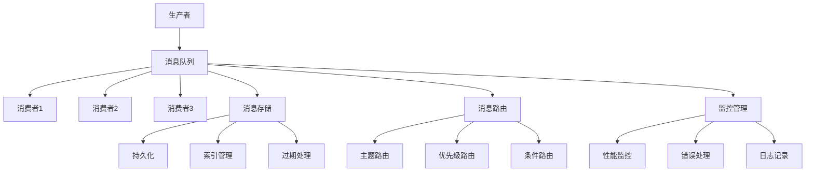

# 消息队列

## 🎯 学习目标
- 理解消息队列的基本概念和原理
- 掌握PHP消息队列的实现方法
- 学会消息队列的设计模式和最佳实践
- 了解消息队列的性能优化和监控

## 📚 核心概念

### 消息队列架构



### 消息队列模式对比

| 模式类型 | 特点 | 适用场景 | 优缺点 |
|----------|------|----------|--------|
| 点对点模式 | 一对一通信 | 任务分发 | 简单可靠，但扩展性有限 |
| 发布订阅模式 | 一对多通信 | 事件通知 | 解耦性好，但消息可能丢失 |
| 请求响应模式 | 同步通信 | RPC调用 | 实时性好，但复杂度高 |
| 流处理模式 | 连续数据处理 | 实时分析 | 高吞吐量，但延迟较高 |

## 🔧 消息队列实现

### 基础消息队列
```php
<?php
// 1. 基础消息队列实现
class BasicMessageQueue {
    private array $queues = [];
    private array $subscribers = [];
    private array $messages = [];
    
    // 创建队列
    public function createQueue(string $queueName, array $options = []): bool {
        $this->queues[$queueName] = [
            'name' => $queueName,
            'options' => $options,
            'messages' => [],
            'created_at' => time()
        ];
        return true;
    }
    
    // 发送消息
    public function sendMessage(string $queueName, mixed $message, array $options = []): string {
        if (!isset($this->queues[$queueName])) {
            throw new Exception("队列不存在: $queueName");
        }
        
        $messageId = uniqid();
        $messageData = [
            'id' => $messageId,
            'queue' => $queueName,
            'body' => $message,
            'options' => $options,
            'created_at' => time(),
            'status' => 'pending'
        ];
        
        $this->queues[$queueName]['messages'][] = $messageData;
        $this->messages[$messageId] = $messageData;
        
        return $messageId;
    }
    
    // 接收消息
    public function receiveMessage(string $queueName, int $timeout = 0): ?array {
        if (!isset($this->queues[$queueName])) {
            return null;
        }
        
        $startTime = time();
        
        while (true) {
            $queue = &$this->queues[$queueName];
            
            foreach ($queue['messages'] as $index => $message) {
                if ($message['status'] === 'pending') {
                    $queue['messages'][$index]['status'] = 'processing';
                    $this->messages[$message['id']]['status'] = 'processing';
                    return $message;
                }
            }
            
            if ($timeout > 0 && (time() - $startTime) >= $timeout) {
                break;
            }
            
            usleep(100000); // 100ms
        }
        
        return null;
    }
    
    // 确认消息
    public function acknowledgeMessage(string $messageId): bool {
        if (!isset($this->messages[$messageId])) {
            return false;
        }
        
        $message = $this->messages[$messageId];
        $queueName = $message['queue'];
        
        // 从队列中移除消息
        $queue = &$this->queues[$queueName];
        $queue['messages'] = array_filter($queue['messages'], function($msg) use ($messageId) {
            return $msg['id'] !== $messageId;
        });
        
        // 更新消息状态
        $this->messages[$messageId]['status'] = 'acknowledged';
        $this->messages[$messageId]['acknowledged_at'] = time();
        
        return true;
    }
    
    // 拒绝消息
    public function rejectMessage(string $messageId, bool $requeue = false): bool {
        if (!isset($this->messages[$messageId])) {
            return false;
        }
        
        $message = $this->messages[$messageId];
        $queueName = $message['queue'];
        
        if ($requeue) {
            // 重新排队
            $this->messages[$messageId]['status'] = 'pending';
            $this->messages[$messageId]['retry_count'] = ($this->messages[$messageId]['retry_count'] ?? 0) + 1;
        } else {
            // 从队列中移除
            $queue = &$this->queues[$queueName];
            $queue['messages'] = array_filter($queue['messages'], function($msg) use ($messageId) {
                return $msg['id'] !== $messageId;
            });
            
            $this->messages[$messageId]['status'] = 'rejected';
        }
        
        $this->messages[$messageId]['rejected_at'] = time();
        return true;
    }
    
    // 获取队列状态
    public function getQueueStatus(string $queueName): ?array {
        if (!isset($this->queues[$queueName])) {
            return null;
        }
        
        $queue = $this->queues[$queueName];
        $pendingCount = 0;
        $processingCount = 0;
        
        foreach ($queue['messages'] as $message) {
            if ($message['status'] === 'pending') {
                $pendingCount++;
            } elseif ($message['status'] === 'processing') {
                $processingCount++;
            }
        }
        
        return [
            'name' => $queueName,
            'total_messages' => count($queue['messages']),
            'pending_messages' => $pendingCount,
            'processing_messages' => $processingCount,
            'created_at' => $queue['created_at']
        ];
    }
}

// 2. 发布订阅模式
class PubSubMessageQueue {
    private array $topics = [];
    private array $subscribers = [];
    private array $messages = [];
    
    // 创建主题
    public function createTopic(string $topicName): bool {
        $this->topics[$topicName] = [
            'name' => $topicName,
            'subscribers' => [],
            'created_at' => time()
        ];
        return true;
    }
    
    // 订阅主题
    public function subscribe(string $topicName, string $subscriberId, callable $callback): bool {
        if (!isset($this->topics[$topicName])) {
            return false;
        }
        
        $this->topics[$topicName]['subscribers'][$subscriberId] = $callback;
        $this->subscribers[$subscriberId] = [
            'topic' => $topicName,
            'callback' => $callback,
            'subscribed_at' => time()
        ];
        
        return true;
    }
    
    // 取消订阅
    public function unsubscribe(string $topicName, string $subscriberId): bool {
        if (!isset($this->topics[$topicName])) {
            return false;
        }
        
        unset($this->topics[$topicName]['subscribers'][$subscriberId]);
        unset($this->subscribers[$subscriberId]);
        
        return true;
    }
    
    // 发布消息
    public function publish(string $topicName, mixed $message, array $options = []): string {
        if (!isset($this->topics[$topicName])) {
            throw new Exception("主题不存在: $topicName");
        }
        
        $messageId = uniqid();
        $messageData = [
            'id' => $messageId,
            'topic' => $topicName,
            'body' => $message,
            'options' => $options,
            'published_at' => time(),
            'status' => 'published'
        ];
        
        $this->messages[$messageId] = $messageData;
        
        // 通知所有订阅者
        $this->notifySubscribers($topicName, $messageData);
        
        return $messageId;
    }
    
    // 通知订阅者
    private function notifySubscribers(string $topicName, array $messageData): void {
        $topic = $this->topics[$topicName];
        
        foreach ($topic['subscribers'] as $subscriberId => $callback) {
            try {
                $callback($messageData);
            } catch (Exception $e) {
                echo "订阅者 $subscriberId 处理消息失败: " . $e->getMessage() . "\n";
            }
        }
    }
    
    // 获取主题状态
    public function getTopicStatus(string $topicName): ?array {
        if (!isset($this->topics[$topicName])) {
            return null;
        }
        
        $topic = $this->topics[$topicName];
        
        return [
            'name' => $topicName,
            'subscriber_count' => count($topic['subscribers']),
            'created_at' => $topic['created_at']
        ];
    }
}

// 3. 消息队列管理器
class MessageQueueManager {
    private array $queues = [];
    private array $topics = [];
    private array $workers = [];
    private bool $running = false;
    
    // 添加队列
    public function addQueue(string $name, array $config = []): BasicMessageQueue {
        $queue = new BasicMessageQueue();
        $queue->createQueue($name, $config);
        $this->queues[$name] = $queue;
        return $queue;
    }
    
    // 添加主题
    public function addTopic(string $name, array $config = []): PubSubMessageQueue {
        $topic = new PubSubMessageQueue();
        $topic->createTopic($name);
        $this->topics[$name] = $topic;
        return $topic;
    }
    
    // 启动工作进程
    public function startWorker(string $queueName, callable $processor, int $workerCount = 1): void {
        $this->running = true;
        
        for ($i = 0; $i < $workerCount; $i++) {
            $this->createWorker($queueName, $processor, $i);
        }
    }
    
    // 创建工作进程
    private function createWorker(string $queueName, callable $processor, int $workerId): void {
        $pid = pcntl_fork();
        
        if ($pid == -1) {
            throw new Exception('无法创建工作进程');
        } elseif ($pid == 0) {
            // 工作进程
            $this->workerProcess($queueName, $processor, $workerId);
            exit(0);
        } else {
            // 主进程
            $this->workers[$workerId] = [
                'pid' => $pid,
                'queue' => $queueName,
                'status' => 'running',
                'started_at' => time()
            ];
        }
    }
    
    // 工作进程
    private function workerProcess(string $queueName, callable $processor, int $workerId): void {
        echo "工作进程 $workerId 开始处理队列 $queueName\n";
        
        while ($this->running) {
            if (isset($this->queues[$queueName])) {
                $queue = $this->queues[$queueName];
                $message = $queue->receiveMessage($queueName, 1);
                
                if ($message) {
                    try {
                        $result = $processor($message);
                        
                        if ($result) {
                            $queue->acknowledgeMessage($message['id']);
                            echo "工作进程 $workerId 处理消息成功: {$message['id']}\n";
                        } else {
                            $queue->rejectMessage($message['id'], true);
                            echo "工作进程 $workerId 处理消息失败，重新排队: {$message['id']}\n";
                        }
                    } catch (Exception $e) {
                        $queue->rejectMessage($message['id'], true);
                        echo "工作进程 $workerId 处理消息异常: " . $e->getMessage() . "\n";
                    }
                }
            }
            
            usleep(100000); // 100ms
        }
        
        echo "工作进程 $workerId 停止\n";
    }
    
    // 停止工作进程
    public function stopWorkers(): void {
        $this->running = false;
        
        foreach ($this->workers as $worker) {
            posix_kill($worker['pid'], SIGTERM);
            pcntl_waitpid($worker['pid'], $status);
        }
        
        $this->workers = [];
    }
    
    // 获取管理器状态
    public function getStatus(): array {
        $queueStatus = [];
        foreach ($this->queues as $name => $queue) {
            $queueStatus[$name] = $queue->getQueueStatus($name);
        }
        
        $topicStatus = [];
        foreach ($this->topics as $name => $topic) {
            $topicStatus[$name] = $topic->getTopicStatus($name);
        }
        
        return [
            'queues' => $queueStatus,
            'topics' => $topicStatus,
            'workers' => $this->workers,
            'running' => $this->running
        ];
    }
}

// 使用示例
echo "=== 消息队列示例 ===\n";

try {
    // 基础消息队列
    $basicQueue = new BasicMessageQueue();
    $basicQueue->createQueue('test_queue');
    
    $messageId = $basicQueue->sendMessage('test_queue', 'Hello World');
    echo "发送消息: $messageId\n";
    
    $message = $basicQueue->receiveMessage('test_queue');
    if ($message) {
        echo "接收消息: " . json_encode($message) . "\n";
        $basicQueue->acknowledgeMessage($message['id']);
        echo "确认消息: {$message['id']}\n";
    }
    
    $status = $basicQueue->getQueueStatus('test_queue');
    echo "队列状态: " . json_encode($status) . "\n";
    
    // 发布订阅模式
    $pubSub = new PubSubMessageQueue();
    $pubSub->createTopic('news');
    
    $pubSub->subscribe('news', 'subscriber1', function($message) {
        echo "订阅者1收到消息: " . json_encode($message) . "\n";
    });
    
    $pubSub->subscribe('news', 'subscriber2', function($message) {
        echo "订阅者2收到消息: " . json_encode($message) . "\n";
    });
    
    $messageId = $pubSub->publish('news', 'Breaking News: PHP 8.3 Released!');
    echo "发布消息: $messageId\n";
    
    $topicStatus = $pubSub->getTopicStatus('news');
    echo "主题状态: " . json_encode($topicStatus) . "\n";
    
    // 消息队列管理器
    $manager = new MessageQueueManager();
    $queue = $manager->addQueue('worker_queue');
    
    $manager->startWorker('worker_queue', function($message) {
        echo "处理消息: {$message['body']}\n";
        return true; // 处理成功
    }, 2);
    
    // 发送一些消息
    for ($i = 1; $i <= 5; $i++) {
        $queue->sendMessage('worker_queue', "任务 $i");
    }
    
    sleep(2); // 等待处理
    
    $status = $manager->getStatus();
    echo "管理器状态: " . json_encode($status) . "\n";
    
    $manager->stopWorkers();
    
} catch (Exception $e) {
    echo "错误: " . $e->getMessage() . "\n";
}
?>
```

### 高级消息队列
```php
<?php
// 1. 分布式消息队列
class DistributedMessageQueue {
    private array $nodes = [];
    private string $currentNodeId;
    private array $partitions = [];
    private array $replicas = [];
    
    public function __construct(string $nodeId) {
        $this->currentNodeId = $nodeId;
        $this->nodes[$nodeId] = [
            'id' => $nodeId,
            'status' => 'active',
            'partitions' => [],
            'last_heartbeat' => time()
        ];
    }
    
    // 添加节点
    public function addNode(string $nodeId, string $address): void {
        $this->nodes[$nodeId] = [
            'id' => $nodeId,
            'address' => $address,
            'status' => 'active',
            'partitions' => [],
            'last_heartbeat' => time()
        ];
    }
    
    // 创建分区
    public function createPartition(string $topic, int $partitionCount): void {
        $this->partitions[$topic] = [];
        
        for ($i = 0; $i < $partitionCount; $i++) {
            $partitionId = "$topic-partition-$i";
            $this->partitions[$topic][$i] = [
                'id' => $partitionId,
                'topic' => $topic,
                'partition' => $i,
                'leader' => $this->selectLeader($partitionId),
                'replicas' => $this->selectReplicas($partitionId, 2),
                'messages' => [],
                'offset' => 0
            ];
        }
    }
    
    // 选择领导者
    private function selectLeader(string $partitionId): string {
        $nodeIds = array_keys($this->nodes);
        return $nodeIds[array_rand($nodeIds)];
    }
    
    // 选择副本
    private function selectReplicas(string $partitionId, int $replicaCount): array {
        $nodeIds = array_keys($this->nodes);
        shuffle($nodeIds);
        return array_slice($nodeIds, 0, $replicaCount);
    }
    
    // 发送消息到分区
    public function sendMessage(string $topic, mixed $message, string $key = null): string {
        if (!isset($this->partitions[$topic])) {
            throw new Exception("主题不存在: $topic");
        }
        
        $partition = $this->selectPartition($topic, $key);
        $messageId = uniqid();
        
        $messageData = [
            'id' => $messageId,
            'topic' => $topic,
            'partition' => $partition,
            'key' => $key,
            'body' => $message,
            'timestamp' => time(),
            'offset' => $this->partitions[$topic][$partition]['offset']++
        ];
        
        $this->partitions[$topic][$partition]['messages'][] = $messageData;
        
        // 复制到副本
        $this->replicateMessage($topic, $partition, $messageData);
        
        return $messageId;
    }
    
    // 选择分区
    private function selectPartition(string $topic, ?string $key): int {
        $partitionCount = count($this->partitions[$topic]);
        
        if ($key === null) {
            return array_rand($this->partitions[$topic]);
        }
        
        return crc32($key) % $partitionCount;
    }
    
    // 复制消息
    private function replicateMessage(string $topic, int $partition, array $messageData): void {
        $partitionData = $this->partitions[$topic][$partition];
        
        foreach ($partitionData['replicas'] as $replicaNodeId) {
            if ($replicaNodeId !== $this->currentNodeId) {
                $this->sendToReplica($replicaNodeId, $messageData);
            }
        }
    }
    
    // 发送到副本
    private function sendToReplica(string $nodeId, array $messageData): void {
        // 模拟网络发送
        echo "复制消息到节点: $nodeId\n";
    }
    
    // 消费消息
    public function consumeMessages(string $topic, int $partition, int $offset = 0, int $limit = 10): array {
        if (!isset($this->partitions[$topic][$partition])) {
            return [];
        }
        
        $partitionData = $this->partitions[$topic][$partition];
        $messages = array_slice($partitionData['messages'], $offset, $limit);
        
        return $messages;
    }
    
    // 获取分区状态
    public function getPartitionStatus(string $topic, int $partition): ?array {
        if (!isset($this->partitions[$topic][$partition])) {
            return null;
        }
        
        $partitionData = $this->partitions[$topic][$partition];
        
        return [
            'topic' => $topic,
            'partition' => $partition,
            'leader' => $partitionData['leader'],
            'replicas' => $partitionData['replicas'],
            'message_count' => count($partitionData['messages']),
            'offset' => $partitionData['offset']
        ];
    }
}

// 2. 消息队列监控
class MessageQueueMonitor {
    private array $metrics = [];
    private array $alerts = [];
    private array $dashboards = [];
    
    // 记录指标
    public function recordMetric(string $name, float $value, array $tags = []): void {
        $timestamp = time();
        
        if (!isset($this->metrics[$name])) {
            $this->metrics[$name] = [];
        }
        
        $this->metrics[$name][] = [
            'value' => $value,
            'tags' => $tags,
            'timestamp' => $timestamp
        ];
        
        // 检查告警
        $this->checkAlerts($name, $value, $tags);
    }
    
    // 检查告警
    private function checkAlerts(string $metricName, float $value, array $tags): void {
        foreach ($this->alerts as $alert) {
            if ($alert['metric'] === $metricName && $this->evaluateCondition($value, $alert['condition'])) {
                $this->triggerAlert($alert, $value, $tags);
            }
        }
    }
    
    // 评估条件
    private function evaluateCondition(float $value, string $condition): bool {
        // 简化的条件评估
        if (strpos($condition, '>') !== false) {
            $threshold = (float)substr($condition, 1);
            return $value > $threshold;
        } elseif (strpos($condition, '<') !== false) {
            $threshold = (float)substr($condition, 1);
            return $value < $threshold;
        }
        
        return false;
    }
    
    // 触发告警
    private function triggerAlert(array $alert, float $value, array $tags): void {
        echo "告警触发: {$alert['name']} - 指标: {$alert['metric']}, 值: $value, 条件: {$alert['condition']}\n";
        
        // 发送告警通知
        $this->sendAlertNotification($alert, $value, $tags);
    }
    
    // 发送告警通知
    private function sendAlertNotification(array $alert, float $value, array $tags): void {
        // 模拟发送通知
        echo "发送告警通知: {$alert['name']}\n";
    }
    
    // 创建告警规则
    public function createAlert(string $name, string $metric, string $condition, string $severity = 'warning'): void {
        $this->alerts[] = [
            'name' => $name,
            'metric' => $metric,
            'condition' => $condition,
            'severity' => $severity,
            'created_at' => time()
        ];
    }
    
    // 获取指标统计
    public function getMetricStats(string $name, int $timeRange = 3600): array {
        if (!isset($this->metrics[$name])) {
            return [];
        }
        
        $cutoffTime = time() - $timeRange;
        $recentMetrics = array_filter($this->metrics[$name], function($metric) use ($cutoffTime) {
            return $metric['timestamp'] >= $cutoffTime;
        });
        
        if (empty($recentMetrics)) {
            return [];
        }
        
        $values = array_column($recentMetrics, 'value');
        
        return [
            'count' => count($values),
            'min' => min($values),
            'max' => max($values),
            'avg' => array_sum($values) / count($values),
            'sum' => array_sum($values)
        ];
    }
    
    // 创建仪表板
    public function createDashboard(string $name, array $widgets): void {
        $this->dashboards[$name] = [
            'name' => $name,
            'widgets' => $widgets,
            'created_at' => time()
        ];
    }
    
    // 获取仪表板数据
    public function getDashboardData(string $name): ?array {
        if (!isset($this->dashboards[$name])) {
            return null;
        }
        
        $dashboard = $this->dashboards[$name];
        $data = [];
        
        foreach ($dashboard['widgets'] as $widget) {
            $data[$widget['name']] = $this->getMetricStats($widget['metric'], $widget['timeRange'] ?? 3600);
        }
        
        return $data;
    }
}

// 3. 消息队列性能优化
class MessageQueueOptimizer {
    private array $config = [];
    private array $cache = [];
    private array $batchOperations = [];
    
    // 批量操作
    public function batchSend(string $queueName, array $messages): array {
        $batchId = uniqid();
        $this->batchOperations[$batchId] = [
            'type' => 'send',
            'queue' => $queueName,
            'messages' => $messages,
            'status' => 'pending',
            'created_at' => time()
        ];
        
        return $this->processBatch($batchId);
    }
    
    // 处理批量操作
    private function processBatch(string $batchId): array {
        $batch = $this->batchOperations[$batchId];
        $results = [];
        
        foreach ($batch['messages'] as $message) {
            $results[] = $this->sendMessage($batch['queue'], $message);
        }
        
        $this->batchOperations[$batchId]['status'] = 'completed';
        $this->batchOperations[$batchId]['results'] = $results;
        
        return $results;
    }
    
    // 发送消息
    private function sendMessage(string $queueName, mixed $message): string {
        // 模拟发送消息
        return uniqid();
    }
    
    // 消息压缩
    public function compressMessage(mixed $message): string {
        $serialized = serialize($message);
        return gzcompress($serialized);
    }
    
    // 消息解压
    public function decompressMessage(string $compressed): mixed {
        $decompressed = gzuncompress($compressed);
        return unserialize($decompressed);
    }
    
    // 消息分片
    public function chunkMessage(mixed $message, int $chunkSize = 1024): array {
        $serialized = serialize($message);
        $chunks = str_split($serialized, $chunkSize);
        
        $messageId = uniqid();
        $chunkData = [];
        
        foreach ($chunks as $index => $chunk) {
            $chunkData[] = [
                'message_id' => $messageId,
                'chunk_index' => $index,
                'total_chunks' => count($chunks),
                'data' => $chunk
            ];
        }
        
        return $chunkData;
    }
    
    // 重组消息
    public function reassembleMessage(array $chunks): mixed {
        // 按索引排序
        usort($chunks, function($a, $b) {
            return $a['chunk_index'] <=> $b['chunk_index'];
        });
        
        // 重组数据
        $data = '';
        foreach ($chunks as $chunk) {
            $data .= $chunk['data'];
        }
        
        return unserialize($data);
    }
    
    // 连接池管理
    public function getConnection(string $queueName): mixed {
        if (!isset($this->cache[$queueName])) {
            $this->cache[$queueName] = $this->createConnection($queueName);
        }
        
        return $this->cache[$queueName];
    }
    
    // 创建连接
    private function createConnection(string $queueName): mixed {
        // 模拟创建连接
        return "connection_to_$queueName";
    }
    
    // 清理缓存
    public function clearCache(): void {
        $this->cache = [];
    }
}

// 使用示例
echo "=== 高级消息队列示例 ===\n";

try {
    // 分布式消息队列
    $distributedQueue = new DistributedMessageQueue('node1');
    $distributedQueue->addNode('node2', '192.168.1.2:9092');
    $distributedQueue->addNode('node3', '192.168.1.3:9092');
    
    $distributedQueue->createPartition('orders', 3);
    
    $messageId = $distributedQueue->sendMessage('orders', 'Order #12345', 'user123');
    echo "发送消息到分布式队列: $messageId\n";
    
    $messages = $distributedQueue->consumeMessages('orders', 0, 0, 5);
    echo "消费消息: " . json_encode($messages) . "\n";
    
    $status = $distributedQueue->getPartitionStatus('orders', 0);
    echo "分区状态: " . json_encode($status) . "\n";
    
    // 消息队列监控
    $monitor = new MessageQueueMonitor();
    
    $monitor->createAlert('High Message Rate', 'message_rate', '>1000', 'critical');
    $monitor->createAlert('Low Consumer Lag', 'consumer_lag', '<10', 'info');
    
    $monitor->recordMetric('message_rate', 1200, ['queue' => 'orders']);
    $monitor->recordMetric('consumer_lag', 5, ['queue' => 'orders']);
    
    $stats = $monitor->getMetricStats('message_rate', 3600);
    echo "指标统计: " . json_encode($stats) . "\n";
    
    $monitor->createDashboard('Queue Dashboard', [
        ['name' => 'Message Rate', 'metric' => 'message_rate', 'timeRange' => 3600],
        ['name' => 'Consumer Lag', 'metric' => 'consumer_lag', 'timeRange' => 3600]
    ]);
    
    $dashboardData = $monitor->getDashboardData('Queue Dashboard');
    echo "仪表板数据: " . json_encode($dashboardData) . "\n";
    
    // 消息队列性能优化
    $optimizer = new MessageQueueOptimizer();
    
    $messages = ['Message 1', 'Message 2', 'Message 3'];
    $results = $optimizer->batchSend('test_queue', $messages);
    echo "批量发送结果: " . json_encode($results) . "\n";
    
    $largeMessage = str_repeat('A', 10000);
    $compressed = $optimizer->compressMessage($largeMessage);
    $decompressed = $optimizer->decompressMessage($compressed);
    echo "压缩前大小: " . strlen($largeMessage) . ", 压缩后大小: " . strlen($compressed) . "\n";
    
    $chunks = $optimizer->chunkMessage($largeMessage, 1000);
    $reassembled = $optimizer->reassembleMessage($chunks);
    echo "分片数量: " . count($chunks) . ", 重组成功: " . ($reassembled === $largeMessage ? 'Yes' : 'No') . "\n";
    
} catch (Exception $e) {
    echo "错误: " . $e->getMessage() . "\n";
}
?>
```

## 📊 最佳实践

### 消息队列最佳实践
```php
<?php
// 消息队列最佳实践

class MessageQueueBestPractices {
    // 1. 消息设计最佳实践
    public static function getMessageDesignBestPractices() {
        return [
            '消息结构' => [
                '标准化格式' => '使用标准化的消息格式（JSON、Avro等）',
                '版本控制' => '实现消息格式的版本控制',
                '字段命名' => '使用清晰、一致的字段命名',
                '数据类型' => '明确定义数据类型和约束'
            ],
            '消息大小' => [
                '大小限制' => '控制消息大小，避免过大消息',
                '分片处理' => '大消息使用分片处理',
                '压缩优化' => '使用压缩减少消息大小',
                '批量操作' => '使用批量操作提高效率'
            ],
            '消息内容' => [
                '业务数据' => '只包含必要的业务数据',
                '元数据' => '包含必要的元数据信息',
                '时间戳' => '包含消息创建时间戳',
                '唯一标识' => '包含消息唯一标识符'
            ]
        ];
    }
    
    // 2. 队列设计最佳实践
    public static function getQueueDesignBestPractices() {
        return [
            '队列命名' => [
                '命名规范' => '使用清晰的命名规范',
                '环境区分' => '区分不同环境的队列',
                '业务分类' => '按业务功能分类队列',
                '版本标识' => '包含版本信息'
            ],
            '队列配置' => [
                '消息保留' => '设置合理的消息保留时间',
                '最大大小' => '设置队列最大大小限制',
                '优先级' => '配置消息优先级处理',
                '死信队列' => '配置死信队列处理失败消息'
            ],
            '分区策略' => [
                '分区数量' => '合理设置分区数量',
                '分区键' => '选择合适的分区键',
                '负载均衡' => '实现负载均衡',
                '扩展性' => '考虑未来扩展需求'
            ]
        ];
    }
    
    // 3. 消费者设计最佳实践
    public static function getConsumerDesignBestPractices() {
        return [
            '消费模式' => [
                '批量消费' => '使用批量消费提高效率',
                '异步处理' => '采用异步处理模式',
                '错误处理' => '实现完善的错误处理',
                '重试机制' => '实现消息重试机制'
            ],
            '性能优化' => [
                '并发控制' => '控制并发消费数量',
                '资源管理' => '合理管理系统资源',
                '缓存策略' => '使用缓存提高性能',
                '连接池' => '使用连接池管理连接'
            ],
            '监控告警' => [
                '消费延迟' => '监控消费延迟',
                '错误率' => '监控消费错误率',
                '吞吐量' => '监控消费吞吐量',
                '资源使用' => '监控资源使用情况'
            ]
        ];
    }
    
    // 4. 运维管理最佳实践
    public static function getOperationsBestPractices() {
        return [
            '监控体系' => [
                '指标监控' => '建立完整的指标监控体系',
                '日志管理' => '实现集中化日志管理',
                '告警机制' => '建立告警机制',
                '仪表板' => '创建运维仪表板'
            ],
            '备份恢复' => [
                '数据备份' => '定期备份重要数据',
                '配置备份' => '备份系统配置',
                '恢复测试' => '定期测试恢复流程',
                '灾难恢复' => '制定灾难恢复计划'
            ],
            '安全防护' => [
                '访问控制' => '实现严格的访问控制',
                '数据加密' => '对敏感数据进行加密',
                '审计日志' => '记录操作审计日志',
                '安全扫描' => '定期进行安全扫描'
            ]
        ];
    }
}

// 使用示例
echo "=== 消息队列最佳实践示例 ===\n";

try {
    $messageDesign = MessageQueueBestPractices::getMessageDesignBestPractices();
    echo "消息设计最佳实践:\n";
    foreach ($messageDesign as $category => $practices) {
        echo "  $category:\n";
        foreach ($practices as $practice => $description) {
            echo "    - $practice: $description\n";
        }
        echo "\n";
    }
    
    $queueDesign = MessageQueueBestPractices::getQueueDesignBestPractices();
    echo "队列设计最佳实践:\n";
    foreach ($queueDesign as $category => $practices) {
        echo "  $category:\n";
        foreach ($practices as $practice => $description) {
            echo "    - $practice: $description\n";
        }
        echo "\n";
    }
    
} catch (Exception $e) {
    echo "错误: " . $e->getMessage() . "\n";
}
?>
```

## 🎓 学习建议

### 费曼学习法应用
1. **选择概念**: 选择消息队列中的核心概念
2. **简化解释**: 用简单语言解释消息队列的重要性
3. **识别盲点**: 发现理解不深入的地方
4. **重新学习**: 针对盲点进行深入学习

### 刻意练习重点
1. **消息设计**: 掌握消息的设计和优化
2. **队列管理**: 学会队列的创建和管理
3. **消费者实现**: 理解消费者的实现和优化
4. **监控运维**: 培养消息队列的监控和运维能力

## 🔗 相关链接
- [[01-多进程编程|多进程编程]]
- [[02-异步编程|异步编程]]
- [[04-协程编程|协程编程]]
- [[05-锁机制|锁机制]]
- [[06-并发安全|并发安全]]
- [[07-并发性能优化|并发性能优化]]
