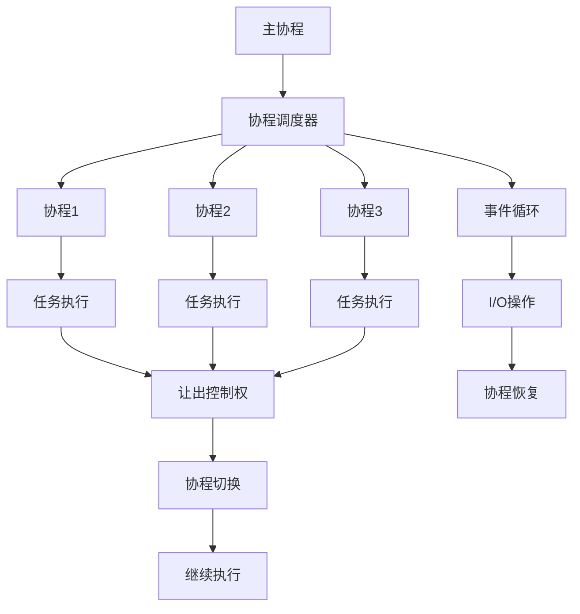

# 协程编程

## 🎯 学习目标
- 理解协程编程的基本概念和原理
- 掌握PHP协程编程的实现方法
- 学会协程调度和同步机制
- 了解协程编程的性能优化和最佳实践

## 📚 核心概念

### 协程编程架构



### 协程与线程对比

| 特性 | 协程 | 线程 |
|------|------|------|
| 创建成本 | 低 | 高 |
| 内存占用 | 小 | 大 |
| 切换成本 | 低 | 高 |
| 并发数量 | 高 | 低 |
| 同步机制 | 简单 | 复杂 |
| 调试难度 | 中等 | 高 |

## 🔧 协程编程实现

### 基础协程编程
```php
<?php
// 1. 基础协程实现
class BasicCoroutine {
    private array $coroutines = [];
    private int $currentId = 0;
    private array $scheduler = [];
    
    // 协程类
    class Coroutine {
        private int $id;
        private Generator $generator;
        private mixed $value = null;
        private bool $valid = true;
        private string $status = 'ready';
        
        public function __construct(int $id, Generator $generator) {
            $this->id = $id;
            $this->generator = $generator;
        }
        
        public function getId(): int {
            return $this->id;
        }
        
        public function run(): mixed {
            if ($this->valid) {
                $this->status = 'running';
                $this->value = $this->generator->current();
                $this->valid = $this->generator->valid();
                
                if (!$this->valid) {
                    $this->status = 'finished';
                }
                
                return $this->value;
            }
            return null;
        }
        
        public function send(mixed $value): mixed {
            if ($this->valid) {
                $this->status = 'running';
                $this->value = $this->generator->send($value);
                $this->valid = $this->generator->valid();
                
                if (!$this->valid) {
                    $this->status = 'finished';
                }
                
                return $this->value;
            }
            return null;
        }
        
        public function isValid(): bool {
            return $this->valid;
        }
        
        public function getStatus(): string {
            return $this->status;
        }
        
        public function getValue(): mixed {
            return $this->value;
        }
    }
    
    // 创建协程
    public function createCoroutine(callable $function, ...$args): int {
        $id = ++$this->currentId;
        $generator = $function(...$args);
        $coroutine = new Coroutine($id, $generator);
        $this->coroutines[$id] = $coroutine;
        return $id;
    }
    
    // 运行协程
    public function runCoroutine(int $id): mixed {
        if (!isset($this->coroutines[$id])) {
            return null;
        }
        
        $coroutine = $this->coroutines[$id];
        return $coroutine->run();
    }
    
    // 发送值给协程
    public function sendToCoroutine(int $id, mixed $value): mixed {
        if (!isset($this->coroutines[$id])) {
            return null;
        }
        
        $coroutine = $this->coroutines[$id];
        return $coroutine->send($value);
    }
    
    // 协程调度器
    public function schedule(): void {
        while (!empty($this->coroutines)) {
            $activeCoroutines = array_filter($this->coroutines, function($coroutine) {
                return $coroutine->isValid();
            });
            
            if (empty($activeCoroutines)) {
                break;
            }
            
            foreach ($activeCoroutines as $id => $coroutine) {
                $result = $coroutine->run();
                
                if (!$coroutine->isValid()) {
                    unset($this->coroutines[$id]);
                }
            }
        }
    }
    
    // 获取协程状态
    public function getCoroutineStatus(int $id): ?array {
        if (!isset($this->coroutines[$id])) {
            return null;
        }
        
        $coroutine = $this->coroutines[$id];
        
        return [
            'id' => $id,
            'status' => $coroutine->getStatus(),
            'value' => $coroutine->getValue(),
            'valid' => $coroutine->isValid()
        ];
    }
    
    // 获取所有协程状态
    public function getAllCoroutineStatus(): array {
        $status = [];
        
        foreach ($this->coroutines as $id => $coroutine) {
            $status[$id] = $this->getCoroutineStatus($id);
        }
        
        return $status;
    }
}

// 2. 协程工具函数
class CoroutineUtils {
    // 异步等待
    public static function asyncWait(int $milliseconds): Generator {
        $startTime = microtime(true);
        $endTime = $startTime + ($milliseconds / 1000);
        
        while (microtime(true) < $endTime) {
            yield;
        }
    }
    
    // 异步文件读取
    public static function asyncFileRead(string $filename): Generator {
        $handle = fopen($filename, 'r');
        if (!$handle) {
            throw new Exception("无法打开文件: $filename");
        }
        
        $content = '';
        while (!feof($handle)) {
            $chunk = fread($handle, 8192);
            $content .= $chunk;
            yield; // 让出控制权
        }
        
        fclose($handle);
        return $content;
    }
    
    // 异步HTTP请求
    public static function asyncHttpRequest(string $url): Generator {
        $context = stream_context_create([
            'http' => [
                'method' => 'GET',
                'timeout' => 30
            ]
        ]);
        
        $handle = fopen($url, 'r', false, $context);
        if (!$handle) {
            throw new Exception("HTTP请求失败: $url");
        }
        
        $response = '';
        while (!feof($handle)) {
            $chunk = fread($handle, 8192);
            $response .= $chunk;
            yield; // 让出控制权
        }
        
        fclose($handle);
        return $response;
    }
    
    // 异步数据库查询
    public static function asyncDatabaseQuery(string $query, array $params = []): Generator {
        // 模拟数据库查询
        yield from self::asyncWait(100); // 模拟查询延迟
        
        // 返回模拟结果
        return [
            'query' => $query,
            'params' => $params,
            'result' => '模拟查询结果',
            'rows' => 10
        ];
    }
    
    // 协程组合
    public static function combineCoroutines(array $coroutines): Generator {
        $results = [];
        
        foreach ($coroutines as $index => $coroutine) {
            if ($coroutine instanceof Generator) {
                $results[$index] = yield from $coroutine;
            } else {
                $results[$index] = $coroutine;
            }
        }
        
        return $results;
    }
    
    // 协程映射
    public static function mapCoroutines(array $data, callable $mapper): Generator {
        $results = [];
        
        foreach ($data as $index => $item) {
            $coroutine = $mapper($item);
            if ($coroutine instanceof Generator) {
                $results[$index] = yield from $coroutine;
            } else {
                $results[$index] = $coroutine;
            }
        }
        
        return $results;
    }
}

// 3. 协程池管理
class CoroutinePool {
    private array $pool = [];
    private int $poolSize;
    private array $taskQueue = [];
    private bool $running = false;
    
    public function __construct(int $poolSize = 10) {
        $this->poolSize = $poolSize;
    }
    
    // 启动协程池
    public function start(): void {
        $this->running = true;
        
        for ($i = 0; $i < $this->poolSize; $i++) {
            $this->createWorker($i);
        }
    }
    
    // 创建工作协程
    private function createWorker(int $workerId): void {
        $coroutine = function() use ($workerId) {
            while ($this->running) {
                $task = $this->getTask();
                
                if ($task) {
                    try {
                        $result = yield from $task['coroutine'];
                        $task['callback']($result, null);
                    } catch (Exception $e) {
                        $task['callback'](null, $e);
                    }
                } else {
                    yield from CoroutineUtils::asyncWait(100); // 100ms
                }
            }
        };
        
        $this->pool[$workerId] = $coroutine;
    }
    
    // 获取任务
    private function getTask(): ?array {
        if (!empty($this->taskQueue)) {
            return array_shift($this->taskQueue);
        }
        return null;
    }
    
    // 添加任务
    public function addTask(Generator $coroutine, callable $callback): string {
        $taskId = uniqid();
        $this->taskQueue[] = [
            'id' => $taskId,
            'coroutine' => $coroutine,
            'callback' => $callback,
            'created_at' => time()
        ];
        
        return $taskId;
    }
    
    // 停止协程池
    public function stop(): void {
        $this->running = false;
    }
    
    // 获取池状态
    public function getPoolStatus(): array {
        return [
            'pool_size' => $this->poolSize,
            'active_workers' => count($this->pool),
            'pending_tasks' => count($this->taskQueue),
            'running' => $this->running
        ];
    }
}

// 使用示例
echo "=== 基础协程编程示例 ===\n";

try {
    // 基础协程
    $basicCoroutine = new BasicCoroutine();
    
    function task1(): Generator {
        echo "任务1开始\n";
        yield from CoroutineUtils::asyncWait(1000); // 等待1秒
        echo "任务1完成\n";
        return "任务1结果";
    }
    
    function task2(): Generator {
        echo "任务2开始\n";
        yield from CoroutineUtils::asyncWait(2000); // 等待2秒
        echo "任务2完成\n";
        return "任务2结果";
    }
    
    $coroutine1 = $basicCoroutine->createCoroutine('task1');
    $coroutine2 = $basicCoroutine->createCoroutine('task2');
    
    echo "创建协程: $coroutine1, $coroutine2\n";
    
    $basicCoroutine->schedule();
    
    $status = $basicCoroutine->getAllCoroutineStatus();
    echo "协程状态: " . json_encode($status) . "\n";
    
    // 协程工具函数
    function asyncTask(): Generator {
        echo "开始异步任务\n";
        
        $fileContent = yield from CoroutineUtils::asyncFileRead('test.txt');
        echo "文件内容: $fileContent\n";
        
        $httpResponse = yield from CoroutineUtils::asyncHttpRequest('https://api.github.com/users/octocat');
        echo "HTTP响应: " . substr($httpResponse, 0, 100) . "...\n";
        
        $dbResult = yield from CoroutineUtils::asyncDatabaseQuery('SELECT * FROM users');
        echo "数据库结果: " . json_encode($dbResult) . "\n";
        
        return "异步任务完成";
    }
    
    $asyncCoroutine = $basicCoroutine->createCoroutine('asyncTask');
    $basicCoroutine->schedule();
    
    // 协程池
    $coroutinePool = new CoroutinePool(3);
    
    $coroutinePool->addTask(
        function(): Generator {
            yield from CoroutineUtils::asyncWait(1000);
            return "池任务1完成";
        },
        function($result, $error) {
            if ($error) {
                echo "任务1错误: " . $error->getMessage() . "\n";
            } else {
                echo "任务1结果: $result\n";
            }
        }
    );
    
    $coroutinePool->addTask(
        function(): Generator {
            yield from CoroutineUtils::asyncWait(2000);
            return "池任务2完成";
        },
        function($result, $error) {
            if ($error) {
                echo "任务2错误: " . $error->getMessage() . "\n";
            } else {
                echo "任务2结果: $result\n";
            }
        }
    );
    
    $coroutinePool->start();
    sleep(3);
    $coroutinePool->stop();
    
    $poolStatus = $coroutinePool->getPoolStatus();
    echo "协程池状态: " . json_encode($poolStatus) . "\n";
    
} catch (Exception $e) {
    echo "错误: " . $e->getMessage() . "\n";
}
?>
```

### 高级协程编程
```php
<?php
// 1. 协程同步机制
class CoroutineSynchronization {
    private array $mutexes = [];
    private array $semaphores = [];
    private array $barriers = [];
    private array $channels = [];
    
    // 协程互斥锁
    public function createMutex(string $name): Generator {
        $mutex = [
            'name' => $name,
            'locked' => false,
            'waiting' => []
        ];
        
        $this->mutexes[$name] = $mutex;
        yield;
    }
    
    public function lockMutex(string $name): Generator {
        if (!isset($this->mutexes[$name])) {
            throw new Exception("互斥锁不存在: $name");
        }
        
        $mutex = &$this->mutexes[$name];
        
        while ($mutex['locked']) {
            $mutex['waiting'][] = getmypid();
            yield; // 让出控制权，等待解锁
        }
        
        $mutex['locked'] = true;
        yield;
    }
    
    public function unlockMutex(string $name): Generator {
        if (!isset($this->mutexes[$name])) {
            throw new Exception("互斥锁不存在: $name");
        }
        
        $mutex = &$this->mutexes[$name];
        $mutex['locked'] = false;
        
        if (!empty($mutex['waiting'])) {
            array_shift($mutex['waiting']);
        }
        
        yield;
    }
    
    // 协程信号量
    public function createSemaphore(string $name, int $initialValue): Generator {
        $semaphore = [
            'name' => $name,
            'value' => $initialValue,
            'waiting' => []
        ];
        
        $this->semaphores[$name] = $semaphore;
        yield;
    }
    
    public function waitSemaphore(string $name): Generator {
        if (!isset($this->semaphores[$name])) {
            throw new Exception("信号量不存在: $name");
        }
        
        $semaphore = &$this->semaphores[$name];
        
        while ($semaphore['value'] <= 0) {
            $semaphore['waiting'][] = getmypid();
            yield; // 让出控制权，等待信号
        }
        
        $semaphore['value']--;
        yield;
    }
    
    public function signalSemaphore(string $name): Generator {
        if (!isset($this->semaphores[$name])) {
            throw new Exception("信号量不存在: $name");
        }
        
        $semaphore = &$this->semaphores[$name];
        $semaphore['value']++;
        
        if (!empty($semaphore['waiting'])) {
            array_shift($semaphore['waiting']);
        }
        
        yield;
    }
    
    // 协程通道
    public function createChannel(string $name, int $bufferSize = 0): Generator {
        $channel = [
            'name' => $name,
            'buffer' => [],
            'buffer_size' => $bufferSize,
            'senders' => [],
            'receivers' => []
        ];
        
        $this->channels[$name] = $channel;
        yield;
    }
    
    public function sendToChannel(string $name, mixed $value): Generator {
        if (!isset($this->channels[$name])) {
            throw new Exception("通道不存在: $name");
        }
        
        $channel = &$this->channels[$name];
        
        if (count($channel['buffer']) >= $channel['buffer_size']) {
            $channel['senders'][] = ['value' => $value, 'pid' => getmypid()];
            yield; // 让出控制权，等待接收者
        } else {
            $channel['buffer'][] = $value;
            
            if (!empty($channel['receivers'])) {
                array_shift($channel['receivers']);
            }
        }
        
        yield;
    }
    
    public function receiveFromChannel(string $name): Generator {
        if (!isset($this->channels[$name])) {
            throw new Exception("通道不存在: $name");
        }
        
        $channel = &$this->channels[$name];
        
        if (empty($channel['buffer'])) {
            $channel['receivers'][] = getmypid();
            yield; // 让出控制权，等待发送者
        } else {
            $value = array_shift($channel['buffer']);
            
            if (!empty($channel['senders'])) {
                $sender = array_shift($channel['senders']);
                $channel['buffer'][] = $sender['value'];
            }
            
            yield $value;
        }
    }
}

// 2. 协程事件循环
class CoroutineEventLoop {
    private array $events = [];
    private array $timers = [];
    private array $callbacks = [];
    private bool $running = false;
    
    // 启动事件循环
    public function start(): void {
        $this->running = true;
        
        while ($this->running) {
            $this->processEvents();
            $this->processTimers();
            usleep(1000); // 1ms
        }
    }
    
    // 停止事件循环
    public function stop(): void {
        $this->running = false;
    }
    
    // 处理事件
    private function processEvents(): void {
        while (!empty($this->events)) {
            $event = array_shift($this->events);
            
            if (isset($this->callbacks[$event['type']])) {
                foreach ($this->callbacks[$event['type']] as $callback) {
                    $callback($event['data']);
                }
            }
        }
    }
    
    // 处理定时器
    private function processTimers(): void {
        $currentTime = microtime(true);
        
        foreach ($this->timers as $id => $timer) {
            if ($currentTime >= $timer['execute_time']) {
                $timer['callback']();
                
                if ($timer['repeat']) {
                    $this->timers[$id]['execute_time'] = $currentTime + $timer['interval'];
                } else {
                    unset($this->timers[$id]);
                }
            }
        }
    }
    
    // 注册事件监听器
    public function on(string $eventType, callable $callback): void {
        if (!isset($this->callbacks[$eventType])) {
            $this->callbacks[$eventType] = [];
        }
        $this->callbacks[$eventType][] = $callback;
    }
    
    // 触发事件
    public function emit(string $eventType, mixed $data = null): void {
        $this->events[] = [
            'type' => $eventType,
            'data' => $data,
            'timestamp' => microtime(true)
        ];
    }
    
    // 设置定时器
    public function setTimeout(callable $callback, int $delay): string {
        $id = uniqid();
        $this->timers[$id] = [
            'callback' => $callback,
            'execute_time' => microtime(true) + ($delay / 1000),
            'interval' => $delay / 1000,
            'repeat' => false
        ];
        return $id;
    }
    
    // 设置间隔定时器
    public function setInterval(callable $callback, int $interval): string {
        $id = uniqid();
        $this->timers[$id] = [
            'callback' => $callback,
            'execute_time' => microtime(true) + ($interval / 1000),
            'interval' => $interval / 1000,
            'repeat' => true
        ];
        return $id;
    }
    
    // 清除定时器
    public function clearTimer(string $id): void {
        unset($this->timers[$id]);
    }
}

// 3. 协程网络编程
class CoroutineNetwork {
    private array $sockets = [];
    private array $connections = [];
    
    // 协程TCP服务器
    public function createTCPServer(string $host, int $port): Generator {
        $socket = socket_create(AF_INET, SOCK_STREAM, SOL_TCP);
        socket_set_option($socket, SOL_SOCKET, SO_REUSEADDR, 1);
        socket_bind($socket, $host, $port);
        socket_listen($socket, 128);
        socket_set_nonblock($socket);
        
        $this->sockets['server'] = $socket;
        
        echo "TCP服务器启动: $host:$port\n";
        
        while (true) {
            $clientSocket = socket_accept($socket);
            
            if ($clientSocket !== false) {
                $connectionId = uniqid();
                $this->connections[$connectionId] = $clientSocket;
                
                // 创建协程处理客户端连接
                yield from $this->handleClient($connectionId, $clientSocket);
            }
            
            yield; // 让出控制权
        }
    }
    
    // 处理客户端连接
    private function handleClient(string $connectionId, $clientSocket): Generator {
        echo "新客户端连接: $connectionId\n";
        
        while (true) {
            $data = socket_read($clientSocket, 1024);
            
            if ($data === false || $data === '') {
                break;
            }
            
            echo "收到数据: $data\n";
            
            // 回显数据
            socket_write($clientSocket, "Echo: $data");
            
            yield; // 让出控制权
        }
        
        socket_close($clientSocket);
        unset($this->connections[$connectionId]);
        echo "客户端断开连接: $connectionId\n";
    }
    
    // 协程TCP客户端
    public function createTCPClient(string $host, int $port): Generator {
        $socket = socket_create(AF_INET, SOCK_STREAM, SOL_TCP);
        socket_set_nonblock($socket);
        
        $result = socket_connect($socket, $host, $port);
        
        if ($result === false) {
            $error = socket_last_error($socket);
            if ($error !== SOCKET_EINPROGRESS && $error !== SOCKET_EWOULDBLOCK) {
                throw new Exception("连接失败: " . socket_strerror($error));
            }
        }
        
        // 等待连接完成
        while (true) {
            $read = [$socket];
            $write = [$socket];
            $except = [$socket];
            
            $result = socket_select($read, $write, $except, 0, 100000); // 100ms
            
            if ($result > 0) {
                if (in_array($socket, $write)) {
                    echo "连接成功: $host:$port\n";
                    break;
                } elseif (in_array($socket, $except)) {
                    throw new Exception("连接异常");
                }
            }
            
            yield; // 让出控制权
        }
        
        return $socket;
    }
    
    // 协程HTTP客户端
    public function createHTTPClient(string $url): Generator {
        $parsedUrl = parse_url($url);
        $host = $parsedUrl['host'];
        $port = $parsedUrl['port'] ?? 80;
        $path = $parsedUrl['path'] ?? '/';
        
        $socket = yield from $this->createTCPClient($host, $port);
        
        $request = "GET $path HTTP/1.1\r\n";
        $request .= "Host: $host\r\n";
        $request .= "Connection: close\r\n";
        $request .= "\r\n";
        
        socket_write($socket, $request);
        
        $response = '';
        while (true) {
            $data = socket_read($socket, 1024);
            
            if ($data === false || $data === '') {
                break;
            }
            
            $response .= $data;
            yield; // 让出控制权
        }
        
        socket_close($socket);
        return $response;
    }
}

// 使用示例
echo "=== 高级协程编程示例 ===\n";

try {
    // 协程同步机制
    $sync = new CoroutineSynchronization();
    
    function producer(string $channelName): Generator {
        global $sync;
        
        for ($i = 1; $i <= 5; $i++) {
            yield from $sync->sendToChannel($channelName, "消息 $i");
            echo "发送消息: $i\n";
            yield from CoroutineUtils::asyncWait(500);
        }
    }
    
    function consumer(string $channelName): Generator {
        global $sync;
        
        for ($i = 1; $i <= 5; $i++) {
            $message = yield from $sync->receiveFromChannel($channelName);
            echo "接收消息: $message\n";
            yield from CoroutineUtils::asyncWait(300);
        }
    }
    
    // 创建通道
    yield from $sync->createChannel('test_channel', 2);
    
    // 创建生产者和消费者协程
    $basicCoroutine = new BasicCoroutine();
    $producerId = $basicCoroutine->createCoroutine('producer', 'test_channel');
    $consumerId = $basicCoroutine->createCoroutine('consumer', 'test_channel');
    
    $basicCoroutine->schedule();
    
    // 协程事件循环
    $eventLoop = new CoroutineEventLoop();
    
    $eventLoop->on('user.login', function($data) {
        echo "用户登录事件: " . json_encode($data) . "\n";
    });
    
    $eventLoop->on('user.logout', function($data) {
        echo "用户登出事件: " . json_encode($data) . "\n";
    });
    
    $eventLoop->setTimeout(function() {
        echo "定时器触发\n";
    }, 2000);
    
    $eventLoop->setInterval(function() {
        echo "间隔定时器触发\n";
    }, 1000);
    
    $eventLoop->emit('user.login', ['user_id' => 123, 'username' => 'test']);
    $eventLoop->emit('user.logout', ['user_id' => 123]);
    
    // 启动事件循环（非阻塞）
    $eventLoop->start();
    
    // 协程网络编程
    $network = new CoroutineNetwork();
    
    function httpClient(): Generator {
        global $network;
        
        $response = yield from $network->createHTTPClient('http://httpbin.org/get');
        echo "HTTP响应: " . substr($response, 0, 200) . "...\n";
    }
    
    $httpCoroutine = $basicCoroutine->createCoroutine('httpClient');
    $basicCoroutine->schedule();
    
} catch (Exception $e) {
    echo "错误: " . $e->getMessage() . "\n";
}
?>
```

## 📊 最佳实践

### 协程编程最佳实践
```php
<?php
// 协程编程最佳实践

class CoroutineBestPractices {
    // 1. 协程设计原则
    public static function getCoroutineDesignPrinciples() {
        return [
            '协程创建' => [
                '合理数量' => '控制协程数量，避免创建过多协程',
                '生命周期管理' => '管理协程的创建和销毁',
                '资源清理' => '及时清理协程占用的资源',
                '异常处理' => '在协程中正确处理异常'
            ],
            '协程通信' => [
                '通道通信' => '使用通道进行协程间通信',
                '数据共享' => '避免直接共享可变数据',
                '同步机制' => '使用适当的同步机制',
                '死锁避免' => '避免协程死锁'
            ],
            '性能优化' => [
                '让出控制权' => '在适当的时候让出控制权',
                '批量处理' => '使用批量处理提高效率',
                '缓存策略' => '实现合理的缓存策略',
                '内存管理' => '注意内存使用和泄漏'
            ]
        ];
    }
    
    // 2. 协程模式最佳实践
    public static function getCoroutinePatternBestPractices() {
        return [
            '生产者消费者' => [
                '缓冲队列' => '使用缓冲队列平衡生产和消费速度',
                '背压处理' => '实现背压机制防止内存溢出',
                '错误处理' => '处理生产者和消费者的错误',
                '优雅关闭' => '实现优雅关闭机制'
            ],
            '工作池模式' => [
                '池大小控制' => '合理设置工作池大小',
                '任务分发' => '实现高效的任务分发机制',
                '负载均衡' => '实现负载均衡',
                '监控管理' => '监控工作池状态'
            ],
            '管道模式' => [
                '阶段划分' => '合理划分处理阶段',
                '数据流控制' => '控制数据流的速度',
                '错误传播' => '正确处理错误传播',
                '性能优化' => '优化管道性能'
            ]
        ];
    }
    
    // 3. 协程调试最佳实践
    public static function getCoroutineDebuggingBestPractices() {
        return [
            '日志记录' => [
                '协程标识' => '为每个协程添加唯一标识',
                '状态跟踪' => '记录协程状态变化',
                '性能指标' => '记录性能相关指标',
                '错误信息' => '详细记录错误信息'
            ],
            '调试工具' => [
                '协程监控' => '使用协程监控工具',
                '性能分析' => '进行性能分析',
                '内存检查' => '检查内存使用情况',
                '死锁检测' => '检测协程死锁'
            ],
            '测试策略' => [
                '单元测试' => '编写协程单元测试',
                '集成测试' => '进行集成测试',
                '压力测试' => '进行压力测试',
                '并发测试' => '测试并发场景'
            ]
        ];
    }
    
    // 4. 协程安全最佳实践
    public static function getCoroutineSafetyBestPractices() {
        return [
            '数据安全' => [
                '不可变数据' => '优先使用不可变数据',
                '数据隔离' => '实现数据隔离',
                '访问控制' => '控制数据访问权限',
                '数据验证' => '验证数据完整性'
            ],
            '并发安全' => [
                '同步机制' => '使用适当的同步机制',
                '原子操作' => '使用原子操作',
                '锁机制' => '合理使用锁机制',
                '无锁编程' => '考虑无锁编程'
            ],
            '错误处理' => [
                '异常捕获' => '正确捕获和处理异常',
                '错误恢复' => '实现错误恢复机制',
                '故障隔离' => '实现故障隔离',
                '监控告警' => '建立监控告警机制'
            ]
        ];
    }
}

// 使用示例
echo "=== 协程编程最佳实践示例 ===\n";

try {
    $designPrinciples = CoroutineBestPractices::getCoroutineDesignPrinciples();
    echo "协程设计原则:\n";
    foreach ($designPrinciples as $category => $principles) {
        echo "  $category:\n";
        foreach ($principles as $principle => $description) {
            echo "    - $principle: $description\n";
        }
        echo "\n";
    }
    
    $patternBestPractices = CoroutineBestPractices::getCoroutinePatternBestPractices();
    echo "协程模式最佳实践:\n";
    foreach ($patternBestPractices as $category => $practices) {
        echo "  $category:\n";
        foreach ($practices as $practice => $description) {
            echo "    - $practice: $description\n";
        }
        echo "\n";
    }
    
} catch (Exception $e) {
    echo "错误: " . $e->getMessage() . "\n";
}
?>
```

## 🎓 学习建议

### 费曼学习法应用
1. **选择概念**: 选择协程编程中的核心概念
2. **简化解释**: 用简单语言解释协程编程的重要性
3. **识别盲点**: 发现理解不深入的地方
4. **重新学习**: 针对盲点进行深入学习

### 刻意练习重点
1. **协程基础**: 掌握协程的创建和管理
2. **协程通信**: 学会协程间的通信机制
3. **协程同步**: 理解协程的同步和协调
4. **性能优化**: 培养协程编程的性能优化能力

## 🔗 相关链接
- [[01-多进程编程|多进程编程]]
- [[02-异步编程|异步编程]]
- [[03-消息队列|消息队列]]
- [[05-锁机制|锁机制]]
- [[06-并发安全|并发安全]]
- [[07-并发性能优化|并发性能优化]]
