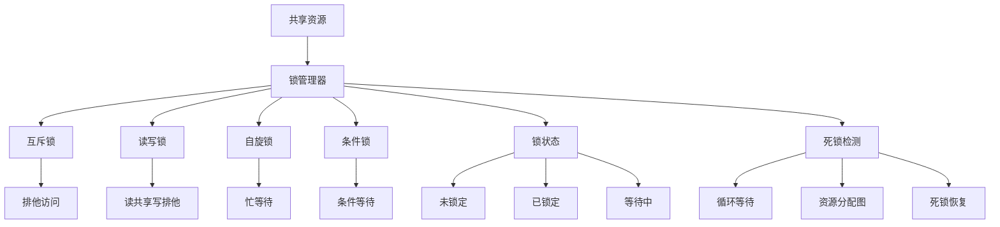

# 锁机制

## 🎯 学习目标
- 理解锁机制的基本概念和原理
- 掌握PHP中各种锁的实现方法
- 学会锁的设计模式和最佳实践
- 了解锁的性能优化和死锁预防

## 📚 核心概念

### 锁机制架构



### 锁类型对比

| 锁类型 | 特点 | 适用场景 | 优缺点 |
|--------|------|----------|--------|
| 互斥锁 | 排他访问 | 临界区保护 | 简单可靠，但可能阻塞 |
| 读写锁 | 读共享写排他 | 读多写少 | 提高并发性，但实现复杂 |
| 自旋锁 | 忙等待 | 短时间锁定 | 响应快，但消耗CPU |
| 条件锁 | 条件等待 | 复杂同步 | 灵活，但容易出错 |

## 🔧 锁机制实现

### 基础锁机制
```php
<?php
// 1. 基础互斥锁
class BasicMutex {
    private bool $locked = false;
    private array $waiting = [];
    private string $owner = '';
    
    // 获取锁
    public function lock(string $requester = ''): bool {
        if ($this->locked && $this->owner !== $requester) {
            $this->waiting[] = $requester;
            return false;
        }
        
        $this->locked = true;
        $this->owner = $requester ?: uniqid();
        return true;
    }
    
    // 释放锁
    public function unlock(string $requester = ''): bool {
        if (!$this->locked || ($requester && $this->owner !== $requester)) {
            return false;
        }
        
        $this->locked = false;
        $this->owner = '';
        
        // 通知等待的线程
        if (!empty($this->waiting)) {
            $nextRequester = array_shift($this->waiting);
            $this->lock($nextRequester);
        }
        
        return true;
    }
    
    // 尝试获取锁
    public function tryLock(string $requester = '', int $timeout = 0): bool {
        $startTime = microtime(true);
        
        while (!$this->lock($requester)) {
            if ($timeout > 0 && (microtime(true) - $startTime) * 1000 >= $timeout) {
                return false;
            }
            usleep(1000); // 1ms
        }
        
        return true;
    }
    
    // 检查锁状态
    public function isLocked(): bool {
        return $this->locked;
    }
    
    // 获取锁信息
    public function getLockInfo(): array {
        return [
            'locked' => $this->locked,
            'owner' => $this->owner,
            'waiting_count' => count($this->waiting),
            'waiting' => $this->waiting
        ];
    }
}

// 2. 读写锁
class ReadWriteLock {
    private int $readers = 0;
    private bool $writer = false;
    private array $waitingWriters = [];
    private array $waitingReaders = [];
    private string $writerOwner = '';
    
    // 获取读锁
    public function readLock(string $requester = ''): bool {
        if ($this->writer) {
            $this->waitingReaders[] = $requester ?: uniqid();
            return false;
        }
        
        $this->readers++;
        return true;
    }
    
    // 释放读锁
    public function readUnlock(): bool {
        if ($this->readers <= 0) {
            return false;
        }
        
        $this->readers--;
        
        // 如果没有读者了，唤醒等待的写者
        if ($this->readers === 0 && !empty($this->waitingWriters)) {
            $this->writer = true;
            $this->writerOwner = array_shift($this->waitingWriters);
        }
        
        return true;
    }
    
    // 获取写锁
    public function writeLock(string $requester = ''): bool {
        if ($this->writer || $this->readers > 0) {
            $this->waitingWriters[] = $requester ?: uniqid();
            return false;
        }
        
        $this->writer = true;
        $this->writerOwner = $requester ?: uniqid();
        return true;
    }
    
    // 释放写锁
    public function writeUnlock(): bool {
        if (!$this->writer) {
            return false;
        }
        
        $this->writer = false;
        $this->writerOwner = '';
        
        // 优先唤醒等待的写者，否则唤醒所有等待的读者
        if (!empty($this->waitingWriters)) {
            $this->writer = true;
            $this->writerOwner = array_shift($this->waitingWriters);
        } else {
            // 唤醒所有等待的读者
            $this->readers = count($this->waitingReaders);
            $this->waitingReaders = [];
        }
        
        return true;
    }
    
    // 尝试获取读锁
    public function tryReadLock(int $timeout = 0): bool {
        $startTime = microtime(true);
        
        while (!$this->readLock()) {
            if ($timeout > 0 && (microtime(true) - $startTime) * 1000 >= $timeout) {
                return false;
            }
            usleep(1000); // 1ms
        }
        
        return true;
    }
    
    // 尝试获取写锁
    public function tryWriteLock(int $timeout = 0): bool {
        $startTime = microtime(true);
        
        while (!$this->writeLock()) {
            if ($timeout > 0 && (microtime(true) - $startTime) * 1000 >= $timeout) {
                return false;
            }
            usleep(1000); // 1ms
        }
        
        return true;
    }
    
    // 获取锁状态
    public function getLockStatus(): array {
        return [
            'readers' => $this->readers,
            'writer' => $this->writer,
            'writer_owner' => $this->writerOwner,
            'waiting_readers' => count($this->waitingReaders),
            'waiting_writers' => count($this->waitingWriters)
        ];
    }
}

// 3. 自旋锁
class SpinLock {
    private bool $locked = false;
    private int $spinCount = 0;
    private int $maxSpins = 1000;
    
    // 获取自旋锁
    public function lock(): bool {
        $spins = 0;
        
        while ($this->locked && $spins < $this->maxSpins) {
            $spins++;
            // 自旋等待
            usleep(1); // 1微秒
        }
        
        if ($spins >= $this->maxSpins) {
            return false; // 自旋超时
        }
        
        $this->locked = true;
        $this->spinCount = $spins;
        return true;
    }
    
    // 释放自旋锁
    public function unlock(): bool {
        if (!$this->locked) {
            return false;
        }
        
        $this->locked = false;
        return true;
    }
    
    // 尝试获取自旋锁
    public function tryLock(): bool {
        if ($this->locked) {
            return false;
        }
        
        $this->locked = true;
        $this->spinCount = 0;
        return true;
    }
    
    // 获取自旋次数
    public function getSpinCount(): int {
        return $this->spinCount;
    }
    
    // 设置最大自旋次数
    public function setMaxSpins(int $maxSpins): void {
        $this->maxSpins = $maxSpins;
    }
}

// 4. 条件锁
class ConditionLock {
    private bool $locked = false;
    private array $conditions = [];
    private array $waiting = [];
    
    // 获取锁
    public function lock(): bool {
        if ($this->locked) {
            return false;
        }
        
        $this->locked = true;
        return true;
    }
    
    // 释放锁
    public function unlock(): bool {
        if (!$this->locked) {
            return false;
        }
        
        $this->locked = false;
        return true;
    }
    
    // 等待条件
    public function wait(string $condition, int $timeout = 0): bool {
        if (!$this->locked) {
            return false;
        }
        
        $this->conditions[$condition] = false;
        $this->waiting[$condition] = [];
        
        $startTime = microtime(true);
        
        while (!$this->conditions[$condition]) {
            if ($timeout > 0 && (microtime(true) - $startTime) * 1000 >= $timeout) {
                unset($this->conditions[$condition]);
                unset($this->waiting[$condition]);
                return false;
            }
            usleep(1000); // 1ms
        }
        
        unset($this->conditions[$condition]);
        unset($this->waiting[$condition]);
        return true;
    }
    
    // 通知条件
    public function notify(string $condition): bool {
        if (isset($this->conditions[$condition])) {
            $this->conditions[$condition] = true;
            return true;
        }
        return false;
    }
    
    // 通知所有等待者
    public function notifyAll(string $condition): bool {
        if (isset($this->conditions[$condition])) {
            $this->conditions[$condition] = true;
            return true;
        }
        return false;
    }
    
    // 获取条件状态
    public function getConditionStatus(): array {
        return [
            'locked' => $this->locked,
            'conditions' => $this->conditions,
            'waiting' => $this->waiting
        ];
    }
}

// 使用示例
echo "=== 基础锁机制示例 ===\n";

try {
    // 互斥锁
    $mutex = new BasicMutex();
    
    $requester1 = 'process1';
    $requester2 = 'process2';
    
    if ($mutex->lock($requester1)) {
        echo "进程1获取锁成功\n";
        
        // 模拟临界区操作
        sleep(1);
        
        $mutex->unlock($requester1);
        echo "进程1释放锁\n";
    }
    
    if ($mutex->tryLock($requester2, 5000)) {
        echo "进程2获取锁成功\n";
        $mutex->unlock($requester2);
        echo "进程2释放锁\n";
    } else {
        echo "进程2获取锁超时\n";
    }
    
    $lockInfo = $mutex->getLockInfo();
    echo "锁信息: " . json_encode($lockInfo) . "\n";
    
    // 读写锁
    $rwLock = new ReadWriteLock();
    
    if ($rwLock->readLock('reader1')) {
        echo "读者1获取读锁成功\n";
        
        if ($rwLock->readLock('reader2')) {
            echo "读者2获取读锁成功\n";
            $rwLock->readUnlock();
            echo "读者2释放读锁\n";
        }
        
        $rwLock->readUnlock();
        echo "读者1释放读锁\n";
    }
    
    if ($rwLock->writeLock('writer1')) {
        echo "写者1获取写锁成功\n";
        $rwLock->writeUnlock();
        echo "写者1释放写锁\n";
    }
    
    $rwStatus = $rwLock->getLockStatus();
    echo "读写锁状态: " . json_encode($rwStatus) . "\n";
    
    // 自旋锁
    $spinLock = new SpinLock();
    
    if ($spinLock->lock()) {
        echo "获取自旋锁成功，自旋次数: " . $spinLock->getSpinCount() . "\n";
        $spinLock->unlock();
        echo "释放自旋锁\n";
    }
    
    // 条件锁
    $conditionLock = new ConditionLock();
    
    if ($conditionLock->lock()) {
        echo "获取条件锁成功\n";
        
        // 在另一个线程中等待条件
        $conditionLock->wait('data_ready', 5000);
        echo "条件满足，继续执行\n";
        
        $conditionLock->unlock();
        echo "释放条件锁\n";
    }
    
} catch (Exception $e) {
    echo "错误: " . $e->getMessage() . "\n";
}
?>
```

### 高级锁机制
```php
<?php
// 1. 分布式锁
class DistributedLock {
    private string $lockKey;
    private string $lockValue;
    private int $expireTime;
    private array $nodes = [];
    
    public function __construct(string $lockKey, int $expireTime = 30) {
        $this->lockKey = $lockKey;
        $this->lockValue = uniqid();
        $this->expireTime = $expireTime;
    }
    
    // 添加节点
    public function addNode(string $nodeId, string $address): void {
        $this->nodes[$nodeId] = [
            'id' => $nodeId,
            'address' => $address,
            'status' => 'active'
        ];
    }
    
    // 获取分布式锁
    public function acquire(): bool {
        $acquiredNodes = 0;
        $requiredNodes = (count($this->nodes) / 2) + 1; // 多数派
        
        foreach ($this->nodes as $nodeId => $node) {
            if ($this->acquireOnNode($nodeId)) {
                $acquiredNodes++;
            }
        }
        
        if ($acquiredNodes >= $requiredNodes) {
            return true;
        } else {
            // 释放已获取的锁
            $this->release();
            return false;
        }
    }
    
    // 在单个节点上获取锁
    private function acquireOnNode(string $nodeId): bool {
        $node = $this->nodes[$nodeId];
        
        // 模拟在节点上获取锁
        $lockData = [
            'key' => $this->lockKey,
            'value' => $this->lockValue,
            'expire_time' => time() + $this->expireTime,
            'node_id' => $nodeId
        ];
        
        // 这里应该调用实际的分布式存储服务
        echo "在节点 $nodeId 上获取锁: " . json_encode($lockData) . "\n";
        
        return true; // 简化实现
    }
    
    // 释放分布式锁
    public function release(): bool {
        $releasedNodes = 0;
        
        foreach ($this->nodes as $nodeId => $node) {
            if ($this->releaseOnNode($nodeId)) {
                $releasedNodes++;
            }
        }
        
        return $releasedNodes > 0;
    }
    
    // 在单个节点上释放锁
    private function releaseOnNode(string $nodeId): bool {
        $node = $this->nodes[$nodeId];
        
        // 模拟在节点上释放锁
        echo "在节点 $nodeId 上释放锁: {$this->lockKey}\n";
        
        return true; // 简化实现
    }
    
    // 续期锁
    public function renew(): bool {
        $renewedNodes = 0;
        $requiredNodes = (count($this->nodes) / 2) + 1;
        
        foreach ($this->nodes as $nodeId => $node) {
            if ($this->renewOnNode($nodeId)) {
                $renewedNodes++;
            }
        }
        
        return $renewedNodes >= $requiredNodes;
    }
    
    // 在单个节点上续期锁
    private function renewOnNode(string $nodeId): bool {
        $node = $this->nodes[$nodeId];
        
        // 模拟在节点上续期锁
        echo "在节点 $nodeId 上续期锁: {$this->lockKey}\n";
        
        return true; // 简化实现
    }
}

// 2. 死锁检测
class DeadlockDetector {
    private array $resourceGraph = [];
    private array $waitGraph = [];
    private array $processes = [];
    
    // 添加进程
    public function addProcess(string $processId): void {
        $this->processes[$processId] = [
            'id' => $processId,
            'status' => 'running',
            'resources' => [],
            'waiting_for' => []
        ];
    }
    
    // 添加资源
    public function addResource(string $resourceId): void {
        $this->resourceGraph[$resourceId] = [
            'id' => $resourceId,
            'owner' => null,
            'waiting' => []
        ];
    }
    
    // 请求资源
    public function requestResource(string $processId, string $resourceId): bool {
        if (!isset($this->processes[$processId]) || !isset($this->resourceGraph[$resourceId])) {
            return false;
        }
        
        $resource = $this->resourceGraph[$resourceId];
        
        if ($resource['owner'] === null) {
            // 资源可用，直接分配
            $resource['owner'] = $processId;
            $this->processes[$processId]['resources'][] = $resourceId;
            $this->resourceGraph[$resourceId] = $resource;
            
            echo "进程 $processId 获取资源 $resourceId\n";
            return true;
        } elseif ($resource['owner'] === $processId) {
            // 进程已经拥有该资源
            return true;
        } else {
            // 资源被其他进程占用，加入等待队列
            $resource['waiting'][] = $processId;
            $this->processes[$processId]['waiting_for'][] = $resourceId;
            $this->resourceGraph[$resourceId] = $resource;
            
            echo "进程 $processId 等待资源 $resourceId (被进程 {$resource['owner']} 占用)\n";
            
            // 检测死锁
            if ($this->detectDeadlock()) {
                echo "检测到死锁！\n";
                return false;
            }
            
            return false;
        }
    }
    
    // 释放资源
    public function releaseResource(string $processId, string $resourceId): bool {
        if (!isset($this->processes[$processId]) || !isset($this->resourceGraph[$resourceId])) {
            return false;
        }
        
        $resource = $this->resourceGraph[$resourceId];
        
        if ($resource['owner'] !== $processId) {
            return false;
        }
        
        // 释放资源
        $resource['owner'] = null;
        
        // 从进程资源列表中移除
        $this->processes[$processId]['resources'] = array_filter(
            $this->processes[$processId]['resources'],
            function($id) use ($resourceId) {
                return $id !== $resourceId;
            }
        );
        
        // 从进程等待列表中移除
        $this->processes[$processId]['waiting_for'] = array_filter(
            $this->processes[$processId]['waiting_for'],
            function($id) use ($resourceId) {
                return $id !== $resourceId;
            }
        );
        
        // 分配资源给等待的进程
        if (!empty($resource['waiting'])) {
            $nextProcess = array_shift($resource['waiting']);
            $resource['owner'] = $nextProcess;
            $this->processes[$nextProcess]['resources'][] = $resourceId;
            
            // 从等待列表中移除
            $this->processes[$nextProcess]['waiting_for'] = array_filter(
                $this->processes[$nextProcess]['waiting_for'],
                function($id) use ($resourceId) {
                    return $id !== $resourceId;
                }
            );
            
            echo "进程 $nextProcess 获取资源 $resourceId\n";
        }
        
        $this->resourceGraph[$resourceId] = $resource;
        echo "进程 $processId 释放资源 $resourceId\n";
        
        return true;
    }
    
    // 检测死锁
    public function detectDeadlock(): bool {
        // 构建等待图
        $this->buildWaitGraph();
        
        // 使用DFS检测环
        foreach ($this->processes as $processId => $process) {
            if ($this->hasCycle($processId, [])) {
                return true;
            }
        }
        
        return false;
    }
    
    // 构建等待图
    private function buildWaitGraph(): void {
        $this->waitGraph = [];
        
        foreach ($this->processes as $processId => $process) {
            $this->waitGraph[$processId] = [];
            
            foreach ($process['waiting_for'] as $resourceId) {
                $resource = $this->resourceGraph[$resourceId];
                if ($resource['owner']) {
                    $this->waitGraph[$processId][] = $resource['owner'];
                }
            }
        }
    }
    
    // 检测环
    private function hasCycle(string $processId, array $visited): bool {
        if (in_array($processId, $visited)) {
            return true; // 发现环
        }
        
        $visited[] = $processId;
        
        if (isset($this->waitGraph[$processId])) {
            foreach ($this->waitGraph[$processId] as $nextProcess) {
                if ($this->hasCycle($nextProcess, $visited)) {
                    return true;
                }
            }
        }
        
        return false;
    }
    
    // 获取系统状态
    public function getSystemStatus(): array {
        return [
            'processes' => $this->processes,
            'resources' => $this->resourceGraph,
            'wait_graph' => $this->waitGraph,
            'deadlock_detected' => $this->detectDeadlock()
        ];
    }
}

// 3. 锁性能监控
class LockPerformanceMonitor {
    private array $metrics = [];
    private array $locks = [];
    
    // 注册锁
    public function registerLock(string $lockId, string $type): void {
        $this->locks[$lockId] = [
            'id' => $lockId,
            'type' => $type,
            'acquire_count' => 0,
            'release_count' => 0,
            'wait_time' => 0,
            'hold_time' => 0,
            'contention_count' => 0,
            'created_at' => time()
        ];
    }
    
    // 记录锁获取
    public function recordAcquire(string $lockId, float $waitTime = 0): void {
        if (!isset($this->locks[$lockId])) {
            return;
        }
        
        $this->locks[$lockId]['acquire_count']++;
        $this->locks[$lockId]['wait_time'] += $waitTime;
        
        if ($waitTime > 0) {
            $this->locks[$lockId]['contention_count']++;
        }
    }
    
    // 记录锁释放
    public function recordRelease(string $lockId, float $holdTime = 0): void {
        if (!isset($this->locks[$lockId])) {
            return;
        }
        
        $this->locks[$lockId]['release_count']++;
        $this->locks[$lockId]['hold_time'] += $holdTime;
    }
    
    // 获取锁性能指标
    public function getLockMetrics(string $lockId): ?array {
        if (!isset($this->locks[$lockId])) {
            return null;
        }
        
        $lock = $this->locks[$lockId];
        
        return [
            'id' => $lockId,
            'type' => $lock['type'],
            'acquire_count' => $lock['acquire_count'],
            'release_count' => $lock['release_count'],
            'average_wait_time' => $lock['acquire_count'] > 0 ? $lock['wait_time'] / $lock['acquire_count'] : 0,
            'average_hold_time' => $lock['release_count'] > 0 ? $lock['hold_time'] / $lock['release_count'] : 0,
            'contention_rate' => $lock['acquire_count'] > 0 ? $lock['contention_count'] / $lock['acquire_count'] : 0,
            'utilization_rate' => $lock['acquire_count'] > 0 ? $lock['hold_time'] / ($lock['acquire_count'] * 1000) : 0
        ];
    }
    
    // 获取所有锁性能指标
    public function getAllLockMetrics(): array {
        $metrics = [];
        
        foreach ($this->locks as $lockId => $lock) {
            $metrics[$lockId] = $this->getLockMetrics($lockId);
        }
        
        return $metrics;
    }
    
    // 获取性能报告
    public function getPerformanceReport(): array {
        $metrics = $this->getAllLockMetrics();
        
        $totalAcquires = array_sum(array_column($metrics, 'acquire_count'));
        $totalContention = array_sum(array_column($metrics, 'contention_count'));
        $averageWaitTime = array_sum(array_column($metrics, 'average_wait_time')) / count($metrics);
        $averageHoldTime = array_sum(array_column($metrics, 'average_hold_time')) / count($metrics);
        
        return [
            'total_locks' => count($metrics),
            'total_acquires' => $totalAcquires,
            'total_contention' => $totalContention,
            'overall_contention_rate' => $totalAcquires > 0 ? $totalContention / $totalAcquires : 0,
            'average_wait_time' => $averageWaitTime,
            'average_hold_time' => $averageHoldTime,
            'top_contended_locks' => $this->getTopContendedLocks($metrics, 5)
        ];
    }
    
    // 获取竞争最激烈的锁
    private function getTopContendedLocks(array $metrics, int $limit): array {
        usort($metrics, function($a, $b) {
            return $b['contention_rate'] <=> $a['contention_rate'];
        });
        
        return array_slice($metrics, 0, $limit);
    }
}

// 使用示例
echo "=== 高级锁机制示例 ===\n";

try {
    // 分布式锁
    $distributedLock = new DistributedLock('user:123:lock', 30);
    
    $distributedLock->addNode('node1', '192.168.1.1:6379');
    $distributedLock->addNode('node2', '192.168.1.2:6379');
    $distributedLock->addNode('node3', '192.168.1.3:6379');
    
    if ($distributedLock->acquire()) {
        echo "获取分布式锁成功\n";
        
        // 模拟业务操作
        sleep(2);
        
        $distributedLock->release();
        echo "释放分布式锁\n";
    } else {
        echo "获取分布式锁失败\n";
    }
    
    // 死锁检测
    $deadlockDetector = new DeadlockDetector();
    
    $deadlockDetector->addProcess('P1');
    $deadlockDetector->addProcess('P2');
    $deadlockDetector->addResource('R1');
    $deadlockDetector->addResource('R2');
    
    // 模拟死锁场景
    $deadlockDetector->requestResource('P1', 'R1');
    $deadlockDetector->requestResource('P2', 'R2');
    $deadlockDetector->requestResource('P1', 'R2'); // P1等待R2
    $deadlockDetector->requestResource('P2', 'R1'); // P2等待R1，形成死锁
    
    $systemStatus = $deadlockDetector->getSystemStatus();
    echo "系统状态: " . json_encode($systemStatus) . "\n";
    
    // 锁性能监控
    $performanceMonitor = new LockPerformanceMonitor();
    
    $performanceMonitor->registerLock('user_lock', 'mutex');
    $performanceMonitor->registerLock('data_lock', 'rwlock');
    
    // 模拟锁操作
    $performanceMonitor->recordAcquire('user_lock', 10.5);
    $performanceMonitor->recordRelease('user_lock', 100.0);
    
    $performanceMonitor->recordAcquire('data_lock', 5.2);
    $performanceMonitor->recordRelease('data_lock', 50.0);
    
    $metrics = $performanceMonitor->getAllLockMetrics();
    echo "锁性能指标: " . json_encode($metrics) . "\n";
    
    $report = $performanceMonitor->getPerformanceReport();
    echo "性能报告: " . json_encode($report) . "\n";
    
} catch (Exception $e) {
    echo "错误: " . $e->getMessage() . "\n";
}
?>
```

## 📊 最佳实践

### 锁机制最佳实践
```php
<?php
// 锁机制最佳实践

class LockBestPractices {
    // 1. 锁设计原则
    public static function getLockDesignPrinciples() {
        return [
            '锁粒度控制' => [
                '细粒度锁' => '使用细粒度锁减少竞争',
                '锁范围' => '缩小锁的保护范围',
                '锁时间' => '缩短锁的持有时间',
                '锁顺序' => '统一锁的获取顺序'
            ],
            '死锁预防' => [
                '资源排序' => '按固定顺序获取资源',
                '超时机制' => '设置锁获取超时',
                '死锁检测' => '实现死锁检测机制',
                '资源预分配' => '预先分配所需资源'
            ],
            '性能优化' => [
                '锁类型选择' => '选择合适的锁类型',
                '无锁编程' => '考虑无锁编程方案',
                '锁分离' => '分离读写操作',
                '批量操作' => '使用批量操作减少锁竞争'
            ]
        ];
    }
    
    // 2. 锁使用最佳实践
    public static function getLockUsageBestPractices() {
        return [
            '锁获取' => [
                '超时设置' => '设置合理的获取超时时间',
                '重试机制' => '实现锁获取重试机制',
                '优先级' => '考虑锁获取优先级',
                '公平性' => '实现公平的锁获取策略'
            ],
            '锁释放' => [
                '及时释放' => '及时释放不再需要的锁',
                '异常处理' => '在异常情况下正确释放锁',
                '资源清理' => '清理锁相关的资源',
                '状态检查' => '检查锁释放后的状态'
            ],
            '锁监控' => [
                '性能监控' => '监控锁的性能指标',
                '死锁监控' => '监控死锁情况',
                '竞争监控' => '监控锁竞争情况',
                '使用统计' => '统计锁的使用情况'
            ]
        ];
    }
    
    // 3. 分布式锁最佳实践
    public static function getDistributedLockBestPractices() {
        return [
            '一致性保证' => [
                '多数派' => '使用多数派协议保证一致性',
                '版本控制' => '使用版本号防止ABA问题',
                '原子操作' => '使用原子操作更新锁状态',
                '事务支持' => '在事务中操作锁'
            ],
            '可用性保证' => [
                '故障转移' => '实现故障转移机制',
                '健康检查' => '定期检查节点健康状态',
                '自动恢复' => '实现自动恢复机制',
                '降级策略' => '实现降级策略'
            ],
            '性能优化' => [
                '本地缓存' => '使用本地缓存减少网络开销',
                '批量操作' => '使用批量操作提高效率',
                '连接池' => '使用连接池管理连接',
                '异步操作' => '使用异步操作提高并发性'
            ]
        ];
    }
    
    // 4. 锁调试最佳实践
    public static function getLockDebuggingBestPractices() {
        return [
            '日志记录' => [
                '锁操作日志' => '记录所有锁操作',
                '性能日志' => '记录锁性能数据',
                '错误日志' => '记录锁相关错误',
                '死锁日志' => '记录死锁检测信息'
            ],
            '调试工具' => [
                '锁分析器' => '使用锁分析工具',
                '性能分析器' => '使用性能分析工具',
                '死锁检测器' => '使用死锁检测工具',
                '监控仪表板' => '使用监控仪表板'
            ],
            '测试策略' => [
                '单元测试' => '编写锁单元测试',
                '并发测试' => '进行并发测试',
                '压力测试' => '进行压力测试',
                '死锁测试' => '测试死锁场景'
            ]
        ];
    }
}

// 使用示例
echo "=== 锁机制最佳实践示例 ===\n";

try {
    $designPrinciples = LockBestPractices::getLockDesignPrinciples();
    echo "锁设计原则:\n";
    foreach ($designPrinciples as $category => $principles) {
        echo "  $category:\n";
        foreach ($principles as $principle => $description) {
            echo "    - $principle: $description\n";
        }
        echo "\n";
    }
    
    $usageBestPractices = LockBestPractices::getLockUsageBestPractices();
    echo "锁使用最佳实践:\n";
    foreach ($usageBestPractices as $category => $practices) {
        echo "  $category:\n";
        foreach ($practices as $practice => $description) {
            echo "    - $practice: $description\n";
        }
        echo "\n";
    }
    
} catch (Exception $e) {
    echo "错误: " . $e->getMessage() . "\n";
}
?>
```

## 🎓 学习建议

### 费曼学习法应用
1. **选择概念**: 选择锁机制中的核心概念
2. **简化解释**: 用简单语言解释锁机制的重要性
3. **识别盲点**: 发现理解不深入的地方
4. **重新学习**: 针对盲点进行深入学习

### 刻意练习重点
1. **锁基础**: 掌握各种锁的基本用法
2. **死锁预防**: 学会预防和检测死锁
3. **性能优化**: 理解锁的性能优化方法
4. **分布式锁**: 掌握分布式锁的实现和使用

## 🔗 相关链接
- [[01-多进程编程|多进程编程]]
- [[02-异步编程|异步编程]]
- [[03-消息队列|消息队列]]
- [[04-协程编程|协程编程]]
- [[06-并发安全|并发安全]]
- [[07-并发性能优化|并发性能优化]]
