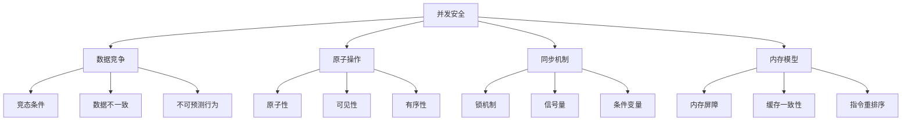

# 并发安全

## 🎯 学习目标
- 理解并发安全的基本概念和原理
- 掌握PHP并发安全的实现方法
- 学会并发安全的设计模式和最佳实践
- 了解并发安全的测试和验证方法

## 📚 核心概念

### 并发安全架构



### 并发安全问题类型

| 问题类型 | 描述 | 影响 | 解决方案 |
|----------|------|------|----------|
| 竞态条件 | 多个线程同时访问共享资源 | 数据不一致 | 同步机制 |
| 死锁 | 多个线程相互等待 | 程序阻塞 | 死锁预防 |
| 活锁 | 线程不断重试但无法前进 | 资源浪费 | 随机化策略 |
| 饥饿 | 某些线程无法获得资源 | 不公平 | 公平调度 |

## 🔧 并发安全实现

### 基础并发安全
```php
<?php
// 1. 原子操作
class AtomicOperations {
    private array $atomics = [];
    
    // 原子整数
    class AtomicInteger {
        private int $value;
        private array $locks = [];
        
        public function __construct(int $initialValue = 0) {
            $this->value = $initialValue;
        }
        
        // 原子递增
        public function increment(): int {
            $this->lock();
            $this->value++;
            $result = $this->value;
            $this->unlock();
            return $result;
        }
        
        // 原子递减
        public function decrement(): int {
            $this->lock();
            $this->value--;
            $result = $this->value;
            $this->unlock();
            return $result;
        }
        
        // 原子加法
        public function add(int $delta): int {
            $this->lock();
            $this->value += $delta;
            $result = $this->value;
            $this->unlock();
            return $result;
        }
        
        // 原子比较交换
        public function compareAndSet(int $expected, int $newValue): bool {
            $this->lock();
            if ($this->value === $expected) {
                $this->value = $newValue;
                $this->unlock();
                return true;
            }
            $this->unlock();
            return false;
        }
        
        // 获取值
        public function get(): int {
            $this->lock();
            $value = $this->value;
            $this->unlock();
            return $value;
        }
        
        // 设置值
        public function set(int $value): void {
            $this->lock();
            $this->value = $value;
            $this->unlock();
        }
        
        private function lock(): void {
            $pid = getmypid();
            while (isset($this->locks[$pid])) {
                usleep(1);
            }
            $this->locks[$pid] = true;
        }
        
        private function unlock(): void {
            $pid = getmypid();
            unset($this->locks[$pid]);
        }
    }
    
    // 原子布尔值
    class AtomicBoolean {
        private bool $value;
        private array $locks = [];
        
        public function __construct(bool $initialValue = false) {
            $this->value = $initialValue;
        }
        
        // 原子设置
        public function set(bool $value): void {
            $this->lock();
            $this->value = $value;
            $this->unlock();
        }
        
        // 原子获取
        public function get(): bool {
            $this->lock();
            $value = $this->value;
            $this->unlock();
            return $value;
        }
        
        // 原子比较交换
        public function compareAndSet(bool $expected, bool $newValue): bool {
            $this->lock();
            if ($this->value === $expected) {
                $this->value = $newValue;
                $this->unlock();
                return true;
            }
            $this->unlock();
            return false;
        }
        
        private function lock(): void {
            $pid = getmypid();
            while (isset($this->locks[$pid])) {
                usleep(1);
            }
            $this->locks[$pid] = true;
        }
        
        private function unlock(): void {
            $pid = getmypid();
            unset($this->locks[$pid]);
        }
    }
    
    // 创建原子整数
    public function createAtomicInteger(string $name, int $initialValue = 0): AtomicInteger {
        $atomic = new AtomicInteger($initialValue);
        $this->atomics[$name] = $atomic;
        return $atomic;
    }
    
    // 创建原子布尔值
    public function createAtomicBoolean(string $name, bool $initialValue = false): AtomicBoolean {
        $atomic = new AtomicBoolean($initialValue);
        $this->atomics[$name] = $atomic;
        return $atomic;
    }
    
    // 获取原子操作对象
    public function getAtomic(string $name): mixed {
        return $this->atomics[$name] ?? null;
    }
}

// 2. 线程安全集合
class ThreadSafeCollections {
    private array $collections = [];
    
    // 线程安全数组
    class ThreadSafeArray {
        private array $data = [];
        private array $locks = [];
        
        // 添加元素
        public function add(mixed $value): void {
            $this->lock();
            $this->data[] = $value;
            $this->unlock();
        }
        
        // 获取元素
        public function get(int $index): mixed {
            $this->lock();
            $value = $this->data[$index] ?? null;
            $this->unlock();
            return $value;
        }
        
        // 设置元素
        public function set(int $index, mixed $value): void {
            $this->lock();
            $this->data[$index] = $value;
            $this->unlock();
        }
        
        // 删除元素
        public function remove(int $index): mixed {
            $this->lock();
            $value = $this->data[$index] ?? null;
            unset($this->data[$index]);
            $this->data = array_values($this->data); // 重新索引
            $this->unlock();
            return $value;
        }
        
        // 获取大小
        public function size(): int {
            $this->lock();
            $size = count($this->data);
            $this->unlock();
            return $size;
        }
        
        // 获取所有数据
        public function getAll(): array {
            $this->lock();
            $data = $this->data;
            $this->unlock();
            return $data;
        }
        
        private function lock(): void {
            $pid = getmypid();
            while (isset($this->locks[$pid])) {
                usleep(1);
            }
            $this->locks[$pid] = true;
        }
        
        private function unlock(): void {
            $pid = getmypid();
            unset($this->locks[$pid]);
        }
    }
    
    // 线程安全映射
    class ThreadSafeMap {
        private array $data = [];
        private array $locks = [];
        
        // 添加键值对
        public function put(string $key, mixed $value): void {
            $this->lock();
            $this->data[$key] = $value;
            $this->unlock();
        }
        
        // 获取值
        public function get(string $key): mixed {
            $this->lock();
            $value = $this->data[$key] ?? null;
            $this->unlock();
            return $value;
        }
        
        // 删除键值对
        public function remove(string $key): mixed {
            $this->lock();
            $value = $this->data[$key] ?? null;
            unset($this->data[$key]);
            $this->unlock();
            return $value;
        }
        
        // 检查键是否存在
        public function containsKey(string $key): bool {
            $this->lock();
            $exists = isset($this->data[$key]);
            $this->unlock();
            return $exists;
        }
        
        // 获取所有键
        public function keys(): array {
            $this->lock();
            $keys = array_keys($this->data);
            $this->unlock();
            return $keys;
        }
        
        // 获取所有值
        public function values(): array {
            $this->lock();
            $values = array_values($this->data);
            $this->unlock();
            return $values;
        }
        
        // 获取大小
        public function size(): int {
            $this->lock();
            $size = count($this->data);
            $this->unlock();
            return $size;
        }
        
        private function lock(): void {
            $pid = getmypid();
            while (isset($this->locks[$pid])) {
                usleep(1);
            }
            $this->locks[$pid] = true;
        }
        
        private function unlock(): void {
            $pid = getmypid();
            unset($this->locks[$pid]);
        }
    }
    
    // 创建线程安全数组
    public function createThreadSafeArray(string $name): ThreadSafeArray {
        $array = new ThreadSafeArray();
        $this->collections[$name] = $array;
        return $array;
    }
    
    // 创建线程安全映射
    public function createThreadSafeMap(string $name): ThreadSafeMap {
        $map = new ThreadSafeMap();
        $this->collections[$name] = $map;
        return $map;
    }
    
    // 获取集合
    public function getCollection(string $name): mixed {
        return $this->collections[$name] ?? null;
    }
}

// 3. 并发安全计数器
class ConcurrentSafeCounter {
    private AtomicOperations $atomics;
    private array $counters = [];
    
    public function __construct() {
        $this->atomics = new AtomicOperations();
    }
    
    // 创建计数器
    public function createCounter(string $name, int $initialValue = 0): void {
        $this->counters[$name] = $this->atomics->createAtomicInteger($name, $initialValue);
    }
    
    // 递增计数器
    public function increment(string $name): int {
        if (!isset($this->counters[$name])) {
            throw new Exception("计数器不存在: $name");
        }
        
        return $this->counters[$name]->increment();
    }
    
    // 递减计数器
    public function decrement(string $name): int {
        if (!isset($this->counters[$name])) {
            throw new Exception("计数器不存在: $name");
        }
        
        return $this->counters[$name]->decrement();
    }
    
    // 获取计数器值
    public function getValue(string $name): int {
        if (!isset($this->counters[$name])) {
            throw new Exception("计数器不存在: $name");
        }
        
        return $this->counters[$name]->get();
    }
    
    // 设置计数器值
    public function setValue(string $name, int $value): void {
        if (!isset($this->counters[$name])) {
            throw new Exception("计数器不存在: $name");
        }
        
        $this->counters[$name]->set($value);
    }
    
    // 重置计数器
    public function reset(string $name): void {
        $this->setValue($name, 0);
    }
    
    // 获取所有计数器
    public function getAllCounters(): array {
        $result = [];
        foreach ($this->counters as $name => $counter) {
            $result[$name] = $counter->get();
        }
        return $result;
    }
}

// 使用示例
echo "=== 基础并发安全示例 ===\n";

try {
    // 原子操作
    $atomics = new AtomicOperations();
    
    $atomicInt = $atomics->createAtomicInteger('counter', 0);
    $atomicBool = $atomics->createAtomicBoolean('flag', false);
    
    echo "原子整数初始值: " . $atomicInt->get() . "\n";
    echo "原子递增: " . $atomicInt->increment() . "\n";
    echo "原子加法: " . $atomicInt->add(5) . "\n";
    echo "原子比较交换: " . ($atomicInt->compareAndSet(6, 10) ? '成功' : '失败') . "\n";
    echo "原子整数最终值: " . $atomicInt->get() . "\n";
    
    echo "原子布尔值: " . ($atomicBool->get() ? 'true' : 'false') . "\n";
    $atomicBool->set(true);
    echo "设置后: " . ($atomicBool->get() ? 'true' : 'false') . "\n";
    
    // 线程安全集合
    $collections = new ThreadSafeCollections();
    
    $safeArray = $collections->createThreadSafeArray('test_array');
    $safeMap = $collections->createThreadSafeMap('test_map');
    
    $safeArray->add('item1');
    $safeArray->add('item2');
    $safeArray->add('item3');
    
    echo "线程安全数组大小: " . $safeArray->size() . "\n";
    echo "数组内容: " . json_encode($safeArray->getAll()) . "\n";
    
    $safeMap->put('key1', 'value1');
    $safeMap->put('key2', 'value2');
    $safeMap->put('key3', 'value3');
    
    echo "线程安全映射大小: " . $safeMap->size() . "\n";
    echo "映射内容: " . json_encode($safeMap->getAll()) . "\n";
    
    // 并发安全计数器
    $counter = new ConcurrentSafeCounter();
    
    $counter->createCounter('page_views', 0);
    $counter->createCounter('user_sessions', 0);
    
    $counter->increment('page_views');
    $counter->increment('page_views');
    $counter->increment('user_sessions');
    
    echo "页面访问计数: " . $counter->getValue('page_views') . "\n";
    echo "用户会话计数: " . $counter->getValue('user_sessions') . "\n";
    
    $allCounters = $counter->getAllCounters();
    echo "所有计数器: " . json_encode($allCounters) . "\n";
    
} catch (Exception $e) {
    echo "错误: " . $e->getMessage() . "\n";
}
?>
```

### 高级并发安全
```php
<?php
// 1. 无锁编程
class LockFreeProgramming {
    private array $lockFreeStructures = [];
    
    // 无锁栈
    class LockFreeStack {
        private array $stack = [];
        private int $top = -1;
        
        // 无锁推送
        public function push(mixed $value): void {
            $this->stack[++$this->top] = $value;
        }
        
        // 无锁弹出
        public function pop(): mixed {
            if ($this->top < 0) {
                return null;
            }
            
            $value = $this->stack[$this->top];
            unset($this->stack[$this->top]);
            $this->top--;
            return $value;
        }
        
        // 检查是否为空
        public function isEmpty(): bool {
            return $this->top < 0;
        }
        
        // 获取大小
        public function size(): int {
            return $this->top + 1;
        }
    }
    
    // 无锁队列
    class LockFreeQueue {
        private array $queue = [];
        private int $head = 0;
        private int $tail = 0;
        private int $capacity;
        
        public function __construct(int $capacity = 1000) {
            $this->capacity = $capacity;
        }
        
        // 无锁入队
        public function enqueue(mixed $value): bool {
            if ($this->isFull()) {
                return false;
            }
            
            $this->queue[$this->tail] = $value;
            $this->tail = ($this->tail + 1) % $this->capacity;
            return true;
        }
        
        // 无锁出队
        public function dequeue(): mixed {
            if ($this->isEmpty()) {
                return null;
            }
            
            $value = $this->queue[$this->head];
            unset($this->queue[$this->head]);
            $this->head = ($this->head + 1) % $this->capacity;
            return $value;
        }
        
        // 检查是否为空
        public function isEmpty(): bool {
            return $this->head === $this->tail;
        }
        
        // 检查是否已满
        public function isFull(): bool {
            return ($this->tail + 1) % $this->capacity === $this->head;
        }
        
        // 获取大小
        public function size(): int {
            return ($this->tail - $this->head + $this->capacity) % $this->capacity;
        }
    }
    
    // 创建无锁栈
    public function createLockFreeStack(string $name): LockFreeStack {
        $stack = new LockFreeStack();
        $this->lockFreeStructures[$name] = $stack;
        return $stack;
    }
    
    // 创建无锁队列
    public function createLockFreeQueue(string $name, int $capacity = 1000): LockFreeQueue {
        $queue = new LockFreeQueue($capacity);
        $this->lockFreeStructures[$name] = $queue;
        return $queue;
    }
    
    // 获取无锁结构
    public function getLockFreeStructure(string $name): mixed {
        return $this->lockFreeStructures[$name] ?? null;
    }
}

// 2. 内存屏障
class MemoryBarrier {
    private array $barriers = [];
    
    // 创建内存屏障
    public function createBarrier(string $name): void {
        $this->barriers[$name] = [
            'name' => $name,
            'created_at' => time(),
            'status' => 'active'
        ];
    }
    
    // 内存屏障操作
    public function memoryBarrier(string $name): void {
        if (!isset($this->barriers[$name])) {
            return;
        }
        
        // 模拟内存屏障操作
        // 在实际实现中，这里会使用CPU指令来确保内存操作的顺序
        echo "执行内存屏障: $name\n";
    }
    
    // 获取屏障状态
    public function getBarrierStatus(string $name): ?array {
        return $this->barriers[$name] ?? null;
    }
    
    // 获取所有屏障
    public function getAllBarriers(): array {
        return $this->barriers;
    }
}

// 3. 并发安全测试
class ConcurrentSafetyTest {
    private array $testResults = [];
    
    // 竞态条件测试
    public function testRaceCondition(int $threadCount = 10, int $iterations = 1000): array {
        $counter = new AtomicOperations();
        $atomicInt = $counter->createAtomicInteger('test_counter', 0);
        
        $startTime = microtime(true);
        
        // 模拟多线程并发操作
        for ($i = 0; $i < $threadCount; $i++) {
            for ($j = 0; $j < $iterations; $j++) {
                $atomicInt->increment();
            }
        }
        
        $endTime = microtime(true);
        $executionTime = $endTime - $startTime;
        
        $expectedValue = $threadCount * $iterations;
        $actualValue = $atomicInt->get();
        
        $result = [
            'test_name' => 'race_condition_test',
            'thread_count' => $threadCount,
            'iterations' => $iterations,
            'expected_value' => $expectedValue,
            'actual_value' => $actualValue,
            'execution_time' => $executionTime,
            'success' => $expectedValue === $actualValue,
            'error_rate' => $expectedValue > 0 ? abs($expectedValue - $actualValue) / $expectedValue : 0
        ];
        
        $this->testResults[] = $result;
        return $result;
    }
    
    // 死锁测试
    public function testDeadlock(): array {
        $mutex1 = new BasicMutex();
        $mutex2 = new BasicMutex();
        
        $startTime = microtime(true);
        $deadlockDetected = false;
        
        try {
            // 模拟死锁场景
            $mutex1->lock('thread1');
            $mutex2->lock('thread2');
            
            // 尝试获取对方持有的锁
            if (!$mutex2->tryLock('thread1', 1000)) {
                $deadlockDetected = true;
            }
            
            if (!$mutex1->tryLock('thread2', 1000)) {
                $deadlockDetected = true;
            }
            
        } catch (Exception $e) {
            $deadlockDetected = true;
        }
        
        $endTime = microtime(true);
        $executionTime = $endTime - $startTime;
        
        $result = [
            'test_name' => 'deadlock_test',
            'deadlock_detected' => $deadlockDetected,
            'execution_time' => $executionTime,
            'success' => $deadlockDetected
        ];
        
        $this->testResults[] = $result;
        return $result;
    }
    
    // 性能测试
    public function testPerformance(int $operations = 10000): array {
        $startTime = microtime(true);
        
        // 测试原子操作性能
        $atomics = new AtomicOperations();
        $atomicInt = $atomics->createAtomicInteger('perf_test', 0);
        
        for ($i = 0; $i < $operations; $i++) {
            $atomicInt->increment();
        }
        
        $endTime = microtime(true);
        $executionTime = $endTime - $startTime;
        $operationsPerSecond = $operations / $executionTime;
        
        $result = [
            'test_name' => 'performance_test',
            'operations' => $operations,
            'execution_time' => $executionTime,
            'operations_per_second' => $operationsPerSecond,
            'success' => true
        ];
        
        $this->testResults[] = $result;
        return $result;
    }
    
    // 获取所有测试结果
    public function getAllTestResults(): array {
        return $this->testResults;
    }
    
    // 生成测试报告
    public function generateTestReport(): array {
        $totalTests = count($this->testResults);
        $successfulTests = count(array_filter($this->testResults, function($result) {
            return $result['success'];
        }));
        
        $averageExecutionTime = array_sum(array_column($this->testResults, 'execution_time')) / $totalTests;
        
        return [
            'total_tests' => $totalTests,
            'successful_tests' => $successfulTests,
            'failed_tests' => $totalTests - $successfulTests,
            'success_rate' => $totalTests > 0 ? $successfulTests / $totalTests : 0,
            'average_execution_time' => $averageExecutionTime,
            'test_results' => $this->testResults
        ];
    }
}

// 使用示例
echo "=== 高级并发安全示例 ===\n";

try {
    // 无锁编程
    $lockFree = new LockFreeProgramming();
    
    $stack = $lockFree->createLockFreeStack('test_stack');
    $queue = $lockFree->createLockFreeQueue('test_queue', 100);
    
    // 测试栈
    $stack->push('item1');
    $stack->push('item2');
    $stack->push('item3');
    
    echo "栈大小: " . $stack->size() . "\n";
    echo "弹出: " . $stack->pop() . "\n";
    echo "弹出: " . $stack->pop() . "\n";
    echo "栈大小: " . $stack->size() . "\n";
    
    // 测试队列
    $queue->enqueue('task1');
    $queue->enqueue('task2');
    $queue->enqueue('task3');
    
    echo "队列大小: " . $queue->size() . "\n";
    echo "出队: " . $queue->dequeue() . "\n";
    echo "出队: " . $queue->dequeue() . "\n";
    echo "队列大小: " . $queue->size() . "\n";
    
    // 内存屏障
    $memoryBarrier = new MemoryBarrier();
    
    $memoryBarrier->createBarrier('test_barrier');
    $memoryBarrier->memoryBarrier('test_barrier');
    
    $barrierStatus = $memoryBarrier->getBarrierStatus('test_barrier');
    echo "内存屏障状态: " . json_encode($barrierStatus) . "\n";
    
    // 并发安全测试
    $safetyTest = new ConcurrentSafetyTest();
    
    $raceConditionResult = $safetyTest->testRaceCondition(5, 1000);
    echo "竞态条件测试: " . json_encode($raceConditionResult) . "\n";
    
    $deadlockResult = $safetyTest->testDeadlock();
    echo "死锁测试: " . json_encode($deadlockResult) . "\n";
    
    $performanceResult = $safetyTest->testPerformance(10000);
    echo "性能测试: " . json_encode($performanceResult) . "\n";
    
    $testReport = $safetyTest->generateTestReport();
    echo "测试报告: " . json_encode($testReport) . "\n";
    
} catch (Exception $e) {
    echo "错误: " . $e->getMessage() . "\n";
}
?>
```

## 📊 最佳实践

### 并发安全最佳实践
```php
<?php
// 并发安全最佳实践

class ConcurrentSafetyBestPractices {
    // 1. 并发安全设计原则
    public static function getConcurrentSafetyDesignPrinciples() {
        return [
            '数据隔离' => [
                '线程本地存储' => '使用线程本地存储避免共享数据',
                '不可变对象' => '优先使用不可变对象',
                '数据复制' => '通过数据复制避免共享',
                '函数式编程' => '采用函数式编程范式'
            ],
            '同步机制' => [
                '最小锁范围' => '缩小锁的保护范围',
                '锁顺序' => '统一锁的获取顺序',
                '超时机制' => '设置锁获取超时',
                '死锁检测' => '实现死锁检测机制'
            ],
            '原子操作' => [
                '原子类型' => '使用原子类型替代锁',
                'CAS操作' => '使用比较交换操作',
                '无锁编程' => '考虑无锁编程方案',
                '内存模型' => '理解内存模型和可见性'
            ]
        ];
    }
    
    // 2. 并发安全编程实践
    public static function getConcurrentSafetyProgrammingPractices() {
        return [
            '代码设计' => [
                '单一职责' => '每个函数只做一件事',
                '无副作用' => '避免函数副作用',
                '纯函数' => '编写纯函数',
                '状态管理' => '明确状态管理策略'
            ],
            '错误处理' => [
                '异常安全' => '确保异常安全',
                '资源清理' => '正确清理资源',
                '错误传播' => '正确处理错误传播',
                '恢复机制' => '实现错误恢复机制'
            ],
            '性能优化' => [
                '减少竞争' => '减少锁竞争',
                '批量操作' => '使用批量操作',
                '缓存策略' => '实现合理的缓存策略',
                '内存管理' => '优化内存使用'
            ]
        ];
    }
    
    // 3. 并发安全测试实践
    public static function getConcurrentSafetyTestingPractices() {
        return [
            '测试策略' => [
                '单元测试' => '编写并发单元测试',
                '集成测试' => '进行并发集成测试',
                '压力测试' => '进行压力测试',
                '长时间测试' => '进行长时间运行测试'
            ],
            '测试工具' => [
                '并发测试框架' => '使用并发测试框架',
                '性能分析工具' => '使用性能分析工具',
                '死锁检测工具' => '使用死锁检测工具',
                '内存分析工具' => '使用内存分析工具'
            ],
            '测试场景' => [
                '竞态条件' => '测试竞态条件',
                '死锁场景' => '测试死锁场景',
                '资源竞争' => '测试资源竞争',
                '边界条件' => '测试边界条件'
            ]
        ];
    }
    
    // 4. 并发安全监控实践
    public static function getConcurrentSafetyMonitoringPractices() {
        return [
            '性能监控' => [
                '锁竞争' => '监控锁竞争情况',
                '死锁检测' => '监控死锁情况',
                '资源使用' => '监控资源使用情况',
                '响应时间' => '监控响应时间'
            ],
            '错误监控' => [
                '异常统计' => '统计异常情况',
                '错误率' => '监控错误率',
                '故障恢复' => '监控故障恢复',
                '系统健康' => '监控系统健康状态'
            ],
            '告警机制' => [
                '阈值告警' => '设置阈值告警',
                '趋势告警' => '设置趋势告警',
                '异常告警' => '设置异常告警',
                '恢复通知' => '设置恢复通知'
            ]
        ];
    }
}

// 使用示例
echo "=== 并发安全最佳实践示例 ===\n";

try {
    $designPrinciples = ConcurrentSafetyBestPractices::getConcurrentSafetyDesignPrinciples();
    echo "并发安全设计原则:\n";
    foreach ($designPrinciples as $category => $principles) {
        echo "  $category:\n";
        foreach ($principles as $principle => $description) {
            echo "    - $principle: $description\n";
        }
        echo "\n";
    }
    
    $programmingPractices = ConcurrentSafetyBestPractices::getConcurrentSafetyProgrammingPractices();
    echo "并发安全编程实践:\n";
    foreach ($programmingPractices as $category => $practices) {
        echo "  $category:\n";
        foreach ($practices as $practice => $description) {
            echo "    - $practice: $description\n";
        }
        echo "\n";
    }
    
} catch (Exception $e) {
    echo "错误: " . $e->getMessage() . "\n";
}
?>
```

## 🎓 学习建议

### 费曼学习法应用
1. **选择概念**: 选择并发安全中的核心概念
2. **简化解释**: 用简单语言解释并发安全的重要性
3. **识别盲点**: 发现理解不深入的地方
4. **重新学习**: 针对盲点进行深入学习

### 刻意练习重点
1. **原子操作**: 掌握原子操作的使用
2. **同步机制**: 理解各种同步机制
3. **无锁编程**: 学会无锁编程技术
4. **测试验证**: 培养并发安全的测试能力

## 🔗 相关链接
- [[01-多进程编程|多进程编程]]
- [[02-异步编程|异步编程]]
- [[03-消息队列|消息队列]]
- [[04-协程编程|协程编程]]
- [[05-锁机制|锁机制]]
- [[07-并发性能优化|并发性能优化]]
