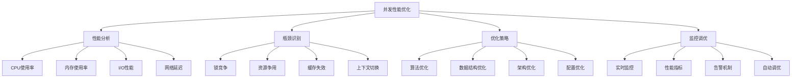

# 并发性能优化

## 🎯 学习目标
- 理解并发性能优化的基本原理和方法
- 掌握PHP并发性能优化的实现技巧
- 学会性能分析和瓶颈识别
- 了解并发性能优化的最佳实践

## 📚 核心概念

### 并发性能优化架构



### 性能优化层次

| 优化层次 | 描述 | 影响范围 | 优化难度 |
|----------|------|----------|----------|
| 算法优化 | 改进算法复杂度 | 全局 | 高 |
| 数据结构优化 | 选择合适的数据结构 | 局部 | 中 |
| 架构优化 | 改进系统架构 | 全局 | 高 |
| 配置优化 | 调整系统配置 | 局部 | 低 |

## 🔧 并发性能优化实现

### 基础性能优化
```php
<?php
// 1. 性能分析器
class PerformanceProfiler {
    private array $metrics = [];
    private array $timers = [];
    private array $counters = [];
    
    // 开始计时
    public function startTimer(string $name): void {
        $this->timers[$name] = [
            'start_time' => microtime(true),
            'end_time' => null,
            'duration' => 0
        ];
    }
    
    // 结束计时
    public function endTimer(string $name): float {
        if (!isset($this->timers[$name])) {
            return 0;
        }
        
        $endTime = microtime(true);
        $this->timers[$name]['end_time'] = $endTime;
        $this->timers[$name]['duration'] = $endTime - $this->timers[$name]['start_time'];
        
        return $this->timers[$name]['duration'];
    }
    
    // 记录指标
    public function recordMetric(string $name, float $value, array $tags = []): void {
        if (!isset($this->metrics[$name])) {
            $this->metrics[$name] = [];
        }
        
        $this->metrics[$name][] = [
            'value' => $value,
            'tags' => $tags,
            'timestamp' => microtime(true)
        ];
    }
    
    // 增加计数器
    public function incrementCounter(string $name, int $value = 1): void {
        if (!isset($this->counters[$name])) {
            $this->counters[$name] = 0;
        }
        
        $this->counters[$name] += $value;
    }
    
    // 获取计时器结果
    public function getTimerResult(string $name): ?array {
        return $this->timers[$name] ?? null;
    }
    
    // 获取所有计时器结果
    public function getAllTimerResults(): array {
        return $this->timers;
    }
    
    // 获取指标统计
    public function getMetricStats(string $name, int $timeRange = 3600): array {
        if (!isset($this->metrics[$name])) {
            return [];
        }
        
        $cutoffTime = microtime(true) - $timeRange;
        $recentMetrics = array_filter($this->metrics[$name], function($metric) use ($cutoffTime) {
            return $metric['timestamp'] >= $cutoffTime;
        });
        
        if (empty($recentMetrics)) {
            return [];
        }
        
        $values = array_column($recentMetrics, 'value');
        
        return [
            'count' => count($values),
            'min' => min($values),
            'max' => max($values),
            'avg' => array_sum($values) / count($values),
            'sum' => array_sum($values)
        ];
    }
    
    // 获取计数器值
    public function getCounterValue(string $name): int {
        return $this->counters[$name] ?? 0;
    }
    
    // 获取所有计数器
    public function getAllCounters(): array {
        return $this->counters;
    }
    
    // 生成性能报告
    public function generateReport(): array {
        $report = [
            'timers' => $this->getAllTimerResults(),
            'counters' => $this->getAllCounters(),
            'metrics' => []
        ];
        
        foreach (array_keys($this->metrics) as $metricName) {
            $report['metrics'][$metricName] = $this->getMetricStats($metricName);
        }
        
        return $report;
    }
}

// 2. 锁优化器
class LockOptimizer {
    private array $lockStats = [];
    private array $optimizations = [];
    
    // 分析锁性能
    public function analyzeLockPerformance(string $lockName, array $operations): array {
        $totalOperations = count($operations);
        $totalWaitTime = 0;
        $totalHoldTime = 0;
        $contentionCount = 0;
        
        foreach ($operations as $operation) {
            $totalWaitTime += $operation['wait_time'] ?? 0;
            $totalHoldTime += $operation['hold_time'] ?? 0;
            
            if (($operation['wait_time'] ?? 0) > 0) {
                $contentionCount++;
            }
        }
        
        $stats = [
            'lock_name' => $lockName,
            'total_operations' => $totalOperations,
            'total_wait_time' => $totalWaitTime,
            'total_hold_time' => $totalHoldTime,
            'average_wait_time' => $totalOperations > 0 ? $totalWaitTime / $totalOperations : 0,
            'average_hold_time' => $totalOperations > 0 ? $totalHoldTime / $totalOperations : 0,
            'contention_count' => $contentionCount,
            'contention_rate' => $totalOperations > 0 ? $contentionCount / $totalOperations : 0,
            'utilization_rate' => $totalOperations > 0 ? $totalHoldTime / ($totalOperations * 1000) : 0
        ];
        
        $this->lockStats[$lockName] = $stats;
        return $stats;
    }
    
    // 生成锁优化建议
    public function generateLockOptimizations(string $lockName): array {
        if (!isset($this->lockStats[$lockName])) {
            return [];
        }
        
        $stats = $this->lockStats[$lockName];
        $optimizations = [];
        
        // 高竞争率优化
        if ($stats['contention_rate'] > 0.3) {
            $optimizations[] = [
                'type' => 'high_contention',
                'description' => '锁竞争率过高，建议使用读写锁或锁分离',
                'priority' => 'high',
                'impact' => 'significant'
            ];
        }
        
        // 长等待时间优化
        if ($stats['average_wait_time'] > 100) {
            $optimizations[] = [
                'type' => 'long_wait_time',
                'description' => '平均等待时间过长，建议优化锁粒度或使用无锁编程',
                'priority' => 'high',
                'impact' => 'significant'
            ];
        }
        
        // 低利用率优化
        if ($stats['utilization_rate'] < 0.1) {
            $optimizations[] = [
                'type' => 'low_utilization',
                'description' => '锁利用率过低，建议减少锁的使用或使用更轻量级的同步机制',
                'priority' => 'medium',
                'impact' => 'moderate'
            ];
        }
        
        // 锁粒度优化
        if ($stats['average_hold_time'] > 50) {
            $optimizations[] = [
                'type' => 'coarse_grained',
                'description' => '锁粒度过粗，建议细化锁的范围',
                'priority' => 'medium',
                'impact' => 'moderate'
            ];
        }
        
        $this->optimizations[$lockName] = $optimizations;
        return $optimizations;
    }
    
    // 获取锁统计
    public function getLockStats(string $lockName): ?array {
        return $this->lockStats[$lockName] ?? null;
    }
    
    // 获取所有锁统计
    public function getAllLockStats(): array {
        return $this->lockStats;
    }
    
    // 获取优化建议
    public function getOptimizations(string $lockName): array {
        return $this->optimizations[$lockName] ?? [];
    }
    
    // 获取所有优化建议
    public function getAllOptimizations(): array {
        return $this->optimizations;
    }
}

// 3. 缓存优化器
class CacheOptimizer {
    private array $cacheStats = [];
    private array $optimizations = [];
    
    // 分析缓存性能
    public function analyzeCachePerformance(string $cacheName, array $operations): array {
        $totalOperations = count($operations);
        $hitCount = 0;
        $missCount = 0;
        $totalAccessTime = 0;
        
        foreach ($operations as $operation) {
            $totalAccessTime += $operation['access_time'] ?? 0;
            
            if ($operation['hit'] ?? false) {
                $hitCount++;
            } else {
                $missCount++;
            }
        }
        
        $stats = [
            'cache_name' => $cacheName,
            'total_operations' => $totalOperations,
            'hit_count' => $hitCount,
            'miss_count' => $missCount,
            'hit_rate' => $totalOperations > 0 ? $hitCount / $totalOperations : 0,
            'miss_rate' => $totalOperations > 0 ? $missCount / $totalOperations : 0,
            'average_access_time' => $totalOperations > 0 ? $totalAccessTime / $totalOperations : 0,
            'total_access_time' => $totalAccessTime
        ];
        
        $this->cacheStats[$cacheName] = $stats;
        return $stats;
    }
    
    // 生成缓存优化建议
    public function generateCacheOptimizations(string $cacheName): array {
        if (!isset($this->cacheStats[$cacheName])) {
            return [];
        }
        
        $stats = $this->cacheStats[$cacheName];
        $optimizations = [];
        
        // 低命中率优化
        if ($stats['hit_rate'] < 0.8) {
            $optimizations[] = [
                'type' => 'low_hit_rate',
                'description' => '缓存命中率过低，建议调整缓存策略或增加缓存大小',
                'priority' => 'high',
                'impact' => 'significant'
            ];
        }
        
        // 高访问时间优化
        if ($stats['average_access_time'] > 10) {
            $optimizations[] = [
                'type' => 'high_access_time',
                'description' => '平均访问时间过长，建议优化缓存数据结构或使用更快的存储',
                'priority' => 'medium',
                'impact' => 'moderate'
            ];
        }
        
        // 缓存大小优化
        if ($stats['miss_rate'] > 0.3) {
            $optimizations[] = [
                'type' => 'cache_size',
                'description' => '缓存未命中率过高，建议增加缓存大小或优化淘汰策略',
                'priority' => 'medium',
                'impact' => 'moderate'
            ];
        }
        
        $this->optimizations[$cacheName] = $optimizations;
        return $optimizations;
    }
    
    // 获取缓存统计
    public function getCacheStats(string $cacheName): ?array {
        return $this->cacheStats[$cacheName] ?? null;
    }
    
    // 获取所有缓存统计
    public function getAllCacheStats(): array {
        return $this->cacheStats;
    }
    
    // 获取优化建议
    public function getOptimizations(string $cacheName): array {
        return $this->optimizations[$cacheName] ?? [];
    }
    
    // 获取所有优化建议
    public function getAllOptimizations(): array {
        return $this->optimizations;
    }
}

// 使用示例
echo "=== 基础性能优化示例 ===\n";

try {
    // 性能分析器
    $profiler = new PerformanceProfiler();
    
    $profiler->startTimer('database_query');
    // 模拟数据库查询
    usleep(100000); // 100ms
    $profiler->endTimer('database_query');
    
    $profiler->startTimer('cache_operation');
    // 模拟缓存操作
    usleep(50000); // 50ms
    $profiler->endTimer('cache_operation');
    
    $profiler->recordMetric('response_time', 150.5, ['endpoint' => '/api/users']);
    $profiler->recordMetric('response_time', 200.3, ['endpoint' => '/api/orders']);
    $profiler->incrementCounter('requests', 1);
    $profiler->incrementCounter('errors', 0);
    
    $report = $profiler->generateReport();
    echo "性能报告: " . json_encode($report) . "\n";
    
    // 锁优化器
    $lockOptimizer = new LockOptimizer();
    
    $lockOperations = [
        ['wait_time' => 10, 'hold_time' => 50],
        ['wait_time' => 15, 'hold_time' => 45],
        ['wait_time' => 0, 'hold_time' => 30],
        ['wait_time' => 20, 'hold_time' => 60],
        ['wait_time' => 5, 'hold_time' => 40]
    ];
    
    $lockStats = $lockOptimizer->analyzeLockPerformance('user_lock', $lockOperations);
    echo "锁统计: " . json_encode($lockStats) . "\n";
    
    $lockOptimizations = $lockOptimizer->generateLockOptimizations('user_lock');
    echo "锁优化建议: " . json_encode($lockOptimizations) . "\n";
    
    // 缓存优化器
    $cacheOptimizer = new CacheOptimizer();
    
    $cacheOperations = [
        ['hit' => true, 'access_time' => 5],
        ['hit' => false, 'access_time' => 15],
        ['hit' => true, 'access_time' => 3],
        ['hit' => true, 'access_time' => 4],
        ['hit' => false, 'access_time' => 12]
    ];
    
    $cacheStats = $cacheOptimizer->analyzeCachePerformance('user_cache', $cacheOperations);
    echo "缓存统计: " . json_encode($cacheStats) . "\n";
    
    $cacheOptimizations = $cacheOptimizer->generateCacheOptimizations('user_cache');
    echo "缓存优化建议: " . json_encode($cacheOptimizations) . "\n";
    
} catch (Exception $e) {
    echo "错误: " . $e->getMessage() . "\n";
}
?>
```

### 高级性能优化
```php
<?php
// 1. 并发性能监控
class ConcurrentPerformanceMonitor {
    private array $metrics = [];
    private array $alerts = [];
    private array $thresholds = [];
    
    // 设置性能阈值
    public function setThreshold(string $metric, float $warning, float $critical): void {
        $this->thresholds[$metric] = [
            'warning' => $warning,
            'critical' => $critical
        ];
    }
    
    // 记录性能指标
    public function recordMetric(string $metric, float $value, array $tags = []): void {
        $timestamp = microtime(true);
        
        if (!isset($this->metrics[$metric])) {
            $this->metrics[$metric] = [];
        }
        
        $this->metrics[$metric][] = [
            'value' => $value,
            'tags' => $tags,
            'timestamp' => $timestamp
        ];
        
        // 检查阈值
        $this->checkThresholds($metric, $value, $tags);
    }
    
    // 检查阈值
    private function checkThresholds(string $metric, float $value, array $tags): void {
        if (!isset($this->thresholds[$metric])) {
            return;
        }
        
        $threshold = $this->thresholds[$metric];
        $level = null;
        
        if ($value >= $threshold['critical']) {
            $level = 'critical';
        } elseif ($value >= $threshold['warning']) {
            $level = 'warning';
        }
        
        if ($level) {
            $this->triggerAlert($metric, $value, $level, $tags);
        }
    }
    
    // 触发告警
    private function triggerAlert(string $metric, float $value, string $level, array $tags): void {
        $alert = [
            'metric' => $metric,
            'value' => $value,
            'level' => $level,
            'tags' => $tags,
            'timestamp' => microtime(true)
        ];
        
        $this->alerts[] = $alert;
        
        echo "性能告警: $metric = $value ($level)\n";
    }
    
    // 获取性能指标
    public function getMetric(string $metric, int $timeRange = 3600): array {
        if (!isset($this->metrics[$metric])) {
            return [];
        }
        
        $cutoffTime = microtime(true) - $timeRange;
        $recentMetrics = array_filter($this->metrics[$metric], function($m) use ($cutoffTime) {
            return $m['timestamp'] >= $cutoffTime;
        });
        
        return $recentMetrics;
    }
    
    // 获取性能统计
    public function getMetricStats(string $metric, int $timeRange = 3600): array {
        $metrics = $this->getMetric($metric, $timeRange);
        
        if (empty($metrics)) {
            return [];
        }
        
        $values = array_column($metrics, 'value');
        
        return [
            'count' => count($values),
            'min' => min($values),
            'max' => max($values),
            'avg' => array_sum($values) / count($values),
            'sum' => array_sum($values),
            'p95' => $this->calculatePercentile($values, 95),
            'p99' => $this->calculatePercentile($values, 99)
        ];
    }
    
    // 计算百分位数
    private function calculatePercentile(array $values, int $percentile): float {
        sort($values);
        $index = ($percentile / 100) * (count($values) - 1);
        
        if (floor($index) == $index) {
            return $values[$index];
        } else {
            $lower = $values[floor($index)];
            $upper = $values[ceil($index)];
            return $lower + ($upper - $lower) * ($index - floor($index));
        }
    }
    
    // 获取告警
    public function getAlerts(int $timeRange = 3600): array {
        $cutoffTime = microtime(true) - $timeRange;
        return array_filter($this->alerts, function($alert) use ($cutoffTime) {
            return $alert['timestamp'] >= $cutoffTime;
        });
    }
    
    // 获取性能报告
    public function generatePerformanceReport(): array {
        $report = [
            'timestamp' => microtime(true),
            'metrics' => [],
            'alerts' => $this->getAlerts(),
            'summary' => []
        ];
        
        foreach (array_keys($this->metrics) as $metric) {
            $report['metrics'][$metric] = $this->getMetricStats($metric);
        }
        
        // 生成摘要
        $report['summary'] = [
            'total_metrics' => count($this->metrics),
            'total_alerts' => count($this->alerts),
            'critical_alerts' => count(array_filter($this->alerts, function($a) {
                return $a['level'] === 'critical';
            })),
            'warning_alerts' => count(array_filter($this->alerts, function($a) {
                return $a['level'] === 'warning';
            }))
        ];
        
        return $report;
    }
}

// 2. 自动性能调优
class AutoPerformanceTuner {
    private array $tuningRules = [];
    private array $tuningHistory = [];
    private array $currentConfig = [];
    
    // 添加调优规则
    public function addTuningRule(string $name, callable $condition, callable $action): void {
        $this->tuningRules[$name] = [
            'condition' => $condition,
            'action' => $action,
            'enabled' => true
        ];
    }
    
    // 执行自动调优
    public function performAutoTuning(array $metrics): array {
        $tuningResults = [];
        
        foreach ($this->tuningRules as $ruleName => $rule) {
            if (!$rule['enabled']) {
                continue;
            }
            
            try {
                if ($rule['condition']($metrics)) {
                    $result = $rule['action']($metrics);
                    $tuningResults[$ruleName] = $result;
                    
                    $this->tuningHistory[] = [
                        'rule' => $ruleName,
                        'timestamp' => microtime(true),
                        'result' => $result,
                        'metrics' => $metrics
                    ];
                }
            } catch (Exception $e) {
                echo "调优规则 $ruleName 执行失败: " . $e->getMessage() . "\n";
            }
        }
        
        return $tuningResults;
    }
    
    // 获取调优历史
    public function getTuningHistory(int $limit = 100): array {
        return array_slice($this->tuningHistory, -$limit);
    }
    
    // 启用/禁用调优规则
    public function setRuleEnabled(string $ruleName, bool $enabled): void {
        if (isset($this->tuningRules[$ruleName])) {
            $this->tuningRules[$ruleName]['enabled'] = $enabled;
        }
    }
    
    // 获取当前配置
    public function getCurrentConfig(): array {
        return $this->currentConfig;
    }
    
    // 更新配置
    public function updateConfig(array $config): void {
        $this->currentConfig = array_merge($this->currentConfig, $config);
    }
}

// 3. 性能基准测试
class PerformanceBenchmark {
    private array $benchmarks = [];
    private array $results = [];
    
    // 添加基准测试
    public function addBenchmark(string $name, callable $test, array $config = []): void {
        $this->benchmarks[$name] = [
            'test' => $test,
            'config' => $config,
            'enabled' => true
        ];
    }
    
    // 运行基准测试
    public function runBenchmark(string $name, int $iterations = 1000): array {
        if (!isset($this->benchmarks[$name]) || !$this->benchmarks[$name]['enabled']) {
            throw new Exception("基准测试不存在或已禁用: $name");
        }
        
        $benchmark = $this->benchmarks[$name];
        $test = $benchmark['test'];
        $config = $benchmark['config'];
        
        $startTime = microtime(true);
        $startMemory = memory_get_usage();
        
        for ($i = 0; $i < $iterations; $i++) {
            $test($config);
        }
        
        $endTime = microtime(true);
        $endMemory = memory_get_usage();
        
        $result = [
            'name' => $name,
            'iterations' => $iterations,
            'total_time' => $endTime - $startTime,
            'average_time' => ($endTime - $startTime) / $iterations,
            'memory_used' => $endMemory - $startMemory,
            'iterations_per_second' => $iterations / ($endTime - $startTime),
            'timestamp' => microtime(true)
        ];
        
        $this->results[$name] = $result;
        return $result;
    }
    
    // 运行所有基准测试
    public function runAllBenchmarks(int $iterations = 1000): array {
        $results = [];
        
        foreach ($this->benchmarks as $name => $benchmark) {
            if ($benchmark['enabled']) {
                try {
                    $results[$name] = $this->runBenchmark($name, $iterations);
                } catch (Exception $e) {
                    echo "基准测试 $name 执行失败: " . $e->getMessage() . "\n";
                }
            }
        }
        
        return $results;
    }
    
    // 比较基准测试结果
    public function compareBenchmarks(array $names): array {
        $comparison = [];
        
        foreach ($names as $name) {
            if (isset($this->results[$name])) {
                $comparison[$name] = $this->results[$name];
            }
        }
        
        // 按性能排序
        uasort($comparison, function($a, $b) {
            return $a['iterations_per_second'] <=> $b['iterations_per_second'];
        });
        
        return $comparison;
    }
    
    // 获取基准测试结果
    public function getBenchmarkResult(string $name): ?array {
        return $this->results[$name] ?? null;
    }
    
    // 获取所有基准测试结果
    public function getAllBenchmarkResults(): array {
        return $this->results;
    }
    
    // 生成基准测试报告
    public function generateBenchmarkReport(): array {
        $report = [
            'timestamp' => microtime(true),
            'total_benchmarks' => count($this->benchmarks),
            'completed_benchmarks' => count($this->results),
            'results' => $this->results,
            'summary' => []
        ];
        
        if (!empty($this->results)) {
            $totalTime = array_sum(array_column($this->results, 'total_time'));
            $totalIterations = array_sum(array_column($this->results, 'iterations'));
            $totalMemory = array_sum(array_column($this->results, 'memory_used'));
            
            $report['summary'] = [
                'total_time' => $totalTime,
                'total_iterations' => $totalIterations,
                'total_memory' => $totalMemory,
                'average_iterations_per_second' => $totalIterations / $totalTime
            ];
        }
        
        return $report;
    }
}

// 使用示例
echo "=== 高级性能优化示例 ===\n";

try {
    // 并发性能监控
    $monitor = new ConcurrentPerformanceMonitor();
    
    $monitor->setThreshold('response_time', 100, 500);
    $monitor->setThreshold('cpu_usage', 80, 95);
    $monitor->setThreshold('memory_usage', 80, 90);
    
    $monitor->recordMetric('response_time', 150, ['endpoint' => '/api/users']);
    $monitor->recordMetric('response_time', 600, ['endpoint' => '/api/orders']);
    $monitor->recordMetric('cpu_usage', 85, ['node' => 'web1']);
    $monitor->recordMetric('memory_usage', 92, ['node' => 'web1']);
    
    $stats = $monitor->getMetricStats('response_time');
    echo "响应时间统计: " . json_encode($stats) . "\n";
    
    $alerts = $monitor->getAlerts();
    echo "告警: " . json_encode($alerts) . "\n";
    
    $report = $monitor->generatePerformanceReport();
    echo "性能报告: " . json_encode($report) . "\n";
    
    // 自动性能调优
    $tuner = new AutoPerformanceTuner();
    
    $tuner->addTuningRule(
        'high_cpu_tuning',
        function($metrics) {
            return ($metrics['cpu_usage'] ?? 0) > 80;
        },
        function($metrics) {
            return ['action' => 'reduce_worker_processes', 'value' => 2];
        }
    );
    
    $tuner->addTuningRule(
        'high_memory_tuning',
        function($metrics) {
            return ($metrics['memory_usage'] ?? 0) > 85;
        },
        function($metrics) {
            return ['action' => 'enable_garbage_collection', 'value' => true];
        }
    );
    
    $tuningResults = $tuner->performAutoTuning([
        'cpu_usage' => 85,
        'memory_usage' => 90,
        'response_time' => 200
    ]);
    
    echo "自动调优结果: " . json_encode($tuningResults) . "\n";
    
    // 性能基准测试
    $benchmark = new PerformanceBenchmark();
    
    $benchmark->addBenchmark('array_operations', function($config) {
        $array = range(1, 1000);
        array_sum($array);
        array_reverse($array);
    });
    
    $benchmark->addBenchmark('string_operations', function($config) {
        $string = str_repeat('a', 1000);
        strlen($string);
        strtoupper($string);
    });
    
    $results = $benchmark->runAllBenchmarks(10000);
    echo "基准测试结果: " . json_encode($results) . "\n";
    
    $comparison = $benchmark->compareBenchmarks(['array_operations', 'string_operations']);
    echo "性能比较: " . json_encode($comparison) . "\n";
    
    $benchmarkReport = $benchmark->generateBenchmarkReport();
    echo "基准测试报告: " . json_encode($benchmarkReport) . "\n";
    
} catch (Exception $e) {
    echo "错误: " . $e->getMessage() . "\n";
}
?>
```

## 📊 最佳实践

### 并发性能优化最佳实践
```php
<?php
// 并发性能优化最佳实践

class ConcurrentPerformanceOptimizationBestPractices {
    // 1. 性能优化策略
    public static function getPerformanceOptimizationStrategies() {
        return [
            '算法优化' => [
                '时间复杂度' => '选择时间复杂度更低的算法',
                '空间复杂度' => '平衡时间复杂度和空间复杂度',
                '数据结构' => '选择合适的数据结构',
                '算法选择' => '根据场景选择最优算法'
            ],
            '架构优化' => [
                '分层架构' => '采用分层架构提高可维护性',
                '微服务' => '使用微服务架构提高扩展性',
                '缓存策略' => '实现多级缓存策略',
                '负载均衡' => '使用负载均衡分散压力'
            ],
            '资源优化' => [
                'CPU优化' => '优化CPU使用率',
                '内存优化' => '优化内存使用和回收',
                'I/O优化' => '优化磁盘和网络I/O',
                '网络优化' => '优化网络传输效率'
            ]
        ];
    }
    
    // 2. 并发优化技术
    public static function getConcurrentOptimizationTechniques() {
        return [
            '锁优化' => [
                '锁粒度' => '控制锁的粒度，避免过粗或过细',
                '锁类型' => '选择合适的锁类型',
                '无锁编程' => '考虑无锁编程方案',
                '锁分离' => '分离读写操作使用不同锁'
            ],
            '线程优化' => [
                '线程池' => '使用线程池管理线程',
                '线程数量' => '合理设置线程数量',
                '线程亲和性' => '设置线程CPU亲和性',
                '线程优先级' => '合理设置线程优先级'
            ],
            '内存优化' => [
                '内存池' => '使用内存池减少分配开销',
                '对象池' => '使用对象池复用对象',
                '缓存优化' => '优化缓存策略和大小',
                '垃圾回收' => '优化垃圾回收策略'
            ]
        ];
    }
    
    // 3. 性能监控实践
    public static function getPerformanceMonitoringPractices() {
        return [
            '监控指标' => [
                '响应时间' => '监控系统响应时间',
                '吞吐量' => '监控系统吞吐量',
                '错误率' => '监控系统错误率',
                '资源使用' => '监控CPU、内存、磁盘使用率'
            ],
            '监控工具' => [
                'APM工具' => '使用应用性能监控工具',
                '系统监控' => '使用系统监控工具',
                '日志分析' => '分析系统日志',
                '性能分析器' => '使用性能分析器'
            ],
            '告警机制' => [
                '阈值告警' => '设置性能阈值告警',
                '趋势告警' => '设置性能趋势告警',
                '异常告警' => '设置异常情况告警',
                '恢复通知' => '设置恢复通知'
            ]
        ];
    }
    
    // 4. 性能调优实践
    public static function getPerformanceTuningPractices() {
        return [
            '调优方法' => [
                '基准测试' => '进行基准测试确定基线',
                '性能分析' => '分析性能瓶颈',
                '逐步优化' => '逐步优化避免过度优化',
                '效果验证' => '验证优化效果'
            ],
            '调优工具' => [
                '性能分析器' => '使用性能分析工具',
                '压力测试' => '进行压力测试',
                '负载测试' => '进行负载测试',
                '容量测试' => '进行容量测试'
            ],
            '调优策略' => [
                '自上而下' => '从架构层面开始调优',
                '自下而上' => '从代码层面开始调优',
                '重点优化' => '重点优化性能瓶颈',
                '持续优化' => '持续监控和优化'
            ]
        ];
    }
}

// 使用示例
echo "=== 并发性能优化最佳实践示例 ===\n";

try {
    $optimizationStrategies = ConcurrentPerformanceOptimizationBestPractices::getPerformanceOptimizationStrategies();
    echo "性能优化策略:\n";
    foreach ($optimizationStrategies as $category => $strategies) {
        echo "  $category:\n";
        foreach ($strategies as $strategy => $description) {
            echo "    - $strategy: $description\n";
        }
        echo "\n";
    }
    
    $optimizationTechniques = ConcurrentPerformanceOptimizationBestPractices::getConcurrentOptimizationTechniques();
    echo "并发优化技术:\n";
    foreach ($optimizationTechniques as $category => $techniques) {
        echo "  $category:\n";
        foreach ($techniques as $technique => $description) {
            echo "    - $technique: $description\n";
        }
        echo "\n";
    }
    
} catch (Exception $e) {
    echo "错误: " . $e->getMessage() . "\n";
}
?>
```

## 🎓 学习建议

### 费曼学习法应用
1. **选择概念**: 选择并发性能优化中的核心概念
2. **简化解释**: 用简单语言解释性能优化的重要性
3. **识别盲点**: 发现理解不深入的地方
4. **重新学习**: 针对盲点进行深入学习

### 刻意练习重点
1. **性能分析**: 掌握性能分析方法和工具
2. **瓶颈识别**: 学会识别性能瓶颈
3. **优化技术**: 理解各种优化技术
4. **监控调优**: 培养性能监控和调优能力

## 🔗 相关链接
- [[01-多进程编程|多进程编程]]
- [[02-异步编程|异步编程]]
- [[03-消息队列|消息队列]]
- [[04-协程编程|协程编程]]
- [[05-锁机制|锁机制]]
- [[06-并发安全|并发安全]]
