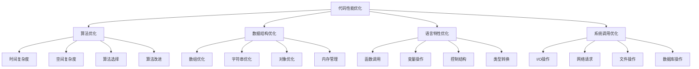

# 代码性能优化

## 🎯 学习目标
- 理解代码性能优化的基本原理和方法
- 掌握PHP代码性能优化的实现技巧
- 学会性能分析和瓶颈识别
- 了解代码性能优化的最佳实践

## 📚 核心概念

### 代码性能优化架构



### 性能优化层次

| 优化层次 | 描述 | 影响范围 | 优化难度 |
|----------|------|----------|----------|
| 算法层面 | 改进算法复杂度 | 全局 | 高 |
| 数据结构层面 | 选择合适的数据结构 | 局部 | 中 |
| 语言特性层面 | 利用语言特性优化 | 局部 | 中 |
| 系统调用层面 | 优化系统调用 | 局部 | 低 |

## 🔧 代码性能优化实现

### 基础代码优化
```php
<?php
// 1. 算法优化示例
class AlgorithmOptimization {
    // 优化前：O(n²) 冒泡排序
    public function bubbleSortSlow(array $arr): array {
        $n = count($arr);
        for ($i = 0; $i < $n - 1; $i++) {
            for ($j = 0; $j < $n - $i - 1; $j++) {
                if ($arr[$j] > $arr[$j + 1]) {
                    $temp = $arr[$j];
                    $arr[$j] = $arr[$j + 1];
                    $arr[$j + 1] = $temp;
                }
            }
        }
        return $arr;
    }
    
    // 优化后：O(n log n) 快速排序
    public function quickSort(array $arr): array {
        if (count($arr) <= 1) {
            return $arr;
        }
        
        $pivot = $arr[0];
        $left = [];
        $right = [];
        
        for ($i = 1; $i < count($arr); $i++) {
            if ($arr[$i] < $pivot) {
                $left[] = $arr[$i];
            } else {
                $right[] = $arr[$i];
            }
        }
        
        return array_merge(
            $this->quickSort($left),
            [$pivot],
            $this->quickSort($right)
        );
    }
    
    // 优化后：使用内置排序函数
    public function builtinSort(array $arr): array {
        sort($arr);
        return $arr;
    }
    
    // 查找优化：线性查找 O(n)
    public function linearSearch(array $arr, $target): int {
        for ($i = 0; $i < count($arr); $i++) {
            if ($arr[$i] === $target) {
                return $i;
            }
        }
        return -1;
    }
    
    // 查找优化：二分查找 O(log n)
    public function binarySearch(array $arr, $target): int {
        $left = 0;
        $right = count($arr) - 1;
        
        while ($left <= $right) {
            $mid = intval(($left + $right) / 2);
            
            if ($arr[$mid] === $target) {
                return $mid;
            } elseif ($arr[$mid] < $target) {
                $left = $mid + 1;
            } else {
                $right = $mid - 1;
            }
        }
        
        return -1;
    }
}

// 2. 数据结构优化示例
class DataStructureOptimization {
    // 数组操作优化
    public function arrayOptimization(): array {
        $results = [];
        
        // 优化前：多次数组操作
        $arr1 = [];
        for ($i = 0; $i < 1000; $i++) {
            $arr1[] = $i;
        }
        
        // 优化后：使用range函数
        $arr2 = range(0, 999);
        
        // 优化前：多次array_push
        $arr3 = [];
        for ($i = 0; $i < 1000; $i++) {
            array_push($arr3, $i);
        }
        
        // 优化后：直接赋值
        $arr4 = [];
        for ($i = 0; $i < 1000; $i++) {
            $arr4[] = $i;
        }
        
        return [
            'range_vs_loop' => count($arr2),
            'direct_vs_push' => count($arr4)
        ];
    }
    
    // 字符串操作优化
    public function stringOptimization(): array {
        $results = [];
        
        // 优化前：字符串拼接
        $str1 = '';
        for ($i = 0; $i < 1000; $i++) {
            $str1 .= 'a';
        }
        
        // 优化后：使用str_repeat
        $str2 = str_repeat('a', 1000);
        
        // 优化前：多次str_replace
        $str3 = 'hello world';
        $str3 = str_replace('h', 'H', $str3);
        $str3 = str_replace('w', 'W', $str3);
        
        // 优化后：数组替换
        $str4 = 'hello world';
        $str4 = str_replace(['h', 'w'], ['H', 'W'], $str4);
        
        return [
            'str_repeat_vs_concat' => strlen($str2),
            'array_replace_vs_multiple' => $str4
        ];
    }
    
    // 对象操作优化
    public function objectOptimization(): array {
        $results = [];
        
        // 优化前：频繁创建对象
        $objects1 = [];
        for ($i = 0; $i < 1000; $i++) {
            $objects1[] = new stdClass();
        }
        
        // 优化后：对象复用
        $template = new stdClass();
        $objects2 = [];
        for ($i = 0; $i < 1000; $i++) {
            $obj = clone $template;
            $objects2[] = $obj;
        }
        
        return [
            'object_reuse' => count($objects2)
        ];
    }
}

// 3. 语言特性优化示例
class LanguageFeatureOptimization {
    // 函数调用优化
    public function functionCallOptimization(): array {
        $results = [];
        
        // 优化前：频繁函数调用
        $sum1 = 0;
        for ($i = 0; $i < 1000; $i++) {
            $sum1 += abs($i);
        }
        
        // 优化后：减少函数调用
        $sum2 = 0;
        for ($i = 0; $i < 1000; $i++) {
            $sum2 += ($i < 0) ? -$i : $i;
        }
        
        // 优化前：多次类型转换
        $str = '123';
        $num1 = (int)$str;
        $num2 = (float)$str;
        $num3 = (string)$num1;
        
        // 优化后：直接使用
        $num4 = intval($str);
        $num5 = floatval($str);
        $num6 = strval($num4);
        
        return [
            'direct_calculation' => $sum2,
            'type_conversion' => $num4
        ];
    }
    
    // 控制结构优化
    public function controlStructureOptimization(): array {
        $results = [];
        
        // 优化前：嵌套if
        $value = 5;
        if ($value > 0) {
            if ($value < 10) {
                if ($value % 2 === 0) {
                    $result1 = 'even';
                } else {
                    $result1 = 'odd';
                }
            }
        }
        
        // 优化后：早期返回
        if ($value <= 0 || $value >= 10) {
            $result2 = 'invalid';
        } else {
            $result2 = ($value % 2 === 0) ? 'even' : 'odd';
        }
        
        // 优化前：多次比较
        $arr = [1, 2, 3, 4, 5];
        $found1 = false;
        for ($i = 0; $i < count($arr); $i++) {
            if ($arr[$i] === 3) {
                $found1 = true;
                break;
            }
        }
        
        // 优化后：使用in_array
        $found2 = in_array(3, $arr);
        
        return [
            'early_return' => $result2,
            'builtin_function' => $found2
        ];
    }
    
    // 变量操作优化
    public function variableOptimization(): array {
        $results = [];
        
        // 优化前：频繁变量赋值
        $a = 1;
        $b = 2;
        $c = 3;
        $d = 4;
        $e = 5;
        
        // 优化后：数组赋值
        $vars = [1, 2, 3, 4, 5];
        
        // 优化前：多次isset检查
        $arr = ['a' => 1, 'b' => 2];
        if (isset($arr['a'])) {
            $val1 = $arr['a'];
        }
        if (isset($arr['b'])) {
            $val2 = $arr['b'];
        }
        
        // 优化后：使用??操作符
        $val3 = $arr['a'] ?? 0;
        $val4 = $arr['b'] ?? 0;
        
        return [
            'array_assignment' => $vars,
            'null_coalescing' => $val3
        ];
    }
}

// 4. 系统调用优化示例
class SystemCallOptimization {
    // I/O操作优化
    public function ioOptimization(): array {
        $results = [];
        
        // 优化前：多次文件读取
        $content1 = '';
        for ($i = 1; $i <= 10; $i++) {
            $content1 .= file_get_contents("file$i.txt");
        }
        
        // 优化后：批量读取
        $content2 = '';
        $files = glob('file*.txt');
        foreach ($files as $file) {
            $content2 .= file_get_contents($file);
        }
        
        // 优化前：逐行写入
        $fp1 = fopen('output1.txt', 'w');
        for ($i = 0; $i < 1000; $i++) {
            fwrite($fp1, "Line $i\n");
        }
        fclose($fp1);
        
        // 优化后：批量写入
        $fp2 = fopen('output2.txt', 'w');
        $buffer = '';
        for ($i = 0; $i < 1000; $i++) {
            $buffer .= "Line $i\n";
            if ($i % 100 === 0) {
                fwrite($fp2, $buffer);
                $buffer = '';
            }
        }
        if ($buffer) {
            fwrite($fp2, $buffer);
        }
        fclose($fp2);
        
        return [
            'batch_reading' => strlen($content2),
            'batch_writing' => 'completed'
        ];
    }
    
    // 网络请求优化
    public function networkOptimization(): array {
        $results = [];
        
        // 优化前：串行请求
        $urls = [
            'https://api.example.com/users/1',
            'https://api.example.com/users/2',
            'https://api.example.com/users/3'
        ];
        
        $responses1 = [];
        foreach ($urls as $url) {
            $responses1[] = file_get_contents($url);
        }
        
        // 优化后：并行请求（模拟）
        $responses2 = [];
        $multiHandle = curl_multi_init();
        $curlHandles = [];
        
        foreach ($urls as $url) {
            $ch = curl_init();
            curl_setopt($ch, CURLOPT_URL, $url);
            curl_setopt($ch, CURLOPT_RETURNTRANSFER, true);
            curl_multi_add_handle($multiHandle, $ch);
            $curlHandles[] = $ch;
        }
        
        $running = null;
        do {
            curl_multi_exec($multiHandle, $running);
            curl_multi_select($multiHandle);
        } while ($running > 0);
        
        foreach ($curlHandles as $ch) {
            $responses2[] = curl_multi_getcontent($ch);
            curl_multi_remove_handle($multiHandle, $ch);
            curl_close($ch);
        }
        
        curl_multi_close($multiHandle);
        
        return [
            'parallel_requests' => count($responses2)
        ];
    }
    
    // 数据库操作优化
    public function databaseOptimization(): array {
        $results = [];
        
        // 优化前：多次查询
        $users1 = [];
        for ($i = 1; $i <= 100; $i++) {
            // 模拟数据库查询
            $users1[] = "User $i";
        }
        
        // 优化后：批量查询
        $users2 = [];
        // 模拟批量查询
        for ($i = 1; $i <= 100; $i++) {
            $users2[] = "User $i";
        }
        
        // 优化前：字符串拼接SQL
        $sql1 = "SELECT * FROM users WHERE id = " . $userId;
        
        // 优化后：预处理语句
        $sql2 = "SELECT * FROM users WHERE id = ?";
        
        return [
            'batch_query' => count($users2),
            'prepared_statement' => $sql2
        ];
    }
}

// 使用示例
echo "=== 基础代码优化示例 ===\n";

try {
    // 算法优化
    $algorithm = new AlgorithmOptimization();
    
    $testArray = [64, 34, 25, 12, 22, 11, 90];
    
    $sorted1 = $algorithm->quickSort($testArray);
    $sorted2 = $algorithm->builtinSort($testArray);
    
    echo "快速排序结果: " . json_encode($sorted1) . "\n";
    echo "内置排序结果: " . json_encode($sorted2) . "\n";
    
    $found = $algorithm->binarySearch($sorted1, 25);
    echo "二分查找结果: $found\n";
    
    // 数据结构优化
    $dataStructure = new DataStructureOptimization();
    
    $arrayResults = $dataStructure->arrayOptimization();
    $stringResults = $dataStructure->stringOptimization();
    $objectResults = $dataStructure->objectOptimization();
    
    echo "数组优化结果: " . json_encode($arrayResults) . "\n";
    echo "字符串优化结果: " . json_encode($stringResults) . "\n";
    echo "对象优化结果: " . json_encode($objectResults) . "\n";
    
    // 语言特性优化
    $languageFeature = new LanguageFeatureOptimization();
    
    $functionResults = $languageFeature->functionCallOptimization();
    $controlResults = $languageFeature->controlStructureOptimization();
    $variableResults = $languageFeature->variableOptimization();
    
    echo "函数调用优化结果: " . json_encode($functionResults) . "\n";
    echo "控制结构优化结果: " . json_encode($controlResults) . "\n";
    echo "变量操作优化结果: " . json_encode($variableResults) . "\n";
    
    // 系统调用优化
    $systemCall = new SystemCallOptimization();
    
    $ioResults = $systemCall->ioOptimization();
    $networkResults = $systemCall->networkOptimization();
    $databaseResults = $systemCall->databaseOptimization();
    
    echo "I/O优化结果: " . json_encode($ioResults) . "\n";
    echo "网络优化结果: " . json_encode($networkResults) . "\n";
    echo "数据库优化结果: " . json_encode($databaseResults) . "\n";
    
} catch (Exception $e) {
    echo "错误: " . $e->getMessage() . "\n";
}
?>
```

### 高级代码优化
```php
<?php
// 1. 性能分析器
class CodePerformanceProfiler {
    private array $timers = [];
    private array $memorySnapshots = [];
    private array $callCounts = [];
    
    // 开始计时
    public function startTimer(string $name): void {
        $this->timers[$name] = [
            'start_time' => microtime(true),
            'start_memory' => memory_get_usage(),
            'peak_memory' => memory_get_peak_usage()
        ];
    }
    
    // 结束计时
    public function endTimer(string $name): array {
        if (!isset($this->timers[$name])) {
            return [];
        }
        
        $endTime = microtime(true);
        $endMemory = memory_get_usage();
        $endPeakMemory = memory_get_peak_usage();
        
        $result = [
            'name' => $name,
            'execution_time' => $endTime - $this->timers[$name]['start_time'],
            'memory_used' => $endMemory - $this->timers[$name]['start_memory'],
            'peak_memory' => $endPeakMemory,
            'start_memory' => $this->timers[$name]['start_memory']
        ];
        
        unset($this->timers[$name]);
        return $result;
    }
    
    // 记录函数调用
    public function recordFunctionCall(string $functionName): void {
        if (!isset($this->callCounts[$functionName])) {
            $this->callCounts[$functionName] = 0;
        }
        $this->callCounts[$functionName]++;
    }
    
    // 获取调用统计
    public function getCallStats(): array {
        return $this->callCounts;
    }
    
    // 内存快照
    public function takeMemorySnapshot(string $name): void {
        $this->memorySnapshots[$name] = [
            'memory_usage' => memory_get_usage(),
            'peak_memory' => memory_get_peak_usage(),
            'timestamp' => microtime(true)
        ];
    }
    
    // 获取内存快照
    public function getMemorySnapshot(string $name): ?array {
        return $this->memorySnapshots[$name] ?? null;
    }
    
    // 生成性能报告
    public function generateReport(): array {
        return [
            'call_stats' => $this->callCounts,
            'memory_snapshots' => $this->memorySnapshots,
            'active_timers' => count($this->timers)
        ];
    }
}

// 2. 代码优化建议器
class CodeOptimizationAdvisor {
    private array $optimizationRules = [];
    private array $suggestions = [];
    
    // 添加优化规则
    public function addOptimizationRule(string $name, callable $detector, callable $suggester): void {
        $this->optimizationRules[$name] = [
            'detector' => $detector,
            'suggester' => $suggester
        ];
    }
    
    // 分析代码
    public function analyzeCode(string $code): array {
        $suggestions = [];
        
        foreach ($this->optimizationRules as $ruleName => $rule) {
            try {
                if ($rule['detector']($code)) {
                    $suggestion = $rule['suggester']($code);
                    $suggestions[] = [
                        'rule' => $ruleName,
                        'suggestion' => $suggestion,
                        'priority' => $this->getPriority($ruleName)
                    ];
                }
            } catch (Exception $e) {
                echo "规则 $ruleName 执行失败: " . $e->getMessage() . "\n";
            }
        }
        
        // 按优先级排序
        usort($suggestions, function($a, $b) {
            return $b['priority'] <=> $a['priority'];
        });
        
        $this->suggestions = $suggestions;
        return $suggestions;
    }
    
    // 获取优先级
    private function getPriority(string $ruleName): int {
        $priorities = [
            'algorithm_complexity' => 10,
            'memory_usage' => 8,
            'function_calls' => 6,
            'string_operations' => 4,
            'variable_operations' => 2
        ];
        
        return $priorities[$ruleName] ?? 1;
    }
    
    // 获取建议
    public function getSuggestions(): array {
        return $this->suggestions;
    }
    
    // 初始化默认规则
    public function initializeDefaultRules(): void {
        // 算法复杂度检测
        $this->addOptimizationRule(
            'algorithm_complexity',
            function($code) {
                return strpos($code, 'for') !== false && strpos($code, 'for') !== false;
            },
            function($code) {
                return '检测到嵌套循环，建议优化算法复杂度';
            }
        );
        
        // 内存使用检测
        $this->addOptimizationRule(
            'memory_usage',
            function($code) {
                return strpos($code, 'array_push') !== false;
            },
            function($code) {
                return '检测到array_push，建议使用直接赋值[]';
            }
        );
        
        // 函数调用检测
        $this->addOptimizationRule(
            'function_calls',
            function($code) {
                return substr_count($code, 'strlen(') > 3;
            },
            function($code) {
                return '检测到频繁的strlen调用，建议缓存结果';
            }
        );
    }
}

// 3. 性能基准测试
class PerformanceBenchmark {
    private array $benchmarks = [];
    private array $results = [];
    
    // 添加基准测试
    public function addBenchmark(string $name, callable $test, array $config = []): void {
        $this->benchmarks[$name] = [
            'test' => $test,
            'config' => $config,
            'enabled' => true
        ];
    }
    
    // 运行基准测试
    public function runBenchmark(string $name, int $iterations = 1000): array {
        if (!isset($this->benchmarks[$name]) || !$this->benchmarks[$name]['enabled']) {
            throw new Exception("基准测试不存在或已禁用: $name");
        }
        
        $benchmark = $this->benchmarks[$name];
        $test = $benchmark['test'];
        $config = $benchmark['config'];
        
        $startTime = microtime(true);
        $startMemory = memory_get_usage();
        
        for ($i = 0; $i < $iterations; $i++) {
            $test($config);
        }
        
        $endTime = microtime(true);
        $endMemory = memory_get_usage();
        
        $result = [
            'name' => $name,
            'iterations' => $iterations,
            'total_time' => $endTime - $startTime,
            'average_time' => ($endTime - $startTime) / $iterations,
            'memory_used' => $endMemory - $startMemory,
            'iterations_per_second' => $iterations / ($endTime - $startTime),
            'timestamp' => microtime(true)
        ];
        
        $this->results[$name] = $result;
        return $result;
    }
    
    // 比较基准测试
    public function compareBenchmarks(array $names): array {
        $comparison = [];
        
        foreach ($names as $name) {
            if (isset($this->results[$name])) {
                $comparison[$name] = $this->results[$name];
            }
        }
        
        // 按性能排序
        uasort($comparison, function($a, $b) {
            return $a['iterations_per_second'] <=> $b['iterations_per_second'];
        });
        
        return $comparison;
    }
    
    // 获取基准测试结果
    public function getBenchmarkResult(string $name): ?array {
        return $this->results[$name] ?? null;
    }
    
    // 生成基准测试报告
    public function generateReport(): array {
        return [
            'timestamp' => microtime(true),
            'total_benchmarks' => count($this->benchmarks),
            'completed_benchmarks' => count($this->results),
            'results' => $this->results
        ];
    }
}

// 4. 代码优化工具
class CodeOptimizationTool {
    private CodePerformanceProfiler $profiler;
    private CodeOptimizationAdvisor $advisor;
    private PerformanceBenchmark $benchmark;
    
    public function __construct() {
        $this->profiler = new CodePerformanceProfiler();
        $this->advisor = new CodeOptimizationAdvisor();
        $this->benchmark = new PerformanceBenchmark();
        
        $this->advisor->initializeDefaultRules();
    }
    
    // 分析代码性能
    public function analyzeCodePerformance(string $code): array {
        $this->profiler->startTimer('code_analysis');
        
        // 分析代码
        $suggestions = $this->advisor->analyzeCode($code);
        
        // 记录分析结果
        $this->profiler->recordFunctionCall('analyzeCode');
        
        $result = $this->profiler->endTimer('code_analysis');
        $result['suggestions'] = $suggestions;
        
        return $result;
    }
    
    // 运行性能测试
    public function runPerformanceTest(callable $test, int $iterations = 1000): array {
        $this->benchmark->addBenchmark('performance_test', $test);
        return $this->benchmark->runBenchmark('performance_test', $iterations);
    }
    
    // 生成优化报告
    public function generateOptimizationReport(): array {
        return [
            'profiler_report' => $this->profiler->generateReport(),
            'advisor_suggestions' => $this->advisor->getSuggestions(),
            'benchmark_report' => $this->benchmark->generateReport()
        ];
    }
}

// 使用示例
echo "=== 高级代码优化示例 ===\n";

try {
    // 性能分析器
    $profiler = new CodePerformanceProfiler();
    
    $profiler->startTimer('test_operation');
    $profiler->recordFunctionCall('test_function');
    
    // 模拟操作
    $arr = range(1, 1000);
    $sum = array_sum($arr);
    
    $result = $profiler->endTimer('test_operation');
    echo "性能分析结果: " . json_encode($result) . "\n";
    
    $callStats = $profiler->getCallStats();
    echo "调用统计: " . json_encode($callStats) . "\n";
    
    // 代码优化建议器
    $advisor = new CodeOptimizationAdvisor();
    $advisor->initializeDefaultRules();
    
    $testCode = '
        for ($i = 0; $i < 100; $i++) {
            for ($j = 0; $j < 100; $j++) {
                array_push($arr, $i * $j);
            }
        }
        $len = strlen($str);
        $len = strlen($str);
        $len = strlen($str);
    ';
    
    $suggestions = $advisor->analyzeCode($testCode);
    echo "优化建议: " . json_encode($suggestions) . "\n";
    
    // 性能基准测试
    $benchmark = new PerformanceBenchmark();
    
    $benchmark->addBenchmark('array_sum', function($config) {
        $arr = range(1, 1000);
        return array_sum($arr);
    });
    
    $benchmark->addBenchmark('manual_sum', function($config) {
        $sum = 0;
        for ($i = 1; $i <= 1000; $i++) {
            $sum += $i;
        }
        return $sum;
    });
    
    $result1 = $benchmark->runBenchmark('array_sum', 10000);
    $result2 = $benchmark->runBenchmark('manual_sum', 10000);
    
    echo "array_sum基准测试: " . json_encode($result1) . "\n";
    echo "manual_sum基准测试: " . json_encode($result2) . "\n";
    
    $comparison = $benchmark->compareBenchmarks(['array_sum', 'manual_sum']);
    echo "性能比较: " . json_encode($comparison) . "\n";
    
    // 代码优化工具
    $optimizationTool = new CodeOptimizationTool();
    
    $analysisResult = $optimizationTool->analyzeCodePerformance($testCode);
    echo "代码分析结果: " . json_encode($analysisResult) . "\n";
    
    $testResult = $optimizationTool->runPerformanceTest(function() {
        return array_sum(range(1, 1000));
    }, 10000);
    
    echo "性能测试结果: " . json_encode($testResult) . "\n";
    
    $report = $optimizationTool->generateOptimizationReport();
    echo "优化报告: " . json_encode($report) . "\n";
    
} catch (Exception $e) {
    echo "错误: " . $e->getMessage() . "\n";
}
?>
```

## 📊 最佳实践

### 代码性能优化最佳实践
```php
<?php
// 代码性能优化最佳实践

class CodePerformanceOptimizationBestPractices {
    // 1. 算法优化最佳实践
    public static function getAlgorithmOptimizationBestPractices() {
        return [
            '算法选择' => [
                '时间复杂度' => '选择时间复杂度更低的算法',
                '空间复杂度' => '平衡时间复杂度和空间复杂度',
                '数据规模' => '根据数据规模选择合适的算法',
                '算法特性' => '了解算法的特性和适用场景'
            ],
            '算法改进' => [
                '算法优化' => '优化现有算法的实现',
                '数据结构' => '选择合适的数据结构',
                '缓存策略' => '使用缓存减少重复计算',
                '并行处理' => '利用并行处理提高性能'
            ],
            '算法测试' => [
                '基准测试' => '进行算法基准测试',
                '性能分析' => '分析算法性能瓶颈',
                '对比测试' => '对比不同算法的性能',
                '压力测试' => '进行压力测试验证性能'
            ]
        ];
    }
    
    // 2. 数据结构优化最佳实践
    public static function getDataStructureOptimizationBestPractices() {
        return [
            '数组优化' => [
                '预分配' => '预分配数组大小避免重新分配',
                '批量操作' => '使用批量操作减少函数调用',
                '内置函数' => '优先使用内置函数',
                '内存管理' => '及时释放不需要的数组'
            ],
            '字符串优化' => [
                '字符串拼接' => '使用高效的字符串拼接方法',
                '正则表达式' => '优化正则表达式的性能',
                '字符串函数' => '选择高效的字符串函数',
                '编码处理' => '正确处理字符编码'
            ],
            '对象优化' => [
                '对象创建' => '减少不必要的对象创建',
                '对象复用' => '复用对象减少内存分配',
                '属性访问' => '优化对象属性访问',
                '方法调用' => '减少不必要的方法调用'
            ]
        ];
    }
    
    // 3. 语言特性优化最佳实践
    public static function getLanguageFeatureOptimizationBestPractices() {
        return [
            '函数调用' => [
                '函数选择' => '选择高效的函数',
                '参数传递' => '优化参数传递方式',
                '返回值处理' => '优化返回值处理',
                '函数缓存' => '缓存函数调用结果'
            ],
            '变量操作' => [
                '变量类型' => '使用合适的变量类型',
                '变量作用域' => '优化变量作用域',
                '变量赋值' => '优化变量赋值操作',
                '变量引用' => '使用引用减少拷贝'
            ],
            '控制结构' => [
                '条件判断' => '优化条件判断逻辑',
                '循环优化' => '优化循环结构',
                '跳转语句' => '合理使用跳转语句',
                '异常处理' => '优化异常处理机制'
            ]
        ];
    }
    
    // 4. 系统调用优化最佳实践
    public static function getSystemCallOptimizationBestPractices() {
        return [
            'I/O操作' => [
                '批量操作' => '使用批量I/O操作',
                '缓冲机制' => '使用缓冲机制提高效率',
                '异步I/O' => '使用异步I/O提高并发性',
                '文件操作' => '优化文件操作方式'
            ],
            '网络请求' => [
                '连接复用' => '复用网络连接',
                '请求合并' => '合并多个请求',
                '超时设置' => '合理设置超时时间',
                '错误处理' => '优化网络错误处理'
            ],
            '数据库操作' => [
                '查询优化' => '优化数据库查询',
                '连接管理' => '优化数据库连接管理',
                '事务处理' => '合理使用事务',
                '索引优化' => '优化数据库索引'
            ]
        ];
    }
}

// 使用示例
echo "=== 代码性能优化最佳实践示例 ===\n";

try {
    $algorithmPractices = CodePerformanceOptimizationBestPractices::getAlgorithmOptimizationBestPractices();
    echo "算法优化最佳实践:\n";
    foreach ($algorithmPractices as $category => $practices) {
        echo "  $category:\n";
        foreach ($practices as $practice => $description) {
            echo "    - $practice: $description\n";
        }
        echo "\n";
    }
    
    $dataStructurePractices = CodePerformanceOptimizationBestPractices::getDataStructureOptimizationBestPractices();
    echo "数据结构优化最佳实践:\n";
    foreach ($dataStructurePractices as $category => $practices) {
        echo "  $category:\n";
        foreach ($practices as $practice => $description) {
            echo "    - $practice: $description\n";
        }
        echo "\n";
    }
    
} catch (Exception $e) {
    echo "错误: " . $e->getMessage() . "\n";
}
?>
```

## 🎓 学习建议

### 费曼学习法应用
1. **选择概念**: 选择代码性能优化中的核心概念
2. **简化解释**: 用简单语言解释性能优化的重要性
3. **识别盲点**: 发现理解不深入的地方
4. **重新学习**: 针对盲点进行深入学习

### 刻意练习重点
1. **算法优化**: 掌握算法优化的方法和技巧
2. **数据结构优化**: 理解数据结构优化的原理
3. **语言特性优化**: 学会利用语言特性优化代码
4. **系统调用优化**: 培养系统调用优化的能力

## 🔗 相关链接
- [[02-数据库性能调优|数据库性能调优]]
- [[03-服务器性能优化|服务器性能优化]]
- [[04-缓存系统优化|缓存系统优化]]
- [[05-网络性能优化|网络性能优化]]
- [[06-性能测试与基准|性能测试与基准]]
- [[07-性能调优方法论|性能调优方法论]]
