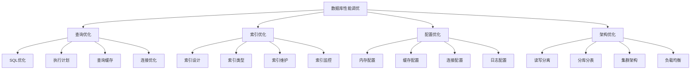

# 数据库性能调优

## 🎯 学习目标
- 理解数据库性能调优的基本原理和方法
- 掌握MySQL性能调优的实现技巧
- 学会数据库性能分析和瓶颈识别
- 了解数据库性能调优的最佳实践

## 📚 核心概念

### 数据库性能调优架构



### 性能调优层次

| 调优层次 | 描述 | 影响范围 | 调优难度 |
|----------|------|----------|----------|
| SQL层面 | 优化SQL语句 | 局部 | 中 |
| 索引层面 | 优化索引设计 | 局部 | 中 |
| 配置层面 | 调整数据库配置 | 全局 | 低 |
| 架构层面 | 优化数据库架构 | 全局 | 高 |

## 🔧 数据库性能调优实现

### 基础数据库优化
```php
<?php
// 1. 查询优化器
class QueryOptimizer {
    private PDO $pdo;
    private array $queryCache = [];
    
    public function __construct(PDO $pdo) {
        $this->pdo = $pdo;
    }
    
    // 分析查询性能
    public function analyzeQuery(string $sql): array {
        $startTime = microtime(true);
        
        // 执行EXPLAIN分析
        $explainSql = "EXPLAIN " . $sql;
        $stmt = $this->pdo->prepare($explainSql);
        $stmt->execute();
        $explainResult = $stmt->fetchAll(PDO::FETCH_ASSOC);
        
        // 执行实际查询
        $stmt = $this->pdo->prepare($sql);
        $stmt->execute();
        $result = $stmt->fetchAll(PDO::FETCH_ASSOC);
        
        $endTime = microtime(true);
        $executionTime = $endTime - $startTime;
        
        return [
            'sql' => $sql,
            'execution_time' => $executionTime,
            'result_count' => count($result),
            'explain_result' => $explainResult,
            'performance_score' => $this->calculatePerformanceScore($explainResult, $executionTime)
        ];
    }
    
    // 计算性能分数
    private function calculatePerformanceScore(array $explainResult, float $executionTime): int {
        $score = 100;
        
        foreach ($explainResult as $row) {
            // 检查是否使用索引
            if ($row['key'] === null) {
                $score -= 20; // 全表扫描
            }
            
            // 检查扫描行数
            if ($row['rows'] > 1000) {
                $score -= 10;
            }
            
            // 检查执行时间
            if ($executionTime > 1.0) {
                $score -= 15;
            }
        }
        
        return max(0, $score);
    }
    
    // 优化查询建议
    public function getOptimizationSuggestions(string $sql): array {
        $suggestions = [];
        
        // 检查是否使用SELECT *
        if (strpos($sql, 'SELECT *') !== false) {
            $suggestions[] = [
                'type' => 'select_columns',
                'description' => '避免使用SELECT *，只选择需要的列',
                'priority' => 'medium'
            ];
        }
        
        // 检查是否使用LIMIT
        if (strpos($sql, 'LIMIT') === false && strpos($sql, 'SELECT') !== false) {
            $suggestions[] = [
                'type' => 'add_limit',
                'description' => '考虑添加LIMIT限制返回行数',
                'priority' => 'low'
            ];
        }
        
        // 检查是否使用索引
        $analysis = $this->analyzeQuery($sql);
        if ($analysis['performance_score'] < 70) {
            $suggestions[] = [
                'type' => 'index_optimization',
                'description' => '查询性能较低，建议优化索引',
                'priority' => 'high'
            ];
        }
        
        return $suggestions;
    }
    
    // 查询缓存
    public function getCachedQuery(string $sql, array $params = []): ?array {
        $cacheKey = md5($sql . serialize($params));
        return $this->queryCache[$cacheKey] ?? null;
    }
    
    // 缓存查询结果
    public function cacheQuery(string $sql, array $params, array $result): void {
        $cacheKey = md5($sql . serialize($params));
        $this->queryCache[$cacheKey] = $result;
    }
}

// 2. 索引优化器
class IndexOptimizer {
    private PDO $pdo;
    
    public function __construct(PDO $pdo) {
        $this->pdo = $pdo;
    }
    
    // 分析表索引
    public function analyzeTableIndexes(string $tableName): array {
        $sql = "SHOW INDEX FROM `$tableName`";
        $stmt = $this->pdo->prepare($sql);
        $stmt->execute();
        $indexes = $stmt->fetchAll(PDO::FETCH_ASSOC);
        
        $indexAnalysis = [];
        foreach ($indexes as $index) {
            $indexName = $index['Key_name'];
            
            if (!isset($indexAnalysis[$indexName])) {
                $indexAnalysis[$indexName] = [
                    'name' => $indexName,
                    'type' => $index['Index_type'],
                    'unique' => $index['Non_unique'] == 0,
                    'columns' => [],
                    'cardinality' => $index['Cardinality']
                ];
            }
            
            $indexAnalysis[$indexName]['columns'][] = [
                'column' => $index['Column_name'],
                'seq' => $index['Seq_in_index'],
                'collation' => $index['Collation']
            ];
        }
        
        return $indexAnalysis;
    }
    
    // 建议索引优化
    public function suggestIndexOptimizations(string $tableName): array {
        $suggestions = [];
        $indexes = $this->analyzeTableIndexes($tableName);
        
        foreach ($indexes as $indexName => $index) {
            // 检查未使用的索引
            if ($index['cardinality'] == 0) {
                $suggestions[] = [
                    'type' => 'unused_index',
                    'index' => $indexName,
                    'description' => "索引 $indexName 可能未被使用",
                    'action' => '考虑删除此索引'
                ];
            }
            
            // 检查重复索引
            $columnNames = array_column($index['columns'], 'column');
            foreach ($indexes as $otherIndexName => $otherIndex) {
                if ($indexName !== $otherIndexName) {
                    $otherColumnNames = array_column($otherIndex['columns'], 'column');
                    if ($columnNames === $otherColumnNames) {
                        $suggestions[] = [
                            'type' => 'duplicate_index',
                            'indexes' => [$indexName, $otherIndexName],
                            'description' => "发现重复索引",
                            'action' => '删除其中一个索引'
                        ];
                    }
                }
            }
        }
        
        return $suggestions;
    }
    
    // 创建索引
    public function createIndex(string $tableName, string $indexName, array $columns, bool $unique = false): bool {
        $uniqueKeyword = $unique ? 'UNIQUE ' : '';
        $columnList = implode(', ', $columns);
        $sql = "CREATE {$uniqueKeyword}INDEX `$indexName` ON `$tableName` ($columnList)";
        
        try {
            $this->pdo->exec($sql);
            return true;
        } catch (PDOException $e) {
            echo "创建索引失败: " . $e->getMessage() . "\n";
            return false;
        }
    }
    
    // 删除索引
    public function dropIndex(string $tableName, string $indexName): bool {
        $sql = "DROP INDEX `$indexName` ON `$tableName`";
        
        try {
            $this->pdo->exec($sql);
            return true;
        } catch (PDOException $e) {
            echo "删除索引失败: " . $e->getMessage() . "\n";
            return false;
        }
    }
}

// 3. 数据库配置优化器
class DatabaseConfigOptimizer {
    private array $config = [];
    private array $recommendations = [];
    
    // 分析当前配置
    public function analyzeCurrentConfig(PDO $pdo): array {
        $config = [];
        
        // 获取MySQL变量
        $variables = [
            'innodb_buffer_pool_size',
            'innodb_log_file_size',
            'innodb_log_buffer_size',
            'max_connections',
            'query_cache_size',
            'tmp_table_size',
            'max_heap_table_size',
            'sort_buffer_size',
            'read_buffer_size',
            'read_rnd_buffer_size'
        ];
        
        foreach ($variables as $variable) {
            $stmt = $pdo->prepare("SHOW VARIABLES LIKE ?");
            $stmt->execute([$variable]);
            $result = $stmt->fetch(PDO::FETCH_ASSOC);
            
            if ($result) {
                $config[$variable] = $result['Value'];
            }
        }
        
        $this->config = $config;
        return $config;
    }
    
    // 生成配置建议
    public function generateConfigRecommendations(): array {
        $recommendations = [];
        
        // InnoDB缓冲池大小建议
        if (isset($this->config['innodb_buffer_pool_size'])) {
            $currentSize = $this->parseSize($this->config['innodb_buffer_pool_size']);
            $recommendedSize = $this->getRecommendedBufferPoolSize();
            
            if ($currentSize < $recommendedSize) {
                $recommendations[] = [
                    'variable' => 'innodb_buffer_pool_size',
                    'current' => $this->config['innodb_buffer_pool_size'],
                    'recommended' => $this->formatSize($recommendedSize),
                    'description' => 'InnoDB缓冲池大小建议增加以提高性能'
                ];
            }
        }
        
        // 最大连接数建议
        if (isset($this->config['max_connections'])) {
            $currentConnections = (int)$this->config['max_connections'];
            $recommendedConnections = 200; // 根据实际情况调整
            
            if ($currentConnections < $recommendedConnections) {
                $recommendations[] = [
                    'variable' => 'max_connections',
                    'current' => $this->config['max_connections'],
                    'recommended' => $recommendedConnections,
                    'description' => '最大连接数建议增加以支持更多并发连接'
                ];
            }
        }
        
        // 查询缓存建议
        if (isset($this->config['query_cache_size'])) {
            $currentCacheSize = $this->parseSize($this->config['query_cache_size']);
            
            if ($currentCacheSize == 0) {
                $recommendations[] = [
                    'variable' => 'query_cache_size',
                    'current' => $this->config['query_cache_size'],
                    'recommended' => '64M',
                    'description' => '建议启用查询缓存以提高查询性能'
                ];
            }
        }
        
        $this->recommendations = $recommendations;
        return $recommendations;
    }
    
    // 解析大小字符串
    private function parseSize(string $size): int {
        $size = trim($size);
        $unit = strtoupper(substr($size, -1));
        $value = (int)substr($size, 0, -1);
        
        switch ($unit) {
            case 'G':
                return $value * 1024 * 1024 * 1024;
            case 'M':
                return $value * 1024 * 1024;
            case 'K':
                return $value * 1024;
            default:
                return (int)$size;
        }
    }
    
    // 格式化大小
    private function formatSize(int $size): string {
        if ($size >= 1024 * 1024 * 1024) {
            return round($size / (1024 * 1024 * 1024)) . 'G';
        } elseif ($size >= 1024 * 1024) {
            return round($size / (1024 * 1024)) . 'M';
        } elseif ($size >= 1024) {
            return round($size / 1024) . 'K';
        } else {
            return $size;
        }
    }
    
    // 获取推荐的缓冲池大小
    private function getRecommendedBufferPoolSize(): int {
        // 简化的推荐算法，实际应该根据系统内存和数据库大小计算
        return 1024 * 1024 * 1024; // 1GB
    }
    
    // 获取配置建议
    public function getRecommendations(): array {
        return $this->recommendations;
    }
}

// 使用示例
echo "=== 基础数据库优化示例 ===\n";

try {
    // 模拟数据库连接
    $dsn = 'mysql:host=localhost;dbname=test';
    $pdo = new PDO($dsn, 'username', 'password');
    
    // 查询优化器
    $queryOptimizer = new QueryOptimizer($pdo);
    
    $testSql = "SELECT * FROM users WHERE age > 25 ORDER BY created_at DESC";
    $analysis = $queryOptimizer->analyzeQuery($testSql);
    echo "查询分析结果: " . json_encode($analysis) . "\n";
    
    $suggestions = $queryOptimizer->getOptimizationSuggestions($testSql);
    echo "优化建议: " . json_encode($suggestions) . "\n";
    
    // 索引优化器
    $indexOptimizer = new IndexOptimizer($pdo);
    
    $indexAnalysis = $indexOptimizer->analyzeTableIndexes('users');
    echo "索引分析结果: " . json_encode($indexAnalysis) . "\n";
    
    $indexSuggestions = $indexOptimizer->suggestIndexOptimizations('users');
    echo "索引优化建议: " . json_encode($indexSuggestions) . "\n";
    
    // 数据库配置优化器
    $configOptimizer = new DatabaseConfigOptimizer();
    
    $currentConfig = $configOptimizer->analyzeCurrentConfig($pdo);
    echo "当前配置: " . json_encode($currentConfig) . "\n";
    
    $configRecommendations = $configOptimizer->generateConfigRecommendations();
    echo "配置建议: " . json_encode($configRecommendations) . "\n";
    
} catch (Exception $e) {
    echo "错误: " . $e->getMessage() . "\n";
}
?>
```

### 高级数据库优化
```php
<?php
// 1. 数据库性能监控
class DatabasePerformanceMonitor {
    private PDO $pdo;
    private array $metrics = [];
    private array $alerts = [];
    
    public function __construct(PDO $pdo) {
        $this->pdo = $pdo;
    }
    
    // 监控查询性能
    public function monitorQueryPerformance(): array {
        $metrics = [];
        
        // 获取慢查询统计
        $slowQueries = $this->getSlowQueries();
        $metrics['slow_queries'] = $slowQueries;
        
        // 获取查询统计
        $queryStats = $this->getQueryStats();
        $metrics['query_stats'] = $queryStats;
        
        // 获取连接统计
        $connectionStats = $this->getConnectionStats();
        $metrics['connection_stats'] = $connectionStats;
        
        $this->metrics = $metrics;
        return $metrics;
    }
    
    // 获取慢查询
    private function getSlowQueries(): array {
        $sql = "SHOW VARIABLES LIKE 'slow_query_log'";
        $stmt = $this->pdo->prepare($sql);
        $stmt->execute();
        $result = $stmt->fetch(PDO::FETCH_ASSOC);
        
        if ($result && $result['Value'] === 'ON') {
            // 这里应该读取慢查询日志文件
            return ['status' => 'enabled', 'count' => 0];
        }
        
        return ['status' => 'disabled'];
    }
    
    // 获取查询统计
    private function getQueryStats(): array {
        $stats = [];
        
        $variables = [
            'Questions',
            'Queries',
            'Com_select',
            'Com_insert',
            'Com_update',
            'Com_delete'
        ];
        
        foreach ($variables as $variable) {
            $stmt = $this->pdo->prepare("SHOW STATUS LIKE ?");
            $stmt->execute([$variable]);
            $result = $stmt->fetch(PDO::FETCH_ASSOC);
            
            if ($result) {
                $stats[$variable] = (int)$result['Value'];
            }
        }
        
        return $stats;
    }
    
    // 获取连接统计
    private function getConnectionStats(): array {
        $stats = [];
        
        $variables = [
            'Connections',
            'Max_used_connections',
            'Threads_connected',
            'Threads_running'
        ];
        
        foreach ($variables as $variable) {
            $stmt = $this->pdo->prepare("SHOW STATUS LIKE ?");
            $stmt->execute([$variable]);
            $result = $stmt->fetch(PDO::FETCH_ASSOC);
            
            if ($result) {
                $stats[$variable] = (int)$result['Value'];
            }
        }
        
        return $stats;
    }
    
    // 检查性能告警
    public function checkPerformanceAlerts(): array {
        $alerts = [];
        
        if (isset($this->metrics['connection_stats'])) {
            $connStats = $this->metrics['connection_stats'];
            
            // 检查连接数告警
            if (isset($connStats['Threads_connected']) && $connStats['Threads_connected'] > 100) {
                $alerts[] = [
                    'type' => 'high_connections',
                    'level' => 'warning',
                    'message' => '当前连接数较高: ' . $connStats['Threads_connected']
                ];
            }
            
            // 检查运行线程告警
            if (isset($connStats['Threads_running']) && $connStats['Threads_running'] > 50) {
                $alerts[] = [
                    'type' => 'high_running_threads',
                    'level' => 'critical',
                    'message' => '运行线程数过高: ' . $connStats['Threads_running']
                ];
            }
        }
        
        $this->alerts = $alerts;
        return $alerts;
    }
    
    // 获取性能指标
    public function getMetrics(): array {
        return $this->metrics;
    }
    
    // 获取告警
    public function getAlerts(): array {
        return $this->alerts;
    }
}

// 2. 数据库架构优化器
class DatabaseArchitectureOptimizer {
    private array $architecture = [];
    private array $optimizations = [];
    
    // 分析当前架构
    public function analyzeCurrentArchitecture(): array {
        $architecture = [
            'type' => 'single_master',
            'replicas' => 0,
            'sharding' => false,
            'load_balancing' => false,
            'caching' => false
        ];
        
        $this->architecture = $architecture;
        return $architecture;
    }
    
    // 建议架构优化
    public function suggestArchitectureOptimizations(): array {
        $optimizations = [];
        
        // 读写分离建议
        $optimizations[] = [
            'type' => 'read_write_separation',
            'description' => '实现读写分离提高并发性能',
            'benefits' => [
                '提高读性能',
                '减少主库压力',
                '提高系统可用性'
            ],
            'implementation' => [
                '配置主从复制',
                '实现读写分离中间件',
                '监控主从延迟'
            ]
        ];
        
        // 分库分表建议
        $optimizations[] = [
            'type' => 'database_sharding',
            'description' => '实现分库分表处理大数据量',
            'benefits' => [
                '提高查询性能',
                '支持水平扩展',
                '减少单表数据量'
            ],
            'implementation' => [
                '设计分片策略',
                '实现分片路由',
                '处理跨分片查询'
            ]
        ];
        
        // 缓存优化建议
        $optimizations[] = [
            'type' => 'caching_strategy',
            'description' => '实现多级缓存策略',
            'benefits' => [
                '减少数据库压力',
                '提高响应速度',
                '降低系统负载'
            ],
            'implementation' => [
                '应用层缓存',
                '数据库查询缓存',
                '分布式缓存'
            ]
        ];
        
        $this->optimizations = $optimizations;
        return $optimizations;
    }
    
    // 获取架构信息
    public function getArchitecture(): array {
        return $this->architecture;
    }
    
    // 获取优化建议
    public function getOptimizations(): array {
        return $this->optimizations;
    }
}

// 3. 数据库性能测试
class DatabasePerformanceTest {
    private PDO $pdo;
    private array $testResults = [];
    
    public function __construct(PDO $pdo) {
        $this->pdo = $pdo;
    }
    
    // 执行性能测试
    public function runPerformanceTest(string $testName, callable $test, int $iterations = 100): array {
        $startTime = microtime(true);
        $startMemory = memory_get_usage();
        
        for ($i = 0; $i < $iterations; $i++) {
            $test();
        }
        
        $endTime = microtime(true);
        $endMemory = memory_get_usage();
        
        $result = [
            'test_name' => $testName,
            'iterations' => $iterations,
            'total_time' => $endTime - $startTime,
            'average_time' => ($endTime - $startTime) / $iterations,
            'memory_used' => $endMemory - $startMemory,
            'iterations_per_second' => $iterations / ($endTime - $startTime)
        ];
        
        $this->testResults[$testName] = $result;
        return $result;
    }
    
    // 比较测试结果
    public function compareTestResults(array $testNames): array {
        $comparison = [];
        
        foreach ($testNames as $testName) {
            if (isset($this->testResults[$testName])) {
                $comparison[$testName] = $this->testResults[$testName];
            }
        }
        
        // 按性能排序
        uasort($comparison, function($a, $b) {
            return $a['iterations_per_second'] <=> $b['iterations_per_second'];
        });
        
        return $comparison;
    }
    
    // 获取测试结果
    public function getTestResults(): array {
        return $this->testResults;
    }
}

// 使用示例
echo "=== 高级数据库优化示例 ===\n";

try {
    // 模拟数据库连接
    $dsn = 'mysql:host=localhost;dbname=test';
    $pdo = new PDO($dsn, 'username', 'password');
    
    // 数据库性能监控
    $monitor = new DatabasePerformanceMonitor($pdo);
    
    $metrics = $monitor->monitorQueryPerformance();
    echo "性能指标: " . json_encode($metrics) . "\n";
    
    $alerts = $monitor->checkPerformanceAlerts();
    echo "性能告警: " . json_encode($alerts) . "\n";
    
    // 数据库架构优化器
    $architectureOptimizer = new DatabaseArchitectureOptimizer();
    
    $currentArchitecture = $architectureOptimizer->analyzeCurrentArchitecture();
    echo "当前架构: " . json_encode($currentArchitecture) . "\n";
    
    $architectureOptimizations = $architectureOptimizer->suggestArchitectureOptimizations();
    echo "架构优化建议: " . json_encode($architectureOptimizations) . "\n";
    
    // 数据库性能测试
    $performanceTest = new DatabasePerformanceTest($pdo);
    
    $test1 = $performanceTest->runPerformanceTest('simple_select', function() use ($pdo) {
        $stmt = $pdo->prepare("SELECT 1");
        $stmt->execute();
    }, 1000);
    
    $test2 = $performanceTest->runPerformanceTest('complex_select', function() use ($pdo) {
        $stmt = $pdo->prepare("SELECT * FROM users WHERE age > ?");
        $stmt->execute([25]);
    }, 100);
    
    echo "简单查询测试: " . json_encode($test1) . "\n";
    echo "复杂查询测试: " . json_encode($test2) . "\n";
    
    $comparison = $performanceTest->compareTestResults(['simple_select', 'complex_select']);
    echo "性能比较: " . json_encode($comparison) . "\n";
    
} catch (Exception $e) {
    echo "错误: " . $e->getMessage() . "\n";
}
?>
```

## 📊 最佳实践

### 数据库性能调优最佳实践
```php
<?php
// 数据库性能调优最佳实践

class DatabasePerformanceOptimizationBestPractices {
    // 1. 查询优化最佳实践
    public static function getQueryOptimizationBestPractices() {
        return [
            'SQL编写' => [
                '避免SELECT *' => '只选择需要的列，减少数据传输',
                '使用LIMIT' => '限制返回行数，提高查询效率',
                '避免子查询' => '使用JOIN替代子查询',
                '使用索引' => '确保查询条件使用索引'
            ],
            '查询分析' => [
                '使用EXPLAIN' => '分析查询执行计划',
                '监控慢查询' => '识别和优化慢查询',
                '查询缓存' => '利用查询缓存提高性能',
                '连接优化' => '优化数据库连接使用'
            ],
            '查询模式' => [
                '批量操作' => '使用批量插入和更新',
                '预处理语句' => '使用预处理语句提高安全性',
                '事务管理' => '合理使用事务',
                '连接池' => '使用连接池管理连接'
            ]
        ];
    }
    
    // 2. 索引优化最佳实践
    public static function getIndexOptimizationBestPractices() {
        return [
            '索引设计' => [
                '主键索引' => '为每个表设计合适的主键',
                '唯一索引' => '为唯一字段创建唯一索引',
                '复合索引' => '为多字段查询创建复合索引',
                '覆盖索引' => '创建覆盖索引减少回表查询'
            ],
            '索引维护' => [
                '定期分析' => '定期分析索引使用情况',
                '删除无用索引' => '删除未使用的索引',
                '重建索引' => '定期重建碎片化索引',
                '监控索引' => '监控索引性能指标'
            ],
            '索引策略' => [
                '选择性' => '选择高选择性的字段创建索引',
                '长度' => '合理设置索引长度',
                '类型' => '选择合适的索引类型',
                '数量' => '控制索引数量避免过多'
            ]
        ];
    }
    
    // 3. 配置优化最佳实践
    public static function getConfigOptimizationBestPractices() {
        return [
            '内存配置' => [
                '缓冲池' => '合理设置InnoDB缓冲池大小',
                '日志缓冲' => '优化日志缓冲区大小',
                '排序缓冲' => '调整排序缓冲区大小',
                '连接缓冲' => '优化连接缓冲区配置'
            ],
            '连接配置' => [
                '最大连接数' => '根据并发需求设置最大连接数',
                '超时设置' => '合理设置连接超时时间',
                '连接池' => '使用连接池管理连接',
                '连接监控' => '监控连接使用情况'
            ],
            '缓存配置' => [
                '查询缓存' => '启用查询缓存提高性能',
                '表缓存' => '优化表缓存配置',
                '键缓存' => '调整键缓存大小',
                '缓存策略' => '制定合理的缓存策略'
            ]
        ];
    }
    
    // 4. 架构优化最佳实践
    public static function getArchitectureOptimizationBestPractices() {
        return [
            '读写分离' => [
                '主从复制' => '配置主从复制实现读写分离',
                '负载均衡' => '使用负载均衡分散读请求',
                '延迟监控' => '监控主从复制延迟',
                '故障转移' => '实现自动故障转移机制'
            ],
            '分库分表' => [
                '分片策略' => '设计合理的分片策略',
                '路由算法' => '实现高效的分片路由',
                '跨分片查询' => '处理跨分片查询问题',
                '数据迁移' => '实现数据迁移和重平衡'
            ],
            '集群架构' => [
                '高可用' => '实现高可用集群架构',
                '负载均衡' => '使用负载均衡器',
                '监控告警' => '建立完善的监控告警',
                '备份恢复' => '实现数据备份和恢复'
            ]
        ];
    }
}

// 使用示例
echo "=== 数据库性能调优最佳实践示例 ===\n";

try {
    $queryPractices = DatabasePerformanceOptimizationBestPractices::getQueryOptimizationBestPractices();
    echo "查询优化最佳实践:\n";
    foreach ($queryPractices as $category => $practices) {
        echo "  $category:\n";
        foreach ($practices as $practice => $description) {
            echo "    - $practice: $description\n";
        }
        echo "\n";
    }
    
    $indexPractices = DatabasePerformanceOptimizationBestPractices::getIndexOptimizationBestPractices();
    echo "索引优化最佳实践:\n";
    foreach ($indexPractices as $category => $practices) {
        echo "  $category:\n";
        foreach ($practices as $practice => $description) {
            echo "    - $practice: $description\n";
        }
        echo "\n";
    }
    
} catch (Exception $e) {
    echo "错误: " . $e->getMessage() . "\n";
}
?>
```

## 🎓 学习建议

### 费曼学习法应用
1. **选择概念**: 选择数据库性能调优中的核心概念
2. **简化解释**: 用简单语言解释性能调优的重要性
3. **识别盲点**: 发现理解不深入的地方
4. **重新学习**: 针对盲点进行深入学习

### 刻意练习重点
1. **查询优化**: 掌握SQL查询优化的方法和技巧
2. **索引设计**: 理解索引设计的原理和最佳实践
3. **配置调优**: 学会数据库配置参数的调优
4. **架构优化**: 培养数据库架构设计的能力

## 🔗 相关链接
- [[01-代码性能优化|代码性能优化]]
- [[03-服务器性能优化|服务器性能优化]]
- [[04-缓存系统优化|缓存系统优化]]
- [[05-网络性能优化|网络性能优化]]
- [[06-性能测试与基准|性能测试与基准]]
- [[07-性能调优方法论|性能调优方法论]]
