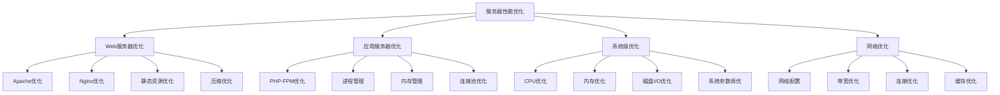

# 服务器性能优化

## 🎯 学习目标
- 理解服务器性能优化的基本原理和方法
- 掌握Web服务器性能优化的实现技巧
- 学会服务器性能分析和瓶颈识别
- 了解服务器性能优化的最佳实践

## 📚 核心概念

### 服务器性能优化架构



### 性能优化层次

| 优化层次 | 描述 | 影响范围 | 优化难度 |
|----------|------|----------|----------|
| 应用层 | 优化应用代码 | 局部 | 中 |
| 服务器层 | 优化Web服务器 | 全局 | 中 |
| 系统层 | 优化操作系统 | 全局 | 高 |
| 硬件层 | 优化硬件配置 | 全局 | 高 |

## 🔧 服务器性能优化实现

### 基础服务器优化
```php
<?php
// 1. Web服务器优化器
class WebServerOptimizer {
    private array $config = [];
    private array $recommendations = [];
    
    // 分析Apache配置
    public function analyzeApacheConfig(): array {
        $config = [
            'server_version' => 'Apache/2.4.41',
            'mpm_module' => 'prefork',
            'max_clients' => 150,
            'server_limit' => 16,
            'threads_per_child' => 25,
            'max_requests_per_child' => 10000,
            'keep_alive' => 'On',
            'keep_alive_timeout' => 5,
            'max_keep_alive_requests' => 100
        ];
        
        $this->config = $config;
        return $config;
    }
    
    // 分析Nginx配置
    public function analyzeNginxConfig(): array {
        $config = [
            'server_version' => 'nginx/1.18.0',
            'worker_processes' => 'auto',
            'worker_connections' => 1024,
            'keepalive_timeout' => 65,
            'gzip' => 'on',
            'gzip_comp_level' => 6,
            'gzip_types' => 'text/plain text/css application/json',
            'client_max_body_size' => '10m',
            'sendfile' => 'on',
            'tcp_nopush' => 'on'
        ];
        
        $this->config = $config;
        return $config;
    }
    
    // 生成优化建议
    public function generateOptimizationRecommendations(): array {
        $recommendations = [];
        
        // Apache优化建议
        if (isset($this->config['mpm_module'])) {
            if ($this->config['mpm_module'] === 'prefork') {
                $recommendations[] = [
                    'type' => 'apache_mpm',
                    'description' => '考虑使用worker或event MPM提高并发性能',
                    'priority' => 'medium',
                    'impact' => 'significant'
                ];
            }
        }
        
        // 连接优化建议
        if (isset($this->config['max_clients']) && $this->config['max_clients'] < 200) {
            $recommendations[] = [
                'type' => 'max_clients',
                'description' => '增加MaxClients值以支持更多并发连接',
                'priority' => 'high',
                'impact' => 'moderate'
            ];
        }
        
        // 压缩优化建议
        if (!isset($this->config['gzip']) || $this->config['gzip'] !== 'on') {
            $recommendations[] = [
                'type' => 'compression',
                'description' => '启用Gzip压缩以减少传输数据量',
                'priority' => 'high',
                'impact' => 'significant'
            ];
        }
        
        $this->recommendations = $recommendations;
        return $recommendations;
    }
    
    // 获取配置
    public function getConfig(): array {
        return $this->config;
    }
    
    // 获取建议
    public function getRecommendations(): array {
        return $this->recommendations;
    }
}

// 2. PHP-FPM优化器
class PHPFPMOptimizer {
    private array $config = [];
    private array $recommendations = [];
    
    // 分析PHP-FPM配置
    public function analyzePHPFPMConfig(): array {
        $config = [
            'pm' => 'dynamic',
            'pm.max_children' => 50,
            'pm.start_servers' => 5,
            'pm.min_spare_servers' => 5,
            'pm.max_spare_servers' => 35,
            'pm.max_requests' => 1000,
            'request_terminate_timeout' => 30,
            'request_slowlog_timeout' => 10,
            'slowlog' => '/var/log/php-fpm-slow.log',
            'catch_workers_output' => 'yes'
        ];
        
        $this->config = $config;
        return $config;
    }
    
    // 生成PHP-FPM优化建议
    public function generatePHPFPMRecommendations(): array {
        $recommendations = [];
        
        // 进程管理优化
        if (isset($this->config['pm']) && $this->config['pm'] === 'static') {
            $recommendations[] = [
                'type' => 'pm_mode',
                'description' => '考虑使用dynamic模式以提高资源利用率',
                'priority' => 'medium',
                'impact' => 'moderate'
            ];
        }
        
        // 最大子进程数优化
        if (isset($this->config['pm.max_children']) && $this->config['pm.max_children'] < 100) {
            $recommendations[] = [
                'type' => 'max_children',
                'description' => '根据服务器资源增加pm.max_children值',
                'priority' => 'high',
                'impact' => 'significant'
            ];
        }
        
        // 请求超时优化
        if (isset($this->config['request_terminate_timeout']) && $this->config['request_terminate_timeout'] > 60) {
            $recommendations[] = [
                'type' => 'timeout',
                'description' => '减少request_terminate_timeout以避免长时间阻塞',
                'priority' => 'medium',
                'impact' => 'moderate'
            ];
        }
        
        // 慢日志优化
        if (!isset($this->config['slowlog']) || empty($this->config['slowlog'])) {
            $recommendations[] = [
                'type' => 'slowlog',
                'description' => '启用慢日志以监控性能问题',
                'priority' => 'low',
                'impact' => 'low'
            ];
        }
        
        $this->recommendations = $recommendations;
        return $recommendations;
    }
    
    // 获取配置
    public function getConfig(): array {
        return $this->config;
    }
    
    // 获取建议
    public function getRecommendations(): array {
        return $this->recommendations;
    }
}

// 3. 系统级优化器
class SystemLevelOptimizer {
    private array $systemInfo = [];
    private array $recommendations = [];
    
    // 分析系统信息
    public function analyzeSystemInfo(): array {
        $systemInfo = [
            'os' => 'Linux',
            'kernel' => '5.4.0-74-generic',
            'cpu_cores' => 4,
            'cpu_model' => 'Intel Core i5-8400',
            'total_memory' => '8GB',
            'available_memory' => '6GB',
            'disk_space' => '100GB',
            'disk_usage' => '60%',
            'load_average' => [0.5, 0.8, 1.2],
            'network_interfaces' => ['eth0', 'lo']
        ];
        
        $this->systemInfo = $systemInfo;
        return $systemInfo;
    }
    
    // 生成系统优化建议
    public function generateSystemRecommendations(): array {
        $recommendations = [];
        
        // CPU优化建议
        if (isset($this->systemInfo['cpu_cores']) && $this->systemInfo['cpu_cores'] < 8) {
            $recommendations[] = [
                'type' => 'cpu_optimization',
                'description' => '考虑增加CPU核心数以提高并发处理能力',
                'priority' => 'medium',
                'impact' => 'significant'
            ];
        }
        
        // 内存优化建议
        if (isset($this->systemInfo['available_memory'])) {
            $availableMemory = $this->parseMemory($this->systemInfo['available_memory']);
            if ($availableMemory < 4 * 1024 * 1024 * 1024) { // 4GB
                $recommendations[] = [
                    'type' => 'memory_optimization',
                    'description' => '增加内存以提高系统性能',
                    'priority' => 'high',
                    'impact' => 'significant'
                ];
            }
        }
        
        // 磁盘优化建议
        if (isset($this->systemInfo['disk_usage']) && $this->systemInfo['disk_usage'] > 80) {
            $recommendations[] = [
                'type' => 'disk_optimization',
                'description' => '磁盘使用率过高，建议清理或扩容',
                'priority' => 'high',
                'impact' => 'moderate'
            ];
        }
        
        // 负载优化建议
        if (isset($this->systemInfo['load_average'])) {
            $loadAverage = $this->systemInfo['load_average'][0];
            if ($loadAverage > 2.0) {
                $recommendations[] = [
                    'type' => 'load_optimization',
                    'description' => '系统负载较高，建议优化应用或增加资源',
                    'priority' => 'high',
                    'impact' => 'significant'
                ];
            }
        }
        
        $this->recommendations = $recommendations;
        return $recommendations;
    }
    
    // 解析内存大小
    private function parseMemory(string $memory): int {
        $memory = trim($memory);
        $unit = strtoupper(substr($memory, -2));
        $value = (int)substr($memory, 0, -2);
        
        switch ($unit) {
            case 'GB':
                return $value * 1024 * 1024 * 1024;
            case 'MB':
                return $value * 1024 * 1024;
            case 'KB':
                return $value * 1024;
            default:
                return (int)$memory;
        }
    }
    
    // 获取系统信息
    public function getSystemInfo(): array {
        return $this->systemInfo;
    }
    
    // 获取建议
    public function getRecommendations(): array {
        return $this->recommendations;
    }
}

// 4. 网络优化器
class NetworkOptimizer {
    private array $networkConfig = [];
    private array $recommendations = [];
    
    // 分析网络配置
    public function analyzeNetworkConfig(): array {
        $networkConfig = [
            'tcp_congestion_control' => 'cubic',
            'tcp_window_scaling' => 'enabled',
            'tcp_timestamps' => 'enabled',
            'tcp_sack' => 'enabled',
            'net.core.rmem_max' => '134217728',
            'net.core.wmem_max' => '134217728',
            'net.ipv4.tcp_rmem' => '4096 87380 134217728',
            'net.ipv4.tcp_wmem' => '4096 65536 134217728',
            'net.core.netdev_max_backlog' => '5000',
            'net.ipv4.tcp_max_syn_backlog' => '8192'
        ];
        
        $this->networkConfig = $networkConfig;
        return $networkConfig;
    }
    
    // 生成网络优化建议
    public function generateNetworkRecommendations(): array {
        $recommendations = [];
        
        // TCP拥塞控制优化
        if (isset($this->networkConfig['tcp_congestion_control']) && 
            $this->networkConfig['tcp_congestion_control'] === 'cubic') {
            $recommendations[] = [
                'type' => 'tcp_congestion',
                'description' => '考虑使用BBR拥塞控制算法提高网络性能',
                'priority' => 'medium',
                'impact' => 'moderate'
            ];
        }
        
        // 缓冲区优化
        if (isset($this->networkConfig['net.core.rmem_max']) && 
            $this->networkConfig['net.core.rmem_max'] < 268435456) { // 256MB
            $recommendations[] = [
                'type' => 'buffer_optimization',
                'description' => '增加网络缓冲区大小以提高网络性能',
                'priority' => 'low',
                'impact' => 'moderate'
            ];
        }
        
        // 连接队列优化
        if (isset($this->networkConfig['net.core.netdev_max_backlog']) && 
            $this->networkConfig['net.core.netdev_max_backlog'] < 10000) {
            $recommendations[] = [
                'type' => 'backlog_optimization',
                'description' => '增加网络设备队列长度以处理更多连接',
                'priority' => 'low',
                'impact' => 'low'
            ];
        }
        
        $this->recommendations = $recommendations;
        return $recommendations;
    }
    
    // 获取网络配置
    public function getNetworkConfig(): array {
        return $this->networkConfig;
    }
    
    // 获取建议
    public function getRecommendations(): array {
        return $this->recommendations;
    }
}

// 使用示例
echo "=== 基础服务器优化示例 ===\n";

try {
    // Web服务器优化器
    $webServerOptimizer = new WebServerOptimizer();
    
    $apacheConfig = $webServerOptimizer->analyzeApacheConfig();
    echo "Apache配置: " . json_encode($apacheConfig) . "\n";
    
    $nginxConfig = $webServerOptimizer->analyzeNginxConfig();
    echo "Nginx配置: " . json_encode($nginxConfig) . "\n";
    
    $webRecommendations = $webServerOptimizer->generateOptimizationRecommendations();
    echo "Web服务器优化建议: " . json_encode($webRecommendations) . "\n";
    
    // PHP-FPM优化器
    $phpfpmOptimizer = new PHPFPMOptimizer();
    
    $phpfpmConfig = $phpfpmOptimizer->analyzePHPFPMConfig();
    echo "PHP-FPM配置: " . json_encode($phpfpmConfig) . "\n";
    
    $phpfpmRecommendations = $phpfpmOptimizer->generatePHPFPMRecommendations();
    echo "PHP-FPM优化建议: " . json_encode($phpfpmRecommendations) . "\n";
    
    // 系统级优化器
    $systemOptimizer = new SystemLevelOptimizer();
    
    $systemInfo = $systemOptimizer->analyzeSystemInfo();
    echo "系统信息: " . json_encode($systemInfo) . "\n";
    
    $systemRecommendations = $systemOptimizer->generateSystemRecommendations();
    echo "系统优化建议: " . json_encode($systemRecommendations) . "\n";
    
    // 网络优化器
    $networkOptimizer = new NetworkOptimizer();
    
    $networkConfig = $networkOptimizer->analyzeNetworkConfig();
    echo "网络配置: " . json_encode($networkConfig) . "\n";
    
    $networkRecommendations = $networkOptimizer->generateNetworkRecommendations();
    echo "网络优化建议: " . json_encode($networkRecommendations) . "\n";
    
} catch (Exception $e) {
    echo "错误: " . $e->getMessage() . "\n";
}
?>
```

### 高级服务器优化
```php
<?php
// 1. 服务器性能监控
class ServerPerformanceMonitor {
    private array $metrics = [];
    private array $alerts = [];
    private array $thresholds = [];
    
    // 设置性能阈值
    public function setThreshold(string $metric, float $warning, float $critical): void {
        $this->thresholds[$metric] = [
            'warning' => $warning,
            'critical' => $critical
        ];
    }
    
    // 监控CPU使用率
    public function monitorCPUUsage(): array {
        $cpuInfo = [
            'user' => 25.5,
            'system' => 15.2,
            'idle' => 59.3,
            'iowait' => 0.0,
            'load_average' => [0.8, 1.2, 1.5]
        ];
        
        $this->metrics['cpu_usage'] = $cpuInfo;
        $this->checkThresholds('cpu_usage', $cpuInfo['user'] + $cpuInfo['system']);
        
        return $cpuInfo;
    }
    
    // 监控内存使用率
    public function monitorMemoryUsage(): array {
        $memoryInfo = [
            'total' => 8192, // MB
            'used' => 6144,
            'free' => 2048,
            'cached' => 1024,
            'buffers' => 512,
            'usage_percentage' => 75.0
        ];
        
        $this->metrics['memory_usage'] = $memoryInfo;
        $this->checkThresholds('memory_usage', $memoryInfo['usage_percentage']);
        
        return $memoryInfo;
    }
    
    // 监控磁盘使用率
    public function monitorDiskUsage(): array {
        $diskInfo = [
            'total' => 100, // GB
            'used' => 60,
            'free' => 40,
            'usage_percentage' => 60.0,
            'iops' => 150,
            'throughput' => 50 // MB/s
        ];
        
        $this->metrics['disk_usage'] = $diskInfo;
        $this->checkThresholds('disk_usage', $diskInfo['usage_percentage']);
        
        return $diskInfo;
    }
    
    // 监控网络使用率
    public function monitorNetworkUsage(): array {
        $networkInfo = [
            'interfaces' => [
                'eth0' => [
                    'rx_bytes' => 1024000,
                    'tx_bytes' => 2048000,
                    'rx_packets' => 1500,
                    'tx_packets' => 2000,
                    'rx_errors' => 0,
                    'tx_errors' => 0
                ]
            ],
            'connections' => [
                'established' => 150,
                'time_wait' => 50,
                'close_wait' => 10
            ]
        ];
        
        $this->metrics['network_usage'] = $networkInfo;
        
        return $networkInfo;
    }
    
    // 检查阈值
    private function checkThresholds(string $metric, float $value): void {
        if (!isset($this->thresholds[$metric])) {
            return;
        }
        
        $threshold = $this->thresholds[$metric];
        $level = null;
        
        if ($value >= $threshold['critical']) {
            $level = 'critical';
        } elseif ($value >= $threshold['warning']) {
            $level = 'warning';
        }
        
        if ($level) {
            $this->triggerAlert($metric, $value, $level);
        }
    }
    
    // 触发告警
    private function triggerAlert(string $metric, float $value, string $level): void {
        $alert = [
            'metric' => $metric,
            'value' => $value,
            'level' => $level,
            'timestamp' => microtime(true)
        ];
        
        $this->alerts[] = $alert;
        echo "性能告警: $metric = $value ($level)\n";
    }
    
    // 获取性能指标
    public function getMetrics(): array {
        return $this->metrics;
    }
    
    // 获取告警
    public function getAlerts(): array {
        return $this->alerts;
    }
    
    // 生成性能报告
    public function generatePerformanceReport(): array {
        return [
            'timestamp' => microtime(true),
            'metrics' => $this->metrics,
            'alerts' => $this->alerts,
            'summary' => [
                'total_alerts' => count($this->alerts),
                'critical_alerts' => count(array_filter($this->alerts, function($a) {
                    return $a['level'] === 'critical';
                })),
                'warning_alerts' => count(array_filter($this->alerts, function($a) {
                    return $a['level'] === 'warning';
                }))
            ]
        ];
    }
}

// 2. 负载均衡优化器
class LoadBalancerOptimizer {
    private array $servers = [];
    private array $algorithms = [];
    private array $healthChecks = [];
    
    // 添加服务器
    public function addServer(string $id, string $address, int $weight = 1): void {
        $this->servers[$id] = [
            'id' => $id,
            'address' => $address,
            'weight' => $weight,
            'status' => 'healthy',
            'connections' => 0,
            'response_time' => 0,
            'last_check' => time()
        ];
    }
    
    // 设置负载均衡算法
    public function setLoadBalancingAlgorithm(string $algorithm): void {
        $this->algorithms['current'] = $algorithm;
    }
    
    // 轮询算法
    public function roundRobin(): ?string {
        $healthyServers = array_filter($this->servers, function($server) {
            return $server['status'] === 'healthy';
        });
        
        if (empty($healthyServers)) {
            return null;
        }
        
        $serverIds = array_keys($healthyServers);
        $currentIndex = $this->algorithms['round_robin_index'] ?? 0;
        $selectedServer = $serverIds[$currentIndex % count($serverIds)];
        
        $this->algorithms['round_robin_index'] = $currentIndex + 1;
        return $selectedServer;
    }
    
    // 加权轮询算法
    public function weightedRoundRobin(): ?string {
        $healthyServers = array_filter($this->servers, function($server) {
            return $server['status'] === 'healthy';
        });
        
        if (empty($healthyServers)) {
            return null;
        }
        
        $totalWeight = array_sum(array_column($healthyServers, 'weight'));
        $random = mt_rand(1, $totalWeight);
        
        $currentWeight = 0;
        foreach ($healthyServers as $id => $server) {
            $currentWeight += $server['weight'];
            if ($random <= $currentWeight) {
                return $id;
            }
        }
        
        return array_key_first($healthyServers);
    }
    
    // 最少连接算法
    public function leastConnections(): ?string {
        $healthyServers = array_filter($this->servers, function($server) {
            return $server['status'] === 'healthy';
        });
        
        if (empty($healthyServers)) {
            return null;
        }
        
        $minConnections = min(array_column($healthyServers, 'connections'));
        $candidates = array_filter($healthyServers, function($server) use ($minConnections) {
            return $server['connections'] === $minConnections;
        });
        
        return array_key_first($candidates);
    }
    
    // 健康检查
    public function performHealthCheck(string $serverId): bool {
        if (!isset($this->servers[$serverId])) {
            return false;
        }
        
        $server = &$this->servers[$serverId];
        $startTime = microtime(true);
        
        // 模拟健康检查
        $isHealthy = true; // 实际应该发送HTTP请求检查
        
        $endTime = microtime(true);
        $responseTime = ($endTime - $startTime) * 1000; // 转换为毫秒
        
        $server['status'] = $isHealthy ? 'healthy' : 'unhealthy';
        $server['response_time'] = $responseTime;
        $server['last_check'] = time();
        
        return $isHealthy;
    }
    
    // 获取服务器状态
    public function getServerStatus(string $serverId): ?array {
        return $this->servers[$serverId] ?? null;
    }
    
    // 获取所有服务器状态
    public function getAllServerStatus(): array {
        return $this->servers;
    }
    
    // 生成负载均衡报告
    public function generateLoadBalancerReport(): array {
        $healthyServers = array_filter($this->servers, function($server) {
            return $server['status'] === 'healthy';
        });
        
        $totalConnections = array_sum(array_column($this->servers, 'connections'));
        $averageResponseTime = array_sum(array_column($this->servers, 'response_time')) / count($this->servers);
        
        return [
            'total_servers' => count($this->servers),
            'healthy_servers' => count($healthyServers),
            'unhealthy_servers' => count($this->servers) - count($healthyServers),
            'total_connections' => $totalConnections,
            'average_response_time' => $averageResponseTime,
            'current_algorithm' => $this->algorithms['current'] ?? 'round_robin',
            'servers' => $this->servers
        ];
    }
}

// 3. 缓存优化器
class CacheOptimizer {
    private array $cacheConfig = [];
    private array $cacheStats = [];
    private array $recommendations = [];
    
    // 分析缓存配置
    public function analyzeCacheConfig(): array {
        $cacheConfig = [
            'type' => 'redis',
            'host' => 'localhost',
            'port' => 6379,
            'maxmemory' => '256mb',
            'maxmemory_policy' => 'allkeys-lru',
            'timeout' => 300,
            'persistence' => 'rdb',
            'compression' => true,
            'serialization' => 'php'
        ];
        
        $this->cacheConfig = $cacheConfig;
        return $cacheConfig;
    }
    
    // 监控缓存性能
    public function monitorCachePerformance(): array {
        $cacheStats = [
            'hits' => 15000,
            'misses' => 3000,
            'hit_rate' => 83.33,
            'memory_usage' => 180, // MB
            'memory_usage_percentage' => 70.31,
            'evictions' => 150,
            'expired_keys' => 50,
            'connected_clients' => 25,
            'total_commands_processed' => 50000,
            'keyspace_hits' => 15000,
            'keyspace_misses' => 3000
        ];
        
        $this->cacheStats = $cacheStats;
        return $cacheStats;
    }
    
    // 生成缓存优化建议
    public function generateCacheRecommendations(): array {
        $recommendations = [];
        
        // 命中率优化
        if (isset($this->cacheStats['hit_rate']) && $this->cacheStats['hit_rate'] < 80) {
            $recommendations[] = [
                'type' => 'hit_rate_optimization',
                'description' => '缓存命中率较低，建议优化缓存策略',
                'priority' => 'high',
                'impact' => 'significant'
            ];
        }
        
        // 内存使用优化
        if (isset($this->cacheStats['memory_usage_percentage']) && 
            $this->cacheStats['memory_usage_percentage'] > 80) {
            $recommendations[] = [
                'type' => 'memory_optimization',
                'description' => '缓存内存使用率过高，建议增加内存或优化数据',
                'priority' => 'medium',
                'impact' => 'moderate'
            ];
        }
        
        // 淘汰策略优化
        if (isset($this->cacheConfig['maxmemory_policy']) && 
            $this->cacheConfig['maxmemory_policy'] === 'noeviction') {
            $recommendations[] = [
                'type' => 'eviction_policy',
                'description' => '建议使用LRU淘汰策略以提高缓存效率',
                'priority' => 'medium',
                'impact' => 'moderate'
            ];
        }
        
        $this->recommendations = $recommendations;
        return $recommendations;
    }
    
    // 获取缓存配置
    public function getCacheConfig(): array {
        return $this->cacheConfig;
    }
    
    // 获取缓存统计
    public function getCacheStats(): array {
        return $this->cacheStats;
    }
    
    // 获取优化建议
    public function getRecommendations(): array {
        return $this->recommendations;
    }
}

// 使用示例
echo "=== 高级服务器优化示例 ===\n";

try {
    // 服务器性能监控
    $monitor = new ServerPerformanceMonitor();
    
    $monitor->setThreshold('cpu_usage', 70, 90);
    $monitor->setThreshold('memory_usage', 80, 95);
    $monitor->setThreshold('disk_usage', 85, 95);
    
    $cpuUsage = $monitor->monitorCPUUsage();
    $memoryUsage = $monitor->monitorMemoryUsage();
    $diskUsage = $monitor->monitorDiskUsage();
    $networkUsage = $monitor->monitorNetworkUsage();
    
    echo "CPU使用率: " . json_encode($cpuUsage) . "\n";
    echo "内存使用率: " . json_encode($memoryUsage) . "\n";
    echo "磁盘使用率: " . json_encode($diskUsage) . "\n";
    echo "网络使用率: " . json_encode($networkUsage) . "\n";
    
    $report = $monitor->generatePerformanceReport();
    echo "性能报告: " . json_encode($report) . "\n";
    
    // 负载均衡优化器
    $loadBalancer = new LoadBalancerOptimizer();
    
    $loadBalancer->addServer('web1', '192.168.1.10:80', 3);
    $loadBalancer->addServer('web2', '192.168.1.11:80', 2);
    $loadBalancer->addServer('web3', '192.168.1.12:80', 1);
    
    $loadBalancer->setLoadBalancingAlgorithm('round_robin');
    
    // 模拟请求分发
    for ($i = 0; $i < 10; $i++) {
        $selectedServer = $loadBalancer->roundRobin();
        if ($selectedServer) {
            $loadBalancer->servers[$selectedServer]['connections']++;
        }
    }
    
    $lbReport = $loadBalancer->generateLoadBalancerReport();
    echo "负载均衡报告: " . json_encode($lbReport) . "\n";
    
    // 缓存优化器
    $cacheOptimizer = new CacheOptimizer();
    
    $cacheConfig = $cacheOptimizer->analyzeCacheConfig();
    $cacheStats = $cacheOptimizer->monitorCachePerformance();
    $cacheRecommendations = $cacheOptimizer->generateCacheRecommendations();
    
    echo "缓存配置: " . json_encode($cacheConfig) . "\n";
    echo "缓存统计: " . json_encode($cacheStats) . "\n";
    echo "缓存优化建议: " . json_encode($cacheRecommendations) . "\n";
    
} catch (Exception $e) {
    echo "错误: " . $e->getMessage() . "\n";
}
?>
```

## 📊 最佳实践

### 服务器性能优化最佳实践
```php
<?php
// 服务器性能优化最佳实践

class ServerPerformanceOptimizationBestPractices {
    // 1. Web服务器优化最佳实践
    public static function getWebServerOptimizationBestPractices() {
        return [
            'Apache优化' => [
                'MPM选择' => '根据负载特点选择合适的MPM模块',
                '进程配置' => '合理配置进程数和线程数',
                '模块管理' => '禁用不必要的模块减少内存占用',
                '压缩配置' => '启用Gzip压缩减少传输数据量'
            ],
            'Nginx优化' => [
                '工作进程' => '设置合适的工作进程数',
                '连接数' => '调整worker_connections参数',
                '缓存配置' => '配置静态文件缓存',
                '负载均衡' => '实现上游服务器负载均衡'
            ],
            '静态资源优化' => [
                'CDN使用' => '使用CDN加速静态资源访问',
                '缓存策略' => '设置合理的缓存策略',
                '压缩优化' => '启用资源压缩',
                '合并优化' => '合并CSS和JS文件'
            ]
        ];
    }
    
    // 2. 应用服务器优化最佳实践
    public static function getApplicationServerOptimizationBestPractices() {
        return [
            'PHP-FPM优化' => [
                '进程管理' => '选择合适的进程管理模式',
                '进程数量' => '根据服务器资源调整进程数',
                '超时设置' => '设置合理的请求超时时间',
                '慢日志' => '启用慢日志监控性能问题'
            ],
            '内存管理' => [
                '内存限制' => '设置合适的内存限制',
                '垃圾回收' => '优化垃圾回收策略',
                '内存泄漏' => '检测和修复内存泄漏',
                '对象池' => '使用对象池减少内存分配'
            ],
            '连接优化' => [
                '连接池' => '使用连接池管理数据库连接',
                '持久连接' => '合理使用持久连接',
                '连接复用' => '实现连接复用机制',
                '连接监控' => '监控连接使用情况'
            ]
        ];
    }
    
    // 3. 系统级优化最佳实践
    public static function getSystemLevelOptimizationBestPractices() {
        return [
            'CPU优化' => [
                '进程调度' => '优化进程调度策略',
                'CPU亲和性' => '设置进程CPU亲和性',
                '中断处理' => '优化中断处理机制',
                '多核利用' => '充分利用多核CPU'
            ],
            '内存优化' => [
                '内存分配' => '优化内存分配策略',
                '页面缓存' => '调整页面缓存参数',
                '交换空间' => '合理配置交换空间',
                '内存监控' => '监控内存使用情况'
            ],
            '磁盘I/O优化' => [
                '文件系统' => '选择高性能文件系统',
                'I/O调度' => '优化I/O调度算法',
                'RAID配置' => '使用RAID提高I/O性能',
                'SSD优化' => '针对SSD进行优化'
            ]
        ];
    }
    
    // 4. 网络优化最佳实践
    public static function getNetworkOptimizationBestPractices() {
        return [
            'TCP优化' => [
                '拥塞控制' => '选择合适的拥塞控制算法',
                '窗口缩放' => '启用TCP窗口缩放',
                '时间戳' => '启用TCP时间戳',
                'SACK' => '启用选择性确认'
            ],
            '连接优化' => [
                '连接复用' => '实现HTTP连接复用',
                'Keep-Alive' => '合理配置Keep-Alive',
                '连接池' => '使用连接池管理连接',
                '超时设置' => '设置合理的连接超时'
            ],
            '带宽优化' => [
                '压缩传输' => '启用数据压缩',
                '缓存策略' => '实现智能缓存策略',
                'CDN使用' => '使用CDN减少带宽消耗',
                '流量控制' => '实现流量控制机制'
            ]
        ];
    }
}

// 使用示例
echo "=== 服务器性能优化最佳实践示例 ===\n";

try {
    $webServerPractices = ServerPerformanceOptimizationBestPractices::getWebServerOptimizationBestPractices();
    echo "Web服务器优化最佳实践:\n";
    foreach ($webServerPractices as $category => $practices) {
        echo "  $category:\n";
        foreach ($practices as $practice => $description) {
            echo "    - $practice: $description\n";
        }
        echo "\n";
    }
    
    $applicationServerPractices = ServerPerformanceOptimizationBestPractices::getApplicationServerOptimizationBestPractices();
    echo "应用服务器优化最佳实践:\n";
    foreach ($applicationServerPractices as $category => $practices) {
        echo "  $category:\n";
        foreach ($practices as $practice => $description) {
            echo "    - $practice: $description\n";
        }
        echo "\n";
    }
    
} catch (Exception $e) {
    echo "错误: " . $e->getMessage() . "\n";
}
?>
```

## 🎓 学习建议

### 费曼学习法应用
1. **选择概念**: 选择服务器性能优化中的核心概念
2. **简化解释**: 用简单语言解释性能优化的重要性
3. **识别盲点**: 发现理解不深入的地方
4. **重新学习**: 针对盲点进行深入学习

### 刻意练习重点
1. **Web服务器优化**: 掌握Apache和Nginx的优化方法
2. **应用服务器优化**: 理解PHP-FPM的配置和调优
3. **系统级优化**: 学会操作系统级别的性能调优
4. **网络优化**: 培养网络性能优化的能力

## 🔗 相关链接
- [[01-代码性能优化|代码性能优化]]
- [[02-数据库性能调优|数据库性能调优]]
- [[04-缓存系统优化|缓存系统优化]]
- [[05-网络性能优化|网络性能优化]]
- [[06-性能测试与基准|性能测试与基准]]
- [[07-性能调优方法论|性能调优方法论]]
