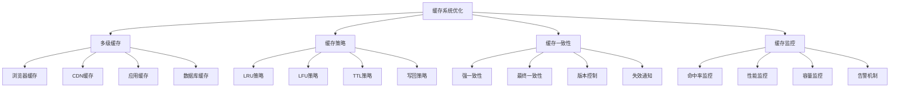

# 缓存系统优化

## 🎯 学习目标
- 理解缓存系统优化的基本原理和方法
- 掌握多级缓存系统的设计和实现
- 学会缓存性能分析和优化策略
- 了解缓存系统的最佳实践

## 📚 核心概念

### 缓存系统优化架构



### 缓存类型对比

| 缓存类型 | 特点 | 适用场景 | 优缺点 |
|----------|------|----------|--------|
| 内存缓存 | 速度快，容量小 | 热点数据 | 速度快但易丢失 |
| 磁盘缓存 | 容量大，速度慢 | 冷数据 | 容量大但速度慢 |
| 分布式缓存 | 可扩展，复杂 | 大规模应用 | 可扩展但复杂 |
| 数据库缓存 | 持久化，性能中等 | 查询结果 | 持久化但性能一般 |

## 🔧 缓存系统优化实现

### 基础缓存优化
```php
<?php
// 1. 多级缓存管理器
class MultiLevelCacheManager {
    private array $caches = [];
    private array $config = [];
    private array $stats = [];
    
    public function __construct(array $config = []) {
        $this->config = $config;
        $this->initializeCaches();
    }
    
    // 初始化缓存层
    private function initializeCaches(): void {
        // L1: 内存缓存
        $this->caches['l1'] = new MemoryCache([
            'max_size' => 1000,
            'ttl' => 300
        ]);
        
        // L2: Redis缓存
        $this->caches['l2'] = new RedisCache([
            'host' => 'localhost',
            'port' => 6379,
            'ttl' => 3600
        ]);
        
        // L3: 数据库缓存
        $this->caches['l3'] = new DatabaseCache([
            'table' => 'cache_table',
            'ttl' => 86400
        ]);
    }
    
    // 获取缓存
    public function get(string $key): mixed {
        $startTime = microtime(true);
        
        // 从L1开始查找
        foreach (['l1', 'l2', 'l3'] as $level) {
            $value = $this->caches[$level]->get($key);
            
            if ($value !== null) {
                // 更新统计
                $this->updateStats($level, 'hit');
                
                // 回填到上层缓存
                $this->backfill($key, $value, $level);
                
                $this->updateStats('total', 'hit', microtime(true) - $startTime);
                return $value;
            }
            
            $this->updateStats($level, 'miss');
        }
        
        $this->updateStats('total', 'miss', microtime(true) - $startTime);
        return null;
    }
    
    // 设置缓存
    public function set(string $key, mixed $value, int $ttl = null): bool {
        $success = true;
        
        // 设置到所有缓存层
        foreach (['l1', 'l2', 'l3'] as $level) {
            if (!$this->caches[$level]->set($key, $value, $ttl)) {
                $success = false;
            }
        }
        
        return $success;
    }
    
    // 删除缓存
    public function delete(string $key): bool {
        $success = true;
        
        // 从所有缓存层删除
        foreach (['l1', 'l2', 'l3'] as $level) {
            if (!$this->caches[$level]->delete($key)) {
                $success = false;
            }
        }
        
        return $success;
    }
    
    // 回填缓存
    private function backfill(string $key, mixed $value, string $foundLevel): void {
        $levels = ['l1', 'l2', 'l3'];
        $foundIndex = array_search($foundLevel, $levels);
        
        // 回填到上层缓存
        for ($i = 0; $i < $foundIndex; $i++) {
            $this->caches[$levels[$i]]->set($key, $value);
        }
    }
    
    // 更新统计
    private function updateStats(string $level, string $type, float $time = 0): void {
        if (!isset($this->stats[$level])) {
            $this->stats[$level] = [
                'hits' => 0,
                'misses' => 0,
                'total_time' => 0
            ];
        }
        
        $this->stats[$level][$type . 's']++;
        $this->stats[$level]['total_time'] += $time;
    }
    
    // 获取缓存统计
    public function getStats(): array {
        $stats = [];
        
        foreach ($this->stats as $level => $data) {
            $total = $data['hits'] + $data['misses'];
            $stats[$level] = [
                'hits' => $data['hits'],
                'misses' => $data['misses'],
                'hit_rate' => $total > 0 ? ($data['hits'] / $total) * 100 : 0,
                'average_time' => $data['hits'] > 0 ? $data['total_time'] / $data['hits'] : 0
            ];
        }
        
        return $stats;
    }
}

// 2. 缓存策略优化器
class CacheStrategyOptimizer {
    private array $strategies = [];
    private array $performance = [];
    
    // 添加缓存策略
    public function addStrategy(string $name, callable $strategy): void {
        $this->strategies[$name] = $strategy;
    }
    
    // LRU策略
    public function lruStrategy(): callable {
        return function($cache, $key, $value, $ttl = null) {
            // 实现LRU逻辑
            if ($cache->isFull()) {
                $cache->evictLRU();
            }
            return $cache->set($key, $value, $ttl);
        };
    }
    
    // LFU策略
    public function lfuStrategy(): callable {
        return function($cache, $key, $value, $ttl = null) {
            // 实现LFU逻辑
            if ($cache->isFull()) {
                $cache->evictLFU();
            }
            return $cache->set($key, $value, $ttl);
        };
    }
    
    // TTL策略
    public function ttlStrategy(int $defaultTtl = 3600): callable {
        return function($cache, $key, $value, $ttl = null) {
            $ttl = $ttl ?? $defaultTtl;
            return $cache->set($key, $value, $ttl);
        };
    }
    
    // 写回策略
    public function writeBackStrategy(): callable {
        return function($cache, $key, $value, $ttl = null) {
            // 只写入缓存，延迟写入后端
            $cache->set($key, $value, $ttl);
            $cache->markDirty($key);
            return true;
        };
    }
    
    // 测试策略性能
    public function testStrategyPerformance(string $strategyName, int $iterations = 1000): array {
        if (!isset($this->strategies[$strategyName])) {
            throw new Exception("策略不存在: $strategyName");
        }
        
        $strategy = $this->strategies[$strategyName];
        $cache = new MemoryCache(['max_size' => 100]);
        
        $startTime = microtime(true);
        $startMemory = memory_get_usage();
        
        for ($i = 0; $i < $iterations; $i++) {
            $key = "key_$i";
            $value = "value_$i";
            $strategy($cache, $key, $value);
        }
        
        $endTime = microtime(true);
        $endMemory = memory_get_usage();
        
        $performance = [
            'strategy' => $strategyName,
            'iterations' => $iterations,
            'execution_time' => $endTime - $startTime,
            'memory_used' => $endMemory - $startMemory,
            'operations_per_second' => $iterations / ($endTime - $startTime)
        ];
        
        $this->performance[$strategyName] = $performance;
        return $performance;
    }
    
    // 获取策略性能
    public function getStrategyPerformance(): array {
        return $this->performance;
    }
    
    // 比较策略性能
    public function compareStrategies(array $strategyNames): array {
        $comparison = [];
        
        foreach ($strategyNames as $name) {
            if (isset($this->performance[$name])) {
                $comparison[$name] = $this->performance[$name];
            }
        }
        
        // 按性能排序
        uasort($comparison, function($a, $b) {
            return $a['operations_per_second'] <=> $b['operations_per_second'];
        });
        
        return $comparison;
    }
}

// 3. 缓存一致性管理器
class CacheConsistencyManager {
    private array $caches = [];
    private array $versionControl = [];
    private array $invalidationRules = [];
    
    // 添加缓存
    public function addCache(string $name, $cache): void {
        $this->caches[$name] = $cache;
    }
    
    // 设置版本控制
    public function setVersionControl(string $key, int $version): void {
        $this->versionControl[$key] = $version;
    }
    
    // 获取版本
    public function getVersion(string $key): int {
        return $this->versionControl[$key] ?? 0;
    }
    
    // 强一致性更新
    public function strongConsistencyUpdate(string $key, mixed $value): bool {
        $newVersion = $this->getVersion($key) + 1;
        
        // 更新所有缓存
        $success = true;
        foreach ($this->caches as $name => $cache) {
            if (!$cache->set($key, $value)) {
                $success = false;
            }
        }
        
        if ($success) {
            $this->setVersionControl($key, $newVersion);
        }
        
        return $success;
    }
    
    // 最终一致性更新
    public function eventualConsistencyUpdate(string $key, mixed $value): bool {
        $newVersion = $this->getVersion($key) + 1;
        
        // 异步更新缓存
        $this->asyncUpdateCaches($key, $value, $newVersion);
        
        return true;
    }
    
    // 异步更新缓存
    private function asyncUpdateCaches(string $key, mixed $value, int $version): void {
        foreach ($this->caches as $name => $cache) {
            // 模拟异步更新
            $this->updateCacheAsync($cache, $key, $value, $version);
        }
    }
    
    // 模拟异步更新
    private function updateCacheAsync($cache, string $key, mixed $value, int $version): void {
        // 实际实现中应该使用消息队列或异步任务
        $cache->set($key, $value);
    }
    
    // 缓存失效
    public function invalidateCache(string $key): bool {
        $success = true;
        
        foreach ($this->caches as $name => $cache) {
            if (!$cache->delete($key)) {
                $success = false;
            }
        }
        
        return $success;
    }
    
    // 添加失效规则
    public function addInvalidationRule(string $pattern, callable $rule): void {
        $this->invalidationRules[$pattern] = $rule;
    }
    
    // 应用失效规则
    public function applyInvalidationRules(string $key): void {
        foreach ($this->invalidationRules as $pattern => $rule) {
            if (fnmatch($pattern, $key)) {
                $rule($key);
            }
        }
    }
}

// 使用示例
echo "=== 基础缓存优化示例 ===\n";

try {
    // 多级缓存管理器
    $cacheManager = new MultiLevelCacheManager();
    
    $cacheManager->set('user:123', ['name' => 'John', 'email' => 'john@example.com']);
    $user = $cacheManager->get('user:123');
    echo "用户数据: " . json_encode($user) . "\n";
    
    $stats = $cacheManager->getStats();
    echo "缓存统计: " . json_encode($stats) . "\n";
    
    // 缓存策略优化器
    $strategyOptimizer = new CacheStrategyOptimizer();
    
    $strategyOptimizer->addStrategy('lru', $strategyOptimizer->lruStrategy());
    $strategyOptimizer->addStrategy('lfu', $strategyOptimizer->lfuStrategy());
    $strategyOptimizer->addStrategy('ttl', $strategyOptimizer->ttlStrategy());
    
    $lruPerformance = $strategyOptimizer->testStrategyPerformance('lru', 1000);
    $lfuPerformance = $strategyOptimizer->testStrategyPerformance('lfu', 1000);
    $ttlPerformance = $strategyOptimizer->testStrategyPerformance('ttl', 1000);
    
    echo "LRU策略性能: " . json_encode($lruPerformance) . "\n";
    echo "LFU策略性能: " . json_encode($lfuPerformance) . "\n";
    echo "TTL策略性能: " . json_encode($ttlPerformance) . "\n";
    
    $comparison = $strategyOptimizer->compareStrategies(['lru', 'lfu', 'ttl']);
    echo "策略性能比较: " . json_encode($comparison) . "\n";
    
    // 缓存一致性管理器
    $consistencyManager = new CacheConsistencyManager();
    
    $consistencyManager->addCache('cache1', new MemoryCache());
    $consistencyManager->addCache('cache2', new MemoryCache());
    
    $consistencyManager->strongConsistencyUpdate('data:1', 'value1');
    $consistencyManager->eventualConsistencyUpdate('data:2', 'value2');
    
    echo "缓存一致性管理完成\n";
    
} catch (Exception $e) {
    echo "错误: " . $e->getMessage() . "\n";
}
?>
```

### 高级缓存优化
```php
<?php
// 1. 缓存性能监控器
class CachePerformanceMonitor {
    private array $metrics = [];
    private array $alerts = [];
    private array $thresholds = [];
    
    // 设置监控阈值
    public function setThreshold(string $metric, float $warning, float $critical): void {
        $this->thresholds[$metric] = [
            'warning' => $warning,
            'critical' => $critical
        ];
    }
    
    // 监控缓存命中率
    public function monitorHitRate(string $cacheName, float $hitRate): void {
        $this->metrics[$cacheName]['hit_rate'] = $hitRate;
        $this->checkThresholds($cacheName, 'hit_rate', $hitRate);
    }
    
    // 监控缓存性能
    public function monitorPerformance(string $cacheName, array $performance): void {
        $this->metrics[$cacheName]['performance'] = $performance;
        
        // 检查响应时间
        if (isset($performance['response_time'])) {
            $this->checkThresholds($cacheName, 'response_time', $performance['response_time']);
        }
        
        // 检查内存使用
        if (isset($performance['memory_usage'])) {
            $this->checkThresholds($cacheName, 'memory_usage', $performance['memory_usage']);
        }
    }
    
    // 监控缓存容量
    public function monitorCapacity(string $cacheName, array $capacity): void {
        $this->metrics[$cacheName]['capacity'] = $capacity;
        
        // 检查使用率
        if (isset($capacity['usage_percentage'])) {
            $this->checkThresholds($cacheName, 'capacity_usage', $capacity['usage_percentage']);
        }
    }
    
    // 检查阈值
    private function checkThresholds(string $cacheName, string $metric, float $value): void {
        $key = $cacheName . '_' . $metric;
        
        if (!isset($this->thresholds[$key])) {
            return;
        }
        
        $threshold = $this->thresholds[$key];
        $level = null;
        
        if ($value >= $threshold['critical']) {
            $level = 'critical';
        } elseif ($value >= $threshold['warning']) {
            $level = 'warning';
        }
        
        if ($level) {
            $this->triggerAlert($cacheName, $metric, $value, $level);
        }
    }
    
    // 触发告警
    private function triggerAlert(string $cacheName, string $metric, float $value, string $level): void {
        $alert = [
            'cache_name' => $cacheName,
            'metric' => $metric,
            'value' => $value,
            'level' => $level,
            'timestamp' => microtime(true)
        ];
        
        $this->alerts[] = $alert;
        echo "缓存告警: $cacheName - $metric = $value ($level)\n";
    }
    
    // 获取监控指标
    public function getMetrics(): array {
        return $this->metrics;
    }
    
    // 获取告警
    public function getAlerts(): array {
        return $this->alerts;
    }
    
    // 生成监控报告
    public function generateMonitorReport(): array {
        return [
            'timestamp' => microtime(true),
            'metrics' => $this->metrics,
            'alerts' => $this->alerts,
            'summary' => [
                'total_caches' => count($this->metrics),
                'total_alerts' => count($this->alerts),
                'critical_alerts' => count(array_filter($this->alerts, function($a) {
                    return $a['level'] === 'critical';
                })),
                'warning_alerts' => count(array_filter($this->alerts, function($a) {
                    return $a['level'] === 'warning';
                }))
            ]
        ];
    }
}

// 2. 智能缓存预加载器
class IntelligentCachePreloader {
    private array $patterns = [];
    private array $statistics = [];
    private array $predictions = [];
    
    // 添加访问模式
    public function addAccessPattern(string $pattern, array $data): void {
        $this->patterns[$pattern] = $data;
    }
    
    // 分析访问模式
    public function analyzeAccessPatterns(): array {
        $analysis = [];
        
        foreach ($this->patterns as $pattern => $data) {
            $analysis[$pattern] = [
                'access_count' => count($data),
                'unique_keys' => count(array_unique($data)),
                'access_frequency' => $this->calculateFrequency($data),
                'access_trend' => $this->calculateTrend($data),
                'hot_keys' => $this->identifyHotKeys($data)
            ];
        }
        
        return $analysis;
    }
    
    // 计算访问频率
    private function calculateFrequency(array $data): array {
        $frequency = array_count_values($data);
        arsort($frequency);
        return $frequency;
    }
    
    // 计算访问趋势
    private function calculateTrend(array $data): string {
        $count = count($data);
        if ($count < 2) {
            return 'stable';
        }
        
        $firstHalf = array_slice($data, 0, intval($count / 2));
        $secondHalf = array_slice($data, intval($count / 2));
        
        $firstCount = count($firstHalf);
        $secondCount = count($secondHalf);
        
        if ($secondCount > $firstCount * 1.2) {
            return 'increasing';
        } elseif ($secondCount < $firstCount * 0.8) {
            return 'decreasing';
        } else {
            return 'stable';
        }
    }
    
    // 识别热点键
    private function identifyHotKeys(array $data): array {
        $frequency = array_count_values($data);
        $total = count($data);
        $hotKeys = [];
        
        foreach ($frequency as $key => $count) {
            if ($count / $total > 0.1) { // 访问频率超过10%
                $hotKeys[] = $key;
            }
        }
        
        return $hotKeys;
    }
    
    // 预测访问模式
    public function predictAccessPatterns(): array {
        $predictions = [];
        
        foreach ($this->patterns as $pattern => $data) {
            $analysis = $this->analyzeAccessPatterns()[$pattern];
            
            $predictions[$pattern] = [
                'predicted_keys' => $this->predictKeys($data),
                'predicted_frequency' => $this->predictFrequency($data),
                'confidence' => $this->calculateConfidence($data),
                'recommendation' => $this->generateRecommendation($analysis)
            ];
        }
        
        $this->predictions = $predictions;
        return $predictions;
    }
    
    // 预测键
    private function predictKeys(array $data): array {
        // 简化的预测算法
        $frequency = array_count_values($data);
        $hotKeys = array_keys(array_slice($frequency, 0, 10, true));
        
        return $hotKeys;
    }
    
    // 预测频率
    private function predictFrequency(array $data): float {
        $count = count($data);
        $unique = count(array_unique($data));
        
        return $count / $unique;
    }
    
    // 计算置信度
    private function calculateConfidence(array $data): float {
        $count = count($data);
        $unique = count(array_unique($data));
        
        // 数据量越大，置信度越高
        $dataConfidence = min(1.0, $count / 1000);
        
        // 重复率越高，置信度越高
        $repeatConfidence = min(1.0, ($count - $unique) / $count);
        
        return ($dataConfidence + $repeatConfidence) / 2;
    }
    
    // 生成建议
    private function generateRecommendation(array $analysis): string {
        if ($analysis['access_trend'] === 'increasing') {
            return '建议增加缓存容量';
        } elseif ($analysis['access_trend'] === 'decreasing') {
            return '建议减少缓存容量';
        } else {
            return '缓存配置合理';
        }
    }
    
    // 获取预测结果
    public function getPredictions(): array {
        return $this->predictions;
    }
}

// 3. 缓存优化建议器
class CacheOptimizationAdvisor {
    private array $recommendations = [];
    private array $rules = [];
    
    // 添加优化规则
    public function addOptimizationRule(string $name, callable $condition, callable $suggestion): void {
        $this->rules[$name] = [
            'condition' => $condition,
            'suggestion' => $suggestion
        ];
    }
    
    // 分析缓存配置
    public function analyzeCacheConfiguration(array $config): array {
        $recommendations = [];
        
        foreach ($this->rules as $ruleName => $rule) {
            try {
                if ($rule['condition']($config)) {
                    $suggestion = $rule['suggestion']($config);
                    $recommendations[] = [
                        'rule' => $ruleName,
                        'suggestion' => $suggestion,
                        'priority' => $this->getPriority($ruleName)
                    ];
                }
            } catch (Exception $e) {
                echo "规则 $ruleName 执行失败: " . $e->getMessage() . "\n";
            }
        }
        
        // 按优先级排序
        usort($recommendations, function($a, $b) {
            return $b['priority'] <=> $a['priority'];
        });
        
        $this->recommendations = $recommendations;
        return $recommendations;
    }
    
    // 获取优先级
    private function getPriority(string $ruleName): int {
        $priorities = [
            'hit_rate_optimization' => 10,
            'memory_optimization' => 8,
            'ttl_optimization' => 6,
            'capacity_optimization' => 4,
            'strategy_optimization' => 2
        ];
        
        return $priorities[$ruleName] ?? 1;
    }
    
    // 初始化默认规则
    public function initializeDefaultRules(): void {
        // 命中率优化规则
        $this->addOptimizationRule(
            'hit_rate_optimization',
            function($config) {
                return ($config['hit_rate'] ?? 0) < 80;
            },
            function($config) {
                return '缓存命中率过低，建议优化缓存策略或增加缓存容量';
            }
        );
        
        // 内存优化规则
        $this->addOptimizationRule(
            'memory_optimization',
            function($config) {
                return ($config['memory_usage'] ?? 0) > 90;
            },
            function($config) {
                return '内存使用率过高，建议增加内存或优化数据存储';
            }
        );
        
        // TTL优化规则
        $this->addOptimizationRule(
            'ttl_optimization',
            function($config) {
                return ($config['ttl'] ?? 0) < 300;
            },
            function($config) {
                return 'TTL设置过短，建议增加TTL以减少缓存失效';
            }
        );
    }
    
    // 获取建议
    public function getRecommendations(): array {
        return $this->recommendations;
    }
}

// 使用示例
echo "=== 高级缓存优化示例 ===\n";

try {
    // 缓存性能监控器
    $monitor = new CachePerformanceMonitor();
    
    $monitor->setThreshold('cache1_hit_rate', 70, 50);
    $monitor->setThreshold('cache1_response_time', 100, 200);
    $monitor->setThreshold('cache1_capacity_usage', 80, 95);
    
    $monitor->monitorHitRate('cache1', 65.5);
    $monitor->monitorPerformance('cache1', [
        'response_time' => 150,
        'memory_usage' => 85
    ]);
    $monitor->monitorCapacity('cache1', [
        'usage_percentage' => 88
    ]);
    
    $report = $monitor->generateMonitorReport();
    echo "监控报告: " . json_encode($report) . "\n";
    
    // 智能缓存预加载器
    $preloader = new IntelligentCachePreloader();
    
    $preloader->addAccessPattern('user_data', [
        'user:1', 'user:2', 'user:1', 'user:3', 'user:1',
        'user:4', 'user:2', 'user:1', 'user:5', 'user:1'
    ]);
    
    $analysis = $preloader->analyzeAccessPatterns();
    echo "访问模式分析: " . json_encode($analysis) . "\n";
    
    $predictions = $preloader->predictAccessPatterns();
    echo "访问模式预测: " . json_encode($predictions) . "\n";
    
    // 缓存优化建议器
    $advisor = new CacheOptimizationAdvisor();
    $advisor->initializeDefaultRules();
    
    $config = [
        'hit_rate' => 65,
        'memory_usage' => 92,
        'ttl' => 180
    ];
    
    $recommendations = $advisor->analyzeCacheConfiguration($config);
    echo "优化建议: " . json_encode($recommendations) . "\n";
    
} catch (Exception $e) {
    echo "错误: " . $e->getMessage() . "\n";
}
?>
```

## 📊 最佳实践

### 缓存系统优化最佳实践
```php
<?php
// 缓存系统优化最佳实践

class CacheSystemOptimizationBestPractices {
    // 1. 多级缓存最佳实践
    public static function getMultiLevelCacheBestPractices() {
        return [
            '缓存层次设计' => [
                'L1缓存' => '使用内存缓存作为L1缓存，存储热点数据',
                'L2缓存' => '使用Redis作为L2缓存，提供持久化',
                'L3缓存' => '使用数据库作为L3缓存，保证数据一致性',
                '缓存回填' => '实现缓存回填机制提高命中率'
            ],
            '缓存策略' => [
                'LRU策略' => '使用LRU策略管理内存缓存',
                'TTL策略' => '设置合理的TTL避免数据过期',
                '写回策略' => '使用写回策略减少数据库压力',
                '失效策略' => '实现智能失效机制'
            ],
            '性能优化' => [
                '异步更新' => '使用异步更新提高响应速度',
                '批量操作' => '使用批量操作减少网络开销',
                '压缩存储' => '使用压缩减少存储空间',
                '连接池' => '使用连接池管理缓存连接'
            ]
        ];
    }
    
    // 2. 缓存一致性最佳实践
    public static function getCacheConsistencyBestPractices() {
        return [
            '一致性模型' => [
                '强一致性' => '在关键业务场景使用强一致性',
                '最终一致性' => '在非关键场景使用最终一致性',
                '版本控制' => '使用版本号控制缓存更新',
                '时间戳' => '使用时间戳判断数据新鲜度'
            ],
            '失效机制' => [
                '主动失效' => '数据更新时主动失效相关缓存',
                '被动失效' => '设置TTL让缓存自动失效',
                '模式失效' => '使用模式匹配批量失效',
                '依赖失效' => '建立依赖关系实现级联失效'
            ],
            '更新策略' => [
                '写穿透' => '使用写穿透策略保证数据一致性',
                '写回' => '使用写回策略提高写入性能',
                '异步更新' => '使用异步更新减少延迟',
                '批量更新' => '使用批量更新提高效率'
            ]
        ];
    }
    
    // 3. 缓存监控最佳实践
    public static function getCacheMonitoringBestPractices() {
        return [
            '性能监控' => [
                '命中率监控' => '监控缓存命中率指标',
                '响应时间监控' => '监控缓存响应时间',
                '吞吐量监控' => '监控缓存吞吐量',
                '错误率监控' => '监控缓存错误率'
            ],
            '容量监控' => [
                '内存使用监控' => '监控缓存内存使用情况',
                '存储空间监控' => '监控缓存存储空间',
                '连接数监控' => '监控缓存连接数',
                '队列长度监控' => '监控缓存队列长度'
            ],
            '告警机制' => [
                '阈值告警' => '设置合理的告警阈值',
                '趋势告警' => '监控性能趋势变化',
                '异常告警' => '检测异常访问模式',
                '恢复通知' => '设置恢复通知机制'
            ]
        ];
    }
    
    // 4. 缓存优化最佳实践
    public static function getCacheOptimizationBestPractices() {
        return [
            '容量优化' => [
                '容量规划' => '根据业务需求规划缓存容量',
                '动态扩容' => '实现动态扩容机制',
                '数据压缩' => '使用数据压缩减少存储',
                '过期清理' => '定期清理过期数据'
            ],
            '性能优化' => [
                '算法优化' => '选择高效的缓存算法',
                '数据结构优化' => '优化缓存数据结构',
                '网络优化' => '优化网络传输效率',
                '并发优化' => '优化并发访问性能'
            ],
            '可靠性优化' => [
                '故障转移' => '实现故障转移机制',
                '数据备份' => '实现缓存数据备份',
                '健康检查' => '定期进行健康检查',
                '自动恢复' => '实现自动恢复机制'
            ]
        ];
    }
}

// 使用示例
echo "=== 缓存系统优化最佳实践示例 ===\n";

try {
    $multiLevelPractices = CacheSystemOptimizationBestPractices::getMultiLevelCacheBestPractices();
    echo "多级缓存最佳实践:\n";
    foreach ($multiLevelPractices as $category => $practices) {
        echo "  $category:\n";
        foreach ($practices as $practice => $description) {
            echo "    - $practice: $description\n";
        }
        echo "\n";
    }
    
    $consistencyPractices = CacheSystemOptimizationBestPractices::getCacheConsistencyBestPractices();
    echo "缓存一致性最佳实践:\n";
    foreach ($consistencyPractices as $category => $practices) {
        echo "  $category:\n";
        foreach ($practices as $practice => $description) {
            echo "    - $practice: $description\n";
        }
        echo "\n";
    }
    
} catch (Exception $e) {
    echo "错误: " . $e->getMessage() . "\n";
}
?>
```

## 🎓 学习建议

### 费曼学习法应用
1. **选择概念**: 选择缓存系统优化中的核心概念
2. **简化解释**: 用简单语言解释缓存优化的重要性
3. **识别盲点**: 发现理解不深入的地方
4. **重新学习**: 针对盲点进行深入学习

### 刻意练习重点
1. **多级缓存**: 掌握多级缓存系统的设计和实现
2. **缓存策略**: 理解各种缓存策略的特点和适用场景
3. **一致性管理**: 学会缓存一致性的实现方法
4. **性能监控**: 培养缓存性能监控和优化的能力

## 🔗 相关链接
- [[01-代码性能优化|代码性能优化]]
- [[02-数据库性能调优|数据库性能调优]]
- [[03-服务器性能优化|服务器性能优化]]
- [[05-网络性能优化|网络性能优化]]
- [[06-性能测试与基准|性能测试与基准]]
- [[07-性能调优方法论|性能调优方法论]]
