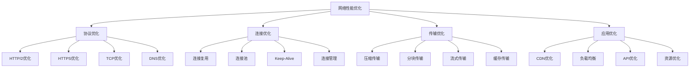

# 网络性能优化

## 🎯 学习目标
- 理解网络性能优化的基本原理和方法
- 掌握HTTP协议优化的实现技巧
- 学会网络性能分析和瓶颈识别
- 了解网络性能优化的最佳实践

## 📚 核心概念

### 网络性能优化架构



### 网络优化层次

| 优化层次 | 描述 | 影响范围 | 优化难度 |
|----------|------|----------|----------|
| 协议层 | 优化网络协议 | 全局 | 高 |
| 传输层 | 优化数据传输 | 全局 | 中 |
| 应用层 | 优化应用协议 | 局部 | 中 |
| 内容层 | 优化传输内容 | 局部 | 低 |

## 🔧 网络性能优化实现

### 基础网络优化
```php
<?php
// 1. HTTP协议优化器
class HTTPProtocolOptimizer {
    private array $config = [];
    private array $recommendations = [];
    
    // 分析HTTP配置
    public function analyzeHTTPConfig(): array {
        $config = [
            'version' => 'HTTP/1.1',
            'keep_alive' => true,
            'keep_alive_timeout' => 5,
            'max_keep_alive_requests' => 100,
            'compression' => false,
            'gzip_level' => 6,
            'chunked_encoding' => true,
            'pipeline' => false
        ];
        
        $this->config = $config;
        return $config;
    }
    
    // 分析HTTP/2配置
    public function analyzeHTTP2Config(): array {
        $config = [
            'version' => 'HTTP/2',
            'multiplexing' => true,
            'server_push' => false,
            'header_compression' => true,
            'stream_priority' => true,
            'flow_control' => true,
            'connection_window' => 65535,
            'stream_window' => 65535
        ];
        
        $this->config = $config;
        return $config;
    }
    
    // 生成HTTP优化建议
    public function generateHTTPRecommendations(): array {
        $recommendations = [];
        
        // HTTP版本升级建议
        if (isset($this->config['version']) && $this->config['version'] === 'HTTP/1.1') {
            $recommendations[] = [
                'type' => 'protocol_upgrade',
                'description' => '建议升级到HTTP/2以提高性能',
                'priority' => 'high',
                'impact' => 'significant',
                'benefits' => [
                    '多路复用',
                    '头部压缩',
                    '服务器推送',
                    '流优先级'
                ]
            ];
        }
        
        // 压缩优化建议
        if (!isset($this->config['compression']) || !$this->config['compression']) {
            $recommendations[] = [
                'type' => 'compression',
                'description' => '启用Gzip压缩以减少传输数据量',
                'priority' => 'high',
                'impact' => 'significant',
                'implementation' => [
                    '启用Gzip压缩',
                    '设置压缩级别',
                    '配置压缩类型'
                ]
            ];
        }
        
        // Keep-Alive优化建议
        if (isset($this->config['keep_alive_timeout']) && $this->config['keep_alive_timeout'] < 10) {
            $recommendations[] = [
                'type' => 'keep_alive',
                'description' => '增加Keep-Alive超时时间以提高连接复用',
                'priority' => 'medium',
                'impact' => 'moderate'
            ];
        }
        
        $this->recommendations = $recommendations;
        return $recommendations;
    }
    
    // 获取配置
    public function getConfig(): array {
        return $this->config;
    }
    
    // 获取建议
    public function getRecommendations(): array {
        return $this->recommendations;
    }
}

// 2. 连接优化器
class ConnectionOptimizer {
    private array $connections = [];
    private array $pool = [];
    private array $stats = [];
    
    // 创建连接池
    public function createConnectionPool(string $name, array $config): void {
        $this->pool[$name] = [
            'config' => $config,
            'connections' => [],
            'active' => 0,
            'idle' => 0,
            'max_connections' => $config['max_connections'] ?? 10,
            'min_connections' => $config['min_connections'] ?? 2,
            'timeout' => $config['timeout'] ?? 30
        ];
    }
    
    // 获取连接
    public function getConnection(string $poolName): ?array {
        if (!isset($this->pool[$poolName])) {
            return null;
        }
        
        $pool = &$this->pool[$poolName];
        
        // 尝试从空闲连接中获取
        if (!empty($pool['connections'])) {
            $connection = array_pop($pool['connections']);
            $pool['active']++;
            $pool['idle']--;
            
            $this->updateStats($poolName, 'reuse');
            return $connection;
        }
        
        // 创建新连接
        if ($pool['active'] < $pool['max_connections']) {
            $connection = $this->createNewConnection($poolName);
            if ($connection) {
                $pool['active']++;
                $this->updateStats($poolName, 'create');
                return $connection;
            }
        }
        
        $this->updateStats($poolName, 'fail');
        return null;
    }
    
    // 释放连接
    public function releaseConnection(string $poolName, array $connection): void {
        if (!isset($this->pool[$poolName])) {
            return;
        }
        
        $pool = &$this->pool[$poolName];
        
        // 检查连接是否有效
        if ($this->isConnectionValid($connection)) {
            $pool['connections'][] = $connection;
            $pool['active']--;
            $pool['idle']++;
            $this->updateStats($poolName, 'release');
        } else {
            $pool['active']--;
            $this->updateStats($poolName, 'invalid');
        }
    }
    
    // 创建新连接
    private function createNewConnection(string $poolName): ?array {
        $pool = $this->pool[$poolName];
        $config = $pool['config'];
        
        // 模拟创建连接
        $connection = [
            'id' => uniqid(),
            'created_at' => time(),
            'last_used' => time(),
            'requests' => 0,
            'status' => 'active'
        ];
        
        return $connection;
    }
    
    // 检查连接有效性
    private function isConnectionValid(array $connection): bool {
        $now = time();
        $timeout = $this->pool['timeout'] ?? 30;
        
        return ($now - $connection['last_used']) < $timeout;
    }
    
    // 更新统计
    private function updateStats(string $poolName, string $action): void {
        if (!isset($this->stats[$poolName])) {
            $this->stats[$poolName] = [
                'reuse' => 0,
                'create' => 0,
                'release' => 0,
                'fail' => 0,
                'invalid' => 0
            ];
        }
        
        $this->stats[$poolName][$action]++;
    }
    
    // 获取连接池状态
    public function getPoolStatus(string $poolName): ?array {
        if (!isset($this->pool[$poolName])) {
            return null;
        }
        
        $pool = $this->pool[$poolName];
        $stats = $this->stats[$poolName] ?? [];
        
        return [
            'name' => $poolName,
            'active' => $pool['active'],
            'idle' => $pool['idle'],
            'total' => $pool['active'] + $pool['idle'],
            'max_connections' => $pool['max_connections'],
            'utilization' => ($pool['active'] / $pool['max_connections']) * 100,
            'stats' => $stats
        ];
    }
    
    // 获取所有连接池状态
    public function getAllPoolStatus(): array {
        $status = [];
        
        foreach (array_keys($this->pool) as $poolName) {
            $status[$poolName] = $this->getPoolStatus($poolName);
        }
        
        return $status;
    }
}

// 3. 传输优化器
class TransmissionOptimizer {
    private array $compression = [];
    private array $chunking = [];
    private array $streaming = [];
    
    // 压缩优化
    public function optimizeCompression(array $data): array {
        $originalSize = strlen(serialize($data));
        $compressed = [];
        
        // Gzip压缩
        $gzipData = gzencode(serialize($data), 6);
        $gzipSize = strlen($gzipData);
        $compressed['gzip'] = [
            'data' => $gzipData,
            'original_size' => $originalSize,
            'compressed_size' => $gzipSize,
            'compression_ratio' => ($originalSize - $gzipSize) / $originalSize * 100
        ];
        
        // Deflate压缩
        $deflateData = gzdeflate(serialize($data), 6);
        $deflateSize = strlen($deflateData);
        $compressed['deflate'] = [
            'data' => $deflateData,
            'original_size' => $originalSize,
            'compressed_size' => $deflateSize,
            'compression_ratio' => ($originalSize - $deflateSize) / $originalSize * 100
        ];
        
        // Brotli压缩（模拟）
        $brotliData = gzencode(serialize($data), 9);
        $brotliSize = strlen($brotliData);
        $compressed['brotli'] = [
            'data' => $brotliData,
            'original_size' => $originalSize,
            'compressed_size' => $brotliSize,
            'compression_ratio' => ($originalSize - $brotliSize) / $originalSize * 100
        ];
        
        $this->compression = $compressed;
        return $compressed;
    }
    
    // 分块传输优化
    public function optimizeChunking(string $data, int $chunkSize = 8192): array {
        $chunks = str_split($data, $chunkSize);
        $chunked = [];
        
        foreach ($chunks as $index => $chunk) {
            $chunked[] = [
                'index' => $index,
                'size' => strlen($chunk),
                'data' => $chunk,
                'is_last' => $index === count($chunks) - 1
            ];
        }
        
        $this->chunking = $chunked;
        return $chunked;
    }
    
    // 流式传输优化
    public function optimizeStreaming(string $data, int $bufferSize = 4096): array {
        $stream = [
            'total_size' => strlen($data),
            'buffer_size' => $bufferSize,
            'chunks' => [],
            'metadata' => [
                'content_type' => 'application/octet-stream',
                'encoding' => 'chunked',
                'transfer_encoding' => 'chunked'
            ]
        ];
        
        $offset = 0;
        $chunkIndex = 0;
        
        while ($offset < strlen($data)) {
            $chunk = substr($data, $offset, $bufferSize);
            $stream['chunks'][] = [
                'index' => $chunkIndex,
                'offset' => $offset,
                'size' => strlen($chunk),
                'data' => $chunk
            ];
            
            $offset += $bufferSize;
            $chunkIndex++;
        }
        
        $this->streaming = $stream;
        return $stream;
    }
    
    // 获取压缩结果
    public function getCompressionResults(): array {
        return $this->compression;
    }
    
    // 获取分块结果
    public function getChunkingResults(): array {
        return $this->chunking;
    }
    
    // 获取流式结果
    public function getStreamingResults(): array {
        return $this->streaming;
    }
}

// 使用示例
echo "=== 基础网络优化示例 ===\n";

try {
    // HTTP协议优化器
    $httpOptimizer = new HTTPProtocolOptimizer();
    
    $httpConfig = $httpOptimizer->analyzeHTTPConfig();
    echo "HTTP配置: " . json_encode($httpConfig) . "\n";
    
    $http2Config = $httpOptimizer->analyzeHTTP2Config();
    echo "HTTP/2配置: " . json_encode($http2Config) . "\n";
    
    $httpRecommendations = $httpOptimizer->generateHTTPRecommendations();
    echo "HTTP优化建议: " . json_encode($httpRecommendations) . "\n";
    
    // 连接优化器
    $connectionOptimizer = new ConnectionOptimizer();
    
    $connectionOptimizer->createConnectionPool('web_server', [
        'max_connections' => 20,
        'min_connections' => 5,
        'timeout' => 60
    ]);
    
    // 模拟连接使用
    for ($i = 0; $i < 10; $i++) {
        $connection = $connectionOptimizer->getConnection('web_server');
        if ($connection) {
            // 模拟使用连接
            usleep(10000); // 10ms
            $connectionOptimizer->releaseConnection('web_server', $connection);
        }
    }
    
    $poolStatus = $connectionOptimizer->getPoolStatus('web_server');
    echo "连接池状态: " . json_encode($poolStatus) . "\n";
    
    // 传输优化器
    $transmissionOptimizer = new TransmissionOptimizer();
    
    $testData = str_repeat('Hello World! ', 1000);
    
    $compressionResults = $transmissionOptimizer->optimizeCompression(['data' => $testData]);
    echo "压缩优化结果: " . json_encode($compressionResults) . "\n";
    
    $chunkingResults = $transmissionOptimizer->optimizeChunking($testData, 1024);
    echo "分块传输结果: " . count($chunkingResults) . " 个块\n";
    
    $streamingResults = $transmissionOptimizer->optimizeStreaming($testData, 512);
    echo "流式传输结果: " . count($streamingResults['chunks']) . " 个流块\n";
    
} catch (Exception $e) {
    echo "错误: " . $e->getMessage() . "\n";
}
?>
```

### 高级网络优化
```php
<?php
// 1. CDN优化器
class CDNOptimizer {
    private array $nodes = [];
    private array $cache = [];
    private array $routing = [];
    
    // 添加CDN节点
    public function addCDNNode(string $id, string $region, array $config): void {
        $this->nodes[$id] = [
            'id' => $id,
            'region' => $region,
            'config' => $config,
            'status' => 'active',
            'load' => 0,
            'latency' => 0,
            'cache_hit_rate' => 0
        ];
    }
    
    // 选择最优节点
    public function selectOptimalNode(string $userRegion, string $contentType): ?string {
        $candidates = [];
        
        foreach ($this->nodes as $id => $node) {
            if ($node['status'] !== 'active') {
                continue;
            }
            
            $score = $this->calculateNodeScore($node, $userRegion, $contentType);
            $candidates[$id] = $score;
        }
        
        if (empty($candidates)) {
            return null;
        }
        
        arsort($candidates);
        return array_key_first($candidates);
    }
    
    // 计算节点分数
    private function calculateNodeScore(array $node, string $userRegion, string $contentType): float {
        $score = 100;
        
        // 地域距离分数
        $regionScore = $this->getRegionScore($node['region'], $userRegion);
        $score *= $regionScore;
        
        // 负载分数
        $loadScore = 1 - ($node['load'] / 100);
        $score *= $loadScore;
        
        // 延迟分数
        $latencyScore = max(0, 1 - ($node['latency'] / 1000));
        $score *= $latencyScore;
        
        // 缓存命中率分数
        $cacheScore = $node['cache_hit_rate'] / 100;
        $score *= $cacheScore;
        
        return $score;
    }
    
    // 获取地域分数
    private function getRegionScore(string $nodeRegion, string $userRegion): float {
        $regionScores = [
            'same' => 1.0,
            'nearby' => 0.8,
            'distant' => 0.5
        ];
        
        if ($nodeRegion === $userRegion) {
            return $regionScores['same'];
        } elseif ($this->isNearbyRegion($nodeRegion, $userRegion)) {
            return $regionScores['nearby'];
        } else {
            return $regionScores['distant'];
        }
    }
    
    // 判断是否为邻近地域
    private function isNearbyRegion(string $region1, string $region2): bool {
        $nearbyRegions = [
            'us-east' => ['us-west', 'ca-east'],
            'us-west' => ['us-east', 'ca-west'],
            'eu-west' => ['eu-central', 'eu-north'],
            'eu-central' => ['eu-west', 'eu-south'],
            'asia-east' => ['asia-southeast', 'asia-northeast'],
            'asia-southeast' => ['asia-east', 'asia-south']
        ];
        
        return in_array($region2, $nearbyRegions[$region1] ?? []);
    }
    
    // 缓存内容
    public function cacheContent(string $nodeId, string $url, string $content, int $ttl = 3600): bool {
        if (!isset($this->nodes[$nodeId])) {
            return false;
        }
        
        $this->cache[$nodeId][$url] = [
            'content' => $content,
            'cached_at' => time(),
            'ttl' => $ttl,
            'size' => strlen($content),
            'hits' => 0
        ];
        
        return true;
    }
    
    // 获取缓存内容
    public function getCachedContent(string $nodeId, string $url): ?string {
        if (!isset($this->cache[$nodeId][$url])) {
            return null;
        }
        
        $cached = $this->cache[$nodeId][$url];
        
        // 检查是否过期
        if (time() - $cached['cached_at'] > $cached['ttl']) {
            unset($this->cache[$nodeId][$url]);
            return null;
        }
        
        $this->cache[$nodeId][$url]['hits']++;
        return $cached['content'];
    }
    
    // 获取节点状态
    public function getNodeStatus(string $nodeId): ?array {
        if (!isset($this->nodes[$nodeId])) {
            return null;
        }
        
        $node = $this->nodes[$nodeId];
        $cacheStats = $this->getCacheStats($nodeId);
        
        return [
            'id' => $nodeId,
            'region' => $node['region'],
            'status' => $node['status'],
            'load' => $node['load'],
            'latency' => $node['latency'],
            'cache_hit_rate' => $node['cache_hit_rate'],
            'cache_stats' => $cacheStats
        ];
    }
    
    // 获取缓存统计
    private function getCacheStats(string $nodeId): array {
        if (!isset($this->cache[$nodeId])) {
            return [
                'total_items' => 0,
                'total_size' => 0,
                'total_hits' => 0
            ];
        }
        
        $totalItems = count($this->cache[$nodeId]);
        $totalSize = 0;
        $totalHits = 0;
        
        foreach ($this->cache[$nodeId] as $item) {
            $totalSize += $item['size'];
            $totalHits += $item['hits'];
        }
        
        return [
            'total_items' => $totalItems,
            'total_size' => $totalSize,
            'total_hits' => $totalHits
        ];
    }
}

// 2. 负载均衡优化器
class LoadBalancerOptimizer {
    private array $servers = [];
    private array $algorithms = [];
    private array $healthChecks = [];
    
    // 添加服务器
    public function addServer(string $id, string $address, int $weight = 1): void {
        $this->servers[$id] = [
            'id' => $id,
            'address' => $address,
            'weight' => $weight,
            'status' => 'healthy',
            'connections' => 0,
            'response_time' => 0,
            'cpu_usage' => 0,
            'memory_usage' => 0,
            'last_check' => time()
        ];
    }
    
    // 设置负载均衡算法
    public function setLoadBalancingAlgorithm(string $algorithm): void {
        $this->algorithms['current'] = $algorithm;
    }
    
    // 轮询算法
    public function roundRobin(): ?string {
        $healthyServers = array_filter($this->servers, function($server) {
            return $server['status'] === 'healthy';
        });
        
        if (empty($healthyServers)) {
            return null;
        }
        
        $serverIds = array_keys($healthyServers);
        $currentIndex = $this->algorithms['round_robin_index'] ?? 0;
        $selectedServer = $serverIds[$currentIndex % count($serverIds)];
        
        $this->algorithms['round_robin_index'] = $currentIndex + 1;
        return $selectedServer;
    }
    
    // 加权轮询算法
    public function weightedRoundRobin(): ?string {
        $healthyServers = array_filter($this->servers, function($server) {
            return $server['status'] === 'healthy';
        });
        
        if (empty($healthyServers)) {
            return null;
        }
        
        $totalWeight = array_sum(array_column($healthyServers, 'weight'));
        $random = mt_rand(1, $totalWeight);
        
        $currentWeight = 0;
        foreach ($healthyServers as $id => $server) {
            $currentWeight += $server['weight'];
            if ($random <= $currentWeight) {
                return $id;
            }
        }
        
        return array_key_first($healthyServers);
    }
    
    // 最少连接算法
    public function leastConnections(): ?string {
        $healthyServers = array_filter($this->servers, function($server) {
            return $server['status'] === 'healthy';
        });
        
        if (empty($healthyServers)) {
            return null;
        }
        
        $minConnections = min(array_column($healthyServers, 'connections'));
        $candidates = array_filter($healthyServers, function($server) use ($minConnections) {
            return $server['connections'] === $minConnections;
        });
        
        return array_key_first($candidates);
    }
    
    // 响应时间算法
    public function leastResponseTime(): ?string {
        $healthyServers = array_filter($this->servers, function($server) {
            return $server['status'] === 'healthy';
        });
        
        if (empty($healthyServers)) {
            return null;
        }
        
        $minResponseTime = min(array_column($healthyServers, 'response_time'));
        $candidates = array_filter($healthyServers, function($server) use ($minResponseTime) {
            return $server['response_time'] === $minResponseTime;
        });
        
        return array_key_first($candidates);
    }
    
    // 健康检查
    public function performHealthCheck(string $serverId): bool {
        if (!isset($this->servers[$serverId])) {
            return false;
        }
        
        $server = &$this->servers[$serverId];
        $startTime = microtime(true);
        
        // 模拟健康检查
        $isHealthy = true; // 实际应该发送HTTP请求检查
        
        $endTime = microtime(true);
        $responseTime = ($endTime - $startTime) * 1000; // 转换为毫秒
        
        $server['status'] = $isHealthy ? 'healthy' : 'unhealthy';
        $server['response_time'] = $responseTime;
        $server['last_check'] = time();
        
        return $isHealthy;
    }
    
    // 获取服务器状态
    public function getServerStatus(string $serverId): ?array {
        return $this->servers[$serverId] ?? null;
    }
    
    // 获取所有服务器状态
    public function getAllServerStatus(): array {
        return $this->servers;
    }
    
    // 生成负载均衡报告
    public function generateLoadBalancerReport(): array {
        $healthyServers = array_filter($this->servers, function($server) {
            return $server['status'] === 'healthy';
        });
        
        $totalConnections = array_sum(array_column($this->servers, 'connections'));
        $averageResponseTime = array_sum(array_column($this->servers, 'response_time')) / count($this->servers);
        $averageCpuUsage = array_sum(array_column($this->servers, 'cpu_usage')) / count($this->servers);
        $averageMemoryUsage = array_sum(array_column($this->servers, 'memory_usage')) / count($this->servers);
        
        return [
            'total_servers' => count($this->servers),
            'healthy_servers' => count($healthyServers),
            'unhealthy_servers' => count($this->servers) - count($healthyServers),
            'total_connections' => $totalConnections,
            'average_response_time' => $averageResponseTime,
            'average_cpu_usage' => $averageCpuUsage,
            'average_memory_usage' => $averageMemoryUsage,
            'current_algorithm' => $this->algorithms['current'] ?? 'round_robin',
            'servers' => $this->servers
        ];
    }
}

// 3. API性能优化器
class APIPerformanceOptimizer {
    private array $endpoints = [];
    private array $cache = [];
    private array $rateLimits = [];
    
    // 添加API端点
    public function addEndpoint(string $path, array $config): void {
        $this->endpoints[$path] = [
            'path' => $path,
            'config' => $config,
            'requests' => 0,
            'response_time' => 0,
            'cache_hits' => 0,
            'cache_misses' => 0
        ];
    }
    
    // 优化API响应
    public function optimizeAPIResponse(string $path, array $data, array $options = []): array {
        $endpoint = &$this->endpoints[$path];
        $endpoint['requests']++;
        
        $startTime = microtime(true);
        
        // 检查缓存
        $cacheKey = $this->generateCacheKey($path, $options);
        $cachedResponse = $this->getCachedResponse($cacheKey);
        
        if ($cachedResponse !== null) {
            $endpoint['cache_hits']++;
            $endpoint['response_time'] += microtime(true) - $startTime;
            return $cachedResponse;
        }
        
        $endpoint['cache_misses']++;
        
        // 处理数据
        $processedData = $this->processData($data, $options);
        
        // 缓存响应
        $this->cacheResponse($cacheKey, $processedData, $options['ttl'] ?? 300);
        
        $endpoint['response_time'] += microtime(true) - $startTime;
        return $processedData;
    }
    
    // 生成缓存键
    private function generateCacheKey(string $path, array $options): string {
        $keyData = [
            'path' => $path,
            'params' => $options['params'] ?? [],
            'user_id' => $options['user_id'] ?? 'anonymous'
        ];
        
        return md5(serialize($keyData));
    }
    
    // 获取缓存响应
    private function getCachedResponse(string $cacheKey): ?array {
        if (!isset($this->cache[$cacheKey])) {
            return null;
        }
        
        $cached = $this->cache[$cacheKey];
        
        // 检查是否过期
        if (time() - $cached['cached_at'] > $cached['ttl']) {
            unset($this->cache[$cacheKey]);
            return null;
        }
        
        return $cached['data'];
    }
    
    // 缓存响应
    private function cacheResponse(string $cacheKey, array $data, int $ttl): void {
        $this->cache[$cacheKey] = [
            'data' => $data,
            'cached_at' => time(),
            'ttl' => $ttl
        ];
    }
    
    // 处理数据
    private function processData(array $data, array $options): array {
        $processed = $data;
        
        // 数据过滤
        if (isset($options['fields'])) {
            $processed = array_intersect_key($processed, array_flip($options['fields']));
        }
        
        // 数据排序
        if (isset($options['sort'])) {
            $processed = $this->sortData($processed, $options['sort']);
        }
        
        // 数据分页
        if (isset($options['page']) && isset($options['limit'])) {
            $processed = $this->paginateData($processed, $options['page'], $options['limit']);
        }
        
        return $processed;
    }
    
    // 排序数据
    private function sortData(array $data, array $sort): array {
        $sortField = $sort['field'] ?? 'id';
        $sortDirection = $sort['direction'] ?? 'asc';
        
        usort($data, function($a, $b) use ($sortField, $sortDirection) {
            $valueA = $a[$sortField] ?? 0;
            $valueB = $b[$sortField] ?? 0;
            
            if ($sortDirection === 'desc') {
                return $valueB <=> $valueA;
            } else {
                return $valueA <=> $valueB;
            }
        });
        
        return $data;
    }
    
    // 分页数据
    private function paginateData(array $data, int $page, int $limit): array {
        $offset = ($page - 1) * $limit;
        return array_slice($data, $offset, $limit);
    }
    
    // 获取端点统计
    public function getEndpointStats(string $path): ?array {
        if (!isset($this->endpoints[$path])) {
            return null;
        }
        
        $endpoint = $this->endpoints[$path];
        $totalRequests = $endpoint['requests'];
        $cacheHits = $endpoint['cache_hits'];
        $cacheMisses = $endpoint['cache_misses'];
        
        return [
            'path' => $path,
            'total_requests' => $totalRequests,
            'cache_hits' => $cacheHits,
            'cache_misses' => $cacheMisses,
            'cache_hit_rate' => $totalRequests > 0 ? ($cacheHits / $totalRequests) * 100 : 0,
            'average_response_time' => $totalRequests > 0 ? $endpoint['response_time'] / $totalRequests : 0
        ];
    }
    
    // 获取所有端点统计
    public function getAllEndpointStats(): array {
        $stats = [];
        
        foreach (array_keys($this->endpoints) as $path) {
            $stats[$path] = $this->getEndpointStats($path);
        }
        
        return $stats;
    }
}

// 使用示例
echo "=== 高级网络优化示例 ===\n";

try {
    // CDN优化器
    $cdnOptimizer = new CDNOptimizer();
    
    $cdnOptimizer->addCDNNode('us-east-1', 'us-east', [
        'capacity' => '100GB',
        'bandwidth' => '1Gbps'
    ]);
    
    $cdnOptimizer->addCDNNode('eu-west-1', 'eu-west', [
        'capacity' => '80GB',
        'bandwidth' => '800Mbps'
    ]);
    
    $cdnOptimizer->addCDNNode('asia-east-1', 'asia-east', [
        'capacity' => '120GB',
        'bandwidth' => '1.2Gbps'
    ]);
    
    $optimalNode = $cdnOptimizer->selectOptimalNode('us-east', 'image');
    echo "最优CDN节点: $optimalNode\n";
    
    $nodeStatus = $cdnOptimizer->getNodeStatus('us-east-1');
    echo "节点状态: " . json_encode($nodeStatus) . "\n";
    
    // 负载均衡优化器
    $loadBalancer = new LoadBalancerOptimizer();
    
    $loadBalancer->addServer('web1', '192.168.1.10:80', 3);
    $loadBalancer->addServer('web2', '192.168.1.11:80', 2);
    $loadBalancer->addServer('web3', '192.168.1.12:80', 1);
    
    $loadBalancer->setLoadBalancingAlgorithm('least_connections');
    
    // 模拟请求分发
    for ($i = 0; $i < 10; $i++) {
        $selectedServer = $loadBalancer->leastConnections();
        if ($selectedServer) {
            $loadBalancer->servers[$selectedServer]['connections']++;
        }
    }
    
    $lbReport = $loadBalancer->generateLoadBalancerReport();
    echo "负载均衡报告: " . json_encode($lbReport) . "\n";
    
    // API性能优化器
    $apiOptimizer = new APIPerformanceOptimizer();
    
    $apiOptimizer->addEndpoint('/api/users', [
        'cache_ttl' => 300,
        'rate_limit' => 1000
    ]);
    
    $userData = [
        ['id' => 1, 'name' => 'John', 'email' => 'john@example.com'],
        ['id' => 2, 'name' => 'Jane', 'email' => 'jane@example.com'],
        ['id' => 3, 'name' => 'Bob', 'email' => 'bob@example.com']
    ];
    
    $response = $apiOptimizer->optimizeAPIResponse('/api/users', $userData, [
        'fields' => ['id', 'name'],
        'sort' => ['field' => 'name', 'direction' => 'asc'],
        'page' => 1,
        'limit' => 2,
        'ttl' => 300
    ]);
    
    echo "API响应: " . json_encode($response) . "\n";
    
    $endpointStats = $apiOptimizer->getEndpointStats('/api/users');
    echo "端点统计: " . json_encode($endpointStats) . "\n";
    
} catch (Exception $e) {
    echo "错误: " . $e->getMessage() . "\n";
}
?>
```

## 📊 最佳实践

### 网络性能优化最佳实践
```php
<?php
// 网络性能优化最佳实践

class NetworkPerformanceOptimizationBestPractices {
    // 1. 协议优化最佳实践
    public static function getProtocolOptimizationBestPractices() {
        return [
            'HTTP/2优化' => [
                '多路复用' => '利用HTTP/2的多路复用特性',
                '头部压缩' => '启用头部压缩减少传输数据',
                '服务器推送' => '使用服务器推送预加载资源',
                '流优先级' => '设置合理的流优先级'
            ],
            'HTTPS优化' => [
                '证书优化' => '使用高效的SSL证书',
                '会话复用' => '启用SSL会话复用',
                'OCSP装订' => '使用OCSP装订提高性能',
                'HSTS' => '启用HSTS提高安全性'
            ],
            'TCP优化' => [
                '拥塞控制' => '选择合适的拥塞控制算法',
                '窗口缩放' => '启用TCP窗口缩放',
                '时间戳' => '启用TCP时间戳',
                'SACK' => '启用选择性确认'
            ]
        ];
    }
    
    // 2. 连接优化最佳实践
    public static function getConnectionOptimizationBestPractices() {
        return [
            '连接复用' => [
                'Keep-Alive' => '启用HTTP Keep-Alive',
                '连接池' => '使用连接池管理连接',
                '连接复用' => '实现连接复用机制',
                '连接监控' => '监控连接使用情况'
            ],
            '连接管理' => [
                '超时设置' => '设置合理的连接超时',
                '重试机制' => '实现连接重试机制',
                '故障转移' => '实现连接故障转移',
                '健康检查' => '定期进行健康检查'
            ],
            '并发优化' => [
                '并发控制' => '控制并发连接数量',
                '队列管理' => '管理连接队列',
                '负载均衡' => '实现连接负载均衡',
                '资源限制' => '设置合理的资源限制'
            ]
        ];
    }
    
    // 3. 传输优化最佳实践
    public static function getTransmissionOptimizationBestPractices() {
        return [
            '压缩优化' => [
                'Gzip压缩' => '启用Gzip压缩减少传输数据',
                'Brotli压缩' => '使用Brotli压缩提高压缩率',
                '压缩级别' => '设置合适的压缩级别',
                '压缩类型' => '配置压缩文件类型'
            ],
            '分块传输' => [
                '分块编码' => '使用分块编码传输大文件',
                '流式传输' => '实现流式传输提高响应速度',
                '断点续传' => '支持断点续传功能',
                '传输监控' => '监控传输性能'
            ],
            '缓存传输' => [
                '浏览器缓存' => '设置合理的浏览器缓存',
                'CDN缓存' => '使用CDN缓存静态资源',
                '代理缓存' => '配置代理服务器缓存',
                '缓存策略' => '制定合理的缓存策略'
            ]
        ];
    }
    
    // 4. 应用优化最佳实践
    public static function getApplicationOptimizationBestPractices() {
        return [
            'CDN优化' => [
                '节点选择' => '选择最优的CDN节点',
                '缓存策略' => '制定合理的CDN缓存策略',
                '内容分发' => '优化内容分发策略',
                '性能监控' => '监控CDN性能指标'
            ],
            '负载均衡' => [
                '算法选择' => '选择合适的负载均衡算法',
                '健康检查' => '实现服务器健康检查',
                '故障转移' => '实现自动故障转移',
                '性能监控' => '监控负载均衡性能'
            ],
            'API优化' => [
                '响应优化' => '优化API响应时间',
                '缓存策略' => '实现API响应缓存',
                '数据压缩' => '压缩API响应数据',
                '版本控制' => '实现API版本控制'
            ]
        ];
    }
}

// 使用示例
echo "=== 网络性能优化最佳实践示例 ===\n";

try {
    $protocolPractices = NetworkPerformanceOptimizationBestPractices::getProtocolOptimizationBestPractices();
    echo "协议优化最佳实践:\n";
    foreach ($protocolPractices as $category => $practices) {
        echo "  $category:\n";
        foreach ($practices as $practice => $description) {
            echo "    - $practice: $description\n";
        }
        echo "\n";
    }
    
    $connectionPractices = NetworkPerformanceOptimizationBestPractices::getConnectionOptimizationBestPractices();
    echo "连接优化最佳实践:\n";
    foreach ($connectionPractices as $category => $practices) {
        echo "  $category:\n";
        foreach ($practices as $practice => $description) {
            echo "    - $practice: $description\n";
        }
        echo "\n";
    }
    
} catch (Exception $e) {
    echo "错误: " . $e->getMessage() . "\n";
}
?>
```

## 🎓 学习建议

### 费曼学习法应用
1. **选择概念**: 选择网络性能优化中的核心概念
2. **简化解释**: 用简单语言解释网络优化的重要性
3. **识别盲点**: 发现理解不深入的地方
4. **重新学习**: 针对盲点进行深入学习

### 刻意练习重点
1. **协议优化**: 掌握HTTP/2和HTTPS的优化方法
2. **连接优化**: 理解连接复用和连接池的实现
3. **传输优化**: 学会压缩和分块传输技术
4. **应用优化**: 培养CDN和负载均衡的优化能力

## 🔗 相关链接
- [[01-代码性能优化|代码性能优化]]
- [[02-数据库性能调优|数据库性能调优]]
- [[03-服务器性能优化|服务器性能优化]]
- [[04-缓存系统优化|缓存系统优化]]
- [[06-性能测试与基准|性能测试与基准]]
- [[07-性能调优方法论|性能调优方法论]]
