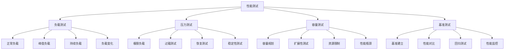

# 性能测试与基准

## 🎯 学习目标
- 理解性能测试的基本原理和方法
- 掌握基准测试的设计和实施
- 学会性能测试工具的使用
- 了解性能测试结果的分析和优化

## 📚 核心概念

### 性能测试架构



### 性能测试类型

| 测试类型 | 描述 | 目标 | 适用场景 |
|----------|------|------|----------|
| 负载测试 | 正常负载下的性能 | 验证性能指标 | 日常使用 |
| 压力测试 | 极限负载下的性能 | 找出性能瓶颈 | 高并发场景 |
| 容量测试 | 系统容量上限 | 确定容量限制 | 容量规划 |
| 基准测试 | 性能基准建立 | 建立性能基线 | 性能对比 |

## 🔧 性能测试实现

### 基础性能测试
```php
<?php
// 1. 性能测试框架
class PerformanceTestFramework {
    private array $tests = [];
    private array $results = [];
    private array $config = [];
    
    // 添加测试用例
    public function addTest(string $name, callable $test, array $config = []): void {
        $this->tests[$name] = [
            'test' => $test,
            'config' => array_merge([
                'iterations' => 1000,
                'warmup' => 100,
                'timeout' => 30
            ], $config)
        ];
    }
    
    // 运行所有测试
    public function runAllTests(): array {
        $this->results = [];
        
        foreach ($this->tests as $name => $test) {
            echo "运行测试: $name\n";
            $this->results[$name] = $this->runTest($name, $test);
        }
        
        return $this->results;
    }
    
    // 运行单个测试
    private function runTest(string $name, array $test): array {
        $config = $test['config'];
        $testFunction = $test['test'];
        
        // 预热
        for ($i = 0; $i < $config['warmup']; $i++) {
            $testFunction();
        }
        
        // 正式测试
        $times = [];
        $startTime = microtime(true);
        
        for ($i = 0; $i < $config['iterations']; $i++) {
            $iterStart = microtime(true);
            $testFunction();
            $iterEnd = microtime(true);
            $times[] = ($iterEnd - $iterStart) * 1000; // 转换为毫秒
        }
        
        $endTime = microtime(true);
        $totalTime = ($endTime - $startTime) * 1000;
        
        return $this->calculateStats($times, $totalTime, $config['iterations']);
    }
    
    // 计算统计信息
    private function calculateStats(array $times, float $totalTime, int $iterations): array {
        sort($times);
        
        $min = $times[0];
        $max = $times[count($times) - 1];
        $avg = array_sum($times) / count($times);
        $median = $times[intval(count($times) / 2)];
        
        // 计算百分位数
        $p95 = $times[intval(count($times) * 0.95)];
        $p99 = $times[intval(count($times) * 0.99)];
        
        // 计算标准差
        $variance = array_sum(array_map(function($x) use ($avg) {
            return pow($x - $avg, 2);
        }, $times)) / count($times);
        $stdDev = sqrt($variance);
        
        return [
            'iterations' => $iterations,
            'total_time' => $totalTime,
            'min_time' => $min,
            'max_time' => $max,
            'avg_time' => $avg,
            'median_time' => $median,
            'p95_time' => $p95,
            'p99_time' => $p99,
            'std_dev' => $stdDev,
            'ops_per_second' => $iterations / ($totalTime / 1000)
        ];
    }
    
    // 生成测试报告
    public function generateReport(): string {
        $report = "=== 性能测试报告 ===\n\n";
        
        foreach ($this->results as $name => $result) {
            $report .= "测试: $name\n";
            $report .= "  迭代次数: {$result['iterations']}\n";
            $report .= "  总时间: " . number_format($result['total_time'], 2) . "ms\n";
            $report .= "  平均时间: " . number_format($result['avg_time'], 2) . "ms\n";
            $report .= "  中位数: " . number_format($result['median_time'], 2) . "ms\n";
            $report .= "  P95: " . number_format($result['p95_time'], 2) . "ms\n";
            $report .= "  P99: " . number_format($result['p99_time'], 2) . "ms\n";
            $report .= "  标准差: " . number_format($result['std_dev'], 2) . "ms\n";
            $report .= "  每秒操作数: " . number_format($result['ops_per_second'], 2) . "\n\n";
        }
        
        return $report;
    }
}

// 2. 基准测试器
class BenchmarkTester {
    private array $benchmarks = [];
    private array $baselines = [];
    
    // 添加基准测试
    public function addBenchmark(string $name, callable $test, array $config = []): void {
        $this->benchmarks[$name] = [
            'test' => $test,
            'config' => array_merge([
                'iterations' => 10000,
                'warmup' => 1000
            ], $config)
        ];
    }
    
    // 运行基准测试
    public function runBenchmark(string $name): array {
        if (!isset($this->benchmarks[$name])) {
            throw new Exception("基准测试 '$name' 不存在");
        }
        
        $benchmark = $this->benchmarks[$name];
        $config = $benchmark['config'];
        $testFunction = $benchmark['test'];
        
        // 预热
        for ($i = 0; $i < $config['warmup']; $i++) {
            $testFunction();
        }
        
        // 正式测试
        $times = [];
        $startTime = microtime(true);
        
        for ($i = 0; $i < $config['iterations']; $i++) {
            $iterStart = microtime(true);
            $testFunction();
            $iterEnd = microtime(true);
            $times[] = ($iterEnd - $iterStart) * 1000;
        }
        
        $endTime = microtime(true);
        $totalTime = ($endTime - $startTime) * 1000;
        
        $result = $this->calculateBenchmarkStats($times, $totalTime, $config['iterations']);
        $this->baselines[$name] = $result;
        
        return $result;
    }
    
    // 计算基准统计
    private function calculateBenchmarkStats(array $times, float $totalTime, int $iterations): array {
        sort($times);
        
        $min = $times[0];
        $max = $times[count($times) - 1];
        $avg = array_sum($times) / count($times);
        $median = $times[intval(count($times) / 2)];
        
        $p95 = $times[intval(count($times) * 0.95)];
        $p99 = $times[intval(count($times) * 0.99)];
        
        return [
            'name' => '',
            'iterations' => $iterations,
            'total_time' => $totalTime,
            'min_time' => $min,
            'max_time' => $max,
            'avg_time' => $avg,
            'median_time' => $median,
            'p95_time' => $p95,
            'p99_time' => $p99,
            'ops_per_second' => $iterations / ($totalTime / 1000)
        ];
    }
    
    // 比较基准
    public function compareBenchmarks(string $baseline, string $current): array {
        if (!isset($this->baselines[$baseline]) || !isset($this->baselines[$current])) {
            throw new Exception("基准测试不存在");
        }
        
        $baselineResult = $this->baselines[$baseline];
        $currentResult = $this->baselines[$current];
        
        $comparison = [
            'baseline' => $baseline,
            'current' => $current,
            'avg_time_diff' => $currentResult['avg_time'] - $baselineResult['avg_time'],
            'avg_time_ratio' => $currentResult['avg_time'] / $baselineResult['avg_time'],
            'ops_per_second_diff' => $currentResult['ops_per_second'] - $baselineResult['ops_per_second'],
            'ops_per_second_ratio' => $currentResult['ops_per_second'] / $baselineResult['ops_per_second'],
            'performance_change' => $this->calculatePerformanceChange($baselineResult, $currentResult)
        ];
        
        return $comparison;
    }
    
    // 计算性能变化
    private function calculatePerformanceChange(array $baseline, array $current): string {
        $avgTimeRatio = $current['avg_time'] / $baseline['avg_time'];
        
        if ($avgTimeRatio < 0.95) {
            return '性能提升';
        } elseif ($avgTimeRatio > 1.05) {
            return '性能下降';
        } else {
            return '性能稳定';
        }
    }
    
    // 获取所有基准
    public function getAllBaselines(): array {
        return $this->baselines;
    }
}

// 使用示例
echo "=== 性能测试与基准示例 ===\n";

try {
    // 性能测试框架
    $testFramework = new PerformanceTestFramework();
    
    // 添加测试用例
    $testFramework->addTest('array_operations', function() {
        $arr = range(1, 1000);
        array_map(function($x) { return $x * 2; }, $arr);
        array_filter($arr, function($x) { return $x % 2 === 0; });
    }, ['iterations' => 1000]);
    
    $testFramework->addTest('string_operations', function() {
        $str = str_repeat('Hello World! ', 100);
        strtoupper($str);
        str_replace('World', 'PHP', $str);
        strlen($str);
    }, ['iterations' => 1000]);
    
    $testFramework->addTest('math_operations', function() {
        $sum = 0;
        for ($i = 0; $i < 1000; $i++) {
            $sum += sqrt($i) * sin($i) + cos($i);
        }
    }, ['iterations' => 1000]);
    
    // 运行测试
    $results = $testFramework->runAllTests();
    
    // 生成报告
    $report = $testFramework->generateReport();
    echo $report;
    
    // 基准测试器
    $benchmarkTester = new BenchmarkTester();
    
    // 添加基准测试
    $benchmarkTester->addBenchmark('baseline_array', function() {
        $arr = range(1, 100);
        array_sum($arr);
    });
    
    $benchmarkTester->addBenchmark('optimized_array', function() {
        $sum = 0;
        for ($i = 1; $i <= 100; $i++) {
            $sum += $i;
        }
    });
    
    // 运行基准测试
    $baselineResult = $benchmarkTester->runBenchmark('baseline_array');
    $optimizedResult = $benchmarkTester->runBenchmark('optimized_array');
    
    echo "基准测试结果:\n";
    echo "基线测试: " . json_encode($baselineResult) . "\n";
    echo "优化测试: " . json_encode($optimizedResult) . "\n";
    
    // 比较基准
    $comparison = $benchmarkTester->compareBenchmarks('baseline_array', 'optimized_array');
    echo "性能比较: " . json_encode($comparison) . "\n";
    
} catch (Exception $e) {
    echo "错误: " . $e->getMessage() . "\n";
}
?>
```

## 📊 最佳实践

### 性能测试最佳实践
```php
<?php
// 性能测试最佳实践

class PerformanceTestingBestPractices {
    // 1. 测试设计最佳实践
    public static function getTestDesignBestPractices() {
        return [
            '测试目标' => [
                '明确目标' => '明确性能测试的具体目标',
                '定义指标' => '定义关键性能指标(KPI)',
                '设定阈值' => '设定性能阈值和期望值',
                '测试范围' => '确定测试范围和边界条件'
            ],
            '测试环境' => [
                '环境一致性' => '确保测试环境与生产环境一致',
                '数据准备' => '准备真实和足够的测试数据',
                '环境隔离' => '确保测试环境隔离',
                '资源监控' => '监控测试环境资源使用'
            ],
            '测试用例' => [
                '用例覆盖' => '确保测试用例覆盖关键场景',
                '用例设计' => '设计有代表性的测试用例',
                '用例执行' => '按优先级执行测试用例',
                '用例维护' => '定期维护和更新测试用例'
            ]
        ];
    }
    
    // 2. 测试执行最佳实践
    public static function getTestExecutionBestPractices() {
        return [
            '测试准备' => [
                '环境检查' => '检查测试环境状态',
                '数据备份' => '备份重要测试数据',
                '工具准备' => '准备测试工具和脚本',
                '团队协调' => '协调测试团队和资源'
            ],
            '测试执行' => [
                '分阶段执行' => '分阶段执行测试',
                '实时监控' => '实时监控测试执行',
                '问题记录' => '记录测试中的问题',
                '结果收集' => '收集测试结果数据'
            ],
            '测试分析' => [
                '结果分析' => '分析测试结果数据',
                '问题定位' => '定位性能问题根源',
                '优化建议' => '提出性能优化建议',
                '报告编写' => '编写测试分析报告'
            ]
        ];
    }
    
    // 3. 基准测试最佳实践
    public static function getBenchmarkBestPractices() {
        return [
            '基准建立' => [
                '基准选择' => '选择有代表性的基准',
                '基准记录' => '详细记录基准数据',
                '基准验证' => '验证基准的准确性',
                '基准维护' => '定期维护和更新基准'
            ],
            '基准比较' => [
                '比较方法' => '使用科学的比较方法',
                '统计分析' => '进行统计分析',
                '趋势分析' => '分析性能趋势',
                '异常检测' => '检测性能异常'
            ],
            '基准应用' => [
                '性能监控' => '用于性能监控',
                '回归测试' => '用于回归测试',
                '容量规划' => '用于容量规划',
                '优化指导' => '指导性能优化'
            ]
        ];
    }
}

// 使用示例
echo "=== 性能测试最佳实践示例 ===\n";

try {
    $testDesignPractices = PerformanceTestingBestPractices::getTestDesignBestPractices();
    echo "测试设计最佳实践:\n";
    foreach ($testDesignPractices as $category => $practices) {
        echo "  $category:\n";
        foreach ($practices as $practice => $description) {
            echo "    - $practice: $description\n";
        }
        echo "\n";
    }
    
} catch (Exception $e) {
    echo "错误: " . $e->getMessage() . "\n";
}
?>
```

## 🎓 学习建议

### 费曼学习法应用
1. **选择概念**: 选择性能测试中的核心概念
2. **简化解释**: 用简单语言解释性能测试的重要性
3. **识别盲点**: 发现理解不深入的地方
4. **重新学习**: 针对盲点进行深入学习

### 刻意练习重点
1. **测试设计**: 掌握性能测试的设计方法
2. **测试执行**: 理解测试执行的流程和技巧
3. **结果分析**: 学会分析测试结果和识别问题
4. **基准建立**: 培养建立和维护基准的能力

## 🔗 相关链接
- [[01-代码性能优化|代码性能优化]]
- [[02-数据库性能调优|数据库性能调优]]
- [[03-服务器性能优化|服务器性能优化]]
- [[04-缓存系统优化|缓存系统优化]]
- [[05-网络性能优化|网络性能优化]]
- [[07-性能调优方法论|性能调优方法论]]
