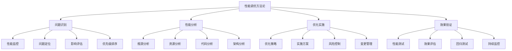

# 性能调优方法论

## 🎯 学习目标
- 理解性能调优的系统性方法论
- 掌握性能调优的流程和步骤
- 学会性能调优的工具和技术
- 了解性能调优的最佳实践和策略

## 📚 核心概念

### 性能调优方法论架构



### 性能调优流程

| 阶段 | 描述 | 关键活动 | 输出物 |
|------|------|----------|--------|
| 问题识别 | 识别性能问题 | 监控、分析、定位 | 问题清单 |
| 性能分析 | 深入分析问题 | 瓶颈分析、资源分析 | 分析报告 |
| 优化实施 | 实施优化方案 | 策略制定、方案实施 | 优化方案 |
| 效果验证 | 验证优化效果 | 测试、评估、监控 | 验证报告 |

## 🔧 性能调优方法论实现

### 基础性能调优方法论
```php
<?php
// 1. 性能调优方法论框架
class PerformanceOptimizationMethodology {
    private array $stages = [];
    private array $tools = [];
    private array $strategies = [];
    private array $metrics = [];
    
    // 初始化方法论
    public function __construct() {
        $this->initializeStages();
        $this->initializeTools();
        $this->initializeStrategies();
        $this->initializeMetrics();
    }
    
    // 初始化阶段
    private function initializeStages(): void {
        $this->stages = [
            'problem_identification' => [
                'name' => '问题识别',
                'description' => '识别和定位性能问题',
                'activities' => [
                    '性能监控',
                    '问题定位',
                    '影响评估',
                    '优先级排序'
                ],
                'tools' => ['monitoring', 'profiling', 'logging'],
                'output' => '问题清单和优先级'
            ],
            'performance_analysis' => [
                'name' => '性能分析',
                'description' => '深入分析性能问题',
                'activities' => [
                    '瓶颈分析',
                    '资源分析',
                    '代码分析',
                    '架构分析'
                ],
                'tools' => ['profiler', 'analyzer', 'debugger'],
                'output' => '分析报告和根因'
            ],
            'optimization_implementation' => [
                'name' => '优化实施',
                'description' => '实施性能优化方案',
                'activities' => [
                    '优化策略',
                    '实施方案',
                    '风险控制',
                    '变更管理'
                ],
                'tools' => ['optimizer', 'tester', 'deployer'],
                'output' => '优化方案和实施结果'
            ],
            'effect_verification' => [
                'name' => '效果验证',
                'description' => '验证优化效果',
                'activities' => [
                    '性能测试',
                    '效果评估',
                    '回归测试',
                    '持续监控'
                ],
                'tools' => ['tester', 'monitor', 'analyzer'],
                'output' => '验证报告和持续改进'
            ]
        ];
    }
    
    // 初始化工具
    private function initializeTools(): void {
        $this->tools = [
            'monitoring' => [
                'name' => '性能监控',
                'description' => '实时监控系统性能',
                'tools' => ['APM', '系统监控', '应用监控'],
                'metrics' => ['响应时间', '吞吐量', '错误率', '资源使用率']
            ],
            'profiling' => [
                'name' => '性能分析',
                'description' => '分析代码性能瓶颈',
                'tools' => ['XHProf', 'Blackfire', 'Tideways'],
                'metrics' => ['执行时间', '内存使用', '函数调用', 'SQL查询']
            ],
            'testing' => [
                'name' => '性能测试',
                'description' => '测试系统性能表现',
                'tools' => ['JMeter', 'LoadRunner', 'Gatling'],
                'metrics' => ['并发用户', '响应时间', '吞吐量', '资源使用']
            ],
            'optimization' => [
                'name' => '性能优化',
                'description' => '实施性能优化',
                'tools' => ['代码优化', '配置优化', '架构优化'],
                'metrics' => ['性能提升', '资源节约', '稳定性改善']
            ]
        ];
    }
    
    // 初始化策略
    private function initializeStrategies(): void {
        $this->strategies = [
            'code_optimization' => [
                'name' => '代码优化',
                'description' => '优化代码实现',
                'techniques' => [
                    '算法优化',
                    '数据结构优化',
                    '循环优化',
                    '函数优化'
                ],
                'impact' => 'high',
                'effort' => 'medium'
            ],
            'database_optimization' => [
                'name' => '数据库优化',
                'description' => '优化数据库性能',
                'techniques' => [
                    '查询优化',
                    '索引优化',
                    '连接优化',
                    '缓存优化'
                ],
                'impact' => 'high',
                'effort' => 'medium'
            ],
            'cache_optimization' => [
                'name' => '缓存优化',
                'description' => '优化缓存策略',
                'techniques' => [
                    '缓存策略',
                    '缓存层级',
                    '缓存失效',
                    '缓存预热'
                ],
                'impact' => 'high',
                'effort' => 'low'
            ],
            'architecture_optimization' => [
                'name' => '架构优化',
                'description' => '优化系统架构',
                'techniques' => [
                    '负载均衡',
                    '微服务',
                    'CDN',
                    '异步处理'
                ],
                'impact' => 'very_high',
                'effort' => 'high'
            ]
        ];
    }
    
    // 初始化指标
    private function initializeMetrics(): void {
        $this->metrics = [
            'response_time' => [
                'name' => '响应时间',
                'description' => '系统响应请求的时间',
                'unit' => 'ms',
                'target' => '< 200ms',
                'critical' => '> 1000ms'
            ],
            'throughput' => [
                'name' => '吞吐量',
                'description' => '系统处理请求的能力',
                'unit' => 'req/s',
                'target' => '> 1000 req/s',
                'critical' => '< 100 req/s'
            ],
            'error_rate' => [
                'name' => '错误率',
                'description' => '系统错误请求的比例',
                'unit' => '%',
                'target' => '< 0.1%',
                'critical' => '> 1%'
            ],
            'resource_usage' => [
                'name' => '资源使用率',
                'description' => '系统资源使用情况',
                'unit' => '%',
                'target' => '< 80%',
                'critical' => '> 95%'
            ]
        ];
    }
    
    // 执行性能调优流程
    public function executeOptimizationProcess(array $problems): array {
        $results = [];
        
        foreach ($this->stages as $stageId => $stage) {
            echo "执行阶段: {$stage['name']}\n";
            $results[$stageId] = $this->executeStage($stageId, $problems);
        }
        
        return $results;
    }
    
    // 执行单个阶段
    private function executeStage(string $stageId, array $problems): array {
        $stage = $this->stages[$stageId];
        $result = [
            'stage' => $stage['name'],
            'activities' => [],
            'output' => null,
            'status' => 'completed'
        ];
        
        foreach ($stage['activities'] as $activity) {
            $result['activities'][] = $this->executeActivity($activity, $problems);
        }
        
        $result['output'] = $this->generateStageOutput($stageId, $result['activities']);
        
        return $result;
    }
    
    // 执行活动
    private function executeActivity(string $activity, array $problems): array {
        return [
            'activity' => $activity,
            'status' => 'completed',
            'details' => "执行了 $activity 活动"
        ];
    }
    
    // 生成阶段输出
    private function generateStageOutput(string $stageId, array $activities): string {
        $stage = $this->stages[$stageId];
        return $stage['output'] . " - 基于 " . count($activities) . " 个活动";
    }
    
    // 获取阶段信息
    public function getStageInfo(string $stageId): ?array {
        return $this->stages[$stageId] ?? null;
    }
    
    // 获取工具信息
    public function getToolInfo(string $toolId): ?array {
        return $this->tools[$toolId] ?? null;
    }
    
    // 获取策略信息
    public function getStrategyInfo(string $strategyId): ?array {
        return $this->strategies[$strategyId] ?? null;
    }
    
    // 获取指标信息
    public function getMetricInfo(string $metricId): ?array {
        return $this->metrics[$metricId] ?? null;
    }
}

// 2. 性能调优策略选择器
class PerformanceOptimizationStrategySelector {
    private array $strategies = [];
    private array $criteria = [];
    
    // 添加优化策略
    public function addStrategy(string $id, array $strategy): void {
        $this->strategies[$id] = $strategy;
    }
    
    // 设置选择标准
    public function setCriteria(array $criteria): void {
        $this->criteria = $criteria;
    }
    
    // 选择最优策略
    public function selectOptimalStrategy(array $problem): array {
        $scores = [];
        
        foreach ($this->strategies as $id => $strategy) {
            $score = $this->calculateStrategyScore($strategy, $problem);
            $scores[$id] = $score;
        }
        
        arsort($scores);
        $bestStrategyId = array_key_first($scores);
        
        return [
            'strategy' => $this->strategies[$bestStrategyId],
            'score' => $scores[$bestStrategyId],
            'all_scores' => $scores
        ];
    }
    
    // 计算策略分数
    private function calculateStrategyScore(array $strategy, array $problem): float {
        $score = 0;
        
        // 影响分数
        $impactScore = $this->getImpactScore($strategy['impact']);
        $score += $impactScore * 0.4;
        
        // 努力分数（反向）
        $effortScore = $this->getEffortScore($strategy['effort']);
        $score += $effortScore * 0.3;
        
        // 适用性分数
        $applicabilityScore = $this->getApplicabilityScore($strategy, $problem);
        $score += $applicabilityScore * 0.3;
        
        return $score;
    }
    
    // 获取影响分数
    private function getImpactScore(string $impact): float {
        $impactScores = [
            'low' => 1,
            'medium' => 2,
            'high' => 3,
            'very_high' => 4
        ];
        
        return $impactScores[$impact] ?? 1;
    }
    
    // 获取努力分数（反向）
    private function getEffortScore(string $effort): float {
        $effortScores = [
            'low' => 4,
            'medium' => 3,
            'high' => 2,
            'very_high' => 1
        ];
        
        return $effortScores[$effort] ?? 1;
    }
    
    // 获取适用性分数
    private function getApplicabilityScore(array $strategy, array $problem): float {
        // 简化的适用性计算
        $applicability = 0;
        
        if (isset($problem['type']) && in_array($problem['type'], $strategy['applicable_types'] ?? [])) {
            $applicability += 2;
        }
        
        if (isset($problem['severity']) && $problem['severity'] === 'high') {
            $applicability += 1;
        }
        
        return $applicability;
    }
    
    // 获取所有策略
    public function getAllStrategies(): array {
        return $this->strategies;
    }
}

// 使用示例
echo "=== 性能调优方法论示例 ===\n";

try {
    // 性能调优方法论框架
    $methodology = new PerformanceOptimizationMethodology();
    
    // 获取阶段信息
    $stages = ['problem_identification', 'performance_analysis', 'optimization_implementation', 'effect_verification'];
    foreach ($stages as $stageId) {
        $stageInfo = $methodology->getStageInfo($stageId);
        echo "阶段: {$stageInfo['name']}\n";
        echo "描述: {$stageInfo['description']}\n";
        echo "活动: " . implode(', ', $stageInfo['activities']) . "\n\n";
    }
    
    // 获取工具信息
    $tools = ['monitoring', 'profiling', 'testing', 'optimization'];
    foreach ($tools as $toolId) {
        $toolInfo = $methodology->getToolInfo($toolId);
        echo "工具: {$toolInfo['name']}\n";
        echo "描述: {$toolInfo['description']}\n";
        echo "指标: " . implode(', ', $toolInfo['metrics']) . "\n\n";
    }
    
    // 获取策略信息
    $strategies = ['code_optimization', 'database_optimization', 'cache_optimization', 'architecture_optimization'];
    foreach ($strategies as $strategyId) {
        $strategyInfo = $methodology->getStrategyInfo($strategyId);
        echo "策略: {$strategyInfo['name']}\n";
        echo "描述: {$strategyInfo['description']}\n";
        echo "技术: " . implode(', ', $strategyInfo['techniques']) . "\n";
        echo "影响: {$strategyInfo['impact']}, 努力: {$strategyInfo['effort']}\n\n";
    }
    
    // 执行性能调优流程
    $problems = [
        ['type' => 'response_time', 'severity' => 'high'],
        ['type' => 'memory_usage', 'severity' => 'medium']
    ];
    
    $results = $methodology->executeOptimizationProcess($problems);
    echo "性能调优流程结果:\n";
    foreach ($results as $stageId => $result) {
        echo "  {$result['stage']}: {$result['status']}\n";
    }
    
    // 性能调优策略选择器
    $strategySelector = new PerformanceOptimizationStrategySelector();
    
    // 添加策略
    $strategySelector->addStrategy('cache', [
        'name' => '缓存优化',
        'impact' => 'high',
        'effort' => 'low',
        'applicable_types' => ['response_time', 'database']
    ]);
    
    $strategySelector->addStrategy('code', [
        'name' => '代码优化',
        'impact' => 'medium',
        'effort' => 'medium',
        'applicable_types' => ['response_time', 'memory_usage']
    ]);
    
    $strategySelector->addStrategy('database', [
        'name' => '数据库优化',
        'impact' => 'high',
        'effort' => 'high',
        'applicable_types' => ['database', 'response_time']
    ]);
    
    // 选择最优策略
    $problem = ['type' => 'response_time', 'severity' => 'high'];
    $optimalStrategy = $strategySelector->selectOptimalStrategy($problem);
    
    echo "最优策略: {$optimalStrategy['strategy']['name']}\n";
    echo "策略分数: {$optimalStrategy['score']}\n";
    echo "所有分数: " . json_encode($optimalStrategy['all_scores']) . "\n";
    
} catch (Exception $e) {
    echo "错误: " . $e->getMessage() . "\n";
}
?>
```

## 📊 最佳实践

### 性能调优最佳实践
```php
<?php
// 性能调优最佳实践

class PerformanceOptimizationBestPractices {
    // 1. 方法论最佳实践
    public static function getMethodologyBestPractices() {
        return [
            '系统性方法' => [
                '整体思维' => '从系统整体角度思考性能问题',
                '分层优化' => '按照系统层次进行优化',
                '优先级排序' => '根据影响和成本排序优化项目',
                '持续改进' => '建立持续改进机制'
            ],
            '数据驱动' => [
                '指标监控' => '建立完善的性能指标监控',
                '数据分析' => '基于数据进行性能分析',
                '基准建立' => '建立性能基准和对比',
                '效果测量' => '量化测量优化效果'
            ],
            '风险控制' => [
                '变更管理' => '严格控制性能优化变更',
                '回滚准备' => '准备优化失败的回滚方案',
                '影响评估' => '评估优化对系统的影响',
                '测试验证' => '充分测试验证优化效果'
            ]
        ];
    }
    
    // 2. 实施最佳实践
    public static function getImplementationBestPractices() {
        return [
            '渐进式优化' => [
                '小步快跑' => '采用小步快跑的优化方式',
                '快速验证' => '快速验证优化效果',
                '迭代改进' => '基于反馈迭代改进',
                '风险分散' => '分散优化风险'
            ],
            '团队协作' => [
                '跨部门协作' => '促进跨部门协作',
                '知识共享' => '建立知识共享机制',
                '经验总结' => '总结优化经验教训',
                '最佳实践' => '形成最佳实践库'
            ],
            '工具使用' => [
                '工具选择' => '选择合适的性能调优工具',
                '工具集成' => '集成多种调优工具',
                '自动化' => '实现性能调优自动化',
                '监控告警' => '建立监控告警机制'
            ]
        ];
    }
    
    // 3. 持续改进最佳实践
    public static function getContinuousImprovementBestPractices() {
        return [
            '性能监控' => [
                '实时监控' => '建立实时性能监控',
                '趋势分析' => '分析性能趋势变化',
                '异常检测' => '检测性能异常',
                '预警机制' => '建立性能预警机制'
            ],
            '知识管理' => [
                '经验积累' => '积累性能调优经验',
                '知识库' => '建立性能调优知识库',
                '培训体系' => '建立性能调优培训体系',
                '专家网络' => '建立专家网络'
            ],
            '流程优化' => [
                '流程标准化' => '标准化性能调优流程',
                '流程自动化' => '自动化性能调优流程',
                '流程改进' => '持续改进调优流程',
                '流程监控' => '监控流程执行效果'
            ]
        ];
    }
}

// 使用示例
echo "=== 性能调优最佳实践示例 ===\n";

try {
    $methodologyPractices = PerformanceOptimizationBestPractices::getMethodologyBestPractices();
    echo "方法论最佳实践:\n";
    foreach ($methodologyPractices as $category => $practices) {
        echo "  $category:\n";
        foreach ($practices as $practice => $description) {
            echo "    - $practice: $description\n";
        }
        echo "\n";
    }
    
} catch (Exception $e) {
    echo "错误: " . $e->getMessage() . "\n";
}
?>
```

## 🎓 学习建议

### 费曼学习法应用
1. **选择概念**: 选择性能调优方法论中的核心概念
2. **简化解释**: 用简单语言解释性能调优的重要性
3. **识别盲点**: 发现理解不深入的地方
4. **重新学习**: 针对盲点进行深入学习

### 刻意练习重点
1. **方法论掌握**: 掌握系统性的性能调优方法论
2. **工具使用**: 熟练使用各种性能调优工具
3. **策略选择**: 学会选择合适的优化策略
4. **持续改进**: 培养持续改进的思维和能力

## 🔗 相关链接
- [[01-代码性能优化|代码性能优化]]
- [[02-数据库性能调优|数据库性能调优]]
- [[03-服务器性能优化|服务器性能优化]]
- [[04-缓存系统优化|缓存系统优化]]
- [[05-网络性能优化|网络性能优化]]
- [[06-性能测试与基准|性能测试与基准]]
