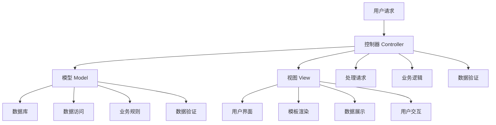

# MVC架构模式

## 🎯 学习目标
- 理解MVC架构模式的核心概念和原理
- 掌握MVC在PHP中的实现方法
- 学会MVC架构的设计和优化
- 了解MVC架构的最佳实践和常见问题

## 📚 核心概念

### MVC架构模式结构



### MVC组件职责

| 组件 | 职责 | 特点 | 示例 |
|------|------|------|------|
| Model | 数据模型和业务逻辑 | 数据访问、业务规则 | UserModel, ProductModel |
| View | 用户界面展示 | 模板渲染、数据展示 | user_list.php, product_detail.php |
| Controller | 请求处理和协调 | 路由、验证、协调 | UserController, ProductController |

## 🔧 MVC架构实现

### 基础MVC实现
```php
<?php
// 1. 基础MVC框架
class MVCFramework {
    private array $routes = [];
    private array $models = [];
    private array $views = [];
    private array $controllers = [];
    
    // 添加路由
    public function addRoute(string $method, string $path, string $controller, string $action): void {
        $this->routes[] = [
            'method' => strtoupper($method),
            'path' => $path,
            'controller' => $controller,
            'action' => $action
        ];
    }
    
    // 处理请求
    public function handleRequest(string $method, string $path): void {
        $route = $this->findRoute($method, $path);
        
        if (!$route) {
            $this->show404();
            return;
        }
        
        $controller = $this->getController($route['controller']);
        $action = $route['action'];
        
        if (!$controller || !method_exists($controller, $action)) {
            $this->show404();
            return;
        }
        
        $controller->$action();
    }
    
    // 查找路由
    private function findRoute(string $method, string $path): ?array {
        foreach ($this->routes as $route) {
            if ($route['method'] === strtoupper($method) && $route['path'] === $path) {
                return $route;
            }
        }
        return null;
    }
    
    // 获取控制器
    private function getController(string $controllerName): ?object {
        if (!isset($this->controllers[$controllerName])) {
            $controllerClass = $controllerName . 'Controller';
            if (class_exists($controllerClass)) {
                $this->controllers[$controllerName] = new $controllerClass();
            } else {
                return null;
            }
        }
        return $this->controllers[$controllerName];
    }
    
    // 显示404页面
    private function show404(): void {
        http_response_code(404);
        echo "404 - Page Not Found";
    }
}

// 2. 基础控制器类
abstract class BaseController {
    protected array $data = [];
    protected string $view = '';
    
    // 渲染视图
    protected function render(string $view, array $data = []): void {
        $this->view = $view;
        $this->data = array_merge($this->data, $data);
        
        // 提取数据到变量
        extract($this->data);
        
        // 包含视图文件
        $viewFile = "views/{$view}.php";
        if (file_exists($viewFile)) {
            include $viewFile;
        } else {
            echo "View not found: {$view}";
        }
    }
    
    // 重定向
    protected function redirect(string $url): void {
        header("Location: {$url}");
        exit;
    }
    
    // 获取POST数据
    protected function getPost(string $key = null, $default = null) {
        if ($key === null) {
            return $_POST;
        }
        return $_POST[$key] ?? $default;
    }
    
    // 获取GET数据
    protected function getGet(string $key = null, $default = null) {
        if ($key === null) {
            return $_GET;
        }
        return $_GET[$key] ?? $default;
    }
    
    // 验证CSRF令牌
    protected function validateCSRF(): bool {
        $token = $this->getPost('csrf_token');
        return $token && hash_equals($_SESSION['csrf_token'] ?? '', $token);
    }
    
    // 生成CSRF令牌
    protected function generateCSRF(): string {
        if (!isset($_SESSION['csrf_token'])) {
            $_SESSION['csrf_token'] = bin2hex(random_bytes(32));
        }
        return $_SESSION['csrf_token'];
    }
}

// 3. 基础模型类
abstract class BaseModel {
    protected $db;
    protected string $table = '';
    protected string $primaryKey = 'id';
    
    public function __construct() {
        $this->db = $this->getDatabase();
    }
    
    // 获取数据库连接
    protected function getDatabase() {
        // 模拟数据库连接
        return new stdClass();
    }
    
    // 查找所有记录
    public function findAll(array $conditions = []): array {
        // 模拟数据库查询
        return [];
    }
    
    // 根据ID查找
    public function findById(int $id): ?array {
        // 模拟数据库查询
        return null;
    }
    
    // 创建记录
    public function create(array $data): bool {
        // 模拟数据库插入
        return true;
    }
    
    // 更新记录
    public function update(int $id, array $data): bool {
        // 模拟数据库更新
        return true;
    }
    
    // 删除记录
    public function delete(int $id): bool {
        // 模拟数据库删除
        return true;
    }
    
    // 验证数据
    protected function validate(array $data): array {
        $errors = [];
        
        // 基础验证逻辑
        foreach ($data as $field => $value) {
            if (empty($value) && $field !== 'id') {
                $errors[$field] = "{$field} is required";
            }
        }
        
        return $errors;
    }
}

// 4. 用户控制器示例
class UserController extends BaseController {
    private UserModel $userModel;
    
    public function __construct() {
        $this->userModel = new UserModel();
    }
    
    // 用户列表
    public function index(): void {
        $users = $this->userModel->findAll();
        $this->render('user/index', ['users' => $users]);
    }
    
    // 显示用户详情
    public function show(): void {
        $id = (int) $this->getGet('id');
        $user = $this->userModel->findById($id);
        
        if (!$user) {
            $this->redirect('/user');
            return;
        }
        
        $this->render('user/show', ['user' => $user]);
    }
    
    // 显示创建用户表单
    public function create(): void {
        $this->render('user/create', ['csrf_token' => $this->generateCSRF()]);
    }
    
    // 处理创建用户
    public function store(): void {
        if (!$this->validateCSRF()) {
            $this->redirect('/user/create');
            return;
        }
        
        $data = [
            'name' => $this->getPost('name'),
            'email' => $this->getPost('email'),
            'password' => password_hash($this->getPost('password'), PASSWORD_DEFAULT)
        ];
        
        $errors = $this->userModel->validate($data);
        
        if (!empty($errors)) {
            $this->render('user/create', [
                'errors' => $errors,
                'data' => $data,
                'csrf_token' => $this->generateCSRF()
            ]);
            return;
        }
        
        if ($this->userModel->create($data)) {
            $this->redirect('/user');
        } else {
            $this->render('user/create', [
                'error' => 'Failed to create user',
                'data' => $data,
                'csrf_token' => $this->generateCSRF()
            ]);
        }
    }
    
    // 显示编辑用户表单
    public function edit(): void {
        $id = (int) $this->getGet('id');
        $user = $this->userModel->findById($id);
        
        if (!$user) {
            $this->redirect('/user');
            return;
        }
        
        $this->render('user/edit', [
            'user' => $user,
            'csrf_token' => $this->generateCSRF()
        ]);
    }
    
    // 处理更新用户
    public function update(): void {
        if (!$this->validateCSRF()) {
            $this->redirect('/user');
            return;
        }
        
        $id = (int) $this->getPost('id');
        $user = $this->userModel->findById($id);
        
        if (!$user) {
            $this->redirect('/user');
            return;
        }
        
        $data = [
            'name' => $this->getPost('name'),
            'email' => $this->getPost('email')
        ];
        
        // 如果提供了新密码，则更新密码
        $password = $this->getPost('password');
        if (!empty($password)) {
            $data['password'] = password_hash($password, PASSWORD_DEFAULT);
        }
        
        $errors = $this->userModel->validate($data);
        
        if (!empty($errors)) {
            $this->render('user/edit', [
                'user' => array_merge($user, $data),
                'errors' => $errors,
                'csrf_token' => $this->generateCSRF()
            ]);
            return;
        }
        
        if ($this->userModel->update($id, $data)) {
            $this->redirect('/user');
        } else {
            $this->render('user/edit', [
                'user' => array_merge($user, $data),
                'error' => 'Failed to update user',
                'csrf_token' => $this->generateCSRF()
            ]);
        }
    }
    
    // 删除用户
    public function delete(): void {
        if (!$this->validateCSRF()) {
            $this->redirect('/user');
            return;
        }
        
        $id = (int) $this->getPost('id');
        
        if ($this->userModel->delete($id)) {
            $this->redirect('/user');
        } else {
            $this->redirect('/user');
        }
    }
}

// 5. 用户模型示例
class UserModel extends BaseModel {
    protected string $table = 'users';
    
    // 重写验证方法
    protected function validate(array $data): array {
        $errors = parent::validate($data);
        
        // 验证邮箱格式
        if (isset($data['email']) && !filter_var($data['email'], FILTER_VALIDATE_EMAIL)) {
            $errors['email'] = 'Invalid email format';
        }
        
        // 验证密码强度
        if (isset($data['password']) && strlen($data['password']) < 6) {
            $errors['password'] = 'Password must be at least 6 characters';
        }
        
        return $errors;
    }
    
    // 根据邮箱查找用户
    public function findByEmail(string $email): ?array {
        // 模拟数据库查询
        return null;
    }
    
    // 验证用户登录
    public function validateLogin(string $email, string $password): ?array {
        $user = $this->findByEmail($email);
        
        if ($user && password_verify($password, $user['password'])) {
            return $user;
        }
        
        return null;
    }
}

// 使用示例
echo "=== MVC架构模式示例 ===\n";

try {
    // 创建MVC框架
    $framework = new MVCFramework();
    
    // 添加路由
    $framework->addRoute('GET', '/user', 'User', 'index');
    $framework->addRoute('GET', '/user/show', 'User', 'show');
    $framework->addRoute('GET', '/user/create', 'User', 'create');
    $framework->addRoute('POST', '/user/store', 'User', 'store');
    $framework->addRoute('GET', '/user/edit', 'User', 'edit');
    $framework->addRoute('POST', '/user/update', 'User', 'update');
    $framework->addRoute('POST', '/user/delete', 'User', 'delete');
    
    // 模拟处理请求
    echo "MVC框架已配置，包含以下路由:\n";
    echo "- GET /user - 用户列表\n";
    echo "- GET /user/show - 显示用户详情\n";
    echo "- GET /user/create - 显示创建用户表单\n";
    echo "- POST /user/store - 处理创建用户\n";
    echo "- GET /user/edit - 显示编辑用户表单\n";
    echo "- POST /user/update - 处理更新用户\n";
    echo "- POST /user/delete - 删除用户\n";
    
    // 测试用户模型
    $userModel = new UserModel();
    
    $testData = [
        'name' => 'John Doe',
        'email' => 'john@example.com',
        'password' => 'password123'
    ];
    
    $errors = $userModel->validate($testData);
    echo "用户数据验证结果: " . (empty($errors) ? '通过' : '失败') . "\n";
    
    if (!empty($errors)) {
        echo "验证错误: " . json_encode($errors) . "\n";
    }
    
} catch (Exception $e) {
    echo "错误: " . $e->getMessage() . "\n";
}
?>
```

## 📊 最佳实践

### MVC架构最佳实践
```php
<?php
// MVC架构最佳实践

class MVCBestPractices {
    // 1. 控制器最佳实践
    public static function getControllerBestPractices() {
        return [
            '单一职责' => [
                '职责明确' => '控制器只负责处理请求和协调',
                '业务逻辑' => '将业务逻辑放在模型中',
                '数据验证' => '在控制器中进行数据验证',
                '视图协调' => '协调模型和视图的交互'
            ],
            '代码组织' => [
                '方法命名' => '使用清晰的方法命名',
                '代码复用' => '提取公共逻辑到基类',
                '错误处理' => '统一错误处理机制',
                '日志记录' => '记录重要的操作日志'
            ],
            '安全性' => [
                'CSRF防护' => '实现CSRF令牌验证',
                '输入验证' => '验证所有用户输入',
                '权限控制' => '实现访问权限控制',
                '数据过滤' => '过滤敏感数据'
            ]
        ];
    }
    
    // 2. 模型最佳实践
    public static function getModelBestPractices() {
        return [
            '数据访问' => [
                '数据库抽象' => '使用数据库抽象层',
                '查询优化' => '优化数据库查询',
                '连接管理' => '合理管理数据库连接',
                '事务处理' => '使用事务保证数据一致性'
            ],
            '业务逻辑' => [
                '业务规则' => '将业务规则封装在模型中',
                '数据验证' => '在模型中进行数据验证',
                '关系管理' => '管理模型之间的关系',
                '缓存策略' => '实现适当的数据缓存'
            ],
            '代码质量' => [
                '代码复用' => '提取公共方法到基类',
                '错误处理' => '统一错误处理机制',
                '日志记录' => '记录数据操作日志',
                '测试覆盖' => '编写单元测试'
            ]
        ];
    }
    
    // 3. 视图最佳实践
    public static function getViewBestPractices() {
        return [
            '模板设计' => [
                '模板继承' => '使用模板继承减少重复',
                '组件化' => '将视图组件化',
                '数据绑定' => '实现数据绑定机制',
                '条件渲染' => '使用条件渲染逻辑'
            ],
            '用户体验' => [
                '响应式设计' => '实现响应式设计',
                '加载状态' => '显示加载状态',
                '错误提示' => '友好的错误提示',
                '表单验证' => '客户端表单验证'
            ],
            '性能优化' => [
                '资源压缩' => '压缩CSS和JavaScript',
                '图片优化' => '优化图片资源',
                '缓存策略' => '实现视图缓存',
                '懒加载' => '实现懒加载机制'
            ]
        ];
    }
}

// 使用示例
echo "=== MVC架构最佳实践示例 ===\n";

try {
    $controllerPractices = MVCBestPractices::getControllerBestPractices();
    echo "控制器最佳实践:\n";
    foreach ($controllerPractices as $category => $practices) {
        echo "  $category:\n";
        foreach ($practices as $practice => $description) {
            echo "    - $practice: $description\n";
        }
        echo "\n";
    }
    
} catch (Exception $e) {
    echo "错误: " . $e->getMessage() . "\n";
}
?>
```

## 🎓 学习建议

### 费曼学习法应用
1. **选择概念**: 选择MVC架构模式中的核心概念
2. **简化解释**: 用简单语言解释MVC的工作原理
3. **识别盲点**: 发现理解不深入的地方
4. **重新学习**: 针对盲点进行深入学习

### 刻意练习重点
1. **架构理解**: 深入理解MVC架构的设计思想
2. **代码实现**: 熟练实现MVC架构的各个组件
3. **最佳实践**: 掌握MVC架构的最佳实践
4. **问题解决**: 学会解决MVC架构中的常见问题

## 🔗 相关链接
- [[02-设计模式应用|设计模式应用]]
- [[03-SOLID原则|SOLID原则]]
- [[04-架构模式选择|架构模式选择]]
- [[05-代码重构技巧|代码重构技巧]]
- [[06-架构文档编写|架构文档编写]]
- [[07-架构演进策略|架构演进策略]]
