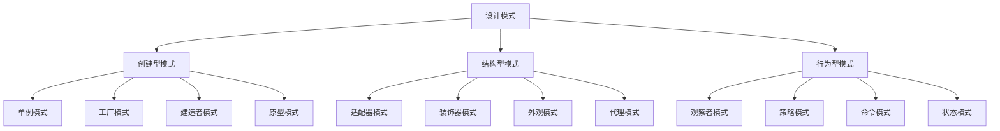

# 设计模式应用

## 🎯 学习目标
- 理解常用设计模式的核心概念和适用场景
- 掌握设计模式在PHP中的实现方法
- 学会在项目中合理应用设计模式
- 了解设计模式的最佳实践和反模式

## 📚 核心概念

### 设计模式分类



### 设计模式特点

| 模式类型 | 特点 | 适用场景 | 优势 |
|----------|------|----------|------|
| 创建型 | 对象创建 | 复杂对象创建 | 解耦创建过程 |
| 结构型 | 对象组合 | 对象结构设计 | 提高灵活性 |
| 行为型 | 对象交互 | 对象间通信 | 提高可维护性 |

## 🔧 设计模式实现

### 创建型模式
```php
<?php
// 1. 单例模式
class DatabaseConnection {
    private static ?DatabaseConnection $instance = null;
    private $connection;
    
    private function __construct() {
        $this->connection = $this->createConnection();
    }
    
    public static function getInstance(): DatabaseConnection {
        if (self::$instance === null) {
            self::$instance = new self();
        }
        return self::$instance;
    }
    
    private function createConnection() {
        // 模拟数据库连接
        return new stdClass();
    }
    
    public function getConnection() {
        return $this->connection;
    }
    
    // 防止克隆
    private function __clone() {}
    
    // 防止反序列化
    public function __wakeup() {
        throw new Exception("Cannot unserialize singleton");
    }
}

// 2. 工厂模式
interface ProductInterface {
    public function getName(): string;
    public function getPrice(): float;
}

class Book implements ProductInterface {
    private string $name;
    private float $price;
    
    public function __construct(string $name, float $price) {
        $this->name = $name;
        $this->price = $price;
    }
    
    public function getName(): string {
        return $this->name;
    }
    
    public function getPrice(): float {
        return $this->price;
    }
}

class Electronics implements ProductInterface {
    private string $name;
    private float $price;
    
    public function __construct(string $name, float $price) {
        $this->name = $name;
        $this->price = $price;
    }
    
    public function getName(): string {
        return $this->name;
    }
    
    public function getPrice(): float {
        return $this->price;
    }
}

class ProductFactory {
    public static function createProduct(string $type, string $name, float $price): ProductInterface {
        return match($type) {
            'book' => new Book($name, $price),
            'electronics' => new Electronics($name, $price),
            default => throw new InvalidArgumentException("Unknown product type: $type")
        };
    }
}

// 3. 建造者模式
class User {
    private string $name;
    private string $email;
    private int $age;
    private string $address;
    
    public function setName(string $name): void {
        $this->name = $name;
    }
    
    public function setEmail(string $email): void {
        $this->email = $email;
    }
    
    public function setAge(int $age): void {
        $this->age = $age;
    }
    
    public function setAddress(string $address): void {
        $this->address = $address;
    }
    
    public function getName(): string {
        return $this->name;
    }
    
    public function getEmail(): string {
        return $this->email;
    }
    
    public function getAge(): int {
        return $this->age;
    }
    
    public function getAddress(): string {
        return $this->address;
    }
}

class UserBuilder {
    private User $user;
    
    public function __construct() {
        $this->user = new User();
    }
    
    public function setName(string $name): UserBuilder {
        $this->user->setName($name);
        return $this;
    }
    
    public function setEmail(string $email): UserBuilder {
        $this->user->setEmail($email);
        return $this;
    }
    
    public function setAge(int $age): UserBuilder {
        $this->user->setAge($age);
        return $this;
    }
    
    public function setAddress(string $address): UserBuilder {
        $this->user->setAddress($address);
        return $this;
    }
    
    public function build(): User {
        return $this->user;
    }
}

// 使用示例
echo "=== 创建型模式示例 ===\n";

try {
    // 单例模式
    $db1 = DatabaseConnection::getInstance();
    $db2 = DatabaseConnection::getInstance();
    echo "单例模式测试: " . ($db1 === $db2 ? '成功' : '失败') . "\n";
    
    // 工厂模式
    $book = ProductFactory::createProduct('book', 'PHP Design Patterns', 29.99);
    $electronics = ProductFactory::createProduct('electronics', 'Laptop', 999.99);
    
    echo "工厂模式测试:\n";
    echo "书籍: {$book->getName()} - \${$book->getPrice()}\n";
    echo "电子产品: {$electronics->getName()} - \${$electronics->getPrice()}\n";
    
    // 建造者模式
    $user = (new UserBuilder())
        ->setName('John Doe')
        ->setEmail('john@example.com')
        ->setAge(30)
        ->setAddress('123 Main St')
        ->build();
    
    echo "建造者模式测试:\n";
    echo "用户: {$user->getName()}, 邮箱: {$user->getEmail()}, 年龄: {$user->getAge()}\n";
    
} catch (Exception $e) {
    echo "错误: " . $e->getMessage() . "\n";
}
?>
```

### 结构型模式
```php
<?php
// 1. 适配器模式
interface MediaPlayerInterface {
    public function play(string $audioType, string $fileName): void;
}

interface AdvancedMediaPlayerInterface {
    public function playVlc(string $fileName): void;
    public function playMp4(string $fileName): void;
}

class VlcPlayer implements AdvancedMediaPlayerInterface {
    public function playVlc(string $fileName): void {
        echo "Playing vlc file: $fileName\n";
    }
    
    public function playMp4(string $fileName): void {
        // 不支持MP4
    }
}

class Mp4Player implements AdvancedMediaPlayerInterface {
    public function playVlc(string $fileName): void {
        // 不支持VLC
    }
    
    public function playMp4(string $fileName): void {
        echo "Playing mp4 file: $fileName\n";
    }
}

class MediaAdapter implements MediaPlayerInterface {
    private AdvancedMediaPlayerInterface $advancedMusicPlayer;
    
    public function __construct(string $audioType) {
        $this->advancedMusicPlayer = match($audioType) {
            'vlc' => new VlcPlayer(),
            'mp4' => new Mp4Player(),
            default => throw new InvalidArgumentException("Unsupported audio type: $audioType")
        };
    }
    
    public function play(string $audioType, string $fileName): void {
        match($audioType) {
            'vlc' => $this->advancedMusicPlayer->playVlc($fileName),
            'mp4' => $this->advancedMusicPlayer->playMp4($fileName),
            default => throw new InvalidArgumentException("Unsupported audio type: $audioType")
        };
    }
}

// 2. 装饰器模式
interface CoffeeInterface {
    public function getCost(): float;
    public function getDescription(): string;
}

class SimpleCoffee implements CoffeeInterface {
    public function getCost(): float {
        return 2.0;
    }
    
    public function getDescription(): string {
        return "Simple coffee";
    }
}

abstract class CoffeeDecorator implements CoffeeInterface {
    protected CoffeeInterface $coffee;
    
    public function __construct(CoffeeInterface $coffee) {
        $this->coffee = $coffee;
    }
    
    public function getCost(): float {
        return $this->coffee->getCost();
    }
    
    public function getDescription(): string {
        return $this->coffee->getDescription();
    }
}

class MilkDecorator extends CoffeeDecorator {
    public function getCost(): float {
        return $this->coffee->getCost() + 0.5;
    }
    
    public function getDescription(): string {
        return $this->coffee->getDescription() . ", milk";
    }
}

class SugarDecorator extends CoffeeDecorator {
    public function getCost(): float {
        return $this->coffee->getCost() + 0.2;
    }
    
    public function getDescription(): string {
        return $this->coffee->getDescription() . ", sugar";
    }
}

// 3. 外观模式
class CPU {
    public function freeze(): void {
        echo "CPU freeze\n";
    }
    
    public function jump(int $position): void {
        echo "CPU jump to position: $position\n";
    }
    
    public function execute(): void {
        echo "CPU execute\n";
    }
}

class Memory {
    public function load(int $position, string $data): void {
        echo "Memory load data '$data' at position: $position\n";
    }
}

class HardDrive {
    public function read(int $lba, int $size): string {
        echo "HardDrive read $size bytes from LBA: $lba\n";
        return "boot data";
    }
}

class ComputerFacade {
    private CPU $cpu;
    private Memory $memory;
    private HardDrive $hardDrive;
    
    public function __construct() {
        $this->cpu = new CPU();
        $this->memory = new Memory();
        $this->hardDrive = new HardDrive();
    }
    
    public function startComputer(): void {
        echo "Starting computer...\n";
        $this->cpu->freeze();
        $bootData = $this->hardDrive->read(0, 1024);
        $this->memory->load(0, $bootData);
        $this->cpu->jump(0);
        $this->cpu->execute();
        echo "Computer started successfully!\n";
    }
}

// 使用示例
echo "=== 结构型模式示例 ===\n";

try {
    // 适配器模式
    $mediaAdapter = new MediaAdapter('vlc');
    $mediaAdapter->play('vlc', 'movie.vlc');
    
    $mediaAdapter = new MediaAdapter('mp4');
    $mediaAdapter->play('mp4', 'movie.mp4');
    
    // 装饰器模式
    $coffee = new SimpleCoffee();
    echo "咖啡: {$coffee->getDescription()}, 价格: \${$coffee->getCost()}\n";
    
    $coffee = new MilkDecorator($coffee);
    echo "咖啡: {$coffee->getDescription()}, 价格: \${$coffee->getCost()}\n";
    
    $coffee = new SugarDecorator($coffee);
    echo "咖啡: {$coffee->getDescription()}, 价格: \${$coffee->getCost()}\n";
    
    // 外观模式
    $computer = new ComputerFacade();
    $computer->startComputer();
    
} catch (Exception $e) {
    echo "错误: " . $e->getMessage() . "\n";
}
?>
```

### 行为型模式
```php
<?php
// 1. 观察者模式
interface ObserverInterface {
    public function update(string $message): void;
}

interface SubjectInterface {
    public function attach(ObserverInterface $observer): void;
    public function detach(ObserverInterface $observer): void;
    public function notify(string $message): void;
}

class NewsAgency implements SubjectInterface {
    private array $observers = [];
    private string $news = '';
    
    public function attach(ObserverInterface $observer): void {
        $this->observers[] = $observer;
    }
    
    public function detach(ObserverInterface $observer): void {
        $key = array_search($observer, $this->observers, true);
        if ($key !== false) {
            unset($this->observers[$key]);
        }
    }
    
    public function notify(string $message): void {
        foreach ($this->observers as $observer) {
            $observer->update($message);
        }
    }
    
    public function setNews(string $news): void {
        $this->news = $news;
        $this->notify($news);
    }
    
    public function getNews(): string {
        return $this->news;
    }
}

class NewsChannel implements ObserverInterface {
    private string $name;
    
    public function __construct(string $name) {
        $this->name = $name;
    }
    
    public function update(string $message): void {
        echo "{$this->name} received news: $message\n";
    }
}

// 2. 策略模式
interface PaymentStrategyInterface {
    public function pay(float $amount): void;
}

class CreditCardPayment implements PaymentStrategyInterface {
    private string $cardNumber;
    
    public function __construct(string $cardNumber) {
        $this->cardNumber = $cardNumber;
    }
    
    public function pay(float $amount): void {
        echo "Paid \$$amount using credit card ending in " . substr($this->cardNumber, -4) . "\n";
    }
}

class PayPalPayment implements PaymentStrategyInterface {
    private string $email;
    
    public function __construct(string $email) {
        $this->email = $email;
    }
    
    public function pay(float $amount): void {
        echo "Paid \$$amount using PayPal account: {$this->email}\n";
    }
}

class BankTransferPayment implements PaymentStrategyInterface {
    private string $accountNumber;
    
    public function __construct(string $accountNumber) {
        $this->accountNumber = $accountNumber;
    }
    
    public function pay(float $amount): void {
        echo "Paid \$$amount using bank transfer to account: {$this->accountNumber}\n";
    }
}

class PaymentContext {
    private PaymentStrategyInterface $strategy;
    
    public function setStrategy(PaymentStrategyInterface $strategy): void {
        $this->strategy = $strategy;
    }
    
    public function executePayment(float $amount): void {
        $this->strategy->pay($amount);
    }
}

// 3. 命令模式
interface CommandInterface {
    public function execute(): void;
    public function undo(): void;
}

class Light {
    private bool $isOn = false;
    
    public function turnOn(): void {
        $this->isOn = true;
        echo "Light is ON\n";
    }
    
    public function turnOff(): void {
        $this->isOn = false;
        echo "Light is OFF\n";
    }
    
    public function isOn(): bool {
        return $this->isOn;
    }
}

class LightOnCommand implements CommandInterface {
    private Light $light;
    
    public function __construct(Light $light) {
        $this->light = $light;
    }
    
    public function execute(): void {
        $this->light->turnOn();
    }
    
    public function undo(): void {
        $this->light->turnOff();
    }
}

class LightOffCommand implements CommandInterface {
    private Light $light;
    
    public function __construct(Light $light) {
        $this->light = $light;
    }
    
    public function execute(): void {
        $this->light->turnOff();
    }
    
    public function undo(): void {
        $this->light->turnOn();
    }
}

class RemoteControl {
    private array $commands = [];
    private ?CommandInterface $lastCommand = null;
    
    public function setCommand(int $slot, CommandInterface $command): void {
        $this->commands[$slot] = $command;
    }
    
    public function pressButton(int $slot): void {
        if (isset($this->commands[$slot])) {
            $this->commands[$slot]->execute();
            $this->lastCommand = $this->commands[$slot];
        }
    }
    
    public function pressUndo(): void {
        if ($this->lastCommand !== null) {
            $this->lastCommand->undo();
        }
    }
}

// 使用示例
echo "=== 行为型模式示例 ===\n";

try {
    // 观察者模式
    $newsAgency = new NewsAgency();
    $channel1 = new NewsChannel('CNN');
    $channel2 = new NewsChannel('BBC');
    
    $newsAgency->attach($channel1);
    $newsAgency->attach($channel2);
    
    $newsAgency->setNews('Breaking: New PHP version released!');
    
    // 策略模式
    $paymentContext = new PaymentContext();
    
    $paymentContext->setStrategy(new CreditCardPayment('1234567890123456'));
    $paymentContext->executePayment(100.0);
    
    $paymentContext->setStrategy(new PayPalPayment('user@example.com'));
    $paymentContext->executePayment(50.0);
    
    $paymentContext->setStrategy(new BankTransferPayment('9876543210'));
    $paymentContext->executePayment(200.0);
    
    // 命令模式
    $light = new Light();
    $lightOnCommand = new LightOnCommand($light);
    $lightOffCommand = new LightOffCommand($light);
    
    $remoteControl = new RemoteControl();
    $remoteControl->setCommand(0, $lightOnCommand);
    $remoteControl->setCommand(1, $lightOffCommand);
    
    $remoteControl->pressButton(0); // 开灯
    $remoteControl->pressButton(1); // 关灯
    $remoteControl->pressUndo();    // 撤销
    
} catch (Exception $e) {
    echo "错误: " . $e->getMessage() . "\n";
}
?>
```

## 📊 最佳实践

### 设计模式最佳实践
```php
<?php
// 设计模式最佳实践

class DesignPatternBestPractices {
    // 1. 模式选择最佳实践
    public static function getPatternSelectionBestPractices() {
        return [
            '问题识别' => [
                '分析问题' => '深入分析具体问题',
                '识别模式' => '识别适用的设计模式',
                '评估方案' => '评估不同模式的优劣',
                '选择模式' => '选择最适合的模式'
            ],
            '模式应用' => [
                '适度使用' => '避免过度使用设计模式',
                '简单优先' => '优先选择简单的解决方案',
                '可读性' => '保持代码的可读性',
                '维护性' => '考虑代码的维护性'
            ],
            '反模式避免' => [
                '避免过度设计' => '避免为了使用模式而使用',
                '避免复杂化' => '避免不必要的复杂性',
                '避免重复' => '避免重复实现相同功能',
                '避免耦合' => '避免过度耦合'
            ]
        ];
    }
    
    // 2. 实现最佳实践
    public static function getImplementationBestPractices() {
        return [
            '代码质量' => [
                '命名规范' => '使用清晰的命名规范',
                '注释文档' => '添加必要的注释和文档',
                '错误处理' => '实现完善的错误处理',
                '测试覆盖' => '编写充分的单元测试'
            ],
            '性能考虑' => [
                '性能影响' => '考虑模式对性能的影响',
                '内存使用' => '注意内存使用情况',
                '执行效率' => '优化执行效率',
                '资源管理' => '合理管理资源'
            ],
            '扩展性' => [
                '接口设计' => '设计良好的接口',
                '扩展点' => '预留扩展点',
                '版本兼容' => '考虑版本兼容性',
                '向后兼容' => '保持向后兼容'
            ]
        ];
    }
    
    // 3. 团队协作最佳实践
    public static function getTeamCollaborationBestPractices() {
        return [
            '知识共享' => [
                '模式库' => '建立设计模式知识库',
                '最佳实践' => '总结最佳实践',
                '代码审查' => '进行代码审查',
                '技术分享' => '定期技术分享'
            ],
            '标准化' => [
                '编码规范' => '制定编码规范',
                '模式标准' => '标准化模式使用',
                '文档规范' => '统一文档规范',
                '测试标准' => '建立测试标准'
            ],
            '持续改进' => [
                '经验总结' => '总结项目经验',
                '模式优化' => '优化模式实现',
                '工具改进' => '改进开发工具',
                '流程优化' => '优化开发流程'
            ]
        ];
    }
}

// 使用示例
echo "=== 设计模式最佳实践示例 ===\n";

try {
    $patternSelectionPractices = DesignPatternBestPractices::getPatternSelectionBestPractices();
    echo "模式选择最佳实践:\n";
    foreach ($patternSelectionPractices as $category => $practices) {
        echo "  $category:\n";
        foreach ($practices as $practice => $description) {
            echo "    - $practice: $description\n";
        }
        echo "\n";
    }
    
} catch (Exception $e) {
    echo "错误: " . $e->getMessage() . "\n";
}
?>
```

## 🎓 学习建议

### 费曼学习法应用
1. **选择概念**: 选择设计模式中的核心概念
2. **简化解释**: 用简单语言解释设计模式的作用
3. **识别盲点**: 发现理解不深入的地方
4. **重新学习**: 针对盲点进行深入学习

### 刻意练习重点
1. **模式理解**: 深入理解各种设计模式
2. **模式实现**: 熟练实现各种设计模式
3. **模式应用**: 学会在项目中应用设计模式
4. **模式优化**: 掌握模式优化的技巧

## 🔗 相关链接
- [[01-MVC架构模式|MVC架构模式]]
- [[03-SOLID原则|SOLID原则]]
- [[04-架构模式选择|架构模式选择]]
- [[05-代码重构技巧|代码重构技巧]]
- [[06-架构文档编写|架构文档编写]]
- [[07-架构演进策略|架构演进策略]]
