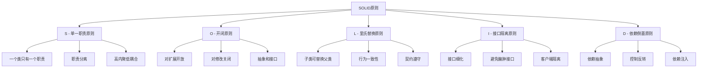

# SOLID原则

## 🎯 学习目标
- 理解SOLID原则的核心概念和重要性
- 掌握每个原则的具体应用方法
- 学会在PHP项目中实践SOLID原则
- 了解SOLID原则的最佳实践和常见违反

## 📚 核心概念

### SOLID原则架构



### SOLID原则特点

| 原则 | 英文 | 核心思想 | 主要收益 |
|------|------|----------|----------|
| S | Single Responsibility | 单一职责 | 高内聚、易维护 |
| O | Open/Closed | 开闭原则 | 易扩展、稳定 |
| L | Liskov Substitution | 里氏替换 | 多态、可替换 |
| I | Interface Segregation | 接口隔离 | 接口精简、解耦 |
| D | Dependency Inversion | 依赖倒置 | 松耦合、可测试 |

## 🔧 SOLID原则实现

### 单一职责原则 (SRP)
```php
<?php
// 违反SRP的示例
class User {
    private string $name;
    private string $email;
    
    public function __construct(string $name, string $email) {
        $this->name = $name;
        $this->email = $email;
    }
    
    // 用户数据管理
    public function getName(): string {
        return $this->name;
    }
    
    public function getEmail(): string {
        return $this->email;
    }
    
    // 违反SRP：数据库操作
    public function save(): bool {
        // 数据库保存逻辑
        echo "Saving user to database\n";
        return true;
    }
    
    // 违反SRP：邮件发送
    public function sendEmail(string $message): bool {
        // 邮件发送逻辑
        echo "Sending email to {$this->email}: $message\n";
        return true;
    }
    
    // 违反SRP：日志记录
    public function log(string $action): void {
        // 日志记录逻辑
        echo "Logging action: $action for user {$this->name}\n";
    }
}

// 遵循SRP的示例
class User {
    private string $name;
    private string $email;
    
    public function __construct(string $name, string $email) {
        $this->name = $name;
        $this->email = $email;
    }
    
    public function getName(): string {
        return $this->name;
    }
    
    public function getEmail(): string {
        return $this->email;
    }
    
    public function setName(string $name): void {
        $this->name = $name;
    }
    
    public function setEmail(string $email): void {
        $this->email = $email;
    }
}

// 用户数据访问层
class UserRepository {
    public function save(User $user): bool {
        echo "Saving user {$user->getName()} to database\n";
        return true;
    }
    
    public function findById(int $id): ?User {
        echo "Finding user by ID: $id\n";
        return null;
    }
    
    public function findByEmail(string $email): ?User {
        echo "Finding user by email: $email\n";
        return null;
    }
}

// 邮件服务
class EmailService {
    public function sendEmail(string $to, string $subject, string $message): bool {
        echo "Sending email to $to: $subject - $message\n";
        return true;
    }
}

// 日志服务
class Logger {
    public function log(string $level, string $message): void {
        echo "[$level] $message\n";
    }
}

// 使用示例
echo "=== 单一职责原则示例 ===\n";

try {
    // 遵循SRP的用法
    $user = new User('John Doe', 'john@example.com');
    $userRepository = new UserRepository();
    $emailService = new EmailService();
    $logger = new Logger();
    
    // 保存用户
    $userRepository->save($user);
    
    // 发送邮件
    $emailService->sendEmail($user->getEmail(), 'Welcome', 'Welcome to our service!');
    
    // 记录日志
    $logger->log('INFO', "User {$user->getName()} created successfully");
    
} catch (Exception $e) {
    echo "错误: " . $e->getMessage() . "\n";
}
?>
```

### 开闭原则 (OCP)
```php
<?php
// 违反OCP的示例
class AreaCalculator {
    public function calculate(array $shapes): float {
        $area = 0;
        
        foreach ($shapes as $shape) {
            // 违反OCP：每次添加新形状都需要修改这个方法
            if ($shape['type'] === 'rectangle') {
                $area += $shape['width'] * $shape['height'];
            } elseif ($shape['type'] === 'circle') {
                $area += pi() * $shape['radius'] * $shape['radius'];
            } elseif ($shape['type'] === 'triangle') {
                $area += 0.5 * $shape['base'] * $shape['height'];
            }
            // 添加新形状需要修改这里
        }
        
        return $area;
    }
}

// 遵循OCP的示例
interface ShapeInterface {
    public function area(): float;
}

class Rectangle implements ShapeInterface {
    private float $width;
    private float $height;
    
    public function __construct(float $width, float $height) {
        $this->width = $width;
        $this->height = $height;
    }
    
    public function area(): float {
        return $this->width * $this->height;
    }
}

class Circle implements ShapeInterface {
    private float $radius;
    
    public function __construct(float $radius) {
        $this->radius = $radius;
    }
    
    public function area(): float {
        return pi() * $this->radius * $this->radius;
    }
}

class Triangle implements ShapeInterface {
    private float $base;
    private float $height;
    
    public function __construct(float $base, float $height) {
        $this->base = $base;
        $this->height = $height;
    }
    
    public function area(): float {
        return 0.5 * $this->base * $this->height;
    }
}

// 遵循OCP：对扩展开放，对修改关闭
class AreaCalculator {
    public function calculate(array $shapes): float {
        $area = 0;
        
        foreach ($shapes as $shape) {
            if ($shape instanceof ShapeInterface) {
                $area += $shape->area();
            }
        }
        
        return $area;
    }
}

// 新增形状不需要修改现有代码
class Square implements ShapeInterface {
    private float $side;
    
    public function __construct(float $side) {
        $this->side = $side;
    }
    
    public function area(): float {
        return $this->side * $this->side;
    }
}

// 使用示例
echo "=== 开闭原则示例 ===\n";

try {
    $shapes = [
        new Rectangle(5, 4),
        new Circle(3),
        new Triangle(4, 6),
        new Square(5)
    ];
    
    $calculator = new AreaCalculator();
    $totalArea = $calculator->calculate($shapes);
    
    echo "总面积: $totalArea\n";
    
} catch (Exception $e) {
    echo "错误: " . $e->getMessage() . "\n";
}
?>
```

### 里氏替换原则 (LSP)
```php
<?php
// 违反LSP的示例
class Bird {
    public function fly(): void {
        echo "Bird is flying\n";
    }
    
    public function eat(): void {
        echo "Bird is eating\n";
    }
}

class Penguin extends Bird {
    // 违反LSP：企鹅不会飞，但继承了会飞的鸟
    public function fly(): void {
        throw new Exception("Penguins can't fly!");
    }
}

// 遵循LSP的示例
abstract class Bird {
    public function eat(): void {
        echo "Bird is eating\n";
    }
    
    public function move(): void {
        echo "Bird is moving\n";
    }
}

class FlyingBird extends Bird {
    public function fly(): void {
        echo "Bird is flying\n";
    }
    
    public function move(): void {
        $this->fly();
    }
}

class SwimmingBird extends Bird {
    public function swim(): void {
        echo "Bird is swimming\n";
    }
    
    public function move(): void {
        $this->swim();
    }
}

class Eagle extends FlyingBird {
    public function fly(): void {
        echo "Eagle is soaring high\n";
    }
}

class Penguin extends SwimmingBird {
    public function swim(): void {
        echo "Penguin is swimming gracefully\n";
    }
}

// 遵循LSP：子类可以替换父类
class BirdWatcher {
    public function watchBird(Bird $bird): void {
        $bird->eat();
        $bird->move();
    }
}

// 使用示例
echo "=== 里氏替换原则示例 ===\n";

try {
    $birdWatcher = new BirdWatcher();
    
    // 可以替换使用
    $eagle = new Eagle();
    $penguin = new Penguin();
    
    echo "观察老鹰:\n";
    $birdWatcher->watchBird($eagle);
    
    echo "\n观察企鹅:\n";
    $birdWatcher->watchBird($penguin);
    
} catch (Exception $e) {
    echo "错误: " . $e->getMessage() . "\n";
}
?>
```

### 接口隔离原则 (ISP)
```php
<?php
// 违反ISP的示例
interface WorkerInterface {
    public function work(): void;
    public function eat(): void;
    public function sleep(): void;
}

class HumanWorker implements WorkerInterface {
    public function work(): void {
        echo "Human is working\n";
    }
    
    public function eat(): void {
        echo "Human is eating\n";
    }
    
    public function sleep(): void {
        echo "Human is sleeping\n";
    }
}

class RobotWorker implements WorkerInterface {
    public function work(): void {
        echo "Robot is working\n";
    }
    
    // 违反ISP：机器人不需要吃和睡，但被迫实现这些方法
    public function eat(): void {
        throw new Exception("Robots don't eat!");
    }
    
    public function sleep(): void {
        throw new Exception("Robots don't sleep!");
    }
}

// 遵循ISP的示例
interface WorkableInterface {
    public function work(): void;
}

interface EatableInterface {
    public function eat(): void;
}

interface SleepableInterface {
    public function sleep(): void;
}

class HumanWorker implements WorkableInterface, EatableInterface, SleepableInterface {
    public function work(): void {
        echo "Human is working\n";
    }
    
    public function eat(): void {
        echo "Human is eating\n";
    }
    
    public function sleep(): void {
        echo "Human is sleeping\n";
    }
}

class RobotWorker implements WorkableInterface {
    public function work(): void {
        echo "Robot is working\n";
    }
}

// 遵循ISP：客户端只依赖需要的接口
class WorkManager {
    public function manageWork(WorkableInterface $worker): void {
        $worker->work();
    }
}

class BreakManager {
    public function manageBreak(EatableInterface $worker): void {
        $worker->eat();
    }
    
    public function manageSleep(SleepableInterface $worker): void {
        $worker->sleep();
    }
}

// 使用示例
echo "=== 接口隔离原则示例 ===\n";

try {
    $humanWorker = new HumanWorker();
    $robotWorker = new RobotWorker();
    
    $workManager = new WorkManager();
    $breakManager = new BreakManager();
    
    echo "管理人类工作:\n";
    $workManager->manageWork($humanWorker);
    $breakManager->manageBreak($humanWorker);
    $breakManager->manageSleep($humanWorker);
    
    echo "\n管理机器人工作:\n";
    $workManager->manageWork($robotWorker);
    // 机器人不需要休息
    
} catch (Exception $e) {
    echo "错误: " . $e->getMessage() . "\n";
}
?>
```

### 依赖倒置原则 (DIP)
```php
<?php
// 违反DIP的示例
class MySQLDatabase {
    public function save(string $data): void {
        echo "Saving to MySQL: $data\n";
    }
}

class UserService {
    private MySQLDatabase $database;
    
    public function __construct() {
        // 违反DIP：直接依赖具体实现
        $this->database = new MySQLDatabase();
    }
    
    public function saveUser(string $userData): void {
        $this->database->save($userData);
    }
}

// 遵循DIP的示例
interface DatabaseInterface {
    public function save(string $data): void;
    public function find(string $id): ?string;
}

class MySQLDatabase implements DatabaseInterface {
    public function save(string $data): void {
        echo "Saving to MySQL: $data\n";
    }
    
    public function find(string $id): ?string {
        echo "Finding in MySQL: $id\n";
        return "User data for $id";
    }
}

class PostgreSQLDatabase implements DatabaseInterface {
    public function save(string $data): void {
        echo "Saving to PostgreSQL: $data\n";
    }
    
    public function find(string $id): ?string {
        echo "Finding in PostgreSQL: $id\n";
        return "User data for $id";
    }
}

class UserService {
    private DatabaseInterface $database;
    
    // 遵循DIP：依赖抽象接口
    public function __construct(DatabaseInterface $database) {
        $this->database = $database;
    }
    
    public function saveUser(string $userData): void {
        $this->database->save($userData);
    }
    
    public function getUser(string $id): ?string {
        return $this->database->find($id);
    }
}

// 依赖注入容器
class Container {
    private array $services = [];
    
    public function register(string $name, callable $factory): void {
        $this->services[$name] = $factory;
    }
    
    public function get(string $name): object {
        if (!isset($this->services[$name])) {
            throw new Exception("Service $name not found");
        }
        
        return $this->services[$name]($this);
    }
}

// 使用示例
echo "=== 依赖倒置原则示例 ===\n";

try {
    // 使用MySQL数据库
    $mysqlDb = new MySQLDatabase();
    $userService1 = new UserService($mysqlDb);
    $userService1->saveUser("John Doe");
    
    // 使用PostgreSQL数据库
    $postgresDb = new PostgreSQLDatabase();
    $userService2 = new UserService($postgresDb);
    $userService2->saveUser("Jane Smith");
    
    // 使用依赖注入容器
    $container = new Container();
    $container->register('database', function() {
        return new MySQLDatabase();
    });
    $container->register('userService', function($container) {
        return new UserService($container->get('database'));
    });
    
    $userService3 = $container->get('userService');
    $userService3->saveUser("Bob Johnson");
    
} catch (Exception $e) {
    echo "错误: " . $e->getMessage() . "\n";
}
?>
```

## 📊 最佳实践

### SOLID原则最佳实践
```php
<?php
// SOLID原则最佳实践

class SOLIDBestPractices {
    // 1. 单一职责原则最佳实践
    public static function getSRPBestPractices() {
        return [
            '职责识别' => [
                '分析职责' => '分析类的所有职责',
                '职责分离' => '将不同职责分离到不同类',
                '高内聚' => '保持类内部的高内聚',
                '低耦合' => '减少类之间的耦合'
            ],
            '设计原则' => [
                '单一原因' => '类应该只有一个改变的原因',
                '功能聚焦' => '类应该专注于单一功能',
                '接口简洁' => '保持接口简洁明了',
                '测试友好' => '设计便于测试的类'
            ]
        ];
    }
    
    // 2. 开闭原则最佳实践
    public static function getOCPBestPractices() {
        return [
            '抽象设计' => [
                '接口抽象' => '使用接口定义抽象',
                '抽象类' => '使用抽象类提供通用实现',
                '多态性' => '利用多态性实现扩展',
                '策略模式' => '使用策略模式实现扩展'
            ],
            '扩展机制' => [
                '插件架构' => '设计插件式架构',
                '配置驱动' => '使用配置驱动行为',
                '事件系统' => '实现事件驱动系统',
                '钩子机制' => '提供钩子机制'
            ]
        ];
    }
    
    // 3. 里氏替换原则最佳实践
    public static function getLSPBestPractices() {
        return [
            '继承设计' => [
                '契约遵守' => '子类必须遵守父类契约',
                '行为一致' => '子类行为应该与父类一致',
                '前置条件' => '子类前置条件不能强于父类',
                '后置条件' => '子类后置条件不能弱于父类'
            ],
            '多态使用' => [
                '替换性' => '确保子类可以替换父类',
                '行为保持' => '保持行为的一致性',
                '异常处理' => '合理处理异常情况',
                '测试覆盖' => '充分测试多态行为'
            ]
        ];
    }
    
    // 4. 接口隔离原则最佳实践
    public static function getISPBestPractices() {
        return [
            '接口设计' => [
                '接口细化' => '将大接口细分为小接口',
                '功能聚焦' => '每个接口专注于特定功能',
                '客户端隔离' => '客户端不应该依赖不需要的接口',
                '接口组合' => '通过接口组合实现复杂功能'
            ],
            '实现策略' => [
                '按需实现' => '只实现需要的接口方法',
                '接口适配' => '使用适配器模式适配接口',
                '接口继承' => '合理使用接口继承',
                '接口文档' => '完善接口文档'
            ]
        ];
    }
    
    // 5. 依赖倒置原则最佳实践
    public static function getDIPBestPractices() {
        return [
            '依赖管理' => [
                '依赖抽象' => '依赖抽象而不是具体实现',
                '接口定义' => '定义清晰的接口',
                '依赖注入' => '使用依赖注入管理依赖',
                '控制反转' => '实现控制反转'
            ],
            '架构设计' => [
                '分层架构' => '设计清晰的分层架构',
                '服务定位' => '使用服务定位器模式',
                '工厂模式' => '使用工厂模式创建对象',
                '容器管理' => '使用容器管理依赖'
            ]
        ];
    }
}

// 使用示例
echo "=== SOLID原则最佳实践示例 ===\n";

try {
    $srpPractices = SOLIDBestPractices::getSRPBestPractices();
    echo "单一职责原则最佳实践:\n";
    foreach ($srpPractices as $category => $practices) {
        echo "  $category:\n";
        foreach ($practices as $practice => $description) {
            echo "    - $practice: $description\n";
        }
        echo "\n";
    }
    
} catch (Exception $e) {
    echo "错误: " . $e->getMessage() . "\n";
}
?>
```

## 🎓 学习建议

### 费曼学习法应用
1. **选择概念**: 选择SOLID原则中的核心概念
2. **简化解释**: 用简单语言解释每个原则的作用
3. **识别盲点**: 发现理解不深入的地方
4. **重新学习**: 针对盲点进行深入学习

### 刻意练习重点
1. **原则理解**: 深入理解每个SOLID原则
2. **原则应用**: 在项目中实践SOLID原则
3. **原则违反**: 识别和避免原则违反
4. **原则优化**: 优化代码以更好地遵循原则

## 🔗 相关链接
- [[01-MVC架构模式|MVC架构模式]]
- [[02-设计模式应用|设计模式应用]]
- [[04-架构模式选择|架构模式选择]]
- [[05-代码重构技巧|代码重构技巧]]
- [[06-架构文档编写|架构文档编写]]
- [[07-架构演进策略|架构演进策略]]
