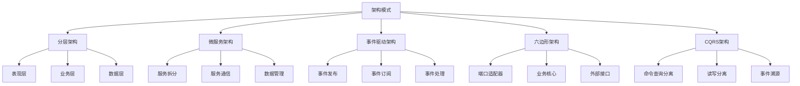

# 架构模式选择

## 🎯 学习目标
- 理解不同架构模式的特点和适用场景
- 掌握架构模式选择的方法和标准
- 学会在项目中应用合适的架构模式
- 了解架构模式演进和迁移策略

## 📚 核心概念

### 架构模式分类



### 架构模式特点

| 架构模式 | 特点 | 适用场景 | 优势 | 劣势 |
|----------|------|----------|------|------|
| 分层架构 | 简单清晰 | 中小型项目 | 易理解、易维护 | 性能瓶颈 |
| 微服务架构 | 服务独立 | 大型复杂系统 | 可扩展、可维护 | 复杂度高 |
| 事件驱动架构 | 异步解耦 | 高并发系统 | 高并发、松耦合 | 调试困难 |
| 六边形架构 | 业务核心 | 复杂业务系统 | 业务隔离、易测试 | 学习成本高 |
| CQRS架构 | 读写分离 | 高读写分离系统 | 性能优化、扩展性 | 数据一致性 |

## 🔧 架构模式实现

### 分层架构模式
```php
<?php
// 1. 分层架构实现
// 表现层 (Presentation Layer)
class UserController {
    private UserService $userService;
    
    public function __construct(UserService $userService) {
        $this->userService = $userService;
    }
    
    public function createUser(array $userData): array {
        try {
            $user = $this->userService->createUser($userData);
            return [
                'success' => true,
                'data' => $user,
                'message' => 'User created successfully'
            ];
        } catch (Exception $e) {
            return [
                'success' => false,
                'error' => $e->getMessage()
            ];
        }
    }
    
    public function getUser(int $userId): array {
        try {
            $user = $this->userService->getUser($userId);
            return [
                'success' => true,
                'data' => $user
            ];
        } catch (Exception $e) {
            return [
                'success' => false,
                'error' => $e->getMessage()
            ];
        }
    }
}

// 业务层 (Business Layer)
class UserService {
    private UserRepository $userRepository;
    private EmailService $emailService;
    private ValidationService $validationService;
    
    public function __construct(
        UserRepository $userRepository,
        EmailService $emailService,
        ValidationService $validationService
    ) {
        $this->userRepository = $userRepository;
        $this->emailService = $emailService;
        $this->validationService = $validationService;
    }
    
    public function createUser(array $userData): User {
        // 业务逻辑验证
        $this->validationService->validateUserData($userData);
        
        // 检查用户是否已存在
        $existingUser = $this->userRepository->findByEmail($userData['email']);
        if ($existingUser) {
            throw new Exception('User already exists');
        }
        
        // 创建用户
        $user = new User(
            $userData['name'],
            $userData['email'],
            password_hash($userData['password'], PASSWORD_DEFAULT)
        );
        
        // 保存用户
        $savedUser = $this->userRepository->save($user);
        
        // 发送欢迎邮件
        $this->emailService->sendWelcomeEmail($savedUser->getEmail());
        
        return $savedUser;
    }
    
    public function getUser(int $userId): User {
        $user = $this->userRepository->findById($userId);
        if (!$user) {
            throw new Exception('User not found');
        }
        return $user;
    }
}

// 数据层 (Data Layer)
class UserRepository {
    private DatabaseInterface $database;
    
    public function __construct(DatabaseInterface $database) {
        $this->database = $database;
    }
    
    public function save(User $user): User {
        $sql = "INSERT INTO users (name, email, password) VALUES (?, ?, ?)";
        $params = [$user->getName(), $user->getEmail(), $user->getPassword()];
        
        $userId = $this->database->insert($sql, $params);
        $user->setId($userId);
        
        return $user;
    }
    
    public function findById(int $userId): ?User {
        $sql = "SELECT * FROM users WHERE id = ?";
        $row = $this->database->query($sql, [$userId]);
        
        if (!$row) {
            return null;
        }
        
        return $this->mapRowToUser($row);
    }
    
    public function findByEmail(string $email): ?User {
        $sql = "SELECT * FROM users WHERE email = ?";
        $row = $this->database->query($sql, [$email]);
        
        if (!$row) {
            return null;
        }
        
        return $this->mapRowToUser($row);
    }
    
    private function mapRowToUser(array $row): User {
        $user = new User($row['name'], $row['email'], $row['password']);
        $user->setId($row['id']);
        return $user;
    }
}

// 使用示例
echo "=== 分层架构模式示例 ===\n";

try {
    // 模拟依赖注入
    $database = new MySQLDatabase();
    $userRepository = new UserRepository($database);
    $emailService = new EmailService();
    $validationService = new ValidationService();
    
    $userService = new UserService($userRepository, $emailService, $validationService);
    $userController = new UserController($userService);
    
    // 创建用户
    $userData = [
        'name' => 'John Doe',
        'email' => 'john@example.com',
        'password' => 'password123'
    ];
    
    $result = $userController->createUser($userData);
    echo "创建用户结果: " . json_encode($result) . "\n";
    
} catch (Exception $e) {
    echo "错误: " . $e->getMessage() . "\n";
}
?>
```

### 微服务架构模式
```php
<?php
// 2. 微服务架构实现
// 用户服务
class UserService {
    private UserRepository $userRepository;
    private EventBus $eventBus;
    
    public function __construct(UserRepository $userRepository, EventBus $eventBus) {
        $this->userRepository = $userRepository;
        $this->eventBus = $eventBus;
    }
    
    public function createUser(array $userData): User {
        $user = new User($userData['name'], $userData['email']);
        $savedUser = $this->userRepository->save($user);
        
        // 发布用户创建事件
        $this->eventBus->publish('user.created', [
            'userId' => $savedUser->getId(),
            'email' => $savedUser->getEmail(),
            'timestamp' => time()
        ]);
        
        return $savedUser;
    }
    
    public function getUser(int $userId): User {
        return $this->userRepository->findById($userId);
    }
}

// 订单服务
class OrderService {
    private OrderRepository $orderRepository;
    private UserServiceClient $userServiceClient;
    private EventBus $eventBus;
    
    public function __construct(
        OrderRepository $orderRepository,
        UserServiceClient $userServiceClient,
        EventBus $eventBus
    ) {
        $this->orderRepository = $orderRepository;
        $this->userServiceClient = $userServiceClient;
        $this->eventBus = $eventBus;
    }
    
    public function createOrder(int $userId, array $orderData): Order {
        // 验证用户存在
        $user = $this->userServiceClient->getUser($userId);
        if (!$user) {
            throw new Exception('User not found');
        }
        
        $order = new Order($userId, $orderData['items'], $orderData['total']);
        $savedOrder = $this->orderRepository->save($order);
        
        // 发布订单创建事件
        $this->eventBus->publish('order.created', [
            'orderId' => $savedOrder->getId(),
            'userId' => $userId,
            'total' => $orderData['total'],
            'timestamp' => time()
        ]);
        
        return $savedOrder;
    }
}

// 事件总线
class EventBus {
    private array $subscribers = [];
    
    public function subscribe(string $eventType, callable $handler): void {
        $this->subscribers[$eventType][] = $handler;
    }
    
    public function publish(string $eventType, array $data): void {
        if (isset($this->subscribers[$eventType])) {
            foreach ($this->subscribers[$eventType] as $handler) {
                $handler($data);
            }
        }
    }
}

// 服务间通信客户端
class UserServiceClient {
    private HttpClient $httpClient;
    private string $userServiceUrl;
    
    public function __construct(HttpClient $httpClient, string $userServiceUrl) {
        $this->httpClient = $httpClient;
        $this->userServiceUrl = $userServiceUrl;
    }
    
    public function getUser(int $userId): ?User {
        $response = $this->httpClient->get("{$this->userServiceUrl}/users/{$userId}");
        
        if ($response->getStatusCode() === 200) {
            $data = $response->getBody();
            return new User($data['name'], $data['email']);
        }
        
        return null;
    }
}

// 使用示例
echo "=== 微服务架构模式示例 ===\n";

try {
    // 创建事件总线
    $eventBus = new EventBus();
    
    // 订阅事件
    $eventBus->subscribe('user.created', function($data) {
        echo "用户创建事件处理: 用户ID {$data['userId']}, 邮箱 {$data['email']}\n";
    });
    
    $eventBus->subscribe('order.created', function($data) {
        echo "订单创建事件处理: 订单ID {$data['orderId']}, 用户ID {$data['userId']}, 总额 {$data['total']}\n";
    });
    
    // 创建服务
    $userRepository = new UserRepository(new MySQLDatabase());
    $userService = new UserService($userRepository, $eventBus);
    
    $orderRepository = new OrderRepository(new MySQLDatabase());
    $userServiceClient = new UserServiceClient(new HttpClient(), 'http://user-service');
    $orderService = new OrderService($orderRepository, $userServiceClient, $eventBus);
    
    // 创建用户
    $user = $userService->createUser([
        'name' => 'John Doe',
        'email' => 'john@example.com'
    ]);
    
    // 创建订单
    $order = $orderService->createOrder($user->getId(), [
        'items' => ['item1', 'item2'],
        'total' => 100.0
    ]);
    
} catch (Exception $e) {
    echo "错误: " . $e->getMessage() . "\n";
}
?>
```

### 事件驱动架构模式
```php
<?php
// 3. 事件驱动架构实现
// 事件接口
interface EventInterface {
    public function getType(): string;
    public function getData(): array;
    public function getTimestamp(): int;
}

// 基础事件类
abstract class BaseEvent implements EventInterface {
    protected string $type;
    protected array $data;
    protected int $timestamp;
    
    public function __construct(array $data) {
        $this->data = $data;
        $this->timestamp = time();
    }
    
    public function getType(): string {
        return $this->type;
    }
    
    public function getData(): array {
        return $this->data;
    }
    
    public function getTimestamp(): int {
        return $this->timestamp;
    }
}

// 具体事件
class UserCreatedEvent extends BaseEvent {
    protected string $type = 'user.created';
}

class OrderCreatedEvent extends BaseEvent {
    protected string $type = 'order.created';
}

class PaymentProcessedEvent extends BaseEvent {
    protected string $type = 'payment.processed';
}

// 事件处理器接口
interface EventHandlerInterface {
    public function handle(EventInterface $event): void;
    public function canHandle(EventInterface $event): bool;
}

// 具体事件处理器
class UserCreatedEventHandler implements EventHandlerInterface {
    private EmailService $emailService;
    
    public function __construct(EmailService $emailService) {
        $this->emailService = $emailService;
    }
    
    public function handle(EventInterface $event): void {
        $data = $event->getData();
        echo "处理用户创建事件: 用户ID {$data['userId']}\n";
        
        // 发送欢迎邮件
        $this->emailService->sendWelcomeEmail($data['email']);
    }
    
    public function canHandle(EventInterface $event): bool {
        return $event->getType() === 'user.created';
    }
}

class OrderCreatedEventHandler implements EventHandlerInterface {
    private InventoryService $inventoryService;
    
    public function __construct(InventoryService $inventoryService) {
        $this->inventoryService = $inventoryService;
    }
    
    public function handle(EventInterface $event): void {
        $data = $event->getData();
        echo "处理订单创建事件: 订单ID {$data['orderId']}\n";
        
        // 更新库存
        foreach ($data['items'] as $item) {
            $this->inventoryService->decreaseStock($item['id'], $item['quantity']);
        }
    }
    
    public function canHandle(EventInterface $event): bool {
        return $event->getType() === 'order.created';
    }
}

// 事件总线
class EventBus {
    private array $handlers = [];
    private array $eventStore = [];
    
    public function registerHandler(EventHandlerInterface $handler): void {
        $this->handlers[] = $handler;
    }
    
    public function publish(EventInterface $event): void {
        // 存储事件
        $this->eventStore[] = $event;
        
        // 处理事件
        foreach ($this->handlers as $handler) {
            if ($handler->canHandle($event)) {
                try {
                    $handler->handle($event);
                } catch (Exception $e) {
                    echo "事件处理错误: " . $e->getMessage() . "\n";
                }
            }
        }
    }
    
    public function getEvents(): array {
        return $this->eventStore;
    }
}

// 使用示例
echo "=== 事件驱动架构模式示例 ===\n";

try {
    // 创建事件总线
    $eventBus = new EventBus();
    
    // 注册事件处理器
    $eventBus->registerHandler(new UserCreatedEventHandler(new EmailService()));
    $eventBus->registerHandler(new OrderCreatedEventHandler(new InventoryService()));
    
    // 发布事件
    $userCreatedEvent = new UserCreatedEvent([
        'userId' => 1,
        'email' => 'john@example.com',
        'name' => 'John Doe'
    ]);
    
    $eventBus->publish($userCreatedEvent);
    
    $orderCreatedEvent = new OrderCreatedEvent([
        'orderId' => 1,
        'userId' => 1,
        'items' => [
            ['id' => 1, 'quantity' => 2],
            ['id' => 2, 'quantity' => 1]
        ]
    ]);
    
    $eventBus->publish($orderCreatedEvent);
    
    // 查看事件历史
    $events = $eventBus->getEvents();
    echo "事件历史记录: " . count($events) . " 个事件\n";
    
} catch (Exception $e) {
    echo "错误: " . $e->getMessage() . "\n";
}
?>
```

## 📊 最佳实践

### 架构模式选择最佳实践
```php
<?php
// 架构模式选择最佳实践

class ArchitecturePatternSelectionBestPractices {
    // 1. 选择标准
    public static function getSelectionCriteria() {
        return [
            '项目规模' => [
                '小型项目' => '分层架构、单体架构',
                '中型项目' => '分层架构、模块化架构',
                '大型项目' => '微服务架构、事件驱动架构',
                '企业级项目' => '微服务架构、六边形架构'
            ],
            '业务复杂度' => [
                '简单业务' => '分层架构',
                '中等业务' => '分层架构、模块化架构',
                '复杂业务' => '六边形架构、CQRS架构',
                '高并发业务' => '事件驱动架构、微服务架构'
            ],
            '技术团队' => [
                '小团队' => '分层架构、单体架构',
                '中等团队' => '分层架构、模块化架构',
                '大团队' => '微服务架构、事件驱动架构',
                '分布式团队' => '微服务架构、六边形架构'
            ],
            '性能要求' => [
                '低性能要求' => '分层架构、单体架构',
                '中等性能要求' => '分层架构、模块化架构',
                '高性能要求' => '事件驱动架构、CQRS架构',
                '超高性能要求' => '微服务架构、事件驱动架构'
            ]
        ];
    }
    
    // 2. 迁移策略
    public static function getMigrationStrategies() {
        return [
            '渐进式迁移' => [
                '模块化' => '将单体应用模块化',
                '服务拆分' => '逐步拆分服务',
                '数据迁移' => '逐步迁移数据',
                '接口适配' => '使用适配器模式'
            ],
            '重构策略' => [
                '代码重构' => '重构现有代码',
                '架构重构' => '重构整体架构',
                '数据重构' => '重构数据模型',
                '接口重构' => '重构接口设计'
            ],
            '风险控制' => [
                '回滚计划' => '制定回滚计划',
                '测试策略' => '制定测试策略',
                '监控机制' => '建立监控机制',
                '应急预案' => '制定应急预案'
            ]
        ];
    }
    
    // 3. 实施建议
    public static function getImplementationAdvice() {
        return [
            '团队准备' => [
                '技术培训' => '进行技术培训',
                '工具准备' => '准备开发工具',
                '流程制定' => '制定开发流程',
                '标准建立' => '建立编码标准'
            ],
            '基础设施' => [
                '环境搭建' => '搭建开发环境',
                'CI/CD' => '建立CI/CD流水线',
                '监控系统' => '建立监控系统',
                '日志系统' => '建立日志系统'
            ],
            '质量保证' => [
                '代码审查' => '建立代码审查机制',
                '测试覆盖' => '提高测试覆盖率',
                '性能测试' => '进行性能测试',
                '安全测试' => '进行安全测试'
            ]
        ];
    }
}

// 使用示例
echo "=== 架构模式选择最佳实践示例 ===\n";

try {
    $selectionCriteria = ArchitecturePatternSelectionBestPractices::getSelectionCriteria();
    echo "架构模式选择标准:\n";
    foreach ($selectionCriteria as $category => $criteria) {
        echo "  $category:\n";
        foreach ($criteria as $condition => $recommendation) {
            echo "    - $condition: $recommendation\n";
        }
        echo "\n";
    }
    
} catch (Exception $e) {
    echo "错误: " . $e->getMessage() . "\n";
}
?>
```

## 🎓 学习建议

### 费曼学习法应用
1. **选择概念**: 选择架构模式中的核心概念
2. **简化解释**: 用简单语言解释架构模式的作用
3. **识别盲点**: 发现理解不深入的地方
4. **重新学习**: 针对盲点进行深入学习

### 刻意练习重点
1. **模式理解**: 深入理解各种架构模式
2. **模式选择**: 学会选择合适的架构模式
3. **模式实现**: 熟练实现各种架构模式
4. **模式迁移**: 掌握架构模式迁移策略

## 🔗 相关链接
- [[01-MVC架构模式|MVC架构模式]]
- [[02-设计模式应用|设计模式应用]]
- [[03-SOLID原则|SOLID原则]]
- [[05-代码重构技巧|代码重构技巧]]
- [[06-架构文档编写|架构文档编写]]
- [[07-架构演进策略|架构演进策略]]
