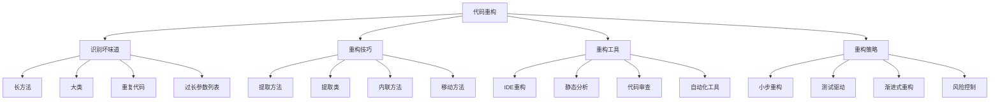

# 代码重构技巧

## 🎯 学习目标
- 理解代码重构的核心概念和重要性
- 掌握常用重构技巧和方法
- 学会识别代码坏味道和重构时机
- 了解重构的最佳实践和工具使用

## 📚 核心概念

### 代码重构架构



### 重构技巧分类

| 重构类型 | 描述 | 适用场景 | 主要收益 |
|----------|------|----------|----------|
| 提取重构 | 提取代码到新方法/类 | 长方法、重复代码 | 提高可读性、减少重复 |
| 内联重构 | 内联方法调用 | 简单方法、过度抽象 | 简化代码、提高性能 |
| 移动重构 | 移动方法/属性 | 职责不清、耦合度高 | 改善结构、降低耦合 |
| 重命名重构 | 重命名标识符 | 命名不清晰 | 提高可读性、语义明确 |

## 🔧 代码重构实现

### 基础重构技巧
```php
<?php
// 1. 提取方法重构
// 重构前：长方法
class OrderProcessor {
    public function processOrder(array $orderData): array {
        // 验证订单数据
        if (empty($orderData['items'])) {
            throw new Exception('Order must have items');
        }
        
        if (empty($orderData['customer_id'])) {
            throw new Exception('Order must have customer');
        }
        
        if ($orderData['total'] <= 0) {
            throw new Exception('Order total must be positive');
        }
        
        // 计算税费
        $taxRate = 0.1;
        $tax = $orderData['total'] * $taxRate;
        
        // 计算折扣
        $discount = 0;
        if ($orderData['total'] > 100) {
            $discount = $orderData['total'] * 0.05;
        }
        
        // 计算最终金额
        $finalAmount = $orderData['total'] + $tax - $discount;
        
        // 保存订单
        $order = new Order(
            $orderData['customer_id'],
            $orderData['items'],
            $orderData['total'],
            $tax,
            $discount,
            $finalAmount
        );
        
        $orderId = $this->saveOrder($order);
        
        // 发送确认邮件
        $customer = $this->getCustomer($orderData['customer_id']);
        $this->sendOrderConfirmation($customer['email'], $orderId);
        
        return [
            'order_id' => $orderId,
            'total' => $orderData['total'],
            'tax' => $tax,
            'discount' => $discount,
            'final_amount' => $finalAmount
        ];
    }
}

// 重构后：提取方法
class OrderProcessor {
    public function processOrder(array $orderData): array {
        $this->validateOrderData($orderData);
        
        $tax = $this->calculateTax($orderData['total']);
        $discount = $this->calculateDiscount($orderData['total']);
        $finalAmount = $this->calculateFinalAmount($orderData['total'], $tax, $discount);
        
        $order = $this->createOrder($orderData, $tax, $discount, $finalAmount);
        $orderId = $this->saveOrder($order);
        
        $this->sendOrderConfirmation($orderData['customer_id'], $orderId);
        
        return [
            'order_id' => $orderId,
            'total' => $orderData['total'],
            'tax' => $tax,
            'discount' => $discount,
            'final_amount' => $finalAmount
        ];
    }
    
    private function validateOrderData(array $orderData): void {
        if (empty($orderData['items'])) {
            throw new Exception('Order must have items');
        }
        
        if (empty($orderData['customer_id'])) {
            throw new Exception('Order must have customer');
        }
        
        if ($orderData['total'] <= 0) {
            throw new Exception('Order total must be positive');
        }
    }
    
    private function calculateTax(float $total): float {
        $taxRate = 0.1;
        return $total * $taxRate;
    }
    
    private function calculateDiscount(float $total): float {
        if ($total > 100) {
            return $total * 0.05;
        }
        return 0;
    }
    
    private function calculateFinalAmount(float $total, float $tax, float $discount): float {
        return $total + $tax - $discount;
    }
    
    private function createOrder(array $orderData, float $tax, float $discount, float $finalAmount): Order {
        return new Order(
            $orderData['customer_id'],
            $orderData['items'],
            $orderData['total'],
            $tax,
            $discount,
            $finalAmount
        );
    }
    
    private function sendOrderConfirmation(int $customerId, int $orderId): void {
        $customer = $this->getCustomer($customerId);
        $this->sendOrderConfirmation($customer['email'], $orderId);
    }
}

// 2. 提取类重构
// 重构前：大类
class UserManager {
    private $database;
    
    public function createUser(array $userData): User {
        // 用户创建逻辑
    }
    
    public function updateUser(int $userId, array $userData): User {
        // 用户更新逻辑
    }
    
    public function deleteUser(int $userId): bool {
        // 用户删除逻辑
    }
    
    public function validateEmail(string $email): bool {
        // 邮箱验证逻辑
    }
    
    public function sendWelcomeEmail(string $email): void {
        // 发送欢迎邮件逻辑
    }
    
    public function logUserAction(int $userId, string $action): void {
        // 用户行为日志逻辑
    }
    
    public function generateUserReport(int $userId): array {
        // 用户报告生成逻辑
    }
}

// 重构后：提取类
class UserService {
    private UserRepository $userRepository;
    private UserValidator $userValidator;
    private EmailService $emailService;
    private UserLogger $userLogger;
    private UserReportGenerator $reportGenerator;
    
    public function __construct(
        UserRepository $userRepository,
        UserValidator $userValidator,
        EmailService $emailService,
        UserLogger $userLogger,
        UserReportGenerator $reportGenerator
    ) {
        $this->userRepository = $userRepository;
        $this->userValidator = $userValidator;
        $this->emailService = $emailService;
        $this->userLogger = $userLogger;
        $this->reportGenerator = $reportGenerator;
    }
    
    public function createUser(array $userData): User {
        $this->userValidator->validateUserData($userData);
        $user = $this->userRepository->create($userData);
        $this->emailService->sendWelcomeEmail($user->getEmail());
        $this->userLogger->logAction($user->getId(), 'user_created');
        return $user;
    }
    
    public function updateUser(int $userId, array $userData): User {
        $this->userValidator->validateUserData($userData);
        $user = $this->userRepository->update($userId, $userData);
        $this->userLogger->logAction($userId, 'user_updated');
        return $user;
    }
    
    public function deleteUser(int $userId): bool {
        $result = $this->userRepository->delete($userId);
        if ($result) {
            $this->userLogger->logAction($userId, 'user_deleted');
        }
        return $result;
    }
    
    public function generateUserReport(int $userId): array {
        return $this->reportGenerator->generate($userId);
    }
}

class UserValidator {
    public function validateUserData(array $userData): void {
        if (empty($userData['name'])) {
            throw new Exception('Name is required');
        }
        
        if (empty($userData['email'])) {
            throw new Exception('Email is required');
        }
        
        if (!filter_var($userData['email'], FILTER_VALIDATE_EMAIL)) {
            throw new Exception('Invalid email format');
        }
    }
}

class EmailService {
    public function sendWelcomeEmail(string $email): void {
        // 发送欢迎邮件逻辑
        echo "Sending welcome email to: $email\n";
    }
}

class UserLogger {
    public function logAction(int $userId, string $action): void {
        // 用户行为日志逻辑
        echo "Logging action: $action for user: $userId\n";
    }
}

class UserReportGenerator {
    public function generate(int $userId): array {
        // 用户报告生成逻辑
        return [
            'user_id' => $userId,
            'report_date' => date('Y-m-d'),
            'data' => []
        ];
    }
}

// 使用示例
echo "=== 基础重构技巧示例 ===\n";

try {
    // 测试重构后的OrderProcessor
    $orderProcessor = new OrderProcessor();
    
    $orderData = [
        'customer_id' => 1,
        'items' => ['item1', 'item2'],
        'total' => 150.0
    ];
    
    $result = $orderProcessor->processOrder($orderData);
    echo "订单处理结果: " . json_encode($result) . "\n";
    
    // 测试重构后的UserService
    $userService = new UserService(
        new UserRepository(),
        new UserValidator(),
        new EmailService(),
        new UserLogger(),
        new UserReportGenerator()
    );
    
    $userData = [
        'name' => 'John Doe',
        'email' => 'john@example.com'
    ];
    
    $user = $userService->createUser($userData);
    echo "用户创建成功: {$user->getName()}\n";
    
} catch (Exception $e) {
    echo "错误: " . $e->getMessage() . "\n";
}
?>
```

### 高级重构技巧
```php
<?php
// 3. 内联方法重构
// 重构前：过度抽象
class PriceCalculator {
    public function calculateTotalPrice(array $items): float {
        $subtotal = $this->calculateSubtotal($items);
        $tax = $this->calculateTax($subtotal);
        $discount = $this->calculateDiscount($subtotal);
        return $this->calculateFinalPrice($subtotal, $tax, $discount);
    }
    
    private function calculateSubtotal(array $items): float {
        $total = 0;
        foreach ($items as $item) {
            $total += $item['price'] * $item['quantity'];
        }
        return $total;
    }
    
    private function calculateTax(float $subtotal): float {
        return $subtotal * 0.1;
    }
    
    private function calculateDiscount(float $subtotal): float {
        if ($subtotal > 100) {
            return $subtotal * 0.05;
        }
        return 0;
    }
    
    private function calculateFinalPrice(float $subtotal, float $tax, float $discount): float {
        return $subtotal + $tax - $discount;
    }
}

// 重构后：内联方法
class PriceCalculator {
    public function calculateTotalPrice(array $items): float {
        // 计算小计
        $subtotal = 0;
        foreach ($items as $item) {
            $subtotal += $item['price'] * $item['quantity'];
        }
        
        // 计算税费
        $tax = $subtotal * 0.1;
        
        // 计算折扣
        $discount = 0;
        if ($subtotal > 100) {
            $discount = $subtotal * 0.05;
        }
        
        // 计算最终价格
        return $subtotal + $tax - $discount;
    }
}

// 4. 移动方法重构
// 重构前：方法位置不当
class Customer {
    private string $name;
    private string $email;
    private array $orders = [];
    
    public function getName(): string {
        return $this->name;
    }
    
    public function getEmail(): string {
        return $this->email;
    }
    
    public function addOrder(Order $order): void {
        $this->orders[] = $order;
    }
    
    public function getOrders(): array {
        return $this->orders;
    }
    
    // 方法位置不当：订单相关逻辑在客户类中
    public function calculateTotalSpent(): float {
        $total = 0;
        foreach ($this->orders as $order) {
            $total += $order->getTotal();
        }
        return $total;
    }
    
    public function getOrderCount(): int {
        return count($this->orders);
    }
    
    public function getAverageOrderValue(): float {
        if (empty($this->orders)) {
            return 0;
        }
        return $this->calculateTotalSpent() / $this->getOrderCount();
    }
}

// 重构后：移动方法到合适的位置
class Customer {
    private string $name;
    private string $email;
    private array $orders = [];
    
    public function getName(): string {
        return $this->name;
    }
    
    public function getEmail(): string {
        return $this->email;
    }
    
    public function addOrder(Order $order): void {
        $this->orders[] = $order;
    }
    
    public function getOrders(): array {
        return $this->orders;
    }
}

class OrderAnalyzer {
    public function calculateTotalSpent(Customer $customer): float {
        $total = 0;
        foreach ($customer->getOrders() as $order) {
            $total += $order->getTotal();
        }
        return $total;
    }
    
    public function getOrderCount(Customer $customer): int {
        return count($customer->getOrders());
    }
    
    public function getAverageOrderValue(Customer $customer): float {
        $orderCount = $this->getOrderCount($customer);
        if ($orderCount === 0) {
            return 0;
        }
        return $this->calculateTotalSpent($customer) / $orderCount;
    }
}

// 5. 重命名重构
// 重构前：命名不清晰
class UserMgr {
    private $db;
    
    public function __construct($database) {
        $this->db = $database;
    }
    
    public function crtUsr($usrData) {
        // 创建用户逻辑
        return new User($usrData['name'], $usrData['email']);
    }
    
    public function updUsr($usrId, $usrData) {
        // 更新用户逻辑
        return true;
    }
    
    public function delUsr($usrId) {
        // 删除用户逻辑
        return true;
    }
    
    public function getUsr($usrId) {
        // 获取用户逻辑
        return new User('John', 'john@example.com');
    }
}

// 重构后：清晰命名
class UserManager {
    private DatabaseInterface $database;
    
    public function __construct(DatabaseInterface $database) {
        $this->database = $database;
    }
    
    public function createUser(array $userData): User {
        // 创建用户逻辑
        return new User($userData['name'], $userData['email']);
    }
    
    public function updateUser(int $userId, array $userData): bool {
        // 更新用户逻辑
        return true;
    }
    
    public function deleteUser(int $userId): bool {
        // 删除用户逻辑
        return true;
    }
    
    public function getUser(int $userId): User {
        // 获取用户逻辑
        return new User('John', 'john@example.com');
    }
}

// 使用示例
echo "=== 高级重构技巧示例 ===\n";

try {
    // 测试内联方法重构
    $priceCalculator = new PriceCalculator();
    $items = [
        ['price' => 50, 'quantity' => 2],
        ['price' => 30, 'quantity' => 1]
    ];
    
    $totalPrice = $priceCalculator->calculateTotalPrice($items);
    echo "总价格: $totalPrice\n";
    
    // 测试移动方法重构
    $customer = new Customer();
    $customer->addOrder(new Order(100));
    $customer->addOrder(new Order(200));
    
    $orderAnalyzer = new OrderAnalyzer();
    $totalSpent = $orderAnalyzer->calculateTotalSpent($customer);
    $orderCount = $orderAnalyzer->getOrderCount($customer);
    $averageValue = $orderAnalyzer->getAverageOrderValue($customer);
    
    echo "客户总消费: $totalSpent\n";
    echo "订单数量: $orderCount\n";
    echo "平均订单价值: $averageValue\n";
    
    // 测试重命名重构
    $userManager = new UserManager(new MySQLDatabase());
    $user = $userManager->createUser(['name' => 'Jane', 'email' => 'jane@example.com']);
    echo "创建用户: {$user->getName()}\n";
    
} catch (Exception $e) {
    echo "错误: " . $e->getMessage() . "\n";
}
?>
```

## 📊 最佳实践

### 代码重构最佳实践
```php
<?php
// 代码重构最佳实践

class CodeRefactoringBestPractices {
    // 1. 重构时机
    public static function getRefactoringTiming() {
        return [
            '识别坏味道' => [
                '长方法' => '方法超过20行',
                '大类' => '类超过500行',
                '重复代码' => '重复代码超过3处',
                '过长参数列表' => '参数超过5个',
                '数据泥团' => '相关数据分散'
            ],
            '重构信号' => [
                '难以理解' => '代码难以理解',
                '难以修改' => '修改困难',
                '难以测试' => '测试困难',
                '性能问题' => '性能瓶颈',
                '维护成本高' => '维护成本高'
            ],
            '重构时机' => [
                '添加功能前' => '添加新功能前重构',
                '修复bug后' => '修复bug后重构',
                '代码审查时' => '代码审查时重构',
                '性能优化时' => '性能优化时重构',
                '定期重构' => '定期进行重构'
            ]
        ];
    }
    
    // 2. 重构策略
    public static function getRefactoringStrategies() {
        return [
            '小步重构' => [
                '一次一个' => '一次只重构一个方面',
                '小步快跑' => '小步快跑，频繁提交',
                '测试驱动' => '测试驱动重构',
                '回滚准备' => '准备回滚方案'
            ],
            '风险控制' => [
                '充分测试' => '充分测试重构结果',
                '代码审查' => '进行代码审查',
                '渐进式重构' => '渐进式重构',
                '监控机制' => '建立监控机制'
            ],
            '工具使用' => [
                'IDE重构' => '使用IDE重构工具',
                '静态分析' => '使用静态分析工具',
                '自动化测试' => '使用自动化测试',
                '版本控制' => '使用版本控制'
            ]
        ];
    }
    
    // 3. 重构技巧
    public static function getRefactoringTechniques() {
        return [
            '提取重构' => [
                '提取方法' => '提取长方法为小方法',
                '提取类' => '提取大类为小类',
                '提取接口' => '提取接口抽象',
                '提取变量' => '提取复杂表达式'
            ],
            '内联重构' => [
                '内联方法' => '内联简单方法',
                '内联变量' => '内联临时变量',
                '内联类' => '内联无用类',
                '内联接口' => '内联简单接口'
            ],
            '移动重构' => [
                '移动方法' => '移动方法到合适位置',
                '移动属性' => '移动属性到合适位置',
                '移动类' => '移动类到合适包',
                '移动接口' => '移动接口到合适位置'
            ],
            '重命名重构' => [
                '重命名方法' => '重命名方法名',
                '重命名属性' => '重命名属性名',
                '重命名类' => '重命名类名',
                '重命名变量' => '重命名变量名'
            ]
        ];
    }
}

// 使用示例
echo "=== 代码重构最佳实践示例 ===\n";

try {
    $refactoringTiming = CodeRefactoringBestPractices::getRefactoringTiming();
    echo "重构时机:\n";
    foreach ($refactoringTiming as $category => $timing) {
        echo "  $category:\n";
        foreach ($timing as $condition => $description) {
            echo "    - $condition: $description\n";
        }
        echo "\n";
    }
    
} catch (Exception $e) {
    echo "错误: " . $e->getMessage() . "\n";
}
?>
```

## 🎓 学习建议

### 费曼学习法应用
1. **选择概念**: 选择代码重构中的核心概念
2. **简化解释**: 用简单语言解释重构的重要性
3. **识别盲点**: 发现理解不深入的地方
4. **重新学习**: 针对盲点进行深入学习

### 刻意练习重点
1. **坏味道识别**: 学会识别代码坏味道
2. **重构技巧**: 掌握各种重构技巧
3. **重构工具**: 熟练使用重构工具
4. **重构策略**: 制定合理的重构策略

## 🔗 相关链接
- [[01-MVC架构模式|MVC架构模式]]
- [[02-设计模式应用|设计模式应用]]
- [[03-SOLID原则|SOLID原则]]
- [[04-架构模式选择|架构模式选择]]
- [[06-架构文档编写|架构文档编写]]
- [[07-架构演进策略|架构演进策略]]
