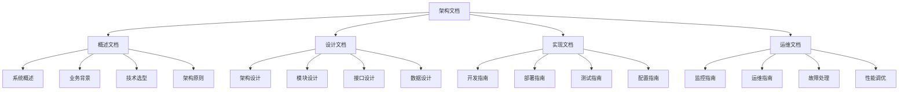

# 架构文档编写

## 🎯 学习目标
- 理解架构文档的重要性和编写原则
- 掌握架构文档的结构和内容组织
- 学会使用各种图表和工具编写架构文档
- 了解架构文档的维护和更新策略

## 📚 核心概念

### 架构文档结构



### 架构文档类型

| 文档类型 | 目标读者 | 主要内容 | 更新频率 |
|----------|----------|----------|----------|
| 系统概述 | 所有人员 | 系统整体介绍 | 低 |
| 架构设计 | 开发人员 | 技术架构设计 | 中 |
| 接口文档 | 开发人员 | API接口规范 | 高 |
| 部署文档 | 运维人员 | 部署和配置 | 中 |
| 运维文档 | 运维人员 | 监控和故障处理 | 高 |

## 🔧 架构文档实现

### 基础架构文档
```php
<?php
// 1. 架构文档生成器
class ArchitectureDocumentGenerator {
    private array $sections = [];
    private array $diagrams = [];
    private string $outputFormat = 'markdown';
    
    // 添加文档章节
    public function addSection(string $title, string $content, int $level = 1): void {
        $this->sections[] = [
            'title' => $title,
            'content' => $content,
            'level' => $level
        ];
    }
    
    // 添加图表
    public function addDiagram(string $name, string $type, string $content): void {
        $this->diagrams[$name] = [
            'type' => $type,
            'content' => $content
        ];
    }
    
    // 生成系统概述
    public function generateSystemOverview(): string {
        $content = "# 系统概述\n\n";
        $content .= "## 业务背景\n\n";
        $content .= "本系统是一个基于PHP的Web应用系统，主要服务于用户管理和订单处理业务。\n\n";
        $content .= "## 技术选型\n\n";
        $content .= "- **后端语言**: PHP 8.0+\n";
        $content .= "- **框架**: Laravel 9.0+\n";
        $content .= "- **数据库**: MySQL 8.0+\n";
        $content .= "- **缓存**: Redis 6.0+\n";
        $content .= "- **消息队列**: RabbitMQ\n";
        $content .= "- **容器化**: Docker\n\n";
        $content .= "## 架构原则\n\n";
        $content .= "1. **高内聚低耦合**: 模块内部高内聚，模块间低耦合\n";
        $content .= "2. **可扩展性**: 支持水平扩展和垂直扩展\n";
        $content .= "3. **高可用性**: 系统可用性达到99.9%\n";
        $content .= "4. **安全性**: 遵循安全开发最佳实践\n";
        $content .= "5. **可维护性**: 代码结构清晰，易于维护\n\n";
        
        return $content;
    }
    
    // 生成架构设计
    public function generateArchitectureDesign(): string {
        $content = "# 架构设计\n\n";
        $content .= "## 整体架构\n\n";
        $content .= "系统采用分层架构模式，分为表现层、业务层、数据层和基础设施层。\n\n";
        $content .= "## 模块设计\n\n";
        $content .= "### 用户管理模块\n";
        $content .= "- 用户注册/登录\n";
        $content .= "- 用户信息管理\n";
        $content .= "- 权限控制\n\n";
        $content .= "### 订单管理模块\n";
        $content .= "- 订单创建\n";
        $content .= "- 订单状态管理\n";
        $content .= "- 订单查询\n\n";
        $content .= "### 支付模块\n";
        $content .= "- 支付处理\n";
        $content .= "- 支付状态管理\n";
        $content .= "- 退款处理\n\n";
        $content .= "## 数据设计\n\n";
        $content .= "### 核心数据表\n";
        $content .= "- users: 用户信息表\n";
        $content .= "- orders: 订单信息表\n";
        $content .= "- payments: 支付信息表\n";
        $content .= "- products: 商品信息表\n\n";
        
        return $content;
    }
    
    // 生成接口文档
    public function generateAPIDocumentation(): string {
        $content = "# API接口文档\n\n";
        $content .= "## 用户管理接口\n\n";
        $content .= "### 创建用户\n";
        $content .= "**请求方式**: POST\n";
        $content .= "**请求路径**: /api/users\n";
        $content .= "**请求参数**:\n";
        $content .= "```json\n";
        $content .= "{\n";
        $content .= "  \"name\": \"John Doe\",\n";
        $content .= "  \"email\": \"john@example.com\",\n";
        $content .= "  \"password\": \"password123\"\n";
        $content .= "}\n";
        $content .= "```\n\n";
        $content .= "**响应示例**:\n";
        $content .= "```json\n";
        $content .= "{\n";
        $content .= "  \"success\": true,\n";
        $content .= "  \"data\": {\n";
        $content .= "    \"id\": 1,\n";
        $content .= "    \"name\": \"John Doe\",\n";
        $content .= "    \"email\": \"john@example.com\"\n";
        $content .= "  },\n";
        $content .= "  \"message\": \"User created successfully\"\n";
        $content .= "}\n";
        $content .= "```\n\n";
        $content .= "### 获取用户信息\n";
        $content .= "**请求方式**: GET\n";
        $content .= "**请求路径**: /api/users/{id}\n";
        $content .= "**路径参数**:\n";
        $content .= "- id: 用户ID\n\n";
        $content .= "**响应示例**:\n";
        $content .= "```json\n";
        $content .= "{\n";
        $content .= "  \"success\": true,\n";
        $content .= "  \"data\": {\n";
        $content .= "    \"id\": 1,\n";
        $content .= "    \"name\": \"John Doe\",\n";
        $content .= "    \"email\": \"john@example.com\"\n";
        $content .= "  }\n";
        $content .= "}\n";
        $content .= "```\n\n";
        
        return $content;
    }
    
    // 生成部署文档
    public function generateDeploymentGuide(): string {
        $content = "# 部署指南\n\n";
        $content .= "## 环境要求\n\n";
        $content .= "- PHP 8.0+\n";
        $content .= "- MySQL 8.0+\n";
        $content .= "- Redis 6.0+\n";
        $content .= "- Nginx 1.18+\n";
        $content .= "- Docker 20.0+\n\n";
        $content .= "## 部署步骤\n\n";
        $content .= "### 1. 代码部署\n";
        $content .= "```bash\n";
        $content .= "git clone https://github.com/company/project.git\n";
        $content .= "cd project\n";
        $content .= "composer install --no-dev --optimize-autoloader\n";
        $content .= "```\n\n";
        $content .= "### 2. 环境配置\n";
        $content .= "```bash\n";
        $content .= "cp .env.example .env\n";
        $content .= "php artisan key:generate\n";
        $content .= "php artisan config:cache\n";
        $content .= "php artisan route:cache\n";
        $content .= "```\n\n";
        $content .= "### 3. 数据库初始化\n";
        $content .= "```bash\n";
        $content .= "php artisan migrate\n";
        $content .= "php artisan db:seed\n";
        $content .= "```\n\n";
        $content .= "### 4. 服务启动\n";
        $content .= "```bash\n";
        $content .= "php artisan serve --host=0.0.0.0 --port=8000\n";
        $content .= "```\n\n";
        $content .= "## Docker部署\n\n";
        $content .= "### 构建镜像\n";
        $content .= "```bash\n";
        $content .= "docker build -t project:latest .\n";
        $content .= "```\n\n";
        $content .= "### 运行容器\n";
        $content .= "```bash\n";
        $content .= "docker run -d -p 8000:8000 --name project project:latest\n";
        $content .= "```\n\n";
        
        return $content;
    }
    
    // 生成运维文档
    public function generateOperationsGuide(): string {
        $content = "# 运维指南\n\n";
        $content .= "## 监控指标\n\n";
        $content .= "### 系统指标\n";
        $content .= "- CPU使用率\n";
        $content .= "- 内存使用率\n";
        $content .= "- 磁盘使用率\n";
        $content .= "- 网络流量\n\n";
        $content .= "### 应用指标\n";
        $content .= "- 响应时间\n";
        $content .= "- 吞吐量\n";
        $content .= "- 错误率\n";
        $content .= "- 并发用户数\n\n";
        $content .= "## 日志管理\n\n";
        $content .= "### 日志级别\n";
        $content .= "- ERROR: 错误信息\n";
        $content .= "- WARN: 警告信息\n";
        $content .= "- INFO: 一般信息\n";
        $content .= "- DEBUG: 调试信息\n\n";
        $content .= "### 日志位置\n";
        $content .= "- 应用日志: /var/log/app/\n";
        $content .= "- 系统日志: /var/log/syslog\n";
        $content .= "- 访问日志: /var/log/nginx/\n\n";
        $content .= "## 故障处理\n\n";
        $content .= "### 常见问题\n";
        $content .= "1. **服务无响应**\n";
        $content .= "   - 检查服务状态\n";
        $content .= "   - 查看错误日志\n";
        $content .= "   - 重启服务\n\n";
        $content .= "2. **数据库连接失败**\n";
        $content .= "   - 检查数据库服务\n";
        $content .= "   - 验证连接配置\n";
        $content .= "   - 检查网络连接\n\n";
        $content .= "3. **内存不足**\n";
        $content .= "   - 检查内存使用\n";
        $content .= "   - 优化代码\n";
        $content .= "   - 增加内存\n\n";
        
        return $content;
    }
    
    // 生成完整文档
    public function generateCompleteDocument(): string {
        $content = $this->generateSystemOverview();
        $content .= "\n" . $this->generateArchitectureDesign();
        $content .= "\n" . $this->generateAPIDocumentation();
        $content .= "\n" . $this->generateDeploymentGuide();
        $content .= "\n" . $this->generateOperationsGuide();
        
        return $content;
    }
}

// 2. 架构图表生成器
class ArchitectureDiagramGenerator {
    private array $diagrams = [];
    
    // 生成系统架构图
    public function generateSystemArchitectureDiagram(): string {
        $diagram = "```mermaid\n";
        $diagram .= "graph TD\n";
        $diagram .= "    A[用户] --> B[负载均衡器]\n";
        $diagram .= "    B --> C[Web服务器1]\n";
        $diagram .= "    B --> D[Web服务器2]\n";
        $diagram .= "    C --> E[应用服务器1]\n";
        $diagram .= "    D --> F[应用服务器2]\n";
        $diagram .= "    E --> G[数据库主库]\n";
        $diagram .= "    F --> G\n";
        $diagram .= "    G --> H[数据库从库]\n";
        $diagram .= "    E --> I[Redis缓存]\n";
        $diagram .= "    F --> I\n";
        $diagram .= "    E --> J[消息队列]\n";
        $diagram .= "    F --> J\n";
        $diagram .= "```\n";
        
        return $diagram;
    }
    
    // 生成模块关系图
    public function generateModuleRelationshipDiagram(): string {
        $diagram = "```mermaid\n";
        $diagram .= "graph LR\n";
        $diagram .= "    A[用户管理模块] --> B[订单管理模块]\n";
        $diagram .= "    B --> C[支付模块]\n";
        $diagram .= "    B --> D[库存模块]\n";
        $diagram .= "    C --> E[通知模块]\n";
        $diagram .= "    D --> E\n";
        $diagram .= "    A --> F[权限模块]\n";
        $diagram .= "    B --> F\n";
        $diagram .= "    C --> F\n";
        $diagram .= "```\n";
        
        return $diagram;
    }
    
    // 生成数据流图
    public function generateDataFlowDiagram(): string {
        $diagram = "```mermaid\n";
        $diagram .= "flowchart TD\n";
        $diagram .= "    A[用户请求] --> B[API网关]\n";
        $diagram .= "    B --> C[身份验证]\n";
        $diagram .= "    C --> D[业务逻辑处理]\n";
        $diagram .= "    D --> E[数据访问层]\n";
        $diagram .= "    E --> F[数据库]\n";
        $diagram .= "    F --> E\n";
        $diagram .= "    E --> D\n";
        $diagram .= "    D --> G[缓存层]\n";
        $diagram .= "    G --> D\n";
        $diagram .= "    D --> H[响应生成]\n";
        $diagram .= "    H --> I[用户响应]\n";
        $diagram .= "```\n";
        
        return $diagram;
    }
    
    // 生成部署架构图
    public function generateDeploymentArchitectureDiagram(): string {
        $diagram = "```mermaid\n";
        $diagram .= "graph TB\n";
        $diagram .= "    subgraph \"生产环境\"\n";
        $diagram .= "        A[负载均衡器] --> B[Web服务器集群]\n";
        $diagram .= "        B --> C[应用服务器集群]\n";
        $diagram .= "        C --> D[数据库集群]\n";
        $diagram .= "        C --> E[缓存集群]\n";
        $diagram .= "        C --> F[消息队列集群]\n";
        $diagram .= "    end\n";
        $diagram .= "    subgraph \"测试环境\"\n";
        $diagram .= "        G[测试服务器] --> H[测试数据库]\n";
        $diagram .= "    end\n";
        $diagram .= "    subgraph \"开发环境\"\n";
        $diagram .= "        I[开发服务器] --> J[开发数据库]\n";
        $diagram .= "    end\n";
        $diagram .= "```\n";
        
        return $diagram;
    }
}

// 使用示例
echo "=== 架构文档编写示例 ===\n";

try {
    // 创建架构文档生成器
    $docGenerator = new ArchitectureDocumentGenerator();
    
    // 生成系统概述
    $systemOverview = $docGenerator->generateSystemOverview();
    echo "系统概述文档生成完成\n";
    
    // 生成架构设计
    $architectureDesign = $docGenerator->generateArchitectureDesign();
    echo "架构设计文档生成完成\n";
    
    // 生成API文档
    $apiDocumentation = $docGenerator->generateAPIDocumentation();
    echo "API文档生成完成\n";
    
    // 生成部署指南
    $deploymentGuide = $docGenerator->generateDeploymentGuide();
    echo "部署指南生成完成\n";
    
    // 生成运维指南
    $operationsGuide = $docGenerator->generateOperationsGuide();
    echo "运维指南生成完成\n";
    
    // 创建架构图表生成器
    $diagramGenerator = new ArchitectureDiagramGenerator();
    
    // 生成系统架构图
    $systemArchDiagram = $diagramGenerator->generateSystemArchitectureDiagram();
    echo "系统架构图生成完成\n";
    
    // 生成模块关系图
    $moduleRelDiagram = $diagramGenerator->generateModuleRelationshipDiagram();
    echo "模块关系图生成完成\n";
    
    // 生成数据流图
    $dataFlowDiagram = $diagramGenerator->generateDataFlowDiagram();
    echo "数据流图生成完成\n";
    
    // 生成部署架构图
    $deploymentArchDiagram = $diagramGenerator->generateDeploymentArchitectureDiagram();
    echo "部署架构图生成完成\n";
    
    // 生成完整文档
    $completeDocument = $docGenerator->generateCompleteDocument();
    echo "完整架构文档生成完成\n";
    
} catch (Exception $e) {
    echo "错误: " . $e->getMessage() . "\n";
}
?>
```

## 📊 最佳实践

### 架构文档编写最佳实践
```php
<?php
// 架构文档编写最佳实践

class ArchitectureDocumentationBestPractices {
    // 1. 文档结构最佳实践
    public static function getDocumentStructureBestPractices() {
        return [
            '文档组织' => [
                '层次清晰' => '文档层次结构清晰',
                '逻辑顺序' => '按照逻辑顺序组织内容',
                '目录导航' => '提供清晰的目录导航',
                '交叉引用' => '建立合理的交叉引用'
            ],
            '内容组织' => [
                '概述先行' => '先提供系统概述',
                '细节跟进' => '再提供详细设计',
                '示例丰富' => '提供丰富的示例',
                '图表辅助' => '使用图表辅助说明'
            ],
            '格式规范' => [
                '统一格式' => '使用统一的文档格式',
                '命名规范' => '遵循命名规范',
                '版本控制' => '进行版本控制',
                '更新记录' => '记录更新历史'
            ]
        ];
    }
    
    // 2. 内容编写最佳实践
    public static function getContentWritingBestPractices() {
        return [
            '语言表达' => [
                '简洁明了' => '语言简洁明了',
                '准确描述' => '准确描述技术细节',
                '避免歧义' => '避免产生歧义',
                '专业术语' => '使用专业术语'
            ],
            '技术描述' => [
                '架构清晰' => '清晰描述架构设计',
                '接口规范' => '详细描述接口规范',
                '数据模型' => '完整描述数据模型',
                '部署流程' => '详细描述部署流程'
            ],
            '示例代码' => [
                '代码完整' => '提供完整的代码示例',
                '注释详细' => '添加详细的注释',
                '可运行' => '确保代码可运行',
                '最佳实践' => '体现最佳实践'
            ]
        ];
    }
    
    // 3. 维护更新最佳实践
    public static function getMaintenanceBestPractices() {
        return [
            '版本管理' => [
                '版本控制' => '使用版本控制系统',
                '变更记录' => '记录所有变更',
                '版本标签' => '使用版本标签',
                '回滚机制' => '提供回滚机制'
            ],
            '更新策略' => [
                '定期更新' => '定期更新文档',
                '及时更新' => '及时更新变更内容',
                '通知机制' => '建立更新通知机制',
                '反馈收集' => '收集用户反馈'
            ],
            '质量控制' => [
                '审查机制' => '建立文档审查机制',
                '测试验证' => '测试验证文档内容',
                '用户反馈' => '收集用户反馈',
                '持续改进' => '持续改进文档质量'
            ]
        ];
    }
}

// 使用示例
echo "=== 架构文档编写最佳实践示例 ===\n";

try {
    $structurePractices = ArchitectureDocumentationBestPractices::getDocumentStructureBestPractices();
    echo "文档结构最佳实践:\n";
    foreach ($structurePractices as $category => $practices) {
        echo "  $category:\n";
        foreach ($practices as $practice => $description) {
            echo "    - $practice: $description\n";
        }
        echo "\n";
    }
    
} catch (Exception $e) {
    echo "错误: " . $e->getMessage() . "\n";
}
?>
```

## 🎓 学习建议

### 费曼学习法应用
1. **选择概念**: 选择架构文档编写中的核心概念
2. **简化解释**: 用简单语言解释文档编写的重要性
3. **识别盲点**: 发现理解不深入的地方
4. **重新学习**: 针对盲点进行深入学习

### 刻意练习重点
1. **文档结构**: 掌握文档结构设计
2. **内容编写**: 学会编写清晰的技术文档
3. **图表制作**: 熟练制作各种架构图表
4. **文档维护**: 掌握文档维护和更新策略

## 🔗 相关链接
- [[01-MVC架构模式|MVC架构模式]]
- [[02-设计模式应用|设计模式应用]]
- [[03-SOLID原则|SOLID原则]]
- [[04-架构模式选择|架构模式选择]]
- [[05-代码重构技巧|代码重构技巧]]
- [[07-架构演进策略|架构演进策略]]
