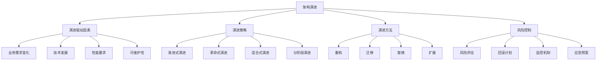

# 架构演进策略

## 🎯 学习目标
- 理解架构演进的重要性和挑战
- 掌握架构演进的方法和策略
- 学会制定架构演进计划和路线图
- 了解架构演进的风险控制和最佳实践

## 📚 核心概念

### 架构演进架构



### 架构演进类型

| 演进类型 | 描述 | 适用场景 | 风险等级 | 时间周期 |
|----------|------|----------|----------|----------|
| 渐进式演进 | 逐步改进架构 | 稳定业务环境 | 低 | 长期 |
| 革命式演进 | 全面重构架构 | 重大业务转型 | 高 | 短期 |
| 混合式演进 | 结合多种方法 | 复杂业务场景 | 中 | 中期 |
| 分阶段演进 | 按阶段推进 | 大型项目 | 中 | 长期 |

## 🔧 架构演进实现

### 基础架构演进策略
```php
<?php
// 1. 架构演进规划器
class ArchitectureEvolutionPlanner {
    private array $currentArchitecture = [];
    private array $targetArchitecture = [];
    private array $evolutionPlan = [];
    private array $risks = [];
    
    // 分析当前架构
    public function analyzeCurrentArchitecture(array $architecture): array {
        $this->currentArchitecture = $architecture;
        
        $analysis = [
            'strengths' => $this->identifyStrengths($architecture),
            'weaknesses' => $this->identifyWeaknesses($architecture),
            'opportunities' => $this->identifyOpportunities($architecture),
            'threats' => $this->identifyThreats($architecture),
            'technical_debt' => $this->assessTechnicalDebt($architecture),
            'performance_issues' => $this->identifyPerformanceIssues($architecture)
        ];
        
        return $analysis;
    }
    
    // 识别优势
    private function identifyStrengths(array $architecture): array {
        $strengths = [];
        
        if (isset($architecture['modularity']) && $architecture['modularity'] === 'high') {
            $strengths[] = '高模块化设计';
        }
        
        if (isset($architecture['scalability']) && $architecture['scalability'] === 'good') {
            $strengths[] = '良好的可扩展性';
        }
        
        if (isset($architecture['maintainability']) && $architecture['maintainability'] === 'high') {
            $strengths[] = '高可维护性';
        }
        
        return $strengths;
    }
    
    // 识别劣势
    private function identifyWeaknesses(array $architecture): array {
        $weaknesses = [];
        
        if (isset($architecture['performance']) && $architecture['performance'] === 'low') {
            $weaknesses[] = '性能瓶颈';
        }
        
        if (isset($architecture['coupling']) && $architecture['coupling'] === 'high') {
            $weaknesses[] = '高耦合度';
        }
        
        if (isset($architecture['technology']) && $architecture['technology'] === 'outdated') {
            $weaknesses[] = '技术栈过时';
        }
        
        return $weaknesses;
    }
    
    // 识别机会
    private function identifyOpportunities(array $architecture): array {
        $opportunities = [];
        
        if (isset($architecture['cloud_readiness']) && $architecture['cloud_readiness'] === 'low') {
            $opportunities[] = '云原生改造机会';
        }
        
        if (isset($architecture['microservices']) && $architecture['microservices'] === 'false') {
            $opportunities[] = '微服务架构转型';
        }
        
        if (isset($architecture['automation']) && $architecture['automation'] === 'low') {
            $opportunities[] = '自动化改进机会';
        }
        
        return $opportunities;
    }
    
    // 识别威胁
    private function identifyThreats(array $architecture): array {
        $threats = [];
        
        if (isset($architecture['security']) && $architecture['security'] === 'weak') {
            $threats[] = '安全风险';
        }
        
        if (isset($architecture['vendor_lock']) && $architecture['vendor_lock'] === 'high') {
            $threats[] = '供应商锁定风险';
        }
        
        if (isset($architecture['single_point_failure']) && $architecture['single_point_failure'] === 'true') {
            $threats[] = '单点故障风险';
        }
        
        return $threats;
    }
    
    // 评估技术债务
    private function assessTechnicalDebt(array $architecture): array {
        $debt = [
            'code_quality' => 0,
            'documentation' => 0,
            'test_coverage' => 0,
            'dependencies' => 0
        ];
        
        if (isset($architecture['code_quality']) && $architecture['code_quality'] === 'low') {
            $debt['code_quality'] = 80;
        }
        
        if (isset($architecture['documentation']) && $architecture['documentation'] === 'incomplete') {
            $debt['documentation'] = 60;
        }
        
        if (isset($architecture['test_coverage']) && $architecture['test_coverage'] < 70) {
            $debt['test_coverage'] = 70;
        }
        
        if (isset($architecture['outdated_dependencies']) && $architecture['outdated_dependencies'] > 10) {
            $debt['dependencies'] = 50;
        }
        
        return $debt;
    }
    
    // 识别性能问题
    private function identifyPerformanceIssues(array $architecture): array {
        $issues = [];
        
        if (isset($architecture['response_time']) && $architecture['response_time'] > 2000) {
            $issues[] = '响应时间过长';
        }
        
        if (isset($architecture['throughput']) && $architecture['throughput'] < 100) {
            $issues[] = '吞吐量不足';
        }
        
        if (isset($architecture['memory_usage']) && $architecture['memory_usage'] > 80) {
            $issues[] = '内存使用率过高';
        }
        
        return $issues;
    }
    
    // 制定演进计划
    public function createEvolutionPlan(array $targetArchitecture): array {
        $this->targetArchitecture = $targetArchitecture;
        
        $plan = [
            'phases' => [],
            'timeline' => [],
            'resources' => [],
            'risks' => [],
            'success_metrics' => []
        ];
        
        // 分析差距
        $gaps = $this->analyzeGaps($this->currentArchitecture, $targetArchitecture);
        
        // 制定阶段
        $plan['phases'] = $this->createPhases($gaps);
        
        // 制定时间线
        $plan['timeline'] = $this->createTimeline($plan['phases']);
        
        // 估算资源
        $plan['resources'] = $this->estimateResources($plan['phases']);
        
        // 评估风险
        $plan['risks'] = $this->assessRisks($plan['phases']);
        
        // 定义成功指标
        $plan['success_metrics'] = $this->defineSuccessMetrics($targetArchitecture);
        
        $this->evolutionPlan = $plan;
        return $plan;
    }
    
    // 分析差距
    private function analyzeGaps(array $current, array $target): array {
        $gaps = [];
        
        foreach ($target as $key => $targetValue) {
            $currentValue = $current[$key] ?? null;
            
            if ($currentValue !== $targetValue) {
                $gaps[] = [
                    'component' => $key,
                    'current' => $currentValue,
                    'target' => $targetValue,
                    'gap_type' => $this->determineGapType($currentValue, $targetValue),
                    'priority' => $this->determinePriority($key, $targetValue)
                ];
            }
        }
        
        return $gaps;
    }
    
    // 确定差距类型
    private function determineGapType($current, $target): string {
        if ($current === null) {
            return 'missing';
        } elseif (is_numeric($current) && is_numeric($target)) {
            return $current < $target ? 'upgrade' : 'downgrade';
        } else {
            return 'change';
        }
    }
    
    // 确定优先级
    private function determinePriority(string $component, $targetValue): string {
        $highPriorityComponents = ['security', 'performance', 'scalability'];
        $mediumPriorityComponents = ['maintainability', 'modularity'];
        
        if (in_array($component, $highPriorityComponents)) {
            return 'high';
        } elseif (in_array($component, $mediumPriorityComponents)) {
            return 'medium';
        } else {
            return 'low';
        }
    }
    
    // 创建阶段
    private function createPhases(array $gaps): array {
        $phases = [];
        
        // 按优先级分组
        $highPriorityGaps = array_filter($gaps, fn($gap) => $gap['priority'] === 'high');
        $mediumPriorityGaps = array_filter($gaps, fn($gap) => $gap['priority'] === 'medium');
        $lowPriorityGaps = array_filter($gaps, fn($gap) => $gap['priority'] === 'low');
        
        // 阶段1：高优先级改进
        if (!empty($highPriorityGaps)) {
            $phases[] = [
                'name' => '关键改进阶段',
                'description' => '解决高优先级架构问题',
                'gaps' => $highPriorityGaps,
                'duration' => '3-6个月',
                'risk_level' => 'high'
            ];
        }
        
        // 阶段2：中等优先级改进
        if (!empty($mediumPriorityGaps)) {
            $phases[] = [
                'name' => '结构优化阶段',
                'description' => '优化架构结构和设计',
                'gaps' => $mediumPriorityGaps,
                'duration' => '6-12个月',
                'risk_level' => 'medium'
            ];
        }
        
        // 阶段3：低优先级改进
        if (!empty($lowPriorityGaps)) {
            $phases[] = [
                'name' => '完善优化阶段',
                'description' => '完善架构细节和优化',
                'gaps' => $lowPriorityGaps,
                'duration' => '12-18个月',
                'risk_level' => 'low'
            ];
        }
        
        return $phases;
    }
    
    // 创建时间线
    private function createTimeline(array $phases): array {
        $timeline = [];
        $startDate = date('Y-m-d');
        
        foreach ($phases as $index => $phase) {
            $timeline[] = [
                'phase' => $phase['name'],
                'start_date' => $startDate,
                'end_date' => date('Y-m-d', strtotime($startDate . ' +' . $phase['duration'])),
                'milestones' => $this->createMilestones($phase)
            ];
            
            $startDate = date('Y-m-d', strtotime($startDate . ' +' . $phase['duration']));
        }
        
        return $timeline;
    }
    
    // 创建里程碑
    private function createMilestones(array $phase): array {
        $milestones = [];
        $gapCount = count($phase['gaps']);
        
        for ($i = 1; $i <= 3; $i++) {
            $milestones[] = [
                'name' => "里程碑 {$i}",
                'description' => "完成 {$phase['name']} 的 " . round($i * 100 / 3) . "%",
                'completion_percentage' => round($i * 100 / 3)
            ];
        }
        
        return $milestones;
    }
    
    // 估算资源
    private function estimateResources(array $phases): array {
        $resources = [
            'total_effort' => 0,
            'team_size' => 0,
            'budget' => 0,
            'tools' => []
        ];
        
        foreach ($phases as $phase) {
            $phaseEffort = count($phase['gaps']) * 2; // 每个差距2人月
            $resources['total_effort'] += $phaseEffort;
        }
        
        $resources['team_size'] = ceil($resources['total_effort'] / 12); // 假设12个月完成
        $resources['budget'] = $resources['total_effort'] * 50000; // 每人月5万
        $resources['tools'] = ['IDE', 'CI/CD', '监控工具', '测试工具'];
        
        return $resources;
    }
    
    // 评估风险
    private function assessRisks(array $phases): array {
        $risks = [];
        
        foreach ($phases as $phase) {
            $phaseRisks = [
                'technical_risk' => $phase['risk_level'] === 'high' ? 'high' : 'medium',
                'schedule_risk' => 'medium',
                'resource_risk' => 'low',
                'business_risk' => $phase['risk_level'] === 'high' ? 'high' : 'low'
            ];
            
            $risks[$phase['name']] = $phaseRisks;
        }
        
        return $risks;
    }
    
    // 定义成功指标
    private function defineSuccessMetrics(array $targetArchitecture): array {
        return [
            'performance' => [
                'response_time' => '< 200ms',
                'throughput' => '> 1000 req/s',
                'availability' => '> 99.9%'
            ],
            'quality' => [
                'code_coverage' => '> 80%',
                'bug_density' => '< 1 bug/KLOC',
                'technical_debt' => '< 20%'
            ],
            'maintainability' => [
                'cyclomatic_complexity' => '< 10',
                'coupling' => 'low',
                'cohesion' => 'high'
            ]
        ];
    }
    
    // 获取演进计划
    public function getEvolutionPlan(): array {
        return $this->evolutionPlan;
    }
}

// 使用示例
echo "=== 架构演进策略示例 ===\n";

try {
    // 创建架构演进规划器
    $planner = new ArchitectureEvolutionPlanner();
    
    // 分析当前架构
    $currentArchitecture = [
        'modularity' => 'medium',
        'scalability' => 'low',
        'maintainability' => 'medium',
        'performance' => 'low',
        'coupling' => 'high',
        'technology' => 'outdated',
        'cloud_readiness' => 'low',
        'microservices' => false,
        'automation' => 'low',
        'security' => 'weak',
        'vendor_lock' => 'high',
        'single_point_failure' => true,
        'code_quality' => 'low',
        'documentation' => 'incomplete',
        'test_coverage' => 50,
        'outdated_dependencies' => 15,
        'response_time' => 3000,
        'throughput' => 50,
        'memory_usage' => 85
    ];
    
    $analysis = $planner->analyzeCurrentArchitecture($currentArchitecture);
    echo "当前架构分析完成\n";
    echo "优势: " . implode(', ', $analysis['strengths']) . "\n";
    echo "劣势: " . implode(', ', $analysis['weaknesses']) . "\n";
    echo "机会: " . implode(', ', $analysis['opportunities']) . "\n";
    echo "威胁: " . implode(', ', $analysis['threats']) . "\n";
    
    // 定义目标架构
    $targetArchitecture = [
        'modularity' => 'high',
        'scalability' => 'high',
        'maintainability' => 'high',
        'performance' => 'high',
        'coupling' => 'low',
        'technology' => 'modern',
        'cloud_readiness' => 'high',
        'microservices' => true,
        'automation' => 'high',
        'security' => 'strong',
        'vendor_lock' => 'low',
        'single_point_failure' => false,
        'code_quality' => 'high',
        'documentation' => 'complete',
        'test_coverage' => 90,
        'outdated_dependencies' => 0,
        'response_time' => 100,
        'throughput' => 2000,
        'memory_usage' => 60
    ];
    
    // 制定演进计划
    $evolutionPlan = $planner->createEvolutionPlan($targetArchitecture);
    echo "架构演进计划制定完成\n";
    
    echo "演进阶段:\n";
    foreach ($evolutionPlan['phases'] as $phase) {
        echo "  - {$phase['name']}: {$phase['description']} ({$phase['duration']})\n";
    }
    
    echo "资源估算:\n";
    echo "  - 总工作量: {$evolutionPlan['resources']['total_effort']} 人月\n";
    echo "  - 团队规模: {$evolutionPlan['resources']['team_size']} 人\n";
    echo "  - 预算: {$evolutionPlan['resources']['budget']} 元\n";
    
} catch (Exception $e) {
    echo "错误: " . $e->getMessage() . "\n";
}
?>
```

## 📊 最佳实践

### 架构演进最佳实践
```php
<?php
// 架构演进最佳实践

class ArchitectureEvolutionBestPractices {
    // 1. 演进规划最佳实践
    public static function getEvolutionPlanningBestPractices() {
        return [
            '现状分析' => [
                '全面评估' => '全面评估当前架构状态',
                '问题识别' => '识别架构问题和瓶颈',
                '技术债务' => '评估技术债务水平',
                '性能分析' => '分析性能指标和瓶颈'
            ],
            '目标设定' => [
                '业务对齐' => '与业务目标对齐',
                '技术前瞻' => '考虑技术发展趋势',
                '可量化目标' => '设定可量化的目标',
                '分阶段目标' => '设定分阶段目标'
            ],
            '计划制定' => [
                '分阶段实施' => '分阶段实施演进计划',
                '风险控制' => '制定风险控制措施',
                '资源规划' => '合理规划资源投入',
                '时间安排' => '合理安排时间进度'
            ]
        ];
    }
    
    // 2. 实施策略最佳实践
    public static function getImplementationBestPractices() {
        return [
            '渐进式演进' => [
                '小步快跑' => '采用小步快跑的方式',
                '持续改进' => '建立持续改进机制',
                '快速反馈' => '建立快速反馈机制',
                '迭代优化' => '基于反馈迭代优化'
            ],
            '风险控制' => [
                '风险评估' => '全面评估演进风险',
                '回滚计划' => '制定详细的回滚计划',
                '监控机制' => '建立监控和预警机制',
                '应急预案' => '制定应急预案'
            ],
            '团队协作' => [
                '跨部门协作' => '促进跨部门协作',
                '知识共享' => '建立知识共享机制',
                '培训计划' => '制定团队培训计划',
                '沟通机制' => '建立有效沟通机制'
            ]
        ];
    }
    
    // 3. 质量保证最佳实践
    public static function getQualityAssuranceBestPractices() {
        return [
            '测试策略' => [
                '全面测试' => '进行全面测试覆盖',
                '自动化测试' => '建立自动化测试',
                '性能测试' => '进行性能测试',
                '安全测试' => '进行安全测试'
            ],
            '监控体系' => [
                '实时监控' => '建立实时监控体系',
                '性能监控' => '监控性能指标',
                '错误监控' => '监控错误和异常',
                '业务监控' => '监控业务指标'
            ],
            '文档管理' => [
                '文档更新' => '及时更新架构文档',
                '版本控制' => '进行文档版本控制',
                '知识管理' => '建立知识管理体系',
                '经验总结' => '总结演进经验'
            ]
        ];
    }
}

// 使用示例
echo "=== 架构演进最佳实践示例 ===\n";

try {
    $planningPractices = ArchitectureEvolutionBestPractices::getEvolutionPlanningBestPractices();
    echo "演进规划最佳实践:\n";
    foreach ($planningPractices as $category => $practices) {
        echo "  $category:\n";
        foreach ($practices as $practice => $description) {
            echo "    - $practice: $description\n";
        }
        echo "\n";
    }
    
} catch (Exception $e) {
    echo "错误: " . $e->getMessage() . "\n";
}
?>
```

## 🎓 学习建议

### 费曼学习法应用
1. **选择概念**: 选择架构演进中的核心概念
2. **简化解释**: 用简单语言解释架构演进的重要性
3. **识别盲点**: 发现理解不深入的地方
4. **重新学习**: 针对盲点进行深入学习

### 刻意练习重点
1. **演进规划**: 掌握架构演进规划方法
2. **实施策略**: 学会制定实施策略
3. **风险控制**: 掌握风险控制技巧
4. **质量保证**: 建立质量保证体系

## 🔗 相关链接
- [[01-MVC架构模式|MVC架构模式]]
- [[02-设计模式应用|设计模式应用]]
- [[03-SOLID原则|SOLID原则]]
- [[04-架构模式选择|架构模式选择]]
- [[05-代码重构技巧|代码重构技巧]]
- [[06-架构文档编写|架构文档编写]]
