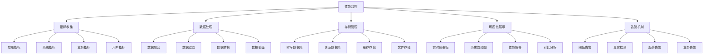

# 性能监控

## 🎯 学习目标
- 理解性能监控的重要性和核心概念
- 掌握性能监控指标的设计和收集方法
- 学会使用各种性能监控工具和技术
- 了解性能监控的最佳实践和优化策略

## 📚 核心概念

### 性能监控架构



### 性能监控指标分类

| 指标类型 | 描述 | 示例指标 | 监控频率 |
|----------|------|----------|----------|
| 响应时间 | 请求处理时间 | 平均响应时间、P95、P99 | 实时 |
| 吞吐量 | 系统处理能力 | QPS、TPS、并发数 | 实时 |
| 错误率 | 错误请求比例 | 4xx、5xx错误率 | 实时 |
| 资源使用 | 系统资源消耗 | CPU、内存、磁盘、网络 | 实时 |
| 业务指标 | 业务相关指标 | 用户活跃度、转化率 | 定期 |

## 🔧 性能监控实现

### 基础性能监控
```php
<?php
// 1. 性能监控器
class PerformanceMonitor {
    private array $metrics = [];
    private array $counters = [];
    private array $timers = [];
    private array $gauges = [];
    private array $histograms = [];
    
    // 记录计数器
    public function incrementCounter(string $name, int $value = 1, array $tags = []): void {
        $key = $this->buildKey($name, $tags);
        $this->counters[$key] = ($this->counters[$key] ?? 0) + $value;
    }
    
    // 记录计时器
    public function recordTimer(string $name, float $duration, array $tags = []): void {
        $key = $this->buildKey($name, $tags);
        $this->timers[$key][] = $duration;
    }
    
    // 记录仪表盘
    public function setGauge(string $name, float $value, array $tags = []): void {
        $key = $this->buildKey($name, $tags);
        $this->gauges[$key] = $value;
    }
    
    // 记录直方图
    public function recordHistogram(string $name, float $value, array $tags = []): void {
        $key = $this->buildKey($name, $tags);
        $this->histograms[$key][] = $value;
    }
    
    // 构建键
    private function buildKey(string $name, array $tags): string {
        if (empty($tags)) {
            return $name;
        }
        
        $tagString = '';
        foreach ($tags as $key => $value) {
            $tagString .= "{$key}={$value},";
        }
        
        return $name . '[' . rtrim($tagString, ',') . ']';
    }
    
    // 获取计数器值
    public function getCounter(string $name, array $tags = []): int {
        $key = $this->buildKey($name, $tags);
        return $this->counters[$key] ?? 0;
    }
    
    // 获取计时器统计
    public function getTimerStats(string $name, array $tags = []): array {
        $key = $this->buildKey($name, $tags);
        $values = $this->timers[$key] ?? [];
        
        if (empty($values)) {
            return [
                'count' => 0,
                'min' => 0,
                'max' => 0,
                'avg' => 0,
                'p95' => 0,
                'p99' => 0
            ];
        }
        
        sort($values);
        $count = count($values);
        
        return [
            'count' => $count,
            'min' => $values[0],
            'max' => $values[$count - 1],
            'avg' => array_sum($values) / $count,
            'p95' => $values[intval($count * 0.95)],
            'p99' => $values[intval($count * 0.99)]
        ];
    }
    
    // 获取仪表盘值
    public function getGauge(string $name, array $tags = []): float {
        $key = $this->buildKey($name, $tags);
        return $this->gauges[$key] ?? 0;
    }
    
    // 获取直方图统计
    public function getHistogramStats(string $name, array $tags = []): array {
        $key = $this->buildKey($name, $tags);
        $values = $this->histograms[$key] ?? [];
        
        if (empty($values)) {
            return [
                'count' => 0,
                'min' => 0,
                'max' => 0,
                'avg' => 0,
                'sum' => 0
            ];
        }
        
        return [
            'count' => count($values),
            'min' => min($values),
            'max' => max($values),
            'avg' => array_sum($values) / count($values),
            'sum' => array_sum($values)
        ];
    }
    
    // 获取所有指标
    public function getAllMetrics(): array {
        return [
            'counters' => $this->counters,
            'timers' => $this->timers,
            'gauges' => $this->gauges,
            'histograms' => $this->histograms
        ];
    }
    
    // 重置指标
    public function resetMetrics(): void {
        $this->counters = [];
        $this->timers = [];
        $this->gauges = [];
        $this->histograms = [];
    }
}

// 2. 应用性能监控
class ApplicationPerformanceMonitor {
    private PerformanceMonitor $monitor;
    private array $requestStartTimes = [];
    
    public function __construct(PerformanceMonitor $monitor) {
        $this->monitor = $monitor;
    }
    
    // 开始请求监控
    public function startRequest(string $requestId, string $method, string $path): void {
        $this->requestStartTimes[$requestId] = microtime(true);
        
        $this->monitor->incrementCounter('requests_total', 1, [
            'method' => $method,
            'path' => $path
        ]);
    }
    
    // 结束请求监控
    public function endRequest(string $requestId, string $method, string $path, int $statusCode): void {
        if (!isset($this->requestStartTimes[$requestId])) {
            return;
        }
        
        $duration = (microtime(true) - $this->requestStartTimes[$requestId]) * 1000; // 转换为毫秒
        
        $this->monitor->recordTimer('request_duration', $duration, [
            'method' => $method,
            'path' => $path,
            'status' => $statusCode
        ]);
        
        // 记录状态码
        $this->monitor->incrementCounter('requests_by_status', 1, [
            'status' => $statusCode
        ]);
        
        // 记录错误
        if ($statusCode >= 400) {
            $this->monitor->incrementCounter('request_errors', 1, [
                'method' => $method,
                'path' => $path,
                'status' => $statusCode
            ]);
        }
        
        unset($this->requestStartTimes[$requestId]);
    }
    
    // 监控数据库查询
    public function recordDatabaseQuery(string $query, float $duration, bool $success = true): void {
        $this->monitor->recordTimer('database_query_duration', $duration, [
            'query_type' => $this->getQueryType($query),
            'success' => $success ? 'true' : 'false'
        ]);
        
        $this->monitor->incrementCounter('database_queries_total', 1, [
            'query_type' => $this->getQueryType($query),
            'success' => $success ? 'true' : 'false'
        ]);
    }
    
    // 获取查询类型
    private function getQueryType(string $query): string {
        $query = trim(strtoupper($query));
        
        if (strpos($query, 'SELECT') === 0) return 'SELECT';
        if (strpos($query, 'INSERT') === 0) return 'INSERT';
        if (strpos($query, 'UPDATE') === 0) return 'UPDATE';
        if (strpos($query, 'DELETE') === 0) return 'DELETE';
        
        return 'OTHER';
    }
    
    // 监控缓存操作
    public function recordCacheOperation(string $operation, string $key, float $duration, bool $hit = true): void {
        $this->monitor->recordTimer('cache_operation_duration', $duration, [
            'operation' => $operation,
            'hit' => $hit ? 'true' : 'false'
        ]);
        
        $this->monitor->incrementCounter('cache_operations_total', 1, [
            'operation' => $operation,
            'hit' => $hit ? 'true' : 'false'
        ]);
    }
    
    // 监控内存使用
    public function recordMemoryUsage(): void {
        $memoryUsage = memory_get_usage(true);
        $peakMemoryUsage = memory_get_peak_usage(true);
        
        $this->monitor->setGauge('memory_usage_bytes', $memoryUsage);
        $this->monitor->setGauge('memory_peak_usage_bytes', $peakMemoryUsage);
    }
    
    // 监控CPU使用
    public function recordCpuUsage(): void {
        $load = sys_getloadavg();
        $this->monitor->setGauge('system_load_1m', $load[0]);
        $this->monitor->setGauge('system_load_5m', $load[1]);
        $this->monitor->setGauge('system_load_15m', $load[2]);
    }
}

// 3. 性能监控中间件
class PerformanceMonitoringMiddleware {
    private ApplicationPerformanceMonitor $monitor;
    
    public function __construct(ApplicationPerformanceMonitor $monitor) {
        $this->monitor = $monitor;
    }
    
    public function handle($request, $next) {
        $requestId = uniqid('req_');
        $method = $_SERVER['REQUEST_METHOD'] ?? 'GET';
        $path = $_SERVER['REQUEST_URI'] ?? '/';
        
        // 开始监控
        $this->monitor->startRequest($requestId, $method, $path);
        
        try {
            // 执行请求
            $response = $next($request);
            $statusCode = http_response_code() ?: 200;
            
            // 结束监控
            $this->monitor->endRequest($requestId, $method, $path, $statusCode);
            
            return $response;
        } catch (Exception $e) {
            // 记录错误
            $this->monitor->endRequest($requestId, $method, $path, 500);
            throw $e;
        }
    }
}

// 使用示例
echo "=== 性能监控示例 ===\n";

try {
    // 创建性能监控器
    $monitor = new PerformanceMonitor();
    $appMonitor = new ApplicationPerformanceMonitor($monitor);
    
    // 模拟请求监控
    $requestId = uniqid('req_');
    $appMonitor->startRequest($requestId, 'GET', '/api/users');
    
    // 模拟数据库查询
    $appMonitor->recordDatabaseQuery('SELECT * FROM users', 50.5, true);
    $appMonitor->recordDatabaseQuery('INSERT INTO logs VALUES (...)', 25.3, true);
    
    // 模拟缓存操作
    $appMonitor->recordCacheOperation('get', 'user:123', 2.1, true);
    $appMonitor->recordCacheOperation('set', 'user:123', 1.8, false);
    
    // 记录系统资源
    $appMonitor->recordMemoryUsage();
    $appMonitor->recordCpuUsage();
    
    // 结束请求
    $appMonitor->endRequest($requestId, 'GET', '/api/users', 200);
    
    // 获取监控数据
    $requestStats = $monitor->getTimerStats('request_duration');
    echo "请求统计:\n";
    echo "  数量: {$requestStats['count']}\n";
    echo "  平均响应时间: " . number_format($requestStats['avg'], 2) . "ms\n";
    echo "  P95: " . number_format($requestStats['p95'], 2) . "ms\n";
    echo "  P99: " . number_format($requestStats['p99'], 2) . "ms\n";
    
    $dbStats = $monitor->getTimerStats('database_query_duration');
    echo "\n数据库查询统计:\n";
    echo "  查询数量: {$dbStats['count']}\n";
    echo "  平均查询时间: " . number_format($dbStats['avg'], 2) . "ms\n";
    
    $cacheStats = $monitor->getTimerStats('cache_operation_duration');
    echo "\n缓存操作统计:\n";
    echo "  操作数量: {$cacheStats['count']}\n";
    echo "  平均操作时间: " . number_format($cacheStats['avg'], 2) . "ms\n";
    
    $memoryUsage = $monitor->getGauge('memory_usage_bytes');
    echo "\n内存使用: " . number_format($memoryUsage / 1024 / 1024, 2) . "MB\n";
    
} catch (Exception $e) {
    echo "错误: " . $e->getMessage() . "\n";
}
?>
```

### 高级性能监控
```php
<?php
// 4. 实时性能监控
class RealTimePerformanceMonitor {
    private array $metrics = [];
    private array $alerts = [];
    private array $thresholds = [];
    private array $subscribers = [];
    
    // 设置阈值
    public function setThreshold(string $metric, float $value, string $operator = '>'): void {
        $this->thresholds[$metric] = [
            'value' => $value,
            'operator' => $operator
        ];
    }
    
    // 订阅告警
    public function subscribe(string $metric, callable $callback): void {
        $this->subscribers[$metric][] = $callback;
    }
    
    // 记录指标
    public function recordMetric(string $name, float $value, array $tags = []): void {
        $timestamp = time();
        $key = $this->buildKey($name, $tags);
        
        $this->metrics[$key][] = [
            'timestamp' => $timestamp,
            'value' => $value
        ];
        
        // 检查阈值
        $this->checkThreshold($name, $value);
        
        // 清理旧数据（保留最近1小时）
        $this->cleanupOldData($key, $timestamp - 3600);
    }
    
    // 检查阈值
    private function checkThreshold(string $metric, float $value): void {
        if (!isset($this->thresholds[$metric])) {
            return;
        }
        
        $threshold = $this->thresholds[$metric];
        $alert = false;
        
        switch ($threshold['operator']) {
            case '>':
                $alert = $value > $threshold['value'];
                break;
            case '<':
                $alert = $value < $threshold['value'];
                break;
            case '>=':
                $alert = $value >= $threshold['value'];
                break;
            case '<=':
                $alert = $value <= $threshold['value'];
                break;
            case '==':
                $alert = $value == $threshold['value'];
                break;
        }
        
        if ($alert) {
            $this->triggerAlert($metric, $value, $threshold);
        }
    }
    
    // 触发告警
    private function triggerAlert(string $metric, float $value, array $threshold): void {
        $alert = [
            'metric' => $metric,
            'value' => $value,
            'threshold' => $threshold,
            'timestamp' => time(),
            'message' => "Alert: {$metric} {$threshold['operator']} {$threshold['value']} (current: {$value})"
        ];
        
        $this->alerts[] = $alert;
        
        // 通知订阅者
        if (isset($this->subscribers[$metric])) {
            foreach ($this->subscribers[$metric] as $callback) {
                $callback($alert);
            }
        }
    }
    
    // 构建键
    private function buildKey(string $name, array $tags): string {
        if (empty($tags)) {
            return $name;
        }
        
        $tagString = '';
        foreach ($tags as $key => $value) {
            $tagString .= "{$key}={$value},";
        }
        
        return $name . '[' . rtrim($tagString, ',') . ']';
    }
    
    // 清理旧数据
    private function cleanupOldData(string $key, int $cutoffTime): void {
        if (!isset($this->metrics[$key])) {
            return;
        }
        
        $this->metrics[$key] = array_filter(
            $this->metrics[$key],
            fn($item) => $item['timestamp'] > $cutoffTime
        );
    }
    
    // 获取指标趋势
    public function getMetricTrend(string $name, array $tags = [], int $timeRange = 3600): array {
        $key = $this->buildKey($name, $tags);
        $cutoffTime = time() - $timeRange;
        
        if (!isset($this->metrics[$key])) {
            return [];
        }
        
        return array_filter(
            $this->metrics[$key],
            fn($item) => $item['timestamp'] > $cutoffTime
        );
    }
    
    // 获取指标统计
    public function getMetricStats(string $name, array $tags = [], int $timeRange = 3600): array {
        $trend = $this->getMetricTrend($name, $tags, $timeRange);
        
        if (empty($trend)) {
            return [
                'count' => 0,
                'min' => 0,
                'max' => 0,
                'avg' => 0,
                'sum' => 0
            ];
        }
        
        $values = array_column($trend, 'value');
        
        return [
            'count' => count($values),
            'min' => min($values),
            'max' => max($values),
            'avg' => array_sum($values) / count($values),
            'sum' => array_sum($values)
        ];
    }
    
    // 获取告警
    public function getAlerts(int $timeRange = 3600): array {
        $cutoffTime = time() - $timeRange;
        
        return array_filter(
            $this->alerts,
            fn($alert) => $alert['timestamp'] > $cutoffTime
        );
    }
    
    // 获取所有指标
    public function getAllMetrics(): array {
        return $this->metrics;
    }
}

// 5. 性能监控仪表板
class PerformanceDashboard {
    private RealTimePerformanceMonitor $monitor;
    private array $widgets = [];
    
    public function __construct(RealTimePerformanceMonitor $monitor) {
        $this->monitor = $monitor;
    }
    
    // 添加组件
    public function addWidget(string $name, string $type, array $config): void {
        $this->widgets[$name] = [
            'type' => $type,
            'config' => $config
        ];
    }
    
    // 生成仪表板数据
    public function generateDashboardData(): array {
        $data = [];
        
        foreach ($this->widgets as $name => $widget) {
            $data[$name] = $this->generateWidgetData($widget);
        }
        
        return $data;
    }
    
    // 生成组件数据
    private function generateWidgetData(array $widget): array {
        $type = $widget['type'];
        $config = $widget['config'];
        
        switch ($type) {
            case 'counter':
                return $this->generateCounterData($config);
            case 'gauge':
                return $this->generateGaugeData($config);
            case 'chart':
                return $this->generateChartData($config);
            case 'table':
                return $this->generateTableData($config);
            default:
                return [];
        }
    }
    
    // 生成计数器数据
    private function generateCounterData(array $config): array {
        $metric = $config['metric'];
        $tags = $config['tags'] ?? [];
        $timeRange = $config['timeRange'] ?? 3600;
        
        $stats = $this->monitor->getMetricStats($metric, $tags, $timeRange);
        
        return [
            'type' => 'counter',
            'value' => $stats['count'],
            'label' => $config['label'] ?? $metric,
            'trend' => $this->calculateTrend($metric, $tags, $timeRange)
        ];
    }
    
    // 生成仪表盘数据
    private function generateGaugeData(array $config): array {
        $metric = $config['metric'];
        $tags = $config['tags'] ?? [];
        $timeRange = $config['timeRange'] ?? 3600;
        
        $stats = $this->monitor->getMetricStats($metric, $tags, $timeRange);
        
        return [
            'type' => 'gauge',
            'value' => $stats['avg'],
            'min' => $config['min'] ?? 0,
            'max' => $config['max'] ?? 100,
            'label' => $config['label'] ?? $metric,
            'unit' => $config['unit'] ?? ''
        ];
    }
    
    // 生成图表数据
    private function generateChartData(array $config): array {
        $metric = $config['metric'];
        $tags = $config['tags'] ?? [];
        $timeRange = $config['timeRange'] ?? 3600;
        
        $trend = $this->monitor->getMetricTrend($metric, $tags, $timeRange);
        
        return [
            'type' => 'chart',
            'data' => $trend,
            'label' => $config['label'] ?? $metric,
            'xAxis' => 'timestamp',
            'yAxis' => 'value'
        ];
    }
    
    // 生成表格数据
    private function generateTableData(array $config): array {
        $metrics = $config['metrics'] ?? [];
        $timeRange = $config['timeRange'] ?? 3600;
        
        $data = [];
        foreach ($metrics as $metric) {
            $stats = $this->monitor->getMetricStats($metric['name'], $metric['tags'] ?? [], $timeRange);
            $data[] = [
                'metric' => $metric['name'],
                'count' => $stats['count'],
                'avg' => $stats['avg'],
                'min' => $stats['min'],
                'max' => $stats['max']
            ];
        }
        
        return [
            'type' => 'table',
            'data' => $data,
            'columns' => ['metric', 'count', 'avg', 'min', 'max']
        ];
    }
    
    // 计算趋势
    private function calculateTrend(string $metric, array $tags, int $timeRange): string {
        $currentStats = $this->monitor->getMetricStats($metric, $tags, $timeRange / 2);
        $previousStats = $this->monitor->getMetricStats($metric, $tags, $timeRange, $timeRange / 2);
        
        if ($previousStats['count'] === 0) {
            return 'stable';
        }
        
        $currentAvg = $currentStats['avg'];
        $previousAvg = $previousStats['avg'];
        
        $change = (($currentAvg - $previousAvg) / $previousAvg) * 100;
        
        if ($change > 5) {
            return 'up';
        } elseif ($change < -5) {
            return 'down';
        } else {
            return 'stable';
        }
    }
}

// 使用示例
echo "=== 高级性能监控示例 ===\n";

try {
    // 创建实时性能监控器
    $realTimeMonitor = new RealTimePerformanceMonitor();
    
    // 设置阈值
    $realTimeMonitor->setThreshold('response_time', 1000, '>');
    $realTimeMonitor->setThreshold('error_rate', 5, '>');
    $realTimeMonitor->setThreshold('cpu_usage', 80, '>');
    
    // 订阅告警
    $realTimeMonitor->subscribe('response_time', function($alert) {
        echo "告警: {$alert['message']}\n";
    });
    
    $realTimeMonitor->subscribe('error_rate', function($alert) {
        echo "告警: {$alert['message']}\n";
    });
    
    // 记录指标
    $realTimeMonitor->recordMetric('response_time', 800, ['endpoint' => '/api/users']);
    $realTimeMonitor->recordMetric('response_time', 1200, ['endpoint' => '/api/orders']); // 触发告警
    $realTimeMonitor->recordMetric('error_rate', 3, ['service' => 'user-service']);
    $realTimeMonitor->recordMetric('error_rate', 7, ['service' => 'order-service']); // 触发告警
    $realTimeMonitor->recordMetric('cpu_usage', 75, ['server' => 'web-01']);
    $realTimeMonitor->recordMetric('cpu_usage', 85, ['server' => 'web-02']); // 触发告警
    
    // 获取指标统计
    $responseTimeStats = $realTimeMonitor->getMetricStats('response_time');
    echo "响应时间统计:\n";
    echo "  数量: {$responseTimeStats['count']}\n";
    echo "  平均值: " . number_format($responseTimeStats['avg'], 2) . "ms\n";
    echo "  最小值: " . number_format($responseTimeStats['min'], 2) . "ms\n";
    echo "  最大值: " . number_format($responseTimeStats['max'], 2) . "ms\n";
    
    // 获取告警
    $alerts = $realTimeMonitor->getAlerts();
    echo "\n告警数量: " . count($alerts) . "\n";
    
    // 创建仪表板
    $dashboard = new PerformanceDashboard($realTimeMonitor);
    
    // 添加组件
    $dashboard->addWidget('response_time_counter', 'counter', [
        'metric' => 'response_time',
        'label' => '响应时间计数',
        'timeRange' => 3600
    ]);
    
    $dashboard->addWidget('error_rate_gauge', 'gauge', [
        'metric' => 'error_rate',
        'label' => '错误率',
        'min' => 0,
        'max' => 100,
        'unit' => '%',
        'timeRange' => 3600
    ]);
    
    $dashboard->addWidget('response_time_chart', 'chart', [
        'metric' => 'response_time',
        'label' => '响应时间趋势',
        'timeRange' => 3600
    ]);
    
    // 生成仪表板数据
    $dashboardData = $dashboard->generateDashboardData();
    echo "\n仪表板数据生成完成\n";
    echo "组件数量: " . count($dashboardData) . "\n";
    
} catch (Exception $e) {
    echo "错误: " . $e->getMessage() . "\n";
}
?>
```

## 📊 最佳实践

### 性能监控最佳实践
```php
<?php
// 性能监控最佳实践

class PerformanceMonitoringBestPractices {
    // 1. 指标设计最佳实践
    public static function getMetricsDesignBestPractices() {
        return [
            '指标选择' => [
                '业务相关' => '选择与业务相关的指标',
                '可操作性' => '选择可操作的指标',
                '可测量性' => '确保指标可测量',
                '时效性' => '选择有时效性的指标'
            ],
            '指标分类' => [
                '系统指标' => 'CPU、内存、磁盘、网络',
                '应用指标' => '响应时间、吞吐量、错误率',
                '业务指标' => '用户活跃度、转化率、收入',
                '用户体验指标' => '页面加载时间、交互响应时间'
            ],
            '指标命名' => [
                '命名规范' => '使用统一的命名规范',
                '语义清晰' => '指标名称语义清晰',
                '标签使用' => '合理使用标签分类',
                '版本管理' => '管理指标版本'
            ]
        ];
    }
    
    // 2. 监控实施最佳实践
    public static function getMonitoringImplementationBestPractices() {
        return [
            '监控策略' => [
                '分层监控' => '实现分层监控策略',
                '全链路监控' => '实现全链路监控',
                '实时监控' => '建立实时监控机制',
                '历史分析' => '进行历史数据分析'
            ],
            '数据收集' => [
                '高效收集' => '高效收集监控数据',
                '数据过滤' => '过滤无用数据',
                '数据聚合' => '合理聚合数据',
                '数据存储' => '优化数据存储'
            ],
            '告警机制' => [
                '阈值设置' => '合理设置告警阈值',
                '告警分级' => '实现告警分级',
                '告警抑制' => '实现告警抑制',
                '告警处理' => '建立告警处理流程'
            ]
        ];
    }
    
    // 3. 监控优化最佳实践
    public static function getMonitoringOptimizationBestPractices() {
        return [
            '性能优化' => [
                '监控开销' => '控制监控开销',
                '数据压缩' => '压缩监控数据',
                '批量处理' => '批量处理监控数据',
                '异步处理' => '异步处理监控数据'
            ],
            '存储优化' => [
                '数据保留' => '合理设置数据保留期',
                '数据压缩' => '压缩历史数据',
                '数据归档' => '归档旧数据',
                '存储分层' => '实现存储分层'
            ],
            '可视化优化' => [
                '仪表板设计' => '设计清晰的仪表板',
                '图表选择' => '选择合适的图表类型',
                '交互设计' => '设计良好的交互',
                '移动适配' => '适配移动设备'
            ]
        ];
    }
}

// 使用示例
echo "=== 性能监控最佳实践示例 ===\n";

try {
    $metricsDesignPractices = PerformanceMonitoringBestPractices::getMetricsDesignBestPractices();
    echo "指标设计最佳实践:\n";
    foreach ($metricsDesignPractices as $category => $practices) {
        echo "  $category:\n";
        foreach ($practices as $practice => $description) {
            echo "    - $practice: $description\n";
        }
        echo "\n";
    }
    
} catch (Exception $e) {
    echo "错误: " . $e->getMessage() . "\n";
}
?>
```

## 🎓 学习建议

### 费曼学习法应用
1. **选择概念**: 选择性能监控中的核心概念
2. **简化解释**: 用简单语言解释性能监控的重要性
3. **识别盲点**: 发现理解不深入的地方
4. **重新学习**: 针对盲点进行深入学习

### 刻意练习重点
1. **指标设计**: 掌握性能监控指标的设计方法
2. **监控实施**: 学会实施性能监控系统
3. **工具使用**: 熟练使用各种监控工具
4. **数据分析**: 掌握监控数据的分析方法

## 🔗 相关链接
- [[02-错误追踪|错误追踪]]
- [[03-日志分析|日志分析]]
- [[04-调试工具使用|调试工具使用]]
- [[05-性能分析工具|性能分析工具]]
- [[06-问题排查技巧|问题排查技巧]]
- [[07-监控体系设计|监控体系设计]]
