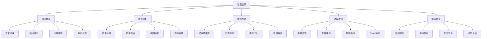

# 错误追踪

## 🎯 学习目标
- 理解错误追踪的重要性和核心概念
- 掌握错误追踪系统的设计和实现方法
- 学会使用各种错误追踪工具和技术
- 了解错误追踪的最佳实践和优化策略

## 📚 核心概念

### 错误追踪架构



### 错误追踪流程

| 阶段 | 描述 | 关键活动 | 输出物 |
|------|------|----------|--------|
| 错误捕获 | 捕获系统错误 | 异常处理、日志记录 | 错误事件 |
| 错误分析 | 分析错误原因 | 分类、聚合、根因分析 | 分析报告 |
| 错误存储 | 存储错误信息 | 数据库存储、索引优化 | 错误数据库 |
| 错误通知 | 通知相关人员 | 告警、通知、升级 | 通知记录 |
| 错误修复 | 修复错误问题 | 代码修复、测试验证 | 修复版本 |

## 🔧 错误追踪实现

### 基础错误追踪
```php
<?php
// 1. 错误追踪器
class ErrorTracker {
    private array $errors = [];
    private array $config = [];
    private array $notifiers = [];
    
    public function __construct(array $config = []) {
        $this->config = array_merge([
            'max_errors' => 1000,
            'error_retention' => 30, // 天
            'enable_notifications' => true,
            'log_level' => 'error'
        ], $config);
    }
    
    // 添加通知器
    public function addNotifier(callable $notifier): void {
        $this->notifiers[] = $notifier;
    }
    
    // 记录错误
    public function recordError(
        string $message,
        string $type = 'error',
        array $context = [],
        ?Throwable $exception = null
    ): string {
        $errorId = uniqid('err_');
        
        $error = [
            'id' => $errorId,
            'message' => $message,
            'type' => $type,
            'context' => $context,
            'exception' => $exception ? [
                'class' => get_class($exception),
                'message' => $exception->getMessage(),
                'file' => $exception->getFile(),
                'line' => $exception->getLine(),
                'trace' => $exception->getTraceAsString()
            ] : null,
            'timestamp' => time(),
            'severity' => $this->determineSeverity($type, $exception),
            'fingerprint' => $this->generateFingerprint($message, $type, $context),
            'user_id' => $context['user_id'] ?? null,
            'request_id' => $context['request_id'] ?? null,
            'url' => $context['url'] ?? null,
            'user_agent' => $context['user_agent'] ?? null,
            'ip_address' => $context['ip_address'] ?? null
        ];
        
        $this->errors[$errorId] = $error;
        
        // 检查是否需要通知
        if ($this->config['enable_notifications'] && $this->shouldNotify($error)) {
            $this->notify($error);
        }
        
        // 清理旧错误
        $this->cleanupOldErrors();
        
        return $errorId;
    }
    
    // 确定严重程度
    private function determineSeverity(string $type, ?Throwable $exception): string {
        if ($exception instanceof Error) {
            return 'critical';
        }
        
        switch ($type) {
            case 'fatal':
            case 'critical':
                return 'critical';
            case 'error':
                return 'error';
            case 'warning':
                return 'warning';
            case 'info':
                return 'info';
            default:
                return 'error';
        }
    }
    
    // 生成指纹
    private function generateFingerprint(string $message, string $type, array $context): string {
        $fingerprintData = [
            'message' => $message,
            'type' => $type,
            'file' => $context['file'] ?? null,
            'line' => $context['line'] ?? null
        ];
        
        return md5(serialize($fingerprintData));
    }
    
    // 判断是否需要通知
    private function shouldNotify(array $error): bool {
        $severity = $error['severity'];
        
        // 严重错误总是通知
        if ($severity === 'critical') {
            return true;
        }
        
        // 检查错误频率
        $fingerprint = $error['fingerprint'];
        $recentErrors = $this->getRecentErrorsByFingerprint($fingerprint, 300); // 5分钟内
        
        // 如果5分钟内相同错误超过10次，则通知
        if (count($recentErrors) > 10) {
            return true;
        }
        
        return false;
    }
    
    // 获取最近错误
    private function getRecentErrorsByFingerprint(string $fingerprint, int $timeWindow): array {
        $cutoffTime = time() - $timeWindow;
        
        return array_filter(
            $this->errors,
            fn($error) => $error['fingerprint'] === $fingerprint && $error['timestamp'] > $cutoffTime
        );
    }
    
    // 通知
    private function notify(array $error): void {
        foreach ($this->notifiers as $notifier) {
            try {
                $notifier($error);
            } catch (Exception $e) {
                // 通知失败不应该影响主流程
                error_log("Notification failed: " . $e->getMessage());
            }
        }
    }
    
    // 清理旧错误
    private function cleanupOldErrors(): void {
        $cutoffTime = time() - ($this->config['error_retention'] * 24 * 3600);
        
        $this->errors = array_filter(
            $this->errors,
            fn($error) => $error['timestamp'] > $cutoffTime
        );
        
        // 限制错误数量
        if (count($this->errors) > $this->config['max_errors']) {
            uasort($this->errors, fn($a, $b) => $b['timestamp'] - $a['timestamp']);
            $this->errors = array_slice($this->errors, 0, $this->config['max_errors'], true);
        }
    }
    
    // 获取错误
    public function getError(string $errorId): ?array {
        return $this->errors[$errorId] ?? null;
    }
    
    // 获取错误列表
    public function getErrors(array $filters = []): array {
        $errors = $this->errors;
        
        // 应用过滤器
        if (isset($filters['severity'])) {
            $errors = array_filter($errors, fn($error) => $error['severity'] === $filters['severity']);
        }
        
        if (isset($filters['type'])) {
            $errors = array_filter($errors, fn($error) => $error['type'] === $filters['type']);
        }
        
        if (isset($filters['user_id'])) {
            $errors = array_filter($errors, fn($error) => $error['user_id'] === $filters['user_id']);
        }
        
        if (isset($filters['time_range'])) {
            $cutoffTime = time() - $filters['time_range'];
            $errors = array_filter($errors, fn($error) => $error['timestamp'] > $cutoffTime);
        }
        
        // 按时间排序
        uasort($errors, fn($a, $b) => $b['timestamp'] - $a['timestamp']);
        
        return $errors;
    }
    
    // 获取错误统计
    public function getErrorStats(int $timeRange = 3600): array {
        $cutoffTime = time() - $timeRange;
        $recentErrors = array_filter(
            $this->errors,
            fn($error) => $error['timestamp'] > $cutoffTime
        );
        
        $stats = [
            'total_errors' => count($recentErrors),
            'by_severity' => [],
            'by_type' => [],
            'by_fingerprint' => [],
            'trend' => []
        ];
        
        // 按严重程度统计
        foreach ($recentErrors as $error) {
            $severity = $error['severity'];
            $stats['by_severity'][$severity] = ($stats['by_severity'][$severity] ?? 0) + 1;
        }
        
        // 按类型统计
        foreach ($recentErrors as $error) {
            $type = $error['type'];
            $stats['by_type'][$type] = ($stats['by_type'][$type] ?? 0) + 1;
        }
        
        // 按指纹统计
        foreach ($recentErrors as $error) {
            $fingerprint = $error['fingerprint'];
            $stats['by_fingerprint'][$fingerprint] = ($stats['by_fingerprint'][$fingerprint] ?? 0) + 1;
        }
        
        // 趋势分析（按小时）
        $hourlyStats = [];
        foreach ($recentErrors as $error) {
            $hour = date('Y-m-d H:00:00', $error['timestamp']);
            $hourlyStats[$hour] = ($hourlyStats[$hour] ?? 0) + 1;
        }
        $stats['trend'] = $hourlyStats;
        
        return $stats;
    }
    
    // 获取所有错误
    public function getAllErrors(): array {
        return $this->errors;
    }
}

// 2. 错误分析器
class ErrorAnalyzer {
    private ErrorTracker $tracker;
    
    public function __construct(ErrorTracker $tracker) {
        $this->tracker = $tracker;
    }
    
    // 分析错误模式
    public function analyzeErrorPatterns(int $timeRange = 86400): array {
        $errors = $this->tracker->getErrors(['time_range' => $timeRange]);
        
        $patterns = [
            'frequent_errors' => [],
            'error_clusters' => [],
            'time_patterns' => [],
            'user_patterns' => []
        ];
        
        // 频繁错误
        $fingerprintCounts = [];
        foreach ($errors as $error) {
            $fingerprint = $error['fingerprint'];
            $fingerprintCounts[$fingerprint] = ($fingerprintCounts[$fingerprint] ?? 0) + 1;
        }
        
        arsort($fingerprintCounts);
        $patterns['frequent_errors'] = array_slice($fingerprintCounts, 0, 10, true);
        
        // 错误集群
        $patterns['error_clusters'] = $this->identifyErrorClusters($errors);
        
        // 时间模式
        $patterns['time_patterns'] = $this->analyzeTimePatterns($errors);
        
        // 用户模式
        $patterns['user_patterns'] = $this->analyzeUserPatterns($errors);
        
        return $patterns;
    }
    
    // 识别错误集群
    private function identifyErrorClusters(array $errors): array {
        $clusters = [];
        
        foreach ($errors as $error) {
            $fingerprint = $error['fingerprint'];
            $timestamp = $error['timestamp'];
            
            if (!isset($clusters[$fingerprint])) {
                $clusters[$fingerprint] = [];
            }
            
            $clusters[$fingerprint][] = $timestamp;
        }
        
        // 分析集群时间分布
        $clusterAnalysis = [];
        foreach ($clusters as $fingerprint => $timestamps) {
            if (count($timestamps) > 5) { // 只分析频繁错误
                $clusterAnalysis[$fingerprint] = [
                    'count' => count($timestamps),
                    'first_occurrence' => min($timestamps),
                    'last_occurrence' => max($timestamps),
                    'duration' => max($timestamps) - min($timestamps),
                    'frequency' => count($timestamps) / (max($timestamps) - min($timestamps) + 1)
                ];
            }
        }
        
        return $clusterAnalysis;
    }
    
    // 分析时间模式
    private function analyzeTimePatterns(array $errors): array {
        $hourlyCounts = [];
        $dailyCounts = [];
        
        foreach ($errors as $error) {
            $hour = date('H', $error['timestamp']);
            $day = date('w', $error['timestamp']); // 0=Sunday, 6=Saturday
            
            $hourlyCounts[$hour] = ($hourlyCounts[$hour] ?? 0) + 1;
            $dailyCounts[$day] = ($dailyCounts[$day] ?? 0) + 1;
        }
        
        return [
            'hourly' => $hourlyCounts,
            'daily' => $dailyCounts
        ];
    }
    
    // 分析用户模式
    private function analyzeUserPatterns(array $errors): array {
        $userCounts = [];
        $userErrors = [];
        
        foreach ($errors as $error) {
            if ($error['user_id']) {
                $userId = $error['user_id'];
                $userCounts[$userId] = ($userCounts[$userId] ?? 0) + 1;
                
                if (!isset($userErrors[$userId])) {
                    $userErrors[$userId] = [];
                }
                $userErrors[$userId][] = $error;
            }
        }
        
        arsort($userCounts);
        
        return [
            'top_users' => array_slice($userCounts, 0, 10, true),
            'user_error_details' => $userErrors
        ];
    }
    
    // 生成错误报告
    public function generateErrorReport(int $timeRange = 86400): array {
        $stats = $this->tracker->getErrorStats($timeRange);
        $patterns = $this->analyzeErrorPatterns($timeRange);
        
        return [
            'summary' => [
                'total_errors' => $stats['total_errors'],
                'time_range' => $timeRange,
                'report_generated' => date('Y-m-d H:i:s')
            ],
            'statistics' => $stats,
            'patterns' => $patterns,
            'recommendations' => $this->generateRecommendations($stats, $patterns)
        ];
    }
    
    // 生成建议
    private function generateRecommendations(array $stats, array $patterns): array {
        $recommendations = [];
        
        // 基于频繁错误的建议
        if (!empty($patterns['frequent_errors'])) {
            $topError = array_key_first($patterns['frequent_errors']);
            $recommendations[] = [
                'type' => 'frequent_error',
                'priority' => 'high',
                'message' => "频繁错误需要优先修复: {$topError}",
                'action' => '立即修复此错误'
            ];
        }
        
        // 基于错误集群的建议
        if (!empty($patterns['error_clusters'])) {
            $recommendations[] = [
                'type' => 'error_cluster',
                'priority' => 'medium',
                'message' => '发现错误集群，可能存在系统性问题',
                'action' => '深入分析错误集群原因'
            ];
        }
        
        // 基于时间模式的建议
        if (!empty($patterns['time_patterns']['hourly'])) {
            $peakHour = array_search(max($patterns['time_patterns']['hourly']), $patterns['time_patterns']['hourly']);
            $recommendations[] = [
                'type' => 'time_pattern',
                'priority' => 'low',
                'message' => "错误在 {$peakHour}:00 时达到峰值",
                'action' => '在峰值时间加强监控'
            ];
        }
        
        return $recommendations;
    }
}

// 使用示例
echo "=== 错误追踪示例 ===\n";

try {
    // 创建错误追踪器
    $tracker = new ErrorTracker([
        'max_errors' => 100,
        'error_retention' => 7,
        'enable_notifications' => true
    ]);
    
    // 添加通知器
    $tracker->addNotifier(function($error) {
        echo "通知: 错误 {$error['id']} - {$error['message']}\n";
    });
    
    // 记录各种错误
    $tracker->recordError('Database connection failed', 'error', [
        'user_id' => 123,
        'request_id' => 'req_001',
        'url' => '/api/users',
        'file' => 'Database.php',
        'line' => 45
    ]);
    
    $tracker->recordError('Invalid user input', 'warning', [
        'user_id' => 456,
        'request_id' => 'req_002',
        'url' => '/api/orders',
        'file' => 'Validator.php',
        'line' => 23
    ]);
    
    // 记录异常
    try {
        throw new Exception('Something went wrong');
    } catch (Exception $e) {
        $tracker->recordError('Exception occurred', 'error', [
            'user_id' => 789,
            'request_id' => 'req_003',
            'url' => '/api/products'
        ], $e);
    }
    
    // 获取错误统计
    $stats = $tracker->getErrorStats();
    echo "错误统计:\n";
    echo "  总错误数: {$stats['total_errors']}\n";
    echo "  按严重程度: " . json_encode($stats['by_severity']) . "\n";
    echo "  按类型: " . json_encode($stats['by_type']) . "\n";
    
    // 创建错误分析器
    $analyzer = new ErrorAnalyzer($tracker);
    
    // 分析错误模式
    $patterns = $analyzer->analyzeErrorPatterns();
    echo "\n错误模式分析:\n";
    echo "  频繁错误: " . json_encode($patterns['frequent_errors']) . "\n";
    
    // 生成错误报告
    $report = $analyzer->generateErrorReport();
    echo "\n错误报告:\n";
    echo "  总错误数: {$report['summary']['total_errors']}\n";
    echo "  建议数量: " . count($report['recommendations']) . "\n";
    
    foreach ($report['recommendations'] as $recommendation) {
        echo "  - [{$recommendation['priority']}] {$recommendation['message']}\n";
    }
    
} catch (Exception $e) {
    echo "错误: " . $e->getMessage() . "\n";
}
?>
```

## 📊 最佳实践

### 错误追踪最佳实践
```php
<?php
// 错误追踪最佳实践

class ErrorTrackingBestPractices {
    // 1. 错误捕获最佳实践
    public static function getErrorCaptureBestPractices() {
        return [
            '异常处理' => [
                '全局异常处理' => '实现全局异常处理机制',
                '分层异常处理' => '在不同层次处理异常',
                '异常分类' => '对异常进行分类处理',
                '异常恢复' => '实现异常恢复机制'
            ],
            '错误日志' => [
                '结构化日志' => '使用结构化日志格式',
                '上下文信息' => '记录丰富的上下文信息',
                '日志级别' => '合理设置日志级别',
                '日志轮转' => '实现日志轮转机制'
            ],
            '性能监控' => [
                '性能影响' => '监控错误对性能的影响',
                '资源使用' => '监控错误处理资源使用',
                '响应时间' => '监控错误处理响应时间',
                '吞吐量' => '监控错误处理吞吐量'
            ]
        ];
    }
    
    // 2. 错误分析最佳实践
    public static function getErrorAnalysisBestPractices() {
        return [
            '错误分类' => [
                '按严重程度' => '按严重程度分类错误',
                '按类型' => '按错误类型分类',
                '按影响范围' => '按影响范围分类',
                '按用户群体' => '按用户群体分类'
            ],
            '根因分析' => [
                '5W1H分析' => '使用5W1H方法分析',
                '鱼骨图分析' => '使用鱼骨图分析',
                '时间线分析' => '分析错误时间线',
                '依赖分析' => '分析系统依赖关系'
            ],
            '趋势分析' => [
                '时间趋势' => '分析错误时间趋势',
                '频率趋势' => '分析错误频率趋势',
                '影响趋势' => '分析错误影响趋势',
                '修复趋势' => '分析错误修复趋势'
            ]
        ];
    }
    
    // 3. 错误修复最佳实践
    public static function getErrorFixBestPractices() {
        return [
            '修复策略' => [
                '优先级排序' => '按优先级排序修复',
                '影响评估' => '评估修复影响',
                '风险控制' => '控制修复风险',
                '测试验证' => '测试验证修复效果'
            ],
            '修复流程' => [
                '问题确认' => '确认问题存在',
                '根因定位' => '定位问题根因',
                '解决方案' => '制定解决方案',
                '实施修复' => '实施修复方案'
            ],
            '质量保证' => [
                '代码审查' => '进行代码审查',
                '测试覆盖' => '确保测试覆盖',
                '回归测试' => '进行回归测试',
                '监控验证' => '监控验证修复效果'
            ]
        ];
    }
}

// 使用示例
echo "=== 错误追踪最佳实践示例 ===\n";

try {
    $capturePractices = ErrorTrackingBestPractices::getErrorCaptureBestPractices();
    echo "错误捕获最佳实践:\n";
    foreach ($capturePractices as $category => $practices) {
        echo "  $category:\n";
        foreach ($practices as $practice => $description) {
            echo "    - $practice: $description\n";
        }
        echo "\n";
    }
    
} catch (Exception $e) {
    echo "错误: " . $e->getMessage() . "\n";
}
?>
```

## 🎓 学习建议

### 费曼学习法应用
1. **选择概念**: 选择错误追踪中的核心概念
2. **简化解释**: 用简单语言解释错误追踪的重要性
3. **识别盲点**: 发现理解不深入的地方
4. **重新学习**: 针对盲点进行深入学习

### 刻意练习重点
1. **错误捕获**: 掌握错误捕获的方法和技巧
2. **错误分析**: 学会分析错误模式和根因
3. **错误修复**: 掌握错误修复的策略和流程
4. **工具使用**: 熟练使用各种错误追踪工具

## 🔗 相关链接
- [[01-性能监控|性能监控]]
- [[03-日志分析|日志分析]]
- [[04-调试工具使用|调试工具使用]]
- [[05-性能分析工具|性能分析工具]]
- [[06-问题排查技巧|问题排查技巧]]
- [[07-监控体系设计|监控体系设计]]
