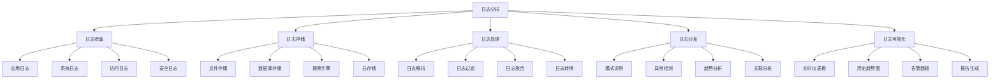

# 日志分析

## 🎯 学习目标
- 理解日志分析的重要性和核心概念
- 掌握日志收集、存储和分析的方法
- 学会使用各种日志分析工具和技术
- 了解日志分析的最佳实践和优化策略

## 📚 核心概念

### 日志分析架构



### 日志分析流程

| 阶段 | 描述 | 关键活动 | 输出物 |
|------|------|----------|--------|
| 日志收集 | 收集各种日志 | 日志采集、传输、缓冲 | 原始日志 |
| 日志存储 | 存储日志数据 | 索引、压缩、归档 | 结构化日志 |
| 日志处理 | 处理日志数据 | 解析、过滤、聚合 | 处理后的日志 |
| 日志分析 | 分析日志内容 | 模式识别、异常检测 | 分析结果 |
| 日志可视化 | 可视化展示 | 图表、仪表板、报告 | 可视化界面 |

## 🔧 日志分析实现

### 基础日志分析
```php
<?php
// 1. 日志收集器
class LogCollector {
    private array $sources = [];
    private array $filters = [];
    private array $processors = [];
    
    // 添加日志源
    public function addSource(string $name, callable $source): void {
        $this->sources[$name] = $source;
    }
    
    // 添加过滤器
    public function addFilter(string $name, callable $filter): void {
        $this->filters[$name] = $filter;
    }
    
    // 添加处理器
    public function addProcessor(string $name, callable $processor): void {
        $this->processors[$name] = $processor;
    }
    
    // 收集日志
    public function collectLogs(): array {
        $logs = [];
        
        foreach ($this->sources as $sourceName => $source) {
            try {
                $sourceLogs = $source();
                $logs = array_merge($logs, $sourceLogs);
            } catch (Exception $e) {
                error_log("Failed to collect logs from source {$sourceName}: " . $e->getMessage());
            }
        }
        
        return $logs;
    }
    
    // 处理日志
    public function processLogs(array $logs): array {
        $processedLogs = $logs;
        
        // 应用过滤器
        foreach ($this->filters as $filterName => $filter) {
            $processedLogs = array_filter($processedLogs, $filter);
        }
        
        // 应用处理器
        foreach ($this->processors as $processorName => $processor) {
            $processedLogs = array_map($processor, $processedLogs);
        }
        
        return $processedLogs;
    }
    
    // 获取所有日志
    public function getAllLogs(): array {
        $rawLogs = $this->collectLogs();
        return $this->processLogs($rawLogs);
    }
}

// 2. 日志解析器
class LogParser {
    private array $patterns = [];
    
    // 添加解析模式
    public function addPattern(string $name, string $pattern, array $fields): void {
        $this->patterns[$name] = [
            'pattern' => $pattern,
            'fields' => $fields
        ];
    }
    
    // 解析日志
    public function parseLog(string $logLine, string $patternName = null): ?array {
        if ($patternName && isset($this->patterns[$patternName])) {
            return $this->parseWithPattern($logLine, $this->patterns[$patternName]);
        }
        
        // 尝试所有模式
        foreach ($this->patterns as $name => $pattern) {
            $result = $this->parseWithPattern($logLine, $pattern);
            if ($result !== null) {
                return $result;
            }
        }
        
        return null;
    }
    
    // 使用特定模式解析
    private function parseWithPattern(string $logLine, array $pattern): ?array {
        if (preg_match($pattern['pattern'], $logLine, $matches)) {
            $result = [];
            foreach ($pattern['fields'] as $index => $field) {
                $result[$field] = $matches[$index + 1] ?? null;
            }
            return $result;
        }
        
        return null;
    }
    
    // 批量解析日志
    public function parseLogs(array $logLines, string $patternName = null): array {
        $parsedLogs = [];
        
        foreach ($logLines as $logLine) {
            $parsed = $this->parseLog($logLine, $patternName);
            if ($parsed !== null) {
                $parsedLogs[] = $parsed;
            }
        }
        
        return $parsedLogs;
    }
}

// 3. 日志分析器
class LogAnalyzer {
    private array $logs = [];
    private array $patterns = [];
    private array $anomalies = [];
    
    // 添加日志
    public function addLogs(array $logs): void {
        $this->logs = array_merge($this->logs, $logs);
    }
    
    // 分析日志模式
    public function analyzePatterns(): array {
        $patterns = [
            'frequent_errors' => [],
            'error_clusters' => [],
            'time_patterns' => [],
            'user_patterns' => []
        ];
        
        // 频繁错误
        $errorCounts = [];
        foreach ($this->logs as $log) {
            if (isset($log['level']) && $log['level'] === 'ERROR') {
                $message = $log['message'] ?? '';
                $errorCounts[$message] = ($errorCounts[$message] ?? 0) + 1;
            }
        }
        
        arsort($errorCounts);
        $patterns['frequent_errors'] = array_slice($errorCounts, 0, 10, true);
        
        // 错误集群
        $patterns['error_clusters'] = $this->identifyErrorClusters();
        
        // 时间模式
        $patterns['time_patterns'] = $this->analyzeTimePatterns();
        
        // 用户模式
        $patterns['user_patterns'] = $this->analyzeUserPatterns();
        
        return $patterns;
    }
    
    // 识别错误集群
    private function identifyErrorClusters(): array {
        $clusters = [];
        $errorLogs = array_filter($this->logs, fn($log) => ($log['level'] ?? '') === 'ERROR');
        
        foreach ($errorLogs as $log) {
            $message = $log['message'] ?? '';
            $timestamp = $log['timestamp'] ?? time();
            
            if (!isset($clusters[$message])) {
                $clusters[$message] = [];
            }
            
            $clusters[$message][] = $timestamp;
        }
        
        // 分析集群
        $clusterAnalysis = [];
        foreach ($clusters as $message => $timestamps) {
            if (count($timestamps) > 5) {
                $clusterAnalysis[$message] = [
                    'count' => count($timestamps),
                    'first_occurrence' => min($timestamps),
                    'last_occurrence' => max($timestamps),
                    'duration' => max($timestamps) - min($timestamps),
                    'frequency' => count($timestamps) / (max($timestamps) - min($timestamps) + 1)
                ];
            }
        }
        
        return $clusterAnalysis;
    }
    
    // 分析时间模式
    private function analyzeTimePatterns(): array {
        $hourlyCounts = [];
        $dailyCounts = [];
        
        foreach ($this->logs as $log) {
            $timestamp = $log['timestamp'] ?? time();
            $hour = date('H', $timestamp);
            $day = date('w', $timestamp);
            
            $hourlyCounts[$hour] = ($hourlyCounts[$hour] ?? 0) + 1;
            $dailyCounts[$day] = ($dailyCounts[$day] ?? 0) + 1;
        }
        
        return [
            'hourly' => $hourlyCounts,
            'daily' => $dailyCounts
        ];
    }
    
    // 分析用户模式
    private function analyzeUserPatterns(): array {
        $userCounts = [];
        $userLogs = [];
        
        foreach ($this->logs as $log) {
            if (isset($log['user_id'])) {
                $userId = $log['user_id'];
                $userCounts[$userId] = ($userCounts[$userId] ?? 0) + 1;
                
                if (!isset($userLogs[$userId])) {
                    $userLogs[$userId] = [];
                }
                $userLogs[$userId][] = $log;
            }
        }
        
        arsort($userCounts);
        
        return [
            'top_users' => array_slice($userCounts, 0, 10, true),
            'user_log_details' => $userLogs
        ];
    }
    
    // 检测异常
    public function detectAnomalies(): array {
        $anomalies = [];
        
        // 检测错误率异常
        $errorRate = $this->calculateErrorRate();
        if ($errorRate > 0.1) { // 错误率超过10%
            $anomalies[] = [
                'type' => 'high_error_rate',
                'severity' => 'high',
                'value' => $errorRate,
                'threshold' => 0.1,
                'message' => "错误率异常高: {$errorRate}"
            ];
        }
        
        // 检测响应时间异常
        $avgResponseTime = $this->calculateAverageResponseTime();
        if ($avgResponseTime > 2000) { // 平均响应时间超过2秒
            $anomalies[] = [
                'type' => 'high_response_time',
                'severity' => 'medium',
                'value' => $avgResponseTime,
                'threshold' => 2000,
                'message' => "平均响应时间异常: {$avgResponseTime}ms"
            ];
        }
        
        // 检测流量异常
        $trafficAnomaly = $this->detectTrafficAnomaly();
        if ($trafficAnomaly) {
            $anomalies[] = $trafficAnomaly;
        }
        
        return $anomalies;
    }
    
    // 计算错误率
    private function calculateErrorRate(): float {
        $totalLogs = count($this->logs);
        if ($totalLogs === 0) {
            return 0;
        }
        
        $errorLogs = array_filter($this->logs, fn($log) => ($log['level'] ?? '') === 'ERROR');
        return count($errorLogs) / $totalLogs;
    }
    
    // 计算平均响应时间
    private function calculateAverageResponseTime(): float {
        $responseTimes = [];
        
        foreach ($this->logs as $log) {
            if (isset($log['response_time'])) {
                $responseTimes[] = $log['response_time'];
            }
        }
        
        if (empty($responseTimes)) {
            return 0;
        }
        
        return array_sum($responseTimes) / count($responseTimes);
    }
    
    // 检测流量异常
    private function detectTrafficAnomaly(): ?array {
        $hourlyCounts = [];
        
        foreach ($this->logs as $log) {
            $timestamp = $log['timestamp'] ?? time();
            $hour = date('Y-m-d H:00:00', $timestamp);
            $hourlyCounts[$hour] = ($hourlyCounts[$hour] ?? 0) + 1;
        }
        
        if (count($hourlyCounts) < 2) {
            return null;
        }
        
        $values = array_values($hourlyCounts);
        $avg = array_sum($values) / count($values);
        $stdDev = sqrt(array_sum(array_map(fn($x) => pow($x - $avg, 2), $values)) / count($values));
        
        // 检测异常值（超过2个标准差）
        foreach ($hourlyCounts as $hour => $count) {
            if (abs($count - $avg) > 2 * $stdDev) {
                return [
                    'type' => 'traffic_anomaly',
                    'severity' => 'medium',
                    'hour' => $hour,
                    'count' => $count,
                    'expected' => $avg,
                    'message' => "流量异常: {$hour} 有 {$count} 条日志，预期约 {$avg}"
                ];
            }
        }
        
        return null;
    }
    
    // 生成分析报告
    public function generateReport(): array {
        $patterns = $this->analyzePatterns();
        $anomalies = $this->detectAnomalies();
        
        return [
            'summary' => [
                'total_logs' => count($this->logs),
                'analysis_time' => date('Y-m-d H:i:s'),
                'anomalies_count' => count($anomalies)
            ],
            'patterns' => $patterns,
            'anomalies' => $anomalies,
            'recommendations' => $this->generateRecommendations($patterns, $anomalies)
        ];
    }
    
    // 生成建议
    private function generateRecommendations(array $patterns, array $anomalies): array {
        $recommendations = [];
        
        // 基于频繁错误的建议
        if (!empty($patterns['frequent_errors'])) {
            $topError = array_key_first($patterns['frequent_errors']);
            $recommendations[] = [
                'type' => 'frequent_error',
                'priority' => 'high',
                'message' => "频繁错误需要优先处理: {$topError}",
                'action' => '立即修复此错误'
            ];
        }
        
        // 基于异常的建议
        foreach ($anomalies as $anomaly) {
            $recommendations[] = [
                'type' => 'anomaly',
                'priority' => $anomaly['severity'],
                'message' => $anomaly['message'],
                'action' => '调查并解决此异常'
            ];
        }
        
        return $recommendations;
    }
}

// 使用示例
echo "=== 日志分析示例 ===\n";

try {
    // 创建日志收集器
    $collector = new LogCollector();
    
    // 添加日志源
    $collector->addSource('application', function() {
        return [
            [
                'timestamp' => time(),
                'level' => 'INFO',
                'message' => 'User login successful',
                'user_id' => 123,
                'ip' => '192.168.1.1'
            ],
            [
                'timestamp' => time() - 100,
                'level' => 'ERROR',
                'message' => 'Database connection failed',
                'user_id' => 456,
                'ip' => '192.168.1.2'
            ],
            [
                'timestamp' => time() - 200,
                'level' => 'WARNING',
                'message' => 'High memory usage detected',
                'user_id' => 789,
                'ip' => '192.168.1.3'
            ]
        ];
    });
    
    // 添加过滤器
    $collector->addFilter('error_only', function($log) {
        return ($log['level'] ?? '') === 'ERROR';
    });
    
    // 添加处理器
    $collector->addProcessor('add_timestamp', function($log) {
        $log['processed_at'] = time();
        return $log;
    });
    
    // 收集和处理日志
    $logs = $collector->getAllLogs();
    echo "收集到 " . count($logs) . " 条日志\n";
    
    // 创建日志分析器
    $analyzer = new LogAnalyzer();
    $analyzer->addLogs($logs);
    
    // 分析日志模式
    $patterns = $analyzer->analyzePatterns();
    echo "日志模式分析完成\n";
    echo "频繁错误: " . json_encode($patterns['frequent_errors']) . "\n";
    
    // 检测异常
    $anomalies = $analyzer->detectAnomalies();
    echo "检测到 " . count($anomalies) . " 个异常\n";
    
    // 生成分析报告
    $report = $analyzer->generateReport();
    echo "分析报告生成完成\n";
    echo "总日志数: {$report['summary']['total_logs']}\n";
    echo "异常数量: {$report['summary']['anomalies_count']}\n";
    echo "建议数量: " . count($report['recommendations']) . "\n";
    
    foreach ($report['recommendations'] as $recommendation) {
        echo "  - [{$recommendation['priority']}] {$recommendation['message']}\n";
    }
    
} catch (Exception $e) {
    echo "错误: " . $e->getMessage() . "\n";
}
?>
```

## 📊 最佳实践

### 日志分析最佳实践
```php
<?php
// 日志分析最佳实践

class LogAnalysisBestPractices {
    // 1. 日志收集最佳实践
    public static function getLogCollectionBestPractices() {
        return [
            '日志设计' => [
                '结构化日志' => '使用结构化日志格式',
                '日志级别' => '合理设置日志级别',
                '上下文信息' => '记录丰富的上下文信息',
                '日志格式' => '统一日志格式标准'
            ],
            '收集策略' => [
                '实时收集' => '实现实时日志收集',
                '批量收集' => '使用批量收集提高效率',
                '过滤收集' => '在收集时进行过滤',
                '压缩传输' => '压缩日志数据减少带宽'
            ],
            '存储管理' => [
                '索引优化' => '优化日志索引策略',
                '数据保留' => '合理设置数据保留期',
                '数据压缩' => '压缩历史日志数据',
                '数据归档' => '归档旧日志数据'
            ]
        ];
    }
    
    // 2. 日志分析最佳实践
    public static function getLogAnalysisBestPractices() {
        return [
            '分析方法' => [
                '模式识别' => '识别日志中的模式',
                '异常检测' => '检测异常日志模式',
                '趋势分析' => '分析日志趋势变化',
                '关联分析' => '分析日志间关联关系'
            ],
            '分析工具' => [
                '搜索引擎' => '使用Elasticsearch等搜索引擎',
                '分析框架' => '使用日志分析框架',
                '可视化工具' => '使用可视化工具展示结果',
                '机器学习' => '使用机器学习分析日志'
            ],
            '分析策略' => [
                '实时分析' => '实现实时日志分析',
                '批量分析' => '进行批量历史分析',
                '增量分析' => '实现增量分析',
                '对比分析' => '进行对比分析'
            ]
        ];
    }
    
    // 3. 日志监控最佳实践
    public static function getLogMonitoringBestPractices() {
        return [
            '监控指标' => [
                '错误率监控' => '监控错误日志比例',
                '性能监控' => '监控性能相关日志',
                '安全监控' => '监控安全相关日志',
                '业务监控' => '监控业务相关日志'
            ],
            '告警机制' => [
                '阈值告警' => '设置合理的告警阈值',
                '模式告警' => '基于模式设置告警',
                '异常告警' => '基于异常检测告警',
                '趋势告警' => '基于趋势变化告警'
            ],
            '响应处理' => [
                '自动响应' => '实现自动响应机制',
                '人工处理' => '建立人工处理流程',
                '升级机制' => '建立告警升级机制',
                '反馈机制' => '建立处理反馈机制'
            ]
        ];
    }
}

// 使用示例
echo "=== 日志分析最佳实践示例 ===\n";

try {
    $collectionPractices = LogAnalysisBestPractices::getLogCollectionBestPractices();
    echo "日志收集最佳实践:\n";
    foreach ($collectionPractices as $category => $practices) {
        echo "  $category:\n";
        foreach ($practices as $practice => $description) {
            echo "    - $practice: $description\n";
        }
        echo "\n";
    }
    
} catch (Exception $e) {
    echo "错误: " . $e->getMessage() . "\n";
}
?>
```

## 🎓 学习建议

### 费曼学习法应用
1. **选择概念**: 选择日志分析中的核心概念
2. **简化解释**: 用简单语言解释日志分析的重要性
3. **识别盲点**: 发现理解不深入的地方
4. **重新学习**: 针对盲点进行深入学习

### 刻意练习重点
1. **日志收集**: 掌握日志收集的方法和技巧
2. **日志分析**: 学会分析日志模式和异常
3. **工具使用**: 熟练使用各种日志分析工具
4. **监控告警**: 建立有效的日志监控和告警机制

## 🔗 相关链接
- [[01-性能监控|性能监控]]
- [[02-错误追踪|错误追踪]]
- [[04-调试工具使用|调试工具使用]]
- [[05-性能分析工具|性能分析工具]]
- [[06-问题排查技巧|问题排查技巧]]
- [[07-监控体系设计|监控体系设计]]
