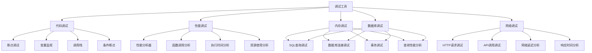

# 调试工具使用

## 🎯 学习目标
- 理解调试工具的重要性和核心概念
- 掌握各种调试工具的使用方法和技巧
- 学会在PHP开发中有效使用调试工具
- 了解调试工具的最佳实践和优化策略

## 📚 核心概念

### 调试工具架构



### 调试工具分类

| 工具类型 | 描述 | 主要功能 | 适用场景 |
|----------|------|----------|----------|
| IDE调试器 | 集成开发环境调试 | 断点、变量监视、调用栈 | 开发阶段调试 |
| 性能分析器 | 性能问题分析 | 函数调用、执行时间、内存使用 | 性能优化 |
| 日志调试 | 日志记录和分析 | 日志输出、日志分析 | 生产环境调试 |
| 网络调试 | 网络请求调试 | HTTP请求、API调用、网络延迟 | 网络问题排查 |
| 数据库调试 | 数据库操作调试 | SQL查询、连接、事务 | 数据库问题排查 |

## 🔧 调试工具实现

### 基础调试工具
```php
<?php
// 1. 调试器
class Debugger {
    private array $breakpoints = [];
    private array $watches = [];
    private array $callStack = [];
    private bool $enabled = false;
    private array $config = [];
    
    public function __construct(array $config = []) {
        $this->config = array_merge([
            'enable_logging' => true,
            'log_level' => 'debug',
            'max_call_stack' => 100,
            'enable_profiling' => false
        ], $config);
    }
    
    // 启用调试器
    public function enable(): void {
        $this->enabled = true;
        $this->log('Debugger enabled');
    }
    
    // 禁用调试器
    public function disable(): void {
        $this->enabled = false;
        $this->log('Debugger disabled');
    }
    
    // 设置断点
    public function setBreakpoint(string $file, int $line, array $conditions = []): void {
        $breakpointId = uniqid('bp_');
        $this->breakpoints[$breakpointId] = [
            'file' => $file,
            'line' => $line,
            'conditions' => $conditions,
            'hit_count' => 0
        ];
        
        $this->log("Breakpoint set at {$file}:{$line}");
    }
    
    // 检查断点
    public function checkBreakpoint(string $file, int $line, array $context = []): bool {
        if (!$this->enabled) {
            return false;
        }
        
        foreach ($this->breakpoints as $id => $breakpoint) {
            if ($breakpoint['file'] === $file && $breakpoint['line'] === $line) {
                // 检查条件
                if ($this->evaluateConditions($breakpoint['conditions'], $context)) {
                    $this->breakpoints[$id]['hit_count']++;
                    $this->handleBreakpoint($breakpoint, $context);
                    return true;
                }
            }
        }
        
        return false;
    }
    
    // 评估条件
    private function evaluateConditions(array $conditions, array $context): bool {
        if (empty($conditions)) {
            return true;
        }
        
        foreach ($conditions as $condition) {
            if (!$this->evaluateCondition($condition, $context)) {
                return false;
            }
        }
        
        return true;
    }
    
    // 评估单个条件
    private function evaluateCondition(string $condition, array $context): bool {
        // 简单的条件评估，实际实现会更复杂
        try {
            return eval("return {$condition};");
        } catch (Exception $e) {
            return false;
        }
    }
    
    // 处理断点
    private function handleBreakpoint(array $breakpoint, array $context): void {
        $this->log("Breakpoint hit at {$breakpoint['file']}:{$breakpoint['line']}");
        $this->log("Context: " . json_encode($context));
        
        // 在实际实现中，这里会暂停执行并等待用户交互
        $this->interactiveDebug($breakpoint, $context);
    }
    
    // 交互式调试
    private function interactiveDebug(array $breakpoint, array $context): void {
        echo "=== DEBUGGER BREAKPOINT ===\n";
        echo "File: {$breakpoint['file']}\n";
        echo "Line: {$breakpoint['line']}\n";
        echo "Hit count: {$breakpoint['hit_count']}\n";
        echo "Context:\n";
        foreach ($context as $key => $value) {
            echo "  {$key}: " . (is_scalar($value) ? $value : gettype($value)) . "\n";
        }
        echo "===========================\n";
    }
    
    // 添加监视
    public function addWatch(string $expression): void {
        $this->watches[] = $expression;
        $this->log("Watch added: {$expression}");
    }
    
    // 移除监视
    public function removeWatch(string $expression): void {
        $key = array_search($expression, $this->watches);
        if ($key !== false) {
            unset($this->watches[$key]);
            $this->log("Watch removed: {$expression}");
        }
    }
    
    // 评估监视表达式
    public function evaluateWatches(array $context): array {
        $results = [];
        
        foreach ($this->watches as $expression) {
            try {
                $results[$expression] = eval("return {$expression};");
            } catch (Exception $e) {
                $results[$expression] = "Error: " . $e->getMessage();
            }
        }
        
        return $results;
    }
    
    // 记录调用栈
    public function recordCallStack(string $function, array $args = []): void {
        if (count($this->callStack) >= $this->config['max_call_stack']) {
            array_shift($this->callStack);
        }
        
        $this->callStack[] = [
            'function' => $function,
            'args' => $args,
            'timestamp' => microtime(true),
            'memory' => memory_get_usage()
        ];
    }
    
    // 获取调用栈
    public function getCallStack(): array {
        return $this->callStack;
    }
    
    // 清空调用栈
    public function clearCallStack(): void {
        $this->callStack = [];
    }
    
    // 日志记录
    private function log(string $message): void {
        if ($this->config['enable_logging']) {
            error_log("[DEBUGGER] {$message}");
        }
    }
    
    // 获取调试信息
    public function getDebugInfo(): array {
        return [
            'enabled' => $this->enabled,
            'breakpoints' => $this->breakpoints,
            'watches' => $this->watches,
            'call_stack' => $this->callStack,
            'config' => $this->config
        ];
    }
}

// 2. 性能分析器
class PerformanceProfiler {
    private array $profiles = [];
    private array $currentProfile = null;
    private bool $enabled = false;
    private array $config = [];
    
    public function __construct(array $config = []) {
        $this->config = array_merge([
            'enable_memory_profiling' => true,
            'enable_time_profiling' => true,
            'enable_call_profiling' => true,
            'max_profiles' => 1000
        ], $config);
    }
    
    // 启用性能分析
    public function enable(): void {
        $this->enabled = true;
    }
    
    // 禁用性能分析
    public function disable(): void {
        $this->enabled = false;
    }
    
    // 开始性能分析
    public function startProfile(string $name, array $context = []): void {
        if (!$this->enabled) {
            return;
        }
        
        $this->currentProfile = [
            'name' => $name,
            'context' => $context,
            'start_time' => microtime(true),
            'start_memory' => memory_get_usage(),
            'start_peak_memory' => memory_get_peak_usage(),
            'calls' => []
        ];
    }
    
    // 结束性能分析
    public function endProfile(): ?array {
        if (!$this->enabled || !$this->currentProfile) {
            return null;
        }
        
        $profile = $this->currentProfile;
        $profile['end_time'] = microtime(true);
        $profile['end_memory'] = memory_get_usage();
        $profile['end_peak_memory'] = memory_get_peak_usage();
        
        $profile['duration'] = $profile['end_time'] - $profile['start_time'];
        $profile['memory_used'] = $profile['end_memory'] - $profile['start_memory'];
        $profile['peak_memory_used'] = $profile['end_peak_memory'] - $profile['start_peak_memory'];
        
        $this->profiles[] = $profile;
        
        // 限制配置文件数量
        if (count($this->profiles) > $this->config['max_profiles']) {
            array_shift($this->profiles);
        }
        
        $this->currentProfile = null;
        return $profile;
    }
    
    // 记录函数调用
    public function recordCall(string $function, float $duration, int $memoryUsed = 0): void {
        if (!$this->enabled || !$this->currentProfile) {
            return;
        }
        
        $this->currentProfile['calls'][] = [
            'function' => $function,
            'duration' => $duration,
            'memory_used' => $memoryUsed,
            'timestamp' => microtime(true)
        ];
    }
    
    // 获取性能报告
    public function getPerformanceReport(): array {
        if (empty($this->profiles)) {
            return [
                'total_profiles' => 0,
                'average_duration' => 0,
                'total_memory_used' => 0,
                'slowest_functions' => [],
                'memory_hungry_functions' => []
            ];
        }
        
        $totalDuration = array_sum(array_column($this->profiles, 'duration'));
        $totalMemory = array_sum(array_column($this->profiles, 'memory_used'));
        
        // 找出最慢的函数
        $slowestFunctions = [];
        foreach ($this->profiles as $profile) {
            foreach ($profile['calls'] as $call) {
                $function = $call['function'];
                if (!isset($slowestFunctions[$function])) {
                    $slowestFunctions[$function] = [
                        'total_duration' => 0,
                        'call_count' => 0,
                        'average_duration' => 0
                    ];
                }
                $slowestFunctions[$function]['total_duration'] += $call['duration'];
                $slowestFunctions[$function]['call_count']++;
            }
        }
        
        // 计算平均时间
        foreach ($slowestFunctions as $function => &$stats) {
            $stats['average_duration'] = $stats['total_duration'] / $stats['call_count'];
        }
        
        // 按平均时间排序
        uasort($slowestFunctions, fn($a, $b) => $b['average_duration'] <=> $a['average_duration']);
        
        // 找出内存消耗最大的函数
        $memoryHungryFunctions = [];
        foreach ($this->profiles as $profile) {
            foreach ($profile['calls'] as $call) {
                $function = $call['function'];
                if (!isset($memoryHungryFunctions[$function])) {
                    $memoryHungryFunctions[$function] = [
                        'total_memory' => 0,
                        'call_count' => 0,
                        'average_memory' => 0
                    ];
                }
                $memoryHungryFunctions[$function]['total_memory'] += $call['memory_used'];
                $memoryHungryFunctions[$function]['call_count']++;
            }
        }
        
        // 计算平均内存使用
        foreach ($memoryHungryFunctions as $function => &$stats) {
            $stats['average_memory'] = $stats['total_memory'] / $stats['call_count'];
        }
        
        // 按平均内存使用排序
        uasort($memoryHungryFunctions, fn($a, $b) => $b['average_memory'] <=> $a['average_memory']);
        
        return [
            'total_profiles' => count($this->profiles),
            'average_duration' => $totalDuration / count($this->profiles),
            'total_memory_used' => $totalMemory,
            'slowest_functions' => array_slice($slowestFunctions, 0, 10, true),
            'memory_hungry_functions' => array_slice($memoryHungryFunctions, 0, 10, true)
        ];
    }
    
    // 获取所有配置文件
    public function getAllProfiles(): array {
        return $this->profiles;
    }
    
    // 清空配置文件
    public function clearProfiles(): void {
        $this->profiles = [];
    }
}

// 3. 内存调试器
class MemoryDebugger {
    private array $memorySnapshots = [];
    private array $objectTracker = [];
    private bool $enabled = false;
    
    public function __construct() {
        $this->enabled = true;
    }
    
    // 创建内存快照
    public function createSnapshot(string $name): void {
        if (!$this->enabled) {
            return;
        }
        
        $snapshot = [
            'name' => $name,
            'timestamp' => microtime(true),
            'memory_usage' => memory_get_usage(true),
            'peak_memory' => memory_get_peak_usage(true),
            'objects' => $this->getObjectCounts()
        ];
        
        $this->memorySnapshots[] = $snapshot;
    }
    
    // 获取对象计数
    private function getObjectCounts(): array {
        $objects = [];
        $classes = get_declared_classes();
        
        foreach ($classes as $class) {
            $count = 0;
            foreach (get_objects_of_class($class) as $object) {
                $count++;
            }
            if ($count > 0) {
                $objects[$class] = $count;
            }
        }
        
        return $objects;
    }
    
    // 比较内存快照
    public function compareSnapshots(string $snapshot1, string $snapshot2): ?array {
        $snap1 = $this->findSnapshot($snapshot1);
        $snap2 = $this->findSnapshot($snapshot2);
        
        if (!$snap1 || !$snap2) {
            return null;
        }
        
        $comparison = [
            'memory_diff' => $snap2['memory_usage'] - $snap1['memory_usage'],
            'peak_memory_diff' => $snap2['peak_memory'] - $snap1['peak_memory'],
            'object_diffs' => [],
            'new_objects' => [],
            'removed_objects' => []
        ];
        
        // 比较对象计数
        foreach ($snap2['objects'] as $class => $count2) {
            $count1 = $snap1['objects'][$class] ?? 0;
            if ($count2 != $count1) {
                $comparison['object_diffs'][$class] = $count2 - $count1;
            }
        }
        
        // 找出新对象
        foreach ($snap2['objects'] as $class => $count) {
            if (!isset($snap1['objects'][$class])) {
                $comparison['new_objects'][$class] = $count;
            }
        }
        
        // 找出移除的对象
        foreach ($snap1['objects'] as $class => $count) {
            if (!isset($snap2['objects'][$class])) {
                $comparison['removed_objects'][$class] = $count;
            }
        }
        
        return $comparison;
    }
    
    // 查找快照
    private function findSnapshot(string $name): ?array {
        foreach ($this->memorySnapshots as $snapshot) {
            if ($snapshot['name'] === $name) {
                return $snapshot;
            }
        }
        return null;
    }
    
    // 检测内存泄漏
    public function detectMemoryLeaks(): array {
        $leaks = [];
        
        if (count($this->memorySnapshots) < 2) {
            return $leaks;
        }
        
        $firstSnapshot = $this->memorySnapshots[0];
        $lastSnapshot = end($this->memorySnapshots);
        
        $memoryGrowth = $lastSnapshot['memory_usage'] - $firstSnapshot['memory_usage'];
        $timeDiff = $lastSnapshot['timestamp'] - $firstSnapshot['timestamp'];
        
        if ($memoryGrowth > 0 && $timeDiff > 0) {
            $growthRate = $memoryGrowth / $timeDiff;
            
            if ($growthRate > 1024) { // 每秒增长超过1KB
                $leaks[] = [
                    'type' => 'memory_growth',
                    'severity' => 'high',
                    'growth_rate' => $growthRate,
                    'total_growth' => $memoryGrowth,
                    'message' => "内存持续增长，可能存在内存泄漏"
                ];
            }
        }
        
        // 检测对象泄漏
        $objectGrowth = [];
        foreach ($lastSnapshot['objects'] as $class => $count) {
            $firstCount = $firstSnapshot['objects'][$class] ?? 0;
            if ($count > $firstCount) {
                $objectGrowth[$class] = $count - $firstCount;
            }
        }
        
        if (!empty($objectGrowth)) {
            $leaks[] = [
                'type' => 'object_leak',
                'severity' => 'medium',
                'object_growth' => $objectGrowth,
                'message' => "对象数量持续增长，可能存在对象泄漏"
            ];
        }
        
        return $leaks;
    }
    
    // 获取内存使用报告
    public function getMemoryReport(): array {
        if (empty($this->memorySnapshots)) {
            return [
                'total_snapshots' => 0,
                'current_memory' => memory_get_usage(true),
                'peak_memory' => memory_get_peak_usage(true)
            ];
        }
        
        $lastSnapshot = end($this->memorySnapshots);
        
        return [
            'total_snapshots' => count($this->memorySnapshots),
            'current_memory' => memory_get_usage(true),
            'peak_memory' => memory_get_peak_usage(true),
            'last_snapshot' => $lastSnapshot,
            'memory_leaks' => $this->detectMemoryLeaks()
        ];
    }
    
    // 获取所有快照
    public function getAllSnapshots(): array {
        return $this->memorySnapshots;
    }
    
    // 清空快照
    public function clearSnapshots(): void {
        $this->memorySnapshots = [];
    }
}

// 使用示例
echo "=== 调试工具使用示例 ===\n";

try {
    // 创建调试器
    $debugger = new Debugger(['enable_logging' => true]);
    $debugger->enable();
    
    // 设置断点
    $debugger->setBreakpoint(__FILE__, 100, ['$x > 5']);
    
    // 添加监视
    $debugger->addWatch('$x');
    $debugger->addWatch('$y');
    
    // 记录调用栈
    $debugger->recordCallStack('test_function', ['arg1', 'arg2']);
    
    // 创建性能分析器
    $profiler = new PerformanceProfiler();
    $profiler->enable();
    
    // 开始性能分析
    $profiler->startProfile('test_operation', ['context' => 'debug']);
    
    // 模拟一些操作
    $x = 10;
    $y = 20;
    $result = $x + $y;
    
    // 记录函数调用
    $profiler->recordCall('add', 0.001, 1024);
    
    // 结束性能分析
    $profile = $profiler->endProfile();
    
    // 创建内存调试器
    $memoryDebugger = new MemoryDebugger();
    
    // 创建内存快照
    $memoryDebugger->createSnapshot('start');
    
    // 模拟一些内存操作
    $data = array_fill(0, 1000, 'test data');
    
    $memoryDebugger->createSnapshot('after_data_creation');
    
    // 获取性能报告
    $performanceReport = $profiler->getPerformanceReport();
    echo "性能报告:\n";
    echo "  总配置文件: {$performanceReport['total_profiles']}\n";
    echo "  平均持续时间: " . number_format($performanceReport['average_duration'], 4) . "s\n";
    echo "  总内存使用: " . number_format($performanceReport['total_memory_used']) . " bytes\n";
    
    // 获取内存报告
    $memoryReport = $memoryDebugger->getMemoryReport();
    echo "\n内存报告:\n";
    echo "  总快照: {$memoryReport['total_snapshots']}\n";
    echo "  当前内存: " . number_format($memoryReport['current_memory']) . " bytes\n";
    echo "  峰值内存: " . number_format($memoryReport['peak_memory']) . " bytes\n";
    
    // 比较内存快照
    $comparison = $memoryDebugger->compareSnapshots('start', 'after_data_creation');
    if ($comparison) {
        echo "\n内存比较:\n";
        echo "  内存差异: " . number_format($comparison['memory_diff']) . " bytes\n";
        echo "  峰值内存差异: " . number_format($comparison['peak_memory_diff']) . " bytes\n";
    }
    
    // 获取调试信息
    $debugInfo = $debugger->getDebugInfo();
    echo "\n调试信息:\n";
    echo "  调试器启用: " . ($debugInfo['enabled'] ? '是' : '否') . "\n";
    echo "  断点数量: " . count($debugInfo['breakpoints']) . "\n";
    echo "  监视数量: " . count($debugInfo['watches']) . "\n";
    echo "  调用栈深度: " . count($debugInfo['call_stack']) . "\n";
    
} catch (Exception $e) {
    echo "错误: " . $e->getMessage() . "\n";
}
?>
```

## 📊 最佳实践

### 调试工具最佳实践
```php
<?php
// 调试工具最佳实践

class DebuggingToolsBestPractices {
    // 1. 调试策略最佳实践
    public static function getDebuggingStrategyBestPractices() {
        return [
            '调试方法' => [
                '系统化调试' => '采用系统化的调试方法',
                '分层调试' => '在不同层次进行调试',
                '增量调试' => '采用增量调试策略',
                '对比调试' => '使用对比调试方法'
            ],
            '调试工具' => [
                '工具选择' => '选择合适的调试工具',
                '工具组合' => '组合使用多种调试工具',
                '工具熟练度' => '提高工具使用熟练度',
                '工具定制' => '定制调试工具配置'
            ],
            '调试流程' => [
                '问题定位' => '快速定位问题',
                '根因分析' => '深入分析问题根因',
                '解决方案' => '制定解决方案',
                '验证修复' => '验证修复效果'
            ]
        ];
    }
    
    // 2. 性能调试最佳实践
    public static function getPerformanceDebuggingBestPractices() {
        return [
            '性能分析' => [
                '基准测试' => '建立性能基准',
                '瓶颈识别' => '识别性能瓶颈',
                '热点分析' => '分析代码热点',
                '资源监控' => '监控资源使用'
            ],
            '优化策略' => [
                '算法优化' => '优化算法复杂度',
                '数据结构优化' => '优化数据结构',
                '缓存优化' => '优化缓存策略',
                '并发优化' => '优化并发处理'
            ],
            '监控机制' => [
                '实时监控' => '建立实时监控',
                '性能指标' => '定义性能指标',
                '告警机制' => '建立性能告警',
                '趋势分析' => '分析性能趋势'
            ]
        ];
    }
    
    // 3. 内存调试最佳实践
    public static function getMemoryDebuggingBestPractices() {
        return [
            '内存管理' => [
                '内存分配' => '合理分配内存',
                '内存释放' => '及时释放内存',
                '内存复用' => '复用内存对象',
                '内存池' => '使用内存池技术'
            ],
            '泄漏检测' => [
                '定期检测' => '定期检测内存泄漏',
                '工具检测' => '使用工具检测泄漏',
                '模式识别' => '识别泄漏模式',
                '预防措施' => '采取预防措施'
            ],
            '优化策略' => [
                '对象池' => '使用对象池',
                '延迟加载' => '实现延迟加载',
                '内存映射' => '使用内存映射',
                '垃圾回收' => '优化垃圾回收'
            ]
        ];
    }
}

// 使用示例
echo "=== 调试工具最佳实践示例 ===\n";

try {
    $strategyPractices = DebuggingToolsBestPractices::getDebuggingStrategyBestPractices();
    echo "调试策略最佳实践:\n";
    foreach ($strategyPractices as $category => $practices) {
        echo "  $category:\n";
        foreach ($practices as $practice => $description) {
            echo "    - $practice: $description\n";
        }
        echo "\n";
    }
    
} catch (Exception $e) {
    echo "错误: " . $e->getMessage() . "\n";
}
?>
```

## 🎓 学习建议

### 费曼学习法应用
1. **选择概念**: 选择调试工具中的核心概念
2. **简化解释**: 用简单语言解释调试工具的重要性
3. **识别盲点**: 发现理解不深入的地方
4. **重新学习**: 针对盲点进行深入学习

### 刻意练习重点
1. **工具使用**: 熟练使用各种调试工具
2. **调试技巧**: 掌握有效的调试技巧
3. **问题分析**: 学会分析问题和定位根因
4. **性能优化**: 掌握性能调试和优化方法

## 🔗 相关链接
- [[01-性能监控|性能监控]]
- [[02-错误追踪|错误追踪]]
- [[03-日志分析|日志分析]]
- [[05-性能分析工具|性能分析工具]]
- [[06-问题排查技巧|问题排查技巧]]
- [[07-监控体系设计|监控体系设计]]
