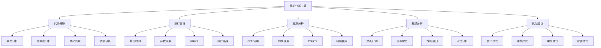

# 性能分析工具

## 🎯 学习目标
- 理解性能分析工具的重要性和核心概念
- 掌握各种性能分析工具的使用方法和技巧
- 学会在PHP开发中有效使用性能分析工具
- 了解性能分析工具的最佳实践和优化策略

## 📚 核心概念

### 性能分析工具架构



### 性能分析工具分类

| 工具类型 | 描述 | 主要功能 | 适用场景 |
|----------|------|----------|----------|
| 静态分析工具 | 分析代码结构 | 复杂度、质量、依赖 | 代码审查、重构 |
| 动态分析工具 | 分析运行时行为 | 执行时间、调用关系、资源使用 | 性能优化、问题排查 |
| 基准测试工具 | 性能基准测试 | 性能对比、回归测试 | 性能验证、优化效果 |
| 监控工具 | 实时性能监控 | 实时指标、告警、趋势 | 生产环境监控 |

## 🔧 性能分析工具实现

### 基础性能分析工具
```php
<?php
// 1. 性能分析器
class PerformanceAnalyzer {
    private array $profiles = [];
    private array $metrics = [];
    private array $callGraph = [];
    private bool $enabled = false;
    private array $config = [];
    
    public function __construct(array $config = []) {
        $this->config = array_merge([
            'enable_call_tracking' => true,
            'enable_memory_tracking' => true,
            'enable_time_tracking' => true,
            'max_profiles' => 1000,
            'sample_rate' => 1.0
        ], $config);
    }
    
    // 启用分析器
    public function enable(): void {
        $this->enabled = true;
    }
    
    // 禁用分析器
    public function disable(): void {
        $this->enabled = false;
    }
    
    // 开始分析
    public function startAnalysis(string $name, array $context = []): string {
        if (!$this->enabled) {
            return '';
        }
        
        $profileId = uniqid('prof_');
        $this->profiles[$profileId] = [
            'name' => $name,
            'context' => $context,
            'start_time' => microtime(true),
            'start_memory' => memory_get_usage(true),
            'start_peak_memory' => memory_get_peak_usage(true),
            'calls' => [],
            'children' => []
        ];
        
        return $profileId;
    }
    
    // 结束分析
    public function endAnalysis(string $profileId): ?array {
        if (!$this->enabled || !isset($this->profiles[$profileId])) {
            return null;
        }
        
        $profile = &$this->profiles[$profileId];
        $profile['end_time'] = microtime(true);
        $profile['end_memory'] = memory_get_usage(true);
        $profile['end_peak_memory'] = memory_get_peak_usage(true);
        
        $profile['duration'] = $profile['end_time'] - $profile['start_time'];
        $profile['memory_used'] = $profile['end_memory'] - $profile['start_memory'];
        $profile['peak_memory_used'] = $profile['end_peak_memory'] - $profile['start_peak_memory'];
        
        return $profile;
    }
    
    // 记录函数调用
    public function recordCall(string $function, float $duration, int $memoryUsed = 0, array $args = []): void {
        if (!$this->enabled) {
            return;
        }
        
        $call = [
            'function' => $function,
            'duration' => $duration,
            'memory_used' => $memoryUsed,
            'args' => $args,
            'timestamp' => microtime(true)
        ];
        
        // 添加到当前配置文件
        if (!empty($this->profiles)) {
            $currentProfile = end($this->profiles);
            $currentProfile['calls'][] = $call;
        }
        
        // 更新调用图
        $this->updateCallGraph($function, $duration, $memoryUsed);
    }
    
    // 更新调用图
    private function updateCallGraph(string $function, float $duration, int $memoryUsed): void {
        if (!isset($this->callGraph[$function])) {
            $this->callGraph[$function] = [
                'call_count' => 0,
                'total_duration' => 0,
                'total_memory' => 0,
                'average_duration' => 0,
                'average_memory' => 0,
                'min_duration' => PHP_FLOAT_MAX,
                'max_duration' => 0,
                'min_memory' => PHP_INT_MAX,
                'max_memory' => 0
            ];
        }
        
        $node = &$this->callGraph[$function];
        $node['call_count']++;
        $node['total_duration'] += $duration;
        $node['total_memory'] += $memoryUsed;
        $node['average_duration'] = $node['total_duration'] / $node['call_count'];
        $node['average_memory'] = $node['total_memory'] / $node['call_count'];
        $node['min_duration'] = min($node['min_duration'], $duration);
        $node['max_duration'] = max($node['max_duration'], $duration);
        $node['min_memory'] = min($node['min_memory'], $memoryUsed);
        $node['max_memory'] = max($node['max_memory'], $memoryUsed);
    }
    
    // 获取性能报告
    public function getPerformanceReport(): array {
        $report = [
            'summary' => [
                'total_profiles' => count($this->profiles),
                'total_calls' => 0,
                'total_duration' => 0,
                'total_memory' => 0
            ],
            'top_functions' => [],
            'slowest_functions' => [],
            'memory_hungry_functions' => [],
            'call_graph' => $this->callGraph,
            'recommendations' => []
        ];
        
        // 计算总统计
        foreach ($this->profiles as $profile) {
            $report['summary']['total_duration'] += $profile['duration'];
            $report['summary']['total_memory'] += $profile['memory_used'];
            $report['summary']['total_calls'] += count($profile['calls']);
        }
        
        // 找出最慢的函数
        $slowestFunctions = $this->callGraph;
        uasort($slowestFunctions, fn($a, $b) => $b['average_duration'] <=> $a['average_duration']);
        $report['slowest_functions'] = array_slice($slowestFunctions, 0, 10, true);
        
        // 找出内存消耗最大的函数
        $memoryHungryFunctions = $this->callGraph;
        uasort($memoryHungryFunctions, fn($a, $b) => $b['average_memory'] <=> $a['average_memory']);
        $report['memory_hungry_functions'] = array_slice($memoryHungryFunctions, 0, 10, true);
        
        // 找出调用最频繁的函数
        $topFunctions = $this->callGraph;
        uasort($topFunctions, fn($a, $b) => $b['call_count'] <=> $a['call_count']);
        $report['top_functions'] = array_slice($topFunctions, 0, 10, true);
        
        // 生成优化建议
        $report['recommendations'] = $this->generateRecommendations();
        
        return $report;
    }
    
    // 生成优化建议
    private function generateRecommendations(): array {
        $recommendations = [];
        
        // 基于最慢函数的建议
        $slowestFunctions = $this->callGraph;
        uasort($slowestFunctions, fn($a, $b) => $b['average_duration'] <=> $a['average_duration']);
        $slowestFunction = array_key_first($slowestFunctions);
        
        if ($slowestFunction && $slowestFunctions[$slowestFunction]['average_duration'] > 0.1) {
            $recommendations[] = [
                'type' => 'performance',
                'priority' => 'high',
                'function' => $slowestFunction,
                'issue' => '函数执行时间过长',
                'suggestion' => '优化算法或减少不必要的计算',
                'impact' => 'high'
            ];
        }
        
        // 基于内存消耗的建议
        $memoryHungryFunctions = $this->callGraph;
        uasort($memoryHungryFunctions, fn($a, $b) => $b['average_memory'] <=> $a['average_memory']);
        $memoryHungryFunction = array_key_first($memoryHungryFunctions);
        
        if ($memoryHungryFunction && $memoryHungryFunctions[$memoryHungryFunction]['average_memory'] > 1024 * 1024) {
            $recommendations[] = [
                'type' => 'memory',
                'priority' => 'medium',
                'function' => $memoryHungryFunction,
                'issue' => '函数内存消耗过大',
                'suggestion' => '优化数据结构或实现内存池',
                'impact' => 'medium'
            ];
        }
        
        // 基于调用频率的建议
        $topFunctions = $this->callGraph;
        uasort($topFunctions, fn($a, $b) => $b['call_count'] <=> $a['call_count']);
        $topFunction = array_key_first($topFunctions);
        
        if ($topFunction && $topFunctions[$topFunction]['call_count'] > 1000) {
            $recommendations[] = [
                'type' => 'optimization',
                'priority' => 'low',
                'function' => $topFunction,
                'issue' => '函数调用频率过高',
                'suggestion' => '考虑缓存结果或优化调用逻辑',
                'impact' => 'low'
            ];
        }
        
        return $recommendations;
    }
    
    // 获取调用图
    public function getCallGraph(): array {
        return $this->callGraph;
    }
    
    // 获取所有配置文件
    public function getAllProfiles(): array {
        return $this->profiles;
    }
    
    // 清空数据
    public function clear(): void {
        $this->profiles = [];
        $this->callGraph = [];
    }
}

// 2. 基准测试工具
class BenchmarkTool {
    private array $benchmarks = [];
    private array $results = [];
    private array $config = [];
    
    public function __construct(array $config = []) {
        $this->config = array_merge([
            'warmup_iterations' => 10,
            'min_iterations' => 100,
            'max_iterations' => 10000,
            'time_limit' => 10, // 秒
            'memory_limit' => 128 * 1024 * 1024 // 128MB
        ], $config);
    }
    
    // 添加基准测试
    public function addBenchmark(string $name, callable $function, array $args = []): void {
        $this->benchmarks[$name] = [
            'function' => $function,
            'args' => $args,
            'iterations' => 0,
            'total_time' => 0,
            'min_time' => PHP_FLOAT_MAX,
            'max_time' => 0,
            'avg_time' => 0,
            'memory_used' => 0
        ];
    }
    
    // 运行基准测试
    public function runBenchmark(string $name): array {
        if (!isset($this->benchmarks[$name])) {
            throw new Exception("Benchmark '{$name}' not found");
        }
        
        $benchmark = &$this->benchmarks[$name];
        $function = $benchmark['function'];
        $args = $benchmark['args'];
        
        // 预热
        for ($i = 0; $i < $this->config['warmup_iterations']; $i++) {
            $function(...$args);
        }
        
        // 正式测试
        $iterations = $this->config['min_iterations'];
        $startTime = microtime(true);
        $startMemory = memory_get_usage(true);
        
        for ($i = 0; $i < $iterations; $i++) {
            $iterStart = microtime(true);
            $function(...$args);
            $iterEnd = microtime(true);
            
            $iterTime = $iterEnd - $iterStart;
            $benchmark['min_time'] = min($benchmark['min_time'], $iterTime);
            $benchmark['max_time'] = max($benchmark['max_time'], $iterTime);
            $benchmark['total_time'] += $iterTime;
            
            // 检查时间限制
            if (microtime(true) - $startTime > $this->config['time_limit']) {
                break;
            }
            
            // 检查内存限制
            if (memory_get_usage(true) - $startMemory > $this->config['memory_limit']) {
                break;
            }
        }
        
        $benchmark['iterations'] = $i + 1;
        $benchmark['avg_time'] = $benchmark['total_time'] / $benchmark['iterations'];
        $benchmark['memory_used'] = memory_get_usage(true) - $startMemory;
        
        $this->results[$name] = $benchmark;
        return $benchmark;
    }
    
    // 运行所有基准测试
    public function runAllBenchmarks(): array {
        $results = [];
        
        foreach (array_keys($this->benchmarks) as $name) {
            $results[$name] = $this->runBenchmark($name);
        }
        
        return $results;
    }
    
    // 比较基准测试结果
    public function compareBenchmarks(string $baseline, string $current): array {
        if (!isset($this->results[$baseline]) || !isset($this->results[$current])) {
            throw new Exception("Benchmark results not found");
        }
        
        $baselineResult = $this->results[$baseline];
        $currentResult = $this->results[$current];
        
        $comparison = [
            'baseline' => $baseline,
            'current' => $current,
            'time_improvement' => ($baselineResult['avg_time'] - $currentResult['avg_time']) / $baselineResult['avg_time'] * 100,
            'memory_improvement' => ($baselineResult['memory_used'] - $currentResult['memory_used']) / $baselineResult['memory_used'] * 100,
            'iterations_improvement' => ($currentResult['iterations'] - $baselineResult['iterations']) / $baselineResult['iterations'] * 100
        ];
        
        return $comparison;
    }
    
    // 生成基准测试报告
    public function generateReport(): array {
        $report = [
            'summary' => [
                'total_benchmarks' => count($this->results),
                'total_time' => array_sum(array_column($this->results, 'total_time')),
                'total_memory' => array_sum(array_column($this->results, 'memory_used'))
            ],
            'results' => $this->results,
            'rankings' => [
                'fastest' => $this->getFastestBenchmarks(),
                'slowest' => $this->getSlowestBenchmarks(),
                'most_memory_efficient' => $this->getMostMemoryEfficientBenchmarks(),
                'least_memory_efficient' => $this->getLeastMemoryEfficientBenchmarks()
            ]
        ];
        
        return $report;
    }
    
    // 获取最快的基准测试
    private function getFastestBenchmarks(): array {
        $results = $this->results;
        uasort($results, fn($a, $b) => $a['avg_time'] <=> $b['avg_time']);
        return array_slice($results, 0, 5, true);
    }
    
    // 获取最慢的基准测试
    private function getSlowestBenchmarks(): array {
        $results = $this->results;
        uasort($results, fn($a, $b) => $b['avg_time'] <=> $a['avg_time']);
        return array_slice($results, 0, 5, true);
    }
    
    // 获取内存效率最高的基准测试
    private function getMostMemoryEfficientBenchmarks(): array {
        $results = $this->results;
        uasort($results, fn($a, $b) => $a['memory_used'] <=> $b['memory_used']);
        return array_slice($results, 0, 5, true);
    }
    
    // 获取内存效率最低的基准测试
    private function getLeastMemoryEfficientBenchmarks(): array {
        $results = $this->results;
        uasort($results, fn($a, $b) => $b['memory_used'] <=> $a['memory_used']);
        return array_slice($results, 0, 5, true);
    }
    
    // 获取所有结果
    public function getAllResults(): array {
        return $this->results;
    }
    
    // 清空结果
    public function clear(): void {
        $this->benchmarks = [];
        $this->results = [];
    }
}

// 3. 性能监控工具
class PerformanceMonitor {
    private array $metrics = [];
    private array $alerts = [];
    private array $thresholds = [];
    private bool $enabled = false;
    
    public function __construct() {
        $this->enabled = true;
    }
    
    // 设置阈值
    public function setThreshold(string $metric, float $value, string $operator = '>'): void {
        $this->thresholds[$metric] = [
            'value' => $value,
            'operator' => $operator
        ];
    }
    
    // 记录指标
    public function recordMetric(string $name, float $value, array $tags = []): void {
        if (!$this->enabled) {
            return;
        }
        
        $timestamp = time();
        $key = $this->buildKey($name, $tags);
        
        $this->metrics[$key][] = [
            'timestamp' => $timestamp,
            'value' => $value
        ];
        
        // 检查阈值
        $this->checkThreshold($name, $value);
        
        // 清理旧数据
        $this->cleanupOldData($key, $timestamp - 3600);
    }
    
    // 检查阈值
    private function checkThreshold(string $metric, float $value): void {
        if (!isset($this->thresholds[$metric])) {
            return;
        }
        
        $threshold = $this->thresholds[$metric];
        $alert = false;
        
        switch ($threshold['operator']) {
            case '>':
                $alert = $value > $threshold['value'];
                break;
            case '<':
                $alert = $value < $threshold['value'];
                break;
            case '>=':
                $alert = $value >= $threshold['value'];
                break;
            case '<=':
                $alert = $value <= $threshold['value'];
                break;
        }
        
        if ($alert) {
            $this->triggerAlert($metric, $value, $threshold);
        }
    }
    
    // 触发告警
    private function triggerAlert(string $metric, float $value, array $threshold): void {
        $alert = [
            'metric' => $metric,
            'value' => $value,
            'threshold' => $threshold,
            'timestamp' => time(),
            'message' => "Alert: {$metric} {$threshold['operator']} {$threshold['value']} (current: {$value})"
        ];
        
        $this->alerts[] = $alert;
    }
    
    // 构建键
    private function buildKey(string $name, array $tags): string {
        if (empty($tags)) {
            return $name;
        }
        
        $tagString = '';
        foreach ($tags as $key => $value) {
            $tagString .= "{$key}={$value},";
        }
        
        return $name . '[' . rtrim($tagString, ',') . ']';
    }
    
    // 清理旧数据
    private function cleanupOldData(string $key, int $cutoffTime): void {
        if (!isset($this->metrics[$key])) {
            return;
        }
        
        $this->metrics[$key] = array_filter(
            $this->metrics[$key],
            fn($item) => $item['timestamp'] > $cutoffTime
        );
    }
    
    // 获取指标统计
    public function getMetricStats(string $name, array $tags = [], int $timeRange = 3600): array {
        $key = $this->buildKey($name, $tags);
        $cutoffTime = time() - $timeRange;
        
        if (!isset($this->metrics[$key])) {
            return [
                'count' => 0,
                'min' => 0,
                'max' => 0,
                'avg' => 0,
                'sum' => 0
            ];
        }
        
        $recentData = array_filter(
            $this->metrics[$key],
            fn($item) => $item['timestamp'] > $cutoffTime
        );
        
        if (empty($recentData)) {
            return [
                'count' => 0,
                'min' => 0,
                'max' => 0,
                'avg' => 0,
                'sum' => 0
            ];
        }
        
        $values = array_column($recentData, 'value');
        
        return [
            'count' => count($values),
            'min' => min($values),
            'max' => max($values),
            'avg' => array_sum($values) / count($values),
            'sum' => array_sum($values)
        ];
    }
    
    // 获取告警
    public function getAlerts(int $timeRange = 3600): array {
        $cutoffTime = time() - $timeRange;
        
        return array_filter(
            $this->alerts,
            fn($alert) => $alert['timestamp'] > $cutoffTime
        );
    }
    
    // 获取所有指标
    public function getAllMetrics(): array {
        return $this->metrics;
    }
    
    // 清空数据
    public function clear(): void {
        $this->metrics = [];
        $this->alerts = [];
    }
}

// 使用示例
echo "=== 性能分析工具示例 ===\n";

try {
    // 创建性能分析器
    $analyzer = new PerformanceAnalyzer();
    $analyzer->enable();
    
    // 开始分析
    $profileId = $analyzer->startAnalysis('test_operation', ['context' => 'benchmark']);
    
    // 模拟一些操作
    $startTime = microtime(true);
    $startMemory = memory_get_usage(true);
    
    // 模拟函数调用
    $analyzer->recordCall('array_merge', 0.001, 1024, [['a', 'b'], ['c', 'd']]);
    $analyzer->recordCall('strlen', 0.0001, 64, ['hello world']);
    $analyzer->recordCall('json_encode', 0.002, 2048, [['key' => 'value']]);
    
    $endTime = microtime(true);
    $endMemory = memory_get_usage(true);
    
    // 结束分析
    $profile = $analyzer->endAnalysis($profileId);
    
    // 获取性能报告
    $report = $analyzer->getPerformanceReport();
    echo "性能分析报告:\n";
    echo "  总配置文件: {$report['summary']['total_profiles']}\n";
    echo "  总调用数: {$report['summary']['total_calls']}\n";
    echo "  总执行时间: " . number_format($report['summary']['total_duration'], 4) . "s\n";
    echo "  总内存使用: " . number_format($report['summary']['total_memory']) . " bytes\n";
    
    echo "\n最慢的函数:\n";
    foreach (array_slice($report['slowest_functions'], 0, 3, true) as $function => $stats) {
        echo "  {$function}: " . number_format($stats['average_duration'], 4) . "s (调用 {$stats['call_count']} 次)\n";
    }
    
    echo "\n优化建议:\n";
    foreach ($report['recommendations'] as $recommendation) {
        echo "  [{$recommendation['priority']}] {$recommendation['function']}: {$recommendation['suggestion']}\n";
    }
    
    // 创建基准测试工具
    $benchmark = new BenchmarkTool();
    
    // 添加基准测试
    $benchmark->addBenchmark('array_merge', function($arr1, $arr2) {
        return array_merge($arr1, $arr2);
    }, [['a', 'b'], ['c', 'd']]);
    
    $benchmark->addBenchmark('string_concat', function($str1, $str2) {
        return $str1 . $str2;
    }, ['hello', ' world']);
    
    // 运行基准测试
    $benchmark->runAllBenchmarks();
    
    // 生成基准测试报告
    $benchmarkReport = $benchmark->generateReport();
    echo "\n基准测试报告:\n";
    echo "  总基准测试: {$benchmarkReport['summary']['total_benchmarks']}\n";
    echo "  总执行时间: " . number_format($benchmarkReport['summary']['total_time'], 4) . "s\n";
    echo "  总内存使用: " . number_format($benchmarkReport['summary']['total_memory']) . " bytes\n";
    
    // 创建性能监控工具
    $monitor = new PerformanceMonitor();
    
    // 设置阈值
    $monitor->setThreshold('response_time', 1000, '>');
    $monitor->setThreshold('memory_usage', 50 * 1024 * 1024, '>');
    
    // 记录指标
    $monitor->recordMetric('response_time', 800, ['endpoint' => '/api/users']);
    $monitor->recordMetric('response_time', 1200, ['endpoint' => '/api/orders']); // 触发告警
    $monitor->recordMetric('memory_usage', 30 * 1024 * 1024, ['service' => 'user-service']);
    $monitor->recordMetric('memory_usage', 60 * 1024 * 1024, ['service' => 'order-service']); // 触发告警
    
    // 获取指标统计
    $responseTimeStats = $monitor->getMetricStats('response_time');
    echo "\n响应时间统计:\n";
    echo "  数量: {$responseTimeStats['count']}\n";
    echo "  平均值: " . number_format($responseTimeStats['avg'], 2) . "ms\n";
    echo "  最小值: " . number_format($responseTimeStats['min'], 2) . "ms\n";
    echo "  最大值: " . number_format($responseTimeStats['max'], 2) . "ms\n";
    
    // 获取告警
    $alerts = $monitor->getAlerts();
    echo "\n告警数量: " . count($alerts) . "\n";
    foreach ($alerts as $alert) {
        echo "  - {$alert['message']}\n";
    }
    
} catch (Exception $e) {
    echo "错误: " . $e->getMessage() . "\n";
}
?>
```

## 📊 最佳实践

### 性能分析工具最佳实践
```php
<?php
// 性能分析工具最佳实践

class PerformanceAnalysisToolsBestPractices {
    // 1. 工具选择最佳实践
    public static function getToolSelectionBestPractices() {
        return [
            '工具评估' => [
                '功能评估' => '评估工具功能是否满足需求',
                '性能影响' => '评估工具对系统性能的影响',
                '易用性' => '评估工具的易用性和学习成本',
                '成本效益' => '评估工具的成本效益比'
            ],
            '工具组合' => [
                '互补使用' => '组合使用互补的工具',
                '层次覆盖' => '覆盖不同层次的性能分析',
                '阶段适配' => '在不同阶段使用不同工具',
                '团队协作' => '考虑团队协作需求'
            ],
            '工具集成' => [
                'CI/CD集成' => '集成到CI/CD流水线',
                '监控集成' => '集成到监控系统',
                '告警集成' => '集成到告警系统',
                '报告集成' => '集成到报告系统'
            ]
        ];
    }
    
    // 2. 分析方法最佳实践
    public static function getAnalysisMethodBestPractices() {
        return [
            '分析策略' => [
                '系统化分析' => '采用系统化的分析方法',
                '分层分析' => '在不同层次进行分析',
                '对比分析' => '进行对比分析',
                '趋势分析' => '分析性能趋势'
            ],
            '数据收集' => [
                '数据完整性' => '确保数据收集的完整性',
                '数据准确性' => '确保数据收集的准确性',
                '数据时效性' => '确保数据的时效性',
                '数据存储' => '合理存储分析数据'
            ],
            '结果解释' => [
                '上下文理解' => '在上下文中理解结果',
                '因果关系' => '分析因果关系',
                '影响评估' => '评估性能影响',
                '建议制定' => '制定优化建议'
            ]
        ];
    }
    
    // 3. 优化实施最佳实践
    public static function getOptimizationImplementationBestPractices() {
        return [
            '优化策略' => [
                '优先级排序' => '按优先级排序优化项目',
                '影响评估' => '评估优化影响',
                '风险控制' => '控制优化风险',
                '效果验证' => '验证优化效果'
            ],
            '实施方法' => [
                '渐进式优化' => '采用渐进式优化方法',
                'A/B测试' => '使用A/B测试验证优化',
                '回滚准备' => '准备优化回滚方案',
                '监控验证' => '监控验证优化效果'
            ],
            '持续改进' => [
                '定期分析' => '定期进行性能分析',
                '基准更新' => '更新性能基准',
                '工具升级' => '升级分析工具',
                '方法改进' => '改进分析方法'
            ]
        ];
    }
}

// 使用示例
echo "=== 性能分析工具最佳实践示例 ===\n";

try {
    $toolSelectionPractices = PerformanceAnalysisToolsBestPractices::getToolSelectionBestPractices();
    echo "工具选择最佳实践:\n";
    foreach ($toolSelectionPractices as $category => $practices) {
        echo "  $category:\n";
        foreach ($practices as $practice => $description) {
            echo "    - $practice: $description\n";
        }
        echo "\n";
    }
    
} catch (Exception $e) {
    echo "错误: " . $e->getMessage() . "\n";
}
?>
```

## 🎓 学习建议

### 费曼学习法应用
1. **选择概念**: 选择性能分析工具中的核心概念
2. **简化解释**: 用简单语言解释性能分析工具的重要性
3. **识别盲点**: 发现理解不深入的地方
4. **重新学习**: 针对盲点进行深入学习

### 刻意练习重点
1. **工具使用**: 熟练使用各种性能分析工具
2. **分析方法**: 掌握有效的性能分析方法
3. **问题定位**: 学会定位性能问题和瓶颈
4. **优化实施**: 掌握性能优化的实施方法

## 🔗 相关链接
- [[01-性能监控|性能监控]]
- [[02-错误追踪|错误追踪]]
- [[03-日志分析|日志分析]]
- [[04-调试工具使用|调试工具使用]]
- [[06-问题排查技巧|问题排查技巧]]
- [[07-监控体系设计|监控体系设计]]
