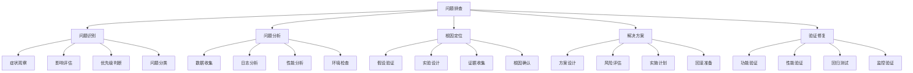

# 问题排查技巧

## 🎯 学习目标
- 理解问题排查的重要性和核心概念
- 掌握系统化的问题排查方法和技巧
- 学会在PHP开发中有效排查各种问题
- 了解问题排查的最佳实践和优化策略

## 📚 核心概念

### 问题排查架构



### 问题排查流程

| 阶段 | 描述 | 关键活动 | 输出物 |
|------|------|----------|--------|
| 问题识别 | 识别和描述问题 | 症状观察、影响评估 | 问题描述 |
| 问题分析 | 深入分析问题 | 数据收集、日志分析 | 分析报告 |
| 根因定位 | 定位问题根因 | 假设验证、实验设计 | 根因分析 |
| 解决方案 | 制定解决方案 | 方案设计、风险评估 | 解决方案 |
| 验证修复 | 验证修复效果 | 功能验证、性能验证 | 修复验证 |

## 🔧 问题排查实现

### 基础问题排查
```php
<?php
// 1. 问题排查器
class ProblemTroubleshooter {
    private array $problems = [];
    private array $solutions = [];
    private array $checklists = [];
    private array $tools = [];
    
    public function __construct() {
        $this->initializeChecklists();
        $this->initializeTools();
    }
    
    // 初始化检查清单
    private function initializeChecklists(): void {
        $this->checklists = [
            'performance' => [
                '检查CPU使用率',
                '检查内存使用率',
                '检查磁盘I/O',
                '检查网络延迟',
                '检查数据库查询',
                '检查缓存命中率',
                '检查代码热点'
            ],
            'error' => [
                '检查错误日志',
                '检查异常堆栈',
                '检查错误频率',
                '检查错误模式',
                '检查用户影响',
                '检查系统状态',
                '检查依赖服务'
            ],
            'security' => [
                '检查访问日志',
                '检查权限配置',
                '检查输入验证',
                '检查SQL注入',
                '检查XSS攻击',
                '检查CSRF防护',
                '检查文件上传'
            ],
            'database' => [
                '检查连接状态',
                '检查查询性能',
                '检查锁等待',
                '检查死锁',
                '检查索引使用',
                '检查表结构',
                '检查数据一致性'
            ]
        ];
    }
    
    // 初始化工具
    private function initializeTools(): void {
        $this->tools = [
            'log_analyzer' => new LogAnalyzer(),
            'performance_monitor' => new PerformanceMonitor(),
            'error_tracker' => new ErrorTracker(),
            'database_analyzer' => new DatabaseAnalyzer()
        ];
    }
    
    // 记录问题
    public function recordProblem(string $id, string $type, string $description, array $context = []): void {
        $this->problems[$id] = [
            'id' => $id,
            'type' => $type,
            'description' => $description,
            'context' => $context,
            'status' => 'open',
            'created_at' => time(),
            'updated_at' => time(),
            'steps' => [],
            'solutions' => []
        ];
    }
    
    // 开始排查
    public function startTroubleshooting(string $problemId): array {
        if (!isset($this->problems[$problemId])) {
            throw new Exception("Problem '{$problemId}' not found");
        }
        
        $problem = &$this->problems[$problemId];
        $problem['status'] = 'investigating';
        $problem['updated_at'] = time();
        
        // 获取检查清单
        $checklist = $this->getChecklist($problem['type']);
        
        // 执行检查
        $results = $this->executeChecks($checklist, $problem['context']);
        
        // 分析结果
        $analysis = $this->analyzeResults($results, $problem);
        
        // 生成建议
        $suggestions = $this->generateSuggestions($analysis, $problem);
        
        $problem['steps'][] = [
            'step' => 'initial_analysis',
            'results' => $results,
            'analysis' => $analysis,
            'suggestions' => $suggestions,
            'timestamp' => time()
        ];
        
        return [
            'problem' => $problem,
            'checklist' => $checklist,
            'results' => $results,
            'analysis' => $analysis,
            'suggestions' => $suggestions
        ];
    }
    
    // 获取检查清单
    private function getChecklist(string $type): array {
        return $this->checklists[$type] ?? $this->checklists['error'];
    }
    
    // 执行检查
    private function executeChecks(array $checklist, array $context): array {
        $results = [];
        
        foreach ($checklist as $check) {
            $result = $this->executeCheck($check, $context);
            $results[$check] = $result;
        }
        
        return $results;
    }
    
    // 执行单个检查
    private function executeCheck(string $check, array $context): array {
        $result = [
            'check' => $check,
            'status' => 'unknown',
            'value' => null,
            'message' => '',
            'timestamp' => time()
        ];
        
        try {
            switch ($check) {
                case '检查CPU使用率':
                    $result = $this->checkCpuUsage();
                    break;
                case '检查内存使用率':
                    $result = $this->checkMemoryUsage();
                    break;
                case '检查错误日志':
                    $result = $this->checkErrorLogs();
                    break;
                case '检查数据库查询':
                    $result = $this->checkDatabaseQueries();
                    break;
                default:
                    $result['status'] = 'skipped';
                    $result['message'] = 'Check not implemented';
            }
        } catch (Exception $e) {
            $result['status'] = 'error';
            $result['message'] = $e->getMessage();
        }
        
        return $result;
    }
    
    // 检查CPU使用率
    private function checkCpuUsage(): array {
        $load = sys_getloadavg();
        
        return [
            'check' => '检查CPU使用率',
            'status' => $load[0] > 2.0 ? 'warning' : 'ok',
            'value' => $load[0],
            'message' => "1分钟平均负载: {$load[0]}",
            'timestamp' => time()
        ];
    }
    
    // 检查内存使用率
    private function checkMemoryUsage(): array {
        $memoryUsage = memory_get_usage(true);
        $memoryLimit = ini_get('memory_limit');
        $memoryLimitBytes = $this->convertToBytes($memoryLimit);
        $usagePercent = ($memoryUsage / $memoryLimitBytes) * 100;
        
        return [
            'check' => '检查内存使用率',
            'status' => $usagePercent > 80 ? 'warning' : 'ok',
            'value' => $usagePercent,
            'message' => "内存使用率: " . number_format($usagePercent, 2) . "%",
            'timestamp' => time()
        ];
    }
    
    // 检查错误日志
    private function checkErrorLogs(): array {
        $errorLog = error_get_last();
        
        if ($errorLog) {
            return [
                'check' => '检查错误日志',
                'status' => 'warning',
                'value' => $errorLog,
                'message' => "发现错误: {$errorLog['message']}",
                'timestamp' => time()
            ];
        }
        
        return [
            'check' => '检查错误日志',
            'status' => 'ok',
            'value' => null,
            'message' => '未发现错误',
            'timestamp' => time()
        ];
    }
    
    // 检查数据库查询
    private function checkDatabaseQueries(): array {
        // 模拟数据库查询检查
        $slowQueries = 0;
        $failedQueries = 0;
        
        return [
            'check' => '检查数据库查询',
            'status' => $slowQueries > 10 || $failedQueries > 5 ? 'warning' : 'ok',
            'value' => ['slow_queries' => $slowQueries, 'failed_queries' => $failedQueries],
            'message' => "慢查询: {$slowQueries}, 失败查询: {$failedQueries}",
            'timestamp' => time()
        ];
    }
    
    // 转换内存限制为字节
    private function convertToBytes(string $value): int {
        $value = trim($value);
        $last = strtolower($value[strlen($value) - 1]);
        $value = (int) $value;
        
        switch ($last) {
            case 'g':
                $value *= 1024;
            case 'm':
                $value *= 1024;
            case 'k':
                $value *= 1024;
        }
        
        return $value;
    }
    
    // 分析结果
    private function analyzeResults(array $results, array $problem): array {
        $analysis = [
            'summary' => [
                'total_checks' => count($results),
                'ok_checks' => 0,
                'warning_checks' => 0,
                'error_checks' => 0
            ],
            'issues' => [],
            'recommendations' => []
        ];
        
        foreach ($results as $check => $result) {
            switch ($result['status']) {
                case 'ok':
                    $analysis['summary']['ok_checks']++;
                    break;
                case 'warning':
                    $analysis['summary']['warning_checks']++;
                    $analysis['issues'][] = [
                        'type' => 'warning',
                        'check' => $check,
                        'message' => $result['message'],
                        'value' => $result['value']
                    ];
                    break;
                case 'error':
                    $analysis['summary']['error_checks']++;
                    $analysis['issues'][] = [
                        'type' => 'error',
                        'check' => $check,
                        'message' => $result['message'],
                        'value' => $result['value']
                    ];
                    break;
            }
        }
        
        return $analysis;
    }
    
    // 生成建议
    private function generateSuggestions(array $analysis, array $problem): array {
        $suggestions = [];
        
        foreach ($analysis['issues'] as $issue) {
            switch ($issue['check']) {
                case '检查CPU使用率':
                    $suggestions[] = [
                        'priority' => 'high',
                        'action' => '优化CPU密集型操作',
                        'description' => 'CPU使用率过高，需要优化算法或增加服务器资源'
                    ];
                    break;
                case '检查内存使用率':
                    $suggestions[] = [
                        'priority' => 'medium',
                        'action' => '优化内存使用',
                        'description' => '内存使用率过高，需要优化代码或增加内存限制'
                    ];
                    break;
                case '检查错误日志':
                    $suggestions[] = [
                        'priority' => 'high',
                        'action' => '修复错误',
                        'description' => '发现错误日志，需要立即修复'
                    ];
                    break;
                case '检查数据库查询':
                    $suggestions[] = [
                        'priority' => 'medium',
                        'action' => '优化数据库查询',
                        'description' => '数据库查询性能问题，需要优化查询或索引'
                    ];
                    break;
            }
        }
        
        return $suggestions;
    }
    
    // 实施解决方案
    public function implementSolution(string $problemId, string $solution, array $steps = []): bool {
        if (!isset($this->problems[$problemId])) {
            return false;
        }
        
        $problem = &$this->problems[$problemId];
        $problem['solutions'][] = [
            'solution' => $solution,
            'steps' => $steps,
            'implemented_at' => time(),
            'status' => 'implemented'
        ];
        
        $problem['status'] = 'resolved';
        $problem['updated_at'] = time();
        
        return true;
    }
    
    // 获取问题
    public function getProblem(string $problemId): ?array {
        return $this->problems[$problemId] ?? null;
    }
    
    // 获取所有问题
    public function getAllProblems(): array {
        return $this->problems;
    }
    
    // 获取问题统计
    public function getProblemStats(): array {
        $stats = [
            'total' => count($this->problems),
            'open' => 0,
            'investigating' => 0,
            'resolved' => 0,
            'by_type' => []
        ];
        
        foreach ($this->problems as $problem) {
            $stats[$problem['status']]++;
            $type = $problem['type'];
            $stats['by_type'][$type] = ($stats['by_type'][$type] ?? 0) + 1;
        }
        
        return $stats;
    }
}

// 2. 问题诊断器
class ProblemDiagnostic {
    private array $diagnostics = [];
    private array $patterns = [];
    
    public function __construct() {
        $this->initializePatterns();
    }
    
    // 初始化模式
    private function initializePatterns(): void {
        $this->patterns = [
            'memory_leak' => [
                'symptoms' => ['内存持续增长', '性能逐渐下降', '最终内存不足'],
                'checks' => ['内存使用趋势', '对象生命周期', '垃圾回收效率'],
                'solutions' => ['优化对象管理', '实现对象池', '检查循环引用']
            ],
            'database_deadlock' => [
                'symptoms' => ['查询超时', '事务失败', '并发性能下降'],
                'checks' => ['死锁日志', '事务时间', '锁等待情况'],
                'solutions' => ['优化事务顺序', '减少事务时间', '使用合适的隔离级别']
            ],
            'cache_miss' => [
                'symptoms' => ['响应时间增加', '数据库负载增加', '缓存命中率低'],
                'checks' => ['缓存命中率', '缓存配置', '缓存策略'],
                'solutions' => ['优化缓存策略', '增加缓存容量', '预热缓存']
            ],
            'api_rate_limit' => [
                'symptoms' => ['API调用失败', '响应码429', '服务不可用'],
                'checks' => ['API调用频率', '限流配置', '服务负载'],
                'solutions' => ['调整限流策略', '增加服务实例', '优化API设计']
            ]
        ];
    }
    
    // 诊断问题
    public function diagnose(array $symptoms, array $context = []): array {
        $diagnosis = [
            'symptoms' => $symptoms,
            'context' => $context,
            'possible_causes' => [],
            'confidence' => 0,
            'recommended_actions' => []
        ];
        
        // 匹配症状模式
        foreach ($this->patterns as $patternName => $pattern) {
            $matchScore = $this->calculateMatchScore($symptoms, $pattern['symptoms']);
            
            if ($matchScore > 0.5) {
                $diagnosis['possible_causes'][] = [
                    'pattern' => $patternName,
                    'confidence' => $matchScore,
                    'description' => $this->getPatternDescription($patternName),
                    'checks' => $pattern['checks'],
                    'solutions' => $pattern['solutions']
                ];
            }
        }
        
        // 按置信度排序
        usort($diagnosis['possible_causes'], fn($a, $b) => $b['confidence'] <=> $a['confidence']);
        
        // 设置总体置信度
        $diagnosis['confidence'] = $diagnosis['possible_causes'][0]['confidence'] ?? 0;
        
        // 生成推荐行动
        if (!empty($diagnosis['possible_causes'])) {
            $topCause = $diagnosis['possible_causes'][0];
            $diagnosis['recommended_actions'] = $topCause['solutions'];
        }
        
        return $diagnosis;
    }
    
    // 计算匹配分数
    private function calculateMatchScore(array $symptoms, array $patternSymptoms): float {
        $matches = 0;
        $total = count($patternSymptoms);
        
        foreach ($patternSymptoms as $patternSymptom) {
            foreach ($symptoms as $symptom) {
                if (strpos($symptom, $patternSymptom) !== false || strpos($patternSymptom, $symptom) !== false) {
                    $matches++;
                    break;
                }
            }
        }
        
        return $matches / $total;
    }
    
    // 获取模式描述
    private function getPatternDescription(string $patternName): string {
        $descriptions = [
            'memory_leak' => '内存泄漏导致内存使用持续增长',
            'database_deadlock' => '数据库死锁导致查询失败',
            'cache_miss' => '缓存未命中导致性能下降',
            'api_rate_limit' => 'API限流导致服务不可用'
        ];
        
        return $descriptions[$patternName] ?? '未知问题模式';
    }
    
    // 添加诊断模式
    public function addPattern(string $name, array $pattern): void {
        $this->patterns[$name] = $pattern;
    }
    
    // 获取所有模式
    public function getAllPatterns(): array {
        return $this->patterns;
    }
}

// 使用示例
echo "=== 问题排查技巧示例 ===\n";

try {
    // 创建问题排查器
    $troubleshooter = new ProblemTroubleshooter();
    
    // 记录问题
    $troubleshooter->recordProblem('perf_001', 'performance', '系统响应时间过长', [
        'user_reports' => 5,
        'response_time' => 5000,
        'affected_endpoints' => ['/api/users', '/api/orders']
    ]);
    
    // 开始排查
    $troubleshooting = $troubleshooter->startTroubleshooting('perf_001');
    
    echo "问题排查结果:\n";
    echo "问题ID: {$troubleshooting['problem']['id']}\n";
    echo "问题类型: {$troubleshooting['problem']['type']}\n";
    echo "问题描述: {$troubleshooting['problem']['description']}\n";
    
    echo "\n检查结果:\n";
    foreach ($troubleshooting['results'] as $check => $result) {
        echo "  {$check}: {$result['status']} - {$result['message']}\n";
    }
    
    echo "\n分析摘要:\n";
    $analysis = $troubleshooting['analysis'];
    echo "  总检查数: {$analysis['summary']['total_checks']}\n";
    echo "  正常检查: {$analysis['summary']['ok_checks']}\n";
    echo "  警告检查: {$analysis['summary']['warning_checks']}\n";
    echo "  错误检查: {$analysis['summary']['error_checks']}\n";
    
    echo "\n发现的问题:\n";
    foreach ($analysis['issues'] as $issue) {
        echo "  [{$issue['type']}] {$issue['check']}: {$issue['message']}\n";
    }
    
    echo "\n建议:\n";
    foreach ($troubleshooting['suggestions'] as $suggestion) {
        echo "  [{$suggestion['priority']}] {$suggestion['action']}: {$suggestion['description']}\n";
    }
    
    // 实施解决方案
    $troubleshooter->implementSolution('perf_001', '优化数据库查询', [
        '添加索引',
        '优化查询语句',
        '启用查询缓存'
    ]);
    
    // 创建问题诊断器
    $diagnostic = new ProblemDiagnostic();
    
    // 诊断问题
    $diagnosis = $diagnostic->diagnose([
        '内存持续增长',
        '性能逐渐下降',
        '最终内存不足'
    ], [
        'memory_usage' => '85%',
        'uptime' => '72 hours'
    ]);
    
    echo "\n问题诊断结果:\n";
    echo "症状: " . implode(', ', $diagnosis['symptoms']) . "\n";
    echo "置信度: " . number_format($diagnosis['confidence'] * 100, 1) . "%\n";
    
    echo "\n可能原因:\n";
    foreach ($diagnosis['possible_causes'] as $cause) {
        echo "  {$cause['pattern']}: {$cause['description']} (置信度: " . number_format($cause['confidence'] * 100, 1) . "%)\n";
    }
    
    echo "\n推荐行动:\n";
    foreach ($diagnosis['recommended_actions'] as $action) {
        echo "  - {$action}\n";
    }
    
    // 获取问题统计
    $stats = $troubleshooter->getProblemStats();
    echo "\n问题统计:\n";
    echo "  总问题数: {$stats['total']}\n";
    echo "  开放问题: {$stats['open']}\n";
    echo "  调查中: {$stats['investigating']}\n";
    echo "  已解决: {$stats['resolved']}\n";
    
    echo "\n按类型统计:\n";
    foreach ($stats['by_type'] as $type => $count) {
        echo "  {$type}: {$count}\n";
    }
    
} catch (Exception $e) {
    echo "错误: " . $e->getMessage() . "\n";
}
?>
```

## 📊 最佳实践

### 问题排查最佳实践
```php
<?php
// 问题排查最佳实践

class ProblemTroubleshootingBestPractices {
    // 1. 排查方法最佳实践
    public static function getTroubleshootingMethodBestPractices() {
        return [
            '系统化方法' => [
                '结构化排查' => '采用结构化的排查方法',
                '分步骤执行' => '分步骤执行排查过程',
                '记录过程' => '详细记录排查过程',
                '验证结果' => '验证排查结果'
            ],
            '工具使用' => [
                '工具选择' => '选择合适的排查工具',
                '工具组合' => '组合使用多种工具',
                '工具熟练度' => '提高工具使用熟练度',
                '工具维护' => '维护和更新工具'
            ],
            '知识管理' => [
                '经验积累' => '积累排查经验',
                '知识共享' => '共享排查知识',
                '文档记录' => '记录排查文档',
                '培训学习' => '持续学习新知识'
            ]
        ];
    }
    
    // 2. 问题分析最佳实践
    public static function getProblemAnalysisBestPractices() {
        return [
            '分析方法' => [
                '根因分析' => '深入分析问题根因',
                '影响分析' => '分析问题影响范围',
                '趋势分析' => '分析问题发展趋势',
                '对比分析' => '进行对比分析'
            ],
            '数据收集' => [
                '数据完整性' => '确保数据收集完整性',
                '数据准确性' => '确保数据收集准确性',
                '数据时效性' => '确保数据时效性',
                '数据存储' => '合理存储分析数据'
            ],
            '假设验证' => [
                '假设提出' => '提出合理假设',
                '实验设计' => '设计验证实验',
                '证据收集' => '收集验证证据',
                '结论确认' => '确认分析结论'
            ]
        ];
    }
    
    // 3. 解决方案最佳实践
    public static function getSolutionBestPractices() {
        return [
            '方案设计' => [
                '方案评估' => '评估解决方案',
                '风险评估' => '评估实施风险',
                '成本分析' => '分析实施成本',
                '效果预测' => '预测解决效果'
            ],
            '实施策略' => [
                '分阶段实施' => '分阶段实施解决方案',
                '回滚准备' => '准备回滚方案',
                '监控验证' => '监控验证实施效果',
                '持续改进' => '持续改进解决方案'
            ],
            '质量保证' => [
                '测试验证' => '测试验证解决方案',
                '性能验证' => '验证性能改善',
                '功能验证' => '验证功能正常',
                '回归测试' => '进行回归测试'
            ]
        ];
    }
}

// 使用示例
echo "=== 问题排查最佳实践示例 ===\n";

try {
    $methodPractices = ProblemTroubleshootingBestPractices::getTroubleshootingMethodBestPractices();
    echo "排查方法最佳实践:\n";
    foreach ($methodPractices as $category => $practices) {
        echo "  $category:\n";
        foreach ($practices as $practice => $description) {
            echo "    - $practice: $description\n";
        }
        echo "\n";
    }
    
} catch (Exception $e) {
    echo "错误: " . $e->getMessage() . "\n";
}
?>
```

## 🎓 学习建议

### 费曼学习法应用
1. **选择概念**: 选择问题排查中的核心概念
2. **简化解释**: 用简单语言解释问题排查的重要性
3. **识别盲点**: 发现理解不深入的地方
4. **重新学习**: 针对盲点进行深入学习

### 刻意练习重点
1. **排查方法**: 掌握系统化的问题排查方法
2. **分析技巧**: 学会有效的问题分析技巧
3. **工具使用**: 熟练使用各种排查工具
4. **解决方案**: 掌握解决方案的设计和实施

## 🔗 相关链接
- [[01-性能监控|性能监控]]
- [[02-错误追踪|错误追踪]]
- [[03-日志分析|日志分析]]
- [[04-调试工具使用|调试工具使用]]
- [[05-性能分析工具|性能分析工具]]
- [[07-监控体系设计|监控体系设计]]
