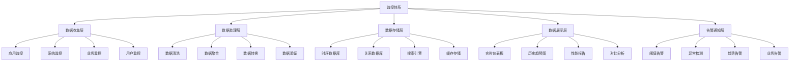

# 监控体系设计

## 🎯 学习目标
- 理解监控体系设计的重要性和核心概念
- 掌握监控体系架构的设计方法和原则
- 学会在PHP项目中设计和实施监控体系
- 了解监控体系的最佳实践和优化策略

## 📚 核心概念

### 监控体系架构



### 监控体系层次

| 层次 | 描述 | 主要功能 | 关键指标 |
|------|------|----------|----------|
| 基础设施层 | 硬件和网络监控 | CPU、内存、磁盘、网络 | 资源使用率、可用性 |
| 应用层 | 应用程序监控 | 性能、错误、日志 | 响应时间、错误率、吞吐量 |
| 业务层 | 业务指标监控 | 用户行为、业务指标 | 用户活跃度、转化率、收入 |
| 用户体验层 | 用户体验监控 | 页面加载、交互响应 | 页面加载时间、交互响应时间 |

## 🔧 监控体系实现

### 基础监控体系
```php
<?php
// 1. 监控体系设计器
class MonitoringSystemDesigner {
    private array $components = [];
    private array $metrics = [];
    private array $alerts = [];
    private array $dashboards = [];
    private array $config = [];
    
    public function __construct(array $config = []) {
        $this->config = array_merge([
            'enable_real_time' => true,
            'enable_historical' => true,
            'enable_alerts' => true,
            'data_retention' => 30, // 天
            'alert_channels' => ['email', 'slack', 'webhook']
        ], $config);
    }
    
    // 添加监控组件
    public function addComponent(string $name, string $type, array $config): void {
        $this->components[$name] = [
            'name' => $name,
            'type' => $type,
            'config' => $config,
            'status' => 'active',
            'created_at' => time()
        ];
    }
    
    // 添加监控指标
    public function addMetric(string $name, string $type, array $config): void {
        $this->metrics[$name] = [
            'name' => $name,
            'type' => $type,
            'config' => $config,
            'thresholds' => [],
            'alerts' => [],
            'created_at' => time()
        ];
    }
    
    // 设置指标阈值
    public function setMetricThreshold(string $metricName, string $level, float $value, string $operator = '>'): void {
        if (!isset($this->metrics[$metricName])) {
            throw new Exception("Metric '{$metricName}' not found");
        }
        
        $this->metrics[$metricName]['thresholds'][$level] = [
            'value' => $value,
            'operator' => $operator,
            'enabled' => true
        ];
    }
    
    // 添加告警规则
    public function addAlertRule(string $name, string $metric, array $conditions, array $actions): void {
        $this->alerts[$name] = [
            'name' => $name,
            'metric' => $metric,
            'conditions' => $conditions,
            'actions' => $actions,
            'enabled' => true,
            'created_at' => time()
        ];
    }
    
    // 创建仪表板
    public function createDashboard(string $name, array $widgets): void {
        $this->dashboards[$name] = [
            'name' => $name,
            'widgets' => $widgets,
            'layout' => 'grid',
            'refresh_interval' => 30, // 秒
            'created_at' => time()
        ];
    }
    
    // 生成监控配置
    public function generateMonitoringConfig(): array {
        return [
            'system' => [
                'name' => 'PHP Application Monitoring',
                'version' => '1.0.0',
                'config' => $this->config
            ],
            'components' => $this->components,
            'metrics' => $this->metrics,
            'alerts' => $this->alerts,
            'dashboards' => $this->dashboards,
            'generated_at' => time()
        ];
    }
    
    // 验证监控配置
    public function validateConfig(): array {
        $validation = [
            'valid' => true,
            'errors' => [],
            'warnings' => []
        ];
        
        // 验证组件
        foreach ($this->components as $name => $component) {
            if (empty($component['type'])) {
                $validation['errors'][] = "Component '{$name}' missing type";
                $validation['valid'] = false;
            }
        }
        
        // 验证指标
        foreach ($this->metrics as $name => $metric) {
            if (empty($metric['type'])) {
                $validation['errors'][] = "Metric '{$name}' missing type";
                $validation['valid'] = false;
            }
            
            if (empty($metric['thresholds'])) {
                $validation['warnings'][] = "Metric '{$name}' has no thresholds";
            }
        }
        
        // 验证告警
        foreach ($this->alerts as $name => $alert) {
            if (!isset($this->metrics[$alert['metric']])) {
                $validation['errors'][] = "Alert '{$name}' references unknown metric '{$alert['metric']}'";
                $validation['valid'] = false;
            }
        }
        
        return $validation;
    }
    
    // 获取组件
    public function getComponent(string $name): ?array {
        return $this->components[$name] ?? null;
    }
    
    // 获取指标
    public function getMetric(string $name): ?array {
        return $this->metrics[$name] ?? null;
    }
    
    // 获取告警
    public function getAlert(string $name): ?array {
        return $this->alerts[$name] ?? null;
    }
    
    // 获取仪表板
    public function getDashboard(string $name): ?array {
        return $this->dashboards[$name] ?? null;
    }
    
    // 获取所有组件
    public function getAllComponents(): array {
        return $this->components;
    }
    
    // 获取所有指标
    public function getAllMetrics(): array {
        return $this->metrics;
    }
    
    // 获取所有告警
    public function getAllAlerts(): array {
        return $this->alerts;
    }
    
    // 获取所有仪表板
    public function getAllDashboards(): array {
        return $this->dashboards;
    }
}

// 2. 监控数据收集器
class MonitoringDataCollector {
    private array $collectors = [];
    private array $data = [];
    private bool $enabled = false;
    private array $config = [];
    
    public function __construct(array $config = []) {
        $this->config = array_merge([
            'collection_interval' => 60, // 秒
            'batch_size' => 1000,
            'enable_compression' => true,
            'enable_encryption' => false
        ], $config);
    }
    
    // 启用收集器
    public function enable(): void {
        $this->enabled = true;
    }
    
    // 禁用收集器
    public function disable(): void {
        $this->enabled = false;
    }
    
    // 添加数据收集器
    public function addCollector(string $name, callable $collector, array $config = []): void {
        $this->collectors[$name] = [
            'name' => $name,
            'collector' => $collector,
            'config' => array_merge([
                'enabled' => true,
                'interval' => $this->config['collection_interval'],
                'last_run' => 0
            ], $config)
        ];
    }
    
    // 收集数据
    public function collectData(): array {
        if (!$this->enabled) {
            return [];
        }
        
        $collectedData = [];
        
        foreach ($this->collectors as $name => $collector) {
            if (!$collector['config']['enabled']) {
                continue;
            }
            
            $now = time();
            $lastRun = $collector['config']['last_run'];
            $interval = $collector['config']['interval'];
            
            if ($now - $lastRun >= $interval) {
                try {
                    $data = $collector['collector']();
                    $collectedData[$name] = [
                        'data' => $data,
                        'timestamp' => $now,
                        'collector' => $name
                    ];
                    
                    $this->collectors[$name]['config']['last_run'] = $now;
                } catch (Exception $e) {
                    error_log("Failed to collect data from '{$name}': " . $e->getMessage());
                }
            }
        }
        
        return $collectedData;
    }
    
    // 存储数据
    public function storeData(array $data): void {
        if (empty($data)) {
            return;
        }
        
        $this->data[] = [
            'data' => $data,
            'stored_at' => time()
        ];
        
        // 限制数据量
        if (count($this->data) > $this->config['batch_size']) {
            array_shift($this->data);
        }
    }
    
    // 获取数据
    public function getData(int $timeRange = 3600): array {
        $cutoffTime = time() - $timeRange;
        
        return array_filter(
            $this->data,
            fn($item) => $item['stored_at'] > $cutoffTime
        );
    }
    
    // 清空数据
    public function clearData(): void {
        $this->data = [];
    }
    
    // 获取收集器状态
    public function getCollectorStatus(): array {
        $status = [];
        
        foreach ($this->collectors as $name => $collector) {
            $status[$name] = [
                'enabled' => $collector['config']['enabled'],
                'last_run' => $collector['config']['last_run'],
                'next_run' => $collector['config']['last_run'] + $collector['config']['interval'],
                'interval' => $collector['config']['interval']
            ];
        }
        
        return $status;
    }
}

// 3. 监控告警系统
class MonitoringAlertSystem {
    private array $rules = [];
    private array $alerts = [];
    private array $notifiers = [];
    private bool $enabled = false;
    
    public function __construct() {
        $this->enabled = true;
    }
    
    // 添加告警规则
    public function addAlertRule(string $name, array $rule): void {
        $this->rules[$name] = array_merge([
            'enabled' => true,
            'conditions' => [],
            'actions' => [],
            'cooldown' => 300, // 5分钟
            'last_triggered' => 0
        ], $rule);
    }
    
    // 添加通知器
    public function addNotifier(string $name, callable $notifier): void {
        $this->notifiers[$name] = $notifier;
    }
    
    // 检查告警
    public function checkAlerts(array $metrics): void {
        if (!$this->enabled) {
            return;
        }
        
        foreach ($this->rules as $ruleName => $rule) {
            if (!$rule['enabled']) {
                continue;
            }
            
            // 检查冷却时间
            $now = time();
            if ($now - $rule['last_triggered'] < $rule['cooldown']) {
                continue;
            }
            
            // 检查条件
            if ($this->evaluateConditions($rule['conditions'], $metrics)) {
                $this->triggerAlert($ruleName, $rule, $metrics);
            }
        }
    }
    
    // 评估条件
    private function evaluateConditions(array $conditions, array $metrics): bool {
        foreach ($conditions as $condition) {
            if (!$this->evaluateCondition($condition, $metrics)) {
                return false;
            }
        }
        return true;
    }
    
    // 评估单个条件
    private function evaluateCondition(array $condition, array $metrics): bool {
        $metric = $condition['metric'];
        $operator = $condition['operator'];
        $value = $condition['value'];
        
        if (!isset($metrics[$metric])) {
            return false;
        }
        
        $metricValue = $metrics[$metric];
        
        switch ($operator) {
            case '>':
                return $metricValue > $value;
            case '<':
                return $metricValue < $value;
            case '>=':
                return $metricValue >= $value;
            case '<=':
                return $metricValue <= $value;
            case '==':
                return $metricValue == $value;
            case '!=':
                return $metricValue != $value;
            default:
                return false;
        }
    }
    
    // 触发告警
    private function triggerAlert(string $ruleName, array $rule, array $metrics): void {
        $alert = [
            'rule' => $ruleName,
            'message' => $rule['message'] ?? "Alert triggered for rule: {$ruleName}",
            'metrics' => $metrics,
            'timestamp' => time(),
            'severity' => $rule['severity'] ?? 'warning'
        ];
        
        $this->alerts[] = $alert;
        $this->rules[$ruleName]['last_triggered'] = time();
        
        // 执行动作
        foreach ($rule['actions'] as $action) {
            $this->executeAction($action, $alert);
        }
    }
    
    // 执行动作
    private function executeAction(string $action, array $alert): void {
        if (isset($this->notifiers[$action])) {
            try {
                $this->notifiers[$action]($alert);
            } catch (Exception $e) {
                error_log("Failed to execute action '{$action}': " . $e->getMessage());
            }
        }
    }
    
    // 获取告警
    public function getAlerts(int $timeRange = 3600): array {
        $cutoffTime = time() - $timeRange;
        
        return array_filter(
            $this->alerts,
            fn($alert) => $alert['timestamp'] > $cutoffTime
        );
    }
    
    // 获取告警统计
    public function getAlertStats(): array {
        $stats = [
            'total_alerts' => count($this->alerts),
            'active_rules' => 0,
            'triggered_rules' => 0,
            'by_severity' => []
        ];
        
        foreach ($this->rules as $rule) {
            if ($rule['enabled']) {
                $stats['active_rules']++;
            }
            if ($rule['last_triggered'] > 0) {
                $stats['triggered_rules']++;
            }
        }
        
        foreach ($this->alerts as $alert) {
            $severity = $alert['severity'];
            $stats['by_severity'][$severity] = ($stats['by_severity'][$severity] ?? 0) + 1;
        }
        
        return $stats;
    }
    
    // 清空告警
    public function clearAlerts(): void {
        $this->alerts = [];
    }
}

// 使用示例
echo "=== 监控体系设计示例 ===\n";

try {
    // 创建监控体系设计器
    $designer = new MonitoringSystemDesigner([
        'enable_real_time' => true,
        'enable_historical' => true,
        'enable_alerts' => true,
        'data_retention' => 30
    ]);
    
    // 添加监控组件
    $designer->addComponent('web_server', 'nginx', [
        'host' => 'localhost',
        'port' => 80,
        'metrics' => ['requests', 'response_time', 'error_rate']
    ]);
    
    $designer->addComponent('database', 'mysql', [
        'host' => 'localhost',
        'port' => 3306,
        'metrics' => ['connections', 'queries', 'slow_queries']
    ]);
    
    $designer->addComponent('cache', 'redis', [
        'host' => 'localhost',
        'port' => 6379,
        'metrics' => ['memory_usage', 'hit_rate', 'operations']
    ]);
    
    // 添加监控指标
    $designer->addMetric('response_time', 'gauge', [
        'unit' => 'ms',
        'description' => 'HTTP响应时间'
    ]);
    
    $designer->addMetric('error_rate', 'counter', [
        'unit' => '%',
        'description' => '错误率'
    ]);
    
    $designer->addMetric('memory_usage', 'gauge', [
        'unit' => 'MB',
        'description' => '内存使用量'
    ]);
    
    // 设置指标阈值
    $designer->setMetricThreshold('response_time', 'warning', 1000, '>');
    $designer->setMetricThreshold('response_time', 'critical', 2000, '>');
    $designer->setMetricThreshold('error_rate', 'warning', 5, '>');
    $designer->setMetricThreshold('error_rate', 'critical', 10, '>');
    $designer->setMetricThreshold('memory_usage', 'warning', 80, '>');
    $designer->setMetricThreshold('memory_usage', 'critical', 95, '>');
    
    // 添加告警规则
    $designer->addAlertRule('high_response_time', 'response_time', [
        ['metric' => 'response_time', 'operator' => '>', 'value' => 1000]
    ], ['email', 'slack']);
    
    $designer->addAlertRule('high_error_rate', 'error_rate', [
        ['metric' => 'error_rate', 'operator' => '>', 'value' => 5]
    ], ['email', 'webhook']);
    
    // 创建仪表板
    $designer->createDashboard('system_overview', [
        [
            'type' => 'gauge',
            'metric' => 'response_time',
            'title' => '响应时间'
        ],
        [
            'type' => 'counter',
            'metric' => 'error_rate',
            'title' => '错误率'
        ],
        [
            'type' => 'chart',
            'metric' => 'memory_usage',
            'title' => '内存使用趋势'
        ]
    ]);
    
    // 验证配置
    $validation = $designer->validateConfig();
    echo "配置验证: " . ($validation['valid'] ? '通过' : '失败') . "\n";
    
    if (!empty($validation['errors'])) {
        echo "错误:\n";
        foreach ($validation['errors'] as $error) {
            echo "  - {$error}\n";
        }
    }
    
    if (!empty($validation['warnings'])) {
        echo "警告:\n";
        foreach ($validation['warnings'] as $warning) {
            echo "  - {$warning}\n";
        }
    }
    
    // 生成监控配置
    $config = $designer->generateMonitoringConfig();
    echo "监控配置生成完成\n";
    echo "组件数量: " . count($config['components']) . "\n";
    echo "指标数量: " . count($config['metrics']) . "\n";
    echo "告警数量: " . count($config['alerts']) . "\n";
    echo "仪表板数量: " . count($config['dashboards']) . "\n";
    
    // 创建监控数据收集器
    $collector = new MonitoringDataCollector();
    $collector->enable();
    
    // 添加数据收集器
    $collector->addCollector('system_metrics', function() {
        return [
            'cpu_usage' => sys_getloadavg()[0],
            'memory_usage' => memory_get_usage(true),
            'disk_usage' => disk_free_space('/')
        ];
    });
    
    $collector->addCollector('application_metrics', function() {
        return [
            'response_time' => rand(100, 1000),
            'error_rate' => rand(0, 10),
            'throughput' => rand(100, 1000)
        ];
    });
    
    // 收集数据
    $data = $collector->collectData();
    $collector->storeData($data);
    
    echo "数据收集完成\n";
    echo "收集器数量: " . count($data) . "\n";
    
    // 创建监控告警系统
    $alertSystem = new MonitoringAlertSystem();
    
    // 添加通知器
    $alertSystem->addNotifier('email', function($alert) {
        echo "邮件通知: {$alert['message']}\n";
    });
    
    $alertSystem->addNotifier('slack', function($alert) {
        echo "Slack通知: {$alert['message']}\n";
    });
    
    // 添加告警规则
    $alertSystem->addAlertRule('high_response_time', [
        'message' => '响应时间过高',
        'severity' => 'warning',
        'conditions' => [
            ['metric' => 'response_time', 'operator' => '>', 'value' => 800]
        ],
        'actions' => ['email', 'slack']
    ]);
    
    // 检查告警
    $metrics = [
        'response_time' => 1200,
        'error_rate' => 3,
        'memory_usage' => 70
    ];
    
    $alertSystem->checkAlerts($metrics);
    
    // 获取告警统计
    $alertStats = $alertSystem->getAlertStats();
    echo "告警统计:\n";
    echo "  总告警数: {$alertStats['total_alerts']}\n";
    echo "  活跃规则: {$alertStats['active_rules']}\n";
    echo "  触发规则: {$alertStats['triggered_rules']}\n";
    
    // 获取告警
    $alerts = $alertSystem->getAlerts();
    echo "  最近告警: " . count($alerts) . " 个\n";
    
} catch (Exception $e) {
    echo "错误: " . $e->getMessage() . "\n";
}
?>
```

## 📊 最佳实践

### 监控体系设计最佳实践
```php
<?php
// 监控体系设计最佳实践

class MonitoringSystemDesignBestPractices {
    // 1. 架构设计最佳实践
    public static function getArchitectureDesignBestPractices() {
        return [
            '分层设计' => [
                '清晰分层' => '设计清晰的监控分层架构',
                '职责分离' => '分离不同层次的监控职责',
                '接口标准化' => '标准化监控接口',
                '扩展性设计' => '设计可扩展的监控架构'
            ],
            '数据流设计' => [
                '数据收集' => '设计高效的数据收集机制',
                '数据处理' => '设计合理的数据处理流程',
                '数据存储' => '设计合适的数据存储方案',
                '数据展示' => '设计直观的数据展示界面'
            ],
            '性能设计' => [
                '低延迟' => '设计低延迟的监控系统',
                '高吞吐' => '设计高吞吐的数据处理',
                '资源优化' => '优化监控系统资源使用',
                '扩展性' => '设计可水平扩展的架构'
            ]
        ];
    }
    
    // 2. 指标设计最佳实践
    public static function getMetricsDesignBestPractices() {
        return [
            '指标选择' => [
                '业务相关' => '选择与业务相关的指标',
                '可操作性' => '选择可操作的指标',
                '可测量性' => '确保指标可测量',
                '时效性' => '选择有时效性的指标'
            ],
            '指标分类' => [
                '系统指标' => '监控系统资源使用',
                '应用指标' => '监控应用性能',
                '业务指标' => '监控业务指标',
                '用户体验指标' => '监控用户体验'
            ],
            '阈值设置' => [
                '合理阈值' => '设置合理的告警阈值',
                '动态调整' => '根据情况动态调整阈值',
                '分级告警' => '实现分级告警机制',
                '告警抑制' => '实现告警抑制机制'
            ]
        ];
    }
    
    // 3. 告警设计最佳实践
    public static function getAlertDesignBestPractices() {
        return [
            '告警策略' => [
                '告警分级' => '实现告警分级策略',
                '告警聚合' => '实现告警聚合机制',
                '告警抑制' => '实现告警抑制策略',
                '告警恢复' => '实现告警恢复机制'
            ],
            '通知机制' => [
                '多渠道通知' => '支持多种通知渠道',
                '通知模板' => '使用标准化的通知模板',
                '通知频率' => '控制通知频率',
                '通知确认' => '实现通知确认机制'
            ],
            '告警处理' => [
                '自动处理' => '实现自动告警处理',
                '人工处理' => '建立人工处理流程',
                '升级机制' => '建立告警升级机制',
                '反馈机制' => '建立处理反馈机制'
            ]
        ];
    }
}

// 使用示例
echo "=== 监控体系设计最佳实践示例 ===\n";

try {
    $architecturePractices = MonitoringSystemDesignBestPractices::getArchitectureDesignBestPractices();
    echo "架构设计最佳实践:\n";
    foreach ($architecturePractices as $category => $practices) {
        echo "  $category:\n";
        foreach ($practices as $practice => $description) {
            echo "    - $practice: $description\n";
        }
        echo "\n";
    }
    
} catch (Exception $e) {
    echo "错误: " . $e->getMessage() . "\n";
}
?>
```

## 🎓 学习建议

### 费曼学习法应用
1. **选择概念**: 选择监控体系设计中的核心概念
2. **简化解释**: 用简单语言解释监控体系设计的重要性
3. **识别盲点**: 发现理解不深入的地方
4. **重新学习**: 针对盲点进行深入学习

### 刻意练习重点
1. **架构设计**: 掌握监控体系架构设计方法
2. **指标设计**: 学会设计有效的监控指标
3. **告警设计**: 掌握告警系统的设计方法
4. **系统实施**: 学会实施监控体系

## 🔗 相关链接
- [[01-性能监控|性能监控]]
- [[02-错误追踪|错误追踪]]
- [[03-日志分析|日志分析]]
- [[04-调试工具使用|调试工具使用]]
- [[05-性能分析工具|性能分析工具]]
- [[06-问题排查技巧|问题排查技巧]]
