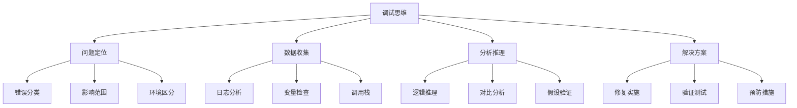

# 调试技巧集

## 🎯 学习目标
- 掌握PHP调试的核心方法和工具
- 建立系统性的问题排查思维
- 学会使用调试工具提高开发效率
- 形成调试的最佳实践习惯

## 📚 调试思维框架

### 调试金字塔模型


### 错误分类体系

| 错误类型 | 特征 | 常见原因 | 调试重点 |
|---------|------|----------|----------|
| **语法错误** | Parse errors | 代码语法问题 | 语法检查器 |
| **运行时错误** | Fatal/Warning | 逻辑错误 | 异常处理 |
| **逻辑错误** | 结果不符合预期 | 算法/条件问题 | 数据验证 |
| **环境错误** | 特定环境出现 | 配置/依赖问题 | 环境对比 |
| **性能问题** | 执行缓慢 | 算法/资源问题 | 性能分析 |

## 🔍 基本调试技巧

### 输出调试法
```php
<?php
// 1. 基础输出调试
function debugBasic() {
    $data = ['user' => 'admin', 'age' => 25];
    
    // var_dump() - 显示结构信息
    var_dump($data);
    
    // print_r() - 人类可读格式
    print_r($data);
    
    // var_export() - 可执行格式
    var_export($data);
    
    // 条件调试
    if (defined('DEBUG_MODE') && DEBUG_MODE) {
        echo "Debug: Processing user data\n";
    }
}

// 2. 结构化调试输出
function debugStructured($message, $data = null, $level = 'INFO') {
    $timestamp = date('Y-m-d H:i:s');
    $output = sprintf("[%s] %s: %s", $timestamp, $level, $message);
    
    if ($data !== null) {
        $output .= "\nData: " . json_encode($data, JSON_PRETTY_PRINT);
    }
    
    file_put_contents('debug.log', $output . "\n", FILE_APPEND);
}

// 3. 断点模拟调试
function debugBreakpoint($message, $continue = false) {
    echo "\n=== DEBUG BREAKPOINT ===\n";
    echo "Message: $message\n";
    echo "Time: " . microtime(true) . "\n";
    echo "Memory: " . memory_get_usage(true) . " bytes\n";
    echo "========================\n";
    
    if (!$continue) {
        die("Debug pause - check logs");
    }
}

// 调试实例
debugStructured("User authentication started", ['user_id' => 123]);
debugBreakpoint("Before database query", true);
```

### 异常处理调试
```php
<?php
class DebugException extends Exception {
    protected $debugData;
    
    public function __construct($message, $debugData = [], $code = 0, Exception $previous = null) {
        parent::__construct($message, $code, $previous);
        $this->debugData = $debugData;
    }
    
    public function getDebugData() {
        return $this->debugData;
    }
    
    public function __toString() {
        return parent::__toString() . "\nDebug Data: " . json_encode($this->debugData);
    }
}

class DatabaseDebugger {
    private $connection;
    private $debugQueries = [];
    
    public function executeQuery($sql, $params = []) {
        try {
            // 记录调试信息
            $this->debugQueries[] = [
                'sql' => $sql,
                'params' => $params,
                'time' => microtime(true)
            ];
            
            // 模拟查询执行
            $stmt = $this->prepare($sql);
            $result = $stmt->execute($params);
            
            return $result;
            
        } catch (PDOException $e) {
            // 增强异常信息
            throw new DebugException(
                "Database query failed: " . $e->getMessage(),
                [
                    'sql' => $sql,
                    'params' => $params,
                    'error_code' => $e->getCode(),
                    'queries_before' => count($this->debugQueries)
                ],
                $e->getCode(),
                $e
            );
        }
    }
    
    public function getDebugInfo() {
        return [
            'total_queries' => count($this->debugQueries),
            'queries' => $this->debugQueries
        ];
    }
}
```

## 🛠️ 专业调试工具

### Xdebug配置与应用
```php
<?php
// 1. php.ini 配置示例
/*
[xdebug]
zend_extension=xdebug.so
xdebug.mode=debug
xdebug.start_with_request=yes
xdebug.client_host=127.0.0.1
xdebug.client_port=9003
xdebug.max_nesting_level=100
xdebug.collect_vars=on
xdebug.collect_params=4
xdebug.collect_return=on
xdebug.show_mem_delta=on
*/

// 2. Xdebug函数使用
function debugWithXdebug() {
    // 启动错误追踪
    xdebug_start_error_collection();
    
    // 代码执行...
    $result = performComplexOperation();
    
    // 获取错误信息
    $errors = xdebug_get_collected_errors();
    
    // 启动性能分析
    xdebug_start_trace('trace.log');
    
    // 启动函数追踪
    xdebug_start_function_monitor([
        'strlen', 'array_sum', 'json_encode'
    ]);
    
    // 执行监控的代码
    executeMonitoredCode();
    
    // 停止并保存追踪
    xdebug_stop_trace();
    xdebug_stop_function_monitor();
    
    return $result;
}

// 3. 断点调试辅助函数
function setVirtualBreakpoint($condition, $file, $line) {
    if ($condition) {
        xdebug_break();
    }
}

function debugVariable($var, $name = 'variable') {
    if (function_exists('xdebug_var_dump')) {
        echo "<xdebug:var_dump name='$name'>";
        xdebug_var_dump($var);
        echo "</xdebug:var_dump>";
    } else {
        var_dump($var);
    }
}
```

### 日志调试系统
```php
<?php
class Logger {
    private static $instance = null;
    private $logLevels = [
        'DEBUG' => 0,
        'INFO' => 1,
        'WARNING' => 2,
        'ERROR' => 3,
        'CRITICAL' => 4
    ];
    private $currentLevel = 'DEBUG';
    private $logFile = null;
    
    public static function getInstance() {
        if (self::$instance === null) {
            self::$instance = new self();
        }
        return self::$instance;
    }
    
    private function __construct() {
        $this->logFile = 'debug_' . date('Y-m-d') . '.log';
    }
    
    public function setLevel($level) {
        $this->currentLevel = strtoupper($level);
    }
    
    public function log($message, $level = 'INFO', $context = []) {
        if ($this->logLevels[$level] < $this->logLevels[$this->currentLevel]) {
            return;
        }
        
        $timestamp = date('Y-m-d H:i:s.u');
        $memory = memory_get_usage(true);
        $peak_memory = memory_get_peak_usage(true);
        
        $logEntry = [
            'timestamp' => $timestamp,
            'level' => $level,
            'message' => $message,
            'context' => $context,
            'memory' => $memory,
            'peak_memory' => $peak_memory,
            'file' => debug_backtrace()[1]['file'] ?? 'unknown',
            'line' => debug_backtrace()[1]['line'] ?? 0
        ];
        
        file_put_contents(
            $this->logFile,
            json_encode($logEntry, JSON_PRETTY_PRINT) . "\n",
            FILE_APPEND | LOCK_EX
        );
    }
    
    public function debug($message, $context = []) {
        $this->log($message, 'DEBUG', $context);
    }
    
    public function info($message, $context = []) {
        $this->log($message, 'INFO', $context);
    }
    
    public function error($message, $context = []) {
        $this->log($message, 'ERROR', $context);
    }
}

// 使用示例
$logger = Logger::getInstance();
$logger->debug('Function called', ['function' => __FUNCTION__, 'args' => func_get_args()]);
$logger->info('Database connected', ['host' => 'localhost', 'database' => 'test']);
$logger->error('Connection failed', ['error_code' => 2006, 'retry_count' => 3]);
```

## 🔧 性能调试技巧

### 性能监控与优化调试
```php
<?php
class PerformanceProfiler {
    private $timers = [];
    private $memoryPoints = [];
    private $functionCalls = [];
    
    public function startTimer($name) {
        $this->timers[$name] = [
            'start' => microtime(true),
            'memory_start' => memory_get_usage(true)
        ];
        $this->addMemoryPoint("Timer start: $name");
    }
    
    public function stopTimer($name) {
        if (!isset($this->timers[$name])) {
            throw new InvalidArgumentException("Timer '$name' not started");
        }
        
        $end = microtime(true);
        $memoryEnd = memory_get_usage(true);
        
        $result = [
            'duration' => $end - $this->timers[$name]['start'],
            'memory_used' => $memoryEnd - $this->timers[$name]['memory_start'],
            'memory_current' => $memoryEnd,
            'peak_memory' => memory_get_peak_usage(true)
        ];
        
        unset($this->timers[$name]);
        return $result;
    }
    
    public function addMemoryPoint($description) {
        $this->memoryPoints[] = [
            'description' => $description,
            'memory' => memory_get_usage(true),
            'peak_memory' => memory_get_peak_usage(true),
            'timestamp' => microtime(true)
        ];
    }
    
    public function profileFunction($functionName, callable $callback) {
        return function(...$args) use ($functionName, $callback) {
            $this->startTimer($functionName);
            $result = $callback(...$args);
            $this->stopTimer($functionName);
            return $result;
        };
    }
    
    public function getReport() {
        return [
            'timers' => $this->timers,
            'memory_points' => $this->memoryPoints,
            'current_memory' => memory_get_usage(true),
            'peak_memory' => memory_get_peak_usage(true)
        ];
    }
}

// 性能调试实例
$profiler = new PerformanceProfiler();

// 监控数据库操作
function fetchUserData($profiler) {
    $profiler->startTimer('database_query');
    
    // 模拟数据库查询
    usleep(100000); // 100ms delay
    $userData = ['id' => 1, 'name' => 'John', 'email' => 'john@example.com'];
    
    $result = $profiler->stopTimer('database_query');
    echo "Database query took: " . $result['duration'] . " seconds\n";
    
    return $userData;
}

// 监控算法性能
$users = [];
for ($i = 0; $i < 1000; $i++) {
    $users[] = ['id' => $i, 'name' => "User$i"];
}

$profiler->startTimer('algorithm_search');
// 线性搜索算法
foreach ($users as $user) {
    if ($user['name'] === 'User500') {
        break;
    }
}
$profiler->stopTimer('algorithm_search');

$report = $profiler->getReport();
debug_function(print_r($report, true));
```

## 🎯 问题排查流程

### 系统性调试流程
```php
<?php
class DebugWorkflow {
    private $steps = [];
    private $currentStep = 0;
    
    public function addStep($step) {
        $this->steps[] = $step;
        return $this;
    }
    
    public function execute() {
        foreach ($this->steps as $index => $step) {
            echo "执行步骤 " . ($index + 1) . ": {$step['name']}\n";
            
            try {
                $result = call_user_func($step['callback']);
                echo "✓ 成功: {$step['name']}\n";
                
                if (isset($step['onSuccess'])) {
                    call_user_func($step['onSuccess'], $result);
                }
            } catch (Exception $e) {
                echo "✗ 失败: {$step['name']} - " . $e->getMessage() . "\n";
                
                if (isset($step['onError'])) {
                    call_user_func($step['onError'], $e);
                } else {
                    throw $e; // 如果没有错误处理，抛出异常
                }
            }
            
            echo "\n";
        }
        
        return $this;
    }
}

// 调试流程实例
$workflow = new DebugWorkflow();

$workflow->addStep([
    'name' => '环境检查',
    'callback' => function() {
        // 检查PHP版本
        if (version_compare(PHP_VERSION, '8.0.0', '<')) {
            throw new Exception('PHP版本过低');
        }
        
        // 检查扩展
        $requiredExtensions = ['pdo', 'json', 'mbstring'];
        foreach ($requiredExtensions as $ext) {
            if (!extension_loaded($ext)) {
                throw new Exception("缺少必要扩展: $ext");
            }
        }
        
        return ['php_version' => PHP_VERSION, 'extensions' => $requiredExtensions];
    },
    'onSuccess' => function($result) {
        echo "环境正常\n";
    }
])
->addStep([
    'name' => '配置验证',
    'callback' => function() {
        // 验证配置文件
        $config = ['database_host' => 'localhost', 'debug' => true];
        
        foreach ($config as $key => $value) {
            if ($value === null) {
                throw new Exception("配置项 $key 未设置");
            }
        }
        
        return $config;
    },
    'onError' => function($e) {
        echo "配置错误，已自动修复\n";
        // 自动修复逻辑
    }
])
->addStep([
    'name' => '数据库连接',
    'callback' => function() {
        // 模拟数据库连接
        return ['connected' => true, 'host' => 'localhost'];
    }
])
->execute();
```

## 📊 调试工具集成

### IDE集成调试配置
```php
<?php
// PhpStorm/VSCode 调试配置示例

// 1. 调试标记函数
function debugMarker($name, $data = null) {
    $marker = [
        'name' => $name,
        'timestamp' => microtime(true),
        'memory' => memory_get_usage(true),
        'file' => __FILE__,
        'line' => __LINE__,
        'data' => $data
    ];
    
    // 输出到文件供IDE读取
    file_put_contents(
        'ide_debug.json',
        json_encode($marker, JSON_PRETTY_PRINT),
        FILE_APPEND | LOCK_EX
    );
}

// 2. 条件断点辅助
function conditionalBreakpoint($condition, $data = []) {
    if ($condition) {
        debugMarker('conditional_breakpoint', $data);
        
        // 触发IDE断点（如果配置了Xdebug）
        if (function_exists('xdebug_break')) {
            xdebug_break();
        }
    }
}

// 3. 调试配置检查
function checkDebugEnvironment() {
    $config = [
        'xdebug_enabled' => function_exists('xdebug_info'),
        'opcache_enabled' => function_exists('opcache_get_status'),
        'error_reporting' => error_reporting(),
        'display_errors' => ini_get('display_errors'),
        'log_errors' => ini_get('log_errors'),
        'memory_limit' => ini_get('memory_limit'),
        'max_execution_time' => ini_get('max_execution_time')
    ];
    
    debugMarker('environment_check', $config);
    return $config;
}

// 使用示例
checkDebugEnvironment();

$userCount = 1500;
conditionalBreakpoint($userCount > 1000, ['threshold_exceeded' => true]);
```

## 🎓 调试最佳实践

### 费曼学习法应用：调试思维
1. **概念解释**: 用简单语言解释调试的本质是"找出不一致"
2. **类比思维**: 调试就像医生诊断病情，需要系统性的检查
3. **简化原则**: 复杂问题先简化为简单问题
4. **教学思维**: 想象向别人解释问题时，你会怎么描述

### 刻意练习重点
1. **预设调试点**: 在关键位置预设调试代码
2. **日志分级**: 建立完整的日志分级系统
3. **复现能力**: 培养能够复现和隔离问题的能力
4. **工具熟练度**: 熟练使用Xdebug、Profiler等工具

## 🔗 相关链接
- [[03-应用实践层/错误处理/05-调试技巧与工具|调试技巧与工具]]
- [[05-专业深化层/监控调试/04-调试工具使用|调试工具使用]]
- [[98-学习工具/03-性能测试工具|性能测试工具]]
- [[98-学习工具/04-学习笔记模板|学习笔记模板]]
- [[01-基础认知层/语言特性与运行环境/05-开发工具配置|开发工具配置]]
