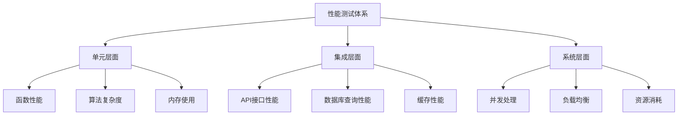

# 性能测试工具

## 🎯 学习目标
- 掌握PHP性能测试的核心方法和工具
- 建立系统性的性能分析思维
- 学会使用专业工具进行性能优化
- 形成性能测试的最佳实践习惯

## 📚 性能测试框架

### 性能测试金字塔


### 性能指标体系

| 性能指标 | 描述 | 测量方法 | 优化目标 |
|---------|------|----------|----------|
| **响应时间** | 请求处理时间 | 毫秒级测量 | <100ms |
| **吞吐量** | 每秒处理请求数 | QPS统计 | >1000 QPS |
| **内存使用** | 程序内存消耗 | 内存监控 | 稳定增长 |
| **CPU使用率** | CPU资源占用 | 系统监控 | <80% |
| **数据库性能** | 查询执行时间 | SQL分析 | 优化查询 |

## 🔧 内置性能工具

### PHP内置性能函数
```php
<?php
class PerformanceAnalyzer {
    private $benchmarks = [];
    private $memorySnapshots = [];
    private $callStack = [];
    
    public function benchmark($name, callable $callback) {
        $startTime = microtime(true);
        $startMemory = memory_get_usage(true);
        $startPeak = memory_get_peak_usage(true);
        
        // 执行回调函数
        $result = $callback();
        
        $endTime = microtime(true);
        $endMemory = memory_get_usage(true);
        $endPeak = memory_get_peak_usage(true);
        
        $benchmark = [
            'name' => $name,
            'execution_time' => $endTime - $startTime,
            'memory_used' => $endMemory - $startMemory,
            'peak_memory' => $endPeak,
            'iterations' => 1,
            'memory_profiling' => [
                'start' => $startMemory,
                'end' => $endMemory,
                'peak_start' => $startPeak,
                'peak_end' => $endPeak
            ]
        ];
        
        $this->benchmarks[$name] = $benchmark;
        return $result;
    }
    
    public function benchmarkIterations($name, callable $callback, $iterations = 1000) {
        $startTime = microtime(true);
        
        for ($i = 0; $i < $iterations; $i++) {
            $callback();
        }
        
        $endTime = microtime(true);
        $totalTime = $endTime - $startTime;
        
        $benchmark = [
            'name' => $name,
            'iterations' => $iterations,
            'total_time' => $totalTime,
            'avg_time_per_iteration' => $totalTime / $iterations,
            'operations_per_second' => $iterations / $totalTime,
            'total_memory_used' => memory_get_usage(true),
            'peak_memory' => memory_get_peak_usage(true)
        ];
        
        $this->benchmarks[$name . '_iterations'] = $benchmark;
        return $benchmark;
    }
    
    public function compareBenchmarks($baseline, $comparison) {
        if (!isset($this->benchmarks[$baseline]) || !isset($this->benchmarks[$comparison])) {
            throw new InvalidArgumentException('基准测试不存在');
        }
        
        $base = $this->benchmarks[$baseline];
        $comp = $this->benchmarks[$comparison];
        
        return [
            'comparison' => [
                'baseline' => $baseline,
                'comparison' => $comparison
            ],
            'execution_time' => [
                'baseline' => $base['execution_time'],
                'comparison' => $comp['execution_time'],
                'difference' => $comp['execution_time'] - $base['execution_time'],
                'percentage' => (($comp['execution_time'] / $base['execution_time']) - 1) * 100
            ],
            'memory_usage' => [
                'baseline' => $base['memory_used'],
                'comparison' => $comp['memory_used'],
                'difference' => $comp['memory_used'] - $base['memory_used'],
                'percentage' => (($comp['memory_used'] / $base['memory_used']) - 1) * 100
            ]
        ];
    }
    
    public function getMemorySnapshots() {
        $this->memorySnapshots[] = [
            'timestamp' => microtime(true),
            'memory_usage' => memory_get_usage(true),
            'peak_memory' => memory_get_peak_usage(true),
            'stack_trace' => debug_backtrace()
        ];
        
        return $this->memorySnapshots;
    }
    
    public function getReport() {
        return [
            'benchmarks' => $this->benchmarks,
            'memory_snapshots' => $this->memorySnapshots,
            'summary' => $this->generateSummary()
        ];
    }
    
    private function generateSummary() {
        $fastest = $slowest = null;
        $avgTime = 0;
        
        foreach ($this->benchmarks as $benchmark) {
            if ($fastest === null || $benchmark['execution_time'] < $fastest['execution_time']) {
                $fastest = $benchmark;
            }
            if ($slowest === null || $benchmark['execution_time'] > $slowest['execution_time']) {
                $slowest = $benchmark;
            }
            $avgTime += $benchmark['execution_time'];
        }
        
        return [
            'fastest' => $fastest,
            'slowest' => $slowest,
            'average_time' => count($this->benchmarks) > 0 ? $avgTime / count($this->benchmarks) : 0,
            'total_tests' => count($this->benchmarks)
        ];
    }
}

// 使用示例
$analyzer = new PerformanceAnalyzer();

// 测试不同算法的性能
$data = range(1, 10000);

// 线性搜索
$analyzer->benchmark('linear_search', function() use ($data) {
    return array_search(5000, $data);
});

// 二分搜索（需要数组排序）
sort($data);
$analyzer->benchmark('binary_search', function() use ($data) {
    return array_search(5000, $data);
});

// 迭代性能测试
$analyzer->benchmarkIterations('string_concatenation', function() {
    $result = '';
    for ($i = 0; $i < 100; $i++) {
        $result .= $i;
    }
    return $result;
}, 1000);

// 性能对比
$comparison = $analyzer->compareBenchmarks('linear_search', 'binary_search');
print_r($comparison);
```

### 内存性能分析
```php
<?php
class MemoryProfiler {
    private $snapshots = [];
    private $gcStats = [];
    
    public function takeSnapshot($label) {
        $snapshot = [
            'label' => $label,
            'timestamp' => microtime(true),
            'memory_usage' => [
                'current' => memory_get_usage(true),
                'peak' => memory_get_peak_usage(true),
                'real_current' => memory_get_usage(false),
                'real_peak' => memory_get_peak_usage(false)
            ],
            'gc_stats' => $this->getGCStats(),
            'objects_count' => $this->countObjects()
        ];
        
        $this->snapshots[] = $snapshot;
        return $snapshot;
    }
    
    private function getGCStats() {
        return [
            'runs' => gc_collect_cycles(),
            'collections' => gc_mem_caches()
        ];
    }
    
    private function countObjects() {
        $objects = get_declared_classes();
        $count = 0;
        
        foreach ($objects as $class) {
            $count += count(get_class_vars($class));
        }
        
        return $count;
    }
    
    public function analyzeMemoryGrowth($steps = 10) {
        $results = [];
        
        for ($i = 0; $i < steps; $i++) {
            $this->takeSnapshot("step_$i");
            
            // 创建一些测试对象
            $objects = [];
            for ($j = 0; $j < 100; $j++) {
                $objects[] = new stdClass();
                $objects[$j]->data = str_repeat('test', $j * 100);
            }
            
            if ($i % 2 === 0) {
                // 模拟垃圾回收
                $objects = null;
                gc_collect_cycles();
            }
            
            $step = $this->snapshots[$i];
            $results[] = [
                'step' => $i,
                'memory_current' => $step['memory_usage']['current'],
                'memory_peak' => $step['memory_usage']['peak'],
                'gc_runs' => $step['gc_stats']['runs'],
                'objects_created' => count($objects ?? [])
            ];
        }
        
        return $results;
    }
    
    public function detectMemoryLeaks($threshold = 1024 * 1024) { // 1MB threshold
        $leaks = [];
        
        for ($i = 1; $i < count($this->snapshots); $i++) {
            $current = $this->snapshots[$i]['memory_usage']['current'];
            $previous = $this->snapshots[$i - 1]['memory_usage']['current'];
            $growth = $current - $previous;
            
            if ($growth > $threshold) {
                $leaks[] = [
                    'from_snapshot' => $this->snapshots[$i - 1]['label'],
                    'to_snapshot' => $this->snapshots[$i]['label'],
                    'growth' => $growth,
                    'percentage' => ($growth / $previous) * 100
                ];
            }
        }
        
        return $leaks;
    }
    
    public function getMemoryReport() {
        return [
            'snapshots' => $this->snapshots,
            'total_memory_growth' => count($this->snapshots) > 0 ? 
                end($this->snapshots)['memory_usage']['current'] - $this->snapshots[0]['memory_usage']['current'] : 0,
            'peak_memory' => max(array_column(array_column($this->snapshots, 'memory_usage'), 'peak')),
            'memory_leaks' => $this->detectMemoryLeaks(),
            'analysis' => $this->analyzeMemoryGrowth(5)
        ];
    }
}

// 使用示例
$profiler = new MemoryProfiler();

$profiler->takeSnapshot('start');

// 创建大量对象
$data = [];
for ($i = 0; $i < 1000; $i++) {
    $data[] = [
        'id' => $i,
        'content' => str_repeat('data', $i),
        'timestamp' => microtime(true)
    ];
}

$profiler->takeSnapshot('after_data_creation');

// 处理数据
unset($data);
gc_collect_cycles();

$profiler->takeSnapshot('after_cleanup');

$report = $profiler->getMemoryReport();
print_r($report);
```

## ⚡ 专业性能工具

### 数据库性能测试
```php
<?php
class DatabasePerformanceTest {
    private $connection;
    private $queries = [];
    private $slowQueryThreshold = 0.1; // 100ms
    
    public function __construct(PDO $connection) {
        $this->connection = $connection;
    }
    
    public function benchmarkQuery($name, $sql, $params = [], $iterations = 1) {
        $query = [
            'name' => $name,
            'sql' => $sql,
            'params' => $params,
            'iterations' => $iterations,
            'results' => []
        ];
        
        for ($i = 0; $i < $iterations; $i++) {
            $startTime = microtime(true);
            $startMemory = memory_get_usage(true);
            
            $stmt = $this->connection->prepare($sql);
            $stmt->execute($params);
            $result = $stmt->fetchAll(PDO::FETCH_ASSOC);
            
            $endTime = microtime(true);
            $endMemory = memory_get_usage(true);
            
            $query['results'][] = [
                'execution_time' => $endTime - $startTime,
                'memory_used' => $endMemory - $startMemory,
                'rows_returned' => count($result),
                'slow_query' => ($endTime - $startTime) > $this->slowQueryThreshold
            ];
        }
        
        $this->queries[$name] = $query;
        return $query;
    }
    
    public function testQueryOptimizations($baseQuery, $optimizedQueries) {
        $results = [];
        
        // 基准查询
        $baseResult = $this->benchmarkQuery('baseline', $baseQuery);
        
        // 优化查询
        foreach ($optimizedQueries as $optimization => $sql) {
            $optResult = $this->benchmarkQuery("opt_$optimization", $sql);
            $results[$optimization] = [
                'improvement' => $baseResult['results'][0]['execution_time'] - $optResult['results'][0]['execution_time'],
                'percentage' => (1 - ($optResult['results'][0]['execution_time'] / $baseResult['results'][0]['execution_time'])) * 100
            ];
        }
        
        return $results;
    }
    
    public function analyzeSlowQueries() {
        $slowQueries = [];
        
        foreach ($this->queries as $name => $query) {
            foreach ($query['results'] as $result) {
                if ($result['slow_query']) {
                    $slowQueries[] = [
                        'query_name' => $name,
                        'execution_time' => $result['execution_time'],
                        'sql' => $query['sql'],
                        'rows_returned' => $result['rows_returned']
                    ];
                }
            }
        }
        
        // 按执行时间排序
        usort($slowQueries, function($a, $b) {
            return $b['execution_time'] <=> $a['execution_time'];
        });
        
        return $slowQueries;
    }
    
    public function getQueryProfileReport() {
        return [
            'total_queries' => count($this->queries),
            'slow_queries' => $this->analyzeSlowQueries(),
            'average_execution_time' => $this->getAverageExecutionTime(),
            'total_execution_time' => $this->getTotalExecutionTime(),
            'memory_usage' => $this->getTotalMemoryUsage(),
            'queries_detail' => $this->queries
        ];
    }
    
    private function getAverageExecutionTime() {
        $totalTime = 0;
        $totalResults = 0;
        
        foreach ($this->queries as $query) {
            foreach ($query['results'] as $result) {
                $totalTime += $result['execution_time'];
                $totalResults++;
            }
        }
        
        return $totalResults > 0 ? $totalTime / $totalResults : 0;
    }
    
    private function getTotalExecutionTime() {
        $totalTime = 0;
        foreach ($this->queries as $query) {
            foreach ($query['results'] as $result) {
                $totalTime += $result['execution_time'];
            }
        }
        return $totalTime;
    }
    
    private function getTotalMemoryUsage() {
        $totalMemory = 0;
        foreach ($this->queries as $query) {
            foreach ($query['results'] as $result) {
                $totalMemory += $result['memory_used'];
            }
        }
        return $totalMemory;
    }
}

// 使用示例
try {
    $pdo = new PDO('mysql:host=localhost;dbname=test', 'user', 'pass');
    
    $dbTest = new DatabasePerformanceTest($pdo);
    
    // 测试不同的查询策略
    $dbTest->benchmarkQuery(
        'select_all',
        'SELECT * FROM users WHERE active = 1',
        [],
        100
    );
    
    $dbTest->benchmarkQuery(
        'select_specific',
        'SELECT id, name, email FROM users WHERE active = 1',
        [],
        100
    );
    
    $dbTest->benchmarkQuery(
        'with_limit',
        'SELECT id, name, email FROM users WHERE active = 1 LIMIT 100',
        [],
        100
    );
    
    $slowQueries = $dbTest->analyzeSlowQueries();
    print_r($slowQueries);
    
} catch (PDOException $e) {
    echo "Database connection failed: " . $e->getMessage();
}
```

### 缓存性能测试
```php
<?php
class CachePerformanceTest {
    private $testData;
    private $cacheTypes = [];
    
    public function __construct() {
        $this->testData = $this->generateTestData();
    }
    
    private function generateTestData() {
        return [
            'small' => ['key' => 'value'],
            'medium' => array_fill(0, 100, 'data'),
            'large' => array_fill(0, 10000, 'large_data')
        ];
    }
    
    public Funktion testFileCache() {
        $cacheDir = sys_get_temp_dir() . '/cache_test/';
        if (!is_dir($cacheDir)) {
            mkdir($cacheDir, 0755, true);
        }
        
        $results = [];
        
        foreach ($this->testData as $size => $data) {
            $cacheFile = $cacheDir . "file_cache_$size.json";
            
            // 写入测试
            $startWrite = microtime(true);
            file_put_contents($cacheFile, json_encode($data));
            $writeTime = microtime(true) - $startWrite;
            
            // 读取测试
            $startRead = microtime(true);
            $cachedData = json_decode(file_get_contents($cacheFile), true);
            $readTime = microtime(true) - $startRead;
            
            $results[$size] = [
                'write_time' => $writeTime,
                'read_time' => $readTime,
                'file_size' => filesize($cacheFile),
                'serialized_size' => strlen(json_encode($data))
            ];
        }
        
        return $results;
    }
    
    public function testMemoryCache($name, callable $cacheImplementation) {
        $results = [];
        
        foreach ($this->testData as $size => $data) {
            $cache = $cacheImplementation();
            
            // 存储测试
            $startStore = microtime(true);
            foreach ($data as $key => $value) {
                $cache['set']($key, $value);
            }
            $storeTime = microtime(true) - $startStore;
            
            // 检索测试
            $startRetrieve = microtime(true);
            foreach ($data as $key => $value) {
                $cached = $cache['get']($key);
            }
            $retrieveTime = microtime(true) - $startRetrieve;
            
            $results[$size] = [
                'store_time' => $storeTime,
                'retrieve_time' => $retrieveTime,
                'memory_usage' => memory_get_usage(true),
                'entries_count' => count($data)
            ];
        }
        
        return $results;
    }
    
    public function compareCacheImplementations() {
        $fileCache = $this->testFileCache();
        
        $memoryCache = $this->testMemoryCache('array_cache', function() {
            return [
                'set' => function($key, $value) use (&$cache) {
                    return $cache[$key] = $value;
                },
                'get' => function($key) use (&$cache) {
                    return $cache[$key] ?? null;
                }
            ];
        });
        
        return [
            'file_cache' => $fileCache,
            'memory_cache' => $memoryCache,
            'comparison' => $this->generateComparisonReport($fileCache, $memoryCache)
        ];
    }
    
    private function generateComparisonReport($fileCache, $memoryCache) {
        $comparison = [];
        
        foreach ($fileCache as $size => $fileResult) {
            $memoryResult = $memoryCache[$size];
            
            $comparison[$size] = [
                'write_performance' => [
                    'file' => $fileResult['write_time'],
                    'memory' => $memoryResult['store_time'],
                    'winner' => $fileResult['write_time'] < $memoryResult['store_time'] ? 'file' : 'memory'
                ],
                'read_performance' => [
                    'file' => $fileResult['read_time'],
                    'memory' => $memoryResult['retrieve_time'],
                    'winner' => $fileResult['read_time'] < $memoryResult['retrieve_time'] ? 'file' : 'memory'
                ]
            ];
        }
        
        return $comparison;
    }
}

// 使用示例
$cacheTest = new CachePerformanceTest();
$results = $cacheTest->compareCacheImplementations();
print_r($results);
```

## 📊 并发性能测试

### 负载测试工具
```php
<?php
class LoadTester {
    private $requests = [];
    private $concurrentUsers = 10;
    private $totalRequests = 100;
    
    public function __construct($concurrentUsers = 10, $totalRequests = 100) {
        $this->concurrentUsers = $concurrentUsers;
        $this->totalRequests = $totalRequests;
    }
    
    public function simulateLoad($targetFunction, $targetData = []) {
        $results = [];
        $startTime = microtime(true);
        
        // 使用多进程模拟并发
        $processes = [];
        $requestsPerProcess = $this->totalRequests / $this->concurrentUsers;
        
        for ($i = 0; $i < $this->concurrentUsers; $i++) {
            $processResults = $this->simulateUserRequests($targetFunction, $targetData, $requestsPerProcess);
            $results = array_merge($results, $processResults);
        }
        
        $endTime = microtime(true);
        
        return $this->generateLoadTestReport($results, $endTime - $startTime);
    }
    
    private function simulateUserRequests($targetFunction, $targetData, $requestCount) {
        $results = [];
        
        for ($i = 0; $i < $requestCount; $i++) {
            $requestStart = microtime(true);
            $memoryStart = memory_get_usage(true);
            
            try {
                $response = call_user_func($targetFunction, $targetData);
                $status = 'success';
                $error = null;
            } catch (Exception $e) {
                $response = null;
                $status = 'error';
                $error = $e->getMessage();
            }
            
            $requestEnd = microtime(true);
            $memoryEnd = memory_get_usage(true);
            
            $results[] = [
                'request_id' => uniqid(),
                'timestamp' => $requestStart,
                'response_time' => $requestEnd - $requestStart,
                'memory_used' => $memoryEnd - $memoryStart,
                'status' => $status,
                'error' => $error,
                'response_size' => is_string($response) ? strlen($response) : 0
            ];
        }
        
        return $results;
    }
    
    private function generateLoadTestReport($results, $totalTime) {
        $successCount = count(array_filter($results, fn($r) => $r['status'] === 'success'));
        $errorCount = count($results) - $successCount;
        
        $responseTimes = array_column($results, 'response_time');
        sort($responseTimes);
        
        return [
            'summary' => [
                'total_requests' => count($results),
                'successful_requests' => $successCount,
                'failed_requests' => $errorCount,
                'success_rate' => ($successCount / count($results)) * 100,
                'total_time' => $totalTime,
                'requests_per_second' => count($results) / $totalTime
            ],
            'response_times' => [
                'min' => min($responseTimes),
                'max' => max($responseTimes),
                'average' => array_sum($responseTimes) / count($responseTimes),
                'median' => $this->getMedian($responseTimes),
                'p95' => $this->getPercentile($responseTimes, 95),
                'p99' => $this->getPercentile($responseTimes, 99)
            ],
            'errors' => array_filter($results, fn($r) => $r['status'] === 'error'),
            'detailed_results' => $results
        ];
    }
    
    private function getMedian($sortedArray) {
        $count = count($sortedArray);
        if ($count % 2 === 0) {
            return ($sortedArray[$count / 2 - 1] + $sortedArray[$count / 2]) / 2;
        } else {
            return $sortedArray[intval($count / 2)];
        }
    }
    
    private function getPercentile($sortedArray, $percentile) {
        $index = ($percentile / 100) * (count($sortedArray) - 1);
        $lowerIndex = floor($index);
        $upperIndex = ceil($index);
        
        if ($lowerIndex === $upperIndex) {
            return $sortedArray[$lowerIndex];
        }
        
        $weight = $index - $lowerIndex;
        return $sortedArray[$lowerIndex] * (1 - $weight) + $sortedArray[$upperIndex] * $weight;
    }
}

// 测试函数示例
function simulateApiEndpoint($data) {
    // 模拟API处理
    usleep(rand(50000, 200000)); // 50-200ms 延迟
    
    if (rand(1, 100) <= 5) {
        throw new Exception('模拟错误');
    }
    
    return ['status' => 'success', 'data' => $data];
}

// 使用示例
$loadTester = new LoadTester(5, 50);
$results = $loadTester->simulateLoad('simulateApiEndpoint', ['test' => 'data']);
print_r($results['summary']);
```

## 🎯 性能分析与优化

### 性能分析报告生成器
```php
<?php
class PerformanceReportGenerator {
    private $reports = [];
    
    public function addReport($category, $data) {
        $this->reports[$category] = $data;
        return $this;
    }
    
    public function generateHTMLReport() {
        $html = '<!DOCTYPE html>
<html>
<head>
    <title>PHP性能测试报告</title>
    <style>
        body { font-family: Arial, sans-serif; margin: 20px; }
        .section { margin-bottom: 30px; }
        .metric { background: #f5f5f5; padding: 10px; margin: 5px 0; border-radius: 5px; }
        .good { color: #28a745; }
        .warning { color: #ffc107; }
        .bad { color: #dc3545; }
        table { border-collapse: collapse; width: 100%; }
        th, td { border: 1px solid #ddd; padding: 8px; text-align: left; }
        th { background-color: #f2f2f2; }
    </style>
</head>
<body>
    <h1>PHP性能测试报告</h1>
    <p>生成时间: ' . date('Y-m-d H:i:s') . '</p>';
        
        foreach ($this->reports as $category => $data) {
            $html .= $this->generateCategorySection($category, $data);
        }
        
        $html .= '</body></html>';
        
        return $html;
    }
    
    private function generateCategorySection($category, $data) {
        $html = "<div class='section'>";
        $html .= "<h2>" . ucfirst($category) . "</h2>";
        
        switch ($category) {
            case 'benchmarks':
                $html .= $this->generateBenchmarksTable($data);
                break;
            case 'memory':
                $html .= $this->generateMemoryReport($data);
                break;
            case 'database':
                $html .= $this->generateDatabaseReport($data);
                break;
            case 'cache':
                $html .= $this->generateCacheReport($data);
                break;
            default:
                $html .= "<pre>" . print_r($data, true) . "</pre>";
        }
        
        $html .= "</div>";
        return $html;
    }
    
    private function generateBenchmarksTable($benchmarks) {
        $html = '<table><tr><th>测试名称</th><th>执行时间</th><th>内存使用</th><th>迭代次数</th></tr>';
        
        foreach ($benchmarks as $name => $benchmark) {
            $status = $this->getPerformanceStatus($benchmark['execution_time']);
            $html .= "<tr>
                <td>$name</td>
                <td class='$status'>" . number_format($benchmark['execution_time'] * 1000, 2) . " ms</td>
                <td>" . $this->formatBytes($benchmark['memory_used']) . "</td>
                <td>" . ($benchmark['iterations'] ?? 1) . "</td>
            </tr>";
        }
        
        $html .= '</table>';
        return $html;
    }
    
    private function generateMemoryReport($memoryData) {
        $html = '<div class="metric">';
        $html .= '<h3>内存使用情况</h3>';
        $html .= '<p>峰值内存: ' . $this->formatBytes($memoryData['peak_memory']) . '</p>';
        $html .= '<p>当前内存: ' . $this->formatBytes($memoryData['current_memory']) . '</p>';
        
        if (isset($memoryData['leaks']) && count($memoryData['leaks']) > 0) {
            $html .= '<p class="warning">⚠️ 检测到 ' . count($memoryData['leaks']) . ' 个潜在内存泄漏</p>';
        } else {
            $html .= '<p class="good">✅ 未检测到内存泄漏</p>';
        }
        
        $html .= '</div>';
        return $html;
    }
    
    private function generateDatabaseReport($dbData) {
        $html = '<div class="metric">';
        $html .= '<h3>数据库性能</h3>';
        $html .= '<p>总查询数: ' . $dbData['total_queries'] . '</p>';
        $html .= '<p>平均执行时间: ' . number_format($dbData['average_execution_time'] * 1000, 2) . ' ms</p>';
        $html .= '<p>慢查询数: ' . count($dbData['slow_queries']) . '</p>';
        $html .= '</div>';
        return $html;
    }
    
    private function generateCacheReport($cacheData) {
        $html = '<div class="metric">';
        $html .= '<h3>缓存性能对比</h3>';
        
        foreach ($cacheData['comparison'] as $size => $comparison) {
            $html .= "<h4>数据大小: $size</h4>";
            $html .= '<p>写入性能: ' . ($comparison['write_performance']['winner'] === 'file' ? '文件缓存' : '内存缓存') . ' 获胜</p>';
            $html .= '<p>读取性能: ' . ($comparison['read_performance']['winner'] === 'file' ? '文件缓存' : '内存缓存') . ' 获胜</p>';
        }
        
        $html .= '</div>';
        return $html;
    }
    
    private function getPerformanceStatus($executionTime) {
        if ($executionTime < 0.01) return 'good';
        if ($executionTime < 0.1) return 'warning';
        return 'bad';
    }
    
    private function formatBytes($bytes) {
        $units = ['B', 'KB', 'MB', 'GB'];
        $bytes = max($bytes, 0);
        $pow = floor(($bytes ? log($bytes) : 0) / log(1024));
        $pow = min($pow, count($units) - 1);
        
        $bytes /= (1 << (10 * $pow));
        
        return round($bytes, 2) . ' ' . $units[$pow];
    }
    
    public function saveReport($filename = null) {
        if ($filename === null) {
            $filename = 'performance_report_' . date('Y-m-d_H-i-s') . '.html';
        }
        
        $html = $this->generateHTMLReport();
        file_put_contents($filename, $html);
        
        return $filename;
    }
}

// 使用示例
$reportGenerator = new PerformanceReportGenerator();

// 添加各类性能数据
$reportGenerator->addReport('benchmarks', [
    'function_a' => ['execution_time' => 0.005, 'memory_used' => 1024, 'iterations' => 1],
    'function_b' => ['execution_time' => 0.002, 'memory_used' => 512, 'iterations' => 1]
]);

$reportGenerator->addReport('memory', [
    'peak_memory' => 8 * 1024 * 1024,
    'current_memory' => 4 * 1024 * 1024,
    'leaks' => []
]);

$reportGenerator->addReport('database', [
    'total_queries' => 100,
    'average_execution_time' => 0.05,
    'slow_queries' => ['query_1', 'query_2']
]);

$filename = $reportGenerator->saveReport();
echo "性能报告已保存到: $filename";
```

## 🎓 性能测试最佳实践

### 费曼学习法应用：性能测试思维
1. **概念解释**: 性能测试就是"测量软件是否够快"
2. **类比思维**: 性能测试像体检，全面检查各系统健康状态
3. **简化原则**: 复杂系统先拆解为简单组件测试
4. **教学思维**: 想象向老板汇报性能数据时的关注点

### 刻意练习重点
1. **基准建立**: 为关键功能建立性能基准线
2. **监控习惯**: 养成持续监控性能的习惯
3. **优化验证**: 每次优化后都要验证改进效果
4. **工具熟练**: 熟练使用各种性能测试工具

## 🔗 相关链接
- [[05-专业深化层/性能调优/01-代码性能优化|代码性能优化]]
- [[05-专业深化层/监控调试/03-日志分析|日志分析]]
- [[98-学习工具/02-调试技巧集|调试技巧集]]
- [[03-应用实践层/性能优化/01-代码优化技巧|代码优化技巧]]
- [[04-高级应用层/部署运维/05-监控与日志|监控与日志]]
