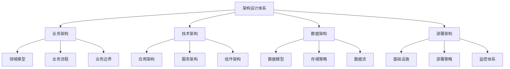

# 项目架构设计

## 🎯 学习目标
- 掌握企业级PHP项目架构设计原则
- 建立系统化的架构思维和设计模式
- 学会评估和选择合适的架构方案
- 形成可扩展、可维护的架构设计能力

## 📚 架构设计框架

### 架构设计金字塔


### 架构层次关系

| 架构层次 | 关注重点 | 设计原则 | 技术选型 |
|---------|----------|----------|----------|
| **业务架构** | 业务逻辑、领域模型 | 业务优先、需求驱动 | 领域驱动设计 |
| **应用架构** | 应用结构、组件设计 | 内聚低耦、可扩展 | MVC、分层架构 |
| **技术架构** | 技术栈、中间件 | 技术适配、性能优先 | 选型原则 |
| **部署架构** | 基础设施、运行环境 | 高可用、可扩展 | 容器化、云原生 |

## 🏗️ 分层架构设计

### MVC架构模式实现
```php
<?php
/**
 * MVC架构框架核心实现
 * 演示标准的Model-View-Controller架构模式
 */
namespace App\Framework;

// Model层示例
abstract class BaseModel {
    protected $db;
    protected $table;
    protected $primaryKey = 'id';
    
    public function __construct(\PDO $database) {
        $this->db = $database;
    }
    
    public function find($id) {
        $sql = "SELECT * FROM {$this->table} WHERE {$this->primaryKey} = :id";
        $stmt = $this->db->prepare($sql);
        $stmt->execute(['id' => $id]);
        return $stmt->fetchObject();
    }
    
    public function create(array $data) {
        $fields = implode(',', array_keys($data));
        $placeholders = ':' . implode(', :', array_keys($data));
        
        $sql = "INSERT INTO {$this->table} ({$fields}) VALUES ({$placeholders})";
        $stmt = $this->db->prepare($sql);
        $stmt->execute($data);
        
        return $this->db->lastInsertId();
    }
    
    public function update($id, array $data) {
        $setParts = [];
        foreach ($data as $key => $value) {
            $setParts[] = "{$key} = :{$key}";
        }
        $setClause = implode(', ', $setParts);
        
        $sql = "UPDATE {$this->table} SET {$setClause} WHERE {$this->primaryKey} = :id";
        $data['id'] = $id;
        $stmt = $this->db->prepare($sql);
        
        return $stmt->execute($data);
    }
}

class UserModel extends BaseModel {
    protected $table = 'users';
    
    public function findByEmail($email) {
        $sql = "SELECT * FROM {$this->table} WHERE email = :email";
        $stmt = $this->db->prepare($sql);
        $stmt->execute(['email' => $email]);
        return $stmt->fundObject();
    }
    
    public function getActiveUsers() {
        $sql = "SELECT * FROM {$this->table} WHERE status = 'active' ORDER BY created_at DESC";
        $stmt = $this->db->prepare($sql);
        $stmt->execute();
        return $stmt->fetchAll(\PDO::FETCH_OBJ);
    )}
}

// Controller层示例
abstract class BaseController {
    protected $request;
    protected $response;
    protected $view;
    
    public function __construct($request, $response, $view) {
        $this->request = $request;
        $this->response = $response;
        $this->view = $view;
    }
    
    protected function json($data, $statusCode = 200) {
        $this->response->setHeader('Content-Type', 'application/json');
        $this->response->setStatusCode($statusCode);
        $this->response->setBody(json_encode($data));
    }
    
    protected function view($template, $data = []) {
        return $this->view->render($template, $data);
    }
    
    protected function redirect($url) {
        $this->response->setHeader('Location', $url);
        $this->response->setStatusCode(302);
    }
}

class UserController extends BaseController {
    private $userModel;
    
    public function __construct($request, $response, $view, UserModel $userModel) {
        parent::__construct($request, $response, $view);
        $this->userModel = $userModel;
    }
    
    public function index() {
        try {
            $users = $this->userModel->getActiveUsers();
            $data = [
                'users' => $users,
                'title' => '用户管理'
            ];
            
            return $this->view('users/index', $data);
        } catch (\Exception $e) {
            return $this->json(['error' => '获取用户列表失败'], 500);
        }
    }
    
    public function show($id) {
        $user = $this->userModel->find($id);
        
        if (!$user) {
            return $this->json(['error' => '用户不存在'], 404);
        }
        
        return $this->json($user);
    }
    
    public function store() {
        $data = $this->request->getPostData();
        
        // 数据验证
        $validation = $this->validateUserData($data);
        if (!$validation['valid']) {
            return $this->json(['errors' => $validation['errors']], 400);
        }
        
        try {
            $userId = $this->userModel->create($data);
            return $this->json(['id' => $userId, 'message' => '用户创建成功'], 201);
        } catch (\Exception $e) {
            return $this->json(['error' => '用户创建失败'], 500);
        }
    }
    
    private function validateUserData($data) {
        $errors = [];
        
        if (empty($data['name'])) {
            $errors[] = '用户名不能为空';
        }
        
        if (empty($data['email']) || !filter_var($data['email'], FILTER_VALIDATE_EMAIL)) {
            $errors[] = '邮箱格式不正确';
        }
        
        return [
            'valid' => empty($errors),
            'errors' => $errors
        ];
    }
}

// View层示例
abstract class BaseView {
    protected $templatePath;
    protected $layoutPath;
    
    public function __construct($templatePath, $layoutPath) {
        $this->templatePath = $templatePath;
        $this->layoutPath = $layoutPath;
    }
    
    abstract public function render($template, $data = []);
}

class TemplateView extends BaseView {
    public function render($template, $data = []) {
        $templateFile = $this->templatePath . '/' . $template . '.php';
        
        if (!file_exists($templateFile)) {
            throw new \Exception("模板文件不存在: $templateFile");
        }
        
        // 提取变量到局部作用域
        extract($data);
        
        // 开始输出缓冲
        ob_start();
        include $templateFile;
        $content = ob_get_clean();
        
        // 使用布局
        if ($this->layoutPath) {
            ob_start();
            include $this->layoutPath . '/layout.php';
            $content = ob_get_clean();
        }
        
        return $content;
    }
}
```

## 🔧 微服务架构设计

### 服务拆分策略
```php
<?php
/**
 * 微服务架构设计模式
 * 展示如何设计和拆分微服务
 */
namespace App\Microservices;

// 微服务基类
abstract class BaseMicroservice {
    protected $serviceName;
    protected $servicePort;
    protected $dependencies = [];
    protected $apiVersion = 'v1';
    
    abstract public function handle(Request $request): Response;
    
    public function registerService($registry) {
        return $registry->register([
            'name' => $this->serviceName,
            'port' => $this->servicePort,
            'health_check' => '/health',
            'api_version' => $this->apiVersion
        ]);
    }
    
    public function healthCheck() {
        return [
            'status' => 'healthy',
            'service' => $this->serviceName,
            'timestamp' => time(),
            'dependencies' => $this->checkDependencies()
        ];
    }
    
    private function checkDependencies() {
        $results = [];
        
        foreach ($this->dependencies as $dep) {
            $results[$dep] = $this->pingDependency($dep);
        }
        
        return $results;
    }
    
    protected function pingDependency($serviceName) {
        // 实现服务依赖检查
        return ['status' => 'ok', 'response_time' => 0.1];
    }
}

// 用户服务
class UserService extends BaseMicroservice {
    protected $serviceName = 'user-service';
    protected $servicePort = 8001;
    protected $dependencies = ['auth-service'];
    
    public function handle(Request $request): Response {
        $method = $request->getMethod();
        $path = $request->getPath();
        
        switch ($method) {
            case 'GET':
                return $this->handleGet($path, $request);
            case 'POST':
                return $this->handlePost($path, $request);
            case 'PUT':
                return $this->handlePut($path, $request);
            case 'DELETE':
                return $this->handleDelete($path, $request);
            default:
                return new Response(['error' => 'Method not allowed'], 405);
        }
    }
    
    private function handleGet($path, Request $request) {
        if (preg_match('/\/users\/(\d+)/', $path, $matches)) {
            $userId = $matches[1];
            return $this->getUser($userId);
        } elseif ($path === '/users') {
            return $this->getUsers($request);
        }
        
        return new Response(['error' => 'Not found'], 404);
    }
    
    private function getUser($id) {
        $user = $this->userRepository->findById($id);
        
        if (!$user) {
            return new Response(['error' => 'User not found'], 404);
        }
        
        return new Response(['user' => $user], 200);
    }
}

// 服务注册中心
class ServiceRegistry {
    private $services = [];
    private $healthCheckInterval = 30; // seconds
    
    public function register(array $serviceConfig) {
        $this->services[$serviceConfig['name']] = [
            'config' => $serviceConfig,
            'registered_at' => time(),
            'last_health_check' => time(),
            'status' => 'unknown'
        ];
        
        return $this->services[$serviceConfig['name']];
    }
    
    public function discover($serviceName) {
        if (!isset($this->services[$serviceName])) {
            throw new \Exception("Service not found: $serviceName");
        }
        
        $service = $this->services[$serviceName];
        
        if ($service['status'] !== 'healthy') {
            throw new \Exception("Service $serviceName is not healthy");
        }
        
        return $service['config'];
    }
    
    public function startHealthChecks() {
        while (true) {
            foreach ($this->services as $name => $service) {
                $this->performHealthCheck($name, $service);
            }
            sleep($this->healthCheckInterval);
        }
    }
    
    private function performHealthCheck($name, $service) {
        $healthUrl = "http://localhost:{$service['config']['port']}/health";
        
        $context = stream_context_create([
            'http' => [
                'timeout' => 5,
                'method' => 'GET'
            ]
        ]);
        
        $result = @file_get_contents($healthUrl, false, $context);
        
        if ($result === false) {
            $this->services[$name]['status'] = 'unhealthy';
        } else {
            $healthData = json_decode($result, true);
            $this->services[$name]['status'] = $healthData['status'];
        }
        
        $this->services[$name]['last_health_check'] = time();
    }
}

// API网关
class ApiGateway {
    private $serviceRegistry;
    private $routes = [];
    
    public function __construct(ServiceRegistry $registry) {
        $this->serviceRegistry = $registry;
        $this->setupRoutes();
    }
    
    private function setupRoutes() {
        $this->routes = [
            '/users' => 'user-service',
            '/orders' => 'order-service',
            '/products' => 'product-service',
            '/payments' => 'payment-service'
        ];
    }
    
    public function route(Request $request): Response {
        $path = $request->getPath();
        $serviceName = $this->findService($path);
        
        if (!$serviceName) {
            return new Response(['error' => 'Service not found'], 404);
        }
        
        try {
            $serviceConfig = $this->serviceRegistry->discover($serviceName);
            return $this->forwardRequest($request, $serviceConfig);
        } catch (\Exception $e) {
            return new Response(['error' => $e->getMessage()], 503);
        }
    }
    
    private function findService($path) {
        foreach ($this->routes as $pattern => $service) {
            if (strpos($path, $pattern) === 0) {
                return $service;
            }
        }
        return null;
    }
    
    private function forwardRequest(Request $request, $serviceConfig) {
        $targetUrl = "http://localhost:{$serviceConfig['port']}{$request->getPath()}";
        
        // 转发请求到目标服务
        $context = stream_context_create([
            'http' => [
                'method' => $request->getMethod(),
                'header' => $request->getHeaders(),
                'content' => $request->getBody(),
                'timeout' => 30
            ]
        ]);
        
        $response = file_get_contents($targetUrl, false, $context);
        $statusCode = $this->getStatusCodeFromHeaders($http_response_header);
        
        return new Response(json_decode($response, true), $statusCode);
    }
    
    private function getStatusCodeFromHeaders($headers) {
        foreach ($headers as $header) {
            if (preg_match('/HTTP\/\d\.\d (\d+)/', $header, $matches)) {
                return (int)$matches[1];
            }
        }
        return 200;
    }
}
```

## 📊 数据架构设计

### 数据建模策略
```php
<?php
/**
 * 数据架构设计模式
 * 展示数据库设计和数据访问层的实现
 */
namespace App\DataArchitecture;

// 抽象数据访问层
abstract class AbstractRepository {
    protected $connection;
    protected $table;
    protected $primaryKey = 'id';
    
    public function __construct(\PDO $connection) {
        $this->connection = $connection;
    }
    
    abstract protected function mapToEntity(array $data);
    abstract protected function mapToFields(object $entity): array;
    
    public function find($id) {
        $sql = "SELECT * FROM {$this->table} WHERE {$this->primaryKey} = :id";
        $stmt = $this->connection->prepare($sql);
        $stmt->execute(['id' => $id]);
        
        $data = $stmt->fetch(\PDO::FETCH_ASSOC);
        return $data ? $this->mapToEntity($data) : null;
    }
    
    public function findAll($conditions = []) {
        $sql = "SELECT * FROM {$this->table}";
        $params = [];
        
        if (!empty($conditions)) {
            $conditions = [];
            foreach ($conditions as $column => $value) {
                $conditions[] = "{$column} = :{$column}";
                $params[$column] = $value;
            }
            $sql .= " WHERE " . implode(' AND ', $conditions);
        }
        
        $stmt = $this->connection->prepare($sql);
        $stmt->execute($params);
        
        $results = [];
        while ($data = $stmt->fetch(\PDO::FETCH_ASSOC)) {
            $results[] = $this->mapToEntity($data);
        }
        
        return $results;
    }
}

// 用户实体和仓储
class User {
    public int $id;
    public string $email;
    public string $name;
    public string $status;
    public \DateTime $createdAt;
    public \DateTime $updatedAt;
    
    public function __construct(
        string $email,
        string $name,
        string $status = 'active'
    ) {
        $this->email = $email;
        $this->name = $name;
        $this->status = $status;
        $this->createdAt = new \DateTime();
        $this->updatedAt = new \DateTime();
    }
    
    public function activate() {
        $this->status = 'active';
        $this->updatedAt = new \DateTime();
    }
    
    public function deactivate() {
        $this->status = 'inactive';
        $this->updatedAt = new \DateTime();
    }
}

class UserRepository extends AbstractRepository {
    protected $table = 'users';
    
    protected function mapToEntity(array $data): User {
        $user = new User($data['email'], $data['name'], $data['status']);
        $user->id = (int)$data['id'];
        $user->createdAt = new \DateTime($data['created_at']);
        $user->updatedAt = new \DateTime($data['updated_at']);
        
        return $user;
    }
    
    protected function mapToFields(User $user): array {
        return [
            'email' => $user->email,
            'name' => $user->name,
            'status' => $user->status,
            'updated_at' => $user->updatedAt->format('Y-m-d H:i:s')
        ];
    }
    
    public function findByEmail(string $email): ?User {
        $sql = "SELECT * FROM {$this->table} WHERE email = :email";
        $stmt = $this->connection->prepare($sql);
        $stmt->execute(['email' => $email]);
        
        $data = $stmt->fetch(\PDO::FETCH_ASSOC);
        return $data ? $this->mapToEntity($data) : null;
    }
    
    public function save(User $user): int {
        if ($user->id) {
            return $this->update($user);
        } else {
            return $this->insert($user);
        }
    }
    
    private function insert(User $user): int {
        $fields = $this->mapToFields($user);
        $fields['created_at'] = $user->createdAt->format('Y-m-d H:i:s');
        
        $columns = implode(',', array_keys($fields));
        $placeholders = ':' . implode(', :', array_keys($fields));
        
        $sql = "INSERT INTO {$this->table} ({$columns}) VALUES ({$placeholders})";
        $stmt = $this->connection->prepare($sql);
        $stmt->execute($fields);
        
        $user->id = (int)$this->connection->lastInsertId();
        return $user->id;
    }
    
    private function update(User $user): int {
        $fields = $this->mapToFields($user);
        
        $setParts = [];
        foreach ($fields as $column => $value) {
            $setParts[] = "{$column} = :{$column}";
        }
        $setClause = implode(', ', $setParts);
        
        $fields['id'] = $user->id;
        
        $sql = "UPDATE {$this->table} SET {$setClause} WHERE id = :id";
        $stmt = $this->connection->prepare($sql);
        $stmt->execute($fields);
        
        return $user->id;
    }
}

// 数据访问对象工厂
class RepositoryFactory {
    private $connection;
    private $repositories = [];
    
    public function __construct(\PDO $connection) {
        $this->connection = $connection;
    }
    
    public function getUserRepository(): UserRepository {
        if (!isset($this->repositories['user'])) {
            $this->repositories['user'] = new UserRepository($this->connection);
        }
        
        return $this->repositories['user'];
�
    
    public function getOrderRepository(): OrderRepository {
        if (!isset($this->repositories['order'])) {
            $this->repositories['order'] = new OrderRepository($this->connection);
        }
        
        return $this->repositories['order'];
    }
}

// 数据库迁移管理
class DatabaseMigrationManager {
    private $connection;
    private $migrationsPath;
    
    public function __construct(\PDO $connection, string $migrationsPath) {
        $this->connection = $connection;
        $this->migrationsPath = $migrationsPath;
    }
    
    public function createMigrationTable() {
        $sql = "CREATE TABLE IF NOT EXISTS migrations (
            id INT AUTO_INCREMENT PRIMARY KEY,
            version VARCHAR(255) NOT NULL UNIQUE,
            executed_at TIMESTAMP DEFAULT CURRENT_TIMESTAMP
        )";
        
        $this->connection->exec($sql);
    }
    
    public function runMigrations() {
        $this->createMigrationTable();
        
        $migrationFiles = $this->getMigrationFiles();
        $executedMigrations = $this->getExecutedMigrations();
        
        $newMigrations = array_diff($migrationFiles, $executedMigrations);
        
        foreach ($newMigrations as $migration) {
            $this->executeMigration($migration);
        }
        
        return count($newMigrations);
    }
    
    private function getMigrationFiles(): array {
        $files = glob($this->migrationsPath . '/*.sql');
        
        $migrations = [];
        foreach ($files as $file) {
            $migrations[] = basename($file, '.sql');
        }
        
        sort($migrations);
        return $migrations;
    }
    
    private function getExecutedMigrations(): array {
        $stmt = $this->connection->query("SELECT version FROM migrations ORDER BY version");
        return $stmt->fetchAll(\PDO::FETCH_COLUMN);
    }
    
    private function executeMigration(string $migration) {
        $sql = file_get_contents($this->migrationsPath . '/' . $migration . '.sql');
        
        // 使用事务确保迁移的原子性
        $this->connection->beginTransaction();
        
        try {
            $this->connection->exec($sql);
            
            // 记录迁移执行
            $stmt = $this->connection->prepare("INSERT INTO migrations (version) VALUES (?)");
            $stmt->execute([$migration]);
            
            $this->connection->commit();
            
            echo "Migration {$migration} executed successfully.\n";
        } catch (\Exception $e) {
            $this->connection->rollBack();
            throw new \Exception("Migration {$migration} failed: " . $e->getMessage());
        }
    }
}
```

## 🚀 部署架构设计

### 容器化部署策略
```php
<?php
/**
 * 容器化部署配置管理
 * 展示Docker化PHP应用的部署策略
 */
namespace App\Deployment;

// Docker配置生成器
class DockerConfigGenerator {
    public function generateDockerfile($appType = 'laravel') {
        $dockerfile = '';
        
        switch ($appType) {
            case 'laravel':
                $dockerfile = $this->getLaravelDockerfile();
                break;
            case 'symfony':
                $dockerfile = $this->getSymfonyDockerfile();
                break;
            default:
                $dockerfile = $this->getGenericDockerfile();
        }
        
        file_put_contents('Dockerfile', $dockerfile);
        return 'Dockerfile';
    }
    
    private function getLaravelDockerfile() {
        return '# Laravel应用Dockerfile
FROM php:8.1-fpm

# 安装系统依赖
RUN apt-get update && apt-get install -y \\
    git \\
    curl \\
    libpng-dev \\
    libonig-dev \\
    libxml2-dev \\
    zip \\
    unzip \\
    && docker-php-ext-install pdo_mysql mbstring exif pcntl bcmath gd

# 安装Composer
COPY --from=composer:latest /usr/bin/composer /usr/bin/composer

# 设置工作目录
WORKDIR /var/www

# 复制项目文件
COPY . .

# 安装PHP依赖
RUN composer install --optimize-autoloader --no-dev

# 设置权限
RUN chown -R www-data:www-data /var/www \\
    && chmod -R 755 /var/www/storage

# 暴露端口
EXPOSE 9000

CMD ["php-fpm"]';
    }
    
    private function getSymfonyDockerfile() {
        return '# Symfony应用Dockerfile
FROM php:8.1-fpm

# 安装系统依赖
RUN apt-get update && apt-get install -y \\
    git \\
    curl \\
    libpng-dev \\
    libxml2-dev \\
    zip \\
    unzip \\
    && docker-php-ext-install pdo_mysql mbstring zip exif pcntl

# 安装Composer
COPY --from=composer:latest /usr/bin/composer /usr/bin/composer

# 设置工作目录
WORKDIR /var/www/html

# 复制composer文件
COPY composer.json composer.lock ./

# 安装依赖
RUN composer install --no-scripts --no-autoloader

# 复制应用代码
COPY . .

# 完成Composer安装
RUN composer dump-autoload --optimize

# 设置权限
RUN chown -R www-data:www-data /var/www/html \\
    && chmod -R 755 /var/www/html

# 暴露端口
EXPOSE 9000

CMD ["php-fpm"]';
    }
    
    private function getGenericDockerfile() {
        return '# 通用PHP应用Dockerfile
FROM php:8.1-apache

# 安装系统依赖
RUN apt-get update && agg-get install -y \\
    libpng-dev \\
    libxml2-dev \\
    && docker-php-ext-install pdo_mysql mbstring

# 启用Apache模块
RUN a2enmod rewrite

# 复制应用代码
COPY . /var/www/html

# 设置权限
RUN chown -R www-data:www-data /var/www/html \\
    && chmod -R 755 /var/www/html

# 暴露端口
EXPOSE 80

CMD ["apache2-foreground"]';
    }
    
    public function generateDockerCompose($environment = 'development') {
        $composeFile = $this->buildDockerComposeConfig($environment);
        file_put_contents('docker-compose.yml', $composeFile);
        return 'docker-compose.yml';
    }
    
    private function buildDockerComposeConfig($environment) {
        $config = [
            'version' => '3.8',
            'services' => [
                'app' => [
                    'build' => '.',
                    'ports' => ['8000:80'],
                    'volumes' => ['./:/var/www/html'],
                    'environment' => $this->getEnvironmentVariables($environment),
                    'static_name' => 'php_app',
                    'depends_on' => ['mysql', 'redis']
                ],
                'mysql' => [
                    'image' => 'mysql:8.0',
                    'environment' => [
                        'MYSQL_ROOT_PASSWORD' => 'rootpassword',
                        'MYSQL_DATABASE' => 'app_db',
                        'MYSQL_USER' => 'app_user',
                        'MYSQL_PASSWORD' => 'app_password'
                    ],
                    'ports' => ['3306:3306'],
                    'volumes' => ['mysql_data:/var/lib/mysql'],
                    'static_name' => 'app_mysql'
                ],
                'redis' => [
                    'image' => 'redis:7-alpine',
                    'ports' => ['6379:6379'],
                    'static_name' => 'app_redis'
                ],
                'nginx' => [
                    'image' => 'nginx:alpine',
                    'ports' => ['80:80'],
                    'volumes' => [
                        './nginx.conf:/etc/nginx/nginx.conf',
                        './:/var/www/html'
                    ],
                    'depends_on' => ['app'],
                    'static_name' => 'app_nginx'
                ]
            ],
            'volumes' => [
                'mysql_data' => []
            ]
        ];
        
        if ($environment === 'production') {
            $config['services']['app']['volumes'] = [];
            unset($config['services']['nginx']);
        }
        
        return yaml_emit($config);
    }
    
    private function getEnvironmentVariables($environment) {
        $baseEnv = [
            'APP_ENV' => $environment,
            'DB_HOST' => 'mysql',
            'CACHE_DRIVER' => 'redis',
            'SESSION_DRIVER' => 'redis'
        ];
        
        if ($environment === 'production') {
            $baseEnv['APP_DEBUG'] = 'false';
            $baseEnv['LOG_LEVEL'] = 'warning';
        }
        
        return $baseEnv;
    }
}

// 部署脚本管理器
class DeploymentManager {
    private $environment;
    private $sshConfig;
    private $deploymentPath;
    
    public function __construct($environment, $sshConfig, $deploymentPath) {
        $this->environment = $environment;
        $this->sshConfig = $sshConfig;
        $this->deploymentPath = $deploymentPath;
    }
    
    public function deploy($version) {
        $deployment = $this->createDeploymentVersion($version);
        
        try {
            $this->prepareDeployment($deployment);
            $this->runTests($deployment);
            $this->copyToServer($deployment);
            $this->updateDatabase($deployment);
            $this->switchTraffic($deployment);
            $this->cleanup($deployment);
            
            return ['success' => true, 'version' => $version];
        } catch (\Exception $e) {
            $this->rollback($deployment);
            return ['success' => false, 'error' => $e->getMessage()];
        }
    }
    
    private function createDeploymentVersion($version) {
        $timestamp = date('Y-m-d_H-i-s');
        return [
            'version' => $version,
            'timestamp' => $timestamp,
            'id' => "{$version}_{$timestamp}",
            'path' => "{$this->deploymentPath}/{$version}_{$timestamp}"
        ];
    }
    
    private function prepareDeployment($deployment) {
        // 打包应用
        $this->packageApplication($deployment);
        
        // 构建Docker镜像
        $this->buildDockerImage($deployment);
        
        echo "部署版本 {$deployment['version']} 已准备完成\n";
    }
    
    private function runTests($deployment) {
        // 运行单元测试
        $this->runUnitTests();
        
        // 运行集成测试
        $this->runIntegrationTests();
        
        echo "所有测试已通过\n";
    }
    
    private function copyToServer($deployment) {
        // 复制到服务器
        $remotePath = "/var/www/app/{$deployment['id']}";
        
        $this->copyFilesViaSSH(
            $deployment['path'],
            $this->sshConfig['host'],
            $remotePath
        );
        
        echo "应用已复制到服务器\n";
    }
    
    private function switchTraffic($deployment) {
        // 优雅切换到新版本
        $this->updateNginxConfig($deployment['id']);
        $this->restartServices();
        
        echo "流量已切换到版本 {$deployment['version']}\n";
    }
    
    private function rollback($deployment) {
        // 回滚到前一版本
        echo "正在回滚到前一版本...\n";
        
        $previousVersion = $this->getPreviousVersion();
        $this->switchTraffic(['version' => $previousVersion, 'id' => $previousVersion]);
        
        echo "已回滚到版本 {$previousVersion}\n";
    }
    
    private function packageApplication($deployment) {
        // 创建应用包
        $packageFile = "{$deployment['path']}/app.tar.gz";
        
        $excludePatterns = [
            'vendor/',
            'node_modules/',
            '.git/',
            'tests/',
            '*.log'
        ];
        
        $excludeArgs = '';
        foreach ($excludePatterns as $pattern) {
            $excludeArgs .= "--exclude='{$pattern}' ";
        }
        
        $command = "tar -czf {$packageFile} {$excludeArgs} .";
        exec($command);
        
        echo "应用包已创建: {$packageFile}\n";
    }
    
    private function buildDockerImage($deployment) {
        $imageTag = "app:{$deployment['version']}";
        
        $command = "docker build -t {$imageTag} .";
        exec($command, $output, $returnCode);
        
        if ($returnCode !== 0) {
            throw new \Exception("Docker镜像构建失败");
        }
        
        echo "Docker镜像已构建: {$imageTag}\n";
    }
    
    private function copyFilesViaSSH($localPath, $host, $remotePath) {
        // 使用rsync或scp复制文件
        $command = "rsync -avz --delete {$localPath}/ {$host}:{$remotePath}/";
        exec($command, $output, $returnCode);
        
        if ($returnCode !== 0) {
            throw new \Exception("文件复制到服务器失败");
        }
    }
    
    private function getPreviousVersion() {
        // 获取当前运行的前一版本
        return 'v1.0.0'; // 示例
    }
}
```

## 🎓 架构设计最佳实践

### 费曼学习法在架构设计中的应用
1. **需求简化**: 将复杂的业务需求简化为可理解的架构组件
2. **架构解释**: 能够清楚解释架构决策的原因和影响
3. **知识传递**: 建立有效的架构文档和知识分享机制
4. **持续演进**: 基于学习反馈不断优化架构设计

### 刻意练习在架构设计中的运用
1. **设计模式**: 通过练习掌握各种架构设计模式
2. **权衡思维**: 培养在性能、可维护性、成本间的权衡能力
3. **技术选型**: 练习基于不同场景选择合适的技术方案
4. **演进规划**: 建立架构演进和重构的思维模式

## 🔗 相关链接
- [[05-专业深化层/架构设计/01-MVC架构模式|MVC架构模式]]
- [[05-专业深化层/架构设计/02-设计模式应用|设计模式应用]]
- [[04-高级应用层/部署运维/01-Docker容器化|Docker容器化]]
- [[04-高级应用层/微服务架构|微服务架构]]
- [[05-专业深化层/架构设计/06-架构文档编写|架构文档编写]]
