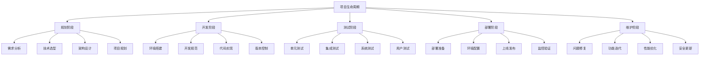

# 项目开发流程

## 🎯 学习目标
- 掌握规范的PHP项目开发流程
- 建立系统化的项目管理和协作机制
- 学会使用现代开发工具提高效率
- 形成可持续的项目开发最佳实践

## 📚 开发流程框架

### 项目生命周期金字塔


### 开发团队协作体系

| 角色 | 主要职责 | 输入要求 | 输出成果 |
|------|----------|----------|----------|
| **产品经理** | 需求定义、业务分析 | 市场需求、用户反馈 | 需求文档、用户故事 |
| **架构师** | 技术架构、技术选型 | 需求分析、技术限制 | 架构设计、技术方案 |
| **开发工程师** | 代码实现、功能开发 | 技术文档、设计稿 | 功能代码、测试用例 |
| **测试工程师** | 质量保证、缺陷发现 | 功能需求、测试用例 | 测试报告、缺陷列表 |
| **运维工程师** | 环境管理、部署发布 | 应用包、部署方案 | 运行环境、监控报告 |

## 🔧 开发流程管理

### Git工作流模式
```php
<?php
/**
 * Git工作流程配置
 * 基于GitFlow模型的标准开发流程
 */
class GitWorkflow {
    private $projectPath;
    private $branches = [
        'main' => 'production',      // 生产环境
        'develop' => 'staging',      // 测试环境
        'feature/*' => 'development', // 功能开发
        'release/*' => 'pre-release', // 预发布
        'hotfix/*' => 'hotfix'       // 紧急修复
    ];
    
    public function initializeProject($projectPath) {
        $this->projectPath = $projectPath;
        
        // 初始化Git仓库
        $this->executeCommand("git init");
        
        // 创建初始分支结构
        foreach ($this->branches as $branch => $type) {
            if ($branch === 'main' || $branch === 'develop') {
                $this->createInitialBranch($branch);
            }
        }
        
        // 设置分支保护规则
        $this->setupBranchProtection();
    }
    
    public function createFeatureBranch($featureName, $baseBranch = 'develop') {
        // 切换到基础分支
        $this->executeCommand("git checkout $baseBranch");
        $this->executeCommand("git pull origin $baseBranch");
        
        // 创建功能分支
        $featureBranch = "feature/$featureName";
        $this->executeCommand("git checkout -b $featureBranch");
        
        // 推送并设置跟踪
        $this->executeCommand("git push -u origin $featureBranch");
        
        return $featureBranch;
    }
    
    public function mergeToDevelop($featureBranch) {
        // 合并功能到开发分支
        $this->executeCommand("git checkout develop");
        $this->executeCommand("git merge --no-ff $featureBranch");
        $this->executeCommand("git push origin develop");
        
        // 删除功能分支
        $this->executeCommand("git branch -d $featureBranch");
        $this->executeCommand("git push origin --delete $featureBranch");
    }
    
    public function createRelease($version) {
        // 创建发布分支
        $releaseBranch = "release/$version";
        $this->executeCommand("git checkout develop");
        $this->executeCommand("git checkout -b $releaseBranch");
        $this->executeCommand("git push -u origin $releaseBranch");
        
        // 更新版本号
        $this->updateVersionFile($version);
        
        return $releaseBranch;
    }
    
    private function executeCommand($command) {
        $output = [];
        $returnCode = 0;
        exec("cd {$this->projectPath} && $command 2>&1", $output, $returnCode);
        
        if ($returnCode !== 0) {
            throw new Exception("Git命令执行失败: $command\n" . implode("\n", $output));
        }
        
        return implode("\n", $output);
    }
    
    private function updateVersionFile($version) {
        $versionFile = $this->projectPath . '/VERSION';
        file_put_contents($versionFile, $version);
        
        $this->executeCommand("git add VERSION");
        $this->executeCommand("git commit -m 'Bump version to $version'");
        $this->executeCommand("git push origin HEAD");
    }
}

// 使用示例
try {
    $workflow = new GitWorkflow();
    $workflow->initializeProject('/path/to/project');
    
    $featureBranch = $workflow->createFeatureBranch('user-authentication');
    echo "功能分支已创建: $featureBranch\n";
    
} catch (Exception $e) {
    echo "Git工作流错误: " . $e->getMessage() . "\n";
}
```

### Composer项目管理
```php
<?php
/**
 * Composer项目配置管理
 * 自动化的依赖管理和项目配置
 */
class ProjectDependencyManager {
    private $composerFile = 'composer.json';
    private $config = [];
    
    public function __construct($projectPath) {
        $this->composerFile = $projectPath . '/composer.json';
        $this->loadConfiguration();
    }
    
    public function initializeProject($projectName, $description = '') {
        $this->config = [
            'name' => $projectName,
            'description' => $description,
            'type' => 'project',
            'license' => 'MIT',
            'require' => [
                'php' => '>=8.1',
                'ext-pdo' => '*',
                'ext-json' => '*',
            ],
            'autoload' => [
                'psr-4' => [
                    'App\\' => 'src/'
                ]
            ],
            'autoload-dev' => [
                'psr-4' => [
                    'Tests\\' => 'tests/'
                ]
            ],
            'require-dev' => [
                'phpunit/phpunit' => '^10.0'
            ]
        ];
        
        $this->saveConfiguration();
        $this->createBasicStructure();
    }
    
    public function addDependency($package, $version = '*', $isDev = false) {
        $key = $isDev ? 'require-dev' : 'require';
        
        if (!isset($this->config[$key])) {
            $this->config[$key] = [];
        }
        
        $this->config[$key][$package] = $version;
        $this->saveConfiguration();
    }
    
    public function createBasicStructure() {
        $directories = [
            'src',
            'tests',
            'public',
            'config',
            'storage',
            'database/migrations',
            'resources/views'
        ];
        
        foreach ($directories as $dir) {
            if (!is_dir($dir)) {
                mkdir($dir, 0755, true);
            }
        }
        
        // 创建基础文件
        $this->createBasicFiles();
    }
    
    private function createBasicFiles() {
        // index.php
        file_put_contents('public/index.php', '<?php
require_once __DIR__ . "/../vendor/autoload.php";

$app = new App\Application();
$app->run();
');
        
        // .gitignore
        file_put_contents('.gitignore', 'vendor/
.env
storage/logs/
storage/cache/
public/assets/build/
node_modules/
');
        
        // README.md
        file_put_contents('README.md', "# {$this->config['name']}\n\n{$this->config['description']}");
    }
    
    private function loadConfiguration() {
        if (file_exists($this->composerFile)) {
            $this->config = json_decode(file_get_contents($this->composerFile), true);
        }
    }
    
    private function saveConfiguration() {
        file_put_contents(
            $this->composerFile,
            json_encode($this->config, JSON_PRETTY_PRINT | JSON_UNESCAPED_SLASHES)
        );
    }
}
```

## 🏗️ 开发环境配置

### Docker环境配置
```yaml
# docker-compose.yml
version: '3.8'

services:
  app:
    build:
      context: .
      dockerfile: Dockerfile
    container_name: php_app
    volumes:
      - .:/var/www/html
    ports:
      - "8000:80"
    environment:
      - APP_ENV=local
      - DB_HOST=mysql
    depends_on:
      - mysql
      - redis

  mysql:
    image: mysql:8.0
    container_name: mysql_db
    environment:
      MYSQL_ROOT_PASSWORD: rootpass
      MYSQL_DATABASE: app_db
      MYSQL_USER: app_user
      MYSQL_PASSWORD: apppass
    ports:
      - "3306:3306"
    volumes:
      - mysql_data:/var/lib/mysql

  redis:
    image: redis:7-alpine
    container_name: redis_cache
    ports:
      - "6379:6379"

volumes:
  mysql_data:
```

### PHP-FPM配置优化
```php
<?php
/**
 * PHP-FPM配置管理器
 * 针对不同环境优化PHP-FPM配置
 */
class PHPFPMConfigManager {
    private $configPath = '/etc/php/8.1/fpm/';
    private $environments = [
        'development' => [
            'pm.max_children' => 10,
            'pm.start_servers' => 2,
            'pm.min_spare_servers' => 1,
            'pm.max_spare_servers' => 3,
            'pm.max_requests' => 1000
        ],
        'staging' => [
            'pm.max_children' => 20,
            'pm.start_servers' => 5,
            'pm.min_spare_servers' => 3,
            'pm.max_spare_servers' => 8,
            'pm.max_requests' => 2000
        ],
        'production' => [
            'pm.max_children' => 50,
            'pm.start_servers' => 10,
            'pm.min_spare_servers' => 5,
            'pm.max_spare_servers' => 15,
            'pm.max_requests' => 5000
        ]
    ];
    
    public function optimizeForEnvironment($environment) {
        if (!isset($this->environments[$environment])) {
            throw new InvalidArgumentException("不支持的 환경: $environment");
        }
        
        $config = $this->environments[$environment];
        $this->updatePHPFPMConfig($config);
        $this->optimizePHPConfig($environment);
    }
    
    private function updatePHPFPMConfig($config) {
        $poolFile = $this->configPath . 'pool.d/www.conf';
        $content = file_get_contents($poolFile);
        
        foreach ($config as $key => $value) {
            $content = preg_replace("/^;$key\s*=.*$/m", "$key = $value", $content);
        }
        
        file_put_contents($poolFile, $content);
    }
    
    private function optimizePHPConfig($environment) {
        $phpConfigs = [
            'development' => [
                'error_reporting' => 'E_ALL',
                'display_errors' => 'On',
                'log_errors' => 'On',
                'memory_limit' => '256M',
                'max_execution_time' => '300'
            ],
            'staging' => [
                'error_reporting' => 'E_ALL & ~E_DEPRECATED & ~E_STRICT',
                'display_errors' => 'Off',
                'log_errors' => 'On',
                'memory_limit' => '512M',
                'max_execution_time' => '180'
            ],
            'production' => [
                'error_reporting' => 'E_ALL & ~E_DEPRECATED & ~E_STRICT & ~E_NOTICE',
                'display_errors' => 'Off',
                'log_errors' => 'On',
                'memory_limit' => '1024M',
                'max_execution_time' => '120',
                'opcache.enable' => 'On',
                'opcache.memory_consumption' => '256'
            ]
        ];
        
        $iniFile = 'php.ini';
        $content = file_get_contents($iniFile);
        
        foreach ($phpConfigs[$environment] as $key => $value) {
            $content = preg_replace("/^;$key\s*=.*$/m", "$key = \"$value\"", $content);
            if (!preg_match("/^$key\s*=/m", $content)) {
                $content .= "\n$key = \"$value\"\n";
            }
        }
        
        file_put_contents($iniFile, $content);
    }
}
```

## 🧪 测试集成流程

### 自动化测试配置
```php
<?php
/**
 * PHPUnit测试配置管理器
 * 自动化的测试环境配置和测试运行
 */
class TestManager {
    private $configFile = 'phpunit.xml';
    private $testSuites = [];
    
    public function initializeTestConfiguration() {
        $config = [
            'backupGlobals' => false,
            'backupStaticAttributes' => false,
            'bootstrap' => 'vendor/autoload.php',
            'colors' => true,
            'testdox' => true,
            'testSuites' => [
                'unit' => [
                    'directory' => 'tests/Unit',
                    'pattern' => '*Test.php'
                ],
                'integration' => [
                    'directory' => 'tests/Integration',
                    'pattern' => '*Test.php'
                ],
                'feature' => [
                    'directory' => 'tests/Feature',
                    'pattern' => '*Test.php'
                ]
            ]
        ];
        
        $this->saveConfiguration($config);
        $this->createTestStructure();
    }
    
    public function createTestTemplate($testType, $className) {
        $template = $this->getTestTemplate($testType, $className);
        $filename = "tests/{$testType}/{$className}Test.php";
        
        file_put_contents($filename, $template);
        echo "测试模板已创建: $filename\n";
    }
    
    private function getTestTemplate($testType, $className) {
        $namespace = ucfirst($testType);
        
        return "<?php

namespace Tests\\{$namespace};

use PHPUnit\\Framework\\TestCase;
use " . str_replace('Test', '', $className) . ";

class {$className}Test extends TestCase
{
    protected \$subject;

    protected function setUp(): void
    {
        parent::setUp();
        \$this->subject = new {$className}();
    }

    /** @test */
    public function it_can_create_instance()
    {
        \$this->assertInstanceOf({$className}::class, \$this->subject);
    }

    /** @test */
    public function it_can_test_specific_functionality()
    {
        // Arrange
        \$expected = 'expected result';
        
        // Act
        \$actual = \$this->subject->someMethod();
        
        // Assert
        \$this->assertEquals(\$expected, \$actual);
    }
}
";
    }
    
    private function createTestStructure() {
        $testDirectories = ['Unit', 'Integration', 'Feature'];
        
        foreach ($testDirectories as $dir) {
            $path = "tests/$dir";
            if (!is_dir($path)) {
                mkdir($path, 0755, true);
                file_put_contents("$path/.gitkeep", '');
            }
        }
    }
    
    private function saveConfiguration($config) {
        $xml = new SimpleXMLElement('<?xml version="1.0"?><phpunit/>');
        
        foreach ($config as $key => $value) {
            if ($key === 'testSuites') {
                $suites = $xml->addChild('testsuite');
                foreach ($value as $suiteName => $suiteConfig) {
                    $suite = $suites->addChild($suiteName);
                    $suite->addAttribute('name', $suiteName);
                    $suite->addAttribute('directory', $suiteConfig['directory']);
                }
            } else {
                $xml->addAttribute($key, $value);
            }
        }
        
        $dom = new DOMDocument('1.0');
        $dom->formatOutput = true;
        $dom->loadXML($xml->asXML());
        file_put_contents($this->configFile, $dom->saveXML());
    }
}
```

## 🚀 部署流程管理

### CI/CD流水线配置
```php
<?php
/**
 * GitHub Actions CI/CD配置生成器
 * 自动化的持续集成和部署配置
 */
class CICDManager {
    private $config = [];
    
    public function createGitHubActionsWorkflow($projectType = 'laravel') {
        $workflow = [
            'name' => 'CI/CD Pipeline',
            'on' => [
                'push' => ['branches' => ['main', 'develop']],
                'pull_request' => ['branches' => ['main', 'develop']]
            ],
            'jobs' => [
                'test' => [
                    'name' => 'PHP Tests',
                    'runs-on' => 'ubuntu-latest',
                    'steps' => $this->getTestSteps()
                ],
                'deploy-staging' => [
                    'name' => 'Deploy to Staging',
                    'runs-on' => 'ubuntu-latest',
                    'needs' => 'test',
                    'if' => "github.ref == 'refs/heads/develop'",
                    'steps' => $this->getDeploySteps('staging')
                ],
                'deploy-production' => [
                    'name' => 'Deploy to Production',
                    'runs-on' => 'ubuntu-latest',
                    'needs' => 'test',
                    'if' => "github.ref == 'refs/heads/main'",
                    'steps' => $this->getDeploySteps('production')
                ]
            ]
        ];
        
        $this->saveWorkflowConfig($workflow);
    }
    
    private function getTestSteps() {
        return [
            ['name' => 'Checkout code', 'uses' => 'actions/checkout@v3'],
            ['name' => 'Setup PHP', 'uses' => 'shivammathur/setup-php@v2', 'with' => ['php-version' => '8.1']],
            ['name' => 'Install dependencies', 'run' => 'composer install --prefer-dist --no-progress'],
            ['name' => 'Run tests', 'run' => 'vendor/bin/phpunit'],
            ['name' => 'Generate coverage report', 'run' => 'vendor/bin/phpunit --coverage-clover coverage.xml'],
            ['name' => 'Upload coverage', 'uses' => 'codecov/codecov-action@v3', 'with' => ['file' => './coverage.xml']]
        ];
    }
    
    private function getDeploySteps($environment) {
        return [
            ['name' => 'Checkout code', 'uses' => 'actions/checkout@v3'],
            ['name' => 'Setup PHP', 'uses' => 'shivammathur/setup-php@v2', 'with' => ['php-version' => '8.1']],
            ['name' => 'Install dependencies', 'run' => 'composer install --no-dev --optimize-autoloader'],
            ['name' => 'Build assets', 'run' => 'npm ci && npm run build'],
            ['name' => 'Deploy to ' . $environment, 'env' => ['HOST' => $_ENV["DEPLOY_HOST_{$environment}"], 'USER' => $_ENV["DEPLOY_USER"], 'KEY' => $_ENV["SSH_KEY"]], 'run' => $this->getDeployScript()]
        ];
    }
    
    private function getDeployScript() {
        return '
        echo "$KEY" > private_key
        chmod 600 private_key
        ssh -i private_key -o StrictHostKeyChecking=no $USER@$HOST "
            cd /var/www/app &&
            git pull origin main &&
            composer install --no-dev --optimize-autoloader &&
            php artisan migrate --force &&
            php artisan config:cache &&
            php artisan route:cache &&
            php artisan view:cache &&
            supervisorctl restart php-fpm
        "
        rm -f private_key';
    }
    
    private function saveWorkflowConfig($workflow) {
        $workflowDir = '.github/workflows';
        if (!is_dir($workflowDir)) {
            mkdir($workflowDir, 0755, true);
        }
        
        file_put_contents(
            "$workflowDir/ci-cd.yml",
            yaml_dump($workflow, 2, 4)
        );
    }
}
```

## 🎓 开发流程最佳实践

### 费曼学习法在项目管理中的应用
1. **需求简化**: 将复杂需求简化为可理解的小块
2. **流程解释**: 能够清楚解释每个开发阶段的目的
3. **知识传递**: 建立有效的知识传递机制
4. **持续改进**: 基于团队反馈优化开发流程

### 刻意练习在开发中的运用
1. **代码规范**: 通过练习建立编码习惯
2. **工具熟练**: 熟练掌握开发工具的使用
3. **流程熟练**: 通过重复练习优化开发流程
4. **问题解决**: 建立系统化的问题解决模式

## 🔗 相关链接
- [[99-实践项目/中级项目/04-项目架构设计|项目架构设计]]
- [[04-高级应用层/部署运维/02-CI_CD流水线|CI/CD流水线]]
- [[04-高级应用层/框架开发/01-Laravel框架|Laravel框架]]
- [[98-学习工具/02-调试技巧集|调试技巧集]]
- [[98-学习工具/03-性能测试工具|性能测试工具]]
