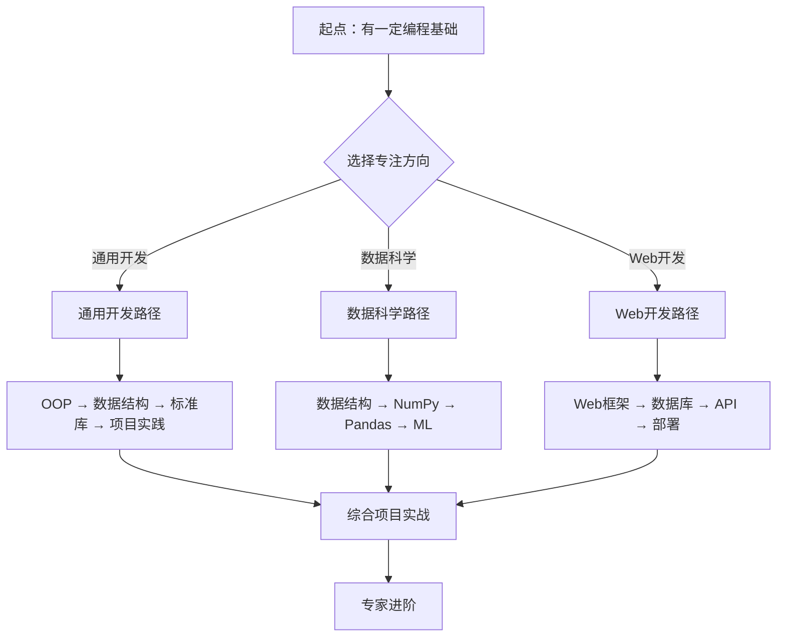
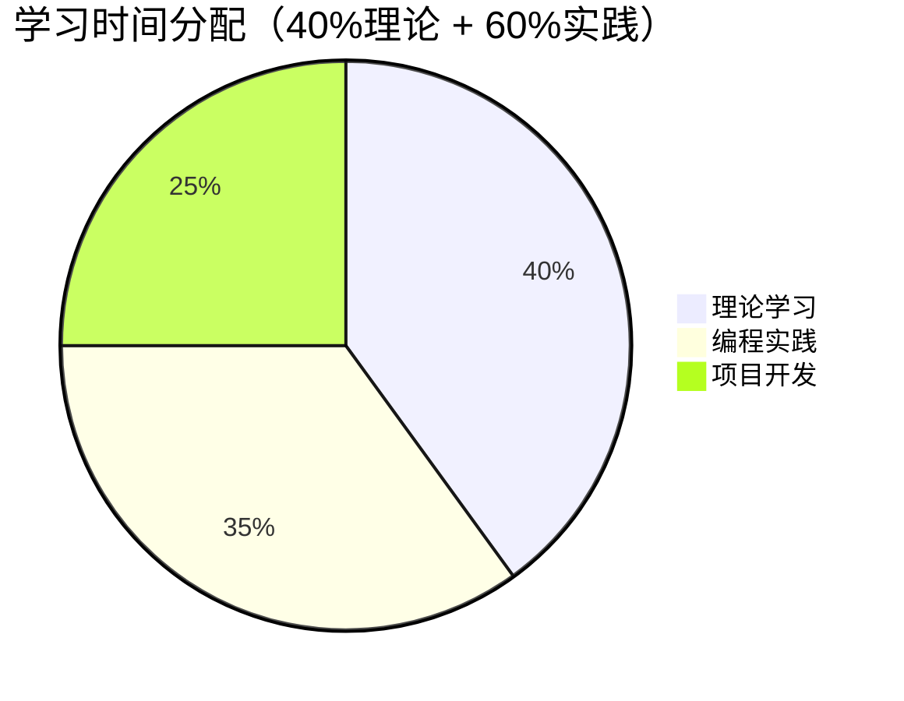

# 🎯 Python学习路径规划

## 🎓 个人学习档案

### 📋 基础信息
- **学习风格**：[[🗺️ Python学习全景图]] - 结构化、理性导向
- **预期时长**：12-16周（每周10-15小时）
- **学习目标**：掌握Python核心概念，能够独立开发中小型项目

### 🗺️ 路径选择

基于您的INTJ学习特点，推荐以下学习路径：



## 📚 三条核心路径

### 🛠️ 路径一：通用Python开发

#### 第一阶段：基础构建（3-4周）
- Week 1-2：[[1.1 Python语言哲学]] + [[1.5 语法基础框架]]
- Week 3-4：[[1.6 数据类型深度解析]] + [[1.7 控制流与代码组织]]

#### 第二阶段：核心概念（4-5周）
- Week 5-6：[[2.1 面向对象编程精要]] + [[2.1.1 类与对象本质]]
- Week 7-8：[[2.2 数据结构与算法]] + [[2.2.1 内置数据结构的底层实现]]
- Week 9：[[2.3 函数式编程]] 基础

#### 第三阶段：深度理解（2-3周）
- Week 10：[[3.1 内存管理深度解析]] + [[3.2 并发与异步编程]]
- Week 11-11.5：[[3.3 错误处理与测试]]

#### 第四阶段：应用实践（4-5周）
- Week 12-14：[[4.1 标准库深度应用]] + [[4.2 生态系统框架]]
- Week 15-16：[[4.3 架构设计与工程实践]] + 项目实战

### 📊 路径二：数据科学与机器学习

#### 第一阶段<｜Assistant｜>### 🚀 路径三：Web开发与API

#### 高级阶段（4-6周）
- [[5.1 Web API开发]] + [[5.2 数据分析与可视化]]
- [[5.4 自动化运维脚本]] + [[5.5 性能调优与监控]]

## 📅 学习计划制定

### 🗓️ 建议学习节奏

| 学习阶段 | 每周投入 | 关键里程碑 | 评估方式 |
|----------|----------|------------|-----------|
| **基础期** | 8-12小时 | 完成[[1.1 Python语言哲学]]到[[1.8 函数设计原则]] | 代码review |
| **成长期** | 10-15小时 | 掌握[[2.1 面向对象编程精要]]及相关 | 项目实践 |
| **成熟期** | 12-20小时 | 深度理解[[3.1 内存管理深度解析]] | 技术分享 |

### ⏰ 时间分配建议



## 🎯 目标设定与检验

### 📊 里程碑检验点

#### 🟢 基础里程碑
- [ ] 能够解释Python Zen的原则
- [ ] 独立写出基本的类和方法
- [ ] 掌握常用数据结构的时间复杂度
- [ ] 能够选择合适的数据类型

#### 🟡 成长里程碑  
- [ ] 理解和运用装饰器模式
- [ ] 能够优化内存使用
- [ ] 熟练使用async/await
- [ ] 设计完整的错误处理机制

#### 🔴 高级里程碑
- [ ] 架构设计能力
- [ ] 性能调优经验
- [ ] 团队协作能力
- [ ] 技术领导力

## 🔄 学习反馈机制

### 📝 学习日志模板

```markdown
## 学习日志 {{date}}
### 🎯 今日目标
- [ ] 目标1
- [ ] 目标2

### 📚 学习内容
[[相关知识点]]

### 💡 关键收获
1. 核心概念理解
2. 实践技巧掌握

### 🤔 待解决问题
- 问题1及其解决方向
- 问题2及其研究计划

### 📈 明日计划
[[具体目标]]
```

## 🎨 个性化调整

### 🧠 基于INTJ特点的建议

1. **结构化学习**：每次学习前先看[[🗺️ Python学习全景图]]
2. **深度优先**：选择一个方向深入，避免蜻蜓点水
3. **理论实践并重**：每学一个概念立即编写代码验证
4. **自我挑战**：定期设定有挑战性的项目目标

### ⚡ 高效学习技巧

- 📖 **费曼技巧**：每学完一个概念，向"12岁小孩"解释
- 🏃‍♂️ **刻意练习**：针对薄弱环节反复练习
- 🔗 **联想记忆**：将新概念与已有知识建立联系
- 📊 **进度可视化**：使用[[📊 学习进度仪表板]]追踪进度

---
*记得定时更新个人学习档案，调整学习计划以适应实际情况*
