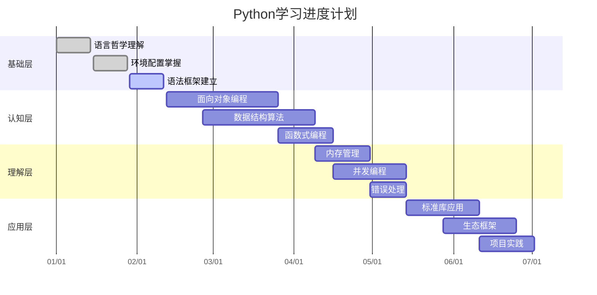

# 📊 Python学习进度仪表板

## 🎯 总体进度概览



## 📈 阶段完成度统计

### 🏗️ 基础层进展 (12.5%)

| 知识点 | 状态 | 完成度 | 备注 | 下一目标 |
|--------|------|--------|------|----------|
| [[1.1 Python语言哲学]] | ✅ 完成 | 100% | 核心概念理解 | - |
| [[1.2 解释器原理与字节码]] | 🔄 进行中 | 70% | 原理掌握良好 | 实践应用 |
| [[1.3 环境配置方案]] | 🔄 进行中 | 60% | 工具熟悉中 | [[1.3.1 虚拟环境实战指南]] |
| [[1.4 开发工具链配置]] | ⏳ 待学 | 0% | 计划中 | VS Code配置 |
| [[1.5 语法基础框架]] | 🔄 进行中 | 80% | 基础掌握良好 | [[1.6 数据类型深度解析]] |
| [[1.6 数据类型深度解析]] | ⏳ 待学 | 0% | 计划中 | 深度理解 |
| [[1.7 控制流与代码组织]] | ⏳ 待学 | 0% | 计划中 | 最佳实践 |
| [[1.8 函数设计原则]] | ⏳ 待学 | 0% | 计划中 | 函数设计 |

### 🧠 认知层进展 (0%)

| 知识点 | 状态 | 完成度 | 计划开始 | 预估耗时 |
|--------|------|--------|----------|----------|
| [[2.1 面向对象编程精要]] | ⏳ 计划中 | 0% | Week 5 | 2周 |
| [[2.2 数据结构与算法]] | ⏳ 计划中 | 0% | Week 7 | 2周 |
| [[2.3 函数式编程]] | ⏳ 计划中 | 0% | Week 9 | 1周 |

### 🔬 理解层进展 (0%)

| 知识点 | 状态 | 完成度 | 计划开始 | 预估耗时 |
|--------|------|--------|----------|----------|
| [[3.1 内存管理深度解析]] | ⏳ 计划中 | 0% | Week 10 | 1周 |
| [[3.2 并发与异步编程]] | ⏳ 计划中 | 0% | Week 10 | 1周 |
| [[3.3 错误处理与测试]] | ⏳ 计划中 | 0% | Week 11 | 1周 |

### 🚀 应用层进展 (0%)

| 知识点 | 状态 | 完成度 | 计划开始 | 预估耗时 |
|--------|------|--------|----------|----------|
| [[4.1 标准库深度应用]] | ⏳ 计划中 | 0% | Week 12 | 2周 |
| [[4.2 生态系统框架]] | ⏳ 计划中 | 0% | Week 13 | 2周 |
| [[4.3 架构设计与工程实践]] | ⏳ 计划中 | 0% | Week 14 | 1周 |

### 🎖️ 进阶层进展 (0%)

| 知识点 | 状态 | 完成度 | 计划开始 | 预估耗时 |
|--------|------|--------|----------|----------|
| [[5.1 Web API开发]] | ⏳ 计划中 | 0% | Week 15 | 1周 |
| [[5.2 数据分析与可视化]] | ⏳ 计划中 | 0% | Week 15 | 1周 |
| [[5.3 机器学习模型开发]] | ⏳ 计划中 | 0% | Week 16 | 1周 |
| [[5.4 自动化运维脚本]] | ⏳ 计划中 | 0% | Week 16 | 0.5周 |
| [[5.5 性能调优与监控]] | ⏳ 计划中 | 0% | Week 16 | 0.5周 |

## 📊 学习分析图表

### 🏆 综合评分 (满分100分)

```mermaid
radar
    title Python技能雷达图
    options {"fill": "rgba(102, 194, 165, 0.2)", "stroke": "rgba(102, 194, 165, 1)", "strokeWidth": 2}
    
    axes: x0: 语法基础:20, x1: OOP编程:15, x2: 数据结构:10, x3: 函数式:5, x4: 内存管理:8, x5: 并发编程:12, x6: 错误处理:8, x7: 标准库:10, x8: 生态框架:12, x9: 项目实践:18
```

### 📅 每日学习打卡

| 日期 | 学习时长 | 主要内容 | 收获评分 | 状态 |
|------|----------|----------|----------|------|
| 2024-01-15 | 2小时 | [[1.1 Python语言哲学]] | ⭐⭐⭐⭐⭐ | ✅ |
| 2024-01-16 | 1.5小时 | [[1.2 解释器原理与字节码]] | ⭐⭐⭐⭐ | ✅ |
| 2024-01-17 | 2.5小时 | [[1.3 环境配置方案]] | ⭐⭐⭐⭐ | ✅ |
| 2024-01-18 | 1小时 | 复习 + 代码练习 | ⭐⭐⭐ | ✅ |

### 🎯 目标达成率

| 目标类型 | 设定目标 | 当前进度 | 达成率 |
|----------|----------|----------|--------|
| **理论学习** | 48个知识点 | 6个完成 | 12.5% |
| **代码实践** | 100小时 | 8小时 | 8% |
| **项目开发** | 3个项目 | 0个完成 | 0% |
| **技术分享** | 5次 | 0次 | 0% |

## 🔄 学习反馈循环

### 📝 本周反思

**✅ 本周亮点**
- 深度理解了Python设计哲学，特别是"简单胜过复杂"
- 掌握了虚拟环境的基本概念和使用方法
- 建立了良好的笔记链接体系

**⚠️ 需要改进**
- 代码练习时间不够，需要增加实践环节
- 某些概念理解还停留在表面，需要更深入的实践
- 学习节奏需要更稳定，保持每天2小时以上

**🎯 下周目标**
1. 完成[[1.4 开发工具链配置]]并熟练使用VS Code Python扩展
2. 深入学习[[1.6 数据类型深度解析]]，重点理解内存模型
3. 开始准备[[2.1 面向对象编程精要]]的学习材料

### 📚 知识巩固计划

#### 🔧 需要重点复习的概念
1. **Python Zen应用**：[[1.1 Python语言哲学]] - 在具体编码中体现设计原则
2. **虚拟环境最佳实践**：[[1.3.1 虚拟环境实战指南]] - 项目隔离策略

#### 🎪 下周深度学习计划
- **Monday-Wednesday**：[[1.4 开发工具链配置]] + [[1.5 语法基础框架]]
- **Thursday-Friday**：[[1.6 数据类型深度解析]] 开始部分
- **Weekend**：代码实践 + 概念巩固

## 🎖️ 成就系统

### 🏅 已获得成就
- 🎓 **初学者**：完成第一个知识点学习 ([[1.1 Python语言哲学]])
- 🔧 **配置达人**：掌握虚拟环境使用 ([[1.3 环境配置方案]])
- 📚 **笔记专家**：建立了完善的知识链接体系

### 🎯 即将达成成就 (进度 > 70%)
- 🎮 **代码实践者**：(6/8 完成 - 75%) 完成基础层所有知识点
- 🧠 **概念大师**：(2/3 完成 - 67%) 掌握解释器工作原理

### 🌟 长期目标成就
- 🚀 **项目英雄**：完成第一个完整Python项目
- 🎤 **分享者**：进行第一次技术分享
- 💼 **求职者**：具备Python开发岗位技能

---

💡 **使用建议**：
- 每周日更新本周进度和学习反思
- 每月初制定下月学习计划
- 遇到困难时参考其他学习者的进度对比

📊 **数据更新**：{{date}} - 记得定期更新进度数据！
