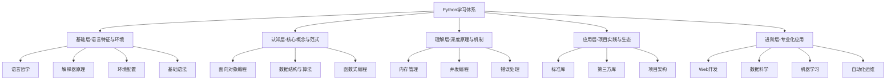
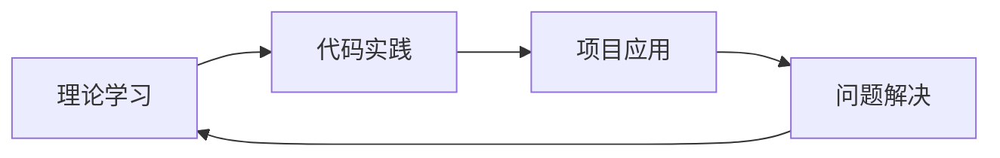

# 🗺️ Python学习全景图

## 📖 理念导航

> **核心理念**：Python是一门**优雅、清晰、可靠**的编程语言，其设计哲学体现在代码之美和实用性的完美平衡。

## 🏗️ 知识架构全景

## 🎯 学习路径指引

### 📈 渐进式学习模型

| 阶段 | 重点内容 | 学习目标 | 持续时间 |
|------|----------|----------|----------|
| **认识** | [[1.1 Python语言哲学]] | 理解Python设计理念 | 1-2周 |
| **理解** | [[2.1 面向对象编程精要]] | 掌握核心编程范式 | 3-4周 |
| **应用** | [[4.1 标准库深度应用]] | 熟练运用生态工具 | 2-3周 |
| **精通** | [[5.1 Web API开发]] | 专业化项目实践 | 4-6周 |

## 🔗 关键知识点连接

### 🧠 核心概念网络
- **语言哲学** → [[1.1 Python语言哲学]] → [[1.5 语法基础框架]]
- **OOP核心** → [[2.1 面向对象编程精要]] → [[3.1 内存管理深度解析]]
- **数据结构** → [[2.2 数据结构与算法]] → [[3.2 并发与异步编程]]
- **函数式** → [[2.3 函数式编程]] → [[4.2 生态系统框架]]

### 🔄 实践循环

## 📊 学习进度追踪

### ✅ 知识地图完成度
- [ ] **基础层** - 语言特征与环境 (0/8)
- [ ] **认知层** - 核心概念与范式 (0/13)
- [ ] **理解层** - 深度原理与机制 (0/13)
- [ ] **应用层** - 项目实践与生态 (0/13)
- [ ] **进阶层** - 专业化应用 (0/5)

### 🎖️ 技能认证路径
1. **基础认证**：完成基础层 + 认知层
2. **中级认证**：完成理解层 + 应用层
3. **高级认证**：完成进阶层 + 项目实战

## 🚀 快速导航链接

### 📚 按需求导航
- 💼 **找工作** → [[💼 Python职场进阶指南]]
- 🔧 **环境配置** → [[1.3 环境配置方案]]
- 🧮 **数据结构** → [[2.2 数据结构与算法]]
- ⚡ **性能优化** → [[3.1 内存管理深度解析]]

### 🔍 按难度导航
- 🟢 **入门级** → [[1.1 Python语言哲学]]
- 🟡 **进阶级** → [[2.1 面向对象编程精要]]
- 🔴 **专家级** → [[5.5 性能调优与监控]]

---
*持续更新中... 最后修改：{{date}}*
