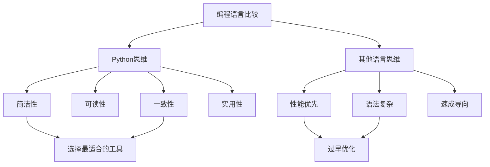
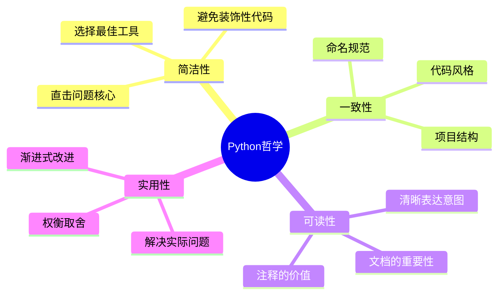

# 1.1 Python语言哲学

## 🎯 核心理念

Python的设计哲学集中体现在一个关键概念：**"简单胜过复杂"**。这不是肤浅的简化，而是一种深度思考后的优雅表达。

### 📜 The Zen of Python

```python
import this
```

**核心原则解读**：

| 原则 | 解释 | 实践指导 |
|------|------|----------|
| **简单胜过复杂** | 选择最直接的解决方案 | 避免过度设计和抽象 |
| **复杂胜过杂乱** | 妥善组织复杂性 | 良好的代码结构 |
| **可读性很重要** | 代码是写给人类读的 | 有意义的命名 |
| **拒绝引诱** | 避免诱惑性的复杂性 | 保持代码简洁 |

## 🧠 深度理解：思维模型

### 🔍 Python思维vs其他语言



## 🛠️ 实践应用：从哲学到代码

### ✨ 好的设计示例

**❌ 复杂的写法：**
```python
# 过度复杂的错误处理
def process_data(data):
    try:
        if data is not None:
            if isinstance(data, list):
                if len(data) > 0:
                    for item in data:
                        if item is not None:
                            result = transform(item)
                            if result is not None:
                                output.append(result)
            return output
    except Exception as e:
        handle_error(e)
```

**✅ 简洁的写法：**
```python
def process_data(data):
    """处理数据列表，过滤并转换"""
    return [transform(item) for item in data if item is not None]
```

## 🎨 设计原则的实际应用

### 1. 📖 可读性原则

```python
# ❌ 难以理解
lst = [x for x in range(10) if x % 2 == 0]

# ✅ 清晰的意图
even_numbers = [num for num in range(10) if num % 2 == 0]
```

### 2. 🔧 一致性原则

```python
# ✅ 一致的命名风格
class UserManager:
    def create_user(self, username: str) -> User:
        pass
    
    def delete_user(self, user_id):
        pass
    
    def get_user_by_email(self, email: str) -> User:
        pass
```

### 3. 🎯 实用性原则

```python
# ✅ 实用的设计：只暴露需要的接口
from collections import namedtuple

# 简单的数据结构
Point = namedtuple('Point', ['x', 'y'])

# 使用示例
point = Point(1, 2)
print(point.x, point.y)  # 简单直观
```

## 🔮 思维模型转换

### 💡 INTJ学习者的独特优势

作为INTJ，您天然具备系统化思考的能力，可以这样理解Python哲学：



## 🧪 刻意练习：哲学应用

### 📝 练习1：代码重构

**任务**：将以下代码重构为更符合Python哲学的版本

```python
# 需要重构的代码
def calculateBMI(height, weight):
    bmi = weight / (height * height)
    if bmi < 18.5:
        category = "underweight"
    elif bmi < 25:
        category = "normal"
    elif bmi < 30:
        category = "overweight"
    else:
        category = "obese"
    return bmi, category
```

**指导思路**：
1. 应用"简单胜过复杂"原则
2. 提高可读性
3. 包含类型提示

### 🎯 练习2：设计对比

**任务**：设计两个版本的文件处理器：
- 复杂抽象版本
- 简洁实用版本

**分析方法**：从Python哲学角度分析哪个版本更优秀。

## 🔗 知识连接

- **下一步学习**：[[1.5 语法基础框架]] - 将哲学转化为具体语法
- **深入理解**：[[2.1.3 设计模式在Python中的应用]] - 哲学在OOP中的应用
- **实战应用**：[[4.3.3 代码质量保证体系]] - 哲学指导代码规范

## 💡 费曼检验

**如果你要向12岁的孩子解释Python为什么优秀，你会怎么讲？**

核心答案：Python就像一个好的玩具，简单易懂却能做很多有用的事情。它不让你浪费时间在复杂的地方上，而是让你专注于真正要解决的问题。

---

📚 **扩展阅读**：
- [[⚡ 快速概念辞典]] - Python核心术语
- [[🗺️ Python学习全景图]] - 整体知识框架

🎯 **下个目标**：理解[[1.2 解释器原理与字节码]]中Python底层的优雅实现
