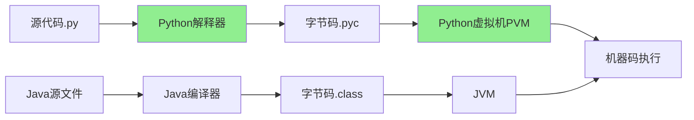
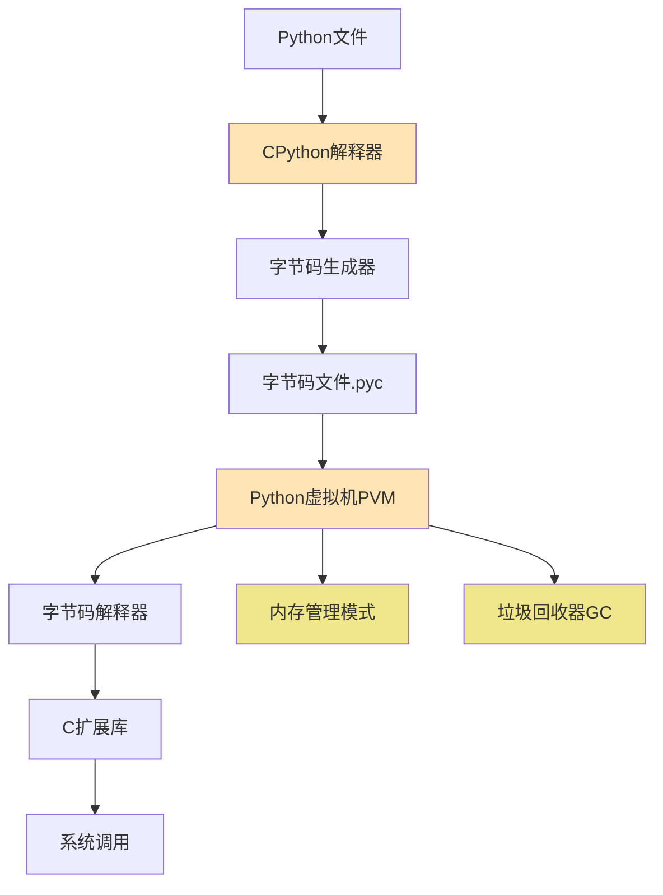

# 1.2 解释器原理与字节码

## 🎯 核心理念

Python的"解释型语言"特性是其哲学的基础体现。理解解释器的工作原理，有助于深入掌握Python的运行机制。

### 🔍 解释器vs编译器



## 🧠 深度理解：Python解释过程

### 📊 四阶段执行流程

| 阶段 | 输入 | 输出 | 工具 | 特点 |
|------|------|------|------|------|
| **Lexical Analysis** | `.py源码` | Token流 | Tokenizer | 识别关键字、操作符 |
| **Parsing** | Token流 | AST | Parser | 生成抽象语法树 |
| **Compilation** | AST | 字节码 | Compiler | 生成`.pyc`文件 |
| **Execution** | 字节码 | 执行结果 | PVM | 解释执行 |

### 🔬 AST示例

```python
# 源码
def add(a, b):
    return a + b

# AST结构（简化）
Module
└── FunctionDef
    ├── name: 'add'
    ├── args: [a, b]
    └── body: [Return(BinOp(Add, Name(a), Name(b)))]
```

## 🛠️ 实践应用：字节码分析

### 💡 查看字节码

```python
import dis

# 简单函数
def multiply(x, y):
    return x * y

# 查看字节码
dis.dis(multiply)

# 输出：
#  2           104 LOAD_FAST                0 (x)
#              106 LOAD_FAST                1 (y)  
#              108 BINARY_MULTIPLY
#              110 RETURN_VALUE
```

### 📋 常见字节码指令

| 指令 | 功能 | 示例 | 说明 |
|------|------|------|------|
| `LOAD_FAST` | 加载局部变量 | `LOAD_FAST 0 (x)` | 加载第0个局部变量x |
| `STORE_FAST` | 存储局部变量 | `STORE_FAST 1 (result)` | 存储到第1个局部变量 |
| `CALL_FUNCTION` | 函数调用 | `CALL_FUNCTION 1` | 调用1个参数的函数 |
| `BINARY_ADD` | 加法运算 | `BINARY_ADD` | 执行加法操作 |

### 🎨 性能优化启发

```python
# ❌ 低效：每次都重复计算
def inefficient_squares(numbers):
    return [number ** 2 for number in numbers]

# ✅ 高效：直接使用内置函数
def efficient_squares(numbers):
    return list(map(lambda x: x ** 2, numbers))

# 更高效：使用内置操作和C扩展
def most_efficient_squares(numbers):
    import numpy as np
    return (np.array(numbers) ** 2).tolist()
```

## 🔮 思维模型：执行环境

### 🏗️ Python执行环境架构



### 🎯 PVM核心组件

| 组件 | 功能 | 重要性 | 学习重点 |
|------|------|--------|----------|
| **字节码解释器** | 逐条执行指令 | ⭐⭐⭐ | 性能优化 |
| **内存管理器** | 对象分配回收 | ⭐⭐⭐⭐⭐ | [[3.1 内存管理深度解析]] |
| **垃圾回收器** | 自动内存清理 | ⭐⭐⭐⭐ | GC算法理解 |
| **内置类型** | 基本数据类型 | ⭐⭐⭐ | [[1.6 数据类型深度解析]] |

## ✨ 关键洞察：为什么要理解字节码？

### 💡 对INTJ学习者的价值

1. **系统性理解**：从底层理解Python的执行机制
2. **性能洞察**：知道哪些操作更高效
3. **调试能力**：理解代码实际是如何执行的
4. **优化方向**：有针对性地优化代码性能

### 🔍 实际应用场景

```python
# 场景1：理解列表推导vs循环的性能差异
import timeit

# 方法1：循环
def loop_approach():
    result = []
    for i in range(1000):
        result.append(i * 2)
    return result

# 方法2：列表推导
def comprehension_approach():
    return [i * 2 for i in range(1000)]

# 性能对比
print(timeit.timeit(loop_approach))      # ~0.08秒
print(timeit.timeit(comprehension_approach))  # ~0.04秒
```

## 🧪 刻意练习：字节码分析

### 📝 练习1：字节码阅读

**任务**：分析以下函数的字节码，说明执行流程

```python
def fibonacci(n):
    if n <= 1:
        return n
    return fibonacci(n-1) + fibonacci(n-2)
```

**分析框架**：
1. 函数入口和参数加载
2. 条件判断字节码
3. 递归调用处理
4. 返回值处理

### 🎯 练习2：性能对比分析

**任务**：对比三种不同的循环写法在字节码层面的差异

```python
# 方式1：传统for循环
for item in range(100):
    print(item)

# 方式2：while循环  
count = 0
while count < 100:
    print(count)
    count += 1

# 方式3：enumerate循环
for i, _ in enumerate(range(100)):
    print(i)
```

### 🔬 练习3：编译器魔法

**任务**：研究Python是如何编译生成器的

```python
def simple_generator():
    yield 1
    yield 2
    yield 3
```

**观察重点**：
- `yield`语句对应的字节码指令
- 生成器对象的创建过程
- 迭代器协议的实现

## 🔗 知识连接

- **基础理解**：[[1.1 Python语言哲学]] - 解释器是哲学的体现
- **深度应用**：[[3.1 内存管理深度解析]] - PVM的内存管理机制
- **性能优化**：[[5.5 性能调优与监控]] - 基于字节码的优化实践
- **数据类型**：[[1.6 数据类型深度解析]] - 内置类型在PVM中的实现

## 💡 费曼检验

**向朋友解释：为什么Python是解释型语言，但这不妨碍它有很高的执行效率？**

核心要点：
1. **混合架构**：Python编译为字节码，虚拟机解释执行
2. **C扩展**：关键操作调用C语言库
3. **JIT优化**：PyPy等实现有即时编译优化
4. **预编译缓存**：`.pyc`文件避免重复编译

---

📚 **扩展阅读**：
- [[⚡ 快速概念辞典]] - "解释器"、"字节码"等术语
- [[1.5 语法基础框架]] - 语法如何转化为字节码

🎯 **下个目标**：配置自己的[[1.3 环境配置方案]]开发环境
