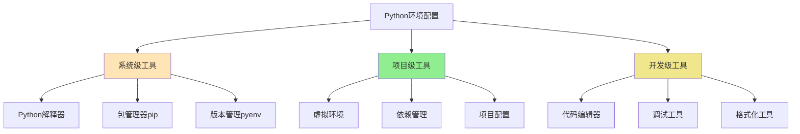

# 1.3 环境配置方案

## 🎯 核心理念

环境配置是Python开发的基石。一个好的开发环境不仅能提高效率，更能体现Python"工具应该简单易用"的设计哲学。

### 🏗️ 开发环境层次



## 🛠️ 基础配置流程

### 📋 环境检查清单

**安装前确认**：
- [ ] 系统兼容性检查
- [ ] Python版本选择（推荐3.9+）
- [ ] 权限配置准备
- [ ] 环境变量设置

**基础诊断**：
```bash
# 检查Python版本
python --version
python3 --version

# 检查pip版本
pip --version

# 检查路径配置
echo $PATH
which python
which python3
```

### 🔧 推荐工具栈

| 工具类别 | 推荐工具 | 用途 | 重要性 |
|----------|----------|------|--------|
| **版本管理** | pyenv | Python版本切换 | ⭐⭐⭐⭐ |
| **包管理** | pip | 包安装 | ⭐⭐⭐⭐⭐ |
| **虚拟环境** | venv | 项目隔离 | ⭐⭐⭐⭐⭐ |
| **依赖管理** | pip-tools/poetry | 依赖锁定 | ⭐⭐⭐⭐ |
| **代码质量** | black/flake8 | 代码格式化 | ⭐⭐⭐ |

## 💡 三种配置策略

### 🏗️ 策略1：极简配置（新手友好）

**适用场景**：学习阶段，简单项目

```bash
# 1. 安装Python（官网下载）
# 2. 创建虚拟环境
python -m venv myproject_env

# 3. 激活环境
# Windows:
myproject_env\Scripts\activate
# macOS/Linux:
source myproject_env/bin/activate

# 4. 安装必要工具
pip install --upgrade pip
pip install jupyter notebook
```

### ⚡ 策略2：标准配置（推荐方案）

**适用场景**：日常开发，团队协作

```bash
# 1. 安装版本管理器
brew install pyenv                # macOS
choco install pyenv-win           # Windows

# 2. 安装Python
pyenv install 3.11.0
pyenv global 3.11.0

# 3. 配置虚拟环境
python -m venv .venv --prompt "myproject"
source .venv/bin/activate         # Linux/macOS
.venv\Scripts\activate            # Windows

# 4. 安装开发工具
pip install pip-tools black flake8 pytest
```

### 🚀 策略3：专业配置（团队/企业）

**适用场景**：大型项目，CI/CD需求

```bash
# 1. 使用Poetry管理项目
pip install poetry
poetry init
poetry install

# 2. 配置预提交钩子
pip install pre-commit
pre-commit install

# 3. 环境一致性
pip-tools compile requirements.in
pip-tools sync requirements.txt
```

## 🔍 平台特定配置

### 💻 Windows配置

**PowerShell配置**：
```powershell
# 执行策略设置
Set-ExecutionPolicy -ExecutionPolicy RemoteSigned -Scope CurrentUser

# 环境变量设置
$env:PATH += ";$env:USERPROFILE\.pyenv\bin"
$env:PYENV_ROOT = "$env:USERPROFILE\.pyenv"

# 自动激活项目环境
function Activate-PythonEnv {
    if (Test-Path "venv\Scripts\Activate.ps1") {
        & "venv\Scripts\Activate.ps1"
    }
}
```

### 🐧 Linux/MacOS配置

**Shell配置**：
```bash
# ~/.bashrc 或 ~/.zshrc
export PYENV_ROOT="$HOME/.pyenv"
export PATH="$PYENV_ROOT/bin:$PATH"
eval "$(pyenv init -)"

# 自动激活环境
auto_activate_env() {
    if [[ -f "pyproject.toml" ]]; then
        source poetry run activate 2>/dev/null || true
    elif [[ -f ".venv/bin/activate" ]]; then
        source .venv/bin/activate
    fi
}
```

## 🧪 配置验证与测试

### ✅ 环境验证脚本

```python
#!/usr/bin/env python3
"""
环境配置验证脚本
用于检查开发环境是否正确配置
"""

import sys
import subprocess
import os
from pathlib import Path

def check_python_version():
    """检查Python版本"""
    version = sys.version_info
    print(f"✅ Python版本: {version.major}.{version.minor}.{version.micro}")
    
    if version.major == 3 and version.minor >= 9:
        print("✅ Python版本符合要求")
        return True
    else:
        print("❌ Python版本过低，建议使用3.9+")
        return False

def check_virtual_environment():
    """检查是否在虚拟环境中"""
    if hasattr(sys, 'real_prefix') or (hasattr(sys, 'base_prefix') and sys.base_prefix != sys.prefix):
        print("✅ 检测到虚拟环境")
        return True
    else:
        print("⚠️  未检测到虚拟环境")
        return False

def check_essential_packages():
    """检查必要包"""
    packages = ['pip', 'setuptools', 'wheel']
    missing = []
    
    for package in packages:
        try:
            __import__(package)
            print(f"✅ {package} 已安装")
        except ImportError:
            missing.append(package)
            print(f"❌ {package} 未安装")
    
    return len(missing) == 0

def check_path_permissions():
    """检查路径权限"""
    try:
        test_dir = Path(".test_permissions")
        test_dir.mkdir(exist_ok=True)
        test_file = test_dir / "test.py"
        test_file.write_text('print("Hello World")')
        
        result = subprocess.run([sys.executable, str(test_file)], 
                               capture_output=True, text=True)
        
        if result.returncode == 0:
            print("✅ 路径权限正常")
            return True
        else:
            print("❌ 路径权限问题")
            return False
            
    except Exception as e:
        print(f"❌ 权限测试失败: {e}")
        return False
    finally:
        # 清理测试文件
        try:
            import shutil
            shutil.rmtree(".test_permissions", ignore_errors=True)
        except:
            pass

def main():
    """主验证流程"""
    print("🔍 开始环境配置验证...")
    print("-" * 40)
    
    checks = [
        check_python_version,
        check_virtual_environment, 
        check_essential_packages,
        check_path_permissions
    ]
    
    passed = sum(check() for check in checks)
    total = len(checks)
    
    print("-" * 40)
    if passed == total:
        print(f"🎉 环境配置检查通过 ({passed}/{total})")
        print("✨ 您可以开始Python开发了！")
    else:
        print(f"⚠️  环境配置需要完善 ({passed}/{total})")
        print("📖 请参考 [[1.3.1 虚拟环境实战指南]] 进行配置")

if __name__ == "__main__":
    main()
```

### 🎯 性能测试脚本

```python
import time
import subprocess

def test_package_install_speed():
    """测试包安装速度"""
    start_time = time.time()
    
    # 测试安装一个小包
    subprocess.run([sys.executable, "-m", "pip", "install", "--quiet", "requests"], 
                   capture_output=True)
    
    end_time = time.time()
    print(f"📦 包安装速度测试: {end_time - start_time:.2f}秒")

def test_import_speed():
    """测试模块导入速度"""
    import timeit
    
    def test_import():
        import os
        import sys
        import json
        import datetime
    
    time_taken = timeit.timeit(test_import, number=1000) / 1000
    print(f"🖥️  模块导入速度: {time_taken*1000:.3f}ms")
```

## 🔗 知识连接

- **虚拟环境实战**：[[1.3.1 虚拟环境实战指南]]
- **依赖管理最佳实践**：[[1.3.2 包依赖管理最佳实践]]
- **开发工具配置**：[[1.4 开发工具链配置]]
- **项目架构设计**：[[4.3.1 项目架构设计模式]]

## 💡 费曼检验

**向团队成员解释：为什么需要虚拟环境，以及如何选择一个合适的Python开发环境配置？**

核心要点：
1. **项目隔离**：避免不同项目间的依赖冲突
2. **版本一致性**：确保团队使用相同的Python版本
3. **部署兼容**：生产环境与开发环境保持一致
4. **维护便利**：简化依赖管理和环境迁移

---

📚 **扩展阅读**：
- [[⚡ 快速概念辞典]] - "虚拟环境"、"包管理"等术语
- [[🗺️ Python学习全景图]] - 整体学习框架

🎯 **下个目标**：深入学习[[1.3.1 虚拟环境实战指南]]的具体操作
