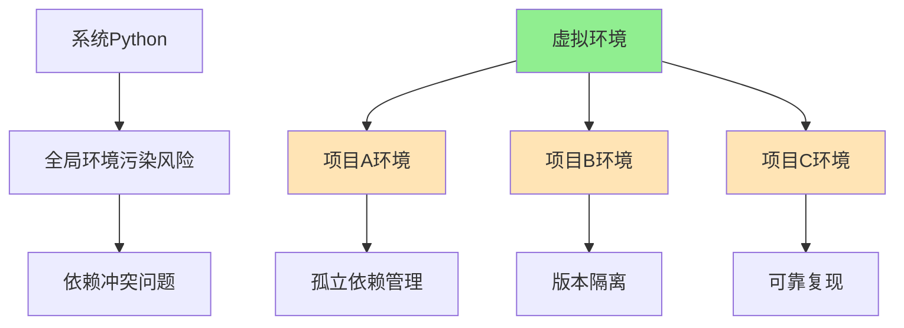

# 1.3.1 虚拟环境实战指南

## 🎯 核心理念

virtual environment(虚拟环境)是Python开发的"工作空间管理艺术"。它将哲学中的"隔离优于混用"体现得淋漓尽致。

### 🏗️ 虚拟环境的本质



## 🛠️ 主流工具对比

### 📊 工具选择矩阵

| 工具 | 创建速度 | 管理便利 | 团队协作 | 部署支持 | 推荐度 |
|------|----------|----------|----------|----------|--------|
| **venv** | ⭐⭐⭐ | ⭐⭐ | ⭐⭐⭐ | ⭐⭐⭐ | ⭐⭐⭐⭐⭐ |
| **conda** | ⭐⭐ | ⭐⭐⭐⭐⭐ | ⭐⭐⭐⭐ | ⭐⭐⭐⭐⭐ | ⭐⭐⭐⭐ |
| **virtualenv** | ⭐⭐⭐ | ⭐⭐⭐ | ⭐⭐ | ⭐⭐ | ⭐⭐⭐ |
| **poetry** | ⭐⭐ | ⭐⭐⭐⭐⭐ | ⭐⭐⭐⭐⭐ | ⭐⭐⭐⭐⭐ | ⭐⭐⭐⭐ |

## 🚀 实战场景：三种管理策略

### 🎯 策略1：venv - 标准Python方案

**适用场景**：学习、个人项目、标准Python开发

```bash
# 1. 创建项目环境
mkdir my_project && cd my_project
python -m venv venv --prompt "MyProject"

# 2. 激活环境 (跨平台)
# Windows:
venv\Scripts\activate

# macOS/Linux:
source venv/bin/activate

# 3. 升级pip并安装依赖
pip install --upgrade pip
pip install requests flask pytest

# 4. 生成需求文件
pip freeze > requirements.txt

# 5. 环境复制（团队分享）
pip install -r requirements.txt
```

**最佳实践脚本**：
```bash
#!/bin/bash
# venv-setup.sh - 自动化项目设置

PROJECT_NAME=$1
if [ -z "$PROJECT_NAME" ]; then
    echo "Usage: $0 <project_name>"
    exit 1
fi

mkdir $PROJECT_NAME && cd $PROJECT_NAME
python -m venv venv --prompt "$PROJECT_NAME"

# 激活并根据平台
if [[ "$OSTYPE" == "msys" ]]; then
    source venv/Scripts/activate
else
    source venv/bin/activate
fi

pip install --upgrade pip
echo "✅ Virtual environment '$PROJECT_NAME' created and activated"
echo "📝 Next: pip install <your-packages>"
```

### 🎯 策略2：conda - 数据科学方案

**适用场景**：数据科学、机器学习、科学计算

```bash
# 1. 创建conda环境
conda create -n data_env python=3.11

# 2. 激活环境
conda activate data_env

# 3. 安装科学包栈
conda install numpy pandas matplotlib scikit-learn jupyter

# 4. 导出环境配置
conda env export > environment.yml

# 5. 从yml重建环境
conda env create -f environment.yml
```

**环境配置示例**：
```yaml
# environment.yml
name: ml_project
channels:
  - conda-forge
  - defaults
dependencies:
  - python=3.11
  - numpy=1.24.0
  - pip=23.0.0
  - pip:
    - streamlit==1.25.0
    - tensorflow==2.13.0
```

### 🎯 策略3：poetry - 现代化Python方案

**适用场景**：现代Python项目、企业级开发

```bash
# 1. 安装poetry
curl -sSL https://install.python-poetry.org | python3 -

# 2. 初始化项目
poetry init

# 3. 添加依赖
poetry add requests fastapi uvicorn

# 4. 添加开发依赖
poetry add --group dev pytest black flake8

# 5. 安装所有依赖
poetry install

# 6. 激活环境
poetry shell
```

**pyproject.toml示例**：
```toml
[tool.poetry]
name = "my-awesome-project"
version = "0.1.0"
description = "A modern Python project"
authors = ["Your Name <you@example.com>"]

[tool.poetry.dependencies]
python = "^3.9"
requests = "^2.31.0"
fastapi = "^0.100.0"

[tool.poetry.group.dev.dependencies]
pytest = "^7.4.0"
black = "^23.0.0"
flake8 = "^6.0.0"

[build-system]
requires = ["poetry-core"]
build-backend = "poetry.core.masonry.api"
```

## 🔧 高级技巧与优化

### ⚡ 环境启动优化

**Shell函数自动激活**：
```bash
# ~/.bashrc 或 ~/.zshrc
auto_activate_venv() {
    if [[ -f "pyproject.toml" ]]; then
        # Poetry项目自动激活
        poetry shell --quiet
    elif [[ -f "Pipfile" ]]; then
        # Pipenv项目自动激活  
        pipenv shell --quiet
    elif [[ -f ".venv/bin/activate" ]]; then
        # 标准venv自动激活
        [[ "$VIRTUAL_ENV" == "" ]] && source .venv/bin/activate 2>/dev/null
    elif [[ -f "venv/bin/activate" ]]; then
        [[ "$VIRTUAL_ENV" == "" ]] && source venv/bin/activate 2>/dev/null
    fi
}

# 进入目录时自动激活
cd() {
    builtin cd "$@"
    auto_activate_venv
}
```

### 🎨 快速环境模板

**Python脚本自动化**：
```python
#!/usr/bin/env python3
"""虚拟环境管理工具"""
import subprocess
import sys
from pathlib import Path

class VenvManager:
    def __init__(self, project_name, python_version="3.11"):
        self.project_name = project_name
        self.python_version = python_version
        self.project_path = Path(project_name)
        
    def create_project(self):
        """创建项目结构"""
        self.project_path.mkdir(exist_ok=True)
        
        # 创建虚拟环境
        env_cmd = [
            sys.executable, "-m", "venv", 
            str(self.project_path / "venv"),
            f"--prompt={self.project_name}"
        ]
        subprocess.run(env_cmd)
        
        # 创建基础文件
        self._create_gitignore()
        self._create_readme()
        self._create_basic_files()
        
        print(f"✅ Project '{self.project_name}' created successfully")
        print(f"📂 Location: {self.project_path.absolute()}")
        print(f"🚀 Next steps:")
        print(f"   cd {self.project_name}")
        print(f"   source venv/bin/activate  # Linux/Mac")
        print(f"   venv\\Scripts\\activate    # Windows")
    
    def _create_gitignore(self):
        """创建.gitignore"""
        gitignore_content = """# Python
__pycache__/
*.pyc
*.pyo
*.pyd
.Python
venv/
env/
ENV/

# IDE
.vscode/
.idea/
*.swp
*.swo

# Testing
.pytest_cache/
.coverage
htmlcov/

# Distribution
dist/
build/
*.egg-info/
"""
        (self.project_path / ".gitignore").write_text(gitignore_content)
    
    def _create_readme(self):
        """创建README"""
        readme_content = f"""# {self.project_name}

## Setup

```bash
# Create virtual environment
python -m venv venv

# Activate environment
source venv/bin/activate  # Linux/Mac
venv\\Scripts\\activate    # Windows

# Install dependencies
pip install -r requirements.txt
```

## Development

```bash
# Install development dependencies
pip install -r requirements-dev.txt

# Run tests
pytest

# Format code
black .
```
"""
        (self.project_path / "README.md").write_text(readme_content)

if __name__ == "__main__":
    import sys
    project_name = sys.argv[1] if len(sys.argv) > 1 else "my_project"
    manager = VenvManager(project_name)
    manager.create_project()
```

## 🔍 疑难问题解决

### ⚠️ 常见问题与解决方案

**问题1：环境激活失败**
```bash
# 症状：source venv/bin/activate 无响应
# 解决：
python -m venv --upgrade --force venv
```

**问题2：依赖包冲突**
```bash
# 症状：ImportError: cannot import name 'xxx'
# 解决：清理并重建
pip install --upgrade pip
pip uninstall -y -r requirements.txt
pip install -r requirements.txt
```

**问题3：环境变慢**
```bash
# 症状：pip install 很慢
# 解决：使用国内镜像
pip install -i https://pypi.tuna.tsinghua.edu.cn/simple/ package_name
```

### 🧹 环境清理脚本

```bash
#!/bin/bash
# cleanup-venvs.sh

echo "🔍 发现以下虚拟环境："
ls -la ~/.virtualenvs/

read -p "确定要清理所有无用的虚拟环境吗? (y/N): " confirm
if [[ $confirm == [yY] ]]; then
    echo "🧹 开始清理..."
    # 清理孤立的环境
    find ~/.virtualenvs -name "*.lock" -type f -delete
    echo "✅ 环境清理完成"
else
    echo "❌ 取消清理操作"
fi
```

## 🧪 刻意练习：环境管理

### 📝 练习1：多环境对比

**任务**：创建一个项目，分别用三种方式管理：
1. venv + requirements.txt
2. conda + environment.yml  
3. poetry + pyproject.toml

**对比分析**：
- 创建速度
- 依赖管理便利性
- 团队协作友好度
- 部署便利性

### 🎯 练习2：环境迁移脚本

**任务**：编写脚本实现三种格式间的转换：
```
requirements.txt ↔ environment.yml ↔ pyproject.toml
```

### 🔬 练习3：自动化环境检测

**任务**：编写脚本检测：
- 当前激活的虚拟环境类型
- 环境中的包与版本
- 潜在的依赖冲突
- 环境健康状况评估

## 🔗 知识连接

- **基础配置**：[[1.3 环境配置方案]]
- **依赖管理进阶**：[[1.3.2 包依赖管理最佳实践]]
- **开发工具链**：[[1.4 开发工具链配置]]
- **项目架构**：[[4.3.1 项目架构设计模式]]

## 💡 费曼检验

**向初学Python的同事解释：为什么需要虚拟环境，以及如何选择合适的环境管理工具？**

核心要点：
1. **隔离的价值**：每个项目独立的依赖空间，避免"在我的机器上能跑"问题
2. **复现的可靠性**：精确控制包版本，确保环境一致性
3. **选择的智慧**：venv适合学习，conda适合数据科学，poetry适合现代开发
4. **实践的便利**：自动化工具减少手动操作的错误和繁琐

---

📚 **扩展阅读**：
- [[⚡ 快速概念辞典]] - "虚拟环境"、"包管理"术语
- [[🗺️ Python学习全景图]] - 整体学习架构

🎯 **下个目标**：学习[[1.3.2 包依赖管理最佳实践]]中的高级依赖管理技巧
