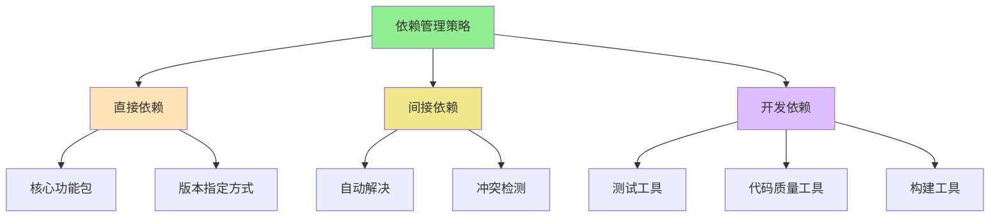

# 1.3.2 包依赖管理最佳实践

## 🎯 核心理念 

依赖管理是Python项目的"契约管理"。它体现了"可靠性胜过便利性"的工程原则 - 一个小小的版本冲突可能毁掉整个项目。

### 🏗️ 依赖管理的层次结构



## 🛠️ 版本约束策略

### 📋 语义化版本控制

| 格式 | 含义 | 更新策略 | 稳定性 | 适用场景 |
|------|------|----------|--------|----------|
| `==1.2.3` | 严格版本 | 手动更新 | ⭐⭐⭐⭐⭐ | 生产环境 |
| `~=1.2.3` | 兼容版本 | 自动安全更新 | ⭐⭐⭐⭐ | 稳定项目 |
| `>=1.2.3,<2.0.0` | 范围版本 | 自动更新 | ⭐⭐⭐ | 开发阶段 |
| `^1.2.3` | 主版本兼容 | 自动更新 | ⭐⭐ | 现代工具 |

### 🎨 高级约束示例

```bash
# requirements.txt - 多文件分离策略
# requirements.txt (生产依赖)
requests>=2.28.0,<3.0.0
fastapi>=0.80.0,<1.0.0
pydantic>=1.10.0,<2.0.0

# requirements-dev.txt (开发依赖)  
pytest>=7.0.0,<8.0.0
pytest-asyncio>=0.20.0,<1.0.0
black>=22.0.0,<24.0.0
flake8>=5.0.0,<7.0.0
mypy>=0.991,<1.0.0

# requirements-test.txt (测试环境)
pytest-cov>=4.0.0,<5.0.0
hypothesis>=6.0.0,<7.0.0
factory-boy>=3.0.0,<4.0.0

# requirements-docs.txt (文档相关)
sphinx>=5.0.0,<6.0.0
sphinx-rtd-theme>=1.0.0,<2.0.0
```

## 🚀 现代依赖管理工具

### 📊 pip-tools：企业级解决方案

```python
# requirements.in.txt (直接依赖)
requests>=2.28.0
fastapi>=0.80.0
pydantic>=1.10.0

# 编译生成具体版本
pip-compile requirements.in.txt
# 输出到 requirements.txt (包含间接依赖)

# 同步到当前环境
pip-sync requirements.txt

# 开发依赖分离
pip-compile requirements-dev.in.txt
pip-compile requirements-test.in.txt
```

**pipeline.in.txt**：
```bash
requests>=2.28.0
fastapi>=0.80.0
pydantic>=1.10.0

# 开发依赖
--index-url https://pypi.org/simple/
-r requirements-dev.in.txt
```

### 🎯 Poetry：现代化Python方案

```toml
# pyproject.toml
[tool.poetry]
name = "awesome-project"
version = "0.1.0"
description = "A modern Python project"
authors = ["Developer <dev@example.com>"]

[tool.poetry.dependencies]
python = "^3.9"
requests = "^2.28.0"
fastapi = {version = "^0.80.0", extras = ["all"]}
pydantic = "^1.10.0"

[tool.poetry.group.dev.dependencies]
pytest = "^7.0.0"
pytest-cov = "^4.0.0"
black = "^22.0.0"
flake8 = "^5.0.0"
mypy = "^0.991"

[tool.poetry.group.test.dependencies]
hypothesis = "^6.0.0"
factory-boy = "^3.0.0"
pytest-mock = "^3.0.0"

# 可选依赖
[tool.poetry.extras]
redis = ["redis-py", "hiredis"]
database = ["sqlalchemy", "alembic", "psycopg2"]
monitoring = ["prometheus-client", "sentry-sdk"]
```

### 🔧 Pipenv：传统与现代的结合

```toml
# Pipfile
[[source]]
url = "https://pypi.org/simple"
verify_ssl = true
name = "pypi"

[packages]
requests = ">=2.28.0"
fastapi = ">=0.80.0"
pydantic = ">=1.10.0"

[dev-packages]
pytest = "*"
black = "*"
flake8 = "*"
mypy = "*"

[requires]
python_version = "3.9"
```

## 🔍 依赖冲突检测与解决

### ⚡ pip-audit：安全审计工具

```bash
# 安装安全审计工具
pip install pip-audit

# 审计当前环境
pip-audit

# 输出：
# Found 2 known security vulnerabilities
# requests 2.25.1 (< 2 Snyk IDs)
#   CVE-2023-32681: High severity
#   CVE-2023-32681: High severity
```

### 🧹 pipdeptree：依赖树分析

```bash
# 安装依赖树分析工具
pip install pipdeptree

# 查看依赖树
pipdeptree

# 查找特定包的依赖者
pipdeptree -p requests

# 查找冲突
pipdeptree --conflict
```

### 🎯 dependency-injection：依赖注入模式

```python
# dependency_injection.py
from abc import ABC, abstractmethod
from typing import Protocol

class DatabaseProtocol(Protocol):
    def get_user(self, user_id: int): ...

class UserService:
    def __init__(self, database: DatabaseProtocol):
        self.database = database
    
    def get_user_profile(self, user_id: int):
        return self.database.get_user(user_id)

# 生产环境使用
class PostgreSQLDatabase:
    def get_user(self, user_id: int):
        # PostgreSQL implementation
        pass

# 测试环境使用  
class MockDatabase:
    def get_user(self, user_id: int):
        # Mock implementation
        return {"id": user_id, "name": "Test User"}

# 依赖配置
class Container:
    def configure(self, env: str):
        if env == "production":
            self.database = PostgreSQLDatabase()
        else:
            self.database = MockDatabase()
        
        self.user_service = UserService(self.database)
```

## 🧪 依赖性最佳实践

### 📝 练习1：依赖冲突解决

**任务**：分析并解决以下冲突场景：

```bash
# 场景：FastAPI项目
# Package A requires requests>=2.28.0
# Package B requires requests==2.25.0  
# Package C requires fastapi>=0.80.0
# Package D requires django>=4.0.0
```

**解决策略**：
1. 使用pip-tools进行冲突检测
2. 人工分析真正的冲突原因
3. 选择合适的替代方案
4. 更新依赖约束

### 🎯 练习2：多环境依赖管理

**任务**：设计支持以下场景的依赖管理方案：
- 开发环境：包含调试工具
- 测试环境：包含测试框架
- 生产环境：仅运行时依赖
- CI环境：构建和测试工具

### 🔬 练习3：依赖安全性检查

**任务**：建立一个依赖安全检查系统：

```python
#!/usr/bin/env python3
"""依赖安全检查脚本"""
import subprocess
import json
from dataclasses import dataclass
from typing import List

@dataclass
class SecurityVulnerability:
    package: str
    version: str
    severity: str
    cve_id: str
    description: str

class DependencyAuditor:
    def __init__(self, requirements_file: str):
        self.requirements_file = requirements_file
        
    def audit_dependencies(self) -> List[SecurityVulnerability]:
        """审计依赖安全性"""
        # 使用pip-audit进行安全检查
        result = subprocess.run(
            ["pip-audit", "--json", "-r", self.requirements_file],
            capture_output=True, text=True
        )
        
        vulnerabilities = []
        if result.returncode == 0:
            data = json.loads(result.stdout)
            for vuln in data.get('vulnerabilities', []):
                vulnerabilities.append(SecurityVulnerability(
                    package=vuln['name'],
                    version=vuln['version'],
                    severity=vuln['severity'], 
                    cve_id=vuln.get('id', ''),
                    description=vuln.get('description', '')
                ))
        
        return vulnerabilities
    
    def generate_report(self) -> str:
        """生成安全报告"""
        vulnerabilities = self.audit_dependencies()
        
        if not vulnerabilities:
            return "✅ 未发现已知的安全漏洞"
        
        report = ["🚨 发现安全漏洞："]
        for vuln in vulnerabilities:
            report.append(f"- {vuln.package} {vuln.version}: {vuln.severity}")
            report.append(f"  CVE-{vuln.cve_id}: {vuln.description}")
        
        return "\n".join(report)

if __name__ == "__main__":
    auditor = DependencyAuditor("requirements.txt")
    print(auditor.generate_report())
```

## 🔗 知识连接

- **虚拟环境基础**：[[1.3.1 虚拟环境实战指南]]
- **环境配置方案**：[[1.3 环境配置方案]]
- **开发工具链**：[[1.4 开发工具链配置]]
- **代码质量保证**：[[4.3.3 代码质量保证体系]]

## 💡 费曼检验

**向项目经理解释：为什么严格的依赖管理对于软件项目至关重要？**

核心要点：
1. **风险控制**：未管控的依赖变更可能导致系统崩溃
2. **成本节约**：提前发现和解决冲突比运行时调试便宜得多  
3. **团队协作**：统一的依赖版本确保团队环境一致性
4. **安全考量**：及时更新消除已知安全漏洞

---

📚 **扩展阅读**：
- [[⚡ 快速概念辞典]] - "依赖"、"版本控制"术语
- [[🗺️ Python学习全景图]] - 整体学习架构

🎯 **下个目标**：配置[[1.4 开发工具链配置]]中的专业开发环境
