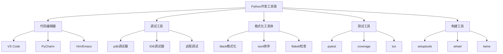

# 1.4 开发工具链配置

## 🎯 核心理念

专业的开发工具链是Python高手必备的"扩展能力"。它体现了"工欲善其事，必先利其器"的理念 - 好的工具能放大你的能力十倍。

### 🛠️ 开发工具链架构



## 📱 IDE选择策略

### 🎯 VS Code配置（推荐）

**核心扩展安装**：
```json
// settings.json
{
    "python.defaultInterpreterPath": "./.venv/bin/python",
    "python.linting.enabled": true,
    "python.linting.pylintEnabled": false,
    "python.linting.flake8Enabled": true,
    "python.linting.mypyEnabled": true,
    "python.formatting.provider": "black",
    "python.sortImports.args": ["--profile", "black"],
    "editor.formatOnSave": true,
    "editor.codeActionsOnSave": {
        "source.organizeImports": true
    },
    "python.testing.pytestEnabled": true,
    "python.testing.unittestEnabled": false
}
```

**任务配置文件**：
```json
// tasks.json
{
    "version": "2.0.0",
    "tasks": [
        {
            "label": "Format",
            "type": "shell",
            "command": "black",
            "args": ["${workspaceFolder}"],
            "group": "build"
        },
        {
            "label": "Lint",
            "type": "shell", 
            "command": "flake8",
            "args": ["${workspaceFolder}"],
            "group": "build"
        },
        {
            "label": "Test",
            "type": "shell",
            "command": "pytest",
            "args": ["${workspaceFolder}"],
            "group": "test"
        }
    ]
}
```

### 🎯 PyCharm配置（专业版）

**代码风格设置**：
- Formatter: Black
- Line length: 88
- Import sorting: isort
- Docstring format: Google

**运行配置**：
```python
# 调试配置示例
import os
import sys

# 环境变量设置
os.environ['DEBUG'] = '1'
os.environ['LOG_LEVEL'] = 'DEBUG'

# 调试启动代码
def main():
    print("Starting application...")
    # 在这里设置断点
    run_application()

if __name__ == "__main__":
    main()
```

## 🔧 自动化工具配置

### ⚡ Pre-commit: 代码质量门禁

```yaml
# .pre-commit-config.yaml
repos:
  - repo: https://github.com/psf/black
    rev: 23.3.0
    hooks:
      - id: black
        language_version: python3

  - repo: https://github.com/pycqa/isort
    rev: 5.12.0
    hooks:
      - id: isort
        args: ["--profile", "black"]

  - repo: https://github.com/pycqa/flake8
    rev: 6.0.0
    hooks:
      - id: flake8

  - repo: https://github.com/pre-commit/mirrors-mypy
    rev: v1.3.0
    hooks:
      - id: mypy
        additional_dependencies: [types-requests]

  - repo: local
    hooks:
      - id: pytest
        name: pytest
        entry: pytest
        language: system
        always_run: true
        pass_filenames: false
```

### 🎨 Makefile自动化

```makefile
# Makefile
.PHONY: help install test clean lint format run

help: ## 显示帮助信息
	@echo "Available commands:"
	@grep -E '^[a-zA-Z_-]+:.*?## .*$$' $(MAKEFILE_LIST) | awk 'BEGIN {FS = ":.*?## "}; {printf "  \033[36m%-20s\033[0m %s\n", $$1, $$2}'

install: ## 安装依赖
	pip install -r requirements.txt
	pip install -r requirements-dev.txt

test: ## 运行测试
	pytest -v --cov=src --cov-report=html

lint: ## 代码检查
	flake8 src tests
	mypy src tests

format: ## 代码格式化
	black src tests
	isort src tests

clean: ## 清理临时文件
	find . -type f -name "*.pyc" -delete
	find . -type d -name "__pycache__" -delete
	rm -rf .pytest_cache
	rm -rf htmlcov

run: ## 运行应用
	python -m src.main

setup: ## 初始项目设置
	python -m venv .venv
	@echo "Virtual environment created. Please activate it:"
	@echo "  source .venv/bin/activate  # Linux/Mac"
	@echo "  .venv\\Scripts\\activate    # Windows"
	pip install --upgrade pip
	make install
	pre-commit install
```

## 🧪 高级调试技巧

### 🔍 Python调试工具链

```python
#!/usr/bin/env python3
"""调试工具示例"""

import pdb
import logging
from functools import wraps

# 1. 基础pdb调试
def debug_function():
    x = 1
    pdb.set_trace()  # 断点
    y = x + 1
    return y

# 2. 条件断点
def conditional_debug(value):
    if value > 10:
        pdb.set_trace()  # 只有value>10时才进入调试

# 3. 日志调试
logging.basicConfig(
    level=logging.DEBUG,
    format='%(asctime)s - %(name)s - %(levelname)s - %(message)s'
)

logger = logging.getLogger(__name__)

def log_decorator(func):
    @wraps(func)
    def wrapper(*args, **kwargs):
        logger.debug(f"Calling {func.__name__} with args={args}, kwargs={kwargs}")
        result = func(*args, **kwargs)
        logger.debug(f"{func.__name__} returned {result}")
        return result
    return wrapper

@log_decorator
def example_function(x, y):
    return x + y

# 4. 性能分析
import cProfile
import pstats
from io import StringIO

def profile_function(func):
    pr = cProfile.Profile()
    pr.enable()
    result = func()
    pr.disable()
    
    s = StringIO()
    ps = pstats.Stats(pr, stream=s).sort_stats('cumulative')
    ps.print_stats()
    return s.getvalue()

def slow_function():
    total = 0
    for i in range(1000000):
        total += i
    return total

# 使用示例
if __name__ == "__main__":
    # 调试示例
    debug_function()
    
    # 日志示例
    example_function(1, 2)
    
    # 性能分析示例
    print("Profile result:")
    print(profile_function(slow_function))
```

## 🎯 持续集成配置

### 📋 GitHub Actions示例

```yaml
# .github/workflows/python-app.yml
name: Python CI

on:
  push:
    branches: [ main, develop ]
  pull_request:
    branches: [ main ]

jobs:
  test:
    runs-on: ubuntu-latest
    strategy:
      matrix:
        python-version: [3.9, 3.10, 3.11]

    steps:
    - uses: actions/checkout@v3
    
    - name: Set up Python ${{ matrix.python-version }}
      uses: actions/setup-python@v4
      with:
        python-version: ${{ matrix the-python-version }}
    
    - name: Install dependencies
      run: |
        python -m pip install --upgrade pip
        pip install -r requirements.txt
        pip install -r requirements-dev.txt
    
    - name: Lint with flake8
      run: |
        flake8 src tests
    
    - name: Type check with mypy
      run: |
        mypy src tests
    
    - name: Test with pytest
      run: |
        pytest tests/ --cov=src --cov-report=xml
    
    - name: Upload coverage to Codecov
      uses: codecov/codecov-action@v3
      with:
        file: ./coverage.xml
        flags: unittests
```

## 🔗 知识连接

- **环境配置**：[[1.3 环境配置方案]]
- **虚拟环境**：[[1.3.1 虚拟环境实战指南]]
- **依赖管理**：[[1.3.2 包依赖管理最佳实践]]
- **代码质量**：[[4.3.3 代码质量保证体系]]

## 💡 费曼检验

**向新同事介绍：为什么需要配置专业的Python开发工具链？**

核心要点：
1. **效率倍增**：好的工具能提高10倍开发效率
2. **质量保证**：自动化检查避免低级错误
3. **团队协作**：统一的工具链确保代码风格一致
4. **专业形象**：展示对开发工具的深入理解

---

📚 **扩展阅读**：
- [[⚡ 快速概念辞典]] - "IDE"、"调试"等术语
- [[🗺️ Python学习全景图]] - 整体学习架构

🎯 **下个目标**：开始学习[[1.5 语法基础框架]]中的Python语法核心
