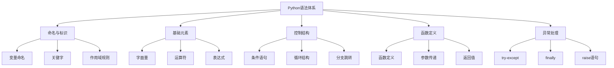

# 1.5 Python语法基础框架

## 🎯 核心理念

Python语法设计的核心是"显式胜过隐式"和"可读性很重要"。每个语法特征都体现了Python哲学的精髓。

### 🏗️ 语法层次结构



## 📝 命名与标识系统

### 🏷️ Python命名约定

| 命名场景 | 约定风格 | 示例 | 说明 |
|----------|----------|------|------|
| **变量** | snake_case | `user_name` | 小写下划线 |
| **函数** | snake_case | `get_user_data` | 动词+名词 |
| **类** | PascalCase | `UserManager` | 首字母大写 |
| **常量** | UPPER_CASE | `MAX_RETRY_COUNT` | 全大写 |
| **私有** | _leading_underscore | `_internal_method` | 单下划线前缀 |
| **魔术** | __double_underscore__ | `__init__` | 双下划线包围 |

### 🎯 关键字与内置名称

```python
# Python关键字（不能作为变量名）
import keyword
print("Python关键字:", keyword.kwlist)

# 常用关键字
# True, False, None        # 字面量
# if, elif, else          # 条件
# for, while, break, continue  # 循环
# def, return            # 函数
# class, self           # 类
# try, except, finally  # 异常
# and, or, not          # 逻辑
# in, is               # 关系
```

## 🔧 基础元素构成

### 📊 操作符优先级

```python
# 操作符优先级（从高到低）
print("操作符优先级验证:")
result = 1 + 2 * 3     # 乘法优先：7
result2 = (1 + 2) * 3  # 括号优先：9

# 复合表达式示例
x = 5
y = 10
z = x + y * 2 / 3 - 1  # 按优先级计算

print(f"x + y * 2 / 3 - 1 = {z}")
```

### 🎨 表达式vs语句

```python
# 表达式（有返回值）
result = 3 + 4 * 2        # 返回值: 11
condition = x > 5         # 返回值: True/False
list_comp = [x*2 for x in range(5)]  # 返回值: [0, 2, 4, 6, 8]

# 语句（无返回值）
x = 10                   # 赋值语句
print("Hello")           # 打印语句
if x > 5: pass          # 条件语句
```

## 🛠️ 控制结构模式

### 🎯 条件结构最佳实践

```python
# ✅ 推荐的if-elif-else结构
def grade_classification(score):
    """成绩分级 - 展示良好的条件结构设计"""
    if score >= 90:
        return "A"
    elif score >= 80:
        return "B"
    elif score >= 70:
        return "C"
    elif score >= 60:
        return "D"
    else:
        return "F"

# ✅ 三元操作符
grade = "Pass" if score >= 60 else "Fail"

# ✅ 条件表达式链
status = "excellent" if score >= 90 else \
         "good" if score >= 80 else \
         "average" if score >= 70 else "poor"
```

### 🔄 循环结构模式

```python
# for循环 - 迭代已知序列
fruits = ["apple", "banana", "orange"]
for fruit in fruits:
    print(f"我喜欢{fruit}")

# enumerate - 获取索引
for i, fruit in enumerate(fruits, 1):  # 从1开始计数
    print(f"{i}. {fruit}")

# zip - 并行迭代
names = ["Alice", "Bob", "Charlie"]
ages = [25, 30, 35]
for name, age in zip(names, ages):
    print(f"{name}今年{age}岁")

# while循环 - 条件控制
count = 0
while count < 3:
    print(f"计数: {count}")
    count += 1
# ✅ 避免无限循环的安全性检查
```

## 🎨 函数定义模式

### 📋 函数签名设计

```python
# ✅ 良好的函数设计原则
def calculate_tax(income: float, 
                  rate: float = 0.1,   # 默认参数
                  include_penalty: bool = False) -> float:
    """
    计算税费
    
    Args:
        income: 收入金额
        rate: 税率，默认0.1
        include_penalty: 是否包含罚金
    
    Returns:
        计算后的税费金额
    
    Raises:
        ValueError: 当收入为负数时
    """
    if income < 0:
        raise ValueError("收入不能为负数")
    
    tax = income * rate
    if include_penalty:
        tax *= 1.1
    
    return tax

# ✅ 使用示例
try:
    result = calculate_tax(1000, 0.15, True)
    print(f"税费: {result}")
except ValueError as e:
    print(f"错误: {e}")
```

### 🔧 参数传递模式

```python
# 位置参数
def greet(name, greeting="Hello"):
    return f"{greeting}, {name}!"

# 关键字参数
message = greet(greeting="Hi", name="Alice")

# 可变参数
def sum_numbers(*args):
    """接收任意数量的位置参数"""
    return sum(args)

result = sum_numbers(1, 2, 3, 4, 5)

# 关键字可变参数
def print_user(**kwargs):
    """接收任意数量的关键字参数"""
    for key, value in kwargs.items():
        print(f"{key}: {value}")

print_user(name="Alice", age=25, city="Beijing")
```

## 🚨 异常处理框架

### 💡 异常处理最佳实践

```python
class CustomError(Exception):
    """自定义异常类"""
    def __init__(self, message, code=None):
        super().__init__(message)
        self.code = code

def safe_divide(a: float, b: float) -> float:
    """安全除法运算"""
    try:
        result = a / b
    except ZeroDivisionError:
        raise CustomError("除数不能为零", code="DIVISION_BY_ZERO")
    except TypeError as e:
        raise CustomError(f"类型错误: {str(e)}", code="TYPE_ERROR")
    else:
        print("计算成功完成")
        return result
    finally:
        print("除法操作结束")

# ✅ 异常处理层级
def main():
    try:
        result = safe_divide(10, 0)
        print(f"结果: {result}")
    except CustomError as e:
        print(f"自定义错误 #{e.code}: {e}")
    except Exception as e:
        print(f"未知错误: {e}")
```

## 🧪 语法模式练习

### 📝 练习1：代码重构

**任务**：重构以下代码，使其更符合Python语法最佳实践

```python
# 需要重构的代码
def processData(dataList):
    result=[]
    for i in range(len(dataList)):
        if dataList[i]>0:
            if dataList[i]%2==0:
                result.append(dataList[i]*2)
    return result
```

**改进方向**：
1. 遵循PEP8命名规范
2. 使用列表推导式
3. 添加类型提示
4. 增加文档字符串

### 🎯 练习2：循环结构优化

**任务**：优化以下循环结构

```python
# 优化前
i = 0
while i < len(items):
    print(f"Item {i}: {items[i]}")
    i += 1

# 要求：使用更Pythonic的方式
```

### 🔬 练习3：异常处理设计

**任务**：设计一个计算器类，包含完善的异常处理

```python
class Calculator:
    # 需要实现的方法：
    # - add(a, b)
    # - subtract(a, b) 
    # - multiply(a, b)
    # - divide(a, b)
    # 
    # 异常处理要求：
    # - 输入类型验证
    # - 除零处理
    # - 溢出检测
```

## 🔗 知识连接

- **语言哲学**：[[1.1 Python语言哲学]] - 语法设计背后的哲学
- **解释器原理**：[[1.2 解释器原理与字节码]] - 语法的底层实现
  - **数据类型**：[[1.6 数据类型深度解析]] - 语法与数据类型的结合
- **控制流进阶**：[[1.7 控制流与代码组织]] - 复杂程序流程控制
- **函数设计**：[[1.8 函数设计原则]] - 深度函数化编程

## 💡 费曼检验

**向初学者解释：Python语法设计的核心特点是什么，为什么这样设计？**

核心要点：
1. **可读性第一**：代码要能像英语一样阅读
2. **明确优于隐含**：明确的语法规则避免歧义
3. **简洁而不简陋**：最小必要的语法元素
4. **一致性原则**：相似的操作用相似的语法

---

📚 **扩展阅读**：
- [[⚡ 快速概念辞典]] - "语法"、"关键字"等术语
- [[🗺️ Python学习全景图]] - 整体学习架构

🎯 **下个目标**：深入学习[[1.6 数据类型深度解析]]中Python的丰富数据类型系统
