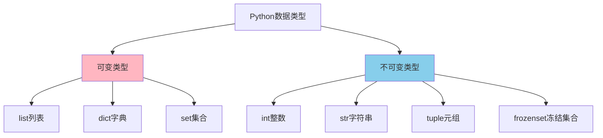

# 1.6 数据类型深度解析

## 🎯 核心理解

Python的数据类型不仅仅是一个"容器"，它们是程序行为的基础。理解数据类型的本质，就是理解Python程序的运行原理。

### 🏗️ 数据类型层次体系



## 🔍 五大核心数据类型

### 📊 类型对比矩阵

| 数据类型 | 可变性 | 索引访问 | 重复元素 | 性能O() | 使用场景 |
|----------|--------|----------|----------|---------|----------|
| **list** | ✅可变 | ✅有序 | ✅允许 | O(1) | 动态数据集合 |
| **tuple** | ❌不可变 | ✅有序 | ✅允许 | O(1) | 固定数据、函数返回 |
| **dict** | ✅可变 | ❌键值 | ❌键不可重 | O(1) | 映射关系、缓存 |
| **set** | ✅可变 | ❌无序 | ❌不重复 | O(1) | 去重、集合运算 |
| **str** | ❌不可变 | ✅有序 | ✅允许 | O(1) | 文本处理 |

## 🚀 数据类型深度应用

### 🎯 List：动态数组的威力

```python
# ✅ 高效的列表操作
numbers = [1, 2, 3, 4, 5]

# 列表推导式 - Pythonic的创建方式
squares = [x**2 for x in range(10) if x % 2 == 0]  # [0, 4, 16, 36, 64]

# 嵌套结构 - 多维数据
matrix = [[x*y for x in range(3)] for y in range(3)]
# [[0, 0, 0], [0, 1, 2], [0, 2, 4]]

# ✅ 列表切片的高级用法
original = list(range(10))  # [0, 1, 2, 3, 4, 5, 6, 7, 8, 9]
reversed_list = original[::-1]  # [9, 8, 7, 6, 5, 4, 3, 2, 1, 0]
every_other = original[::2]     # [0, 2, 4, 6, 8]

# ✅ 内存高效的大数据处理
import sys
large_list = [i for i in range(1000000)]
print(f"列表内存使用: {sys.getsizeof(large_list)} bytes")
```

### 🎨 Dict：映射的艺术

```python
# ✅ 字典的高阶用法
from collections import defaultdict, Counter

# defaultdict - 自动初始化
word_counter = defaultdict(int)
for word in ["hello", "world", "hello"]:
    word_counter[word] += 1
# defaultdict(int, {'hello': 2, 'world': 1})

# Counter - 统计专家
text = "hello world hello python world"
counter = Counter(text.split())
# Counter({'hello': 2, 'world': 2, 'python': 1})

# ✅ 字典推导式与合并
users = {
    'alice': {'age': 25, 'city': 'Beijing'},
    'bob': {'age': 30, 'city': 'Shanghai'}
}

# 字典合并 (Python 3.9+)
config_a = {'debug': True, 'port': 8080}
config_b = {'debug': False, 'workers': 4}
final_config = config_a | config_b  # {'debug': False, 'port': 8080, 'workers': 4}
```

### 🎪 Set：集合运算的优势

```python
# ✅ 集合的高效运算
students_math = {'Alice', 'Bob', 'Charlie'}
students_physics = {'Bob', 'David', 'Eve'}

# 集合运算 - 数学之美
union = students_math | students_physics        # 并集
intersection = students_math & students_physics # 交集
difference = students_math - students_physics   # 差集

# ✅ 数据去重的高效操作
data = [1, 2, 2, 3, 3, 3, 4, 4, 4, 4]
unique_data = list(set(data))  # [1, 2, 3, 4] - 保持顺序需用dict

# ✅ 查找优化 - O(1)查找
membership_test = 'Alice' in students_math  # True - 比列表的O(n)快
```

### 🔤 Str：文本处理的进化

```python
# ✅ 字符串的现代操作方法
text = "  Python Programming  "

# 现代字符串方法
cleaned = text.strip()              # "Python Programming"
words = text.strip().split(' ')     # ['Python', 'Programming']
joined = '-'.join(words)           # "Python-Programming"

# ✅ f-string的威力 (Python 3.6+)
name = "Alice"
age = 30
formatted = f"{name} is {age} years old"  # "Alice is 30 years old"
price = 19.99
bill = f"Total: ${price:.2f}"           # "Total: $19.99"

# ✅ 多行字符串与格式控制
multi_line = f"""
Dear {name},

Your age is: {age}
Current time: {__import__('datetime').datetime.now()}

Best regards,
System
"""
```

### ✨ Tuple：不可变的力量

```python
# ✅ 元组在函数返回值中的优雅应用
def get_stats(data):
    """返回数据统计结果的元组"""
    return (
        len(data),                    # 计数
        sum(data) / len(data),        # 平均值
        min(data),                    # 最小值
        max(data)                     # 最大值
    )

count, average, minimum, maximum = get_stats([1, 2, 3, 4, 5])

# ✅ 命名元组的现代替代
from collections import namedtuple

Person = namedtuple('Person', ['name', 'age', 'city'])
alice = Person('Alice', 25, 'Beijing')
# Person(name='Alice', age=25, city='Beijing')

# ✅ dataclass的更优雅替代 (Python 3.7+)
from dataclasses import dataclass

@dataclass(frozen=True)  # 不可变版本
class Person:
    name: str
    age: int
    city: str
```

## 🧠 类型转换与验证

### 🔧 智能类型转换

```python
def smart_convert(value):
    """智能类型转换函数"""
    if isinstance(value, str):
        # 尝试转换为数字
        if value.isdigit():
            return int(value)
        try:
            return float(value)
        except ValueError:
            return value
    
    elif isinstance(value, (int, float)):
        return value
    
    elif isinstance(value, list):
        return tuple(value)  # 列表转元组
    
    elif isinstance(value, dict):
        return tuple(value.items())  # 字典转元组
    
    return str(value)  # 兜底转换为字符串

# ✅ 类型验证装饰器
def type_validator(*expected_types):
    def decorator(func):
        def wrapper(*args, **kwargs):
            for i, (arg, expected_type) in enumerate(zip(args, expected_types)):
                if not isinstance(arg, expected_type):
                    raise TypeError(
                        f"Argument {i} must be {expected_type.__name__}, "
                        f"got {type(arg).__name__}"
                    )
            return func(*args, **kwargs)
        return wrapper
    return decorator

@type_validator(str, int)
def greet(name: str, age: int):
    return f"Hello {name}, you are {age} years old"
```

## 🎯 高级类型操作

### 📊 数据类型性能测试

```python
import time
import random
from collections import deque

def performance_test():
    """测试不同数据类型的性能"""
    size = 100000
    
    # 列表性能测试
    start = time.time()
    test_list = list(range(size))
    for i in range(size):
        test_list[i] = i * 2
    list_time = time.time() - start
    
    # 元组性能测试 (只能创建一次)
    start = time.time()
    test_tuple = tuple(range(size))
    tuple_time = time.time() - start
    
    # 集合插入测试
    start = time.time()
    test_set = set()
    for i in range(size):
        test_set.add(i)
    set_time = time.time() - start
    
    # 字典更新测试
    start = time.time()
    test_dict = {}
    for i in range(size):
        test_dict[i] = i * 2
    dict_time = time.time() - start
    
    print(f"列表访问: {list_time:.4f}s")
    print(f"元组创建: {tuple_time:.4f}s")
    print(f"集合插入: {set_time:.4f}s")
    print(f"字典更新: {dict_time:.4f}s")

performance_test()
```

### 🔍 内存深度分析

```python
import sys
from pympler import asizeof  # pip install pympler

def analyze_memory():
    """分析不同数据类型的内存使用"""
    data_types = {
        'list': [i for i in range(1000)],
        'tuple': tuple(range(1000)),
        'set': set(range(1000)),
        'dict': {i: i for i in range(1000)},
        'string': ''.join(map(str, range(1000)))
    }
    
    print("数据类型内存分析:")
    print("-" * 40)
    for name, data in data_types.items():
        sys_size = sys.getsizeof(data)
        pympler_size = asizeof.asizeof(data)
        print(f"{name:8}: sys={sys_size:6}B, pympler={pympler_size:6}B")

analyze_memory()
```

## 🧪 数据类型实战练习

### 📝 练习1：高效数据处理

**任务**：实现一个高效的购物车系统

```python
# 要求使用合适的数据类型实现
# - 添加商品
# - 修改数量  
# - 计算总价
# - 查找折扣
# - 合并购物车

from typing import Dict, List, Tuple
from decimal import Decimal

class ShoppingCart:
    # 你的实现...
```

### 🎯 练习2：数据去重分析

**任务**：分析不同类型数据去重的性能差异

```python
# 比较不同去重方法在大数据集上的表现
def compare_deduplication():
    # 产生测试数据
    # 实现多种去重算法
    # 比较性能差异
    # 分析内存使用情况
    pass
```

### 🔬 练习3：类型系统设计

**任务**：设计一个类型安全的配置系统

```python
from typing import Union, Dict, Any, TypeVar, Generic, Type

T = TypeVar('T')

class TypeSafeConfig(Generic[T]):
    # 实现类型安全的配置管理
    # 支持自动类型转换
    # 提供验证功能
    # 嵌套配置支持
    pass
```

## 🔗 知识连接

- **语法基础**：[[1.5 语法基础框架]] - 数据类型与语法的结合
- **底层实现**：[[2.2.1 内置数据结构的底层实现]] - 类型的内部机制
- **面向对象**：[[2.1 面向对象编程精要]] - 自定义数据类型设计
- **内存管理**：[[3.1 内存管理深度解析]] - 数据类型的内存管理

## 💡 费曼检验

**向同事解释：Python的数据类型设计哲学是什么？为什么会有可变和不可变之分？**

核心要点：
1. **万物皆对象**：Python中一切都是对象，包括不可变类型
2. **引用vs值**：理解对象引用的概念是掌握Python的关键
3. **性能vs安全**：可变类型性能更好，不可变类型更安全
4. **设计抉择**：每种设计都有其适用场景和权衡

---

📚 **扩展阅读**：
- [[⚡ 快速概念辞典]] - "数据类型"、"可变性"等术语
- [[🗺️ Python学习全景图]] - 整体学习架构

🎯 **下个目标**：学习[[1.7 控制流与代码组织]]中的复杂程序流程控制
